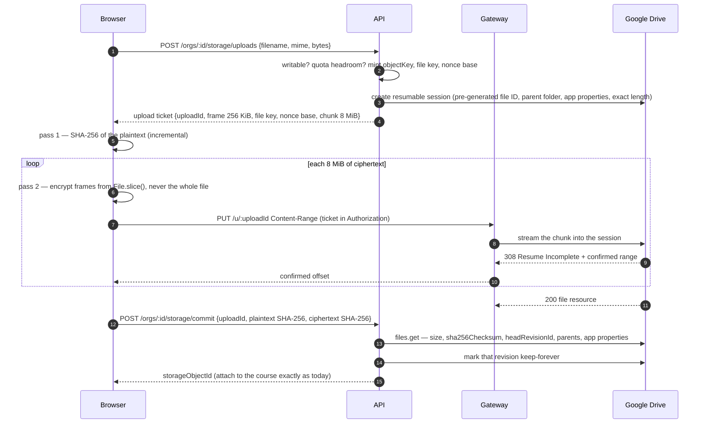

# 07 — Google Drive: the architecture

*Design for review, written 2026-09-29. **Nothing in this document is built.** The owner's
decisions so far are in the README's decision log; the choices still open are questions 9–18
in `05-open-questions.md`; every failure case and its protection is in
`08-google-drive-failure-modes.md`. Where this document and `docs/structure.md` §9 disagree,
§9 wins — and §9 describes Drive only as far as §9.16 goes.*

*References: **§9.x** is `docs/structure.md` §9; a bare **§7** or **§12** is a section of this
document; **question N** is in `05-open-questions.md`; **A1**, **E1** and so on are rows of
document 08.*

---

## What was asked

In your words, then mine.

1. **Google Drive becomes a storage backend** — for file storage *and* for streaming audio and
   video, the way NAS is today.
2. **An encrypted version and a non-encrypted version.** The same two postures NAS offers
   (§9.5), both available on Drive.
3. **Speed over compression.** When the two pull against each other, speed wins.
4. **Enterprise or personal.** A Google Workspace organization and someone with an ordinary
   Gmail account must both be able to use it.
5. **Every bad case, and how we protect ourselves from it** — document 08.
6. **The documents updated to match** — the last section of this document lists what changed
   now and what changes when it ships.

---

## The short version

The eleven things that make this design what it is. Everything below expands one of them.

1. **Bytes cross our infrastructure on Drive, in both directions.** This is not a choice. Drive
   has no signed link for a single file, and its upload endpoint cannot be driven from a
   browser (the continuation step returns no CORS headers). So a **streaming gateway** we run
   carries every upload and every read. NAS keeps its zero-bandwidth property; Drive cannot
   have it.
2. **Control plane and data plane are separate.** The API decides (`can()`, keys, tickets);
   the gateway only carries bytes for a ticket the API signed. The gateway holds no
   permissions, no database connection and no long-lived Google credentials.
3. **A Google access token never reaches a browser.** Drive tokens are identity-wide, not
   per-file: handing one out would let any member enumerate, download — and, with the scopes
   an upload needs, delete — every object in the organization's folder.
4. **Encrypted is the fast path on Drive, not the slow one.** Encrypted objects are
   ciphertext, so the gateway can cache them, never sees plaintext, and the browser decrypts.
   Plain objects cross the gateway as plaintext and are never cached by us.
5. **Streaming is real streaming.** A service worker in the browser turns the video player's
   `Range` requests into ranges of the encrypted object, decrypts only the frames it needs,
   and answers the player. Seeking works; a 200 MB video never has to fit in a phone's memory.
6. **Small frames for new objects — 256 KiB.** The `.kvblob` format already carries its frame
   size in the header, so this is a per-object choice, not a format change. It cuts the time to
   first frame by 16× against today's 4 MiB frames.
7. **Nothing is compressed — ever.** Not at rest, not on the wire. Media is already compressed,
   compression breaks seeking, and compress-then-encrypt leaks information through length.
8. **One Google identity per organization.** Google's quotas — requests, writes per second,
   daily upload volume — are counted per identity. A shared identity would let one
   organization's migration stall every other customer's uploads.
9. **Reads are pinned to the exact revision we wrote**, kept forever. Someone uploading a new
   version of a file in the Drive UI cannot change what a reader receives; we detect it and
   tell the owners.
10. **Two ways to connect, zero Google secrets we can avoid.** A *connected Google account*
    (OAuth, least-privilege `drive.file` scope) works for everyone, personal or Workspace; a
    *keyless service identity* (Workload Identity Federation) serves enterprises that want no
    person in the chain. We never accept service-account JSON keys and never use domain-wide
    delegation.
11. **It runs at $0** — Google charges nothing within its quotas, and the gateway lives on a free
    VM with 10 TB of traffic a month, never on the API's host, whose free plan allows 5 GB. It
    stops at its free allowance rather than billing past it. Document 09 has the numbers.

**One prerequisite, verified in the code:** the recovery promise in §9.11 (*storage + map +
`.main` + Supreme password recovers everything*) is not wired yet — `.main` escrows no data key
and no per-file keys. It must be wired before encrypted Drive storage ships. See §11.

---

## 1. What Drive is, as a backend

Facts about Google Drive that the design is built around, checked on 2026-09-29 (sources at the
end). Each one has a consequence; the consequences are the design.

| Fact | Consequence |
|------|-------------|
| No signed URL for a single file. Sharing links are either public or need the reader's own Google session. | **Reads go through our gateway.** |
| The resumable-upload *session* endpoint answers CORS, but the continuation endpoint the bytes go to does not. A production team shipped browser-direct uploads and reverted the same day. | **Uploads go through our gateway.** Browser-direct is a spike item we do not depend on. |
| Access tokens cover everything the identity can reach, for up to an hour. There is no per-file down-scoping for Drive. | **A Google token never goes to a browser.** The gateway holds tokens; the browser holds our tickets. |
| Downloads support HTTP `Range`. | Seekable streaming is possible without holding whole files. |
| Files are addressed by an opaque ID. Names are not unique; paths are not identifiers. | We store IDs, never paths. A user dragging the folder around breaks nothing. |
| A binary file can receive new content under the same ID ("Manage versions"). Old revisions are purged 30 days later unless marked *keep forever* (up to 200 per file). | We pin our revision and mark it kept forever — reads are tamper-proof, tampering is detectable. |
| Drive computes `md5Checksum` and `sha256Checksum` for binary files. | Upload integrity is verified end to end without downloading the file again. |
| Drive's API quotas are counted per project and per identity. Google moved Drive to a quota-*unit* model in 2026, in which a download costs far more units than a metadata read. Sustained writes are capped at about **3 per second per account**, and uploads at **750 GB per account per rolling day**. | One identity per organization; coalesced large range reads; a ciphertext cache; throttled writes and migrations. |
| A file downloaded too often can be locked by Google's abuse protection for about a day (`downloadQuotaExceeded`). | The cache exists partly to keep popular files from ever triggering it. |
| Service accounts have **no storage quota** of their own. | A service identity can only write into a **Shared Drive**. |
| A Shared Drive holds at most **500,000 items, trash included**. Items in its trash are purged after 30 days, and **only Managers** can purge sooner. | We count items, warn early, and are honest that a deletion sits in trash for 30 days. |
| The `drive.file` scope covers only files the app created, or that the user chose through the Google Picker. It is non-sensitive, so no paid security assessment is required. | Least privilege for the connected-account mode, and a compromised token reaches only Knowledge Vault's files — never the rest of their Drive. |
| GCP organizations created since May 2024 block service-account key creation by default. | Asking for JSON keys would fail for a growing share of enterprises — and we do not want to hold them anyway. |

---

## 2. Architecture at a glance

```
                          ┌────────────────────────── Knowledge Vault ───────────────────────────┐
                          │                                                                      │
 ┌──────────── reader's browser ────────────┐     CONTROL PLANE              DATA PLANE          │
 │                                          │   ┌──────────────────┐    ┌───────────────────┐    │
 │  page ── asks for a ticket ─────────────────▶│  API (Fastify)   │    │  Stream gateway   │    │
 │   │                                      │   │  · can()          │    │  · verifies ticket│    │
 │   │  registers the stream + file key     │   │  · keys, DEK      │    │  · Range in/out   │    │
 │   ▼                                      │   │  · signs tickets  │    │  · ciphertext     │    │
 │  service worker ("stream client")        │   │  · Google tokens ─┼──▶ │    slice cache    │    │
 │   · Range → frames → decrypt             │   │  · Postgres       │    │  · no DB, no keys │    │
 │   · answers <video>, pdf.js,   ◀────────┼───────────────────┼────┤                   │    │
 │                         ciphertext ranges│   └──────────────────┘    └─────────┬─────────┘    │
 └──────────────────────────────────────────┘                                     │              │
                          └───────────────────────────────────────────────────────┼──────────────┘
                                                                                  │ HTTPS, Range,
                                                                                  │ pinned revision
                                                     ┌────────────────────────────▼─────────────┐
                                                     │  Google Drive API                        │
                                                     │  Shared Drive or My Drive folder         │
                                                     │  Knowledge Vault/objects/2026/09/…kvblob │
                                                     └──────────────────────────────────────────┘
```

Three planes, three jobs:

| Plane | Runs | Decides | Never holds |
|-------|------|---------|-------------|
| **Control** — the API | Render, as today | Who may read what (`can()`), which object, which key, how long a ticket lives | Document bytes in the hot path |
| **Data** — the stream gateway | Its own service, on a free VM with 10 TB of traffic a month (§8.3, document 09) | Nothing. It verifies a signature and carries bytes | Permissions, a database, long-lived credentials, keys, plaintext of encrypted objects |
| **Client** — the service worker | The reader's browser | How to satisfy the player's next `Range` request | Keys beyond the lifetime of the page that registered them |

The dividing line is the same one §9.1 draws between catalogue and contents, applied one level
down: **the API keeps the decisions, the gateway carries the bytes.** A compromised gateway can
serve bytes it was asked for; it cannot decide to serve anything, and it cannot decrypt.

---

## 3. Enterprise and personal accounts

### 3.1 The four shapes an organization can be

| Shape | Files are owned by | What we hold | Survives the connecting person leaving | Setup | For |
|-------|-------------------|--------------|-----------------------------------------|-------|-----|
| **Workspace · Shared Drive · service identity** (Mode B) | The Shared Drive — the organization | Nothing secret: a public configuration pointing at *their* service account | **Yes** — no person is involved | An admin with a GCP project, ~15 minutes | Enterprises and security-reviewed customers |
| **Workspace · Shared Drive · connected account** (Mode A) | The Shared Drive — the organization | One sealed refresh token | **Yes**, once someone else reconnects | One sign-in and a folder picker | Workspace organizations without a GCP project |
| **Workspace · My Drive · connected account** (Mode A) | **A person** | One sealed refresh token | **No** — if the account is deleted, the files can go with it | One sign-in | Allowed, with a warning. We steer them to a Shared Drive |
| **Personal Gmail · My Drive · connected account** (Mode A) | **A person** | One sealed refresh token | **No** | One sign-in | Small organizations, trials, individuals |

The setup screen asks two questions — *"Is this a Google Workspace account?"* (we read it from
the sign-in's `hd` claim rather than asking) and *"Do you have a Shared Drive for this?"* — and
recommends the shape in plain words. **It never lets a Workspace organization land in a
person's My Drive without saying what that means.**

### 3.2 Mode A — a connected Google account (OAuth)

Available to everyone. The only mode for personal accounts.

- **Scope:** `drive.file` plus `openid email`. Already decided in `docs/architecture.md` §4:
  non-sensitive, no paid assessment, and — the important part — a token that can reach **only
  files Knowledge Vault created or that the owner explicitly picked**. If every secret we hold
  leaked, the attacker still could not read the rest of a customer's Drive.
- **Flow:** authorization code with PKCE (`S256`), `access_type=offline` and
  `prompt=consent` so a refresh token is always issued, and a `state` bound to the signed-in
  profile, the intent (create / connect / reconnect) and a nonce, valid ten minutes.
- **Where the files go:**
  - *Personal or My Drive:* we create a folder named **Knowledge Vault** in the root of their
    Drive. No picker needed — `drive.file` lets us create it.
  - *Shared Drive:* the owner opens the **Google Picker**, chooses a folder inside a Shared
    Drive (created beforehand, by them), and we create our folder inside it. The picker is
    what grants `drive.file` access to a place the app did not create; without it, a
    least-privilege token cannot see a Shared Drive at all.
- **What we keep:** the refresh token, sealed under `STORAGE_KEK` exactly as S3 credentials are
  (`sealCredential`, organization bound in as authenticated data). Access tokens live in memory
  only, refreshed ten minutes before they expire, with one refresh in flight per organization.
- **On Workspace, connect a dedicated account** — `knowledge-vault@acme.com` rather than a
  named person — and put the folder in a Shared Drive. The setup screen says so.
- **Launch prerequisites that are easy to miss:** the OAuth client must be **published to
  production** — an app left in *Testing* has its refresh tokens expire after seven days. Because
  `drive.file`, `openid` and `email` are all non-sensitive scopes, publishing needs **no Google
  review and carries no user cap**. Brand verification is optional: it puts Knowledge Vault's
  name and logo on the consent screen, and needs a domain we own (document 09). A privacy policy
  that honours Google's API user-data policy is required either way. *(Corrected 2026-09-29: an
  earlier version of this section said an unverified app shows a warning and a 100-user cap —
  that applies only to sensitive and restricted scopes.)*

**Before the organization exists.** §9.3 requires the connection test to pass before the
creation transaction opens. OAuth is a redirect, so the token arrives before there is an
organization to bind it to. It is held as a **pending connection** — sealed under its own ID,
owned by the signed-in profile, expiring after an hour — and re-sealed to the organization inside
the creation transaction. An abandoned pending connection is swept: its folder deleted, its
token revoked at Google.

### 3.3 Mode B — a keyless service identity (Workload Identity Federation)

For Workspace organizations with a GCP project and a security team that wants no person — and
no key — in the chain.

```
 our API ── signs a 5-minute JWT ─────────────────▶  Google STS
            iss  https://<web origin>                  checks it against their provider:
            sub  kv-org:<orgNumber>                    · our published signing keys
            aud  their provider resource name          · condition: sub == 'kv-org:100'
                                                    ◀── federated token
 our API ── impersonate their service account ─────▶  IAM Credentials
                                                    ◀── one-hour Drive access token
 their service account is a Content Manager of their Shared Drive — and nothing else
```

- **They create:** a workload identity pool and OIDC provider trusting our issuer, with the
  attribute condition `assertion.sub == 'kv-org:<their org number>'`; a service account; a
  `roles/iam.workloadIdentityUser` binding for our subject; and that service account as a
  **Content Manager** of their Shared Drive. They enable the Drive, IAM Service Account
  Credentials and Security Token Service APIs in that project. The setup screen generates
  every command with their organization number already in it.
- **We publish:** an OIDC discovery document and JWKS as **static files on the web origin**, so
  Google can fetch them even while the API instance sleeps; customers who prefer can upload the
  JWKS into their provider instead. The signing key (`STORAGE_OIDC_KEY`) lives in the
  environment beside `STORAGE_KEK`, never in the database, and rotates with two key IDs
  published during the overlap.
- **We store:** nothing secret. The provider name and service-account email are configuration.
- **They revoke us** by deleting the binding or the provider. It takes effect at once and needs
  nothing from us.
- **Confused deputy is structurally impossible:** organization A's tokens carry
  `sub = kv-org:A`, and organization B's provider refuses anything else.

### 3.4 What we will not do

| Rejected | Why |
|----------|-----|
| **Service-account JSON keys** uploaded by the customer | A long-lived key to their Drive, sitting in our database — exactly risk 2 in document 06. Blocked by default for GCP organizations created since May 2024, and strictly dominated by Mode B: anyone able to create a key can create a federation instead. |
| **One Knowledge Vault service account** that every customer shares their drive with | Quotas are per identity, so one organization's 700 GB migration would stall every other customer's uploads for a day. One credential would reach every customer. And organization A could point us at organization B's drive (a confused deputy) unless we built a claim ritual to prevent it. |
| **Domain-wide delegation** | It lets the holder impersonate *any user* in their domain. No storage feature justifies asking a customer for that, and no security team should grant it. |

---

## 4. The two postures on Drive

The posture is chosen once, at setup, and fixed for the life of the storage — unchanged from
§9.5. What each one means on Drive specifically:

| | **ENCRYPTED** (default, recommended) | **PLAIN** |
|--|--------------------------------------|-----------|
| What lands in Drive | `3f2a…c1.kvblob`, type `application/octet-stream` | The original file, with its real type |
| Name in Drive | Content-free | Readable — *"Arm Lockout Procedure — 100-101-0003 v2.pdf"* (question 10) |
| Drive preview, search, AI features | See nothing | See and index everything |
| Readable by their Drive admins, shared-drive members, Google | **No** | **Yes** |
| What crosses our gateway | Ciphertext only | **Plaintext**, in memory, never stored |
| Cached by us | Yes — ciphertext slices, on the gateway's disk | **Never** |
| Where decryption happens | The reader's browser | — |
| Integrity on every read | Every 256 KiB frame is authenticated | Revision pinning + size; whole-file hash when fully read |
| Walking away | Needs the recovery chain in §11 | Open the folder |

**Encrypted is faster on Drive.** That inverts the intuition from NAS, and it is worth saying to
customers: the cache that makes repeat reads fast is only permitted to hold ciphertext.

**PLAIN hardening we apply by default:** `copyRequiresWriterPermission` on every file (Drive
viewers cannot download, print or copy from Drive's own UI — a deterrent, not a control), and
detection of **permission drift**: a nightly check that none of our files has gained an
*anyone with the link* or *whole domain* permission, which raises a message to the owners and
can optionally remove it.

**The sentence each setup option must say before it is chosen:**

> **Encrypted.** Your documents are stored in your Drive as locked files that only Knowledge
> Vault — or your `.main` file and Supreme password — can open. Nobody who opens the folder in
> Drive can read them, including your own administrators. They pass through Knowledge Vault's
> servers only in that locked form.

> **Readable.** Your documents are stored in your Drive as ordinary files. Anyone who can open
> that folder can read every one of them, and Drive's search and AI features can too. To stream
> them to your people, Knowledge Vault's servers carry them readable — in memory, never kept.

---

## 5. Speed over compression — what it means concretely

The decision, made once so nobody re-litigates it per file type:

- **No compression at rest.** PLAIN objects are stored byte for byte; ENCRYPTED objects are the
  framed ciphertext of the original bytes. (The Postgres `inline` adapter gzips; it is the only
  path that does, and it is not this one.)
- **No transport compression on the byte path.** The gateway sends and requests
  `Accept-Encoding: identity`. Compressed responses cannot be served by byte range, which is
  what seeking is.
- **No transcoding in the first release.** Video streams as the author uploaded it. The
  Studio's quality ladder keeps working because it is a list of sources an author supplies.
  An adaptive-bitrate ladder generated by us needs a transcoding worker, and is future work.

Why this is also the secure choice: **compressing before encrypting leaks information through
the length of the result** — the family of attacks behind CRIME and BREACH. Refusing to
compress removes that class entirely.

Where the speed is actually won, in order of effect:

1. **Streaming instead of downloading** — the first frame plays after one frame, not one file.
2. **256 KiB frames** — the first frame is small (§7.3).
3. **Ciphertext slice cache** — a second viewer of the induction video costs Drive nothing.
4. **Warm upstream connections and cached tokens** — no TLS or token handshake on a hot read.
5. **Prefetch on open** — issuing a ticket tells the gateway to fetch the first slice while the
   page is still wiring up the player.
6. **Service-worker read-ahead** — the next window is on its way before the player asks.
7. **Range loading for PDFs** — page one renders before a 150-page manual has downloaded.
8. **A faststart check at upload** — an MP4 with its index at the end is fixed in the browser
   before encryption, so playback does not have to fetch the end of the file first.
9. **A ciphertext cache in the reader's browser** — ENCRYPTED documents only, kept still
   encrypted for a week and bounded in size. Re-opening a document costs no bandwidth at all,
   and because keys are never stored, the cached copy is as safe as the one in Drive. This is
   also what keeps the free bandwidth budget in document 09 from being spent twice.

---

## 6. The layout in Drive

```
<Shared Drive, or My Drive>/
└── Knowledge Vault/                         root folder — we store its ID
    ├── Knowledge_vault_map.json            signed manifest (§9.7), updated in place
    ├── Knowledge_vault_map.md              readable twin, nightly
    ├── README.txt                          "what is this folder, do not edit"
    ├── .kv-health                          one file the health check rewrites and reads back
    └── objects/
        └── 2026/
            └── 09/
                ├── 3f2a…c1.kvblob          ENCRYPTED
                └── Arm Lockout Procedure — 100-101-0003 v2.pdf     PLAIN (question 10)
```

- **IDs, not paths.** Every folder and file ID is stored in our database. Nothing on a hot path
  ever lists a folder or looks up a name.
- **The logical object key is unchanged** — `objects/2026/09/<hex>.kvblob`, exactly as on NAS.
  It is what each file key is bound to (`fk:<objectKey>`), so it must survive any move between
  backends. On Drive it lives in our database and in the file's private app properties; the
  Drive name is presentation.
- **App properties, not descriptions.** Each file carries two private properties —
  `kvOrg` (the organization number) and `kvObj` (a hash of the object key) — visible only to
  our app. They let reconciliation find our files, and prove on commit that a file belongs to
  the organization claiming it. Nothing descriptive is ever put in them.
- **The map is updated in place**, keeping its file ID. Drive keeps each overwritten revision
  for 30 days, so the organization gets a month of map history for free.
- **The health check does not churn.** Creating and deleting a probe every night would fill a
  Shared Drive's trash with probes. The check rewrites one file and reads it back instead.

---

## 7. The byte paths

### 7.1 Upload



Points that carry weight:

- **Two passes over the local file.** The `.kvblob` header — which comes first — carries the
  plaintext's SHA-256, so the hash must be known before the first byte is sent. Reading a local
  file twice costs a fraction of a second; Web Crypto has no incremental hash, so the first
  pass uses a small WebAssembly SHA-256. Neither pass ever holds more than one window in
  memory. (Today's upload reads the whole file into memory at once — `file.arrayBuffer()` —
  so this is also a fix.)
- **The exact ciphertext length is known in advance** — header, plus plaintext, plus 16 bytes
  per frame — so the resumable session is opened with its final size.
- **Resume, not restart.** A failed chunk is answered with the offset Google has confirmed; the
  browser resends from there. The gateway buffers nothing — it pipes the request body straight
  into Google's session, so memory per upload is a socket buffer.
- **Idempotent creation.** The file ID is generated before the session is opened, so a retried
  create can never produce a duplicate: the second attempt meets "already exists", and commit
  verifies what is there.
- **Commit proves the upload three ways:** the size Drive reports, Drive's own SHA-256 of what
  it stored against the ciphertext hash the browser computed while sending, and the app
  properties naming this organization. Only then is the revision pinned and kept forever.
- **PLAIN uploads** take the same path without the encryption pass.

### 7.2 Reading and streaming

```mermaid
sequenceDiagram
    autonumber
    participant P as <video> / pdf.js
    participant W as Service worker
    participant A as API
    participant G as Gateway
    participant D as Google Drive
    P->>A: (viewer) GET /courses/:code/content
    A->>A: can() — unchanged
    A-->>W: stream ticket + file key + header facts (via the page)
    A--)G: prefetch hint: first slice of this object
    P->>W: GET /kv-stream/<id>  Range: bytes=0-
    W->>W: plaintext range → frames → ciphertext range
    W->>G: GET /r/<object>  Range  (ticket in Authorization)
    alt slice cached
        G-->>W: 206 ciphertext (from disk)
    else not cached
        G->>D: download pinned revision, Range (8 MiB slice)
        D-->>G: bytes, streamed
        G-->>W: 206 ciphertext, streamed while it arrives; slice written to cache
    end
    W->>W: decrypt each frame as soon as it is complete
    W-->>P: 206 plaintext, Content-Range in plaintext coordinates
    W--)G: read-ahead: next window
```

- **The player never sees our tickets or Google.** It asks the service worker for
  `/kv-stream/<id>` on our own origin. The worker holds the ticket and the key in memory and
  talks to the gateway with the ticket in a header, so tickets are not in URLs, browser history
  or referrers.
- **The worker needs nothing from the object's header.** Its size, frame size, nonce base and
  header length are recorded in our database at commit and sent with the ticket, so the first
  request fetches frames immediately rather than fetching the header first. The database copy
  is also the authority: an object whose header disagrees with it is refused (§10).
- **Tickets expire in ten minutes**; a long video renews them. When the gateway answers 401,
  the worker asks the page, the page asks the API, and the API runs `can()` again — so removing
  someone's access takes effect within ten minutes even mid-film.
- **PLAIN reads** go through the same worker without decryption. That keeps tickets out of URLs
  on the PLAIN path too.

### 7.3 Frame size — why 256 KiB

A frame can be decrypted only when all of it, including its authentication tag, has arrived.
So the frame size is the minimum wait before the first byte of video — and the minimum waste on
every seek.

| Frame | First frame at 5 Mbps | at 20 Mbps | at 100 Mbps | Frames in a 200 MB file |
|-------|----------------------|-----------|-------------|--------------------------|
| 4 MiB (today) | 6.7 s | 1.7 s | 0.34 s | 50 |
| 1 MiB | 1.7 s | 0.42 s | 0.08 s | 200 |
| **256 KiB** | **0.42 s** | **0.10 s** | **0.02 s** | 800 |

*(Transfer time only; Drive's own time to first byte comes on top, and the cache removes it.)*

The cost of small frames is 16 bytes per frame (0.006%) and one Web Crypto call each — 800
calls for a 200 MB file, a few tens of milliseconds in total. Upstream requests are unaffected:
the worker asks the gateway for whole windows of frames, and the gateway asks Drive for 8 MiB
slices, so small frames do not mean small requests.

**This needs no format change.** Every `.kvblob` reader — the browser's and the server's —
already takes the frame size from the object's header (`header.frame`), not from a constant.
New Drive objects are written with 256 KiB frames; existing NAS objects keep 4 MiB and still
read. The measurement that confirms the number on low-end phones is spike S5; 1 MiB is the
fallback if per-call overhead shows up there.

### 7.4 Mapping a plaintext range to ciphertext

For frame size `F`, header length `H` (magic, length field and header JSON), plaintext size
`S`, and a requested plaintext range `[a, b]`:

```
first frame   f₀ = ⌊a / F⌋
last frame    f₁ = ⌊b / F⌋                        (b clamped to S − 1)
ciphertext    from  H + f₀ · (F + 16)
              to    H + f₁ · (F + 16) + len(f₁) + 16 − 1
              where len(f₁) = min(F, S − f₁ · F)
nonce(i)      = nonceBase(8 bytes) ‖ i as uint32, big-endian     — unchanged from §9.5
```

An open-ended request (`bytes=0-`, which is what players send) is answered with a bounded
window — 8 MiB — and the player asks for the next one when it wants it.

### 7.5 When there is no service worker

Some private-browsing modes, some enterprise browser policies and the very first page load
before the worker is active all mean no worker. The fallbacks, in order:

1. **PLAIN:** the player is given the gateway URL directly, with the ticket in the query string.
   It is short-lived and scoped to one object; this is the only path where a ticket sits in a
   URL.
2. **ENCRYPTED, small enough:** fetch the whole object and decrypt it in the page, as the
   viewer does today — capped at 64 MB on phones and 200 MB elsewhere, and written so it holds
   the plaintext once, not twice.
3. **ENCRYPTED, larger:** say plainly that this browser cannot stream encrypted media, and offer
   the document in a browser that can.

### 7.6 Server-side reads

Three paths read on the server: marking an exam (§9.9 — the paper is fetched and decrypted when
it is dealt, and cached for the sitting), migrating objects between backends, and writing the
map. They use the same adapter call and the same pinned revisions, streamed rather than buffered
where the object can be large.

---

## 8. The stream gateway

### 8.1 What it is

A small HTTP service with two routes — `PUT /u/:uploadId` and `GET|HEAD /r/:objectId` — whose
entire authority is a ticket the API signed.

**The ticket.** `KVT1.<payload>.<signature>`, Ed25519. The API signs with a private key held in
its environment; the gateway has only the public key, so **a compromised gateway cannot mint
tickets**. The payload carries: organization, object, Drive file ID, pinned revision, ciphertext
length, direction (read or upload), expiry, the organization's ticket epoch, the profile it was
issued to, whether download is allowed, and — for PLAIN — the content type to serve.

**The kill switch.** Each organization has a *ticket epoch*. Bumping it invalidates every
outstanding ticket for that organization within the gateway's epoch-cache lifetime (30 seconds).
Owners can do it from storage settings (Supreme-gated); it happens automatically when storage is
reconnected or credentials change.

**Where its Google tokens come from.** In the API process, from the same in-memory cache the API
uses. As a separate service, from one internal API endpoint, authenticated by a shared secret
(or mutual TLS), returning a one-hour access token for one organization. The gateway never holds
a refresh token, a federation key or `STORAGE_KEK`.

### 8.2 How it behaves

- **Streams, never buffers.** Request bodies pipe into Google's upload session; Drive's response
  pipes into ours. Memory per stream is a socket buffer — about 64 KiB — whatever the file size.
  Backpressure is respected in both directions, so a slow phone slows its own download and
  nothing else.
- **Caps before it falls over.** A global limit on concurrent streams and a per-organization
  share of it. Beyond them it answers `503` with `Retry-After`, which players and the worker
  handle — rather than degrading every stream at once.
- **Retries only what is safe.** Range reads are idempotent: a `5xx`, a `429` or a rate-limit
  `403` is retried with truncated exponential backoff and jitter, as Google asks. Upload chunks
  are never blindly retried — the offset is re-queried first.
- **Talks only to Google.** Upstream hosts are an allowlist (the Drive API host and Google's
  content hosts it redirects to). A ticket names a file ID, never a URL, so there is no request
  forgery surface.
- **Caches ciphertext only.** ENCRYPTED objects are cached as 8 MiB slices keyed by file ID,
  pinned revision and slice number, on local disk, least-recently-used, bounded in size. Objects
  are immutable — a new edition is a new object — so nothing is ever invalidated, only evicted.
  PLAIN bytes are never written anywhere.
- **Serves from its own origin**, with no cookies, so nothing it returns can run in the app's
  origin. Every response carries `X-Content-Type-Options: nosniff`,
  `Content-Security-Policy: sandbox; default-src 'none'`, `Referrer-Policy: no-referrer`,
  `Cache-Control: private, no-store`, `Accept-Ranges: bytes`, and CORS for the web origin alone,
  exposing `Content-Range`, `Content-Length` and `Accept-Ranges`. PLAIN content that is not a
  safe inline type is served as an attachment — the same rule the content route applies today.
- **Logs no secrets.** Never tickets, tokens, keys, or — for PLAIN — file names. It logs object
  IDs, byte counts, timings, status codes and Drive's error reasons.

### 8.3 Where it runs

*Revised 2026-09-29 for cost — the reasoning and the numbers are in document 09.*

| Stage | Where | Why |
|-------|-------|-----|
| Development | Inside the API process, on a developer's machine | Nothing to deploy while building |
| **Every release, from G1** | **Its own service (`apps/stream`) on one Oracle Cloud Always Free VM** | **10 TB of outbound traffic a month at no cost**, always on, and on a different machine from the API — so a busy month for streaming can never take the rest of the product down |

**Never inside the API in production.** The API's host, Render's free plan, includes 5 GB of
outbound bandwidth a month, and when it runs out with no card on file Render shuts down every
service until the next month — the whole product, not only streaming (document 08, H8).

**It stops at its free allowance rather than billing past it.** The gateway meters the bytes it
sends — to browsers and, for uploads, to Google — against a monthly budget, globally and per
organization. Owners are warned at 60%, 80% and 95%; at 100%, new streams and uploads are refused
with a plain message until the 1st, and nothing else is affected. A paused feature, never an
invoice.

**Not behind Cloudflare's CDN for media.** Cloudflare's terms restrict serving video hosted
outside Cloudflare's own storage through its CDN. The gateway can sit behind any ordinary load
balancer; it does not need a CDN, because its cache is its own.

---

## 9. Quotas and rate governance

Google's limits are counted per identity and per project, and exceeding them turns into errors
at exactly the busiest moment. The governor makes them a queue instead.

| Limit | How we stay inside it |
|-------|-----------------------|
| **Per-identity request quota** (units per minute) | A token bucket per organization, sized from configured limits — not constants, because Google changed the model in 2026 and will again. Interactive reads take priority over uploads, uploads over migration, migration over reconciliation. |
| **Per-project quota** | In Mode A every organization shares *our* project's quota. A global governor gives each organization a fair share, alerts at 70% of the project limit, and a quota increase is requested before general availability. In Mode B the calls are made as the customer's own service account and are expected to count against their project — spike S8 confirms. |
| **~3 sustained writes per second per account** | A per-organization write queue at two per second. Folder IDs are cached so a folder is created once. The map is debounced (§9.7). |
| **750 GB uploaded per account per rolling day** | Migrations run to a daily budget below it and leave headroom for people's own uploads. The storage panel shows how far a migration has got and when it will finish. |
| **Download calls cost the most units** | Coalesced 8 MiB ranges and the ciphertext cache — a thousand viewers of one encrypted video cost Drive one read per slice per gateway. |
| **Hot-file lock** (`downloadQuotaExceeded`) | The cache keeps it from triggering for ENCRYPTED. For PLAIN, the gateway copies the file once to a fresh ID, verifies the hash and repoints — or, if that fails, the viewer explains that Google has limited this one file for about a day. |
| **Their storage quota** | Checked before an upload ticket is issued (cached five minutes) — an upload that cannot fit is refused before a byte is sent. Owners are messaged at 80%, 90% and 95%. |

**Rate limiting never degrades an organization.** A throttled organization is slow, and says
so; it is not unreachable, and compliance does not pause for it (§12).

---

## 10. Integrity and tamper resistance

Their Drive is the weakest link in this chain, and anyone with edit access to the folder is in
a position to change what we store. The design assumes they sometimes will.

| Threat | What stops it |
|--------|---------------|
| A file corrupted in transit on upload | Drive's own SHA-256 of what it stored, compared with the ciphertext hash the browser computed while sending |
| **A new version uploaded in the Drive UI**, or by a sync client | Reads fetch **our pinned revision**, marked keep-forever, so the new version is never served. Nightly reconciliation sees the head revision change and tells the owners, with a one-click restore |
| A tampered ENCRYPTED frame | AES-GCM authenticates every 256 KiB frame; a tampered frame fails to decrypt and the reader sees an integrity error, never altered content |
| A tampered `.kvblob` header (size, frame, nonce, type) | **Our database is the authority.** Header facts recorded at commit are sent with the ticket; an object whose header disagrees is refused |
| One object swapped for another | File keys are bound to the object key (`fk:<objectKey>`), so the wrong key fails loudly |
| A tampered PLAIN file | Revision pinning prevents it being served; size is checked on every read; the whole-file hash is checked whenever a reader has read all of it |
| A tampered map | Its Ed25519 signature — unchanged from §9.7. Access never depends on it |
| Our files trashed, moved, or re-shared | Reconciliation (§12) untrashes what we did not delete, records moves by ID, and reports new public or domain-wide permissions |

---

## 11. Keys, custody and recovery — and the gap that must close first

**Verified in the code on 2026-09-29:**

- `wrapDekForSupreme()` exists in `storage/secrets.ts` but **nothing calls it**. The `.main`
  export carries no data key.
- Each object's file key is wrapped under the data key and stored in **our database only**
  (`StorageObject.wrappedKey`). Neither the map nor `.main` carries it.
- `.main` revival marks every object in organization storage as `unreachable`
  (`vault-files/routes.ts`), with no route back.

So today, *"their storage + the map + `.main` + the Supreme password recovers everything"*
(§9.11) is not deliverable for encrypted NAS objects either. On Drive it matters more, because
personal accounts are in scope: an organization whose only copy is encrypted blobs in one
person's Drive, with no working recovery route, is one outage away from total loss.

**The proposal — question 12:**

1. **Carry each object's wrapped file key in its own header**, as two new fields: the wrapped
   key and the data-key version it was wrapped under. The header is JSON and every reader
   ignores fields it does not know, so this is **backward compatible — not a format change**.
   Every object becomes self-describing: the data key alone opens all of them, with no dependency
   on our database. (Wrapped keys stored beside ciphertext is standard envelope practice; they
   are useless without the data key.) The API already wraps each file key when it issues an
   upload ticket; it puts the wrapped form in the ticket, and the browser writes it into the
   header.
2. **Escrow the data key in `.main`**, wrapped under the Supreme password at export time, as §9.5
   always said — as a keyring, so a future data-key rotation does not strand old objects.
3. **Let revival re-link objects** instead of marking them unreachable, once storage is
   reconnected: find each object by its key, check its hash, repoint the course.
4. **Ship the standalone recovery tool** §9.11 promises. For Drive, its input is the folder
   downloaded from Drive (or a Google Takeout export) plus `.main` and the Supreme password.

**Recommendation: ENCRYPTED storage does not ship on Drive until 1–3 are done.** They repair NAS
at the same time.

**What deletion then means, honestly.** Deleting an object in a Shared Drive moves it to trash
for 30 days (§12). Because its wrapped key travels with it, whoever holds the data key could
still open it during those 30 days — Knowledge Vault, or the holder of `.main` and the Supreme
password. That is the same guarantee as the files themselves, and the deletion documentation
says so rather than implying a shredder.

---

## 12. Health, the degraded state, and reconciliation

### 12.1 Health

The scheduled check (and the owner's *Check now* button) runs, per organization:

1. **Token** — refresh (Mode A) or exchange (Mode B). A refused refresh is `AUTH_REVOKED`.
2. **Reach and quota** — Drive's `about` call: storage used and limit.
3. **The root folder** — still there, not trashed, and our identity can still add and remove
   children in it. Lost capabilities are `PERMISSION`; a missing or trashed root is `ROOT_MISSING`.
4. **Write and read back** — rewrite `.kv-health`, read it, compare.

Running it nightly also keeps a connected account's refresh token in use, so it never meets
Google's six-month idle expiry.

### 12.2 When to degrade — hysteresis

Today, one failed check moves an organization to `DEGRADED`, which pauses its compliance
processing. For NAS that is right; for Drive, a thirty-second Google blip would pause every
deadline in the organization. So errors are classified:

| Class | Examples | Effect |
|-------|----------|--------|
| **Definitive** | refresh refused, federation refused, root missing, lost write permission, storage full | `DEGRADED` at once, with the reason, and the owners' high-priority message (§9.8) |
| **Transient** | `5xx`, timeouts, `429`, rate-limit `403` | `DEGRADED` only after consecutive failures spanning at least 15 minutes |

`OrgStorage` gains a `degradedReason`, so the message — and the viewer's explanation — name the
actual problem: *"Knowledge Vault's access to your Google Drive was removed on 3 October. An owner
can reconnect it in storage settings."*

### 12.3 Reconciliation, nightly

Paginated, throttled, and cheap: it asks Drive for files carrying this organization's app
property, and compares them with our records.

| Finding | Action |
|---------|--------|
| Ours, trashed, and we did not delete it | Untrash it, tell the owners who can see the Drive activity log |
| Ours, missing entirely | Mark the course content unreachable *with that reason*; tell the owners; on Workspace, name the admin console's restore window |
| Head revision is not our pinned revision | Keep serving the pinned revision; tell the owners; offer restore |
| Has gained *anyone with the link* or *domain-wide* access | Tell the owners; remove it if they have switched that on |
| Carries our property but has no record | An abandoned upload or a crash between upload and commit — queue for deletion |
| Shared Drive item count above 80% of 500,000 | Tell the owners before it matters |

---

## 13. Schema and API changes (proposed)

### 13.1 Schema

```prisma
model OrgStorage {
  // …existing fields; the S3-only ones become optional
  adapter         String   @default("s3")   // "s3" | "gdrive"
  endpoint        String?                   // S3 only
  bucket          String?                   // S3 only
  accessKeyIdEnc  String?                   // S3 only
  secretKeyEnc    String?                   // S3 only

  // Google Drive
  gdriveMode      String?  // "ACCOUNT" (Mode A) | "SERVICE" (Mode B)
  gdriveTarget    Json?    // { kind: "shared_drive" | "my_drive", driveId?, rootFolderId,
                           //   folderIds: { "2026/09": "…" }, healthFileId, mapFileIds }
  gdriveAccount   Json?    // { email, hostedDomain } — shown to owners: "connected as …"
  gdriveFederation Json?   // Mode B: { projectNumber, poolId, providerId, serviceAccount } — not secret
  credentialEnc   String?  // Mode A: the refresh token, sealed with STORAGE_KEK (AAD cred:<orgId>)
  remoteTargetKey String?  @unique           // "gdrive:<rootFolderId>" — one folder, one organization

  ticketEpoch     Int      @default(0)       // the kill switch (§8.1)
  degradedReason  String?  // AUTH_REVOKED | PERMISSION | ROOT_MISSING | QUOTA_FULL | UNREACHABLE | KEY
  failingSince    DateTime?                  // hysteresis (§12.2)
  quotaLimitBytes BigInt?
  quotaUsedBytes  BigInt?
  quotaCheckedAt  DateTime?
}

model StorageObject {
  // …existing fields
  remoteId        String?  // Drive file ID
  remoteRevision  String?  // the pinned, keep-forever revision
  cipherBytes     BigInt?
  cipherSha256    String?
  frameBytes      Int?     // 262144 for new Drive objects
  headerBytes     Int?     // so the reader never fetches the header first
  nonceBase       String?
  dekVersion      Int?
  state           String   @default("COMMITTED") // PENDING | COMMITTED | MISSING | TAMPERED | HOT_LOCKED
  @@index([remoteId])
}

model StorageUploadSession {        // one resumable upload in flight
  id              String   @id @default(uuid())
  orgId           String
  storageObjectId String
  sessionUriEnc   String   // Google's session URI is a capability: sealed like a credential
  totalBytes      BigInt
  confirmedBytes  BigInt   @default(0)
  expiresAt       DateTime
  createdAt       DateTime @default(now())
  @@index([orgId])
}

model StoragePendingConnection {    // an OAuth grant waiting for its organization to exist
  id            String   @id @default(uuid())
  profileId     String
  credentialEnc String   // sealed under pending:<id>, re-sealed to the org at creation
  account       Json
  target        Json?
  expiresAt     DateTime
}

model StorageDeletion {
  // …existing fields
  remoteId String?
}
```

### 13.2 Endpoints

| Endpoint | Purpose |
|----------|---------|
| `GET /storage/google/authorize?intent=…` | Starts OAuth (PKCE, signed state) |
| `GET /storage/google/callback` | Exchanges the code; creates a pending connection or updates an organization's |
| `POST /storage/google/picker-token` | A short-lived access token for the Google Picker, for the owner doing setup, audited |
| `POST /storage/test` | Extended: the configuration becomes a discriminated union on `adapter` |
| `POST /orgs/:id/storage` | Extended the same way; Supreme-gated as today |
| `POST /orgs/:id/storage/uploads` | Opens a resumable session; returns an upload ticket |
| `POST /orgs/:id/storage/commit` | Extended: verifies against Drive, pins the revision |
| `GET /courses/:code/content` | For Drive objects, returns a stream ticket and header facts in place of a presigned URL |
| `POST /orgs/:id/storage/revoke-tickets` | Bumps the ticket epoch — owners, Supreme-gated |
| `PUT /u/:uploadId` · `GET/HEAD /r/:objectId` | The gateway |
| `/.well-known/openid-configuration` · JWKS | Static files on the web origin, for Mode B |
| Internal token endpoint | Gateway → API, once the gateway is its own service |

### 13.3 The port

Today the S3 functions are called directly from the storage routes, the jobs and the course
routes. Before a second backend arrives, they move behind one interface — with S3's behaviour
unchanged and its existing tests as the proof (phase G0):

```ts
interface RemoteStore {
  readonly kind: "s3" | "gdrive";
  readonly can: {
    browserDirectRead: boolean;   // S3: presigned GET · Drive: no
    browserDirectWrite: boolean;  // S3: presigned PUT · Drive: no (§1)
    permanentDelete: boolean;     // S3: yes · Shared Drive as Content Manager: trash only
  };

  test(): Promise<StorageTestResult>;                       // §9.4, step by step
  health(): Promise<HealthResult>;                          // §12.1, classified errors
  usage(): Promise<{ objects: number; bytes: number; limitBytes?: number }>;

  beginUpload(o: NewObject): Promise<UploadPlan>;           // presigned PUT | resumable session
  confirmUpload(o: PendingObject): Promise<RemoteFacts>;    // HEAD | files.get + pin revision
  readUrl?(o: StoredObject, ttlSeconds: number): string;    // browser-direct stores only
  openRange(o: StoredObject, range?: ByteRange): Promise<RangeStream>; // server-side reads
  put(key: string, body: Readable, length: number): Promise<RemoteRef>; // map, migration
  remove(o: RemoteRef): Promise<"deleted" | "trashed">;
  list(cursor?: string): Promise<{ refs: RemoteRef[]; next?: string }>; // reconciliation
}
```

The course and exam code keeps calling `storage.resolve()` exactly as today. What changes is
what `resolve()` returns for an object: a presigned URL where the store has `browserDirectRead`,
a stream ticket where it does not.

---

## 14. Security parameters, in one place

| Area | Parameter |
|------|-----------|
| Transport | HTTPS on every leg; HSTS on both origins |
| Google scope | `drive.file` (+ `openid email`) in Mode A; the Drive scope limited by Shared Drive membership in Mode B |
| Google secrets we hold | Mode A: one sealed refresh token per organization. Mode B: none |
| Where platform keys live | `STORAGE_KEK`, `STORAGE_OIDC_KEY` and the ticket-signing key in the environment, never the database |
| Access tokens | Memory only; never logged; never sent to a browser |
| Tickets | Ed25519-signed; one object each; ten minutes for reads, renewed by the worker; upload tickets live as long as their session and no longer than a day; per-organization epoch kill switch |
| Ticket issuance | Rate-limited per profile, so one member cannot burn the organization's quota |
| File keys | One per object; reach the browser only after `can()`; live in page and worker memory only |
| Gateway responses | Own cookieless origin, `nosniff`, sandbox CSP, `no-referrer`, `no-store`, CORS for the web origin only |
| Logs | Object IDs, sizes, timings and error reasons — never tickets, tokens, keys, or PLAIN file names |
| Audit events | connect, reconnect, disconnect, tickets revoked, tamper found, permission drift, untrash, quota warnings — each with the actor where there is one |
| Configuration | Owners only, behind the Supreme gate — unchanged |

---

## 15. Performance targets

Targets, to be confirmed by the spikes before they become commitments.

| Measure | Target |
|---------|--------|
| Ticket issuance, warm | p95 < 150 ms — no Google call on the hot path while the token is cached |
| Gateway time to first byte, cache miss | p95 < 800 ms — Drive's own first byte typically takes 150–500 ms |
| Gateway time to first byte, cache hit | p95 < 50 ms plus the network |
| Video start, faststart MP4 at 20 Mbps | p95 < 1.5 s |
| Seek to an unbuffered position | p95 < 1 s |
| Gateway memory per active stream | ≤ 256 KiB |
| Browser memory while streaming | Bounded by the window (≈ 16 MiB), whatever the file size |
| Upload throughput, files ≥ 50 MB | ≥ 80% of the uploader's own upstream bandwidth |

**Measured continuously:** ticket latency; gateway time to first byte, bytes served and cache hit
ratio; Drive calls by method, status and error reason; estimated quota units; token refresh
failures by reason; uploads started, committed and abandoned; reconciliation findings; and the
share of readers falling back from the service worker, by browser.

---

## 16. Delivery plan

### Spikes — one week, and they gate the build

| # | Question | If the answer is no |
|---|----------|---------------------|
| S1 | Do `Range` reads work, with what latency, on a file and on a pinned revision? | Pinned reads fall back to the head revision plus a hash check |
| S2 | Does chunked resumable upload through the gateway resume cleanly after a failure mid-chunk? | Smaller chunks; restart from the last confirmed offset |
| S3 | Can a browser upload straight to Drive after all? (Expected: no.) | The gateway path, as designed |
| S4 | With `drive.file` and the Picker, can we create files inside a picked Shared Drive folder, and query our app properties? | Mode A for Shared Drives needs a broader scope, and a decision |
| S5 | Service-worker range streaming on Chrome, Firefox, Safari (macOS, iOS) and the Android WebView our app uses; per-frame cost at 256 KiB on a low-end phone | Fallbacks in §7.5; 1 MiB frames |
| S6 | Trash versus delete for a Content Manager in a Shared Drive, through the API | Adjust deletion wording (§11) |
| S7 | Is `sha256Checksum` populated immediately after upload? | Fall back to `md5Checksum` |
| S8 | The current quota numbers for our project | Size the governor |

### Phases

| Phase | Contents | Done when |
|-------|----------|-----------|
| **G0 — Foundations** (improves NAS too) | A `RemoteStore` interface that the S3 code moves behind, unchanged in behaviour; the recovery chain of §11; the streaming client (two-pass encryption, the service worker, PDF range loading); header facts recorded at commit; health hysteresis | Every existing storage test passes; a NAS organization revives from `.main` + bucket + Supreme password with its documents re-linked; a 200 MB encrypted video on NAS seeks within target in the S5 browsers |
| **G1 — Drive, connected account** | OAuth, pending connections, the Picker, the connection test, both postures, uploads, streaming, deletion, health, reconciliation, the map — with the gateway as its own service on the free Oracle VM and its monthly byte budget from day one, behind a feature flag | A personal account and a Workspace Shared Drive each pass the full canary suite; every G1 item in document 08 has a test; the byte budget pauses streaming at its limit in a drill |
| **G2 — Drive, generally available** | The slice cache, the browser ciphertext cache, the quota governor, dashboards, the customer setup guide; brand verification only if a domain is bought for it | Targets in §15 met in production for a month, at $0 |
| **G3 — Keyless service identity** | Mode B: our OIDC issuer, generated setup commands, the federated token path | A Workspace test organization connects with no secret held by us, and revoking the binding degrades it within one health check |
| **G4 — Moving between backends; authored content** | Storage-to-storage migration (NAS ↔ Drive, inline → Drive), copying ciphertext verbatim so keys never change; Studio documents and exams on Drive, with the read-through cache from document 06, risk 1 | An organization moves NAS → Drive with no re-encryption and no document unreadable at any point |
| **G5 — Optional, spike-gated** | Browser-direct ENCRYPTED reads through a read-only identity (Mode B only); browser-direct uploads if Google ever answers CORS on the continuation endpoint | Only if the numbers justify the added surface |

### Testing

- **A fake Drive**, in process: create-with-ID, resumable sessions with real `308` semantics,
  `Range` downloads, revisions, trash, permissions, app-property queries — and injectable
  failures: revoked token, rate limits, `downloadQuotaExceeded`, `5xx`, truncated bodies.
- **Contract tests** every `RemoteStore` passes: Silo in CI for S3, the fake for Drive.
- **A nightly canary** against real accounts — a personal test account and a Workspace Shared
  Drive — that uploads, streams, seeks, deletes and reconciles.
- **Chaos drills** before each phase ships: revoke the token, trash the root, downgrade the
  role, fill the quota, rotate `STORAGE_KEK`.
- **The browser matrix** from S5, on every change to the service worker.

---

## 17. The documents

**Changed now, with this design:**

- `Data Storage Architecture/README.md` — this document, 08 and 09 listed; the owner's
  decisions of 2026-09-29 in the decision log.
- `09-google-drive-cost-and-efficiency.md` — what this costs to run (nothing, arranged as
  described there), where the one trap is, and how efficient it is in plain numbers.
- `00-handoff-brief.md` — the Drive design, and three findings verified in the code.
- `02-backend-requirements.md` — the old Google Drive section marked superseded; its
  quick-reference rows corrected (no JSON keys; bytes through the gateway).
- `05-open-questions.md` — questions 9–18.
- `06-risks-and-concerns.md` — risks 9 and 10.
- `docs/structure.md` — §9.16 records what is decided, and the register row in §9.15 points
  at it.
- `docs/future.md` §12, `docs/architecture.md` §4 and §7, and `docs/setup-guide.md` — pointed at
  this design, and the old *"playback via Drive preview URLs"* plan withdrawn: a share or preview
  link is either public or needs the reader's own Google session, and neither is acceptable.
- `apps/web/src/lib/storage-backends.ts` — the `cloud-drive` register entry, which renders the
  public `/storage` page. It said *"encrypted objects only"*, which your decision has overturned.
  It now says what is decided — both postures, personal and Workspace accounts, and bytes crossing
  our servers — and still reads **Being explored**.

**Changed when it ships, not before** — they describe the product as it is:

- `docs/structure.md` §9 — each rule from this design, as it is decided and before its code.
- The register entry's status → `live`, and its steps rewritten from the shipped screens.
- Main Guide Book, chapter 23 — Drive as a second way to store, with screenshots; the book's PDF
  and the Help page's copy rebuilt (`guide-book-tools`, `npm run build:publish`).
- A customer setup guide for Drive beside the NAS one — the Workspace admin checklist, the
  personal-account walkthrough, and the Mode B commands.
- The staff glossary in the Knowledge Base console — the new degraded reasons and what support
  should tell an owner for each.

---

## Sources

Facts checked on 2026-09-29.

- Google Drive API — [upload file data](https://developers.google.com/workspace/drive/api/guides/manage-uploads),
  [usage limits](https://developers.google.com/workspace/drive/api/guides/limits),
  [resolve errors](https://developers.google.com/workspace/drive/api/guides/handle-errors),
  [files resource](https://developers.google.com/workspace/drive/api/reference/rest/v3/files),
  [trash or delete files](https://developers.google.com/workspace/drive/api/guides/delete),
  [Google Picker](https://developers.google.com/workspace/drive/picker/guides/overview)
- The browser-direct upload that was reverted — [ScholarAura pull request 231](https://github.com/ksamadhan789/ScholarAura/pull/231)
- [Shared drive limits](https://support.google.com/a/users/answer/7338880)
- [Service-account key creation disabled by default](https://docs.cloud.google.com/iam/docs/keys-create-delete)
- [Workload Identity Federation](https://docs.cloud.google.com/iam/docs/workload-identity-federation) and
  [uploading a JWKS to an OIDC provider](https://docs.cloud.google.com/sdk/gcloud/reference/beta/iam/workload-identity-pools/providers/update-oidc)
- OAuth refresh-token expiry (Testing status, six months idle, 100 tokens per account per client) —
  [Google's OAuth 2.0 overview](https://developers.google.com/identity/protocols/oauth2), summarised
  [here](https://nango.dev/blog/google-oauth-invalid-grant-token-has-been-expired-or-revoked)
- Cloudflare's rule on video hosted outside Cloudflare —
  [Delivering videos with Cloudflare](https://developers.cloudflare.com/fundamentals/reference/policies-compliances/delivering-videos-with-cloudflare/)
  and [the 2023 terms update](https://blog.cloudflare.com/updated-tos/)

---

*Last updated: 2026-09-29*
