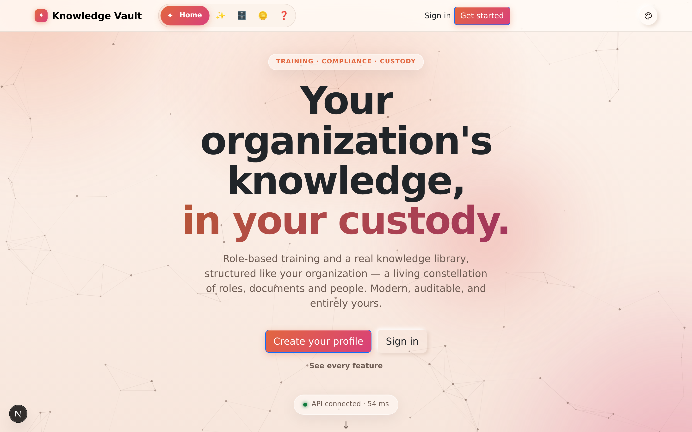

# Knowledge Vault — The Main Guide Book

**A complete, plain-language guide to using Knowledge Vault, for the people who use it.**

Knowledge Vault is your organization's training and knowledge platform. It maps your company
as a living **constellation of roles**, delivers the right courses to the right people, keeps
a proper **library** of your documents, runs **exams** that mark themselves, and shows you —
in real time — who has completed what. Everything stays in **your** custody.

This book walks through every feature the way you actually meet it in the product, one chapter
at a time. Every screen shown here comes from a real sample organization, **Aurora Robotics**,
so you can follow along and recognise exactly what you'll see.



> **This book is for end users, owners and managers.** The Knowledge Base team's own console —
> approving requests, issuing codes, gifting coins, editing plans — is deliberately **not** in
> this book. It lives in the separate **Super Admin Guide Book**, held by that team.

---

## How this book is built

Every chapter has the same five parts, so you always know where to look:

| Part | What it gives you |
|------|-------------------|
| **What it is** | The feature in a paragraph, in plain words. |
| **Why it matters** | The benefit, measured on five parameters — time, risk & compliance, security & custody, cost, and adoption. |
| **How to do it** | Numbered steps you can follow with the product open, with the screen beside them. |
| **Tips & pitfalls** | What experienced owners do, and the mistakes worth skipping. |
| **🎬 Make a video of this** | A ready-made shot list and script beats, if you're recording a walk-through for your own people. |

The **five parameters** are the same in every chapter, so you can compare features honestly:

- **Time** — minutes saved, or spent, per person per month.
- **Risk & compliance** — what an auditor can now see, and what can no longer go wrong quietly.
- **Security & custody** — who can reach what, and where the bytes actually live.
- **Cost** — Knowledge Coins, storage, and the licences you no longer need.
- **Adoption** — whether ordinary people will actually use it without training.

---

## How to read this book

- **New to the platform?** Read Chapters 1–5 in order — profile, concepts, founding an
  organization, your dashboard, and the constellation.
- **Setting up your company?** Chapters 3, 4, 6, 7 and 18 cover founding an organization,
  its identity, building its structure, placing people, and safeguarding it.
- **Publishing knowledge?** Chapters 8, 9, 10, 11 and 12 cover courses, the Studio, exams,
  editions & review, and the library.
- **A learner or team member?** Chapters 13 and 16 are for you — My Learning and the Mailbox.
- **A manager?** Chapters 14 and 15 cover Requests and Compliance — including why someone is
  not compliant, how to look one person up, and how to reset an exam for them.
- **Paying for it — or just starting out?** Chapter 17 explains Knowledge Coins, the plan
  ladder, what the free plan includes, and how upgrading works.
- **Responsible for security?** Chapters 18 and 19 cover custody, backups, recovery, and the
  session rules that decide how long a signed-in browser stays signed in.
- **Just want it to look right?** Chapter 20 covers themes, the pointer, hints and the
  navigation bar.
- **Wondering where the files actually go?** Chapter 23 walks through every storage
  arrangement end to end — NAS on your own hardware, the KVEP perk, and what is coming after.
- **Coming back after a while?** Chapter 24 is the dated record of what changed.

---

## Table of contents

| # | Chapter | What you'll learn |
|---|---------|-------------------|
| 1 | [Getting started — your profile](chapter-01-getting-started.md) | Register, sign in, manage your account, read your coins |
| 2 | [The big idea — core concepts](chapter-02-core-concepts.md) | Constellation, roles, custody, classifications |
| 3 | [Founding an organization](chapter-03-founding-an-organization.md) | Create an org, set the Supreme password, choose storage |
| 4 | [Your organizations — the dashboard](chapter-04-your-organizations.md) | Cards, logos, plan timers, filters, search and Recovery |
| 5 | [The Constellation — your org map](chapter-05-the-constellation.md) | Read, navigate and act on the star map |
| 6 | [Building your structure](chapter-06-building-your-structure.md) | Roles, sub-groups, visibility |
| 7 | [People & governance](chapter-07-people-and-governance.md) | Owners, members, least-privilege rights, username suggestions |
| 8 | [Courses — publishing knowledge](chapter-08-courses.md) | Publish, classify, schedule and assign courses |
| 9 | [The Document Studio](chapter-09-the-studio.md) | Build documents visually, block by block |
| 10 | [Exams & assessment](chapter-10-exams-and-assessment.md) | Build a paper, set attempts, sit it, mark it, reset it |
| 11 | [Editions, versions & the review channel](chapter-11-editions-and-review.md) | Revise safely, replace or coexist, and review what members write |
| 12 | [The Library](chapter-12-the-library.md) | Browse, filter and request courses |
| 13 | [My Learning & the reader](chapter-13-my-learning.md) | Complete your courses; zoom, reading size, full screen |
| 14 | [Requests — ask & approve](chapter-14-requests.md) | The ask-and-approve centre |
| 15 | [Compliance tracking](chapter-15-compliance.md) | Who's done what, why they haven't, one person at a time |
| 16 | [The Mailbox](chapter-16-the-mailbox.md) | Folders, labels, priority, expiry and the chime |
| 17 | [Plans, pricing & Knowledge Coins](chapter-17-plans-and-access.md) | Coins, the plan ladder, the free plan, access codes, upgrades |
| 18 | [The Supreme zone — custody & recovery](chapter-18-supreme-and-custody.md) | Backups, `.main`, `.bkp`, the Recovery |
| 19 | [Staying signed in — sessions & security](chapter-19-sessions-and-security.md) | The one-hour rule, the warning card, and what ends a session |
| 20 | [Appearance & navigation](chapter-20-appearance-and-navigation.md) | Themes, accents, the pointer, hints, and the icon-first nav bar |
| 21 | [Flow diagrams — every setting at a glance](chapter-21-flow-diagrams.md) | A diagram + screenshot for each owner action, member capability & request flow |
| 22 | [Help & support](chapter-22-help-and-support.md) | Where to find answers in-app |
| 23 | [Where your documents live](chapter-23-where-your-documents-live.md) | NAS, the KVEP perk, and the storage backends still to come |
| 24 | [What's new](chapter-24-whats-new.md) | A dated record of what changed |
| A | [Appendix — Glossary & quick reference](appendix-glossary-and-reference.md) | Every term and code, at a glance |

---

## The one-minute summary

| You want to… | Go to |
|--------------|-------|
| Create a profile | **Register** — a username and password, no email |
| Found an organization | **Pricing** → request a plan → **Create organization** with your code |
| Find an organization among many | **Organizations** → the **All / Owner / Member** filter, or search |
| Give your organization a face | Root branch → **Group configuration** → **Logo** |
| See your company's shape | **Constellation** |
| Add someone | Click their branch → **People** → **+ Add person** (type to see who exists) |
| Publish a document | Click a branch → **Courses** → **Upload** or **✍ Create in Studio** |
| Set an exam | **✍ Create in Studio** → *exam* |
| Revise something already published | **Courses** → **✎ Revise** → publish the next edition |
| Do your training | **My Learning** |
| See who's behind | **Compliance** |
| Check one person | **Compliance** → **Look up a person** |
| Read what the platform told you | The **bell** — your Mailbox |
| Get your organization back | **Organizations** → **Recovery**, bottom-left |
| Change how it looks | The **palette** button, top right |
| Understand where your documents are stored | **Storage**, in the navigation bar |

---

## Downloading this book

The whole book is published as a single PDF —
**`Knowledge-Vault-Main-Guide-Book.pdf`** — in this folder, and from the platform's own
**Help** page, which always serves the current edition.

To rebuild the PDF after editing a chapter:

```bash
cd guide-book-tools
npm install      # one-off: markdown-it, mermaid, sharp, playwright
node build-pdf.mjs main
```

Adding a chapter means adding its filename to the `files` list in `guide-book-tools/books.mjs` —
the build script reads nothing else, so a file left out of that list simply isn't in the PDF.

---

*Knowledge Vault — your structure, your knowledge, your custody.*
