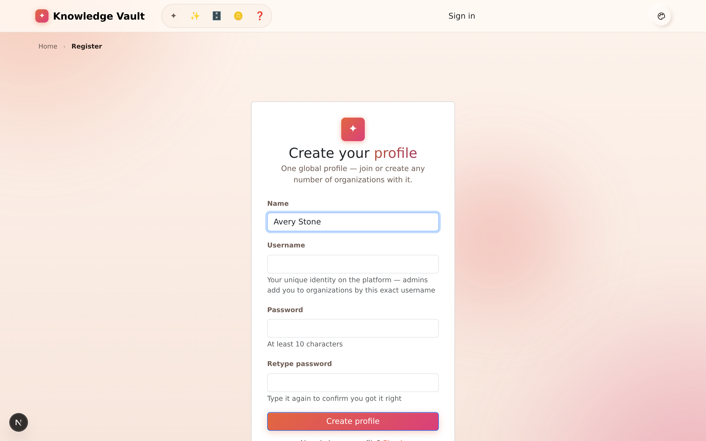
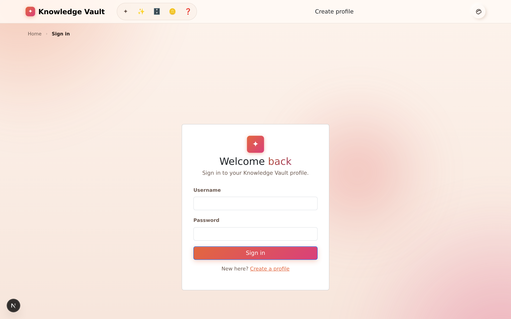
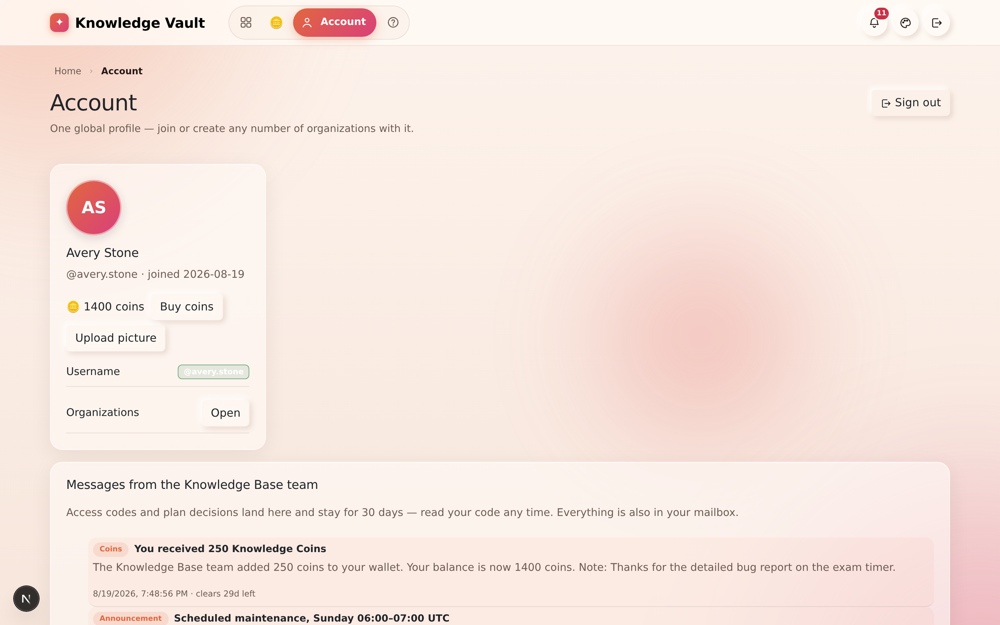
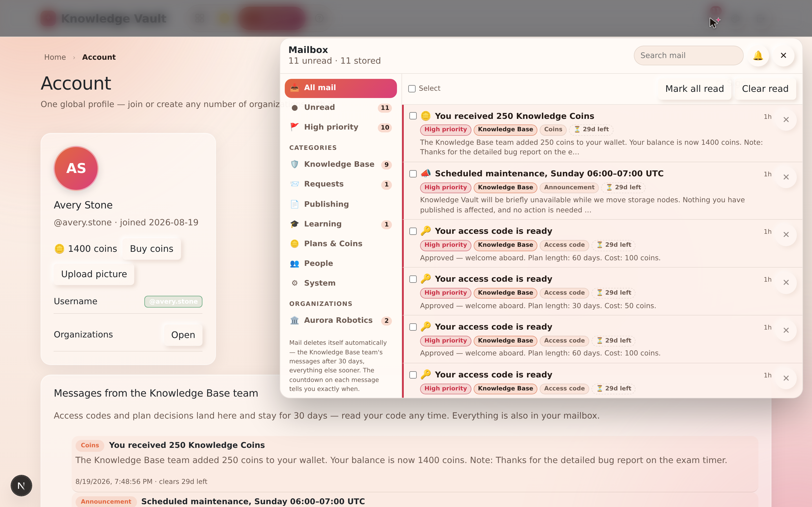

# Chapter 1 — Getting started: your profile

## What it is

Everything in Knowledge Vault begins with **one global profile**. That profile is a single
**username** and **password** — there is **no email involved**. Your username is your
identity across the whole platform: it's how administrators add you to an organization, how
your name appears on courses you author, and how you sign in from any device.

One profile lets you **join or found any number of organizations**. You never need a second
account.

---

## Why it matters

| Parameter | What changes |
|-----------|--------------|
| **Time** | One identity, every organization. No second account when you join a partner's vault, no "which email did I use?" |
| **Risk & compliance** | Completions, authorship and approvals all attach to one username, so an audit trail reads as one person's history rather than three half-accounts. |
| **Security & custody** | No email means no email-based account takeover, and no address for us to leak. The trade is real: there is no "forgot password" link, which is why the platform asks you to retype every password you set. |
| **Cost** | New profiles arrive with **150 Knowledge Coins**, enough to found a Free organization and still have change ([Chapter 17](chapter-17-plans-and-access.md)). |
| **Adoption** | Three fields and you're in. Nobody waits on an invitation email that went to spam. |

---

## Creating your profile

From the welcome screen, choose **Create your profile** (or **Get started**). You'll see the
registration form:

Fill in three fields:

1. **Name** — your display name, shown to teammates (e.g. *Avery Stone*).
2. **Username** — your unique handle (e.g. *avery.stone*). Choose it carefully: this is the
   **exact** name an administrator types to add you to an organization. It must be at least
   3 characters, and may contain letters, numbers, dots, dashes, underscores and `@`.
3. **Password** — at least **10 characters**. You'll be asked to **retype it** to confirm
   you got it right — a safeguard you'll see every time you set or change a password on the
   platform.

Select **Create profile** and you're in.

> **Why retype-to-confirm?** Because there's no email-based password reset, the platform is
> careful to make sure you never lock yourself out with a typo. Every new-password field
> asks for confirmation.

New profiles are also credited with **Knowledge Coins** — 150 by default. You spend them on
the plan an organization runs on, and your balance is shown on the **Pricing** page and on
your **Account** page. [Chapter 17](chapter-17-plans-and-access.md) explains coins, plans and
the free plan in full.

---

## Signing in

Returning users select **Sign in** and enter their username and password:

**Your session lasts as long as you are actually using it.** Knowledge Vault ends a session
after **one hour away from the keyboard**, and the next visit asks for your password again.
Background activity — the mailbox checking for new post, the request badge counting — does
**not** count as presence; only a click, a key, a scroll, a touch or a page you opened does.
A card in the corner warns you before the hour is up, with a **Stay signed in** button.

[Chapter 19](chapter-19-sessions-and-security.md) explains the whole rule, including what
happens when you close the laptop and come back tomorrow.

---

## Managing your account

Open the **Account** page from the top navigation at any time:

Here you can:

- **See your profile** — display name, `@username`, and the date you joined.
- **Upload a profile picture** — choose any image; it's automatically resized to a small
  square, so it stays lightweight.
- **See your Knowledge Coin balance** and the history behind it — what you were granted, what
  you spent on which plan, and any adjustment the Knowledge Base team made.
- **Jump to your organizations** with the **Open** button.
- **Read your messages from the Knowledge Base team** — access codes, plan decisions and coin
  gifts land in your **Mailbox** and are summarised here, so you can find your code any time
  ([Chapter 16](chapter-16-the-mailbox.md)).
- **Delete your profile** from the **Danger zone**. Deleting removes you from *every*
  organization and cannot be undone, so the platform asks you to confirm. You cannot delete a
  profile that still owns an organization — hand it over first.

---

## Tips & pitfalls

- **Pick a memorable username.** Administrators add people by exact username — if yours is
  hard to spell, you may be added incorrectly, or an admin may reserve the wrong handle.
- **You can be added before you register.** If an administrator enters a username that
  doesn't exist yet, it's *reserved*; the placement attaches automatically the moment you
  register with that username. Nothing is lost by joining late.
- **Write the password down somewhere safe.** There is no email reset. A password manager is
  the right answer here.
- **Switch light/dark theme and accent colour** any time from the palette control in the
  top-right corner — it's purely visual, personal to you, and remembered next time
  ([Chapter 20](chapter-20-appearance-and-navigation.md)).
- **Signing out ends the session**, not just this tab. That is deliberate on a shared machine.

---

## 🎬 Make a video of this

**Length:** ~90 seconds. **Working title:** *"Your profile — one username, every vault."*

| # | Shot | Say |
|---|------|-----|
| 1 | The welcome screen, both buttons visible | "Two doors: create a profile, or sign in." |
| 2 | The register form, typing all three fields | "A name, a username, and a password you'll retype. No email anywhere." |
| 3 | Landing signed-in, coin balance visible | "New profiles arrive with 150 Knowledge Coins." |
| 4 | The Account page, uploading a picture | "One page for your name, your picture and your coins." |
| 5 | The idle warning card appearing | "Walk away for an hour and the session ends — with a warning first." |

**Script beat to close on:** *"One username. Every organization you'll ever be added to hangs
off it."*

**Next:** [Chapter 2 — The big idea: core concepts →](chapter-02-core-concepts.md)
