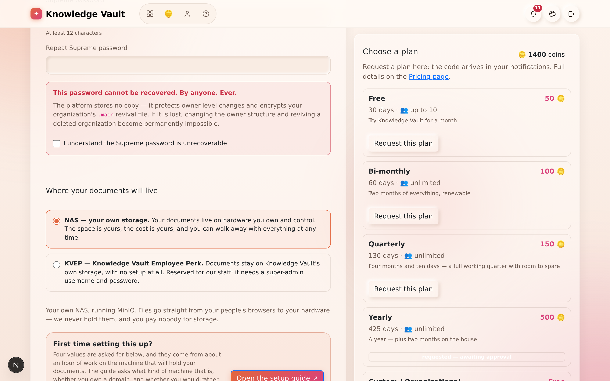

# Chapter 3 — Founding an organization

## What it is

Founding an organization creates a brand-new constellation with **you as its first owner**
and sets its **Supreme password** — the single most important credential in Knowledge Vault.
This is how a company, team or department comes into existence on the platform.

> **You need a plan and an access code first.** Every organization runs on a plan, and
> creating one needs a one-time 8-character code from the Knowledge Base team. Pick a plan on
> the **Pricing** page (the **Free** plan is 30 days for 50 coins, and every new profile
> starts with 150), and your code arrives in your Mailbox.
> [Chapter 17](chapter-17-plans-and-access.md) walks through it end to end.

---

## Why it matters

| Parameter | What changes |
|-----------|--------------|
| **Time** | Ten minutes, once. The structure you sketch here is the structure every course, every report and every permission will follow for years. |
| **Risk & compliance** | The classification scheme, the deadlines and the audit trail all start at founding. An organization created carelessly is one you re-found later, with the training records stranded in the old one. |
| **Security & custody** | The Supreme password is set here and stored nowhere. It is what makes the platform unable to hold your organization hostage — and what makes losing it unrecoverable. |
| **Cost** | The plan's coins are spent at creation, not at request. A failed storage test costs you nothing: the code stays unspent until the organization actually exists. |
| **Adoption** | A name people recognise, a logo they recognise, and a top role named after something real in your company ("Executive Office", not "Root") is the difference between a tool people enter and one they avoid. |

---

## Before you start: three decisions

1. **What the top role is called.** It is the crown of your constellation and the thing every
   inherited course hangs from. *Executive Office*, *Principal*, *Board*, *Head Office* — a
   real name from your world, not a technical one.
2. **Where your documents will live** — your own NAS, or (for staff) the KVEP perk. This is
   asked on the form and is not casually changed later.
3. **Who keeps the Supreme password.** Decide before you type it, not after.

---

## Creating the organization

From **Organizations**, select **+ Create organization** to open the founding form:

The page has the founding form on the left and a **plan chooser** on the right — your coin
balance, every plan, and a button to request one without leaving the page.

Fill in the fields:

1. **Access code** — the 8-character code the Knowledge Base team sent you (it's in your
   Mailbox and on your Account page). It's valid for 24 hours and works once. The field's own
   label carries a **?** hint explaining where a code comes from, and a link straight to
   Pricing if you haven't asked for one yet.
2. **Organization name** — your company or team name (e.g. *Aurora Robotics*).
3. **Organization logo** — optional, and worth thirty seconds. Upload a square-ish image and
   it appears on your organization's card, beside its name on every page, and on the
   documents you publish. Skip it and Knowledge Vault draws a badge from the first letter of
   your name instead, in a colour picked for your organization — so you never end up with a
   blank square. You can change it later from the root branch's **Group configuration**.
4. **First role name** — the name of the top role you'll occupy. This is the root of your
   whole structure.
5. **Supreme password** — at least **12 characters**. Retype it to confirm.
6. **Where your documents will live** — see the next section.

## Where your documents will live

Knowledge Vault always keeps your structure, your people and your records. Your **documents
themselves** are a separate question, and the founding form asks it.

**NAS — your own storage.** The normal choice. Your documents live on hardware you own and
control: the space is yours, the running cost is yours, and you can walk away with everything
at any time. You enter the address, the bucket and an access key, then press **Test
connection** — Knowledge Vault writes a test file, reads it back, checks the bytes match,
confirms the storage isn't readable by the public, and cleans up after itself. It tells you
exactly which of those steps failed if one does.

You also choose here whether documents are **encrypted** on your storage. Encrypted is
recommended and means nobody can open them from the storage itself — not even your own IT —
only through Knowledge Vault, or with your `.main` file and Supreme password. The alternative
keeps them as ordinary browsable files. **This choice is fixed once storage is connected**,
because changing it means re-encrypting everything you have stored.

If you don't have a NAS, the **storage setup guide** — linked from the Storage page — walks
through turning a folder on an ordinary laptop into one, so you can try the whole thing
before buying hardware.

**KVEP — Knowledge Vault Employee Perk.** Reserved for Knowledge Vault staff. Documents stay
on Knowledge Vault's own storage with nothing to set up, and the plan's storage allowance
applies as usual. It needs a **super-admin username and password**, entered both when the
access code is requested and again when the organization is created — which is what keeps the
perk internal. An ordinary access code will not create a KVEP organization, and a KVEP code
will not create an ordinary one.

> **Creation is gated on proof that your storage works.** The form will not create the
> organization until a NAS connection has *passed* its test, or a KVEP credential has been
> *recognised*. Edit either afterwards and the proof is retracted — you test again. The same
> gate covers reconfiguring a live organization's storage later, because saving something
> unreachable would stop every upload that depends on it.

> **Want the whole picture before you decide?**
> [Chapter 23 — Where your documents live](chapter-23-where-your-documents-live.md) walks
> through each arrangement step by step, says exactly what stays with us and what goes to you,
> and lists the storage backends still to come. The public **Storage** page in the navigation
> bar carries the same material.

### The Supreme password — read this carefully

The form shows a prominent warning, and it means every word of it:

> **This password cannot be recovered. By anyone. Ever.**

The platform stores **no copy** of your Supreme password. It is used to:

- protect owner-level changes to the top of your structure, and
- encrypt your organization's `.main` revival file.

If it is lost, changing the owner structure and reviving a deleted organization become
**permanently impossible**. Because of this, you must tick the acknowledgement box —
**"I understand the Supreme password is unrecoverable"** — before you can continue.

Select **Create organization**, and you'll land on your new, empty constellation with a
single star: your top role, with you as its owner. The platform checks your code, deducts the
plan's coins, and starts the plan's countdown — visible from then on as the chip on the
organization's card.

---

## What happens in the first ten minutes after

| Order | Do this | Chapter |
|-------|---------|---------|
| 1 | Add the branches your company actually has | [6](chapter-06-building-your-structure.md) |
| 2 | Put one trusted person in as co-owner, so you are not a single point of failure | [7](chapter-07-people-and-governance.md) |
| 3 | Publish one short document at the top — a welcome, or the code of conduct | [8](chapter-08-courses.md) |
| 4 | Export the `.main` file and store it offline | [18](chapter-18-supreme-and-custody.md) |

---

## Tips & pitfalls

- **Store the Supreme password somewhere durable and offline** — a password manager or a
  sealed record. Treat it like the master key to a safe, because that's exactly what it is.
- **Export `.main` on day one**, not the day you need it. It takes one click and it is the
  difference between "we lost the organization" and "we restored it before lunch".
- **Choose the top role name thoughtfully.** It's the label everyone sees at the crown of
  your constellation. You can grow everything else beneath it later.
- **Test the NAS connection before you fill in the rest of the form.** A failed test leaves
  the code unspent, but re-typing a long form is nobody's idea of fun.
- **Trying the platform out?** Found a **Free** organization — 30 days, up to 10 people, 30
  custom documents and 30 uploads — and rehearse there before you build the real one
  ([Chapter 17](chapter-17-plans-and-access.md)).

---

## 🎬 Make a video of this

**Length:** ~3 minutes. **Working title:** *"Founding an organization, properly."*

| # | Shot | Say |
|---|------|-----|
| 1 | The Pricing page, requesting a plan | "Every organization runs on a plan, and a plan starts with a request." |
| 2 | The Mailbox, the code arriving | "The Knowledge Base team approves it, and the code lands here." |
| 3 | The creation form, filling name and logo | "Name it, and give it a face — the badge follows it everywhere." |
| 4 | The storage section, pressing **Test connection** | "Prove your storage works before the organization exists. A failed test costs you nothing." |
| 5 | Hold on the Supreme warning, tick the box slowly | "Read this one twice. We store no copy — that is the point, and the risk." |
| 6 | The new, single-star constellation | "And there it is: one star, and everything else still to grow." |

**Script beat to close on:** *"Two credentials matter here: the code, which is temporary, and
the Supreme password, which is forever."*

**Next:** [Chapter 4 — Your organizations: the dashboard →](chapter-04-your-organizations.md)
