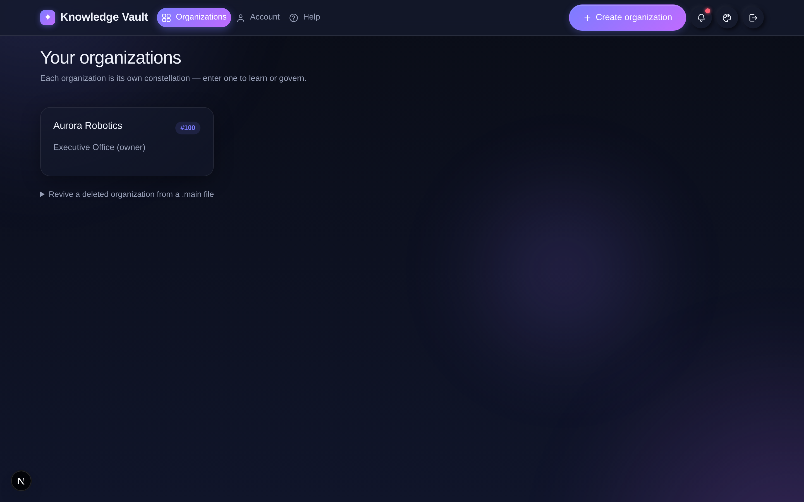
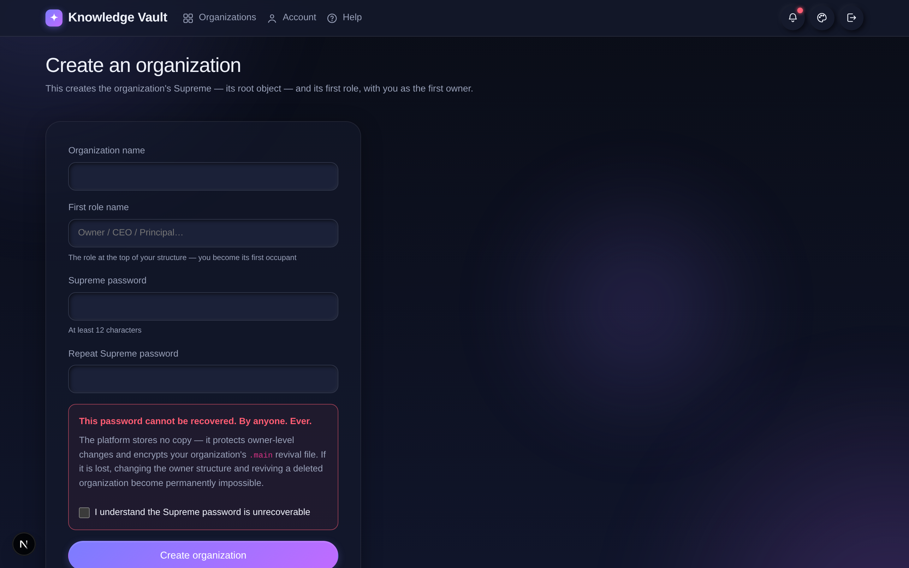

# Chapter 3 — Founding an organization

## What it is

Founding an organization creates a brand-new constellation with **you as its first owner**
and sets its **Supreme password** — the single most important credential in Knowledge Vault.
This is how a company, team or department comes into existence on the platform.

---

## Your organizations home

The **Organizations** page lists every organization you belong to. Each card shows the
organization's name, its number (e.g. `#100`), and your position inside it.

From here you can:

- **Open** any organization by selecting its card.
- **Create organization** — the button in the top-right.
- **Revive a deleted organization from a `.main` file** — the expandable option at the
  bottom (covered in Chapter 14).

---

## Creating the organization

Select **Create organization** to open the founding form:

Fill in the fields:

1. **Organization name** — your company or team name (e.g. *Aurora Robotics*).
2. **First role name** — the name of the top role you'll occupy. This is the root of your
   whole structure. Common choices: *Owner*, *CEO*, *Principal*, *Executive Office*.
3. **Supreme password** — at least **12 characters**. Retype it to confirm.

### The Supreme password — read this carefully

The form shows a prominent warning, and it means every word of it:

> **This password cannot be recovered. By anyone. Ever.**

The platform stores **no copy** of your Supreme password. It is used to:

- protect owner-level changes to the top of your structure, and
- encrypt your organization's `.main` revival file.

If it is lost, changing the owner structure and reviving a deleted organization become
**permanently impossible**. Because of this, you must tick the acknowledgement box —
**"I understand the Supreme password is unrecoverable"** — before you can continue.

Select **Create organization**, and you'll land on your new, empty constellation with a
single star: your top role, with you as its owner.

---

## Tips

- **Store the Supreme password somewhere durable and offline** — a password manager or a
  sealed record. Treat it like the master key to a safe, because that's exactly what it is.
- **Choose the top role name thoughtfully.** It's the label everyone sees at the crown of
  your constellation. You can grow everything else beneath it later.
- **You don't need everything ready on day one.** Found the org first; add roles, people and
  courses whenever you're ready — the next chapters show how.

**Next:** [Chapter 4 — The Constellation: your org map →](chapter-04-the-constellation.md)
