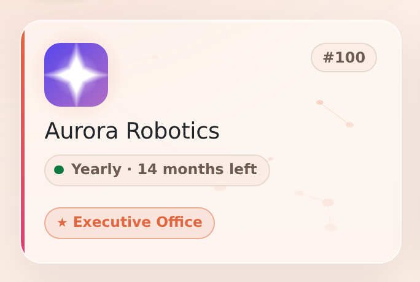
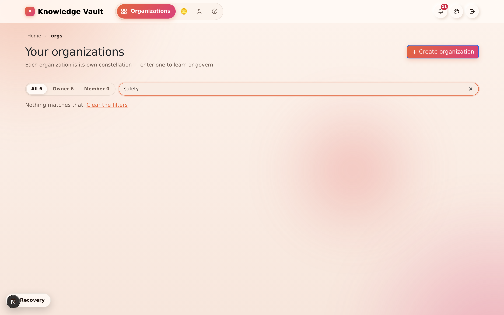
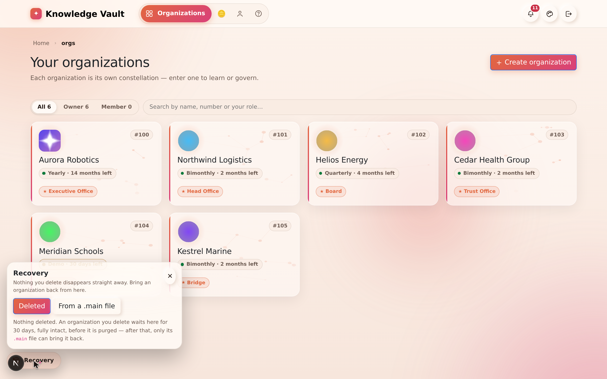

# Chapter 4 — Your organizations: the dashboard

> **In one line:** the page you land on after signing in — every organization you belong to,
> each wearing its own badge, its own sky and its own plan clock, with a filter and a search
> for when there are more of them than you can scan.

## What it is

**Organizations** is your front door. One profile can found or join any number of
organizations, and this page is where they all live. Each one is a **card**: its logo, its
number, how long its plan has left, and the positions you hold inside it.

Open an organization by clicking its card. Everything else in this book happens *inside* one.

Past **five** organizations the page grows a **filter bar** and a **search box**, because a
grid you have to read line by line is not a dashboard any more.

---

## Why it matters

| Parameter | What changes |
|-----------|--------------|
| **Time** | Recognising an organization by its badge and sky is instant; reading six similar names is not. The filter and search turn "which one was that?" into two keystrokes. |
| **Risk & compliance** | The plan clock is on the card, in units a person can act on — *14 months left*, *12 days left*, *20h left*. An expiring organization is visible weeks before it becomes an incident. |
| **Security & custody** | **Recovery** sits in the corner of this page, not buried in settings: both ways back from a deletion are one click from where you noticed the organization was gone. |
| **Cost** | Seeing every plan and its remaining term in one grid is what stops an organization being renewed twice, or renewed at all when nobody uses it. |
| **Adoption** | A logo and a distinct star field make an organization feel like *yours*. People open a card they recognise; they hesitate over a row of identical text. |

---

## Reading a card

A card carries five things, and nothing else:

1. **The badge** — the logo an owner uploaded, or the organization's first letter if it has
   none. It is the same badge you'll see beside the name on every page inside.
2. **The number** — `#100`. Platform-unique, permanent, and the thing the Knowledge Base team
   asks for. It never changes, whatever the organization renames itself to.
3. **The sky** — a small constellation, seeded from the organization's own number. The same
   organization always wears the same sky, which is what makes it recognisable in a list of
   twenty. It is purely decorative and is faded away behind the text.
4. **The plan chip** — the plan's name, the largest unit of time that still means something,
   and a dot coloured by how close the end is. Hover it for the exact date.
5. **Your positions** — the roles you hold there, owners first and marked with a star. Past a
   few, the rest collapse into a **+N** you can hover to read.

> **Why the timer counts in months, not days.** An organization on a ten-year custom plan used
> to read *3,643d 14h left*, which is a number nobody can act on. It now reads *9.9 years
> left*, and only starts pulsing in its **last three days** — a card that throbs for a year
> teaches people to ignore it.

---

## Finding one organization among many

- **All / Owner / Member** — three lenses, each showing its own count. *Owner* is where you
  can change things; *Member* is where you are being taught. The two overlap on purpose: you
  can be an owner in one branch of an organization and a plain member in another.
- **Search** covers the **name**, the **number** and **your own role names** — because "the one
  where I'm the safety lead" is how people actually remember organizations.

On a phone the grid becomes one card per row, and nothing scrolls sideways.

---

## Creating another one

**+ Create organization**, top right, goes to the creation form — but you need an **access
code** first. Chapter 3 covers the whole path: request a plan on **Pricing**, the Knowledge
Base team approves it, the code arrives in your Mailbox, and the form takes it.

---

## Recovery — the corner you hope not to need

**Recovery** is docked in the **bottom-left** of this page, and holds both ways back from a
deletion:

- **Organizations waiting out their 30 days.** A deleted organization is not gone; it is
  dormant. Restore it here with the Supreme password.
- **A `.main` revival**, for anything already purged. Upload the file, type the Supreme
  password, and the organization comes back — number, structure, people and all.

It is a recovery arrow rather than a wastebasket, because what sits behind it is intact and
one password away from returning. [Chapter 18](chapter-18-supreme-and-custody.md) explains
both routes in full.

---

## Tips & pitfalls

- **Upload a logo on day one.** It costs thirty seconds and it is the single biggest thing you
  can do to make people confident they are in the right organization. Root branch →
  **Group configuration** → **Logo** ([Chapter 6](chapter-06-building-your-structure.md)).
- **Watch the dot, not the date.** Amber means weeks; red and pulsing means days. If you have
  to hover to find out, you are already close.
- **Don't rename to disambiguate.** Two organizations called *Operations* stay confusing.
  Give them different badges instead — the eye separates pictures far faster than words.
- **The filter counts are honest.** If *Owner* reads 6 and you expected 2, you own more than
  you think, somewhere in a branch you were added to.

---

## 🎬 Make a video of this

**Length:** ~90 seconds. **Working title:** *"Where everything starts — your organizations."*

| # | Shot | On screen | Say |
|---|------|-----------|-----|
| 1 | Sign in, land on the dashboard | The grid of cards | "One profile, every organization you belong to." |
| 2 | Slow zoom into one card | Badge, number, plan chip, roles | "Its badge, its number, how long the plan has left, and what you are inside it." |
| 3 | Hover the plan chip | Exact date tooltip | "Hover for the exact date — the chip itself speaks in months." |
| 4 | Click **Owner**, then **Member** | Counts change | "Two lenses: where you govern, and where you learn." |
| 5 | Type a role name in search | Grid narrows to one | "Search knows your role names too." |
| 6 | Click **Recovery**, then close it | The dock opens | "And if one ever disappears, both ways back live in this corner." |

**Script beat to close on:** *"Recognise it, open it, and everything else happens inside."*

---

**Next:** [Chapter 5 — The Constellation: your org map →](chapter-05-the-constellation.md)
