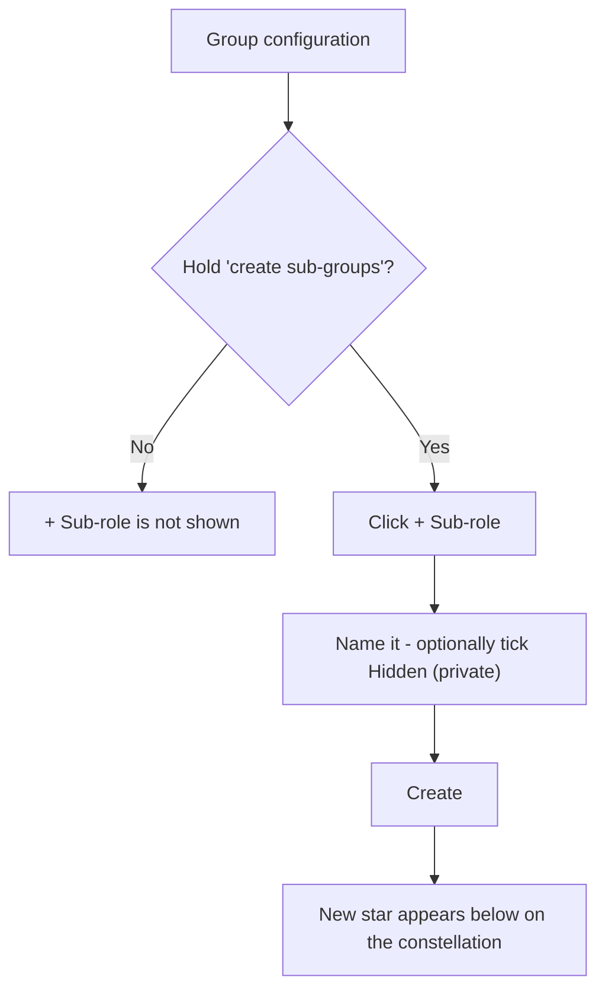
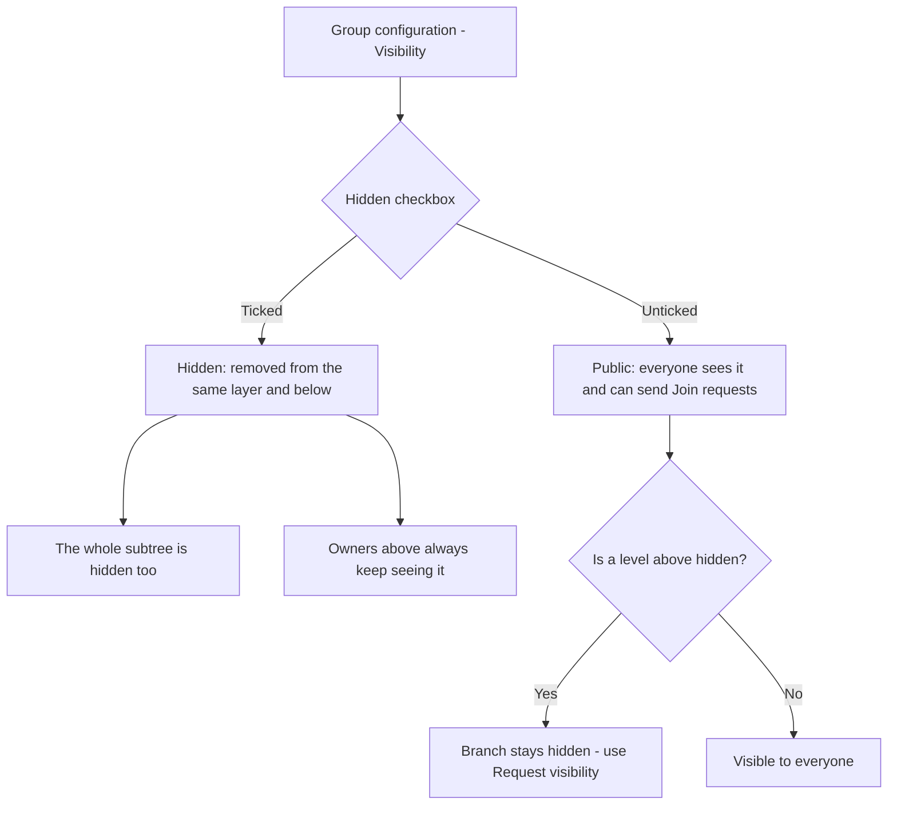
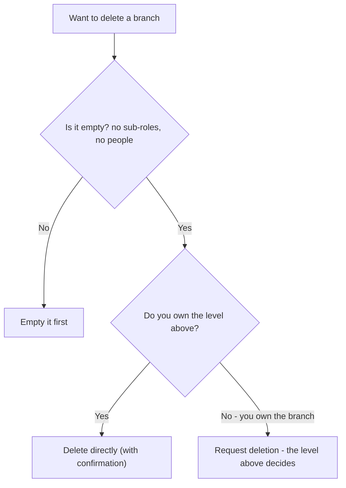

# Chapter 5 — Building your structure

## What it is

Your structure is the shape of your organization — the roles and sub-roles that knowledge
and people hang from. You grow and shape it from the **Group configuration** section of any
role you govern. This chapter covers **sub-groups**, **visibility**, and **deleting a
branch**.

Open it by clicking a star you govern on the constellation, then choosing **Group
configuration**.

---

## Adding a sub-group (sub-role)

Branches only ever grow **downward**. To add a new role beneath the one you're on:

1. In **Group configuration**, find the **Sub-groups** row.
2. Select **+ Sub-role**.
3. Enter the new role's name (e.g. *Firmware Team* under *Engineering*).
4. Optionally tick **Hidden (private)** to make the new branch private from the start
   (see visibility below).
5. Select **Create**.

The new star appears immediately on the constellation, connected beneath the current role.

> You'll only see the **+ Sub-role** option if you hold the *"may create sub-groups"* right
> on that branch. Least-privilege governance (Chapter 6) decides who can grow the tree.

---

## Visibility: public by default, hidden on purpose

Every branch is **public by default** — meaning every member of the organization can see it
and send a **Join request** to it. You control this with a single checkbox:

- Leave it unticked → the branch is **public**.
- Tick **Hidden (private) branch** → the branch is hidden from people on the same layer and
  below. Hiding cascades: **everything beneath a hidden branch is hidden too**, all the way
  down.

Two important rules:

- **Owners above a hidden branch always keep seeing it.** Hiding never blinds the people
  responsible for that part of the tree.
- If your branch is marked public but a **level above** is hidden, your branch stays hidden
  too. In that case the panel tells you, and — if you have the right — offers a **Request
  visibility** button to ask the level above to unhide the chain.

In the sample *Aurora Robotics*, the **Research Lab** branch is hidden — it doesn't appear
to ordinary members, only to the executives above it.

---

## Deleting a branch

A branch can be removed only when it is **completely empty** — no sub-roles and no people.
How you delete depends on your authority:

- **If you own the level above**, you can delete the branch **directly** — the **Delete**
  button appears in Group configuration.
- **If you own the branch itself** (but not the level above), deletion needs sign-off. You'll
  see **Request deletion** instead, which files a **Deletion request** with the level above;
  they approve or reject it from their Requests inbox (Chapter 11).

The platform always confirms before deleting.

---

## Flows at a glance

**Creating a sub-role:**

**Setting visibility:**

**Deleting a branch:**

---

## Tips

- **Design top-down.** Create the big divisions first (Engineering, Operations, People), then
  add teams beneath them. Courses placed high can inherit down to everything you add later.
- **Use hidden branches for sensitive teams** — a security team, an M&A workstream, an
  unannounced project. Remember the whole subtree inherits the privacy.
- **Empty before you delete.** Move or remove people and sub-roles first; the branch must be
  empty for deletion to succeed.

**Next:** [Chapter 6 — People & governance →](chapter-06-people-and-governance.md)
