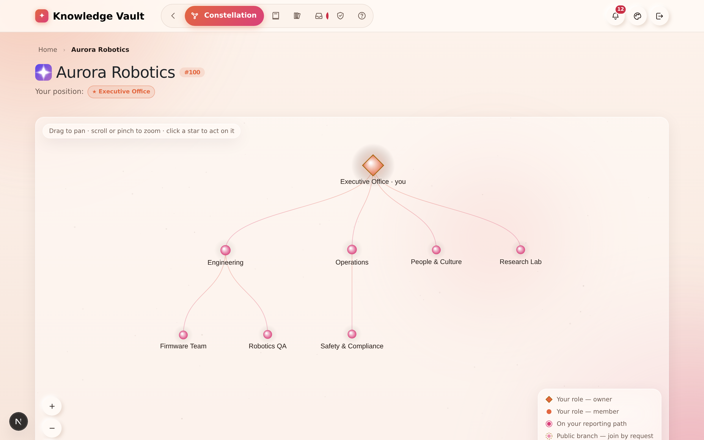
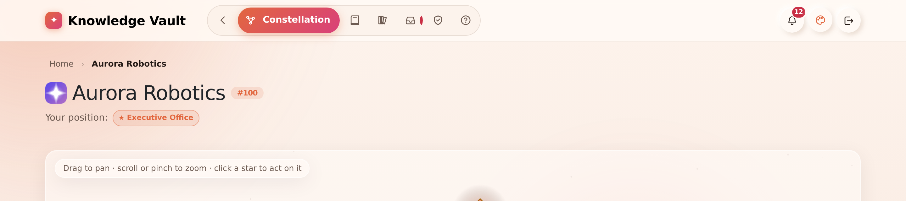
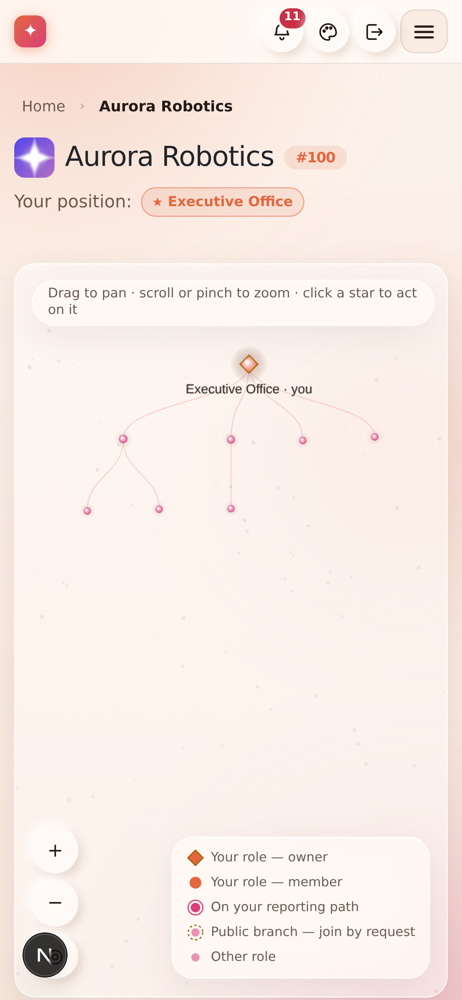

# Chapter 5 — The Constellation: your org map

## What it is

The **Constellation** is your organization's main page — the home you land on when you open
an org. It draws your entire structure as a **top-down star map**: the top role at the crown,
branches spreading downward, connected by glowing links. It's beautiful, but it's also
functional: this single screen is where owners do almost everything.

---

## Why it matters

| Parameter | What changes |
|-----------|--------------|
| **Time** | One screen replaces an admin console. Adding a person, publishing a document, taking a backup and changing visibility are all one click from the star they belong to — no navigating a settings tree to find the branch you were already looking at. |
| **Risk & compliance** | The shape of authority is *visible*. A branch with no owner, a team hanging off the wrong parent, or a hidden subtree nobody remembers are all obvious at a glance and invisible in a list. |
| **Security & custody** | The map only draws what you are allowed to see. Hidden branches cascade privacy down the subtree, so a contractor's map is genuinely smaller than yours. |
| **Cost** | Structure changes cost nothing and need no consultant: drag, click, rename. Reorganisations that would be a migration project elsewhere are an afternoon here. |
| **Adoption** | People find themselves on it. Your own positions glow and your reporting path is lit, which is the single feature that makes new starters stop asking "where do I fit?" |

---

Every page inside an organization carries its **badge, its name and its number** at the top,
with the positions you hold beneath them:

---

## Reading the map

- **The diamond at the top** is your root role. Bigger, brighter stars sit higher in the
  structure.
- **Lines** connect each role to its parent — knowledge and authority flow down these lines.
- **Your own positions glow brighter**, and your reporting path (the chain from you up to
  the top) is highlighted so you can always find yourself.

The **legend** in the bottom-right explains every marker:

| Marker | Meaning |
|--------|---------|
| ◆ Gold diamond | Your role — as an **owner** |
| ● Bright dot | Your role — as a **member** |
| ● Ringed dot | A role **on your reporting path** |
| ○ Dashed ring | A **public branch** you can ask to join |
| · Faint dot | Another role you're not part of |

### Names are laid out, not stacked

Role names are placed the way a map places place-names, not printed blindly under every star:

- Each name is placed in the **first free space** — a second or third row under its star when
  the first row is taken.
- Names are ranked by how much you need them: **what you are pointing at**, then **what you
  have selected**, then **the branches you belong to**, then the rest.
- A star with **no room** keeps its glyph and loses its name until there is room — which is
  what panning and zooming are for. Nothing is ever painted on top of anything else.
- A name that the frame would slice in half is not drawn at all. Half a name is not a name.
- Names **hold still** while their star breathes, and each carries a soft halo of the page's
  own background, so a label crossing a connector line reads as text on the sky rather than
  text on a wire.

This matters most on a phone, where the whole tree is scaled into about 360 pixels and four
siblings can land 70 pixels apart:

---

## Moving around

The hint at the top of the stage says it all: **drag to pan · scroll or pinch to zoom ·
click a star to act on it.**

- **Drag** anywhere to pan the map.
- **Scroll or pinch** to zoom in and out.
- Use the **+ / − and reset (◎)** buttons in the bottom-left for precise control. Reset
  re-fits the whole tree.
- Live updates mean that when anyone changes the structure, your map updates **instantly** —
  no refresh needed.

> **Lost a name?** Zoom in. A label that vanished did so because a neighbour needed the space
> more; the moment there is room, it comes back.

---

## Acting on a star

**Click a star to open its action panel.** What you can do depends on your relationship to
that role:

- **A role you govern** → the full action panel opens (see below).
- **One of your own positions** → a short panel with a link to your **My Learning**.
- **A public branch you're not in** → an option to send a **Join request**.
- **A role you have no access to** → the app simply tells you so; it never sends you
  somewhere unexpected.

When you click a role you govern, you first see a **section chooser** — "What do you want to
do here?" — with four options:

| Section | What it's for | Chapter |
|---------|---------------|---------|
| **Group configuration** | Visibility, sub-groups, the logo, deletion — and the Supreme zone on the root | [6](chapter-06-building-your-structure.md) |
| **People** | The owners and members of this branch | [7](chapter-07-people-and-governance.md) |
| **Courses** | Publish and configure knowledge for this branch | [8](chapter-08-courses.md) |
| **Backup** | Export or restore this branch as an encrypted `.bkp` | [18](chapter-18-supreme-and-custody.md) |

The panel header also shows quick counts — how many owners, members and sub-roles the branch
has. The next chapters take each of these sections in turn.

---

## Tips & pitfalls

- **Everything happens on the constellation.** There's no separate "admin console" — clicking
  a star is how owners manage their part of the organization.
- **Can't find yourself?** Your positions glow and your path is lit; press the reset button to
  see the whole picture, then follow the highlight.
- **The map is shared and live.** If a colleague adds a role while you're looking, it appears
  on your screen the moment they save it.
- **Wide beats deep.** Thirteen siblings lay out cleanly; thirteen levels of nesting make a
  tall, thin tree that no screen frames well. Structure your organization the way people
  describe it out loud.
- **On a phone, turn it sideways** for a wider frame — more labels fit, and the tree needs
  less zooming.

---

## 🎬 Make a video of this

**Length:** ~2 minutes. **Working title:** *"The map that manages the company."*

| # | Shot | Say |
|---|------|-----|
| 1 | Land on the constellation, hold still | "This is the whole organization — every role, drawn as a star." |
| 2 | Point at your own glowing star, follow the lit path up | "Yours glow. So does the path from you to the top." |
| 3 | Pan and zoom with the wheel, then press reset | "Drag to pan, scroll to zoom, reset to see it all." |
| 4 | Zoom out on a phone frame until a label disappears, zoom back in | "Names are laid out, never stacked — if there's no room, the name waits." |
| 5 | Click a branch → the four-section panel | "Click any star you govern, and everything you can do here is in four sections." |
| 6 | Open **People**, close it, open **Courses** | "People. Courses. Configuration. Backup. That's the whole admin surface." |

**Script beat to close on:** *"No settings maze. If you can see the star, you can manage it."*

**Next:** [Chapter 6 — Building your structure →](chapter-06-building-your-structure.md)
