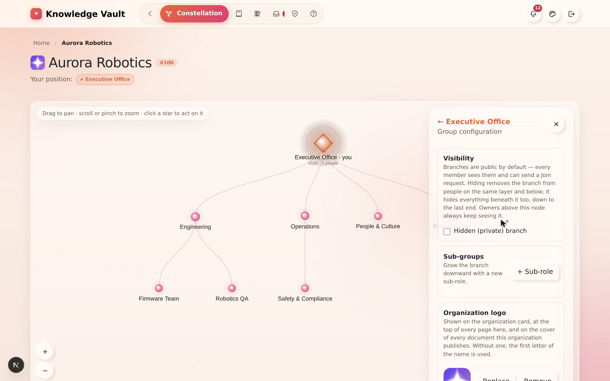
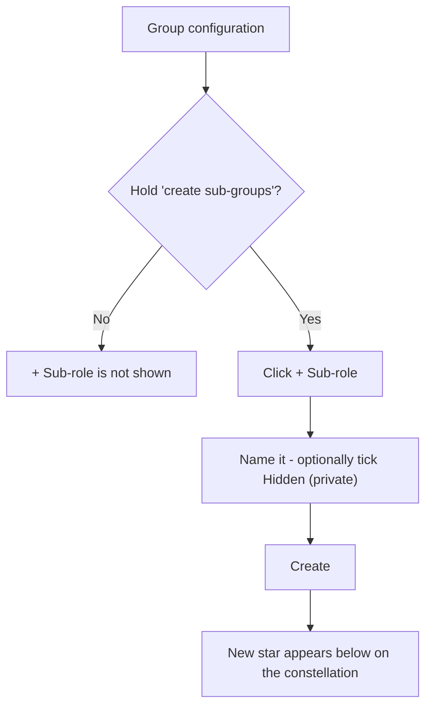
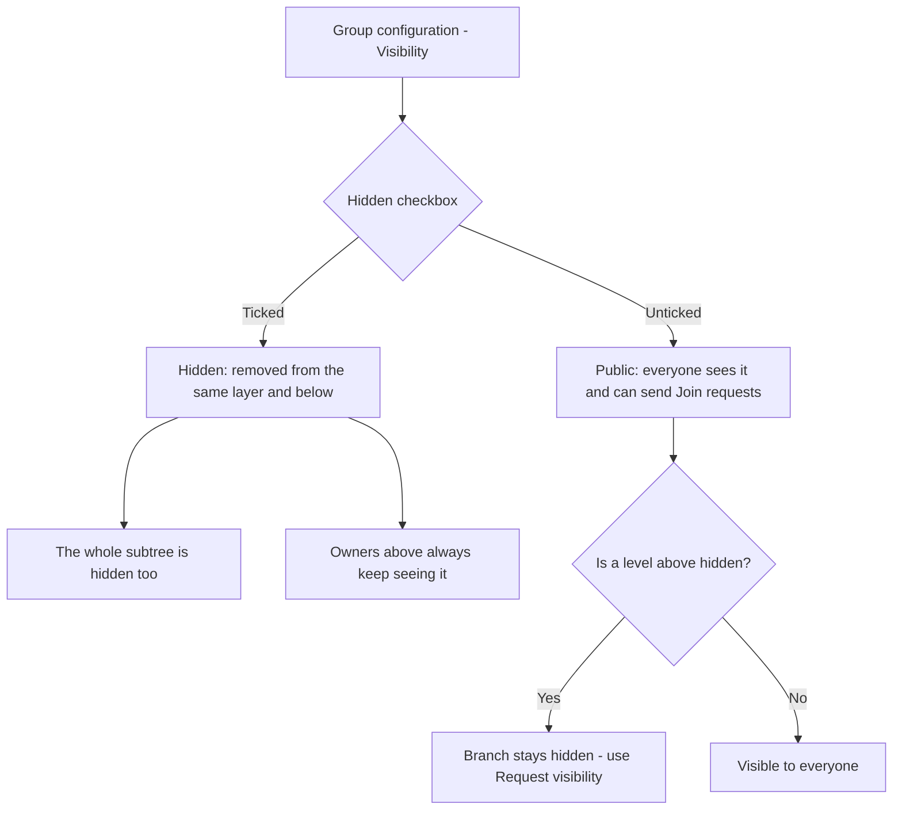
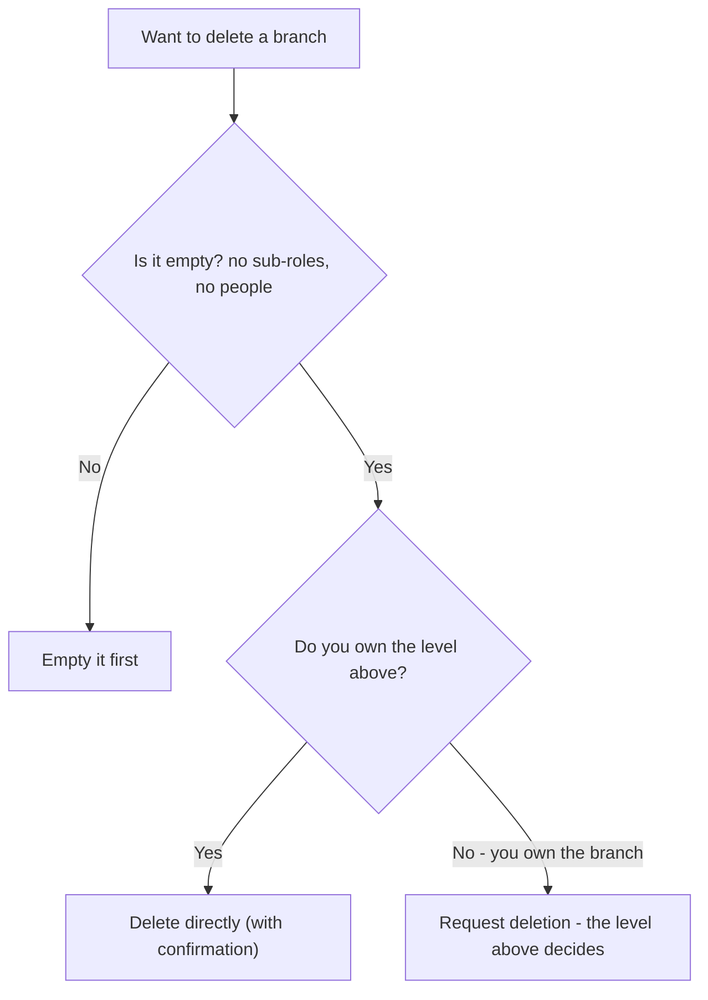

# Chapter 6 — Building your structure

## What it is

Your structure is the shape of your organization — the roles and sub-roles that knowledge
and people hang from. You grow and shape it from the **Group configuration** section of any
role you govern. This chapter covers **sub-groups**, **visibility**, and **deleting a
branch**.

Open it by clicking a star you govern on the constellation, then choosing **Group
configuration**.

---

## Why it matters

| Parameter | What changes |
|-----------|--------------|
| **Time** | A branch is created in about eight seconds and immediately inherits everything published above it. Onboarding a new team becomes "make the branch, add the people" rather than "copy the training matrix". |
| **Risk & compliance** | Structure *is* the assignment rule. Getting the tree right once means nobody has to remember who needs the cell-safety course — the branch decides. |
| **Security & custody** | Hidden branches cascade privacy down the whole subtree, and owners above always keep sight of what they are accountable for. A sensitive project can exist without existing publicly. |
| **Cost** | Reshaping the organization costs nothing and needs no migration. The tree is the only place the shape is stored. |
| **Adoption** | Branches named after real teams make the map self-explanatory. People navigate a picture of their own company, not an abstraction. |

---

## Adding a sub-group (sub-role)

Branches only ever grow **downward**. To add a new role beneath the one you're on:

1. In **Group configuration**, find the **Sub-groups** row.
2. Select **+ Sub-role**.
3. Enter the new role's name (e.g. *Firmware Team* under *Engineering*).
4. Optionally tick **Hidden (private)** to make the new branch private from the start
   (see visibility below).
5. Select **Create**.

The new star appears immediately on the constellation, connected beneath the current role.

> You'll only see the **+ Sub-role** option if you hold the *"may create sub-groups"* right
> on that branch. Least-privilege governance
> ([Chapter 7](chapter-07-people-and-governance.md)) decides who can grow the tree.

---

## Visibility: public by default, hidden on purpose

Every branch is **public by default** — meaning every member of the organization can see it
and send a **Join request** to it. You control this with a single checkbox:

- Leave it unticked → the branch is **public**.
- Tick **Hidden (private) branch** → the branch is hidden from people on the same layer and
  below. Hiding cascades: **everything beneath a hidden branch is hidden too**, all the way
  down.

Two important rules:

- **Owners above a hidden branch always keep seeing it.** Hiding never blinds the people
  responsible for that part of the tree.
- If your branch is marked public but a **level above** is hidden, your branch stays hidden
  too. In that case the panel tells you, and — if you have the right — offers a **Request
  visibility** button to ask the level above to unhide the chain.

In the sample *Aurora Robotics*, the **Research Lab** branch is hidden — it doesn't appear
to ordinary members, only to the executives above it.

---

## The organization's face: its logo

On the **root** branch, Group configuration also holds the **organization logo** — the badge
shown on your dashboard card, beside the name on every page inside the organization, and on
the documents you publish.

1. Open the **root** star → **Group configuration**.
2. Find **Logo**, and choose **Upload a logo**.
3. Pick a square-ish image. It is downscaled in your browser before it is sent, so a photo
   straight off a phone is fine.
4. **Remove** puts you back to the lettered badge, in your organization's own colour.

Two deliberate decisions worth knowing:

- **Any root-branch owner can change it** — it is not behind the Supreme password. That
  password guards what cannot be undone; a logo is reversible by uploading the old one again,
  and asking for the Supreme password to change a picture teaches people to type it without
  thinking.
- **It is not the same as your profile picture.** Yours follows you between organizations;
  this one belongs to the organization.

---

## Deleting a branch

A branch can be removed only when it is **completely empty** — no sub-roles and no people.
How you delete depends on your authority:

- **If you own the level above**, you can delete the branch **directly** — the **Delete**
  button appears in Group configuration.
- **If you own the branch itself** (but not the level above), deletion needs sign-off. You'll
  see **Request deletion** instead, which files a **Deletion request** with the level above;
  they approve or reject it from their Requests inbox
  ([Chapter 14](chapter-14-requests.md)).

The platform always confirms before deleting.

---

## Flows at a glance

**Creating a sub-role:**

**Setting visibility:**

**Deleting a branch:**

---

## Tips & pitfalls

- **Design top-down.** Create the big divisions first (Engineering, Operations, People), then
  add teams beneath them. Courses placed high can inherit down to everything you add later.
- **Use hidden branches for sensitive teams** — a security team, an M&A workstream, an
  unannounced project. Remember the whole subtree inherits the privacy.
- **Empty before you delete.** Move or remove people and sub-roles first; the branch must be
  empty for deletion to succeed.
- **Prefer wide to deep.** Siblings lay out and label cleanly; deep nesting produces a tall,
  thin tree that is hard to frame and harder to explain.
- **Name branches after teams, not after courses.** "Safety & Compliance" is a branch;
  "Annual Refresher" is a course that lives on it.
- **A hidden branch is still governed.** Hiding does not remove it from the compliance report
  of the owners above it — it removes it from everyone else's map.

---

## 🎬 Make a video of this

**Length:** ~2 minutes. **Working title:** *"Growing the tree."*

| # | Shot | Say |
|---|------|-----|
| 1 | Constellation → click a branch → **Group configuration** | "Everything about a branch's shape lives in one panel." |
| 2 | **+ Sub-role**, type a name, **Create** | "Branches only grow downward. Name it, and it appears." |
| 3 | Tick **Hidden (private)** on a new branch | "Tick hidden and the whole subtree below it disappears from everyone else's map." |
| 4 | Show the same map as an ordinary member — the branch is gone | "Same organization, different map. That's the point." |
| 5 | Root branch → **Logo** → upload | "And on the root, the organization's own face." |
| 6 | Try to delete a branch that still has people | "Delete needs it empty — and, if you don't own the level above, sign-off from someone who does." |

**Script beat to close on:** *"Structure is not paperwork here. It's the rule that decides who
gets taught what."*

**Next:** [Chapter 7 — People & governance →](chapter-07-people-and-governance.md)
