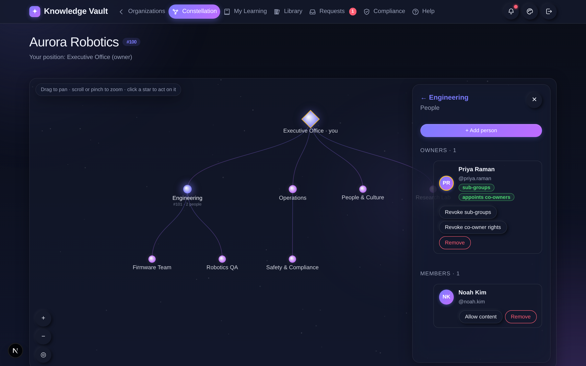

# Chapter 6 — People & governance

## What it is

The **People** section of a role is where you place and manage the humans on that branch —
its **owners** (who manage it) and its **members** (who learn from it). It's also where
Knowledge Vault's **least-privilege governance** becomes concrete: you decide exactly which
rights each owner holds.

Open it by clicking a role you govern, then choosing **People**.

The panel groups people into **Owners** and **Members**, each with a count, and gives every
person a card with their name, `@username`, and any special rights shown as small green
chips.

---

## Adding a person

1. Select **+ Add person**.
2. Choose whether to add **a member** ("they learn from this branch") or **a co-owner**
   ("they help manage this branch"). The co-owner option only appears if you're allowed to
   appoint co-owners.
3. Enter their **username**.
   - Unknown usernames are **reserved** — when that person registers, they're attached
     automatically.
4. Set any rights (see below), then confirm.

If something goes wrong (for example, a typo'd username), the form stays open and tells you —
it never closes silently.

---

## The two kinds of person

### Members
Members receive the branch's courses in their **My Learning**. You can additionally grant a
member the right to **create content** — meaning they can *propose* documents. Their
documents don't go live immediately; they publish only after an owner approves them through
**Document review** (see Chapter 7). In the sample, *Marco Diaz* is a Firmware member with
this content-creation grant.

### Owners (and co-owners)
Owners manage the branch. When you appoint a co-owner, you choose which rights they get —
and here's the golden rule of the whole platform:

> **You can only grant a right you hold yourself.** An owner can never hand out a capability
> they don't have.

The grantable rights are:

| Right | What it lets the owner do |
|-------|---------------------------|
| **May create sub-groups** | Grow the branch downward with new sub-roles |
| **May appoint further co-owners** | Add other owners to the branch |
| **May create content** *(members)* | Propose documents for manager review |

In the People panel, these appear as chips like **sub-groups** and **appoints co-owners** on
an owner's card — in the screenshot, *Priya Raman* holds both.

---

## Managing existing people

Each person's card carries quick actions:

- **Toggle their rights** — e.g. *Allow / Revoke sub-groups*, *Allow / Revoke co-owner
  rights*, or *Allow / Revoke content* for members. Changes take effect immediately.
- **Remove** — take the person off this branch (with a confirmation). Removing someone from a
  branch doesn't delete their profile or their other positions.

---

## Tips

- **Grant the minimum that gets the job done.** A team lead who only needs to add members
  doesn't need the "appoint co-owners" right. Least privilege keeps your structure safe.
- **Delegate downward.** Give division owners the "create sub-groups" right so they can build
  out their own teams without coming back to you.
- **Content rights are powerful but safe.** Letting a member create content speeds up
  authoring, and the mandatory review step means nothing publishes without an owner's
  approval.

**Next:** [Chapter 7 — Courses: publishing knowledge →](chapter-07-courses.md)
