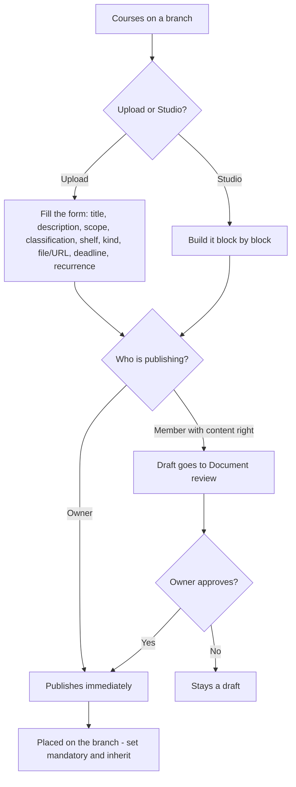
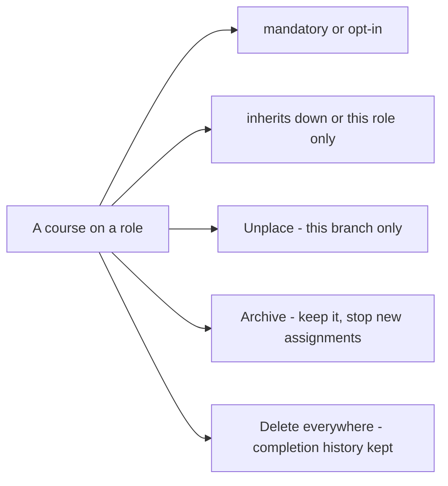

# Chapter 7 — Courses: publishing knowledge

## What it is

A **course** is any piece of knowledge you publish to a branch — a document, a book, an
external link, an audio file or a video. Courses are the heart of Knowledge Vault: you place
them on roles, decide whether they're mandatory, and let them **inherit** down the tree so
the right people are trained automatically.

Open the **Courses** section by clicking a role you govern, then choosing **Courses**.

The panel has two parts: buttons to **add** a course, and a list of the **courses already on
this role**, each shown with its code, type, classification and placement settings.

---

## Publishing a course

You have two ways to create one:

- **+ Upload course** — bring in an existing file, or point to an external URL.
- **✍ Create in Studio** — build an interactive document from scratch (Chapter 8).

Above the two buttons a line shows what your organization's plan still allows: how many
**custom documents** (built in the Studio) and **uploads** have been used. The free demo
structure includes **20 custom documents** and **30 uploads**. When an allowance is used up,
the button explains it and points you at your organization's main administrator, who can
arrange a premium plan with the Knowledge Base team — or you can free capacity by deleting
material that is no longer required.

Choosing **Upload course** opens a form:

The key fields:

| Field | What it does |
|-------|--------------|
| **Title** | The course name (also the document's cover title) |
| **Short description** | One or two sentences — shown in the library and on the cover |
| **Scope** | Who it applies to and what it covers — added to the standard cover |
| **Classification** *(required)* | Public / Confidential / Private / Secret |
| **Library shelf (category)** | A tag like *Compliance*, *Safety*, *Engineering* |
| **Kind** | Document, Book, Link, Audio or Video |
| **External URL** *or* **File** | The content itself (a link, or a file up to 10 MB) |
| **Deadline (days)** | How long people have to complete it |
| **Retake every N days** | For recurring/annual training |
| **Prerequisite codes** | Courses that must be completed first |

There are also checkboxes for **Allow download**, **Publish to the library**, **Mandatory**,
**Inherit to lower branches**, and **Updates reset completion**.

> **Smart shelf suggestions:** as you type a title and description, Knowledge Vault suggests
> an existing library shelf where similar content already lives — so related material stays
> together. You can always accept the suggestion or keep your own tag.

Select **Publish course** and it appears on the branch, in members' My Learning, and (if you
chose) in the library.

---

## Placement settings: mandatory & inherit

Every course on a role shows two toggles you can flip any time:

- **mandatory ✓ / opt-in** — whether people *must* complete it, or may choose to.
- **inherits ↓ ✓ / this role only** — whether the course reaches every branch beneath this
  role, or stays put.

This is how one course, placed once at *Executive Office*, can become mandatory training for
the whole company. In the sample, **Code of Conduct & Ethics** and **Information Security
Essentials** are both mandatory and inherit down from the top.

Other actions per course: **Unplace** (remove from this branch only — the course still exists
elsewhere), **Archive** (keep it but stop new assignments), and **Delete** (remove it
everywhere; completion history is preserved).

---

## Classifications

Every course must carry a classification, shown as a coloured badge everywhere it appears:

| Badge | Classification | Typical use |
|-------|----------------|-------------|
| 🟢 **Public** | Public | Anyone in the org |
| 🟡 **Confidential** | Confidential | Need-to-know |
| 🟣 **Private** | Private | A specific group |
| 🔴 **Secret** | Secret | The most sensitive material |

---

## Members proposing content

If you granted a member the **create content** right (Chapter 6), the documents they author
arrive as a **draft** and enter **Document review**. As an owner, you approve or reject the
draft; only on approval does it publish. This lets teams contribute knowledge while keeping
a manager in the loop.

---

## Flows at a glance

**Publishing a course:**

**Configuring a placed course (owner controls, anytime):**

---

## Tips

- **Place high, inherit down.** For company-wide training, publish once at the top with
  *inherit* on — you won't have to repeat yourself for every team.
- **Use deadlines and recurrence for compliance courses.** A 14-day deadline plus an annual
  retake keeps mandatory training current, and feeds the Compliance dashboard (Chapter 12).
- **Prerequisites build learning paths.** Require *Embedded C Best Practices* before the
  *Firmware Release Checklist*, and people are guided through in the right order.

**Next:** [Chapter 8 — The Document Studio →](chapter-08-the-studio.md)
