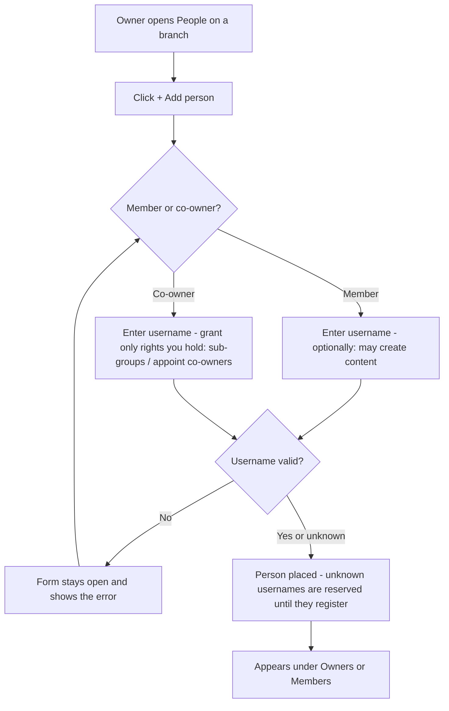
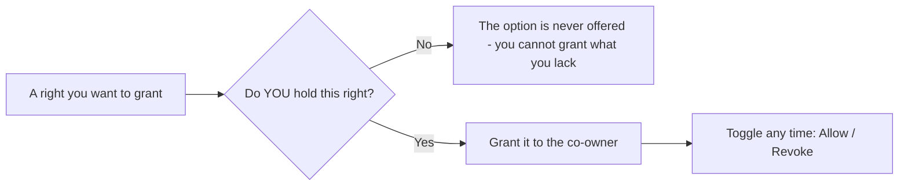
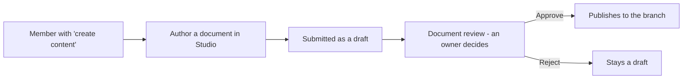

# Chapter 7 — People & governance

## What it is

The **People** section of a role is where you place and manage the humans on that branch —
its **owners** (who manage it) and its **members** (who learn from it). It's also where
Knowledge Vault's **least-privilege governance** becomes concrete: you decide exactly which
rights each owner holds.

Open it by clicking a role you govern, then choosing **People**.

The panel groups people into **Owners** and **Members**, each with a count, and gives every
person a card with their name, `@username`, and any special rights shown as small green
chips.

---

## Why it matters

| Parameter | What changes |
|-----------|--------------|
| **Time** | Typing two characters suggests the people who already exist, so nobody is added twice under a misspelt handle — and a person who has not registered yet can still be placed today. |
| **Risk & compliance** | Every right is named, visible on the person's card, and revocable in one click. "Who can publish to this branch?" is answered by looking, not by asking. |
| **Security & custody** | The golden rule — you can only grant a right you hold yourself — makes privilege escalation structurally impossible rather than merely discouraged. |
| **Cost** | Seats are counted per **person**, not per position. Someone who sits on four branches costs one seat, so a rich structure doesn't inflate the bill. |
| **Adoption** | People arrive already placed: their courses are waiting the first time they sign in, with no "please enrol yourself" email. |

---

## Adding a person

1. Select **+ Add person**.
2. Choose whether to add **a member** ("they learn from this branch") or **a co-owner**
   ("they help manage this branch"). The co-owner option only appears if you're allowed to
   appoint co-owners.

   

3. Enter their **username**. **Type two characters and the field suggests people**, marking
   those already in this organization — so you can confirm a person exists before you commit.
   - Unknown usernames are **reserved** — when that person registers, they're attached
     automatically.
   - The same field serves every form that asks for a person, so what you learn here works
     everywhere.
4. Set any rights (see below), then confirm.

If something goes wrong (for example, a typo'd username), the form stays open and tells you —
it never closes silently.

### How many people you can add

Your organization's **plan** sets how many people it may hold. The count is per **person**,
not per position — placing someone who is already in the organization onto another role costs
nothing. Only a brand-new face uses a seat.

When the organization is full, adding someone (or approving their Join request) is refused
with the reason:

> *This organization's plan allows up to 250 members. Upgrade the plan to add more.*

Nobody is removed and nothing breaks — you either free a seat or move to a bigger plan. See
[Chapter 17](chapter-17-plans-and-access.md) for the limits each plan carries.

---

## The two kinds of person

### Members
Members receive the branch's courses in their **My Learning**. You can additionally grant a
member the right to **create content** — meaning they can *propose* documents. Their
documents don't go live immediately; they publish only after an owner approves them through
the **review channel** ([Chapter 11](chapter-11-editions-and-review.md)). In the sample,
*Noah Kim* is a Firmware member with this content-creation grant — and the rig notes he
proposed are waiting for Priya to approve.

### Owners (and co-owners)
Owners manage the branch. When you appoint a co-owner, you choose which rights they get —
and here's the golden rule of the whole platform:

> **You can only grant a right you hold yourself.** An owner can never hand out a capability
> they don't have.

The grantable rights are:

| Right | What it lets the owner do |
|-------|---------------------------|
| **May create sub-groups** | Grow the branch downward with new sub-roles |
| **May appoint further co-owners** | Add other owners to the branch |
| **May create content** *(members)* | Propose documents for manager review |

When you add a co-owner, you tick only the rights you want them to hold — and you'll only be
*offered* the rights you hold yourself:

In the People panel, these appear as chips like **sub-groups** and **appoints co-owners** on
an owner's card — in the screenshot, *Priya Raman* holds both.

---

## Managing existing people

Each person's card carries quick actions:

- **Toggle their rights** — e.g. *Allow / Revoke sub-groups*, *Allow / Revoke co-owner
  rights*, or *Allow / Revoke content* for members. Changes take effect immediately.
- **Remove** — take the person off this branch (with a confirmation). Removing someone from a
  branch doesn't delete their profile or their other positions.

---

## Flows at a glance

**Adding a person (member or co-owner):**

**Least-privilege granting (the golden rule):**

**A member proposing content:**

---

## Tips & pitfalls

- **Grant the minimum that gets the job done.** A team lead who only needs to add members
  doesn't need the "appoint co-owners" right. Least privilege keeps your structure safe.
- **Delegate downward.** Give division owners the "create sub-groups" right so they can build
  out their own teams without coming back to you.
- **Content rights are powerful but safe.** Letting a member create content speeds up
  authoring, and the mandatory review step means nothing publishes without an owner's
  approval.
- **Appoint a second owner on day one.** An organization with exactly one owner has a single
  point of failure wearing shoes.
- **Removing someone from a branch is not deleting them.** Their profile, their other
  positions and their completion history are untouched.
- **Watch for the seat limit before a hiring wave**, not during it — the refusal is polite,
  but it still stops you mid-onboarding.

---

## 🎬 Make a video of this

**Length:** ~2 minutes. **Working title:** *"Least privilege, in three clicks."*

| # | Shot | Say |
|---|------|-----|
| 1 | **People** panel, owners and members grouped | "Owners manage. Members learn. Both live here." |
| 2 | **+ Add person** → the member/co-owner chooser | "Two kinds of person, two different forms." |
| 3 | Type two letters in the username field | "It suggests who already exists — and marks who's already here." |
| 4 | Tick *may create content* on a member | "A member can propose documents. They publish after review, never before." |
| 5 | Add a co-owner; show a right you don't hold is not offered | "You can only grant a right you hold yourself. The option simply isn't there." |
| 6 | Revoke a chip on an existing owner's card | "And any right comes back in one click." |

**Script beat to close on:** *"Nobody in this system can quietly give themselves more power
than they were given."*

**Next:** [Chapter 8 — Courses: publishing knowledge →](chapter-08-courses.md)
