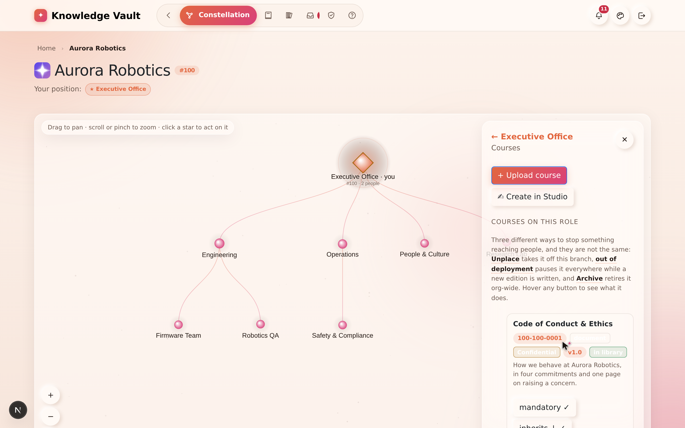
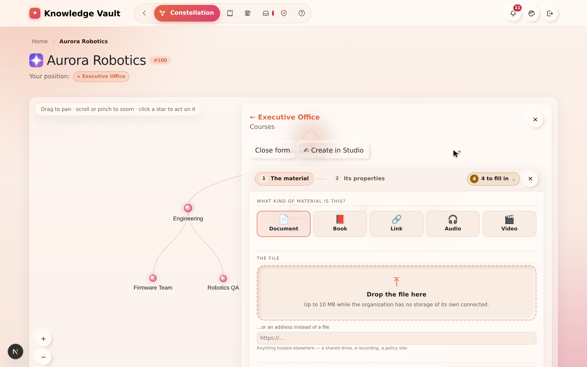
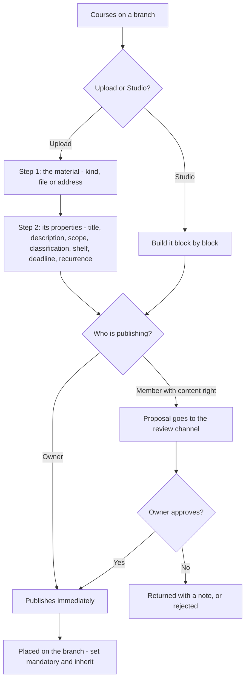
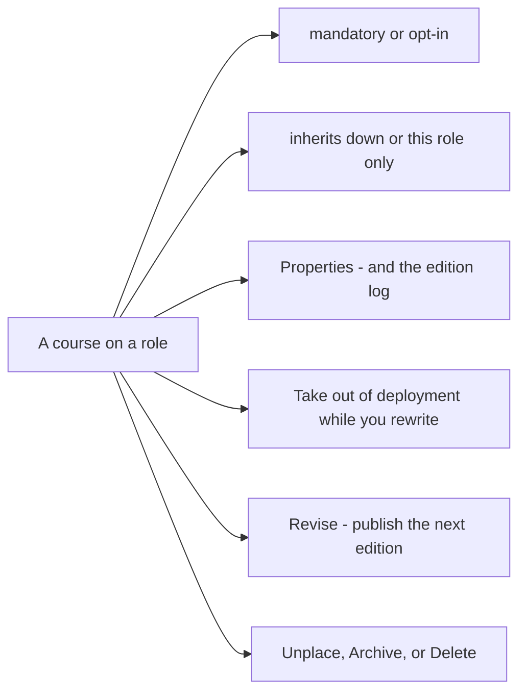

# Chapter 8 — Courses: publishing knowledge

## What it is

A **course** is any piece of knowledge you publish to a branch — a document, a book, an
external link, an audio file, a video, or an exam. Courses are the heart of Knowledge Vault:
you place them on roles, decide whether they're mandatory, and let them **inherit** down the
tree so the right people are trained automatically.

Open the **Courses** section by clicking a role you govern, then choosing **Courses**.



The panel has two parts: buttons to **add** a course, and a list of the **courses already on
this role**, each shown with its code, type, classification and placement settings. Your
plan's remaining allowance sits quietly at the **foot** of the panel — a footnote, not a
banner, and absent entirely on a plan with no limits.

---

## Why it matters

| Parameter | What changes |
|-----------|--------------|
| **Time** | Publish once at the right height and it reaches every branch below, now and forever. A new team created next year inherits the whole company's mandatory training the moment it exists. |
| **Risk & compliance** | Deadlines, recurrence and prerequisites are properties of the course, not of a spreadsheet somebody maintains. The compliance report is computed from them, so the report and the rule can never disagree. |
| **Security & custody** | Every course carries a compulsory classification, and a document may be marked non-downloadable so it can be read but not carried away. |
| **Cost** | One document replaces the printed pack, the shared-drive copy and the "final_v3_REALLY_final.pdf" everybody kept locally. |
| **Adoption** | People are not asked to enrol. What reaches their position is simply *there* in My Learning, with the deadline printed on it. |

---

## Publishing a course

You have two ways to create one:

- **+ Upload course** — bring in an existing file, or point to an external URL.
- **✍ Create in Studio** — build an interactive document, book or exam from scratch
  ([Chapter 9](chapter-09-the-studio.md)).

### The upload composer, step by step

Choosing **+ Upload course** opens a two-step composer. The drawer widens to make room for
it, and a counter in the header tells you how many required fields are still empty.



**Step 1 — The material.**

| Field | What it does |
|-------|--------------|
| **What kind of material is this?** | Document, Book, Link, Audio or Video |
| **The file** | Drag it in, or choose it. Up to **10 MB** while the organization has no storage of its own connected — with a NAS connected, the browser uploads straight to your storage and the limit is your disk |
| **…or an address instead of a file** | Anything hosted elsewhere — a shared drive, a recording, a policy site |

**Step 2 — Its properties.**

| Field | What it does |
|-------|--------------|
| **Title** | The course name (also the document's cover title) |
| **Short description** | One or two sentences — shown in the library and on the cover |
| **Scope** | Who it applies to and what it covers — added to the standard cover |
| **Classification** *(required)* | Public / Confidential / Private / Secret |
| **Library shelf (category)** | A tag like *Governance*, *Safety*, *Engineering* |
| **Deadline (days)** | How long someone has to finish it **after it reaches them** |
| **Retake every N days** | For recurring/annual training |
| **Prerequisite codes** | Courses that must be completed first |
| **Replaces** | An existing course this one supersedes or coexists with ([Chapter 11](chapter-11-editions-and-review.md)) |

There are also checkboxes for **Allow download**, **Publish to the library**, **Mandatory**,
**Inherit to lower branches**, and **Updates reset completion**.

> **Smart shelf suggestions:** as you type a title and description, Knowledge Vault suggests
> an existing library shelf where similar content already lives — so related material stays
> together. You can always accept the suggestion or keep your own tag.

Select **Publish course** and it appears on the branch, in members' My Learning, and (if you
chose) in the library.

> **Read the deadline field literally.** *Deadline (days)* is how long a person has **after
> the course reaches them** — which is the later of the day it was placed on their branch and
> the day they joined that branch. Somebody who starts on Monday is not instantly late for a
> course that has been on the branch for a year. [Chapter 15](chapter-15-compliance.md)
> shows what that looks like in the report.

---

## Course codes

Every course gets a permanent, platform-unique code the moment it is published:

```
100 - 102 - 0001
 │     │      └── the sequence number within that role
 │     └───────── the role number that published it
 └─────────────── the organization number
```

`100-102-0001` is the first course published by role 102 (*Operations*) in organization 100
(*Aurora Robotics*). Codes never change and never get reused — which is why prerequisites,
supersessions and audit records can all point at them safely.

---

## Placement settings: mandatory & inherit

Every course on a role shows two toggles you can flip any time:

- **mandatory ✓ / opt-in** — whether people *must* complete it, or may choose to.
- **inherits ↓ ✓ / this role only** — whether the course reaches every branch beneath this
  role, or stays put.

This is how one course, placed once at *Executive Office*, becomes mandatory training for the
whole company. In the sample, **Code of Conduct & Ethics** and the **Data Handling Standard**
are both mandatory and inherit down from the top; **Robot Cell Safety — Level 1** does the
same from *Operations*, so it reaches *Safety & Compliance* without being placed there.

Other actions per course:

| Action | What it does |
|--------|--------------|
| **⚙ Properties** | Everything the composer asked, editable — plus the **edition log** |
| **⏸ Take out of deployment** | Readers keep the live edition; nothing new is served while you rewrite |
| **✎ Revise** *(Studio material)* | Opens the live edition in the Studio to publish the next one |
| **⇪ Replace file** *(uploads)* | Swaps the file behind the same course, as a new edition |
| **Unplace** | Remove from this branch only — the course still exists elsewhere |
| **Archive** | Keep it, stop new assignments |
| **Delete** | Remove it everywhere; completion history is preserved |

---

## Classifications

Every course must carry a classification, shown as a coloured badge everywhere it appears:

| Badge | Classification | Typical use |
|-------|----------------|-------------|
| 🟢 **Public** | Public | Anyone in the org |
| 🟡 **Confidential** | Confidential | Need-to-know |
| 🟣 **Private** | Private | A specific group |
| 🔴 **Secret** | Secret | The most sensitive material |

The classification menu is drawn as a light sheet with dark ink on **every** theme —
deliberately, because the browser draws that menu itself and platforms disagree about how
much styling they honour. It is the one control in the product that ignores your theme, so
that it can never be four invisible lines.

---

## Members proposing content

If you granted a member the **create content** right
([Chapter 7](chapter-07-people-and-governance.md)), the documents they author arrive as a
**proposal** and enter the **review channel**. As an owner, you approve, reject, or send it
back with a note; only on approval does it publish.
[Chapter 11](chapter-11-editions-and-review.md) covers the whole channel.

---

## Flows at a glance

**Publishing a course:**



**Configuring a placed course (owner controls, anytime):**



---

## Tips & pitfalls

- **Place high, inherit down.** For company-wide training, publish once at the top with
  *inherit* on — you won't have to repeat yourself for every team.
- **Use deadlines and recurrence for compliance courses.** A 14-day deadline plus an annual
  retake keeps mandatory training current, and feeds the Compliance dashboard
  ([Chapter 15](chapter-15-compliance.md)).
- **Prerequisites build learning paths.** Require *Robot Cell Safety — Level 1* before the
  *Assessment*, and people are guided through in the right order — the exam simply won't open
  until the reading is done.
- **Opt-in is not useless.** A course in the library that nobody must do is how a good
  reference document reaches the people who want it, without adding a red badge to everyone's
  dashboard.
- **Archive rather than delete** when material is superseded but historically interesting.
  Deleting keeps the completion history, but the document itself is gone.
- **Don't upload what you can author.** A Studio document is searchable, zoomable, printable
  and revisable in place; a PDF is a picture of a document.

---

## 🎬 Make a video of this

**Length:** ~3 minutes. **Working title:** *"Publish once, reach everyone."*

| # | Shot | Say |
|---|------|-----|
| 1 | Courses panel on the root branch | "Everything published to a branch lives here — and so does everything it inherits." |
| 2 | **+ Upload course** → step 1, choose *Document*, drop a file | "Step one is the material: a file, or an address if it lives elsewhere." |
| 3 | Step 2 — fill title, description, pick **Confidential** | "Step two is what it *is*. Classification is compulsory; there is no unlabelled document here." |
| 4 | Set **deadline 14**, **retake 365**, tick **mandatory** and **inherit** | "Fourteen days from the day it reaches you, every year, for everyone below this branch." |
| 5 | Publish; cut to a junior member's My Learning | "One publish. It's already on their list, with the deadline printed on it." |
| 6 | Back on the panel, toggle *mandatory → opt-in* | "And every one of those decisions is reversible in a click." |

**Script beat to close on:** *"The tree decides who. The course decides when. Nobody maintains
a matrix."*

**Next:** [Chapter 9 — The Document Studio →](chapter-09-the-studio.md)
