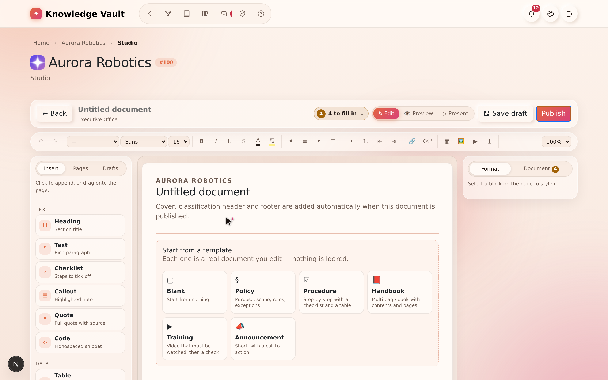

# Chapter 8 — The Document Studio

## What it is

The **Studio** is a full document editor built into Knowledge Vault. Instead of uploading a
file, you compose a document right in the browser from **blocks** — headings, rich text,
tables, checklists, callouts, quotes, code, images, audio and video, buttons, columns and
page breaks — format them exactly as you want, and watch them render live in your
organization's standard document frame.

You reach the Studio from a role's **Courses** panel via **✍ Create in Studio**, or from any
of your own positions via **✍ Propose a document**.

---

## The front door: what are you creating?

The Studio asks one question before it opens anything:

- **Document** — the block editor described in this chapter.
- **Test / exam** — a multiple-choice paper people sit, marked against a pass mark. See
  *Building an exam* below.

Underneath sits **Continue a draft**, which lists unfinished work in the two places it can
live:

- **On this browser** — whatever you last had open here. Kept as you type, on **every plan**,
  on this device only. A reload or a crash never costs you your work.
- **Saved drafts** — work you parked on the server with **Save draft**. It belongs to your
  account, carries the branch it was written for, and opens on any device you sign in from.
  Parking work on the server is part of a **paid plan**; on the free plan the section says so
  and **Save draft** is locked in both editors.

Selecting any entry reopens it in the editor that wrote it, exactly where you left off. The
✕ beside a saved draft deletes it from the server.

---

## The layout

The Studio has four parts:

1. **The ribbon (top)** — formatting for whatever you are writing in: paragraph style, font,
   size, **bold**, *italic*, underline, strikethrough, **text colour**, **highlight**,
   alignment, bulleted and numbered lists, indenting, links, clear formatting, undo/redo and
   zoom.
2. **The left rail** — three tabs:
   - **Insert** — every block you can add. Click to append it, or drag it onto the page and
     drop it exactly where you want. The table entry has a size picker: hover the grid and
     click, e.g. 4 × 3.
   - **Pages** — the document's pages. Jump to a page, name it, choose its **turn animation**,
     add a page, or remove a page break.
   - **Drafts** — documents you parked on the server (see *Saving your work* below).
3. **The canvas (middle)** — your document as a stack of cards that look like the printed
   page. Hover a card for its rail: drag handle (⠿) to move it, ↑ ↓ to nudge it, ⧉ to
   duplicate, ⇄ to **turn it into** another kind of block, ✕ to delete.
4. **The inspector (right)** — two tabs:
   - **Format** — everything about the selected block: alignment, width and position,
     padding and spacing, text colour, fill, accent, line height, letter spacing, border,
     shadow, corner radius and an **entrance animation** that plays as the reader scrolls to
     it. Media blocks also get their playback settings here.
   - **Document** — the document itself: classification, type, library shelf, description
     and scope (these become the cover pages), where it is placed, and how much of your
     plan's document allowance is left.

The note at the top of the canvas is a reminder: **cover, classification header and footer
are added automatically when you publish.** You focus on content.

---

## The blocks

| Block | Use it for |
|-------|-----------|
| **Heading** | Section titles, six levels |
| **Text** | Rich paragraphs — colour, highlight, alignment, lists, links |
| **Checklist** | Steps to tick off, each with an optional hint |
| **Callout** | A highlighted note in one of six tones |
| **Quote** | A pull quote with its source |
| **Code** | A monospaced snippet, stored exactly as typed |
| **Table** | Rows and columns you edit like a sheet |
| **Contents** | A table of contents, built from your own headings |
| **Collapsible** | Expandable panels — FAQs, clauses, optional detail |
| **Image** | A picture with a caption |
| **Audio / video** | A player with speed, quality and skip rules |
| **Embed** | YouTube, Vimeo, Drive, Docs, Sheets, Slides, Forms, Maps, Calendar |
| **Button** | A call-to-action link |
| **Columns** | Two to four side-by-side sections |
| **Divider / Spacer** | A section break, or breathing room |
| **New page** | A page break, with its own turn animation |

---

## Moving things around

Everything on the page moves by dragging, with a mouse, a pen or a finger:

- **Add a block** — drag it from the **Insert** rail onto the page. A coloured line shows
  exactly where it will land; let go and it drops there. Clicking the entry instead adds it
  at the end.
- **Move a block** — grab the **grip strip down its left edge** (or the ⠿ button in its
  toolbar) and drag. The block you are carrying rides along with the pointer as a small
  label, so you always know what is moving.
- **Reorder pages** — drag the page cards in the **Pages** tab.
- **Rebalance columns** — drag the divider between two columns.
- Drag near the top or bottom of the window and the page **scrolls by itself**. Press
  **Esc** mid-drag to cancel and put everything back.

---

## Tables that behave like a spreadsheet

Select a table block and you get a real grid:

- **Column headers (A, B, C…)** — click one for a menu: insert a column left or right, set
  its width, or delete it. **Row numbers** do the same for rows.
- **+ Row / + Column** buttons, and a **+** at the end of the grid.
- **Select a range** — click a cell, then shift-click another — and format the whole
  selection at once: bold, italic, alignment, or a fill colour.
- **Paste a block of data** copied from a spreadsheet (or any tab- or comma-separated text)
  into a cell and it fills the grid, expanding it as needed.
- **Table options** along the bottom: header row, header column, banded rows, compact
  spacing, frozen header, border style and a caption.
- **Turn text into a table** — select a paragraph or checklist, press ⇄ and choose *Table*.
  Each line becomes a row. The same menu turns a table back into a checklist.

**Tab** moves to the next cell, **Enter** to the next row (adding one when you reach the
bottom), and the arrow keys move up and down.

---

## Audio and video that behave the way training material should

Add an **Audio / video** block, paste the address, then open the inspector's **Format** tab:

- **Speed control** — offer the reader 0.5× to 2×, and set the speed it starts at.
- **Quality ladder** — add a rendition per quality (1080p, 720p, low data). The reader
  switches between them from the player and keeps their place.
- **Skip control** — turn *Reader may skip ahead* **off** for material that must genuinely be
  watched: rewinding stays allowed, but jumping past the furthest point actually watched is
  refused, and the player shows a **🔒 no skipping** badge.
- **Watched-in-full marker**, poster image, captions file, a **clip window** (start and end
  seconds), autoplay, loop, start muted, and whether the browser's download control appears.

---

## Embedding other things

The **Embed** block frames content from the tools an organization already uses: YouTube,
Vimeo, Google Drive, Docs, Sheets, Slides, Forms, Maps and Calendar. Paste the ordinary
share link and it appears in the document.

Other addresses are refused on purpose. The platform only frames hosts it knows, and it
rebuilds the address itself before storing it, so a document can carry a briefing video or
a sign-up form without carrying anything else into the vault.

---

## Themes and templates

- **Templates.** A new document offers a starting point — *Policy*, *Procedure*, *Handbook*,
  *Training*, *Announcement* — each a real document with its sections already in place. Pick
  one and edit; nothing is locked.
- **Themes.** The inspector's **Document** tab sets the look of the whole document at once:
  type pairing, accent colour, paper, density, how headings are set, and the page width. The
  theme travels with the document, so readers see exactly what you chose.

---

## Pages and motion

Every **New page** block starts a new page, and carries the animation the page arrives with —
fade, slide, push, flip, zoom or reveal. Readers turn pages with the ← → keys in the viewer.
Individual blocks can also have an **entrance animation** that plays when the reader scrolls
to them. Readers who ask their device for reduced motion get the document without animation,
automatically.

---

## Three ways to look at your document

- **✎ Edit** — the editor.
- **👁 Preview** — the finished document inside the standard frame: classification banner,
  cover, description and scope.
- **▷ Present** — a full-screen, page-by-page presentation. Turn pages with ← →, leave with
  **Esc**.

Preview also has a **device switcher** — desktop, tablet, phone — so you can check the
document reads properly on the screen your colleagues will actually open it on.

---

## Saving your work

Work in progress lives in two places, and both editors behave the same way:

- **This browser — always, on every plan.** What you are writing is kept here as you type, so
  a reload or a crash never costs you your work. It is this device only, and it holds one
  document and one exam per branch.
- **The server — Save draft, paid plans only.** Parks the whole thing (content *and* its
  publish settings) under your account, so you can close the laptop and pick it up anywhere.
  Reopen it from the **Drafts** tab inside the editor, or from **Continue a draft** on the
  Studio's front door. On the **free plan** the button shows a padlock and explains the
  capability; ask your organization's main administrator to arrange an upgrade. Nothing is
  lost meanwhile — the browser copy is still there, and you can publish at any time.

Neither copy is visible to anyone else. A draft becomes something colleagues can see only
when you publish it (or submit it for review).

Keyboard: **Ctrl + Z** undo, **Ctrl + Shift + Z** redo, **Ctrl + S** save draft.

---

## Publishing

1. Add and format your blocks.
2. Open the inspector's **Document** tab and set the **title**, **classification**
   (compulsory), **description** and, if useful, the **scope** and library shelf.
3. Check **Preview**.
4. Select **Publish**.

- **Owners publish directly** — the document goes live on the branch straight away.
- **Members with the content grant submit for review** — the document becomes a draft that
  an owner approves before it publishes (see Chapters 6 and 7).

Your plan includes a number of **custom documents**; the status bar and the inspector show
how many are left. When the allowance is used up, the Studio says so and points you at your
main administrator, who can arrange a premium plan.

---

## Building an exam

Choosing **Test / exam** at the front door opens the same room with a form in the middle: an
ordered list of questions instead of a page of blocks. Everything *around* it is unchanged —
the exam is a course with the same code, classification, description, library shelf and
placement switches a document has, and a member's exam goes through the same review.

**The questions.** Each card has its type, the question, an optional helper line, and its
answer options with the right one(s) ticked:

| Type | Answering |
|------|-----------|
| **One answer** | Exactly one option is right |
| **Several answers** | The whole set must be picked — half an answer is not a right answer |
| **True / false** | A statement to judge |

The card tells you what is still missing ("no correct answer marked"), and the left rail
lists every question so you can jump around and reorder.

**The rules** (inspector → **Exam**):

- **Pass mark** — the percentage needed to pass, shown as the marks it works out to.
- **Marks** — every question counts the same by default. Switch on **unequal weights** and
  each card gains a marks box.
- **Answer feedback** — whether the candidate is told if an answer is right: **as they
  answer** (live, question by question), **after submitting**, or **never**. Separate
  switches show which option was right, your explanation, and the score.
- **Delivery** — randomise the question order and/or the options, one question per screen, a
  time limit, and how many attempts each person may take.

**Trying it.** **▷ Try it** sits your own paper exactly as a candidate would. It is marked in
your browser and recorded nowhere, so try it as often as you like.

**Sitting it.** Members open the exam from My Learning like any other course, inside the
standard document frame. Marking happens on the server — the answers never travel to the
candidate's browser — and an exam is completed by **passing** it, not by ticking it off.

---

## Tips

- **Preview before you publish.** The live preview shows the exact cover, classification
  banner and footers members will see.
- **Use checklists for procedures.** Release gates, safety steps and onboarding tasks read
  beautifully as tickable checklists.
- **Break long books into pages.** Name each page in the **Pages** tab and the navigator
  becomes a table of contents you can jump around in while you write.
- **Highlight sparingly.** A single highlight colour through a document reads as emphasis;
  five read as decoration.

**Next:** [Chapter 9 — The Library →](chapter-09-the-library.md)
