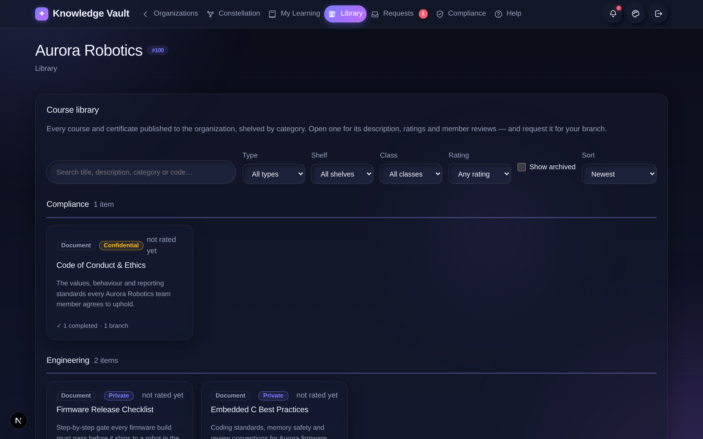

# Chapter 9 — The Library

## What it is

The **Library** is your organization's whole catalogue of published knowledge in one place —
a real library, with **shelves** grouped by category. Where the constellation shows knowledge
by *who* it's assigned to, the library shows it by *subject*, so anyone can browse, search
and discover what exists.

Open it from the **Library** tab in the top navigation.

---

## Browsing the shelves

Courses are grouped into **shelves** by their category tag — in the sample you can see
*Compliance*, *Engineering* and more, each with an item count. Every entry is a card showing:

- its **type** (Document, Book, Link, Audio, Video),
- its **classification** badge,
- its **rating** (or "not rated yet"),
- a short description, and
- where it lives (e.g. how many branches it's published on).

---

## Finding something specific

The toolbar across the top gives you full control:

| Control | What it does |
|---------|--------------|
| **Search** | Match a title, description, category or code |
| **Type** | Filter to Documents, Books, Links, Audio or Video |
| **Shelf** | Jump to a single category |
| **Class** | Filter by classification (Public → Secret) |
| **Rating** | Show only well-rated material |
| **Show archived** | Include courses that have been archived |
| **Sort** | Newest, and other orders |

---

## Opening an entry

Select any card to open its detail view. There you can:

- read its **full description and scope**,
- see its **ratings and member comments**,
- find **"where it's published"** — which jumps you back to the constellation with those
  branches **spotlighted** and the rest dimmed, so you can see its reach at a glance, and
- **request the course for your branch** — this files a Course request with that branch's
  handler, who configures it (mandatory, deadline, recurrence) before approving. See
  Chapter 11.

---

## Ratings & reviews

After completing a course, learners can **rate it out of five and leave a comment**. Those
reviews surface here in the library, helping everyone find the material that's genuinely
useful. (You'll rate a course from the in-app viewer — Chapter 10.)

---

## Tips

- **Shelves keep themselves tidy.** Because publishing suggests an existing shelf for similar
  content, your library naturally groups related material instead of sprawling.
- **Use "where it's published" to audit reach.** It's the quickest way to check that an
  important policy actually reaches every team it should.
- **Filter by classification when sharing screens.** Switch to *Public* only if you're
  demonstrating the library to an audience who shouldn't see sensitive titles.

**Next:** [Chapter 10 — My Learning & the viewer →](chapter-10-my-learning.md)
