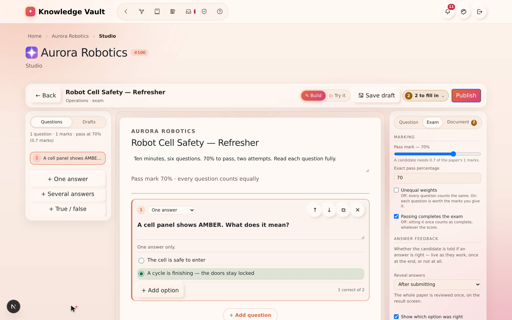
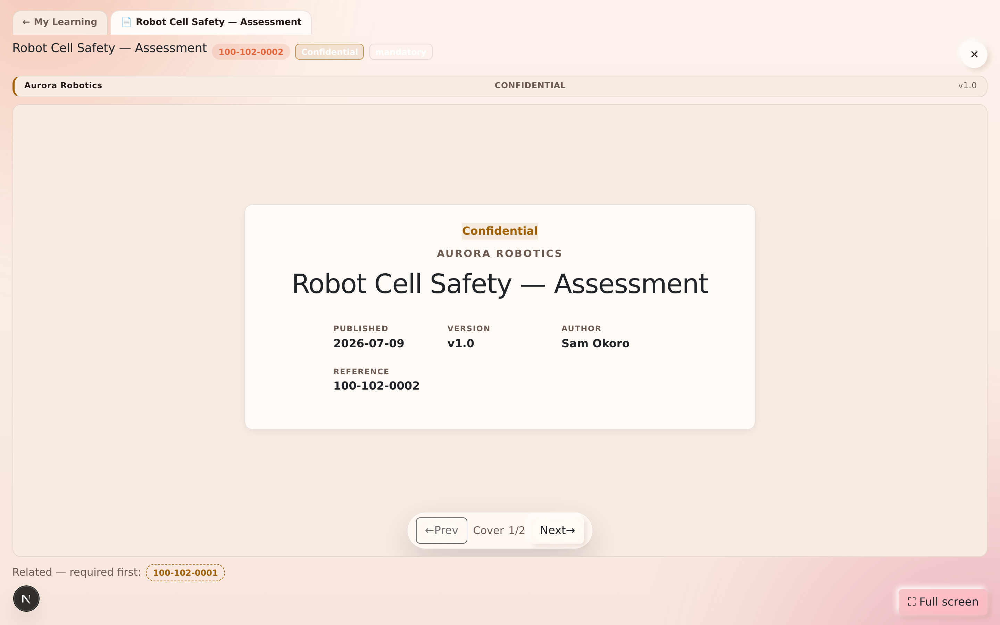
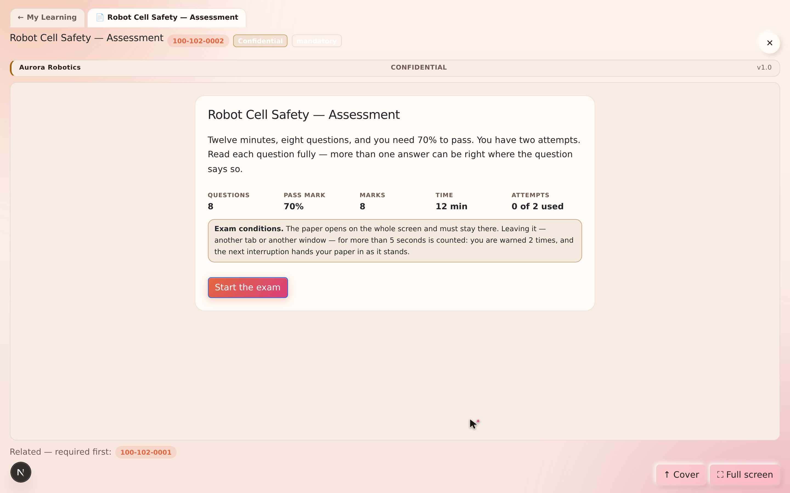
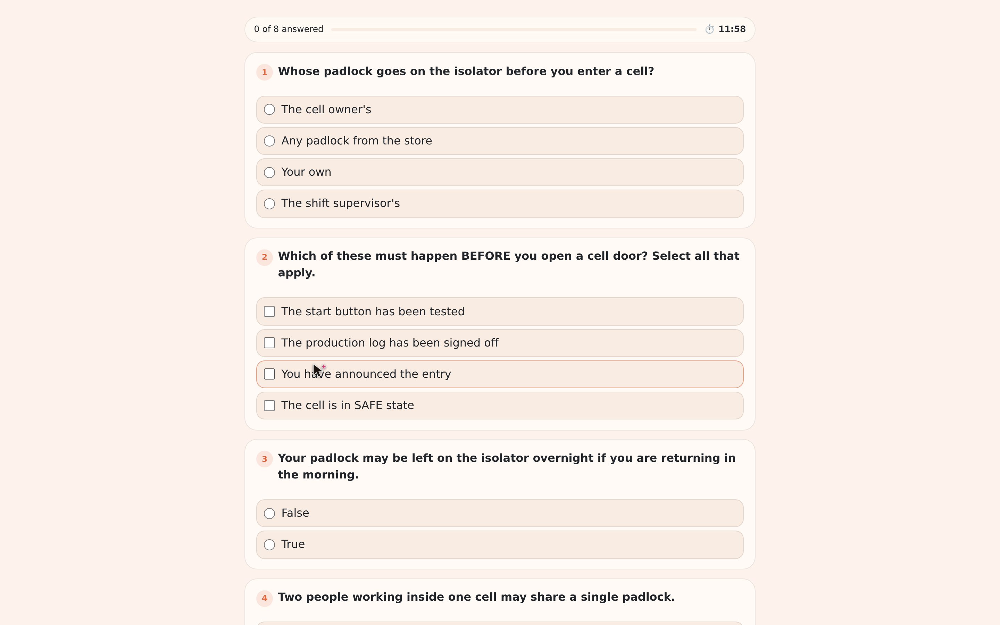
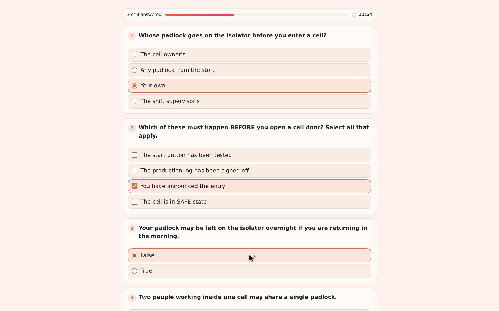
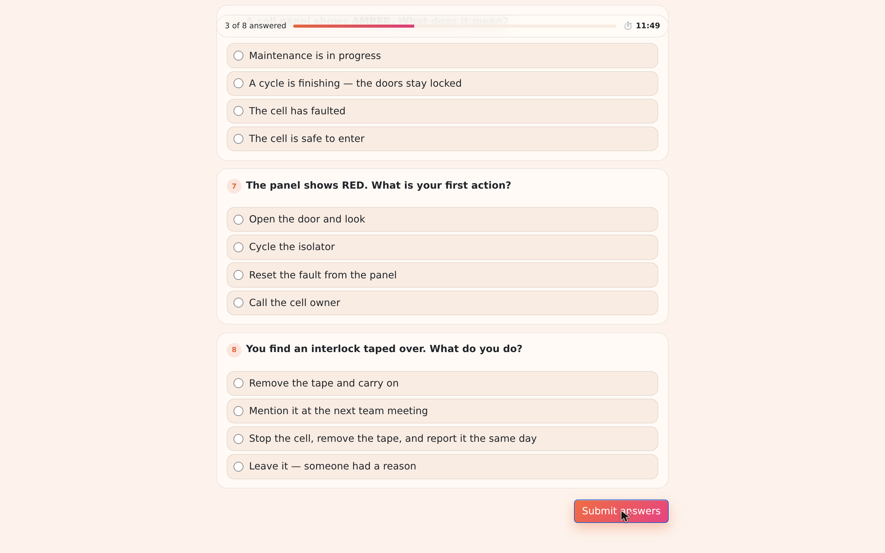
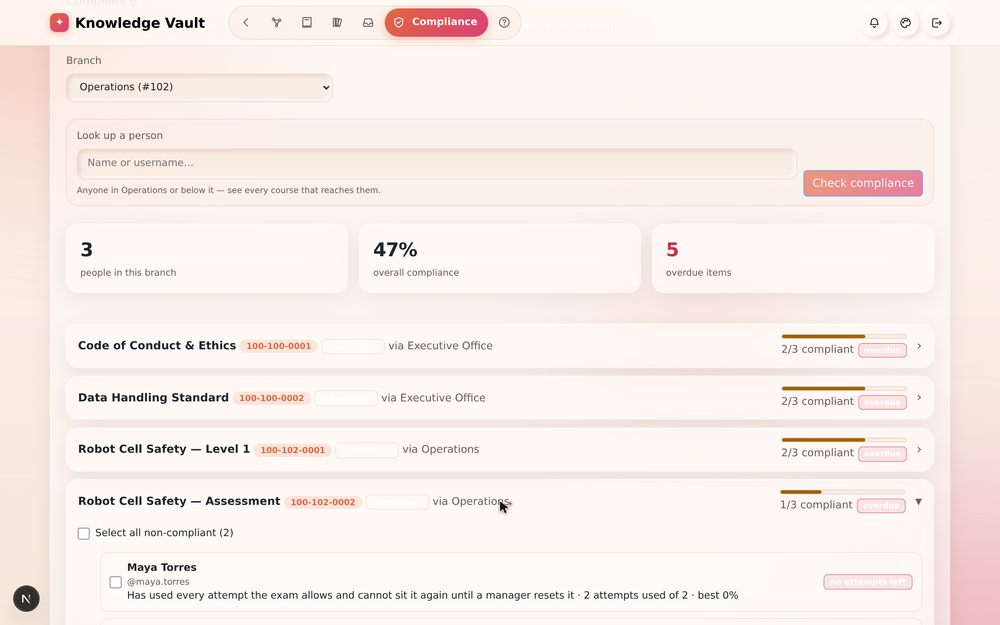
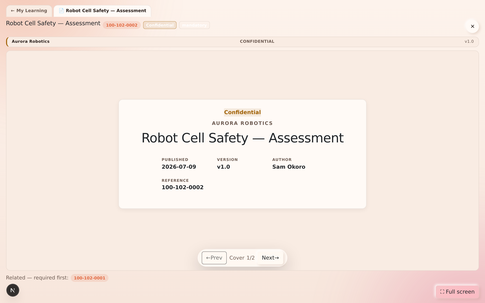

# Chapter 10 — Exams & assessment

## What it is

An **exam** is a course you *sit* rather than read. It is built in the same Document Studio as
everything else, delivered question by question, and **marked on the server** — the answer key
never reaches the candidate's browser, so there is nothing to inspect, copy or reverse.

Passing an exam completes the course exactly the way finishing a document does: it writes the
same completion record, so it lands in **My Learning** and in your branch's **Compliance**
view through the same door.

> **Where it lives:** Studio → *Create an exam*. Candidates find it in **My Learning**, on a
> button that reads **Complete the exam**.

---

## Why it matters

| Parameter | What changes |
|-----------|--------------|
| **Time** | Marking is instantaneous and needs nobody. A hundred candidates cost the same as one, and the result is in the compliance report before the candidate has left the room. |
| **Risk & compliance** | "They attended the briefing" becomes "they scored 88% on the paper, at 14:02 on the 9th, on their first attempt". That is the difference between a training record and evidence. |
| **Security & custody** | The answer key never reaches the candidate's browser — marking happens on the server. There is nothing to inspect, copy or reverse. |
| **Cost** | No proctoring service, no scanning, no marking time. The invigilator is built in. |
| **Adoption** | The paper looks like the rest of the product: same frame, same reader, same completion. Candidates do not learn a second system to be assessed in. |

---

## 1. Building a paper

Open the Studio from any branch you publish to and choose **exam** when it asks what you are
creating. You then work question by question:

| Question type | What the candidate does |
|---------------|------------------------|
| **Single choice** | Picks exactly one option. |
| **Multiple choice** | Picks every option that applies — partial answers do not score. |
| **True / false** | A single-choice question with the options written for you. |

Each question can carry:

- an **image** (a diagram, a screenshot, a photo of the equipment),
- a short **help line** shown under the prompt,
- an **explanation**, revealed after the answer depending on your reveal setting,
- a **weight**, when the paper is set to weighted marking, and
- a **required** flag, so the paper cannot be handed in with it blank.

---

## 2. The settings that matter

The Inspector's **Exam** tab is where a paper becomes an assessment rather than a quiz.

| Setting | What it does |
|---------|--------------|
| **Pass mark** | The percentage a candidate must reach. Below it, the attempt is recorded but the course is not completed. |
| **Weighted marking** | Score by question weight instead of one point per question. |
| **Reveal** | *Immediate* (right/wrong as they go), *after submission*, or *never*. |
| **Show correct answer / explanation / score** | Three separate switches — you can show the score without ever showing the key. |
| **Time limit** | Minutes for one sitting. When it runs out the invigilator hands the paper in as it stands. |
| **Attempts allowed** | How many sittings a candidate gets. Blank means unlimited. **This is the setting §5 below and [Chapter 15](chapter-15-compliance.md) talk about.** |
| **One question per page** | Turns the paper into a guided sequence rather than a long scroll. |
| **Pass required to complete** | When off, sitting the paper at all completes the course, whatever the score. |
| **Shuffle questions / options** | Each candidate gets their own order. |

### The invigilator

While a paper is open the platform watches for the candidate leaving it — switching tab,
switching app, minimising the window. Each departure is counted, the candidate is warned, and
on the **third** one the paper is handed in as it stands. The attempt records both the number
of interruptions and whether it was auto-submitted, so a manager reviewing a poor result can
see *how* it happened.

---

## 3. Sitting an exam

In **My Learning** an exam shows the same row as any other course, with one difference: the
button reads **Complete the exam** rather than *Open*.

If the exam has a **prerequisite** they have not finished, there is no Start button at all —
the reader says what has to be read first instead:

Otherwise, the brief:

What the candidate sees before they start:

- the number of questions and total marks,
- the pass mark,
- the time limit, if there is one,
- **how many attempts they have left**, and
- their best previous score, if they have sat it before.

There is no *Mark complete* button on an exam. An exam is completed by being **passed** (or,
when *pass required* is off, by being sat) — never by declaring it done.

Pressing **Start the exam** hands over the whole screen: the questions, a progress counter,
and the clock if there is a time limit.

Answers are saved as they are given, and the counter at the top reads *n of 8 answered* so
nobody submits a paper with a question they never saw.

When the paper is handed in, marking happens on the server and the result comes straight
back — the score, the verdict, and (depending on the author's reveal settings) which answers
were right and why.

---

## 4. Attempts, and running out of them

If the author set an attempt allowance, every sitting spends one. When the last is spent
without a pass:

1. The exam **locks**. Opening it again explains why rather than dealing a fresh paper.
2. The candidate gets a message in their **mailbox**: *"No attempts left on …"*, with what
   happens next.
3. **Everyone who looks after them** gets one too, so nobody has to notice on their own.
4. In the branch's **Compliance** view that person's row now reads **"Has used every attempt
   the exam allows and cannot sit it again until a manager resets it"** — not a vague
   *not completed* — beside the attempts used and their best score.

The candidate sees the same fact from their side, on the exam itself:

---

## 5. Resetting a candidate's attempts

**Who can do this:** anyone who can add people to that branch — its owners, and the levels
above them. A peer cannot reset a peer.

1. Open **Compliance** and choose the branch.
2. Expand the exam. Tick the candidates you want to release.
3. Select **♻ Reset attempts**.

What happens:

- Their allowance goes **back to zero used** — they can sit the paper again immediately.
- Their previous sittings are **kept on record**, marked as no longer counting. Nothing is
  erased; the history of what happened survives the reset.
- Any half-finished completion record goes back to *assigned*, so the exam reappears as
  something to do.
- The candidate is told, in their mailbox, that they can try again — and by whom.

> **Why not just delete the attempts?** Because "she failed three times and then passed" and
> "she passed first time" are different facts, and an audit that cannot tell them apart is
> not an audit. The reset changes what the candidate *may do next*, never what already
> happened.

---

## 6. Reading results

An exam attempt records, for every question: what was chosen, whether it was right, the marks
available and the marks earned — plus the total, the percentage, the pass/fail verdict, how
long the candidate took, how many interruptions the invigilator saw, and whether the paper was
handed in automatically.

Compliance shows the **best** attempt. A candidate who passes on their third go is compliant;
the earlier attempts remain visible as the story of how they got there.

---

## Tips & pitfalls

- **Set an attempt allowance on anything that matters.** Unlimited attempts turn a pass mark
  into a guessing game.
- **Reveal nothing on a serious paper.** *Show score* without *show correct answer* tells a
  candidate where they stand without teaching them the key.
- **Use the reset as coaching, not paperwork.** Before you reset, send the reminder that says
  what to revise — the note you type is delivered with it.
- **Weight the questions that carry the risk.** A weighted paper says what the organization
  actually cares about far better than an even split does.
- **Put the reading in front of the paper.** Make the document a prerequisite of the exam and
  the exam simply will not open until it has been read — the reader shows *Related — required
  first* instead of a Start button.
- **Shuffle both** questions and options on anything sat in a shared room.
- **Twelve minutes for eight questions** is generous; ninety seconds a question is the usual
  rule of thumb for multiple choice. A timer that never bites teaches nothing.
- **Don't reset in bulk without a note.** The reset message is the coaching; a silent reset
  just resets.

---

## 🎬 Make a video of this

**Length:** ~3 minutes. **Working title:** *"An exam that marks itself — and says why someone
failed."*

| # | Shot | Say |
|---|------|-----|
| 1 | Studio → *Test / exam* → add a single-choice question | "Same Studio, a different middle: questions instead of blocks." |
| 2 | Inspector → **Rules**: pass mark 70, attempts 2, timer 12 | "The pass mark, the attempts, and the clock." |
| 3 | **▷ Try it** — sit your own paper | "Try it yourself. It's marked in your browser and recorded nowhere." |
| 4 | Cut to a candidate: **Complete the exam** → full screen | "The candidate gets the whole screen — and it stays that way." |
| 5 | Submit, show the marked result | "Marked on the server. The key never reaches the browser." |
| 6 | Manager's Compliance → the locked row → **♻ Reset attempts** | "And when someone runs out of attempts, the report says exactly that — and a manager can hand back the allowance without erasing what happened." |

**Script beat to close on:** *"Attendance is a memory. A marked paper is a record."*

**Next:** [Chapter 11 — Editions, versions & the review channel →](chapter-11-editions-and-review.md)
