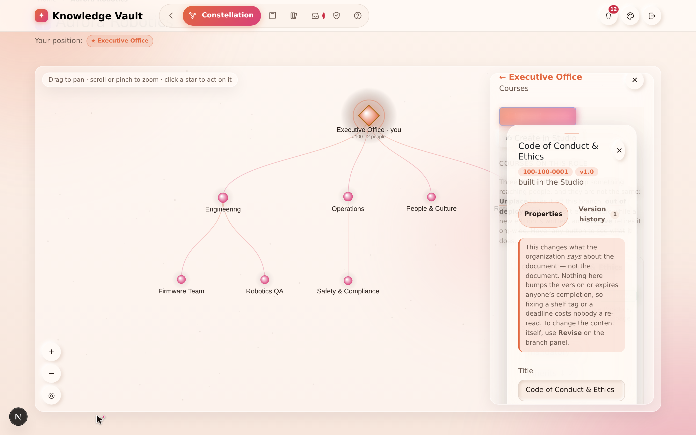
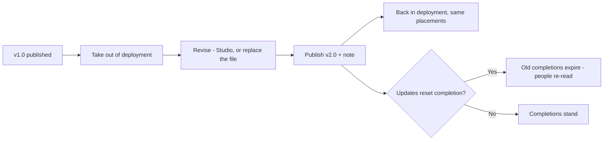
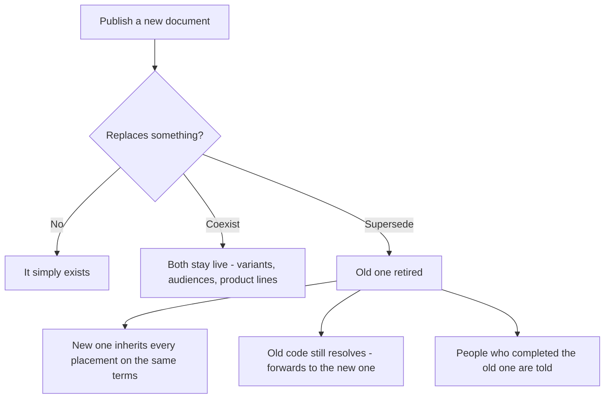
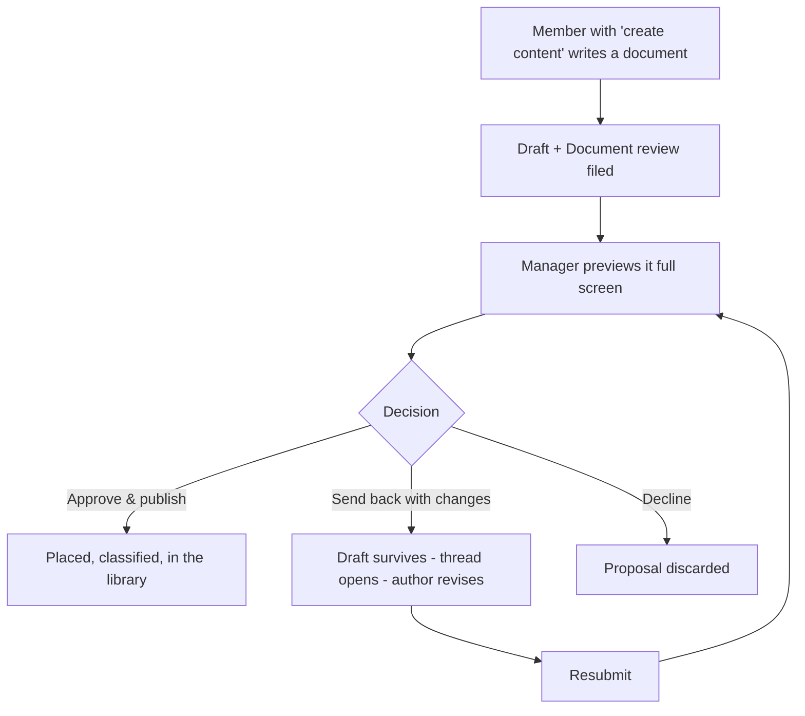

# Chapter 11 — Editions, versions & the review channel

> **In one line:** nothing published here is ever quietly overwritten — a change becomes a
> numbered **edition** with a note saying what changed, a replacement either **coexists** with
> what it replaces or **supersedes** it, and anything a member writes travels through a
> **review channel** with a real conversation in it.

## What it is

Three related ideas, all answering the same question: *what happens to a document after it is
published?*

1. **Editions** — the history of one document. v1.0 becomes v2.0 becomes v3.0, each with a
   dated line saying what changed and who changed it.
2. **Replacement** — the relationship between two different documents. The new *Cell Safety
   Standard* either sits beside the old one, or retires it and inherits everywhere it reached.
3. **The review channel** — how a document written by a member becomes a document the
   organization has published, with a conversation attached.

---

## Why it matters

| Parameter | What changes |
|-----------|--------------|
| **Time** | Revising in place keeps the code, the placements, the ratings and the completion history. The alternative — delete and re-upload — costs all four and has to be reassigned by hand. |
| **Risk & compliance** | An auditor's real question is "which version were people trained on, and when did it change?" The edition log answers it without anyone reconstructing the story from emails. |
| **Security & custody** | Superseding carries the old document's placements across automatically, so a replacement can never quietly narrow its own audience and drop people out of compliance. |
| **Cost** | One document with eleven editions instead of eleven documents. The library stays the size of the subject matter, not the size of the history. |
| **Adoption** | Readers are never left mid-document on a page being rewritten: they keep the live edition until the new one is published. |

---

## 1. Editions — revising one document

Studio-built material *and* uploads are revised the same way, by the people who answer for
them: the course's editors, the **branch's owner**, and the **owners above them**.

The order is fixed, because readers are on the current edition:

1. **⏸ Take it out of deployment.** It reaches nobody and leaves the library. Every placement
   is kept exactly as it was, so nothing has to be set up again.
2. **✎ Revise it** — Studio material opens in the Studio, at the edition as published. An
   upload offers **⇪ Replace file** instead: a new file, or a new address.
3. **Publish v2.0** — the version moves up, the course returns to deployment on the same
   branches, and — if *updates reset completion* is on — the completions of the older edition
   expire and those people are asked to read (or sit) it again.

The Studio refuses to publish a content change while the course is still live, and says why,
with the button to withdraw it right there. You can also take a course out and simply
**▲ Put back** unchanged.

### The edition log

Every publication writes a line: the **version**, the **note** the author wrote about what
changed, **who** published it, and whether it **expired existing completions**.

You read it from the course's **⚙ Properties** sheet, on its **Version history** tab — the
number beside the tab is how many editions there have been:

- Edition 1 is written when the course is created; every content republish adds another.
- A **metadata-only** edit — fixing a shelf tag, correcting a description — is deliberately
  **not** an edition. Nothing reached the reader differently, and fixing a typo in a category
  should not cost the organization a re-read.
- Any member can read the log. Knowing that what reaches you today is the third edition is
  not privileged information.

> **A version number that moves with nothing recorded against it is not version control — it
> is a counter.** That is why the note is asked for at publish time, not offered as optional
> afterwards.

---

## 2. Editing what is already published, without a new edition

Some things are *what the organization says about* a document rather than the document
itself: its shelf, its description, its scope, its deadline, its recurrence, whether it may be
downloaded, its prerequisites.

These are editable at any time by anyone who may manage the course, from the branch's course
list → **⚙ Properties**. Changing them causes **no version bump, no deployment pause, and no
expired completions**.

The same panel is used wherever a document is created or edited, so a document's capabilities
never depend on which door it came through: a PDF you uploaded can carry a deadline and
prerequisites exactly as a Studio document can.

---

## 3. Replacement — coexist or supersede

Editions count versions of *one* document. Replacement answers the other question: what does a
**new** document do to the one that already covers the subject?

At publish time you may name an existing course and choose:

| Mode | What happens |
|------|--------------|
| **Coexist** *(default)* | Both stay live. Right for a regional variant, an older product line, a different audience. |
| **Supersede** | The older document is retired: **every branch it reached receives the new one on the same terms** — mandatory, inheritance, deadline, recurrence — it leaves the library, and it is archived and taken out of deployment. |

And the parts that make superseding safe:

- The retired document keeps its **completion history**, and its **code resolves forever**.
  An old reference lands the reader on the current word on the subject rather than a dead end.
- Everyone who had completed the retired document is **told where the subject now lives**.
- Superseding needs authority over the document being retired. A **member's** replacement is
  held until the reviewer approves it — the retirement happens on approval, never on
  submission.

---

## 4. The review channel

A member with the **create content** right
([Chapter 7](chapter-07-people-and-governance.md)) can propose documents for their branch.
What they write is created as a **draft** — never in the library, reaching nobody — and a
**Document review** lands with the branch's manager.

The reviewer **previews the draft in a window of its own**, filling the screen, so the
document is read the way its readers will read it. Then there are three outcomes — and the
third one is the one reviews are actually for:

| Outcome | What happens |
|---------|--------------|
| **Approve & publish** | The reviewer sets mandatory / inheritance / deadline / recurrence and the library shelf, and it publishes. Any replacement the author asked for is carried out now. |
| **Send back with changes** | The **draft survives**, the reviewer's note opens a thread, and the review sits with its author until they revise and resubmit. A reason is compulsory — sending a document back without one helps nobody. |
| **Decline** | The proposal is discarded and the draft deleted. For *"this should not exist"*, never for *"this needs work"*. |

Every review carries a **conversation**. The reviewer explains what needs changing, the author
answers, and **Resubmit** puts it back in the reviewer's inbox. Both sides see the same
thread, kept on the request, so the whole exchange is in one place when the document is
finally decided.

A returned review leaves the reviewer's *waiting on you* list but stays visible to them,
flagged **with the author** — and it is exempt from the sweep that clears decided requests,
because an open conversation is not a decision.

> **Owners publish directly.** The review channel exists for people who have been trusted to
> write but not to publish — which is most of the people who know the most.

---

## Flows at a glance

**One document, over time:**

**Two documents, one subject:**

**A member's proposal:**

---

## Tips & pitfalls

- **Write the version note for a stranger.** "Added the 2027 lock-out sequence and removed the
  old amber rule" is a note. "Updates" is not.
- **Reset completions when the meaning changed, not when the wording did.** Asking 400 people
  to re-read a typo fix is how organizations learn to ignore mandatory training.
- **Supersede rather than delete.** A retired document still answers to its code; a deleted
  one leaves every old link and printed reference pointing at nothing.
- **Take it out of deployment first, and put it back promptly.** A course parked out of
  deployment reaches nobody — which is correct while you rewrite and wrong once you have.
- **Use "send back with changes" generously.** It is the outcome that produces good documents;
  approving a weak draft to be polite produces a library nobody trusts.
- **Metadata edits are free.** Fixing a shelf tag or a description does not bump the version
  or disturb a single reader.

---

## 🎬 Make a video of this

**Length:** ~3 minutes. **Working title:** *"Editions: how a document grows up."*

| # | Shot | Say |
|---|------|-----|
| 1 | Course list showing **v1.0** | "Everything published carries an edition number." |
| 2 | **⏸ Take out of deployment** — banner turns amber | "Readers keep what they have while you work." |
| 3 | **✎ Revise** → change a paragraph → **Publish v2.0** with a note | "Say what changed. That note is the whole point of a version number." |
| 4 | Open **⚙ Properties** → the edition log timeline | "And here it is, dated, attributed, permanent." |
| 5 | Publish a new document, choose **Supersede** | "A replacement inherits every branch the old one reached — on the same terms." |
| 6 | Cut to a member proposing a document; manager previews and sends it back with a note | "And what a member writes goes through review — with a conversation, not a verdict." |

**Script beat to close on:** *"Nothing here is overwritten. That is what makes the training
record worth having."*

**Next:** [Chapter 12 — The Library →](chapter-12-the-library.md)
