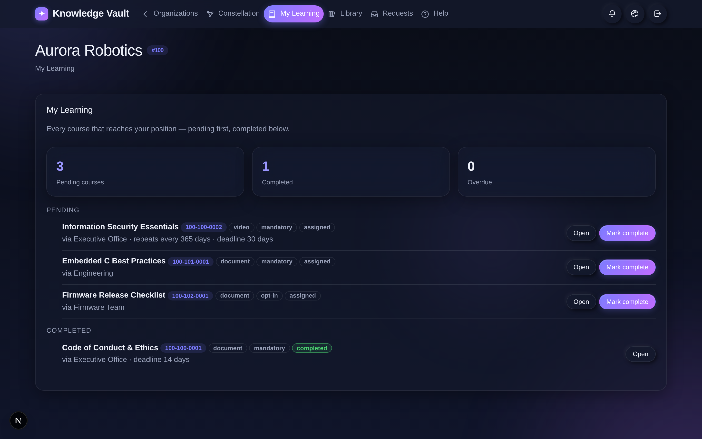
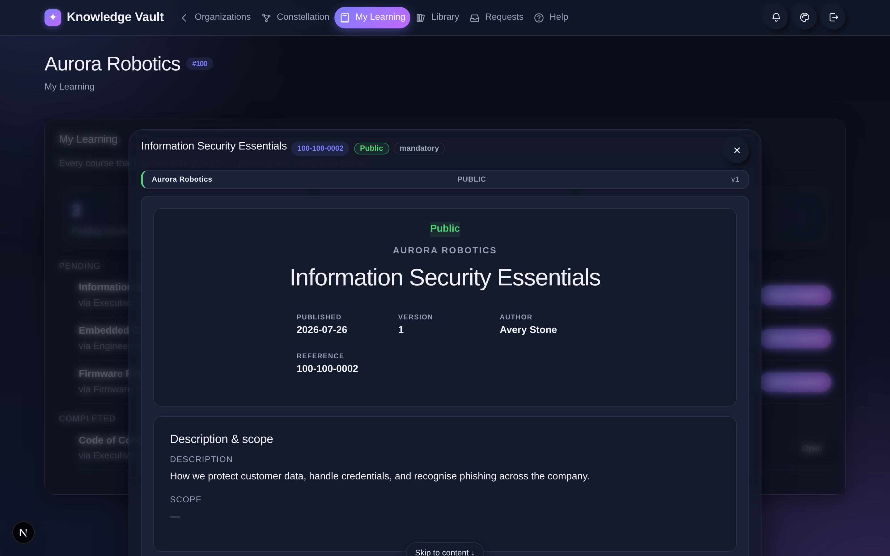
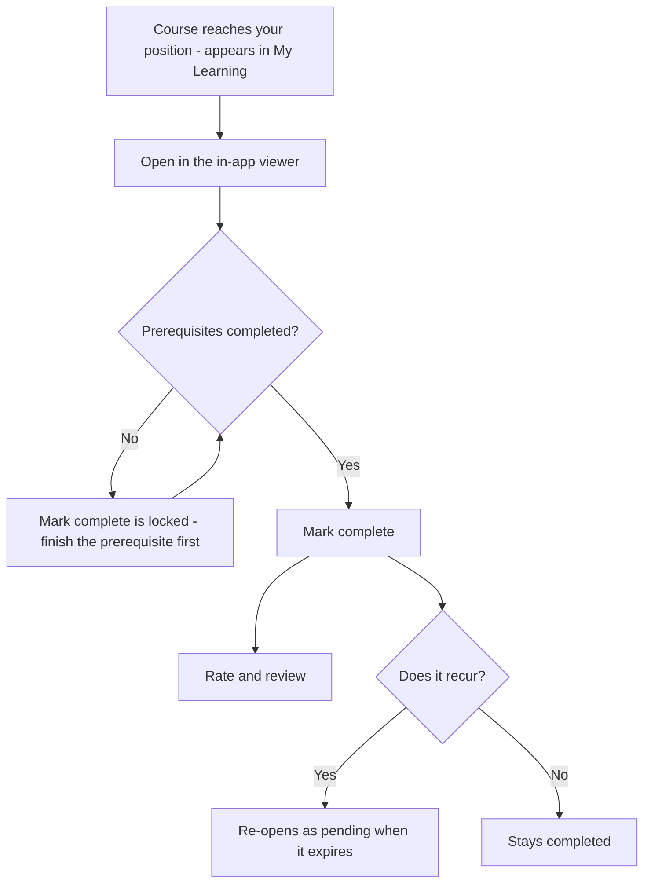

# Chapter 11 — My Learning & the in-app viewer

## What it is

**My Learning** is the page every learner lives in. It gathers **every course that reaches
your position** — from any branch you're a member of — and shows what's pending, what's done,
and what's overdue. It's the answer to "what do I need to complete?"

Open it from the **My Learning** tab in the top navigation.

---

## Reading your dashboard

At the top, three stat cards summarise your status:

- **Pending courses** — assigned to you and not yet complete.
- **Completed** — everything you've finished.
- **Overdue** — anything past its deadline (shown in red when it matters).

Below, courses are listed **pending first, completed below**. Each row shows the title, its
**code**, its **type**, whether it's **mandatory** or **opt-in**, a **status badge**, and
where it came from (e.g. *via Executive Office*), plus any **deadline** or **recurrence**.

In the sample, *Marco Diaz* has three pending courses — Information Security Essentials
(mandatory, repeats yearly, 30-day deadline), Embedded C Best Practices, and the Firmware
Release Checklist — and one completed: the Code of Conduct.

---

## Opening and completing a course

Each row has two actions:

- **Open** — launches the course in the **in-app viewer** (see below).
- **Mark complete** — records your completion. If a course has **prerequisites** that aren't
  done yet, the button is locked until you finish them first.

---

## The in-app viewer

Courses **always open inside the app** — never in a distracting second browser tab. The
viewer presents the document in your organization's **standard frame**:

Every document opens on its **standardized cover page**, showing:

- the **organization** name and the **classification** banner,
- the **title**,
- the **published date**, **version**, and **author**, and
- the document's **reference code**.

The cover is **page one**, not a preamble to skip. Turn it with **Next →** (or the arrow
keys) to reach the **description & scope**, and again to reach the content — each page
arriving with the same page-turn the rest of the document uses. **↑ Cover** takes you back
to the front at any time. From the viewer you can also:

- mark the course **complete**,
- go **fullscreen** for focused reading,
- open it in a **window of its own** (**⤢ Own window**) — the whole screen, the same
  options, nothing of the app around it,
- see **related documents**, and
- after completing, **rate & review** it — feeding the ratings shown in the library.

---

## Flow at a glance

**Completing a course:**

---

## Tips

- **Do prerequisites first.** If *Mark complete* is locked, open the course to see what's
  required — finishing the prerequisite unlocks it.
- **Watch the recurrence note.** "Repeats every 365 days" means the course will re-appear as
  pending when it expires — that's annual compliance working as intended.
- **Everything stays in one place.** Because the viewer is in-app, you never lose your spot
  or hunt through browser tabs — open, read, complete, move on.

**Next:** [Chapter 11 — Requests: ask & approve →](chapter-12-requests.md)
