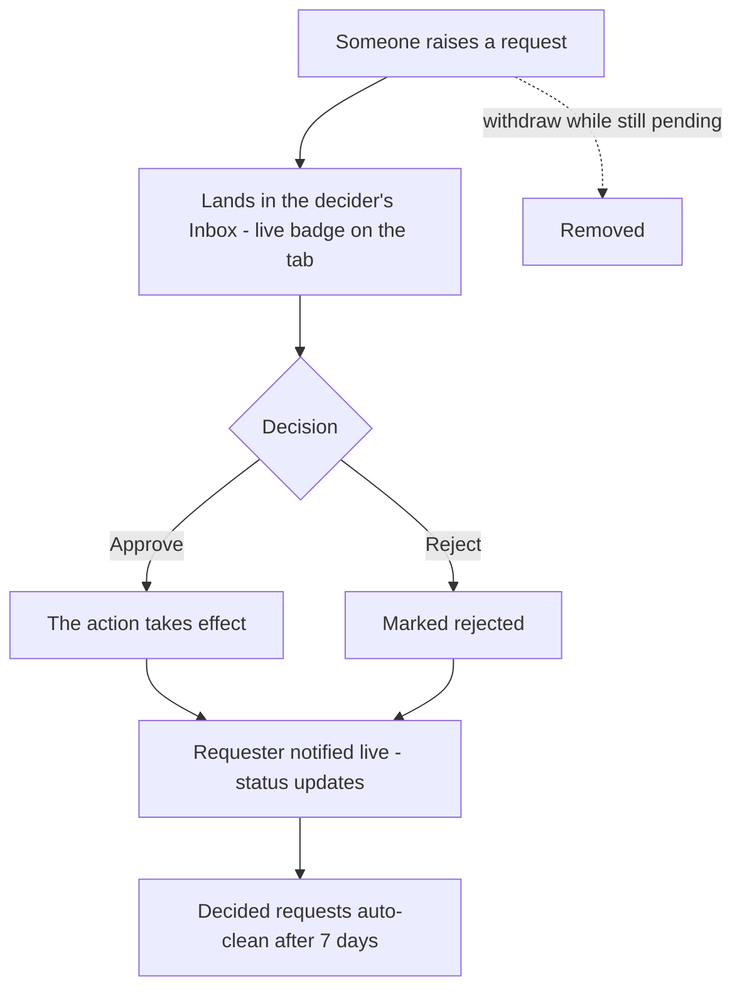
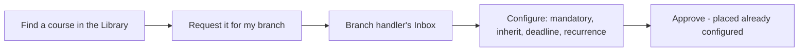
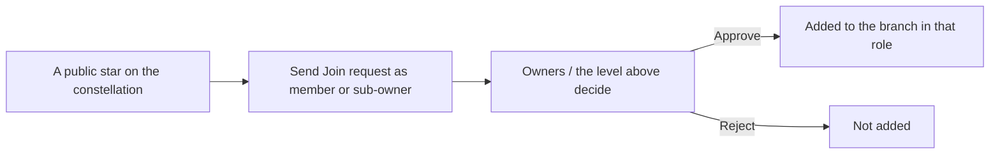
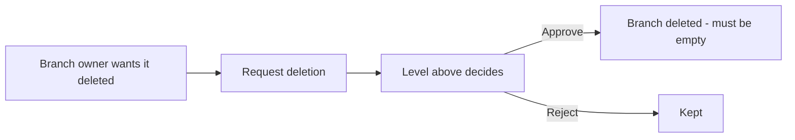
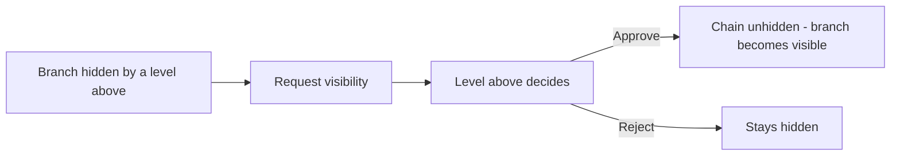

# Chapter 11 — Requests: ask & approve

## What it is

**Requests** is the platform's ask-and-approve centre. Rather than letting anyone change the
structure directly, Knowledge Vault routes certain actions through a request that someone
with the right authority approves. It keeps governance clean and auditable.

Open it from the **Requests** tab. A **live badge** on the tab shows how many requests need
your attention, so you never miss one.

---

## The two views

The page is split in two:

### Inbox — waiting on you
Requests **you have the authority to decide**. In the sample, *Avery Stone* sees *Lena
Novak's* request to join *Robotics QA* as a member, complete with her message. Each inbox
card lets you **Approve**, **Reject**, or **Delete** it.

### My requests
Everything **you've** asked for, with its live status (**pending**, **approved** or
**rejected**), so you can track your own asks.

---

## The four kinds of request

| Kind | Who raises it | What approval does |
|------|---------------|--------------------|
| **Course** | Someone who wants a library course on their branch | The decider **configures** it (mandatory, inheritance, deadline, recurrence) *before* approving |
| **Join** | Someone who wants to join a public branch | Adds them to the branch — as a member or sub-owner, whichever they asked for |
| **Deletion** | A branch's own owner who wants it removed | Lets the level above authorise the deletion |
| **Visibility** | An owner whose branch is hidden by a level above | Asks that level to unhide the chain |

Course requests are special: because the decider configures placement at approval time, the
course arrives on the branch correctly set up, not as a raw drop-in.

---

## How it flows

1. Someone raises a request — from the library (Course), a public star (Join), or a Group
   configuration panel (Deletion, Visibility).
2. It lands in the **inbox** of whoever has authority — the branch's handler or the level
   above.
3. That person **decides**. Approvals take effect immediately; the requester sees the status
   change live.
4. Decided requests **clean themselves up automatically after 7 days**, keeping inboxes tidy.

You can always **withdraw** a request you raised while it's still pending.

---

## Flows at a glance

**The request lifecycle (all types share this shape):**

**Course request** — configured *before* approval:

**Join request** — carries the desired position:

**Deletion request** — needs the level above:

**Visibility request** — unhide a chain:

---

## Tips

- **Watch the badge.** The live count on the Requests tab is your cue that a colleague is
  waiting on you — decisions unblock people.
- **Configure course requests thoughtfully.** Approving one is your chance to set the right
  deadline and recurrence for *your* branch, not just accept a default.
- **Join requests carry intent.** They state whether the person wants to be a *member* or a
  *sub-owner* — check that before approving.

**Next:** [Chapter 12 — Compliance tracking →](chapter-12-compliance.md)
