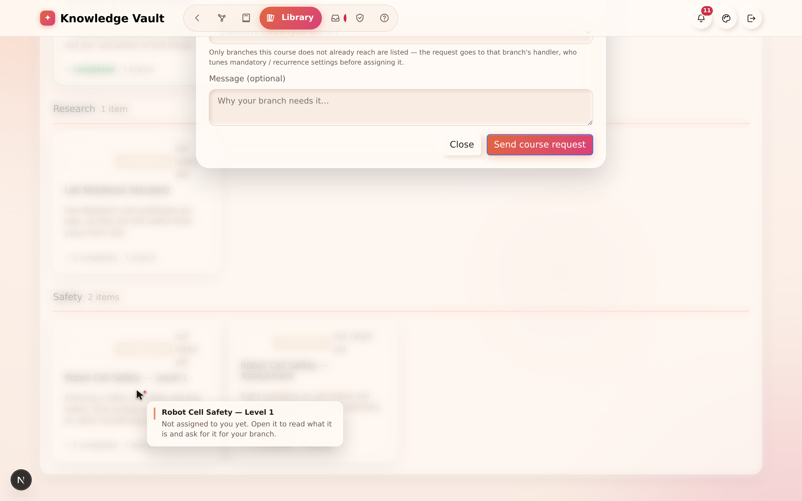

# Chapter 12 — The Library

## What it is

The **Library** is your organization's whole catalogue of published knowledge in one place —
a real library, with **shelves** grouped by category. Where the constellation shows knowledge
by *who* it's assigned to, the library shows it by *subject*, so anyone can browse, search
and discover what exists.

Open it from the **Library** tab in the top navigation.

---

## Why it matters

| Parameter | What changes |
|-----------|--------------|
| **Time** | People stop asking colleagues where the procedure is. One search over titles, descriptions, shelves and codes finds it. |
| **Risk & compliance** | *Where it's published* answers "does this policy actually reach the night shift?" in one click, instead of an afternoon of cross-checking. |
| **Security & custody** | Classification filters are honest: what you can see in the library is what your position entitles you to see, and hidden branches never leak through a search box. |
| **Cost** | A shelf that suggests itself as you publish keeps the catalogue from sprawling into duplicates — the cheapest document is the one nobody wrote twice. |
| **Adoption** | Ratings and comments from colleagues do what a mandate cannot: they point people at the material that is actually good. |

---

## Browsing the shelves

Courses are grouped into **shelves** by their category tag — in the sample you can see
*Compliance*, *Engineering* and more, each with an item count. Every entry is a card showing:

- its **type** (Document, Book, Link, Audio, Video),
- its **classification** badge,
- its **rating** (or "not rated yet"),
- a short description, and
- where it lives (e.g. how many branches it's published on).

---

## Finding something specific

The toolbar across the top gives you full control:

| Control | What it does |
|---------|--------------|
| **Search** | Match a title, description, category or code |
| **Type** | Filter to Documents, Books, Links, Audio or Video |
| **Shelf** | Jump to a single category |
| **Class** | Filter by classification (Public → Secret) |
| **Rating** | Show only well-rated material |
| **Show archived** | Include courses that have been archived |
| **Sort** | Newest, and other orders |

---

## Opening an entry

Select any card to open its detail view. There you can:

- read its **full description and scope**,
- see its **ratings and member comments**,
- find **"where it's published"** — which jumps you back to the constellation with those
  branches **spotlighted** and the rest dimmed, so you can see its reach at a glance, and
- **request the course for your branch** — this files a Course request with that branch's
  handler, who configures it (mandatory, deadline, recurrence) before approving. See
  [Chapter 14](chapter-14-requests.md).

---

## Ratings & reviews

After completing a course, learners can **rate it out of five and leave a comment**. Those
reviews surface here in the library, helping everyone find the material that's genuinely
useful. (You'll rate a course from the reader — [Chapter 13](chapter-13-my-learning.md).)

---

## Tips & pitfalls

- **Shelves keep themselves tidy.** Because publishing suggests an existing shelf for similar
  content, your library naturally groups related material instead of sprawling.
- **Use "where it's published" to audit reach.** It's the quickest way to check that an
  important policy actually reaches every team it should.
- **Filter by classification when sharing screens.** Switch to *Public* only if you're
  demonstrating the library to an audience who shouldn't see sensitive titles.
- **The library is not the assignment list.** A course in the library that is not placed on a
  branch reaches nobody automatically — that is what *opt-in* and *request* are for.
- **Archived material is still findable.** Turn on *Show archived* before concluding that
  something was deleted.
- **A shelf per subject, not per department.** *Safety* outlives *Operations Team B*.

---

## 🎬 Make a video of this

**Length:** ~90 seconds. **Working title:** *"Everything you have published, by subject."*

| # | Shot | Say |
|---|------|-----|
| 1 | Library, shelves visible with counts | "The constellation shows knowledge by who gets it. The library shows it by what it's about." |
| 2 | Type into search, results narrow | "Titles, descriptions, shelves, codes — one box." |
| 3 | Filter **Class → Confidential** | "And you only ever see what your position entitles you to." |
| 4 | Open a card → **where it's published** | "This is the one that saves an afternoon: every branch it actually reaches, lit up on the map." |
| 5 | Show a rating and a comment | "Colleagues tell each other what's worth reading." |
| 6 | **Request this course for my branch** | "And if it isn't reaching your team yet, ask for it here." |

**Script beat to close on:** *"A library is only a library if you can find things in it."*

**Next:** [Chapter 13 — My Learning & the reader →](chapter-13-my-learning.md)
