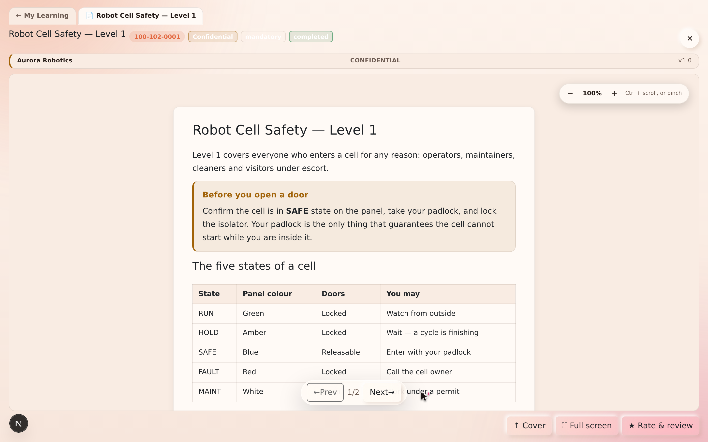
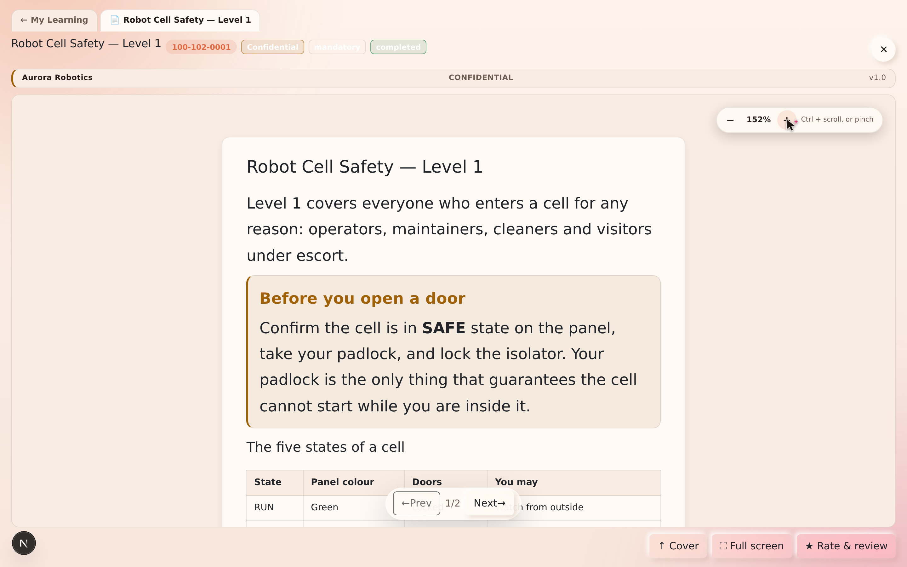
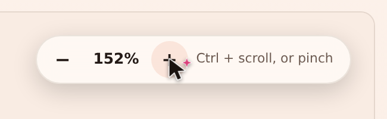
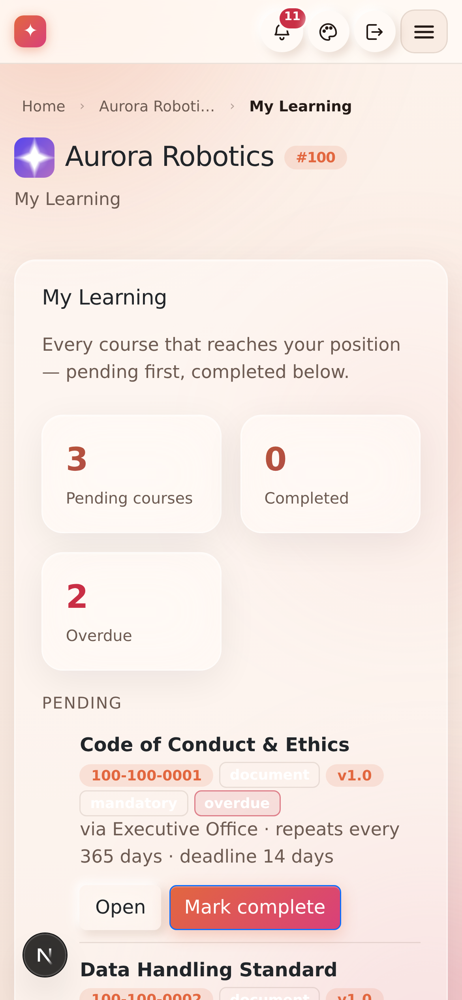
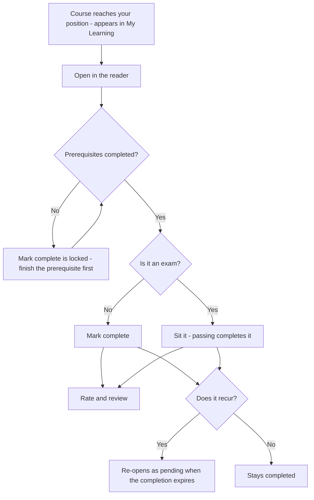

# Chapter 13 — My Learning & the reader

## What it is

**My Learning** is the page every learner lives in. It gathers **every course that reaches
your position** — from any branch you're a member of — and shows what's pending, what's done,
and what's overdue. It's the answer to "what do I need to complete?"

Open it from the **My Learning** tab in the top navigation.

---

## Why it matters

| Parameter | What changes |
|-----------|--------------|
| **Time** | One list, ordered by what is actually due. No enrolment step, no course catalogue to search before you can start. |
| **Risk & compliance** | Deadlines and recurrence are printed on the row, and a lapsed annual course reappears as pending by itself — the learner never has to remember that a year has passed. |
| **Security & custody** | Documents open **inside** the app, in the frame their classification demands. A course marked non-downloadable can be read and not carried away. |
| **Cost** | The reader is the whole distribution system: no PDF emailed to 300 people, no version of it saved on 300 laptops. |
| **Adoption** | Everything a learner needs is two clicks from signing in, and the reader is comfortable enough to actually read in — zoom, full screen, and a size that stays where you put it. |

---

## Reading your dashboard

At the top, three stat cards summarise your status:

- **Pending courses** — assigned to you and not yet complete.
- **Completed** — everything you've finished.
- **Overdue** — anything past its deadline.

Below, courses are listed **pending first, completed below**. Each row shows the title, its
**code**, its **type**, the **edition** (v1.0), whether it's **mandatory** or **opt-in**, a
**status badge**, and where it came from (e.g. *via Executive Office*), plus any **deadline**
or **recurrence**.

In the sample, *Maya Torres* has two pending items — the **Robot Cell Safety — Assessment**
(mandatory, overdue, and shown with **Complete the exam** rather than *Open*) and the opt-in
**Welcome to Aurora Robotics** — and three completed, each with the date its completion stays
valid until.

> **"Valid until" is not decoration.** A course that repeats every 365 days becomes pending
> again the moment that date passes. You do not have to watch for it.

---

## Opening and completing a course

Each row has up to two actions:

- **Open** — launches the course in the reader.
- **Mark complete** — records your completion. If a course has **prerequisites** that aren't
  done yet, the button is locked until you finish them first.
- **Complete the exam** — on an exam, this replaces both. An exam is completed by passing it
  ([Chapter 10](chapter-10-exams-and-assessment.md)).

---

## The reader

Courses **always open inside the app** — never in a distracting second browser tab. The
reader presents the document in your organization's **standard frame**:

Every document opens on its **standardized cover page**, showing:

- the **organization** name and the **classification** banner,
- the **title**,
- the **published date**, **edition**, and **author**, and
- the document's **reference code**.

The cover is **page one**, not a preamble to skip. Turn it with **Next →** (or the arrow
keys) to reach the **description & scope**, and again to reach the content — each page
arriving with the same page-turn the rest of the document uses. **↑ Cover** takes you back
to the front at any time.

From the reader you can also:

- mark the course **complete**,
- go **⛶ Full screen** for focused reading,
- give it the **whole screen** — **⤢ Own window** on a computer opens the document in a
  window of its own; on a phone, and in the Android app, the same button hands the whole
  screen to the document, and a **tab at the top takes you straight back** to My Learning
  (the mobile app has no tabs of its own, so the reader brings its own),
- see **related documents** — including anything this course requires first, and
- after completing, **★ Rate & review** it — feeding the ratings shown in the library.

---

## Reading size: zoom that behaves

Text is only useful at a size you can read. The reader has one zoom, and it works the same way
on every kind of document:

| Gesture | What it does |
|---------|--------------|
| **Ctrl / ⌘ + scroll** | Zoom in and out |
| **Two-finger pinch** | The same, on a trackpad or a touch screen |
| **Ctrl + `+` / `−` / `0`** | In, out, back to 100% |
| **The reading-size pill** | **− 152% +**, top right of the page |
| **A plain scroll** | Always scrolls. It never zooms by accident. |

Two details worth knowing, because they are what make it usable rather than merely present:

- **Studio documents scale the type, not the box.** Lines re-wrap as they grow, so a reader
  who has zoomed in never has to scroll sideways to finish a sentence. An author's explicit
  font size grows with everything else, instead of one hand-sized heading staying put while
  the text around it changes.
- **PDFs re-render at the new scale.** They are not stretched, so text stays sharp — and a
  zoom responds immediately, even on a document of a hundred-plus pages, because only the
  pages you can actually see are re-drawn.

---

## On a phone

My Learning is one column, the rows keep their badges, and the reader hands over the whole
screen with a tab of its own to get back:

---

## Flow at a glance

**Completing a course:**

---

## Tips & pitfalls

- **Do prerequisites first.** If *Mark complete* is locked — or an exam shows *Related —
  required first* instead of a Start button — open what it names and finish that.
- **Watch the recurrence note.** "Repeats every 365 days" means the course will re-appear as
  pending when it expires — that's annual compliance working as intended.
- **Set the reading size once.** It is remembered as you move between pages, so pick a size
  you are comfortable with and forget about it.
- **Full screen on a phone is the whole point.** The reader hands the screen over completely
  and brings its own way back.
- **Rate what you complete.** Two seconds from you is what tells the next person which of the
  four safety documents is the one worth reading.

---

## 🎬 Make a video of this

**Length:** ~2 minutes. **Working title:** *"Your list, and a reader worth reading in."*

| # | Shot | Say |
|---|------|-----|
| 1 | My Learning, three stat cards, pending list | "Everything that reaches your position, pending first." |
| 2 | Point at a row's deadline and recurrence | "The deadline and the retake cycle are printed on the row." |
| 3 | **Open** → the cover page | "Every document opens on its cover: organization, classification, edition, code." |
| 4 | **Next →** twice to the content | "Cover, scope, then the document itself." |
| 5 | Ctrl+scroll to zoom; show text re-wrapping | "Zoom re-wraps the text. You never scroll sideways to finish a sentence." |
| 6 | **Mark complete**, then **★ Rate & review** | "Complete it, rate it — and that rating shows up in the library for everyone else." |

**Script beat to close on:** *"Nothing to enrol in, nothing to download, nothing to remember."*

**Next:** [Chapter 14 — Requests: ask & approve →](chapter-14-requests.md)
