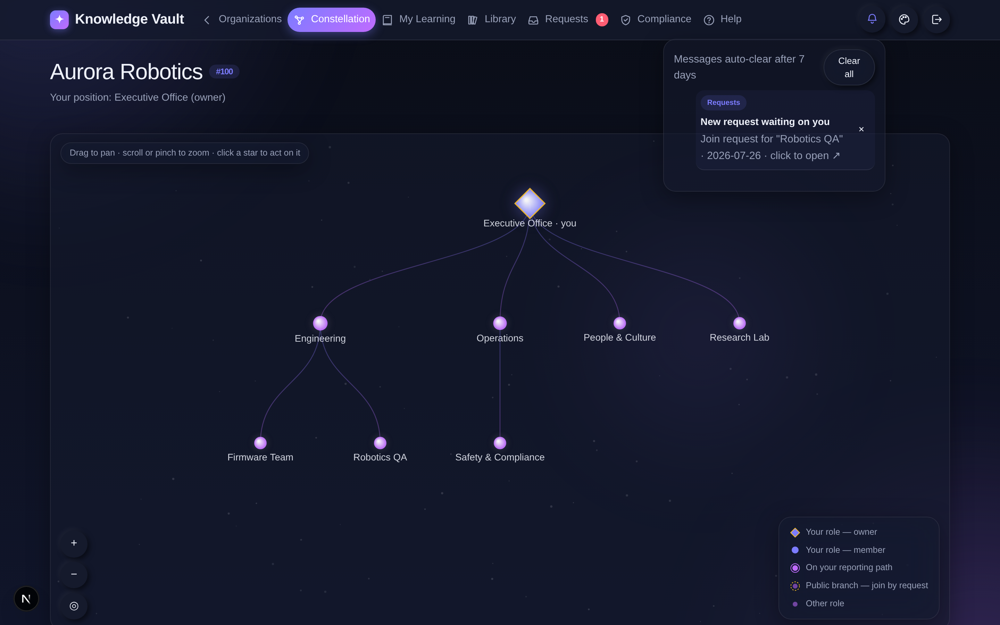

# Chapter 13 — Notifications

## What it is

**Notifications** keep you informed the moment something needs you — a new request to decide,
a course assigned to you, a reminder from a manager, a decision on something you asked for.
They're categorised, informative, and clickable, so each one takes you straight to the thing
it's about.

The **bell** lives in the top-right corner of every screen. A small dot marks unread
messages; select the bell to open the panel.

---

## Reading a notification

Each message tells you **what happened** and belongs to a **category** (shown as a chip —
e.g. *Requests*, *Courses*, *Inbox*). In the sample, *Avery Stone* has a **Requests**
notification: *"New request waiting on you — Join request for Robotics QA."*

- **Select a message** to jump directly to the relevant place — the request, the course, the
  branch. No hunting.
- **Dismiss a single message** with its ✕.
- **Clear all** with the button at the top of the panel.

---

## How they behave

- **Live** — notifications arrive in real time; you don't need to refresh. The bell's dot
  appears the instant something lands.
- **Deep-linked** — clicking a message opens the exact request or course it refers to.
- **Self-cleaning** — messages **auto-clear after 7 days**, so the panel never becomes a
  graveyard.
- **A gentle nudge** — if your unread count climbs past ten, the platform prompts you to tidy
  up.

---

## What generates a notification?

Common triggers include:

- a **request** you have the authority to decide (Join, Course, Deletion, Visibility),
- a **decision** on a request you raised (approved or rejected),
- a **course assigned** to your position,
- a **reminder** sent from the Compliance dashboard, and
- a **document review** waiting for your approval.

---

## Tips

- **Treat the bell dot as your to-do light.** If it's lit, someone or something is waiting on
  you — clearing it usually means unblocking a colleague.
- **Click, don't search.** Every notification is a shortcut; use it rather than navigating
  manually to the request or course.
- **Let them expire.** You don't need to clear everything by hand — informational messages
  tidy themselves after a week.

**Next:** [Chapter 14 — The Supreme zone: custody & recovery →](chapter-14-supreme-and-custody.md)
