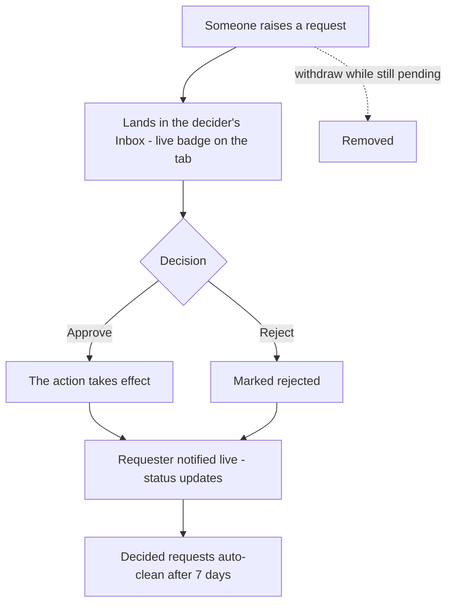
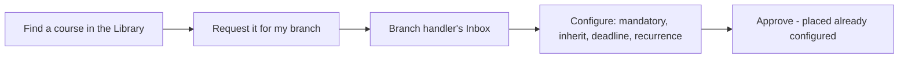
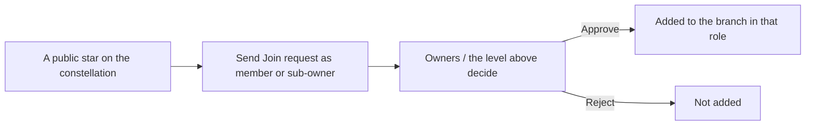
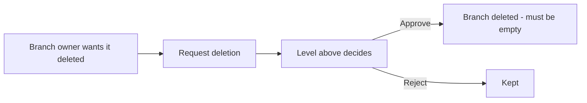
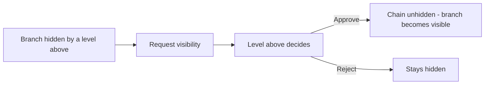

# Chapter 14 — Requests: ask & approve

## What it is

**Requests** is the platform's ask-and-approve centre. Rather than letting anyone change the
structure directly, Knowledge Vault routes certain actions through a request that someone
with the right authority approves. It keeps governance clean and auditable.

Open it from the **Requests** tab. A **live badge** on the tab shows how many requests need
your attention, so you never miss one.

---

## Why it matters

| Parameter | What changes |
|-----------|--------------|
| **Time** | An ask and its answer live in one place with a live badge on the tab. No email thread, no "did you see my message?" |
| **Risk & compliance** | Structural changes that matter — joining a branch, deleting one, unhiding a chain, publishing someone else's document — are decisions with a named decider and a record, not something that quietly happened. |
| **Security & custody** | Requests are routed by authority, not by asking nicely. Only the people who could have done the thing themselves can approve someone else doing it. |
| **Cost** | Course requests arrive configured — the decider sets the deadline and recurrence for *their* branch at approval time, so nothing has to be corrected afterwards. |
| **Adoption** | Members can ask for what they need instead of waiting to be noticed, which is what turns a training platform into something people use rather than receive. |

---

## The two views

The page is split in two:

### Inbox — waiting on you
Requests **you have the authority to decide**. In the sample, *Avery Stone* sees *Ravi
Shah's* request to join the *Firmware Team* as a member, complete with his message. Each inbox
card lets you **Approve**, **Reject**, or **Delete** it.

### My requests
Everything **you've** asked for, with its live status (**pending**, **approved** or
**rejected**), so you can track your own asks.

---

## The five kinds of request

| Kind | Who raises it | What approval does |
|------|---------------|--------------------|
| **Course** | Someone who wants a library course on their branch | The decider **configures** it (mandatory, inheritance, deadline, recurrence) *before* approving |
| **Join** | Someone who wants to join a public branch | Adds them to the branch — as a member or sub-owner, whichever they asked for |
| **Deletion** | A branch's own owner who wants it removed | Lets the level above authorise the deletion |
| **Visibility** | An owner whose branch is hidden by a level above | Asks that level to unhide the chain |
| **Document review** | A member with the *create content* right who has written something | Publishes it — or sends it back with a note ([Chapter 11](chapter-11-editions-and-review.md)) |

Course requests are special: because the decider configures placement at approval time, the
course arrives on the branch correctly set up, not as a raw drop-in.

**Document reviews are the other special case**, because they carry a **conversation**. The
reviewer opens the draft full screen, then chooses one of three outcomes — *approve and
publish*, *send back with changes* (with a compulsory reason, and the draft survives), or
*decline*. The thread stays on the request, so the whole exchange is in one place when the
document is finally decided. A review that has been sent back leaves your *waiting on you*
list but stays visible, flagged **with the author** — and it is exempt from the 7-day sweep,
because an open conversation is not a decision.

---

## How it flows

1. Someone raises a request — from the library (Course), a public star (Join), or a Group
   configuration panel (Deletion, Visibility).
2. It lands in the **inbox** of whoever has authority — the branch's handler or the level
   above.
3. That person **decides**. Approvals take effect immediately; the requester sees the status
   change live.
4. Decided requests **clean themselves up automatically after 7 days**, keeping inboxes tidy.

You can always **withdraw** a request you raised while it's still pending.

---

## Flows at a glance

**The request lifecycle (all types share this shape):**

**Course request** — configured *before* approval:

**Join request** — carries the desired position:

**Deletion request** — needs the level above:

**Visibility request** — unhide a chain:

---

## Tips & pitfalls

- **Watch the badge.** The live count on the Requests tab is your cue that a colleague is
  waiting on you — decisions unblock people.
- **Configure course requests thoughtfully.** Approving one is your chance to set the right
  deadline and recurrence for *your* branch, not just accept a default.
- **Join requests carry intent.** They state whether the person wants to be a *member* or a
  *sub-owner* — check that before approving.
- **Send documents back rather than fixing them yourself.** The author learns, and the
  document stays theirs. *Send back with changes* is the outcome reviews exist for.
- **Decide, don't hoard.** Decided requests disappear after seven days; pending ones sit on
  someone's day until you act.
- **A withdrawn request is not a rejected one.** If you asked for the wrong thing, withdraw it
  and ask again — nobody has to reject you to clear it.

---

## 🎬 Make a video of this

**Length:** ~2 minutes. **Working title:** *"Asking, and answering."*

| # | Shot | Say |
|---|------|-----|
| 1 | The Requests tab with its live badge | "The number means somebody is waiting on you." |
| 2 | The inbox card: who, what, and their message | "Every ask arrives with its reason attached." |
| 3 | Approve a Join request; cut to the branch's People panel | "Approve, and they're placed — as a member or a sub-owner, whichever they asked for." |
| 4 | Open a Course request; set deadline and recurrence, then approve | "A course request is configured on the way in, for *your* branch." |
| 5 | Open a Document review; preview full screen; send it back with a note | "And a document review has three answers — including the one that makes documents better." |

**Script beat to close on:** *"Nothing structural happens here by accident, and nothing waits
in an inbox nobody can see."*

**Next:** [Chapter 15 — Compliance tracking →](chapter-15-compliance.md)
