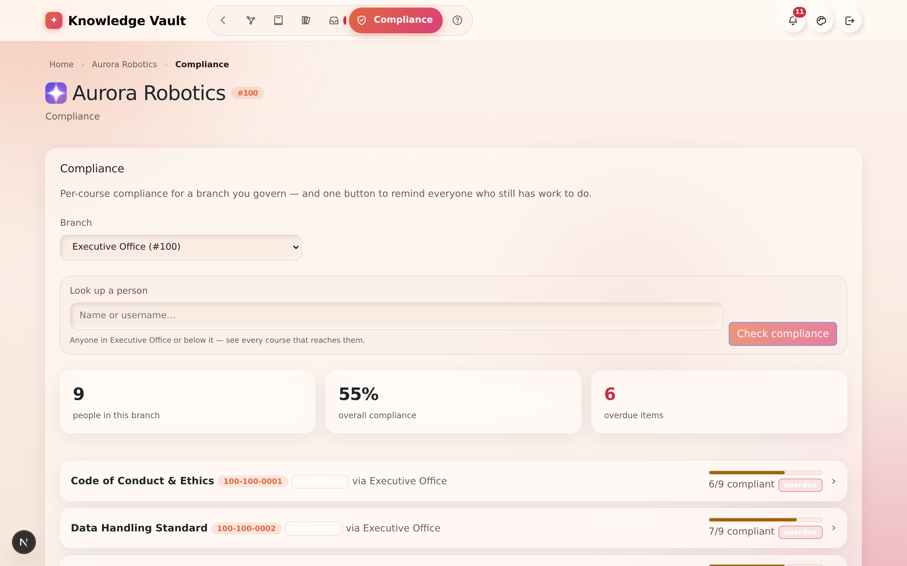
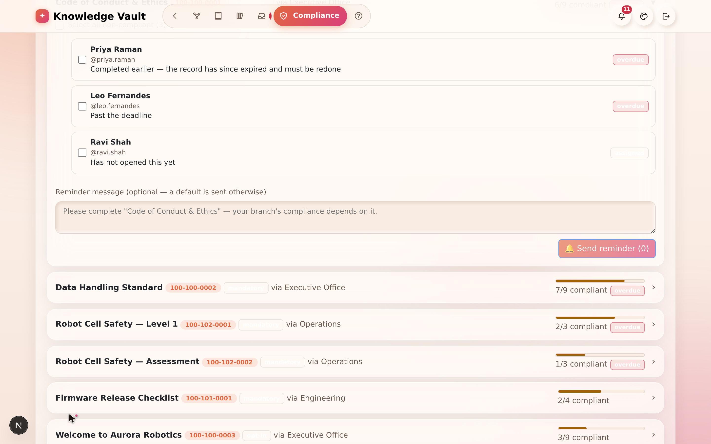
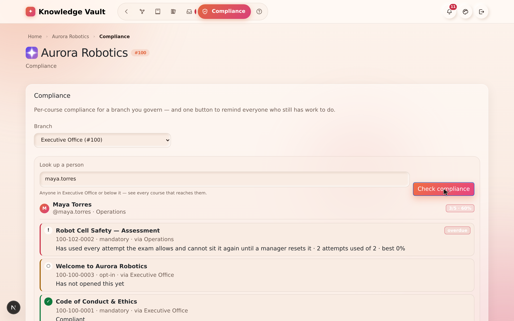
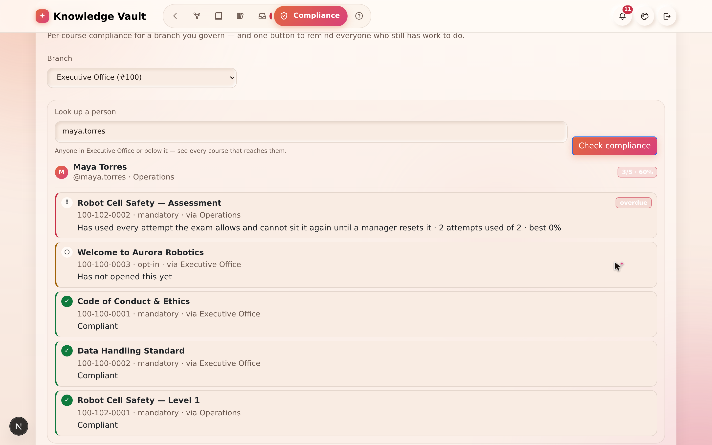
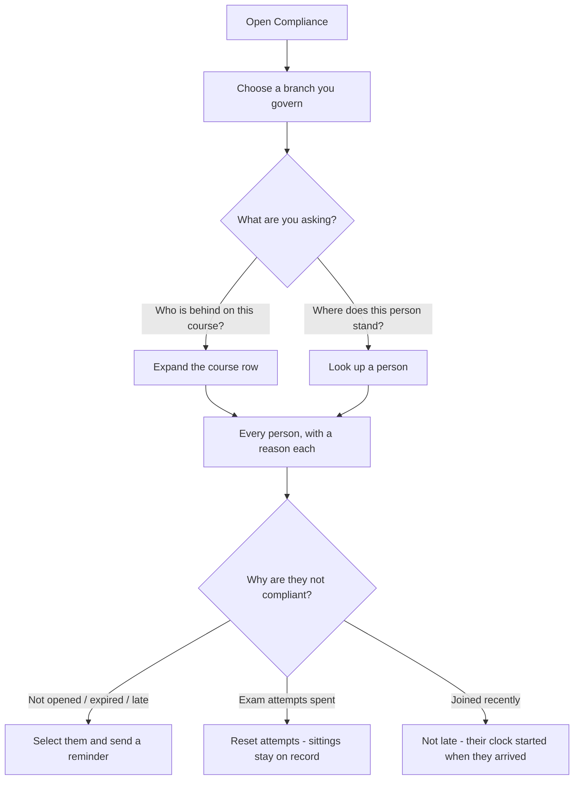

# Chapter 15 — Compliance tracking

## What it is

**Compliance** is the manager's view of "who has completed what." For any branch you govern,
it shows per-course completion across the whole subtree, says **why** each person is not
compliant in words, lets you **look one person up**, and gives you one button to **remind**
everyone who still has work to do.

The **Compliance** tab appears in the navigation only if you're an owner somewhere. Open it
to begin.

---

## Why it matters

| Parameter | What changes |
|-----------|--------------|
| **Time** | The report is computed from the courses themselves, so nobody maintains it. A branch-wide answer takes one click; a single person's answer takes two. |
| **Risk & compliance** | Every non-compliant row carries its **reason in a sentence** — not read yet, exam attempts spent, lapsed annually, joined last week. An auditor's follow-up question is already answered on the screen. |
| **Security & custody** | You only ever see branches you govern, and the person lookup is limited to the branch you selected and everything under it. A peer cannot inspect a peer. |
| **Cost** | The reminder sweep replaces the chasing spreadsheet and the "please complete your training" all-staff email nobody reads. |
| **Adoption** | Reminders are deep-linked to the exact course, so the person is one click from doing the thing instead of one click from a login page. |

---

## Choosing a branch

At the top, a **Branch** selector lets you pick any branch you govern — and because ownership
can sit on several levels at once, you may have several to choose from. Pick one, and the
dashboard reports on that branch and everything beneath it.

Three summary cards give you the headline:

- **people in this branch** — the population being measured.
- **overall compliance** — the single percentage that says how you're doing.
- **overdue items** — assignments genuinely past their deadline.

---

## Per-course breakdown

Below the summary, every course in scope gets a row showing:

- the course **title** and **code**,
- whether it's **mandatory** or **opt-in**,
- where it comes from (e.g. *via Executive Office*, *via Operations*), and
- a **progress bar** with a count like **6 / 9 compliant**, and an **overdue** flag when
  somebody in that count is late.

Select a course row to expand it and see the **list of people** — who's compliant, who isn't,
and the reason beside each one.

Three rows, three different situations, and the screenshot above has all of them:

| Person | Reason | Flagged overdue? |
|--------|--------|------------------|
| **Priya Raman** | *Completed earlier — the record has since expired and must be redone* | **Yes** — her annual completion lapsed over a month ago, so the new deadline has passed too |
| **Leo Fernandes** | *Past the deadline* | **Yes** — assigned weeks ago, never opened |
| **Ravi Shah** | *Has not opened this yet* | **No** — he joined this branch this morning; his fourteen days start today |

Below the list sits the **reminder message** box and **🔔 Send reminder**, which acts on
whoever you tick.

---

## Looking one person up

The branch report answers *"who is behind on this course?"*. The **Look up a person** box
answers the other question managers actually ask: *"where does this person stand?"*

1. Type a name or username — the field suggests people as you type.
2. Press **Check compliance**.

You get a card with their overall score and **every course that reaches their position**, each
with a status and a plain-English reason:

| What you see | What it means |
|--------------|---------------|
| **Compliant** | Completed, and the completion is still valid |
| **Has not opened this yet** | Assigned, untouched |
| **Has used every attempt the exam allows and cannot sit it again until a manager resets it** | The exam is locked — see below |
| **Expired** | A recurring completion has lapsed; the next cycle is open |
| **overdue** | Genuinely past the deadline that applies **to this person** |

Both views come from one computation, so the branch report and the per-person card can never
disagree with each other.

---

## What "overdue" actually means

A deadline is **how long someone has to finish a course after it reaches them** — the Studio's
own words for the field — and the report measures exactly that. In practice, the clock starts
at whichever of these is **latest**:

| Situation | The deadline is measured from |
|-----------|-------------------------------|
| Course placed on a branch you were already in | The day it was placed |
| You joined a branch that already had the course | **The day you joined** |
| A recurring course whose completion has lapsed | **The moment the new cycle opened** |
| A new edition published with *updates reset completion* | **The day that edition was published** |

This matters more than it sounds. Under the old arithmetic, three kinds of people were
accused of missing days they never had:

- somebody whose annual course lapsed last night — *due to do it again*, not a year late for
  it;
- somebody whose completion was expired by a republished edition — the new obligation is
  dated to the republish, not to the original placement;
- somebody placed in the branch this morning — for whom the deadline had already "passed"
  before they arrived.

Genuinely late people are still late. That is the report's whole job.

> **A lapsed completion reads EXPIRED immediately.** The views no longer wait for the nightly
> sweep to notice: the instant a completion's validity date passes, every screen says
> **expired** rather than repeating *completed* beside a red *overdue* badge.

---

## Reminding the non-compliant

This is the part that saves managers time. Once a course is expanded:

1. **Select the people** who still need to complete it (or select all non-compliant).
2. Choose to send a **reminder**.
3. Use the **default message**, or write your **own**.

Each reminder lands as a message in that person's Mailbox, deep-linked to the exact course —
so they're one click from doing it. No spreadsheets, no chasing by email.

---

## When an exam has locked someone out

An exam with an attempt allowance locks when the last attempt is spent without a pass. The
row says so in words, with the attempts used and the best score.

**To hand the allowance back:** expand the exam, tick the person, and choose
**♻ Reset attempts**. Their previous sittings stay on record, marked as no longer counting;
the person is told they can try again, and by whom.
[Chapter 10](chapter-10-exams-and-assessment.md) covers the whole reset.

---

## Flow at a glance

---

## Tips & pitfalls

- **Start at the top for a company-wide picture, drill down to act.** Select *Executive
  Office* to see overall compliance; switch to a team branch to chase specific people.
- **Read the reason before you chase.** "Has not opened this yet" is a nudge; "attempts spent"
  is a coaching conversation; "joined three days ago" needs nothing at all.
- **Zero overdue is the goal.** Pair deadlines ([Chapter 8](chapter-08-courses.md)) with
  periodic reminder sweeps to keep that number at zero.
- **Recurring courses re-open automatically.** When an annual course expires, previously
  compliant people become pending again — the dashboard reflects it the moment it happens.
- **A late joiner is not a problem to fix.** Their deadline starts when they arrive; leaving
  them alone for their first fortnight is the system working.
- **Use the person lookup before a one-to-one.** Two clicks gives you everything that reaches
  them, in one card, in the order they should tackle it.

---

## 🎬 Make a video of this

**Length:** ~2½ minutes. **Working title:** *"Who's behind — and why."*

| # | Shot | Say |
|---|------|-----|
| 1 | Compliance, branch selector open | "Pick any branch you govern. The report covers it and everything beneath it." |
| 2 | The three summary cards | "People, percentage, overdue. The headline in three numbers." |
| 3 | Expand a course row | "Every person, and beside each one, why." |
| 4 | Point at "has used every attempt" | "Not 'not completed'. The actual reason, in a sentence." |
| 5 | **Look up a person** → type a name → **Check compliance** | "And the other question: where does *this* person stand?" |
| 6 | Show a recent joiner not marked late | "Their clock starts when they arrive. Nobody is late for a course that was placed before they existed." |
| 7 | Select non-compliant people → send a reminder | "Then one button, deep-linked to the exact course." |

**Script beat to close on:** *"A compliance report that cries wolf gets ignored. This one only
says late when someone actually is."*

**Next:** [Chapter 16 — The Mailbox →](chapter-16-the-mailbox.md)
