# Chapter 16 — Flow diagrams: every setting at a glance

This chapter is the **visual reference** for the whole platform. It pairs a **flow diagram**
with a **screenshot** for each setting, grouped into three topics:

- **A.** [What an **owner** can do](#a--owner-settings--actions) — every management setting.
- **B.** [What a **member** can have / do](#b--what-a-member-can-have--do) — the learner side.
- **C.** [**Request ↔ response** flows](#c--request--response-flows) — ask-and-approve.

> The flow diagrams below are drawn with Mermaid and render automatically on GitHub. Each
> setting also links back to the chapter where it's explained in full.

---

## A — Owner settings & actions

Owners act from the **constellation**: click a star you govern to open its action panel, then
choose a section (Group configuration · People · Courses · Backup).

### A1 · Create a sub-role
*Where: Group configuration → + Sub-role · [Chapter 5](chapter-05-building-your-structure.md)*

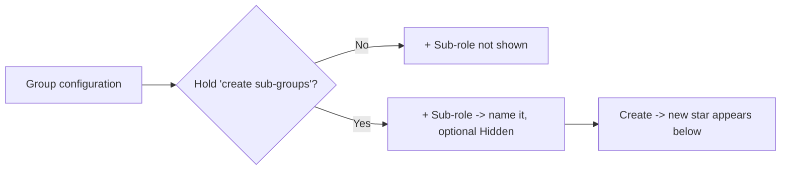

### A2 · Set visibility (public / hidden)
*Where: Group configuration → Visibility · [Chapter 5](chapter-05-building-your-structure.md)*

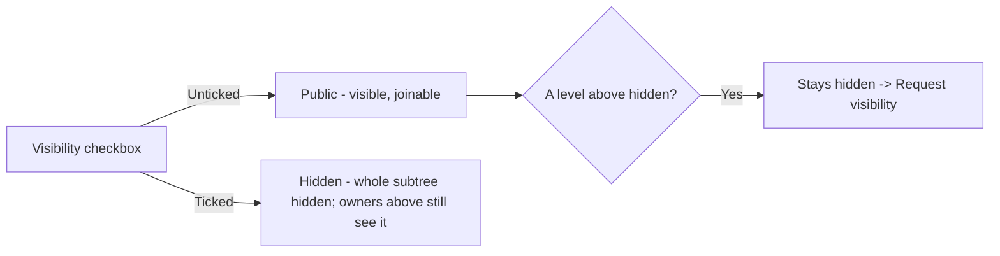

### A3 · Delete a branch (direct or by request)
*Where: Group configuration → Delete / Request deletion · [Chapter 5](chapter-05-building-your-structure.md)*

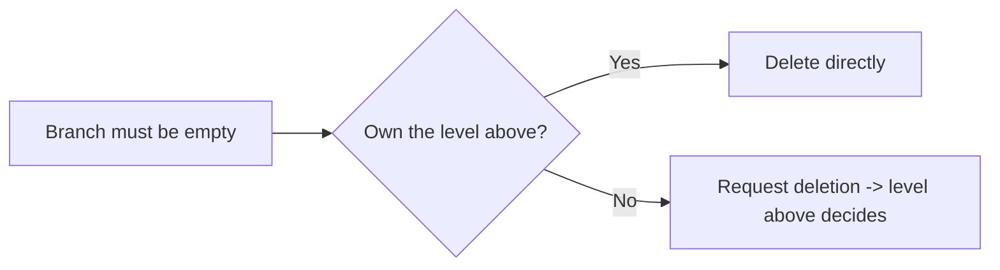

### A4 · Add a person (member or co-owner)
*Where: People → + Add person · [Chapter 6](chapter-06-people-and-governance.md)*

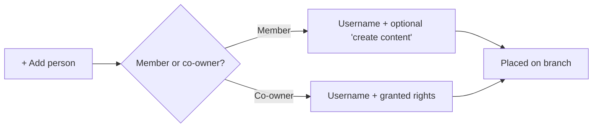

### A5 · Grant a co-owner's rights (least privilege)
*Where: People → Add a co-owner · [Chapter 6](chapter-06-people-and-governance.md)*

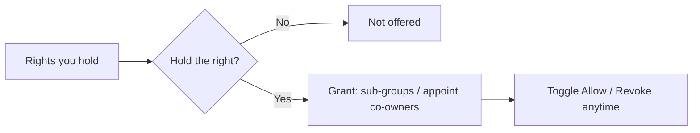

### A6 · Grant a member the "create content" right
*Where: People → Add a member · [Chapter 6](chapter-06-people-and-governance.md) & [7](chapter-07-courses.md)*

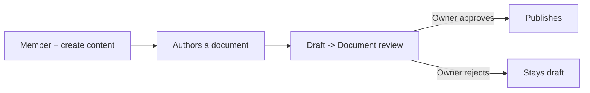

### A7 · Publish a course
*Where: Courses → + Upload course / Create in Studio · [Chapter 7](chapter-07-courses.md)*

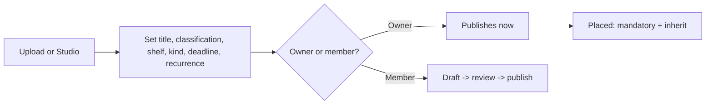

### A8 · Configure a placed course
*Where: Courses → per-course controls · [Chapter 7](chapter-07-courses.md)*

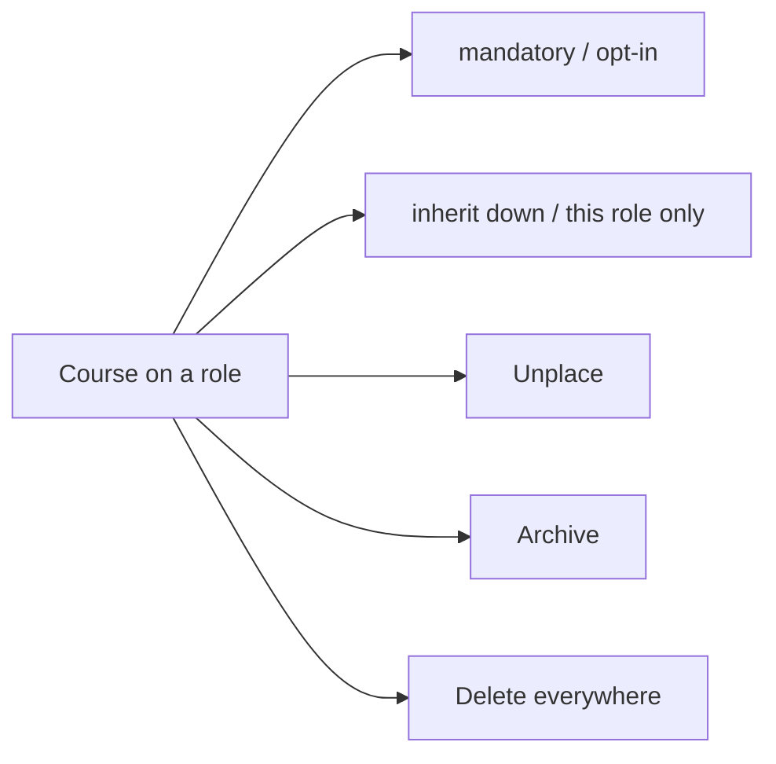

### A9 · Back up / restore a branch (`.bkp`)
*Where: Backup section · [Chapter 14](chapter-14-supreme-and-custody.md)*

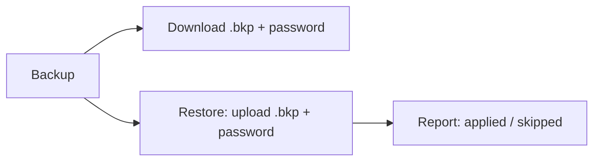

### A10 · The Supreme zone (root only)
*Where: root → Group configuration → Supreme zone · [Chapter 14](chapter-14-supreme-and-custody.md)*

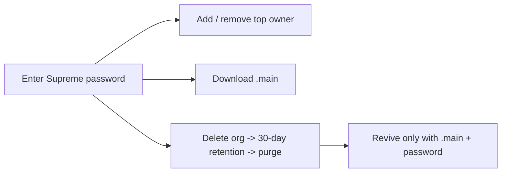

---

## B — What a member can have / do

A member *learns* from the branches they're placed on. Everything assigned to them gathers in
**My Learning**.

### B1 · Complete assigned courses
*Where: My Learning · [Chapter 10](chapter-10-my-learning.md)*

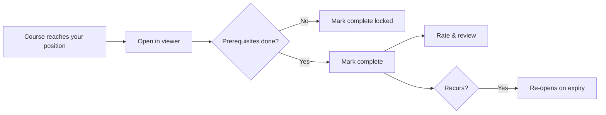

### B2 · Read in the in-app viewer
*Where: My Learning / Library → Open · [Chapter 10](chapter-10-my-learning.md)*

The viewer opens every document in the organization's standard frame (cover, classification,
version, author) — never in a second tab.

### B3 · Propose content (if granted)
*Where: Studio → Propose a document · [Chapter 8](chapter-08-the-studio.md)*

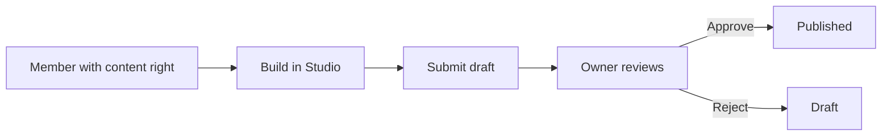

### B4 · Ask to join a public branch
*Where: click a public star → Send Join request · [Chapter 11](chapter-11-requests.md)*

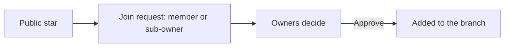

### Member capability map

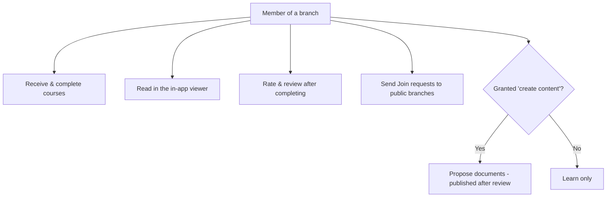

---

## C — Request ↔ response flows

Requests route sensitive actions to whoever has the authority. Deciders act from the
**Requests inbox**; everyone is kept informed by **notifications**.

### C0 · The lifecycle every request shares

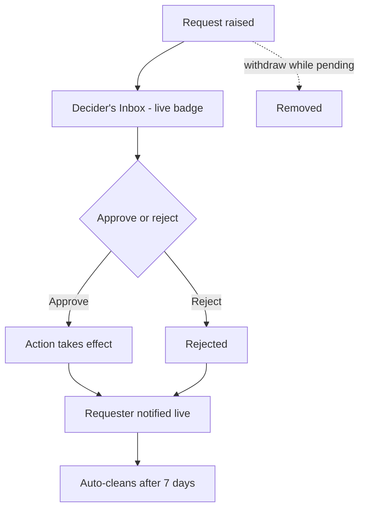

### C1 · Course request

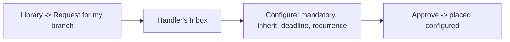

### C2 · Join request

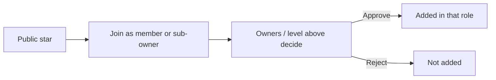

### C3 · Deletion request

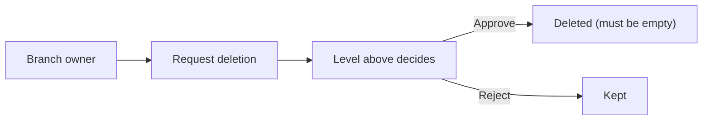

### C4 · Visibility request

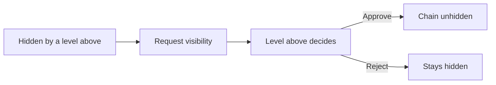

### C5 · How you hear about it — notifications

Every request, decision, assignment and reminder arrives as a **live, clickable
notification** that deep-links to the exact item.

---

## Master index — setting → where → screenshot

| Setting | Who | Chapter | Screenshot |
|---------|-----|---------|-----------|
| Create a sub-role | Owner | 5 | `sub-role-form.png` |
| Set visibility (public/hidden) | Owner | 5 | `group-configuration.png` |
| Delete / request branch deletion | Owner | 5 | `group-configuration.png` |
| Add a person (member/co-owner) | Owner | 6 | `add-person-choose.png` |
| Grant co-owner rights | Owner | 6 | `add-coowner-form.png` |
| Grant member "create content" | Owner | 6 | `add-member-form.png` |
| Publish a course | Owner | 7 | `upload-course-form.png` |
| Configure placement (mandatory/inherit/archive) | Owner | 7 | `courses-panel.png` |
| Back up / restore a branch (`.bkp`) | Owner | 14 | `backup-panel.png` |
| Supreme zone (owners, `.main`, delete) | Top owner | 14 | `group-configuration.png` |
| Complete assigned courses | Member | 10 | `my-learning.png` |
| Read in the in-app viewer | Member | 10 | `course-viewer.png` |
| Propose content | Member | 8 | `studio.png` |
| Send a join request | Member | 11 | `requests.png` |
| Decide a request (inbox) | Decider | 11 | `requests.png` |
| Notifications | Everyone | 13 | `notifications.png` |

---

**Back to:** [Table of contents](README.md) · **Reference:**
[Appendix — Glossary & quick reference](appendix-glossary-and-reference.md)
