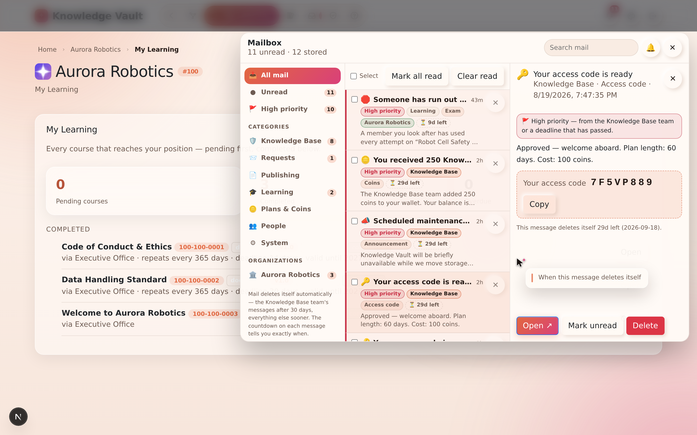

# Chapter 16 — The Mailbox

## What it is

Everything the platform has to tell you arrives in **one mailbox**. Not a bell with a list
under it — a proper mail client, with folders down the side, a message list in the middle, and
a reading pane. It opens from the **bell in the top-right corner of every page**, inside an
organization or nowhere near one.

It exists because the alternative is clutter. Requests, learning deadlines, publishing
decisions, plan changes and messages from the Knowledge Base team are genuinely different
kinds of news, and piling them into one grey list means the important one sits below the
routine one. Here each kind is filed, labelled and — the part most systems skip —
**expires on its own**.

---

## Why it matters

| Parameter | What changes |
|-----------|--------------|
| **Time** | Folders and labels mean you can answer "what is waiting on me?" without reading anything you don't need. Search covers subjects, bodies, labels and organization names. |
| **Risk & compliance** | Overdue deadlines and locked exams are pushed to the top with a red flag, so the things that actually matter never sit below routine noise. |
| **Security & custody** | Access codes arrive here rather than by email, which means they never leave the platform's own boundary — and they expire on their own. |
| **Cost** | Nothing accumulates. Every message carries its own expiry, so the mailbox never becomes a database nobody dares clean. |
| **Adoption** | It behaves like a mail client people already know: folders, labels, multi-select, a reading pane, and a chime you can switch off. |

---

## 1. The folder rail

Down the left-hand side:

| Folder | What lands in it |
|--------|------------------|
| **All mail** | Everything, newest first, with high-priority mail pinned above it. |
| **Unread** | Only what you haven't opened. |
| **High priority** | Anything flagged — every message from the Knowledge Base team, plus deadlines that have already passed. |
| **Knowledge Base** | Access codes, plan decisions, coin adjustments, announcements. |
| **Requests** | Everything waiting on a decision — yours or someone else's. |
| **Publishing** | Document reviews, publications, adoptions of your material. |
| **Learning** | Assignments, deadlines, expiry, exam results. |
| **Plans & Coins** | Plan changes, expiry warnings, coin movements. |
| **People** | Placements, ownership, governance changes. |
| **System** | Housekeeping notes about the mailbox itself. |

Below the categories, one entry **per organization** you belong to. That is the label half of
the design: you can read *Aurora Robotics* on its own, ignore everything else, and come back
to the rest later.

Every folder carries its own unread count, so you can see where the pressure is without
opening anything.

---

## 2. Sub-labels — telling requests apart

Inside **Requests**, a bare "you have a request" is not much use — the five request flows need
five different reactions. Each message carries its own label:

| Label | The flow it belongs to |
|-------|------------------------|
| **Document publishing** | A member's draft is waiting for your review. |
| **Course for my path** | Someone wants a library course assigned to their branch. |
| **Join a branch** | Someone wants to be placed on a public branch. |
| **Branch deletion** | A branch's own owners want it removed. |
| **Visibility** | A hidden chain above a branch is keeping it invisible. |

Knowledge Base mail is labelled the same way — **Access code**, **Decision**, **Coins**,
**Plan**, **Announcement** — so you can find the message holding your code without reading the
rest.

---

## 3. Priority: what gets pushed to the top

Two things are flagged **high priority**, shown with a red edge and pinned above everything
else:

1. **Everything from the Knowledge Base team.** Your access code, a plan decision, a coin
   adjustment, an announcement. These are the messages that unblock you, so they never sit
   below routine noise.
2. **Deadlines that have already passed** — your own overdue mandatory course, an overdue
   course belonging to someone you look after, an exam whose attempts have run out.

The bell itself turns red and pulses while any high-priority message is unread.

---

## 4. Every message expires

This is the rule that keeps the mailbox usable and the database honest: **nothing lives
forever.**

| Kind of mail | How long it lives |
|--------------|-------------------|
| Knowledge Base team (codes, decisions, coins) | **30 days** |
| Plans & coins | 30 days |
| Requests, publishing, people | 14 days |
| Learning | 10 days |
| System notes | 3 days |

Each row shows its own countdown — *"6d left"*, *"4h left"* — and the reading pane spells out
the exact date. When it gets there the message deletes itself. You never have to tidy up, and
old mail cannot quietly accumulate on your behalf.

If you are holding more than forty messages, the mailbox says so once, in a **System** note.

---

## 5. Working through it

- **Select a message** to open it in the reading pane. Opening marks it read.
- **Open ↗** takes you to the exact thing it is about — the specific request card, the course
  list, your account.
- **Tick several** to mark them read, mark them unread, or delete them in one go.
- **Mark all read** and **Clear read** act on the folder you are in, so you can empty
  *Learning* without touching *Knowledge Base*.
- **Search** matches subjects, bodies, labels and organization names.
- The **🔔 / 🔕 button** turns the arrival chime on and off. Your choice is remembered.

An access code arrives with the code in a box in the reading pane and a **Copy** button beside
it — you never need to retype it.

---

## 6. Live delivery

The mailbox holds an open connection to the platform for as long as you have a page open. A
message appears **the moment it is written** — the instant an admin adjusts your coins, the
instant a manager approves your document, the instant an exam locks — with a short chime if
you have left it on.

This works on **every page**, including pages that belong to no organization at all. That is
deliberate: a coin adjustment or an access code has nothing to do with any one organization,
and waiting for you to wander into the right page before telling you would be silly.

If your connection drops, the mailbox reconnects on its own and catches up.

---

## 7. What generates mail

Common triggers, by folder:

- **Requests** — a request you can decide; a decision on something you asked for.
- **Publishing** — your document was published, or was not; someone adopted your course.
- **Learning** — a course reached your position; a mandatory course went overdue; a
  completion expired and the course came back; a course was updated and your completion was
  reset; a manager's reminder; an exam ran out of attempts; a manager reset them.
- **Plans & Coins** — a plan is a week from expiry; a plan lapsed; coins moved.
- **Knowledge Base** — your access code; a decision on a platform request; an announcement
  from the team.

---

## Tips & pitfalls

- **Use the folders, not the search.** *Requests* answers "what is waiting on me"; *Learning*
  answers "what is waiting on my people". The two questions rarely want the same answer.
- **Trust the countdown.** Clearing routine mail by hand is wasted effort — it goes on its own.
- **Watch the red bell, ignore the rest.** A high-priority flag means someone is genuinely
  blocked, or a deadline has already gone.
- **Copy the code, don't retype it.** Access codes are eight characters and case-sensitive.
- **Turn the chime off in a shared office** — and leave it on when you are the person who
  approves things.
- **The bell follows you everywhere.** You do not need to be inside an organization to be told
  something; that is why it sits beside the palette on every page.

---

## 🎬 Make a video of this

**Length:** ~2 minutes. **Working title:** *"Everything the platform has to tell you."*

| # | Shot | Say |
|---|------|-----|
| 1 | Click the bell; the mailbox opens over the page | "Not a dropdown — a mail client." |
| 2 | Run down the folder rail, unread counts visible | "Filed by kind, and labelled by organization." |
| 3 | Open a Knowledge Base message with an access code; press **Copy** | "The messages that unblock you are pinned to the top. Copy, never retype." |
| 4 | Point at a row's countdown | "Every message expires on its own. Nobody tidies this up." |
| 5 | Tick three messages; mark read; delete | "Multi-select, like anywhere else." |
| 6 | Toggle the chime | "And the chime is yours to switch off." |

**Script beat to close on:** *"The bell is on every page because some news — your code, your
coins — belongs to you, not to one organization."*

**Next:** [Chapter 17 — Plans, pricing & Knowledge Coins →](chapter-17-plans-and-access.md)
