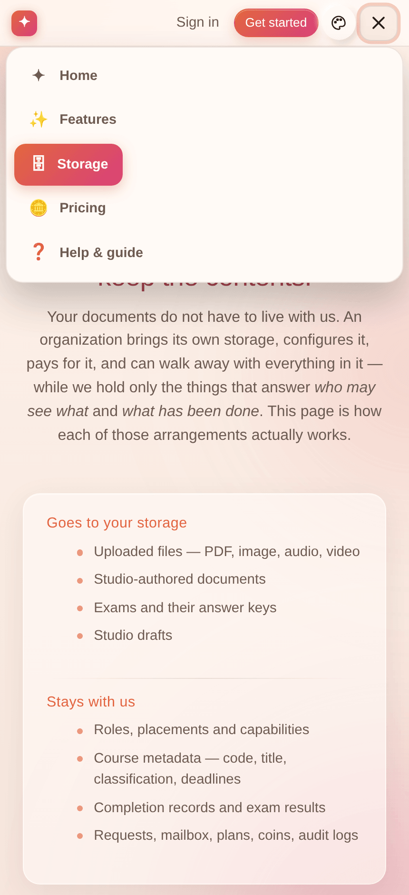

# Chapter 17 — Appearance & navigation

## What it is

Two small things you meet on every single screen: **how the platform looks**, and **how you
move around it**. Both are deliberately quiet — but both are yours to set, and both remember
what you chose.

---

## 1. The navigation bar

The bar across the top of every page is **icons at rest and words on contact**.

At rest each destination is a single icon, so the bar stays short even when an organization
has a dozen places to be. Hover it — or reach it with the keyboard — and the icon **widens
out into its full label**: *Constellation*, *My Learning*, *Library*, *Requests*,
*Compliance*, *Studio*.

Three things worth knowing:

- **The label is real text.** It is part of the link, not a tooltip the browser draws on its
  own schedule and not a placeholder. Screen readers read it, and your browser's *find on
  page* finds it, whether or not it is currently visible.
- **The page you are on keeps its label open.** You can always see where you are without
  touching anything.
- **Counts ride along.** A branch with requests waiting shows the number on its icon, expanded
  or not.

### The bar is deliberately unhurried

Widening a label makes the bar wider, which moves every link after it. If that happened at the
speed of an ordinary hover effect, the link you were aiming at would slide out from under your
pointer and you would click the wrong one — which is exactly what used to happen.

So the navigation bar moves on its own, slower timing:

- **It waits before it opens.** Sweeping past a link on your way somewhere else does not
  disturb the bar at all.
- **It opens gently, and does not overshoot.** No bounce, nothing that springs past its resting
  place and comes back.
- **It waits before it closes.** Slipping off the pill for an instant does not snap it shut
  under your finger.

Colour still answers instantly — you always know the moment you have reached a link. Only the
*shape* takes its time. If you have asked your device to reduce motion, none of this animates
at all.

### On a phone or a tablet

There is no hovering on a touch screen, so the bar behaves differently and honestly: the
**menu button** opens the destinations as a vertical sheet with **every label already showing**.
Nothing is hidden behind a gesture you cannot perform. The sheet is solid rather than
see-through, so the page underneath never competes with the links, and it scrolls on its own if
there are more destinations than fit.

The same menu button now serves the public pages — Home, Features, Storage, Pricing and Help —
which previously had no way to reach their navigation on a narrow screen at all.

---

## 2. Themes

The **palette button** sits beside the bell on every page.

### Day and night

The default is the warm **peach-white day theme** — the look the platform ships with, chosen
because most people read documents in daylight and a bright, low-contrast page is easier on
the eyes for long stretches. The switch flips to a full **night theme** for dark rooms and
late shifts.

### Accents

Five accent palettes change the colour of buttons, highlights and the constellation's glow:

| Accent | Feel |
|--------|------|
| **Peach** | The default — warm, low-glare. |
| **Aurora** | Violet and indigo. |
| **Ocean** | Blue and cyan. |
| **Sunset** | Orange and pink. |
| **Forest** | Green and lime. |

Day/night and accent are independent — a night theme with a Forest accent is a perfectly
ordinary choice.

### It remembers

Your choice is stored **on your device, in a cookie**, and applied *before the first frame is
painted* — so there is no flash of the wrong theme while a page loads. Sign out, close the
browser, come back next week: you get exactly the look you left.

> **Why a cookie rather than an account setting?** Because appearance is about the screen you
> are sitting at, not about you. The same person may want night mode on the laptop in the
> workshop and the day theme on the office monitor, and the platform should not argue.

### Reduced motion

If your operating system is set to reduce motion, the platform obeys: the navigation rail
stops sliding, transitions shorten, and the background animation settles.

---

## 3. The mailbox bell

Beside the palette sits the **bell** — the mailbox, covered in full in
[Chapter 14](chapter-14-the-mailbox.md). It is on every page for a reason: some of what the
platform has to tell you (an access code, a coin adjustment) has nothing to do with any one
organization, so it cannot live inside one.

---

## Tips

- **Learn two icons and you know the bar.** ✦ is your constellation; 🎓 is your learning.
  Everything else you can hover.
- **Set the theme once, on each device you use.** It is a per-device choice by design.
- **If the bar looks cramped, it isn't broken** — that is the collapsed state. Hover or tap.
