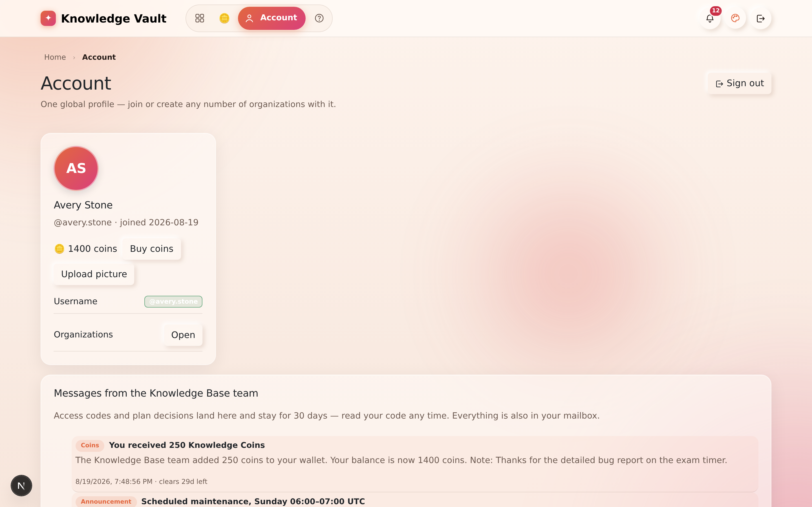
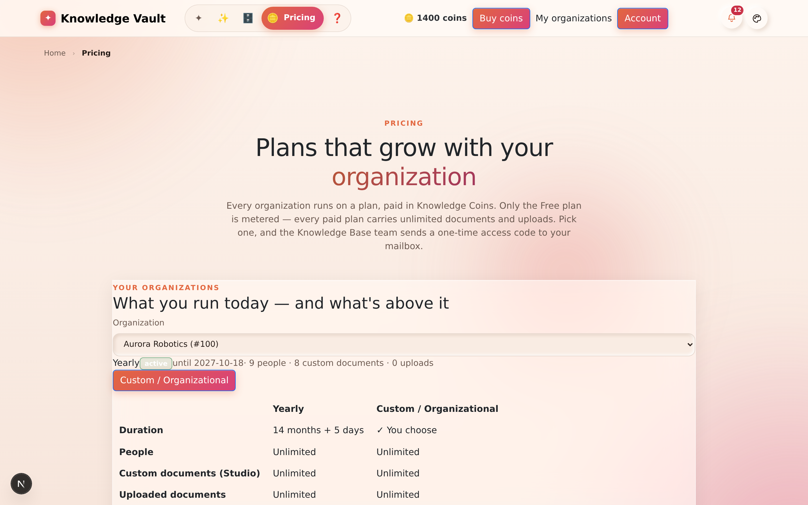
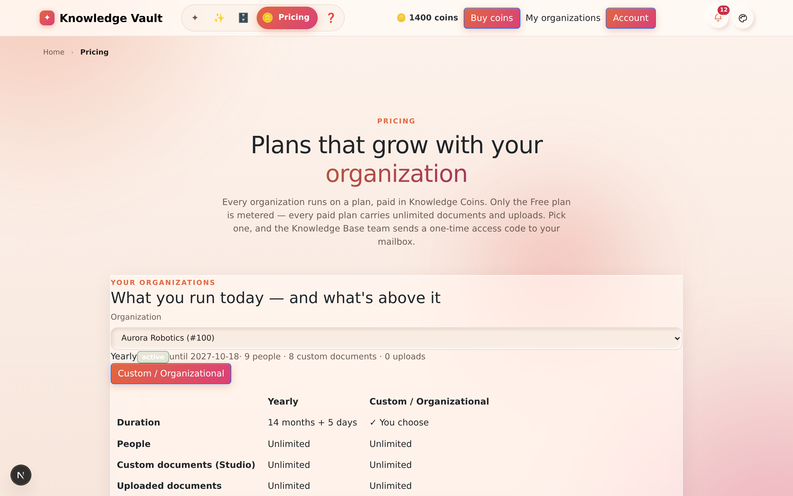

# Chapter 17 — Plans, pricing & Knowledge Coins

## What it is

Creating an organization is not open to everyone by default — it is gated behind a **plan**
and a one-time **access code**. Plans are bought with **Knowledge Coins**, the platform's
virtual currency (some teams call them *education coins* — same thing).

This chapter covers the whole money-and-access side of Knowledge Vault: what a coin is, how
pricing works, how many people a plan lets you have, the **Free plan** you use as a
testing environment, how to get your access code, how to read the countdown timer on your
organization, and what happens when a plan runs out.

> **Who does what:** everything in this chapter is *your* side — the Pricing page, your code,
> your organization's timer. The Knowledge Base team's side (approving requests, issuing
> codes, gifting coins, setting plans) is the **Super Admin Guide Book** (a separate book, held by the Knowledge Base team).

---

## Why it matters

| Parameter | What changes |
|-----------|--------------|
| **Time** | Requesting a plan is one click from the card that describes it, and an approved upgrade is applied by the team immediately — there is no code to redeem for an organization that already exists. |
| **Risk & compliance** | The plan chip is visible on every card, so an organization never quietly lapses and takes its restore path with it. |
| **Security & custody** | Access codes arrive in your Mailbox, are valid for 24 hours, work once, and are checked against the plan they were issued for — a KVEP code cannot create an ordinary organization, or the reverse. |
| **Cost** | Coins leave your wallet **at redemption**, not at request. A plan you asked for and never used costs nothing, and a failed storage test costs nothing either. |
| **Adoption** | The free plan is a complete product for 30 days, not a crippled demo — you rehearse the real thing before you pay for it. |

---

## 1. Knowledge Coins

A **Knowledge Coin** is the unit Knowledge Vault prices plans in. Coins are not money and
they don't expire — think of them as tokens sitting in your profile's wallet, spent when you
found or restore an organization.

| Question | Answer |
|----------|--------|
| **How many do I start with?** | **150 coins**, granted the moment you register. (The Knowledge Base team can change the starting amount for *future* sign-ups — it never touches balances that already exist.) |
| **Where do I see my balance?** | On the **Pricing** page, as the `🪙 200 coins` chip in the top bar — and on the **Buy coins** page. It's deliberately kept off every other screen. |
| **What can I spend them on?** | Plans. The **Demo** plan costs nothing; paid plans cost whatever the card says. |
| **When are they taken?** | **Only when you use your access code** — never when you send a request, and never when it's approved. If you never redeem the code, you never pay. |
| **Can I get more?** | The Knowledge Base team can gift or adjust your balance at any time; you get a message when they do. **Buying coins with real money is coming soon.** |
| **Is there a record?** | Yes — every grant, gift, adjustment and spend is written to a ledger with the resulting balance. |


Your balance also sits on your **Account** page, beside the history of how it got there:



### Buying coins (coming soon)

The **Buy coins** button next to your balance opens the top-up page. The payment gateway
isn't live yet, so today the page explains that coins are granted by the Knowledge Base team
— ask them if you need more.



---

## 2. How pricing works

Open **Pricing** from the site footer, the home page, or the 🪙 item in the app's navigation.
Plans are shown as cards, grouped into **tabs**, and are managed centrally by the Knowledge
Base team — so the page always reflects what's actually on offer, including limited-time
offers that appear and disappear on their own dates.

Each card tells you what it costs, how long it runs, and — in a small facts table — exactly
how much of everything it includes: **people**, **custom documents**, **uploaded documents**,
**storage** and whether **server-side drafts** are part of it.

### The plan ladder

| Plan | Price | Runs for | People | Custom documents | Uploads | Storage |
|------|-------|----------|--------|------------------|---------|---------|
| **Free** | 50 coins | **30 days** | up to 10 | **30** | **30** | **150 GB** |
| **Bi-monthly** | 100 coins | **2 months** (60 days) | Unlimited | Unlimited | Unlimited | Unlimited |
| **Quarterly** | 150 coins | **4 months + 10 days** (130 days) | Unlimited | Unlimited | Unlimited | Unlimited |
| **Yearly** | 500 coins | **365 days + 2 months** (425 days) | Unlimited | Unlimited | Unlimited | Unlimited |
| **Custom / Organizational** | By agreement | You state the days | You state the number | You state the number | You state the number | By agreement |

**Only the Free plan is metered.** It stops at 30 custom documents, 30 uploads, or 150 GB of
storage — *whichever ceiling arrives first*. Every paid plan carries unlimited documents and
uploads for as many people as you need.

> **The page wins over this table.** Prices, durations and limits are edited centrally and can
> change; whatever the Pricing page shows is what you'll be charged. The Knowledge Base team
> can also pin a *per-organization* ceiling by hand, which overrides whatever the plan says.

There are two buttons on a card:

- **Request this plan** — for a fixed plan. One click sends the request; the terms are the
  ones printed on the card, and nobody has to re-type them.
- **Request a custom plan** — opens a short form asking for the **days**, the **number of
  people**, the **custom-document count**, the **upload count**, and the **coins you offer**.
  Those are the numbers the team approves, so a custom plan is agreed once rather than
  negotiated twice.

---

## 2b. Upgrading an organization you already have

If you are signed in and own an organization, the Pricing page opens with an **upgrade panel**
above the cards — pictured below: your current plan on the left, the plans above it on the right, compared row
by row — duration, people, documents, uploads, storage, drafts, price — with the improvements
ticked.



Pick the plan you want and select **Upgrade**. The request goes to the Knowledge Base team,
who **apply it directly**: an organization that already exists needs no access code, so the
new plan simply appears, and you get a message in your mailbox confirming the terms and the
new expiry date.

Only an **owner** of the organization can ask for an upgrade — a member sees the comparison
but not the button.

---

## 3. How many people can I have? (member limits)

Every plan carries a **member limit** — the maximum number of *people* in one organization.

- The limit counts **people, not positions**. Someone who already belongs to the
  organization can be placed on as many roles as you like without using another seat.
- The Knowledge Base team can set a **per-organization limit** that overrides the plan's
  (for example, 250 seats on an annual agreement). A blank override means "use the plan's
  number"; some plans are unlimited.
- The limit is enforced the moment a **new** person would join — when an owner adds someone
  to a role, and when a **Join request** is approved. If the organization is full you'll see:

  > *This organization's plan allows up to 250 members. Upgrade the plan to add more.*

- Nothing is deleted when you hit the ceiling — existing people keep working normally. You
  either remove someone or move to a bigger plan.

If you're planning a rollout, count **every person who will need a login inside that one
organization**, and pick the plan from that number. Separate organizations have separate
limits — a person in two organizations occupies a seat in each.

---

## 4. The free plan — your starting point

The **Free** plan is where most organizations begin. It is:

- **50 coins for 30 days** — affordable out of the coins your profile starts with;
- **Full-featured** — the constellation, courses, Studio, exams, library, requests,
  compliance, backups and `.main` custody all behave exactly as they do on a paid plan;
- **Metered** — 10 people, 30 custom documents, 30 uploads, 150 GB of storage. Whichever of
  those you reach first is the one that stops you.
- **Without server-side drafts** — your Studio work is still saved in your browser as you
  write, but parking a draft on the server to resume on another device is a paid capability.
- **One per profile.**

Two things to plan for before you start:

1. **It ends.** At 30 days the organization's timer lapses and the card turns red.
2. **A lapsed free organization cannot be restored for free.** If you delete it (or lose it)
   after expiry, bringing it back needs a plan and a restore code — §7. If the content
   matters, upgrade *before* the 30 days are up; the upgrade panel makes that one click.

> **What happens when I hit a ceiling?** Nothing is deleted. The next upload or new document
> is refused with a message naming the limit, and everything already there keeps working.
> Free up space, or upgrade.

## 5. Getting an access code

Because organization creation is controlled, you **request** a plan and the Knowledge Base
team sends you a one-time code.

```
You choose a plan  →  the team approves (with final terms)  →  you get an 8-character code
      │                                                                      │
      └──── Pricing page ────────────────────────────────────────────────────┘
                                                              valid 24 hours · single use
```

1. On **Pricing**, choose a plan and select **Request this plan** — or **Propose terms** for
   a custom plan, entering the days you want and the coins you offer.
2. Your request lands with the Knowledge Base team.
3. They **approve** it (setting the final duration, price and a message) or **decline** it
   (with a reason).
4. On approval you receive an **8-character access code** as a message **from the Super
   Admin**, valid for **24 hours** and usable **once**.

### Tracking your requests

The Pricing page lists **Your requests** underneath the cards, with their live status —
*pending*, *approved*, *denied* or *used* — plus any reply from the team. While a request is
still pending you can **Withdraw** it.


### Your code lives on your Account page

The code arrives in your **Mailbox** **and** in a dedicated **"Messages from the Knowledge Base
Admin"** panel on your **Account** page — so you can read it any time, even before you belong
to any organization. These messages stay for **30 days**.


---

## 6. Creating the organization with your code

Go to **Create organization**. The page has two halves:

- **Left — the founding form:** your access code, the organization name, the first role name,
  and the Supreme password (with its unrecoverable-password acknowledgement — see
  [Chapter 3](chapter-03-founding-an-organization.md)).
- **Right — the plan chooser:** your coin balance and every plan, so you can request one
  without leaving the page. Each plan shows its status once you've asked: *requested —
  awaiting approval*, then *approved — code in your 🔔*.


On submit the platform verifies the code, deducts the plan's coins, stamps the organization
with the plan and its expiry date, and marks the code **used**. If your balance is short,
nothing is created and you're told exactly how many coins the plan costs and how many you
have.

---

## 7. The countdown timer, expiry and restoring

### The timer

Every organization card carries a **plan chip** under its name, showing the plan by name and
the largest unit of time that still means something:

| Chip | Meaning |
|------|---------|
| `● Yearly · 14 months left` | Comfortably in date — the dot is green |
| `● Quarterly · 4 months left` | The same, further down the ladder |
| `● Free · 30 days left` | Weeks remaining — the dot turns amber as it shortens |
| `● Bimonthly · 20h left` | Hours remaining — red, and **pulsing only inside the last three days** |
| `● expired — upgrade to keep it` | The plan has lapsed |
| `● no expiry` | An open-ended plan |

Hover the chip for the **exact date**. The chip counts in months and years rather than
thousands of days on purpose: *9.9 years left* is a fact somebody can act on, and
*3,643d 14h left* is a number nobody reads twice.


### When a plan expires

The organization and its data stay where they are — expiry does not delete anything. What
changes is your ability to bring the organization **back** once it's gone:

- Deleted organizations sit in a **30-day retention** list and can be restored with the
  Supreme password.
- If the plan has **expired** (or it was a **Demo**), restoring is blocked with a clear
  message that sends you to the **Pricing page**.
- Choose a plan there and the team issues a **restore code**. Enter it when you restore —
  you may need to upload the `.main` file again — and the organization comes back on the new
  plan, with the coins deducted then.

### Why the plan travels inside your `.main` file

Your `.main` file ([Chapter 18](chapter-18-supreme-and-custody.md)) carries an encrypted, **server-signed** snapshot of the plan.
On revival the platform checks that signature:

- **Active and unexpired** → the organization revives directly.
- **Demo, expired, or a file made before plans existed** → you're told plainly that the plan
  has lapsed and pointed at Pricing for a restore code.

The signature is what stops an expired file being edited into a "paid forever" one — custody
of your organization and the truth about its plan stay together in the same file.

---

## 8. Tips

- **Request early.** Codes expire in 24 hours, so ask for your plan shortly before you intend
  to create the organization — not days ahead.
- **Your code is always in your mailbox** for 30 days, under *Knowledge Base*, with a Copy
  button — and mirrored on your Account page.
- **Coins leave your wallet only at redemption.** Requesting and being approved cost nothing.
- **Size the plan by people, not roles.** Roles are free; people occupy seats.
- **Watch the chip.** Inside the last three days it turns red — upgrade before it lapses and
  you'll never need the restore path at all.
- **Upgrade from inside the product.** The Pricing page's upgrade panel compares your current
  plan with the ones above it and files the request in one click — no code to redeem.
- **Use the Free plan as a rehearsal, not as the real thing.** It's complete, but it ends
  after 30 days and can't be restored for free once it does.

---

## 🎬 Make a video of this

**Length:** ~2½ minutes. **Working title:** *"Coins, plans, and the eight characters that
start an organization."*

| # | Shot | Say |
|---|------|-----|
| 1 | Pricing page, coin balance visible | "Every profile starts with 150 Knowledge Coins." |
| 2 | Scroll the plan ladder | "Free for thirty days, then four rungs — and a custom plan where you state the terms." |
| 3 | **Request this plan** | "One click. The terms are the ones printed on the card." |
| 4 | Cut to the Mailbox: the code arrives, press **Copy** | "The code lands in your mailbox. Valid twenty-four hours, works once." |
| 5 | Creation form: paste the code | "Coins leave your wallet here, at redemption — not when you asked." |
| 6 | Signed-in Pricing page: the upgrade comparison | "And later, your plan against the ones above it, upgraded without a code at all." |

**Script beat to close on:** *"Ask, get approved, redeem. Nothing is charged until the
organization actually exists."*

**Next:** [Chapter 18 — The Supreme zone: custody & recovery →](chapter-18-supreme-and-custody.md)
