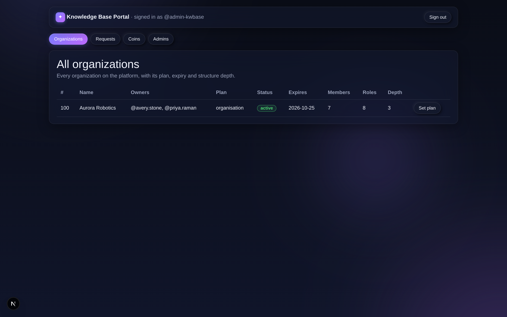

# Chapter 17 — Plans, Pricing & access codes

## What it is

Creating an organization is no longer open to everyone by default — it's gated behind a
**plan** and a one-time **access code**. This chapter explains how to choose a plan, get your
code, create your organization, read the countdown timer, and what happens when a plan
expires. It also introduces **Knowledge Coins**, the platform's virtual currency.

---

## Knowledge Coins

Every profile starts with **150 Knowledge Coins**. You spend coins to buy plans (the **Demo**
plan is free and costs nothing). Your balance is shown **only on the Pricing page** — it isn't
scattered around the app. Buying more coins with real money is **coming soon**; for now, the
Knowledge Base team can top up your balance.

---

## The Pricing page

Open **Pricing** from the site footer or the home page. Plans are shown as cards, grouped into
tabs, and are managed centrally — so the plans you see always reflect what's currently offered.

Each card shows the price (in coins), the duration, what you get, and any eligibility criteria.
Typical starter plans:

| Plan | Cost | Duration |
|------|------|----------|
| **Demo** | Free | 2 months (60 days) |
| **Monthly** | Coins | 30 days, renewable |
| **Organisation** | Coins | Duration agreed with the Knowledge Base team |

---

## Getting an access code (the request → response flow)

Because organization creation is controlled, you **request** a plan and the Knowledge Base
team sends you a one-time code:

1. On **Pricing**, choose a plan and select **Request this plan** (or **Propose terms** for a
   custom plan, where you enter the days you want and the coins you'll offer).
2. Your request goes to the Knowledge Base team.
3. They **approve** it (with final terms and a message) or **decline** it (with a reason).
4. On approval, you receive an **8-character access code** as a message **from the Super
   Admin** — valid for **24 hours**.

### Your code lives on your Account page

The code arrives in your notification bell **and** on a dedicated **"Messages from the Super
Admin"** panel on your **Account** page — so you can read it any time, even before you belong
to any organization. These messages stay for **30 days**.

---

## Creating the organization with your code

Go to **Create organization**. Alongside the usual details (name, first role, Supreme
password), enter your **access code**. On submit, the platform verifies the code, deducts any
coins the plan costs, and creates your organization on that plan. The code is **single-use**.

> Don't have a code yet? The create form links you straight to the Pricing page to request
> one.

---

## The countdown timer

Every organization card shows a **countdown timer above its name** — how long is left on its
plan (for the Demo, Monthly, or a custom duration), or **"expired — upgrade"** once it lapses.

---

## When a plan expires

- A **Demo** lasts at most **2 months**. Paid plans last their duration.
- If you **delete** an organization whose plan has expired and later try to **restore** it —
  whether from the 30-day retention list or from its `.main` file — the platform tells you
  **clearly** that the plan has expired and can't be restored for free, and sends you to the
  **Pricing page**.
- Choose a plan there; the Knowledge Base team sends you a **restore code**. Enter it when you
  restore (you may need to upload the `.main` again), and your organization comes back on the
  new plan.

This is why the plan travels, encrypted and signed, **inside your `.main` file** — your
organization's custody and its plan stay together.

---

## For Knowledge Base staff — the admin portal

Team members administer all of this from a separate **Knowledge Base portal** (a small
**"Knowledge base employee login"** link in the site footer). From there, staff see every
organization, approve or decline requests (issuing access codes), gift coins, and set or
upgrade plans.

> This portal is for Knowledge Base employees only. As a customer you'll never need it — your
> whole experience is the Pricing page, your access code, and the timer on your org card.

---

## Tips

- **Request early.** Codes take a moment to be approved and expire in 24 hours — request your
  plan a little before you need to create the org.
- **Your code is always on your Account page** for 30 days — no need to hunt through the bell.
- **Watch the timer.** When an org nears expiry the chip turns red; upgrade before it lapses to
  avoid the restore step.

**Back to:** [Table of contents](README.md)
