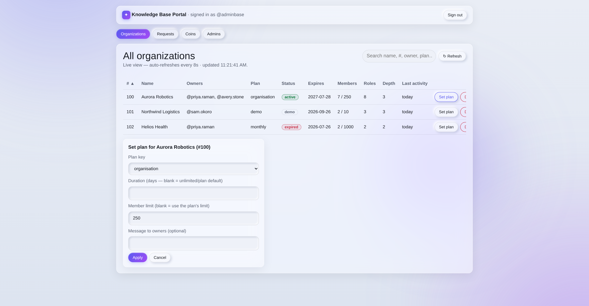
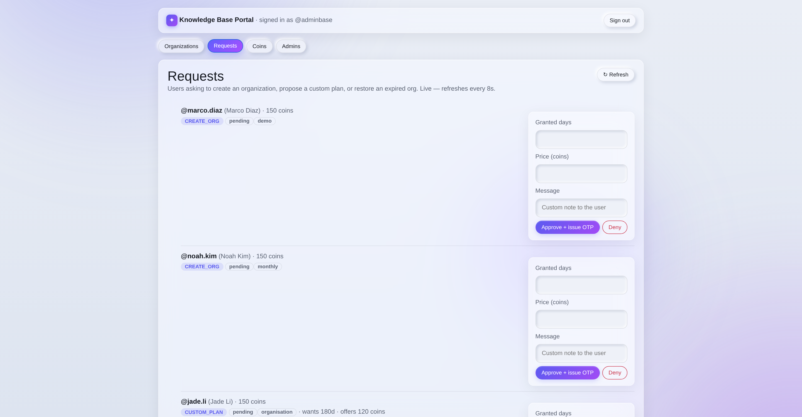
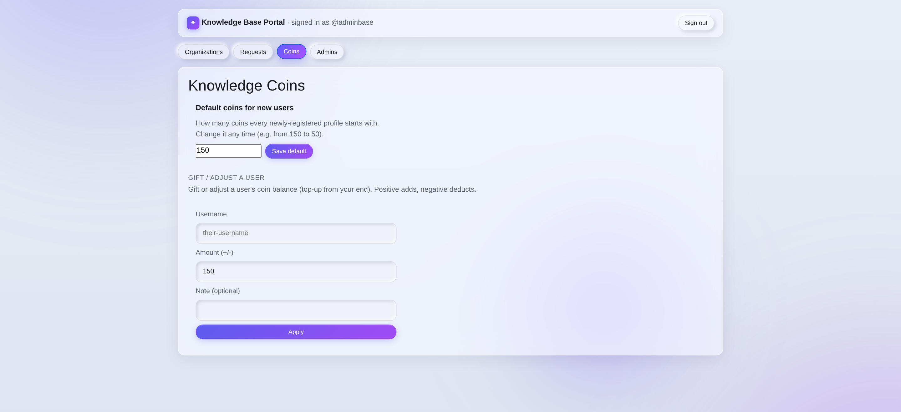
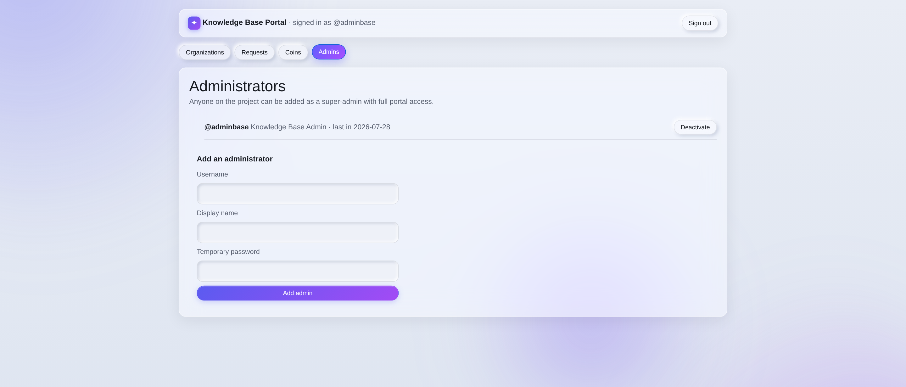

# Chapter 18 — The Knowledge Base portal (platform staff)

## What it is

The **Knowledge Base portal** is the administration console for the people who *run* the
platform — the Knowledge Base team. It is a **separate realm** from the product: its own
login, its own accounts, its own token. Nothing you do as a customer ever takes you here, and
nothing here needs your organization's Supreme password.

From the portal, staff can see every organization on the platform, decide plan requests and
issue access codes, gift Knowledge Coins, set the starting balance for new sign-ups, change
an organization's plan and member limit, and manage the administrator accounts themselves.

> **Customers:** you never need this chapter. Your whole experience is the Pricing page, your
> access code and the timer on your organization card — [Chapter 17](chapter-17-plans-and-access.md).

---

## Signing in

The portal is reached from the small **"Knowledge base employee login"** link in the site
footer, which opens the employee sign-in page.

- The first administrator account is created automatically when the platform is deployed, and
  is **forced to change its password at first login** — the bootstrap password only ever
  works once.
- Sign-in is username + password. Accounts can be **deactivated**, and a deactivated account
  is refused on every request, not just at login.
- The URL is not the security boundary — the login is. The footer link exists only so staff
  can find the door.

---

## Organizations — the god view

The first tab lists **every organization on the platform**, live.

| Column | What it tells you |
|--------|-------------------|
| **#** | The organization number (`100`, `101`, …) |
| **Name** | Its name; deleted organizations are shown faded, with a `deleted` badge |
| **Owners** | The usernames holding the root role |
| **Plan / Status / Expires** | The plan it runs on, whether it's `active`, `demo`, `expired` or `none`, and the expiry date |
| **Members** | People used **/ the limit** in force (e.g. `7 / 250`) |
| **Roles / Depth** | How big and how deep the constellation is |
| **Last activity** | The most recent sign of life — governance, learning, publishing or someone joining |

Working with the table:

- **Live** — it refreshes itself every 8 seconds, and the header shows when it last updated.
  There's a manual **↻ Refresh** too.
- **Search** — one box filters by name, number, owner username, plan or status.
- **Sort** — click any underlined heading to sort; click again to reverse.
- The table is wider than its panel on smaller screens — it scrolls sideways.

### Set plan — plan, duration and member limit

**Set plan** on a row opens the plan editor for that organization.

- **Plan key** — which plan the organization runs on.
- **Duration (days)** — blank means "use the plan's own duration" (or unlimited if it has
  none). Any number here starts the countdown again from today.
- **Member limit** — blank means "use the plan's limit". A number here is a **per-organization
  override**, which is how custom agreements ("250 seats") are honoured.
- **Message to owners** — an optional note delivered with the notification.

Applying it notifies every root-role owner that their plan changed, and writes the change to
the audit log.

> This is the authoritative way to change a plan. The server never learns an organization's
> Supreme password, so plan state lives on the organization record itself — not inside a file
> only the owner can open.

### Delete — permanent and immediate

**Delete** purges an organization **now**, skipping the 30-day retention window. It asks for
an inline confirmation first (*"Delete forever?"*) and, once done, the only way back is the
owner's own `.main` file. Use it for genuine mistakes and abandoned test tenants, not as a
routine cleanup.

---

## Requests — approve, deny and issue codes

The **Requests** tab is the inbox for everything customers ask for: `CREATE_ORG`,
`CUSTOM_PLAN` and `RESTORE_ORG`. It refreshes every 8 seconds, so new asks appear on their
own.

Each row shows who is asking, their current coin balance, what they want (plan, days offered,
coins offered, target organization for a restore) and their message. Pending rows carry a
decision form:

| Field | Effect |
|-------|--------|
| **Granted days** | The duration you're actually granting — defaults to what they asked for |
| **Price (coins)** | What you'll charge — defaults to what they offered |
| **Message** | A custom note delivered with the decision |

- **Approve + issue OTP** mints an **8-character access code**, valid **24 hours** and usable
  **once**. The code is shown to you on screen a single time (so you can relay it out of
  band if you want to) and is delivered to the customer's notifications and Account page,
  where it stays for 30 days.
- **Deny** closes the request with your message. Denied and expired requests are simply
  re-requested by the customer — there's one round of negotiation, not a thread.

Coins are **not** taken at approval. They're deducted when the customer redeems the code —
so an unused approval costs them nothing.

---

## Coins — the starting balance and gifts

**Default coins for new users** sets how many Knowledge Coins every *newly registered* profile
starts with (150 out of the box). Changing it applies to sign-ups from that point on — it
never rewrites balances that already exist.

**Gift / adjust a user** changes one person's balance by any amount: positive adds, negative
deducts. Enter the username, the amount and an optional note. The user is notified
("You received Knowledge Coins" / "Your Knowledge Coins were adjusted") and the movement is
recorded in the coin ledger with the resulting balance. A deduction that would take someone
below zero is refused.

---

## Admins — who else can do all this

Any project member can be made a super-admin. Adding one takes a username, a display name and
a temporary password — and, like the first account, the new administrator **must change that
password at first login**.

Existing administrators can be **deactivated** and **reactivated** at any time; you cannot
deactivate the account you're signed in with. The list shows each admin's display name and
when they last signed in.

Every action taken anywhere in the portal — approvals, denials, gifts, plan changes, purges,
password changes, admin changes — is written to an **append-only audit log**.

---

## Tips for staff

- **Read the Members column before granting a plan.** `7 / 250` tells you instantly whether a
  customer asking for more seats actually needs them.
- **Set the member limit at the same time as the duration.** Both live on the same form, and
  a custom agreement usually changes both.
- **Say why in the message field.** It's delivered to the customer verbatim and saves a round
  trip — especially on a denial.
- **Prefer expiry over deletion.** An expired organization is harmless; a purge is permanent.
- **Rotate the bootstrap password immediately** and add named administrator accounts rather
  than sharing one.

**Back to:** [Table of contents](README.md) · **Reference:**
[Appendix — Glossary & quick reference](appendix-glossary-and-reference.md)
