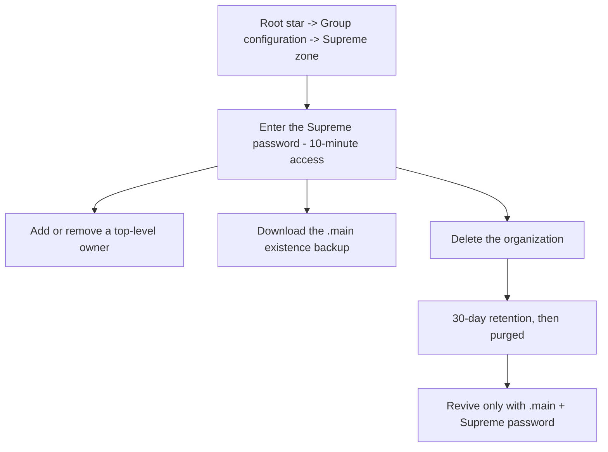
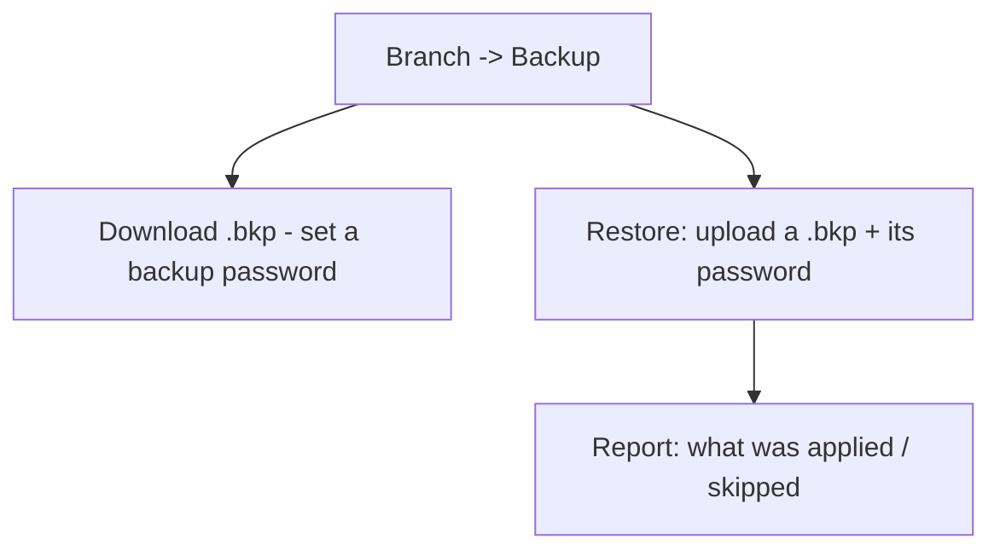
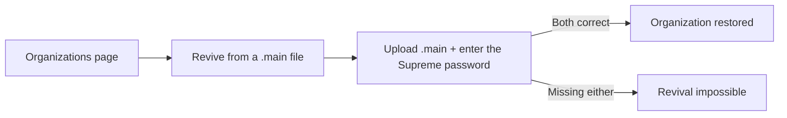

# Chapter 18 — The Supreme zone: custody & recovery

## Why it matters

| Parameter | What changes |
|-----------|--------------|
| **Time** | A deleted organization comes back in one click for thirty days. A purged one comes back from a file you already have — no support ticket, no waiting on anybody. |
| **Risk & compliance** | Owner-level changes at the top of the structure are gated behind a password only your organization holds, and every use of it is recorded in the Supreme audit. |
| **Security & custody** | The platform stores **no copy** of the Supreme password. It cannot revive your organization for you — and it cannot hand it to anyone else either. That is the whole trade. |
| **Cost** | `.main` and `.bkp` exports cost nothing and need no storage from us. Your insurance policy is a file on your own disk. |
| **Adoption** | The recovery routes are in the corner of the page where you noticed the organization was missing — not buried in a settings tree you would have to search under stress. |

---

## What it is

The **Supreme zone** is the most powerful — and most protected — area in Knowledge Vault. It
lives on the **root role** of your organization and is the practical expression of the
**custody** promise from Chapter 2: your organization's existence, ownership and revival are
all in *your* hands, guarded by the **Supreme password** that only you know.

You reach it by clicking the **root star**, choosing **Group configuration**, and scrolling
to the **Supreme zone** (visible only to the organization's top-level owners).

Because these actions are so consequential, they require you to enter the **Supreme
password**, which unlocks a 10-minute window of Supreme access.

---

## What lives in the Supreme zone

### Top-level owners
The Supreme zone lists the owners of the root role — the people who hold ultimate authority.
In the sample, that's *Avery Stone* and *Priya Raman*. From here you can:

- **Add a supreme co-owner** by username, and
- **Remove** an owner (you can't remove the last one).

Adding or removing a top-level owner is exactly the kind of change the Supreme password
protects.

### The `.main` existence backup
Your organization's `.main` file is its **existence backup** — a single encrypted file, keyed
to your Supreme password, that can **revive the entire organization** even after it's been
deleted and the 30-day retention period in the Recovery has passed.

Select **⬇ Download** to export it. **Keep it somewhere safe and offline.**

### Deleting the organization
The **Delete organization** action begins a **30-day retention** period, after which the org
is purged and **only the `.main` file can bring it back**. The platform insists you download
the `.main` file *first* and confirms before proceeding.

---

## The other backup: per-branch `.bkp` files

Separate from the org-wide `.main`, every branch can be backed up on its own from the
**Backup** section of its action panel. A **`.bkp`** file is an **encrypted snapshot of that
branch** — its roles, people and course placements — that you can restore later.

To create one:

1. Click a branch you govern → **Backup**.
2. Choose **⬇ Download .bkp of this branch** and set a backup password (you'll need it to
   restore).

To restore, upload a `.bkp` into a node and enter its password; the platform shows a report
of what was **applied** and what was **skipped**.

---

## Recovery — both ways back

Deleting an organization does not destroy it, and there are two routes back. Both live behind
one button: **Recovery**, in the **bottom-left corner of your Organizations page**. It sits out
of the way until you need it, and carries a count when something is waiting.

### 1. Deleted — waiting out the 30 days

For **30 days** after you delete it, an organization sits in Recovery's **Deleted** tab, fully
intact, showing exactly how many days it has left before it is purged. Restoring is one button
— **↩ Restore** — plus the Supreme password. There is no file to find and nothing to upload.

Two things to know:

- **The countdown is real.** After 30 days the organization is purged from the platform, and
  the only way back is the `.main` file.
- **A lapsed plan still blocks a restore.** If the plan expired while the organization sat
  there, the restore asks for a **restore code** from the Knowledge Base team.

### 2. From a `.main` file — after the purge

Recovery's second tab takes the encrypted `.main` file and the Supreme password, and rebuilds
the organization from scratch. This is the path for anything already purged, or for an
organization being moved to a different deployment. It is covered in full below.

> **Why "Recovery" and not a wastebasket?** A deleted organization here is not refuse waiting
> to be emptied — it is whole, and one password away from coming back. And the `.main` route
> recovers things a bin never held. The button is a recovery arrow because that is what it
> does.

---

## Reviving a purged organization

If an organization has been purged, its founder can bring it back from the **Organizations**
page:

1. Open **Recovery**, bottom-left, and choose the **`.main` file** tab.
2. Upload the `.main` file and enter the **Supreme password** that encrypted it.

Without both the file and the password, revival is impossible — which is precisely what keeps
your organization in your custody and no one else's.

---

## Flows at a glance

**Supreme-protected actions (on the root):**

**Branch backup and restore (`.bkp`):**

**Reviving a deleted organization:**

---

## Tips

- **Back up the `.main` the day you found the org, and after big structural changes.** It is
  your ultimate insurance policy.
- **Never store the Supreme password with the `.main` file.** Together they're the keys to
  the kingdom; keep them separately.
- **Use `.bkp` before risky edits.** About to restructure a division? Export its `.bkp` first
  so you can roll back cleanly.
- **Re-export `.main` after big changes.** The file carries the structure as it was when you
  exported it; a year-old file revives a year-old organization.
- **Two people should know the Supreme password**, held separately. One person with the only
  copy is not custody, it is a hostage situation with extra steps.
- **Test a `.bkp` restore once**, on a branch that does not matter, before you need one on a
  branch that does.

---

## 🎬 Make a video of this

**Length:** ~2½ minutes. **Working title:** *"Your organization, in your custody."*

| # | Shot | Say |
|---|------|-----|
| 1 | Root branch → **Group configuration** → the Supreme zone | "The top of the structure sits behind one password — and we don't have a copy." |
| 2 | Export the `.main` file; show it landing in Downloads | "This file is your organization's existence. Keep it somewhere durable." |
| 3 | A branch → **Backup** → export a `.bkp` | "And every branch can be exported on its own, encrypted." |
| 4 | Delete a test organization; open **Recovery** | "Deleting doesn't destroy. Thirty days, in this corner." |
| 5 | **↩ Restore** with the Supreme password | "One button and the password. Nothing to upload." |
| 6 | The `.main` tab, uploading a file | "And after the thirty days? The file you exported in shot two." |

**Script beat to close on:** *"Everything here is designed so that losing us doesn't mean
losing your organization."*

**Next:** [Chapter 19 — Staying signed in: sessions & security →](chapter-19-sessions-and-security.md)
