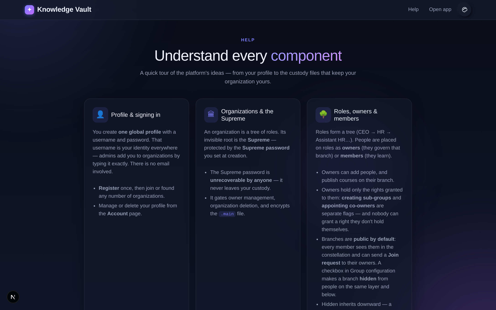

# Chapter 19 — Help & support

## What it is

Knowledge Vault includes a built-in **Help** page — a plain-language guide to every part of
the platform. It's **public**, so both prospective and signed-in users can read it, and it's
linked from the app sidebar so it's always a click away.

Open it from the **Help** link in the navigation (available on the landing page and inside
the app).

---

## What Help covers

The page walks through each component of the platform in short, friendly topics, including:

- **Profile & signing in** — your one global username-and-password identity, and how admins
  add you by username.
- **Organizations & the Supreme** — what an organization is, and the Supreme password that
  protects its root.
- **The constellation, roles and people** — how the tree works and how positions are placed.
- **Courses, the library and learning** — publishing, browsing and completing knowledge.
- **Requests, compliance and notifications** — the day-to-day flows for managers and
  learners.

Each topic is written for people, not engineers — no setup or code, just how to use the
product.

---

## Where to look when you're stuck

| If you want to… | Go to… |
|-----------------|--------|
| Understand a term | The [Appendix glossary](appendix-glossary-and-reference.md), or in-app Help |
| Change your name or picture | **Account** (Chapter 1) |
| See what you must complete | **My Learning** (Chapter 10) |
| Add a person or role | The constellation → **People / Group configuration** (Chapters 5–6) |
| Publish a course | A role's **Courses** panel, or the **Studio** (Chapters 7–8) |
| Find an existing document | The **Library** (Chapter 9) |
| Approve something | **Requests**, or the **notifications** bell (Chapters 11, 13) |
| Check who's trained | **Compliance** (Chapter 12) |
| Back up or recover your org | The **Supreme zone** and **Backup** (Chapter 14) |

---

## Tips

- **Bookmark the Help page** — it's the fastest in-product reference and it's always current
  with the live app.
- **Share Help with newcomers** before their first sign-in — because it's public, they can
  read it while their profile is being set up.
- **This guide book goes deeper.** Help is the quick tour; the chapters here are the full
  walkthrough with real screenshots.

**Next:** [Chapter 16 — Flow diagrams: every setting at a glance →](chapter-18-flow-diagrams.md)
