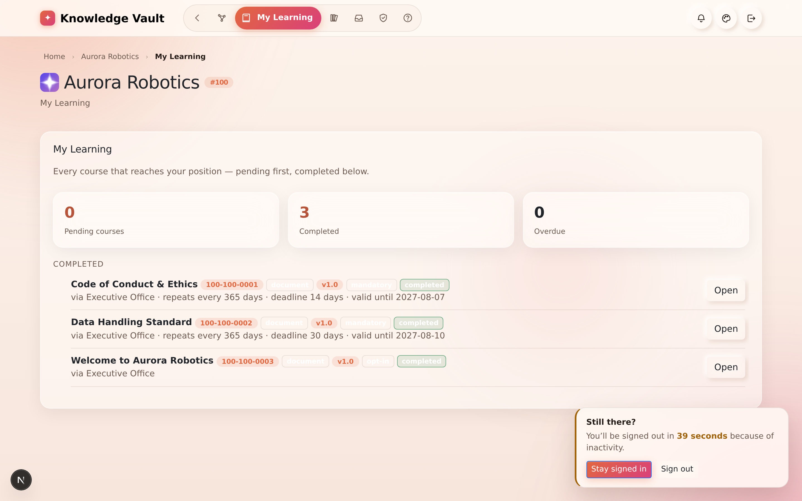
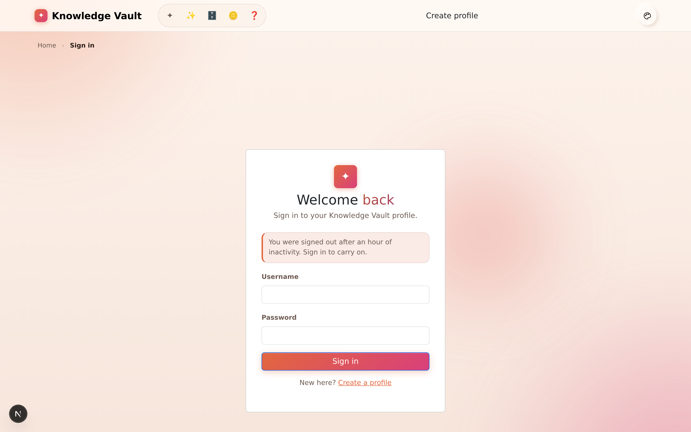
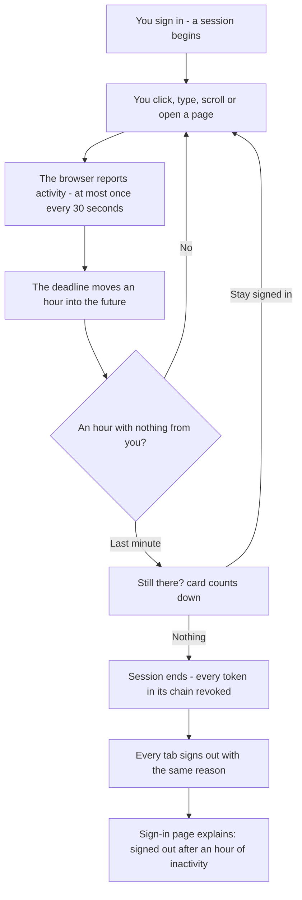

# Chapter 19 — Staying signed in: sessions & security

> **In one line:** a session ends after **one hour away from the keyboard**, you are warned in
> the last minute, and the next visit is told *why* it is asking for a password.

## What it is

A **session** is one signed-in browser on one device. Knowledge Vault ends a session after an
hour in which the person did nothing — and the important word is **person**. The app itself is
busy all the time: the Mailbox checks for post every two minutes, the request badge counts
every minute, the access token renews itself on a timer. **None of that counts as you being
there.**

Activity means, and only means:

- a **click**, a **key**, a **scroll**, a **touch**, or the **pointer moved** across the page;
- a **page opened**.

---

## Why it matters

| Parameter | What changes |
|-----------|--------------|
| **Time** | An hour is long enough that nobody is signed out mid-task, and the warning card means you never lose a form you were filling in. |
| **Risk & compliance** | A browser left open on a shared desk used to stay signed in for a **month**. On a platform holding an organization's Confidential and Secret documents, that was the wrong default — and the wrong thing to have to explain to an auditor. |
| **Security & custody** | Ending a session revokes **every token in its chain**, not just the one in the tab. Signing out, a ban, or a reused old token closes the whole thing. Live streams check the session on every heartbeat and hang up on one that has ended. |
| **Cost** | Nothing. It is a setting: `SESSION_IDLE_MINUTES` on the server, default 60, and every client is told the number so nothing hard-codes an hour of its own. |
| **Adoption** | The session ends *with an explanation*. "You were signed out after an hour of inactivity" is a sentence people accept; a password box that appears for no reason is a support ticket. |

---

## What you actually see

### 1. A warning in the last minute

A small card appears in the corner and counts down:

> **Still there?** You'll be signed out in **37 seconds** because of inactivity.
> **[Stay signed in] [Sign out]**

It is deliberately **not** a modal. A dialog that blocks the page would block the very
interaction that would keep the session alive — moving the mouse over the page is enough.

### 2. A sign-in page that explains itself

> *You were signed out after an hour of inactivity. Sign in to carry on.*

The reason travels with the sign-out, so the next visit is never a mystery.

### 3. Every tab agrees

The clock, and the reason a session ended, are shared between the windows you have open. One
window timing out signs the rest out with the same explanation, rather than leaving three
tabs each with their own idea of whether you are signed in.

### 4. Closing the laptop counts as being away

The deadline is re-read whenever the tab is looked at again. A session that expired while the
machine was asleep ends **on your return**, not on your next click — so you are never briefly
"signed in" to a session the server has already closed.

---

## The rules, in full

| Rule | Detail |
|------|--------|
| **The window** | One hour of inactivity, by default. The server decides and tells every client, so the browser and the API never disagree. |
| **Where it is enforced** | In the API, on **every** authenticated request. The browser's job is only to notice the hour passing while nothing is being asked, and to say so. |
| **The absolute cap** | 30 days, unchanged. An idle session dies long before it. |
| **Signing out** | Ends the **session**, not just the token in this tab. |
| **A revoked token** | Reusing a long-revoked token closes the whole chain — the classic sign of a stolen token. |
| **Live updates** | The streams that push new mail and structure changes check the session when they open and on every 25-second heartbeat. |
| **Housekeeping** | A nightly job closes sessions nobody came back to, and deletes ended ones after 15 days, so "who is signed in" stays an honest answer. |

> **Not built, deliberately:** a "sign out everywhere" screen listing your devices. The
> groundwork exists; it is on the roadmap rather than pretended at.

---

## What this means for you, by role

**If you are a learner.** Nothing, most days. If you leave a document open over lunch, you
will be asked for your password when you come back. Nothing you had completed is lost —
completions are recorded the moment you mark them.

**If you are an owner or manager.** Two habits are worth forming:

1. **Publish before you walk away.** A Studio document parked in the browser survives — that
   copy is kept on your device as you type — but a form you were half-way through is a form.
2. **Sign out on shared machines**, rather than relying on the hour. The hour is a backstop,
   not a policy.

**If you are responsible for security.** The window is a server setting, clamped between five
minutes and seven days. Shorten it for a high-security deployment and every client picks the
new number up automatically — including the staff console, which follows the same rule on top
of its own 8-hour cap.

---

## Flow at a glance

---

## Tips & pitfalls

- **Background noise is not presence.** Leaving the Mailbox open does not keep you signed in;
  it was never meant to.
- **The warning is your cue to save, not to panic.** A single mouse movement over the page
  cancels the countdown.
- **If you are signed out repeatedly**, check that you are not running the app in a tab your
  browser is suspending — a discarded tab reports no activity, because there is none.
- **Do not share a profile.** Two people on one username makes the session record — and the
  audit trail — a fiction.

---

## 🎬 Make a video of this

**Length:** ~90 seconds. **Working title:** *"An hour away, and the door locks."*

| # | Shot | Say |
|---|------|-----|
| 1 | A signed-in page, mouse still | "A session lasts as long as you are actually using it." |
| 2 | Time-lapse or cut to the warning card | "In the last minute, this appears — and counts." |
| 3 | Click **Stay signed in**; card disappears | "One click, or one movement over the page, and the hour starts again." |
| 4 | Let it run out; the sign-in page | "Let it go, and you are signed out — with the reason on the screen." |
| 5 | Show a second tab already signed out | "Every window agrees. One timeout, one explanation, everywhere." |

**Script beat to close on:** *"A browser left open on a shared desk used to stay signed in for
a month. Now it lasts an hour."*

**Next:** [Chapter 20 — Appearance & navigation →](chapter-20-appearance-and-navigation.md)
