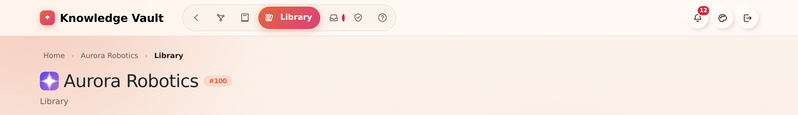
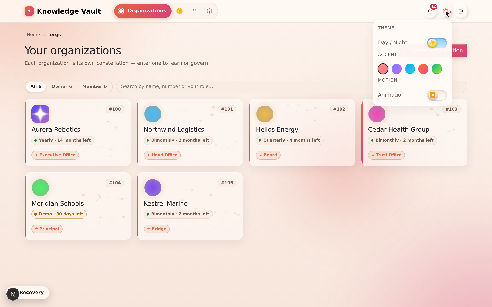

# Chapter 20 — Appearance & navigation

## What it is

Four small things you meet on every single screen: **how the platform looks**, **how you move
around it**, **the pointer you move with**, and **the hints that explain things under it**. All
of them are deliberately quiet — and the ones that are yours to set remember what you chose.

---

## Why it matters

| Parameter | What changes |
|-----------|--------------|
| **Time** | An icon-first bar keeps every destination one click away without a menu; hints answer "what does this do?" without leaving the page. |
| **Risk & compliance** | The hint on a compulsory field explains *why* it is compulsory, which is what stops people typing anything to get past it. |
| **Security & custody** | Nothing here leaves your device: the theme is a cookie on the machine you are sitting at, not a setting on your account. |
| **Cost** | Zero. But a product people find comfortable is one they open — and unused training software is the most expensive kind. |
| **Adoption** | Reduced motion, readable menus, and labels that are real text (found by *find on page*, read by screen readers) are the difference between "usable by most people" and "usable". |

---

## 1. The navigation bar

The bar across the top of every page is **icons at rest and words on contact**.

At rest each destination is a single icon, so the bar stays short even when an organization
has a dozen places to be. Hover it — or reach it with the keyboard — and the icon **widens
out into its full label**: *Constellation*, *My Learning*, *Library*, *Requests*,
*Compliance*, *Studio*.

Three things worth knowing:

- **The label is real text.** It is part of the link, not a tooltip the browser draws on its
  own schedule and not a placeholder. Screen readers read it, and your browser's *find on
  page* finds it, whether or not it is currently visible.
- **The page you are on keeps its label open.** You can always see where you are without
  touching anything.
- **Counts ride along.** A branch with requests waiting shows the number on its icon, expanded
  or not.

**Under the bar sit breadcrumbs** — *Home › Aurora Robotics › Compliance* — so you always know
which organization you are in and how you got to this page:

### The bar is deliberately unhurried

Widening a label makes the bar wider, which moves every link after it. If that happened at the
speed of an ordinary hover effect, the link you were aiming at would slide out from under your
pointer and you would click the wrong one — which is exactly what used to happen.

So the navigation bar moves on its own, slower timing:

- **It waits before it opens.** Sweeping past a link on your way somewhere else does not
  disturb the bar at all.
- **It opens gently, and does not overshoot.** No bounce, nothing that springs past its resting
  place and comes back.
- **It waits before it closes.** Slipping off the pill for an instant does not snap it shut
  under your finger.

Colour still answers instantly — you always know the moment you have reached a link. Only the
*shape* takes its time. If you have asked your device to reduce motion, none of this animates
at all.

### On a phone or a tablet

There is no hovering on a touch screen, so the bar behaves differently and honestly: the
**menu button** opens the destinations as a vertical sheet with **every label already showing**.
Nothing is hidden behind a gesture you cannot perform. The sheet is solid rather than
see-through, so the page underneath never competes with the links, and it scrolls on its own if
there are more destinations than fit.

The same menu button now serves the public pages — Home, Features, Storage, Pricing and Help —
which previously had no way to reach their navigation on a narrow screen at all.

---

## 2. Themes

The **palette button** sits beside the bell on every page.

### Day and night

The default is the warm **peach-white day theme** — the look the platform ships with, chosen
because most people read documents in daylight and a bright, low-contrast page is easier on
the eyes for long stretches. The switch flips to a full **night theme** for dark rooms and
late shifts.

### Accents

Five accent palettes change the colour of buttons, highlights and the constellation's glow:

| Accent | Feel |
|--------|------|
| **Peach** | The default — warm, low-glare. |
| **Aurora** | Violet and indigo. |
| **Ocean** | Blue and cyan. |
| **Sunset** | Orange and pink. |
| **Forest** | Green and lime. |

Day/night and accent are independent — a night theme with a Forest accent is a perfectly
ordinary choice.

### It remembers

Your choice is stored **on your device, in a cookie**, and applied *before the first frame is
painted* — so there is no flash of the wrong theme while a page loads. Sign out, close the
browser, come back next week: you get exactly the look you left.

> **Why a cookie rather than an account setting?** Because appearance is about the screen you
> are sitting at, not about you. The same person may want night mode on the laptop in the
> workshop and the day theme on the office monitor, and the platform should not argue.

### Reduced motion

If your operating system is set to reduce motion, the platform obeys: the navigation rail
stops sliding, transitions shorten, and the background animation settles.

---

---

## 3. The pointer, and the hints it carries

On a device with a real pointer, Knowledge Vault draws **its own**. It is not decoration —
it is doing a job:

| Where it is | What it becomes |
|-------------|-----------------|
| Over the page | An ink dot at rest, with a softer ring trailing it |
| Over anything clickable | An arrow with a **star** at its tip |
| While the app is fetching | An **open book turning its pages** |
| Over anything typeable | A nib |
| Over a drag handle | A hand |
| Over a disabled control | A struck ring |

It is switched off on touch devices, drops its motion if you have asked for reduced motion,
and — importantly — hides the system arrow **only while it is actually painted**. If anything
ever prevents it from drawing, the ordinary arrow comes back rather than leaving you with
neither. That includes full screen: a document or an exam given the whole screen carries the
pointer in with it.

**Hints replace the browser's tooltip.** A glass card opens beside the pointer and travels
with it: a short delay to open, instant when you move from one hint to the next, and it flips
to the other side near the edge of the screen. Keyboard focus opens it too. You can see one in
the Studio screenshot in [Chapter 11](chapter-11-editions-and-review.md), explaining what a
new edition does.

Hints are how the product answers "why is this compulsory?" wherever the question comes up —
on a classification field, on a publish button, on a storage setting.

---

## 4. The mailbox bell

Beside the palette sits the **bell** — the mailbox, covered in full in
[Chapter 16](chapter-16-the-mailbox.md). It is on every page for a reason: some of what the
platform has to tell you (an access code, a coin adjustment) has nothing to do with any one
organization, so it cannot live inside one.

---

## Tips & pitfalls

- **Learn two icons and you know the bar.** The branching mark is your constellation; the book
  is your learning. Everything else you can hover.
- **Set the theme once, on each device you use.** It is a per-device choice by design.
- **If the bar looks cramped, it isn't broken** — that is the collapsed state. Hover or tap.
- **Hover before you ask.** Most "what does this field mean?" questions are answered by
  resting the pointer on it for half a second.
- **On a projector, use the day theme.** The night theme's contrast is tuned for a screen a
  foot away, not a wall ten feet away.
- **Reduced motion is respected everywhere** — if animation makes you uncomfortable, set it
  once in your operating system and the whole product settles down.

---

## 🎬 Make a video of this

**Length:** ~90 seconds. **Working title:** *"Small things you'll touch a thousand times."*

| # | Shot | Say |
|---|------|-----|
| 1 | Slow hover along the nav bar, labels opening | "Icons at rest, words on contact — and the page you're on always shows its name." |
| 2 | Open the palette; switch to night; switch accent | "Day or night, five accents, and it's remembered on this device." |
| 3 | Reload the page — no flash of the wrong theme | "Applied before the first frame is painted." |
| 4 | Hover a compulsory field; the hint card opens | "Hints replace the browser's tooltip — and say *why*, not just *what*." |
| 5 | Phone frame: tap the menu button, the sheet slides up | "On a phone, every label shows. Nothing hides behind a gesture." |

**Script beat to close on:** *"None of this is decoration. It's the difference between a tool
people use and one they endure."*

**Next:** [Chapter 21 — Flow diagrams →](chapter-21-flow-diagrams.md)
