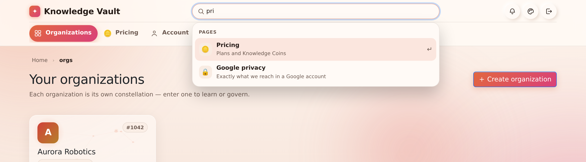
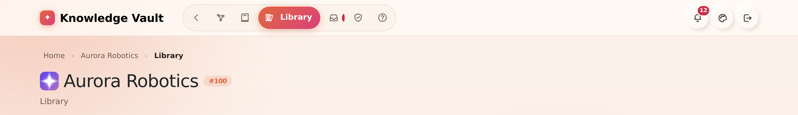
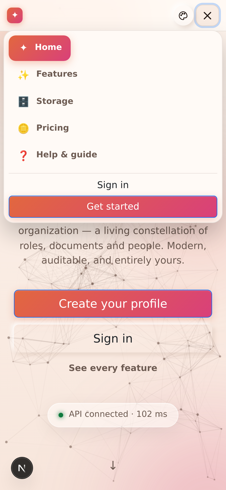
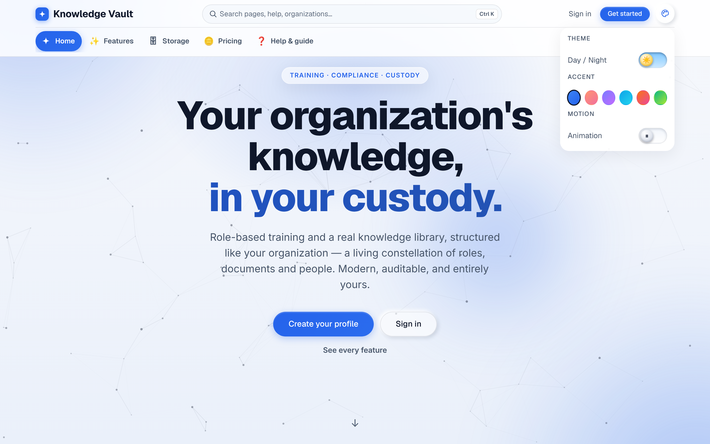

# Chapter 20 — Appearance & navigation

## What it is

Four small things you meet on every single screen: **how the platform looks**, **how you move
around it**, **the pointer you move with**, and **the hints that explain things under it**. All
of them are deliberately quiet — and the ones that are yours to set remember what you chose.

---

## Why it matters

| Parameter | What changes |
|-----------|--------------|
| **Time** | Every destination is named and one click away, and the search box reaches any page, help topic or organization in a few keystrokes; hints answer "what does this do?" without leaving the page. |
| **Risk & compliance** | The hint on a compulsory field explains *why* it is compulsory, which is what stops people typing anything to get past it. |
| **Security & custody** | Nothing here leaves your device: the theme is a cookie on the machine you are sitting at, not a setting on your account. |
| **Cost** | Zero. But a product people find comfortable is one they open — and unused training software is the most expensive kind. |
| **Adoption** | Reduced motion, readable menus, and labels that are real text (found by *find on page*, read by screen readers) are the difference between "usable by most people" and "usable". |

---

## 1. The navigation bar

The bar across the top of every page has two rows on a computer.

**The top row** holds the Knowledge Vault mark, the **search box** in the middle, and your
mailbox, the appearance palette and sign-out on the right.

**The second row** lists every destination **by name, always**: *Organizations*,
*Constellation*, *My Learning*, *Library*, *Requests*, *Compliance*, *Help* — or, on the public
pages, *Home*, *Features*, *Storage*, *Pricing* and *Help & guide*. Nothing has to be hovered to
be read, and nothing moves or changes size when you point at it; reaching a link only changes
its colour.

- **The page you are on is filled in** with your accent colour, so you can always see where
  you are.
- **Counts ride along.** A branch with requests waiting shows the number beside *Requests*.
- **The labels are real text** — screen readers read them and *find on page* finds them.

### Search

Type in the search box to jump straight to what you need. As you type it finds:

- **Pages** — *Pricing*, *Account*, *Storage*, *Found an organization*… It understands the words
  people actually use, so *price*, *plans*, *billing* or *coins* all find Pricing.
- **Help topics** — *password*, *exams*, *backup*, *dark mode*… open the right card on the Help
  page.
- **Your organizations**, by name or by number.
- **Inside an organization**, it offers to **search that organization's Library** or **your My
  Learning** for the words you typed, and takes you there with the search already filled in.

Use **↑** and **↓** to move through the results and **Enter** to open one; **Esc** clears the
box, and a second **Esc** closes it. From anywhere on a page, press **/** or **Ctrl K**
(**⌘ K** on a Mac) to jump to the search box without reaching for the mouse.

**Under the bar sit breadcrumbs** — *Home › Aurora Robotics › Compliance* — so you always know
which organization you are in and how you got to this page:

### On a phone or a tablet

A phone has no room for two rows, so the bar keeps to one: the **menu button** opens the
destinations as a vertical sheet with **every label showing**, and the **magnifier** beside it
opens the same search box as a full-width row under the bar.
Nothing is hidden behind a gesture you cannot perform. The sheet is solid rather than
see-through, so the page underneath never competes with the links, and it scrolls on its own if
there are more destinations than fit.

The same menu button now serves the public pages — Home, Features, Storage, Pricing and Help —
which previously had no way to reach their navigation on a narrow screen at all.

---

## 2. Themes

The **palette button** sits beside the bell on every page.

### Day and night

The default is the clean **white-and-blue day theme** — white pages, slate text and a calm
blue for buttons and highlights, chosen because most people read documents in daylight and a
bright, uncluttered page is easy on the eyes for long stretches. The switch flips to a full
**night theme** for dark rooms and late shifts.

### Accents

Six accent palettes change the colour of buttons, highlights and the constellation's glow:

| Accent | Feel |
|--------|------|
| **Blue** | The default — clean, calm, high-contrast. |
| **Peach** | Warm and low-glare; by day it also brings back the peach-white page. |
| **Aurora** | Violet and indigo. |
| **Ocean** | Blue and cyan. |
| **Sunset** | Orange and pink. |
| **Forest** | Green and lime. |

Day/night and accent are independent — a night theme with a Forest accent is a perfectly
ordinary choice.

### It remembers

Your choice is stored **on your device, in a cookie**, and applied *before the first frame is
painted* — so there is no flash of the wrong theme while a page loads. Sign out, close the
browser, come back next week: you get exactly the look you left.

> **Why a cookie rather than an account setting?** Because appearance is about the screen you
> are sitting at, not about you. The same person may want night mode on the laptop in the
> workshop and the day theme on the office monitor, and the platform should not argue.

### Motion

The palette menu's third section is **Motion**, with a single **Animation** switch. Turn it
off and the ambient movement stops — the drifting star field behind the page and the float on
the constellation's stars. It starts **off** and stays wherever you last set it, per device.

If your operating system is set to reduce motion, the platform obeys that too, without being
asked: transitions shorten, and the background animation
settles.

---

---

## 3. The pointer, and the hints it carries

The pointer is your **system's own cursor**, and it keeps to two shapes:

| Where it is | What it looks like |
|-------------|--------------------|
| Over the page | The ordinary **arrow** |
| Over anything clickable — a link, a button, a star in the constellation | A **hand** |

Your operating system draws it, so it moves exactly with your mouse — nothing trails behind it
and nothing about it slows the page down. A box you type into still shows the text caret, and a
drag handle shows a grabbing hand, because that is what tells you what will happen when you press.

**Hints replace the browser's tooltip.** A glass card opens beside the pointer and travels
with it: a short delay to open, instant when you move from one hint to the next, and it flips
to the other side near the edge of the screen. Keyboard focus opens it too. You can see one in
the Studio screenshot in [Chapter 11](chapter-11-editions-and-review.md), explaining what a
new edition does.

Hints are how the product answers "why is this compulsory?" wherever the question comes up —
on a classification field, on a publish button, on a storage setting.

---

## 4. The mailbox bell

Beside the palette sits the **bell** — the mailbox, covered in full in
[Chapter 16](chapter-16-the-mailbox.md). It is on every page for a reason: some of what the
platform has to tell you (an access code, a coin adjustment) has nothing to do with any one
organization, so it cannot live inside one.

---

## Tips & pitfalls

- **Lost? Search.** Press **/** and type what you are looking for — a page, a topic, an
  organization or, inside one, a course.
- **Set the theme once, on each device you use.** It is a per-device choice by design.
- **Hover before you ask.** Most "what does this field mean?" questions are answered by
  resting the pointer on it for half a second.
- **On a projector, use the day theme.** The night theme's contrast is tuned for a screen a
  foot away, not a wall ten feet away.
- **Reduced motion is respected everywhere** — if animation makes you uncomfortable, set it
  once in your operating system and the whole product settles down.

---

## 🎬 Make a video of this

**Length:** ~90 seconds. **Working title:** *"Small things you'll touch a thousand times."*

| # | Shot | Say |
|---|------|-----|
| 1 | Press `/`, type *price*, press Enter | "Every destination named, and a search box that understands what you mean." |
| 2 | Open the palette; switch to night; switch accent | "Day or night, five accents, and it's remembered on this device." |
| 3 | Reload the page — no flash of the wrong theme | "Applied before the first frame is painted." |
| 4 | Hover a compulsory field; the hint card opens | "Hints replace the browser's tooltip — and say *why*, not just *what*." |
| 5 | Phone frame: tap the menu button, the sheet slides up | "On a phone, every label shows. Nothing hides behind a gesture." |

**Script beat to close on:** *"None of this is decoration. It's the difference between a tool
people use and one they endure."*

**Next:** [Chapter 21 — Flow diagrams →](chapter-21-flow-diagrams.md)
