# Chapter 21 — Flow diagrams: every setting at a glance

This chapter is the **visual reference** for the whole platform. It pairs a **flow diagram**
with a **screenshot** for each setting, grouped into five topics:

- **A.** [What an **owner** can do](#a--owner-settings--actions) — every management setting.
- **B.** [What a **member** can have / do](#b--what-a-member-can-have--do) — the learner side.
- **C.** [**Request ↔ response** flows](#c--request--response-flows) — ask-and-approve.
- **D.** [**Plans, coins & access codes**](#d--plans-knowledge-coins--access-codes) — how an
  organization is paid for, sized and renewed.
- **E.** [**Editions, review, compliance & the session clock**](#e--editions-review-compliance--the-session-clock)
  — what happens to a document after it is published, why one person is behind, and what ends
  a session.

> The flow diagrams below are drawn with Mermaid and render automatically on GitHub. Each
> setting also links back to the chapter where it's explained in full.

---

## A — Owner settings & actions

Owners act from the **constellation**: click a star you govern to open its action panel, then
choose a section (Group configuration · People · Courses · Backup).

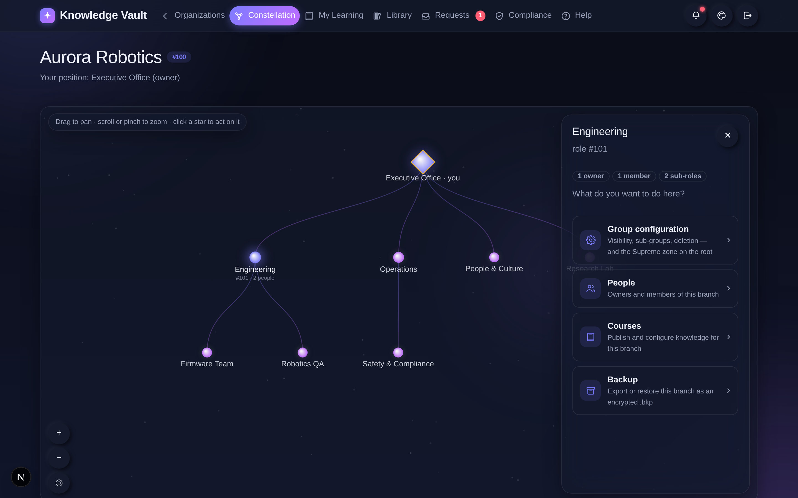

### A1 · Create a sub-role
*Where: Group configuration → + Sub-role · [Chapter 6](chapter-06-building-your-structure.md)*

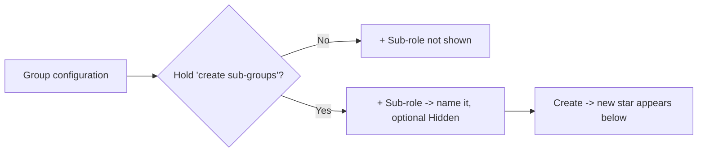
```mermaid
flowchart LR
    A["Group configuration"] --> B{"Hold 'create sub-groups'?"}
    B -->|No| X["+ Sub-role not shown"]
    B -->|Yes| C["+ Sub-role -> name it, optional Hidden"]
    C --> D["Create -> new star appears below"]
```

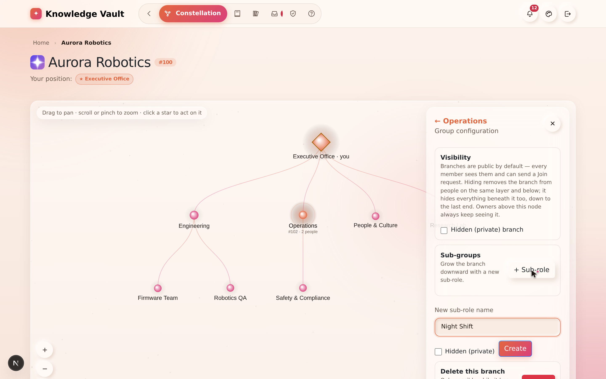

### A2 · Set visibility (public / hidden)
*Where: Group configuration → Visibility · [Chapter 6](chapter-06-building-your-structure.md)*

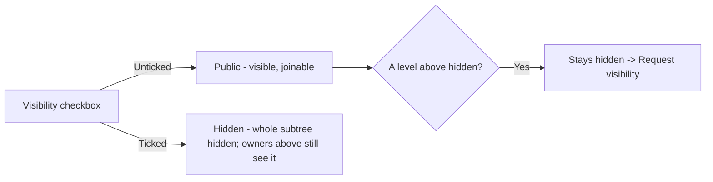
```mermaid
flowchart LR
    A["Visibility checkbox"] -->|Unticked| B["Public - visible, joinable"]
    A -->|Ticked| C["Hidden - whole subtree hidden; owners above still see it"]
    B --> D{"A level above hidden?"}
    D -->|Yes| E["Stays hidden -> Request visibility"]
```

### A3 · Delete a branch (direct or by request)
*Where: Group configuration → Delete / Request deletion · [Chapter 6](chapter-06-building-your-structure.md)*

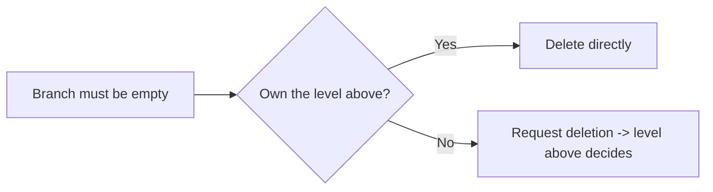
```mermaid
flowchart LR
    A["Branch must be empty"] --> B{"Own the level above?"}
    B -->|Yes| C["Delete directly"]
    B -->|No| D["Request deletion -> level above decides"]
```

### A4 · Add a person (member or co-owner)
*Where: People → + Add person · [Chapter 7](chapter-07-people-and-governance.md)*

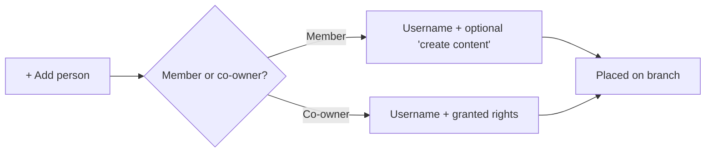
```mermaid
flowchart LR
    A["+ Add person"] --> B{"Member or co-owner?"}
    B -->|Member| C["Username + optional 'create content'"]
    B -->|Co-owner| D["Username + granted rights"]
    C --> E["Placed on branch"]
    D --> E
```

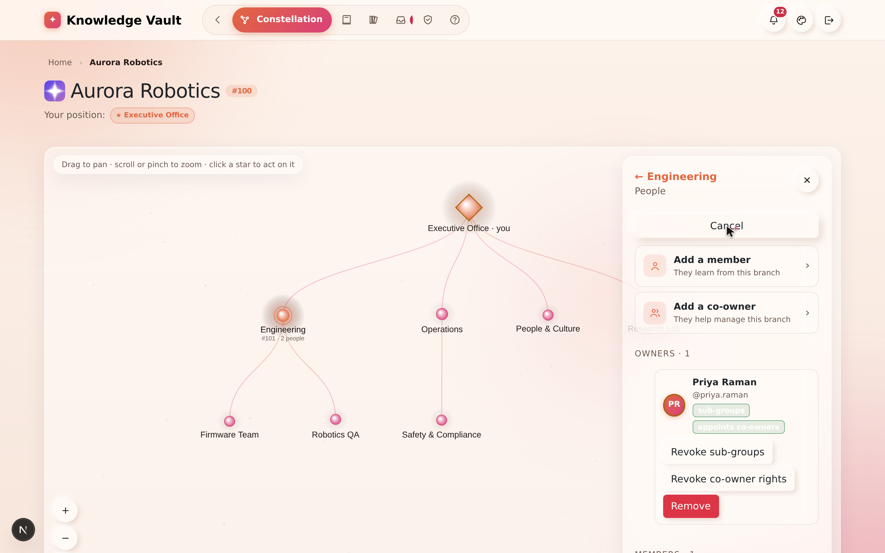

### A5 · Grant a co-owner's rights (least privilege)
*Where: People → Add a co-owner · [Chapter 7](chapter-07-people-and-governance.md)*

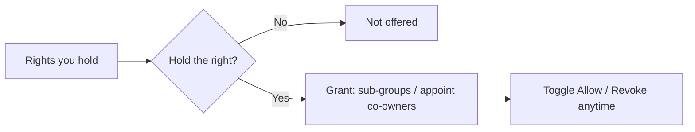
```mermaid
flowchart LR
    A["Rights you hold"] --> B{"Hold the right?"}
    B -->|No| C["Not offered"]
    B -->|Yes| D["Grant: sub-groups / appoint co-owners"]
    D --> E["Toggle Allow / Revoke anytime"]
```

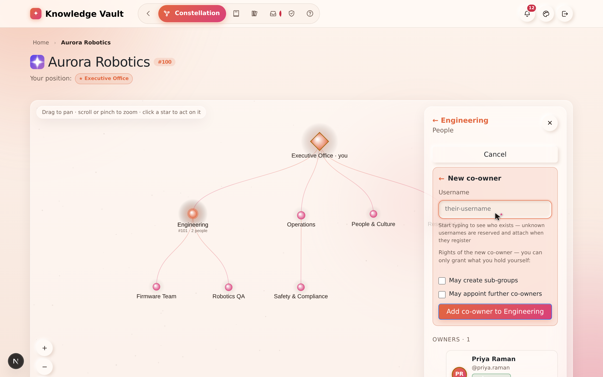

### A6 · Grant a member the "create content" right
*Where: People → Add a member · [Chapter 7](chapter-07-people-and-governance.md) & [Chapter 11](chapter-11-editions-and-review.md)*

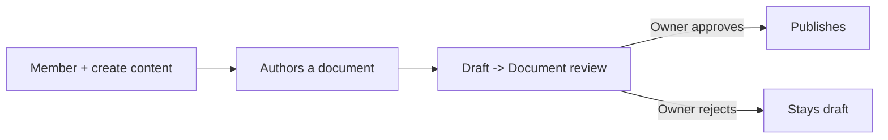
```mermaid
flowchart LR
    A["Member + create content"] --> B["Authors a document"]
    B --> C["Draft -> Document review"]
    C -->|Owner approves| D["Publishes"]
    C -->|Owner rejects| E["Stays draft"]
```

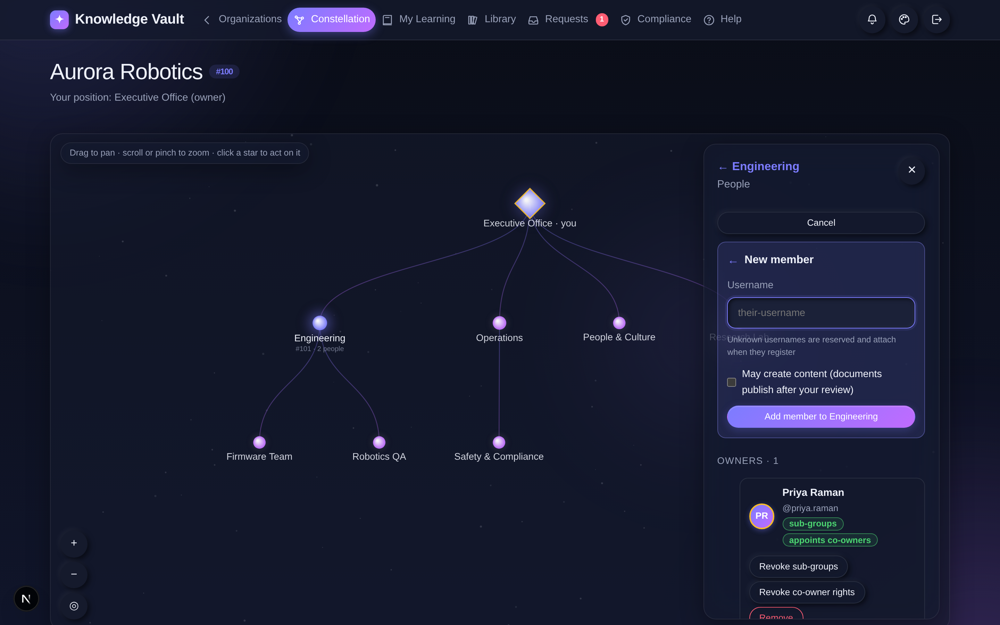

### A7 · Publish a course
*Where: Courses → + Upload course / Create in Studio · [Chapter 8](chapter-08-courses.md)*

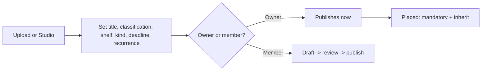
```mermaid
flowchart LR
    A["Upload or Studio"] --> B["Set title, classification, shelf, kind, deadline, recurrence"]
    B --> C{"Owner or member?"}
    C -->|Owner| D["Publishes now"]
    C -->|Member| E["Draft -> review -> publish"]
    D --> F["Placed: mandatory + inherit"]
```

### A8 · Configure a placed course
*Where: Courses → per-course controls · [Chapter 8](chapter-08-courses.md)*

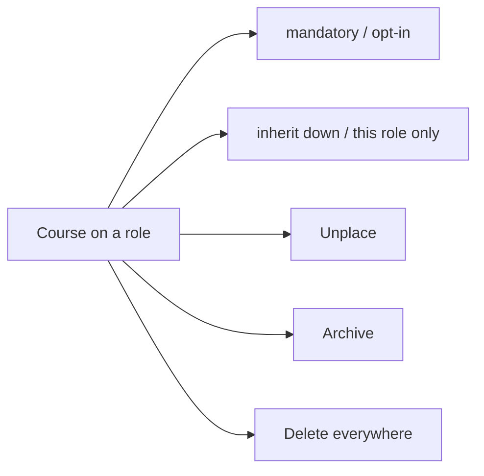
```mermaid
flowchart LR
    A["Course on a role"] --> B["mandatory / opt-in"]
    A --> C["inherit down / this role only"]
    A --> D["Unplace"]
    A --> E["Archive"]
    A --> F["Delete everywhere"]
```

### A9 · Back up / restore a branch (`.bkp`)
*Where: Backup section · [Chapter 18](chapter-18-supreme-and-custody.md)*

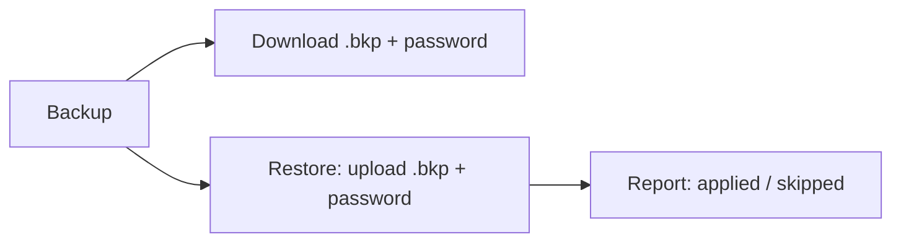
```mermaid
flowchart LR
    A["Backup"] --> B["Download .bkp + password"]
    A --> C["Restore: upload .bkp + password"]
    C --> D["Report: applied / skipped"]
```

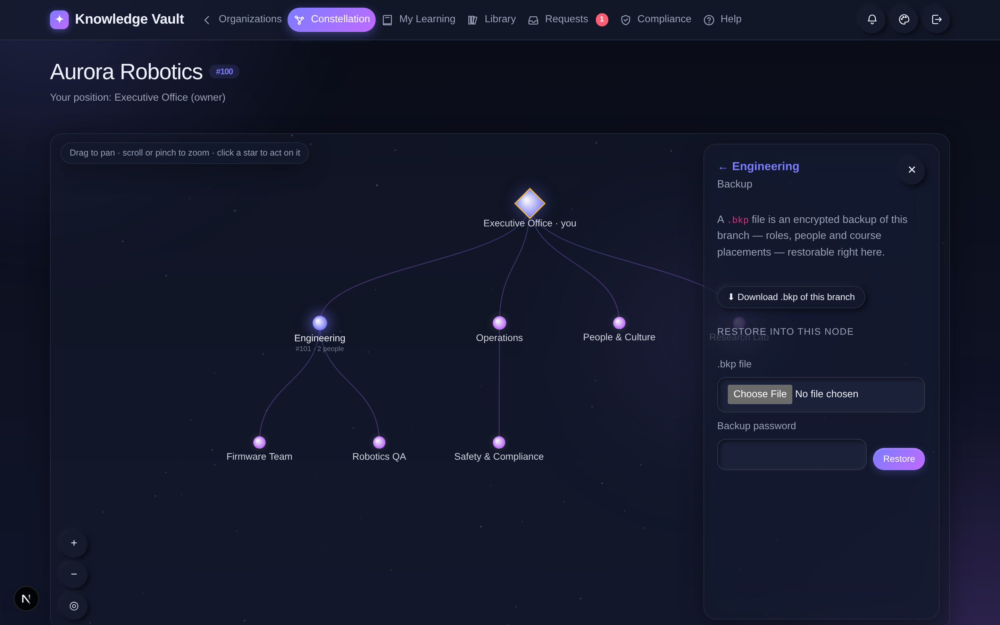

### A10 · The Supreme zone (root only)
*Where: root → Group configuration → Supreme zone · [Chapter 18](chapter-18-supreme-and-custody.md)*

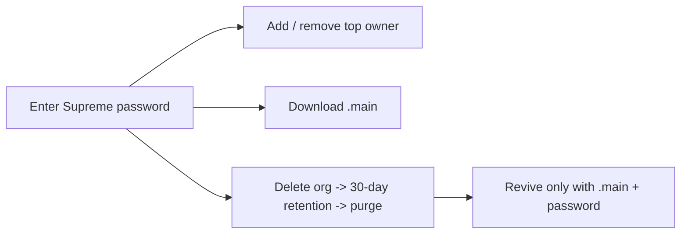
```mermaid
flowchart LR
    A["Enter Supreme password"] --> B["Add / remove top owner"]
    A --> C["Download .main"]
    A --> D["Delete org -> 30-day retention -> purge"]
    D --> E["Revive only with .main + password"]
```

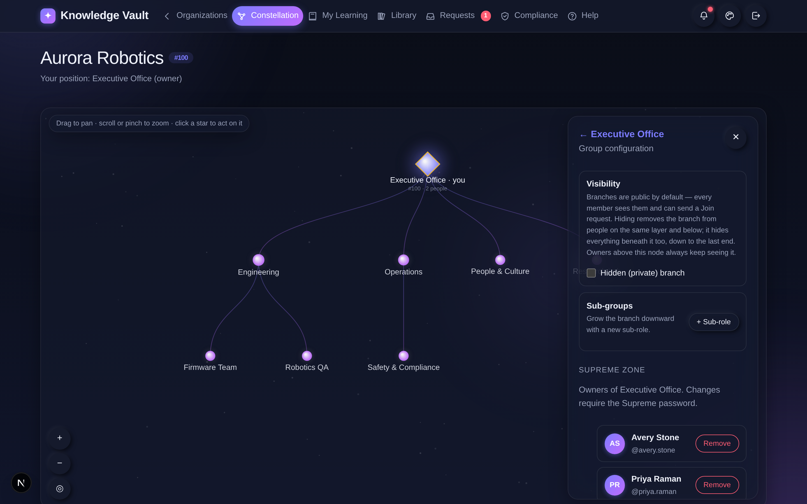

---

## B — What a member can have / do

A member *learns* from the branches they're placed on. Everything assigned to them gathers in
**My Learning**.

### B1 · Complete assigned courses
*Where: My Learning · [Chapter 13](chapter-13-my-learning.md)*

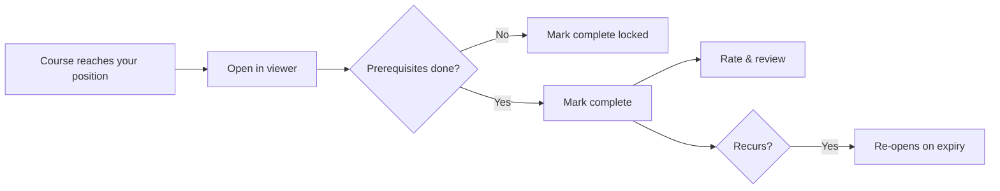
```mermaid
flowchart LR
    A["Course reaches your position"] --> B["Open in viewer"]
    B --> C{"Prerequisites done?"}
    C -->|No| D["Mark complete locked"]
    C -->|Yes| E["Mark complete"]
    E --> F["Rate & review"]
    E --> G{"Recurs?"}
    G -->|Yes| H["Re-opens on expiry"]
```

### B2 · Read in the reader
*Where: My Learning / Library → Open · [Chapter 13](chapter-13-my-learning.md)*

The viewer opens every document in the organization's standard frame (cover, classification,
version, author) — never in a second tab.

### B3 · Propose content (if granted)
*Where: Studio → Propose a document · [Chapter 9](chapter-09-the-studio.md)*

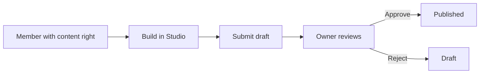
```mermaid
flowchart LR
    A["Member with content right"] --> B["Build in Studio"]
    B --> C["Submit draft"]
    C --> D["Owner reviews"]
    D -->|Approve| E["Published"]
    D -->|Reject| F["Draft"]
```

### B4 · Ask to join a public branch
*Where: click a public star → Send Join request · [Chapter 14](chapter-14-requests.md)*

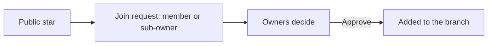
```mermaid
flowchart LR
    A["Public star"] --> B["Join request: member or sub-owner"]
    B --> C["Owners decide"]
    C -->|Approve| D["Added to the branch"]
```

### Member capability map

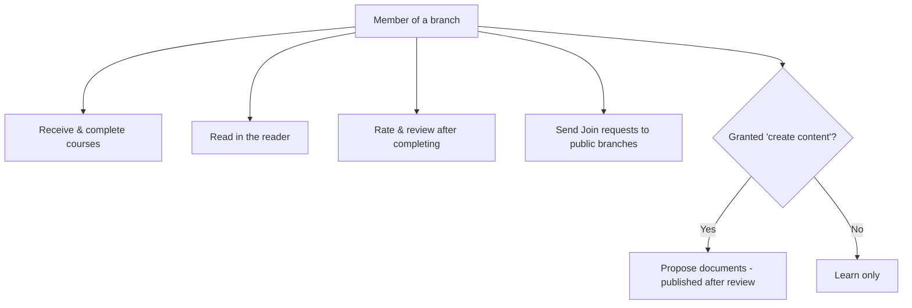
```mermaid
flowchart TD
    M["Member of a branch"] --> L["Receive & complete courses"]
    M --> V["Read in the reader"]
    M --> R["Rate & review after completing"]
    M --> J["Send Join requests to public branches"]
    M --> P{"Granted 'create content'?"}
    P -->|Yes| PC["Propose documents - published after review"]
    P -->|No| PN["Learn only"]
```

---

## C — Request ↔ response flows

Requests route sensitive actions to whoever has the authority. Deciders act from the
**Requests inbox**; everyone is kept informed by **notifications**.

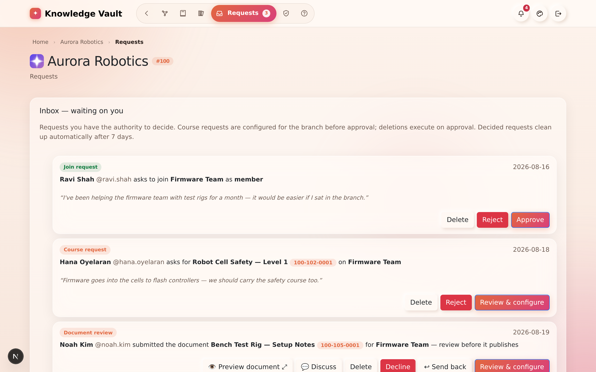

### C0 · The lifecycle every request shares

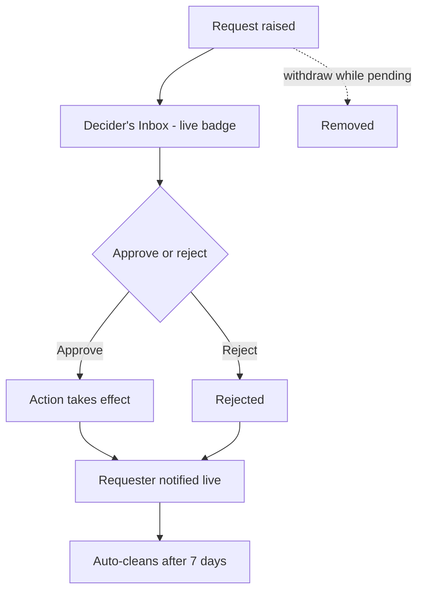
```mermaid
flowchart TD
    A["Request raised"] --> B["Decider's Inbox - live badge"]
    B --> C{"Approve or reject"}
    C -->|Approve| D["Action takes effect"]
    C -->|Reject| E["Rejected"]
    D --> F["Requester notified live"]
    E --> F
    F --> G["Auto-cleans after 7 days"]
    A -. withdraw while pending .-> H["Removed"]
```

### C1 · Course request

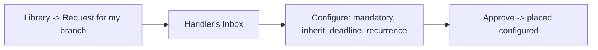
```mermaid
flowchart LR
    A["Library -> Request for my branch"] --> B["Handler's Inbox"]
    B --> C["Configure: mandatory, inherit, deadline, recurrence"]
    C --> D["Approve -> placed configured"]
```

### C2 · Join request

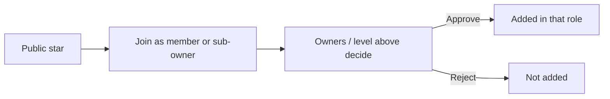
```mermaid
flowchart LR
    A["Public star"] --> B["Join as member or sub-owner"]
    B --> C["Owners / level above decide"]
    C -->|Approve| D["Added in that role"]
    C -->|Reject| E["Not added"]
```

### C3 · Deletion request

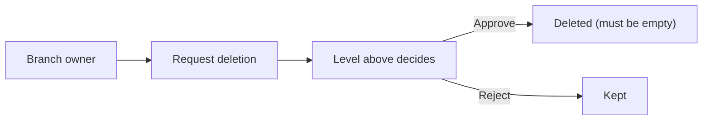
```mermaid
flowchart LR
    A["Branch owner"] --> B["Request deletion"]
    B --> C["Level above decides"]
    C -->|Approve| D["Deleted (must be empty)"]
    C -->|Reject| E["Kept"]
```

### C4 · Visibility request

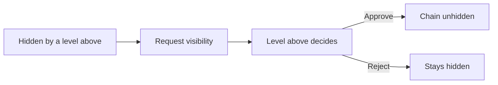
```mermaid
flowchart LR
    A["Hidden by a level above"] --> B["Request visibility"]
    B --> C["Level above decides"]
    C -->|Approve| D["Chain unhidden"]
    C -->|Reject| E["Stays hidden"]
```

### C5 · How you hear about it — notifications

Every request, decision, assignment and reminder arrives as a **live, clickable
notification** that deep-links to the exact item.

---

## D — Plans, Knowledge Coins & access codes

Every organization runs on a **plan**, bought with **Knowledge Coins** and unlocked with a
one-time **access code**. Full detail in [Chapter 17](chapter-17-plans-and-access.md); the
staff side is the **Super Admin Guide Book** (a separate book, held by the Knowledge Base team).

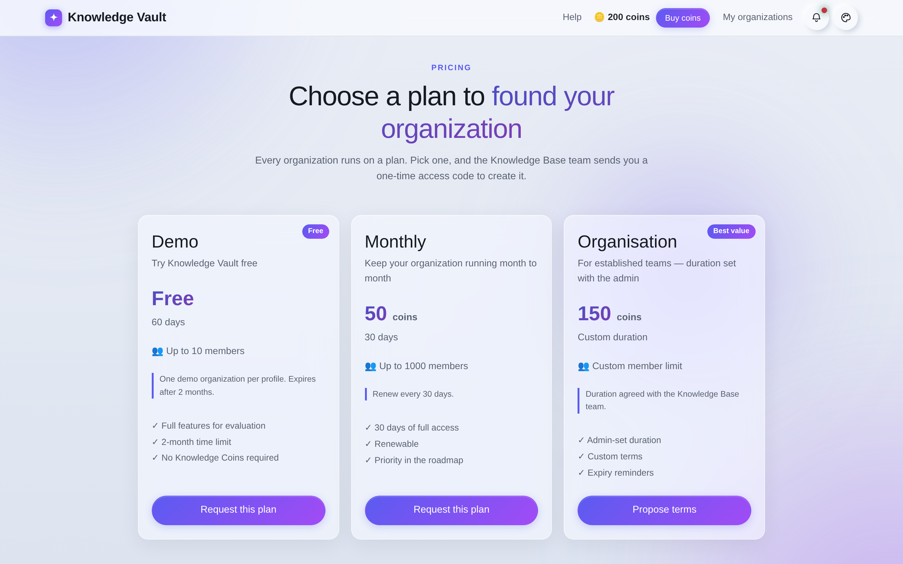

### D1 · Choose a plan and get an access code
*Where: Pricing → Request this plan / Propose terms · [Chapter 17](chapter-17-plans-and-access.md)*

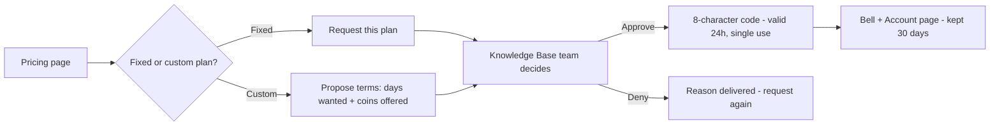
```mermaid
flowchart LR
    A["Pricing page"] --> B{"Fixed or custom plan?"}
    B -->|Fixed| C["Request this plan"]
    B -->|Custom| D["Propose terms: days wanted + coins offered"]
    C --> E["Knowledge Base team decides"]
    D --> E
    E -->|Approve| F["8-character code - valid 24h, single use"]
    E -->|Deny| G["Reason delivered - request again"]
    F --> H["Bell + Account page - kept 30 days"]
```

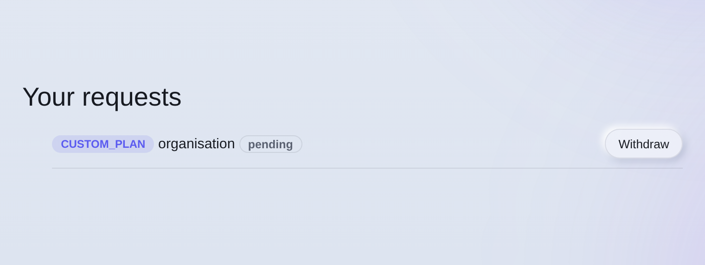

### D2 · Create the organization with the code
*Where: Create organization · [Chapter 3](chapter-03-founding-an-organization.md)*

```mermaid
flowchart LR
    A["Paste access code + org details"] --> B{"Code valid and unexpired?"}
    B -->|No| C["Refused - request a new code"]
    B -->|Yes| D{"Enough Knowledge Coins?"}
    D -->|No| E["Refused - shows cost vs balance"]
    D -->|Yes| F["Coins deducted - code marked used"]
    F --> G["Organization created - plan countdown starts"]
```

### D3 · Knowledge Coins — where they come from and go
*Where: Pricing (balance) · Buy coins · [Chapter 17](chapter-17-plans-and-access.md)*

```mermaid
flowchart TD
    A["Register - 150 coins granted"] --> W["Your wallet"]
    G["Knowledge Base gift or adjustment"] --> W
    P["Buy coins - coming soon"] -.-> W
    W --> S{"Redeem an access code"}
    S -->|Free plan| F["50 coins deducted"]
    S -->|Paid plan| D["Plan price deducted - logged in the ledger"]
```

### D4 · How many people a plan allows
*Where: People → + Add person · [Chapter 7](chapter-07-people-and-governance.md)*

```mermaid
flowchart LR
    A["Add a person / approve a Join request"] --> B{"Already in this organization?"}
    B -->|Yes| C["Placed on the role - no seat used"]
    B -->|No| D{"Members below the plan limit?"}
    D -->|Yes| E["Added - seat used"]
    D -->|No| F["Refused: upgrade the plan to add more"]
```

### D5 · Expiry and restoring
*Where: the plan chip on each organization card · [Chapter 17](chapter-17-plans-and-access.md)*

```mermaid
flowchart TD
    A["Plan countdown"] -->|More than 3 days| B["Normal chip"]
    A -->|Under 3 days| C["Red chip - upgrade soon"]
    A -->|Lapsed| D["expired - upgrade to keep it"]
    D --> E{"Organization deleted and being restored?"}
    E -->|Plan active and unexpired| F["Restores directly"]
    E -->|Demo, expired or legacy file| G["Blocked - choose a plan on Pricing"]
    G --> H["Restore code -> restore on the new plan"]
```

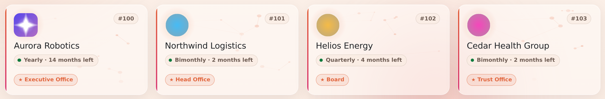

### D6 · The staff side

Everything that happens on the Knowledge Base team's side of a plan request — the requests
inbox, approvals, access codes, coins, and the organizations console — lives in the separate
**Super Admin Guide Book**, held by that team. From your side, the whole interaction is:
send the request on the Pricing page, then read the answer in your mailbox.

```mermaid
flowchart LR
    A["You: choose a plan on Pricing"] --> B["Request filed"]
    B --> C["Knowledge Base team decides"]
    C --> D["Answer lands in your mailbox"]
    D --> E["New organization: redeem the code"]
    D --> F["Existing organization: the upgrade is already applied"]
```

---

## E — Editions, review, compliance & the session clock

### E1 · Revising something already published
*Where: Courses → ⏸ Take out of deployment → ✎ Revise · [Chapter 11](chapter-11-editions-and-review.md)*

```mermaid
flowchart LR
    A["v1.0 live on its branches"] --> B["Take out of deployment"]
    B --> C["Revise in the Studio, or replace the file"]
    C --> D["Publish v2.0 with a note"]
    D --> E["Back in deployment - same placements"]
    D --> F{"Updates reset completion?"}
    F -->|Yes| G["Old completions expire - people re-read"]
    F -->|No| H["Completions stand"]
```

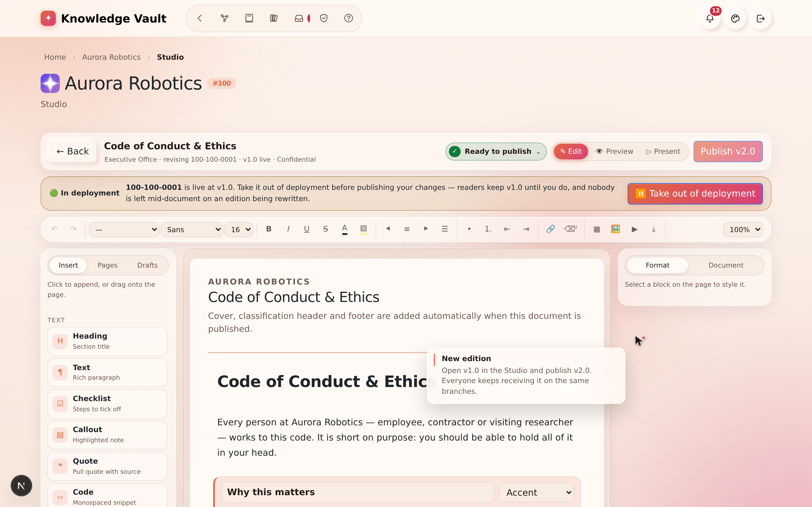

### E2 · Replacing one document with another
*Where: publish form → Replaces · [Chapter 11](chapter-11-editions-and-review.md)*

```mermaid
flowchart TD
    A["Publish a new document"] --> B{"Replaces an existing one?"}
    B -->|No| C["It simply exists"]
    B -->|Coexist| D["Both stay live"]
    B -->|Supersede| E["Old one retired and archived"]
    E --> F["New one inherits every placement, on the same terms"]
    E --> G["Old code still resolves - forwards to the new one"]
    E --> H["Everyone who completed the old one is told"]
```

### E3 · A member's document, reviewed
*Where: Requests → Document review · [Chapter 11](chapter-11-editions-and-review.md)*

```mermaid
flowchart TD
    A["Member with 'create content' writes a document"] --> B["Draft + review filed"]
    B --> C["Reviewer previews it full screen"]
    C --> D{"Decision"}
    D -->|Approve and publish| E["Placed, classified, in the library"]
    D -->|Send back with changes| F["Draft survives - thread opens"]
    F --> G["Author revises and resubmits"]
    G --> C
    D -->|Decline| H["Proposal discarded"]
```

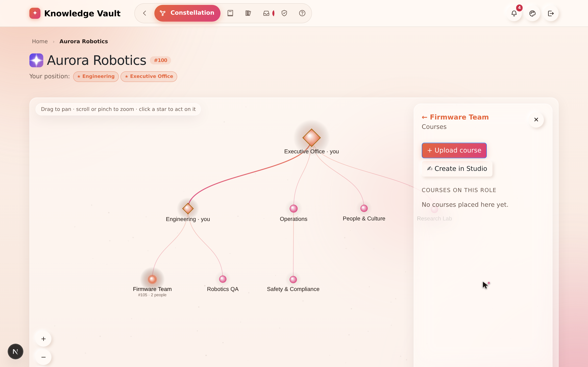

### E4 · Why one person is not compliant
*Where: Compliance → Look up a person · [Chapter 15](chapter-15-compliance.md)*

```mermaid
flowchart TD
    A["Look up a person"] --> B["Every course that reaches them"]
    B --> C{"Status"}
    C -->|Compliant| D["Completed and still valid"]
    C -->|Has not opened it| E["Assigned, untouched"]
    C -->|Expired| F["Recurring completion lapsed - new cycle open"]
    C -->|Attempts spent| G["Exam locked - a manager can reset it"]
    B --> H{"Overdue?"}
    H -->|"Deadline measured from placement or joining, whichever is later"| I["Only genuinely late people are flagged"]
```

### E5 · The session clock
*Where: everywhere · [Chapter 19](chapter-19-sessions-and-security.md)*

```mermaid
flowchart TD
    A["Signed in"] --> B["Click, key, scroll, touch, or a page opened"]
    B --> C["Deadline moves an hour ahead"]
    C --> D{"An hour with nothing from the person?"}
    D -->|No| B
    D -->|Last minute| E["Still there? card counts down"]
    E -->|Stay signed in| B
    E -->|Nothing| F["Session ends - every token revoked"]
    F --> G["All tabs sign out with the same reason"]
```

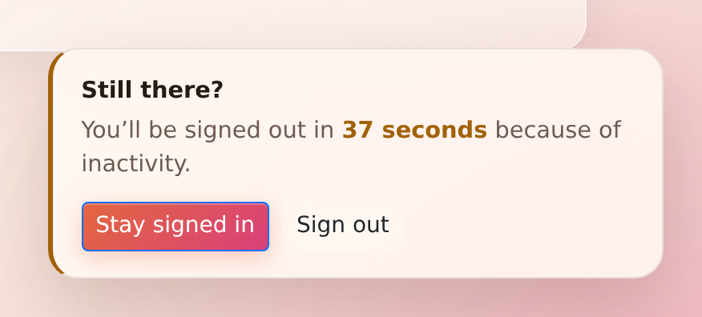

### E6 · Finding an organization on the dashboard
*Where: Organizations · [Chapter 4](chapter-04-your-organizations.md)*

```mermaid
flowchart LR
    A["Organizations"] --> B{"More than five?"}
    B -->|No| C["Just the cards"]
    B -->|Yes| D["Filter bar: All / Owner / Member"]
    D --> E["Search: name, number, or your own role names"]
    A --> F["Recovery, bottom-left: deleted orgs and .main revival"]
```

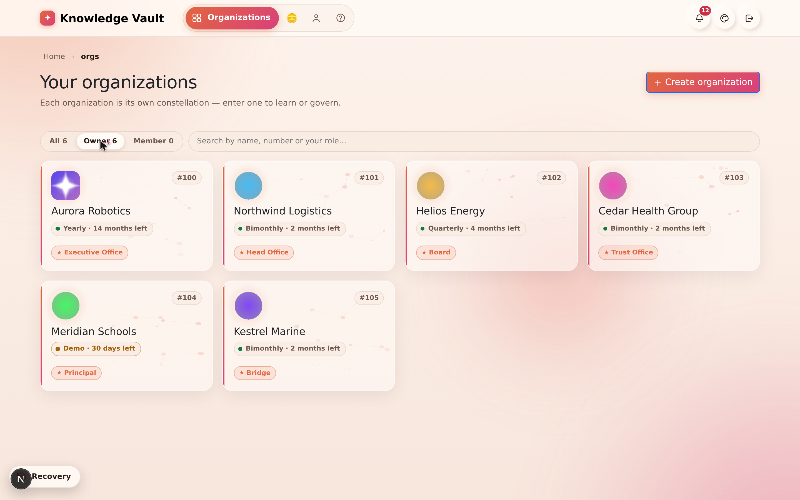

---

## Master index — setting → where → screenshot

| Setting | Who | Chapter | Screenshot |
|---------|-----|---------|-----------|
| Find one organization among many | Anyone | 4 | `organizations-filter.png` |
| Change the organization's logo | Root owner | 6 | `org-logo-editor.png` |
| Create a sub-role | Owner | 6 | `sub-role-form.png` |
| Set visibility (public/hidden) | Owner | 6 | `group-configuration.png` |
| Delete / request branch deletion | Owner | 6 | `group-configuration.png` |
| Add a person (member/co-owner) | Owner | 7 | `add-person-choose.png` |
| Grant co-owner rights | Owner | 7 | `add-coowner-form.png` |
| Grant member "create content" | Owner | 7 | `add-member-form.png` |
| Publish a course | Owner | 8 | `upload-course-form.png` |
| Configure placement (mandatory/inherit/archive) | Owner | 8 | `courses-panel.png` |
| Build a document in the Studio | Owner | 9 | `studio.png` |
| Build an exam & set its attempt limit | Owner | 10 | `studio-exam-builder.png` |
| Sit an exam | Member | 10 | `exam-runner.png` |
| Revise something already published | Owner | 11 | `studio-revise.png` |
| Read the edition log | Anyone | 11 | `course-properties.png` |
| Edit properties without a new edition | Owner | 11 | `course-properties.png` |
| Review a member's document | Manager | 11 | `review-channel.png` |
| Browse and filter the library | Anyone | 12 | `library.png` |
| Complete assigned courses | Member | 13 | `my-learning.png` |
| Read, and set the reading size | Member | 13 | `reader-zoom.png` |
| Send a join request | Member | 14 | `requests.png` |
| Decide a request (inbox) | Decider | 14 | `requests.png` |
| See why someone is not compliant | Manager | 15 | `compliance-course.png` |
| Check one person's whole picture | Manager | 15 | `compliance-person-card.png` |
| Reset a candidate's exam attempts | Manager | 15 | `compliance-exam-lock.png` |
| Read the Mailbox | Everyone | 16 | `notifications.png` |
| Choose a plan / see your coin balance | Anyone | 17 | `pricing-page.png` |
| Track a plan request | Anyone | 17 | `pricing-my-requests.png` |
| Upgrade an existing organization | Owner | 17 | `pricing-upgrade-compare.png` |
| Read your access code | Anyone | 17 | `account-admin-messages.png` |
| Create an org with a code | Founder | 17 | `create-organization.png` |
| Read the plan chip | Owner | 17 | `org-plan-timer.png` |
| Buy coins (coming soon) | Anyone | 17 | `buy-coins-coming-soon.png` |
| Back up / restore a branch (`.bkp`) | Owner | 18 | `backup-panel.png` |
| Supreme zone (owners, `.main`, delete) | Top owner | 18 | `supreme-zone.png` |
| Restore a deleted organization (Recovery) | Founder | 18 | `recovery-dock.png` |
| Revive from a `.main` file (Recovery) | Founder | 18 | `recovery-dock.png` |
| Understand why you were signed out | Everyone | 19 | `session-idle-card.png` |
| Change theme & accent | Everyone | 20 | `theme-menu.png` |
| Choose where documents are stored | Founder | 23 | `create-organization-storage.png` |

---

**Next:** [Chapter 22 — Help & support →](chapter-22-help-and-support.md) ·
**Back to:** [Table of contents](README.md) · **Reference:**
[Appendix — Glossary & quick reference](appendix-glossary-and-reference.md)
