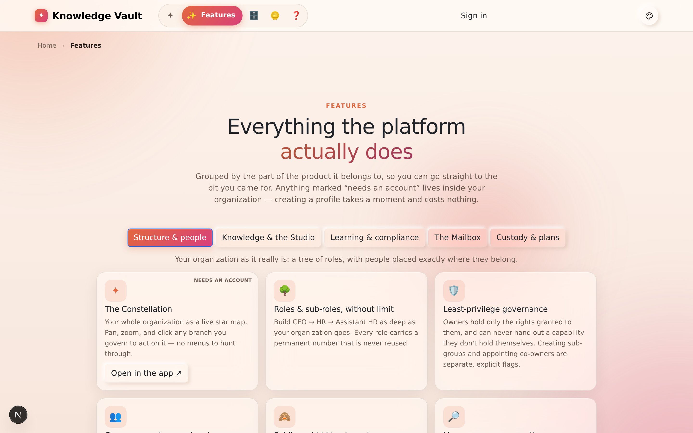

# Chapter 22 — Help & support

## What it is

Knowledge Vault includes a built-in **Help** page — a plain-language guide to every part of
the platform. It's **public**, so both prospective and signed-in users can read it, and it's
linked from the app sidebar so it's always a click away.

Open it from the **Help** link in the navigation (available on the landing page and inside
the app).

---

## Why it matters

| Parameter | What changes |
|-----------|--------------|
| **Time** | The answer is one click from wherever the question came up, and it is always the version of the answer that matches the running app. |
| **Risk & compliance** | The Help page serves the current PDF of this book, so an auditor or a new manager can be given the whole documented product rather than a summary. |
| **Security & custody** | It is public and needs no account, so nobody has to be given access to a system in order to read about it first. |
| **Cost** | Self-service documentation is the cheapest support channel there is, and this one ships with the product. |
| **Adoption** | Newcomers can read the tour before their profile exists, which shortens the first day considerably. |

---

## What Help covers

The page walks through each component of the platform in short, friendly topics, including:

- **Profile & signing in** — your one global username-and-password identity, and how admins
  add you by username.
- **Organizations & the Supreme** — what an organization is, and the Supreme password that
  protects its root.
- **The constellation, roles and people** — how the tree works and how positions are placed.
- **Courses, the library and learning** — publishing, browsing and completing knowledge.
- **Requests, compliance and notifications** — the day-to-day flows for managers and
  learners.

Each topic is written for people, not engineers — no setup or code, just how to use the
product.

---

There is also a public **Features** page — the same material as a tour rather than a manual,
useful for showing someone what the platform does before they have an account:

---

## Where to look when you're stuck

| If you want to… | Go to… |
|-----------------|--------|
| Understand a term | The [Appendix glossary](appendix-glossary-and-reference.md), or in-app Help |
| Change your name or picture | **Account** ([Chapter 1](chapter-01-getting-started.md)) |
| Find one organization among many | **Organizations** ([Chapter 4](chapter-04-your-organizations.md)) |
| See what you must complete | **My Learning** ([Chapter 13](chapter-13-my-learning.md)) |
| Add a person or role | The constellation → **People / Group configuration** ([Chapters 6–7](chapter-06-building-your-structure.md)) |
| Publish a course | A role's **Courses** panel, or the **Studio** ([Chapters 8–9](chapter-08-courses.md)) |
| Revise something already published | **Courses → ✎ Revise** ([Chapter 11](chapter-11-editions-and-review.md)) |
| Find an existing document | The **Library** ([Chapter 12](chapter-12-the-library.md)) |
| Approve something | **Requests**, or the **bell** ([Chapters 14](chapter-14-requests.md) and [16](chapter-16-the-mailbox.md)) |
| Check who's trained | **Compliance** ([Chapter 15](chapter-15-compliance.md)) |
| Check one person | **Compliance → Look up a person** ([Chapter 15](chapter-15-compliance.md)) |
| Understand why you were signed out | [Chapter 19](chapter-19-sessions-and-security.md) |
| Back up or recover your org | The **Supreme zone** and **Backup** ([Chapter 18](chapter-18-supreme-and-custody.md)) |
| Know where the files are stored | **Storage** ([Chapter 23](chapter-23-where-your-documents-live.md)) |

---

## Tips & pitfalls

- **Bookmark the Help page** — it's the fastest in-product reference and it's always current
  with the live app.
- **Share Help with newcomers** before their first sign-in — because it's public, they can
  read it while their profile is being set up.
- **This guide book goes deeper.** Help is the quick tour; the chapters here are the full
  walkthrough with real screenshots.
- **The Help page serves this book.** The current PDF and a single-file Markdown copy are both
  downloadable from it, so a colleague without an account can still read the whole thing.

---

## 🎬 Make a video of this

**Length:** ~60 seconds. **Working title:** *"Where the answers live."*

| # | Shot | Say |
|---|------|-----|
| 1 | The Help link in the navigation, on a signed-out page | "Public, so you can read it before you have an account." |
| 2 | Scroll the topics | "Every part of the product, in plain language." |
| 3 | The guide-book download buttons | "And the whole guide book — this book — as a PDF or a single Markdown file." |
| 4 | Cut to the Features page | "If you want the tour rather than the manual, that's next door." |

**Script beat to close on:** *"Two pages, no login, always current with the running app."*

**Next:** [Chapter 23 — Where your documents live →](chapter-23-where-your-documents-live.md)
