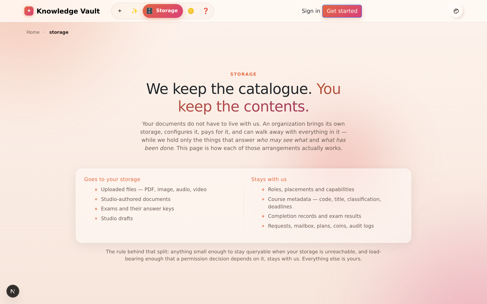
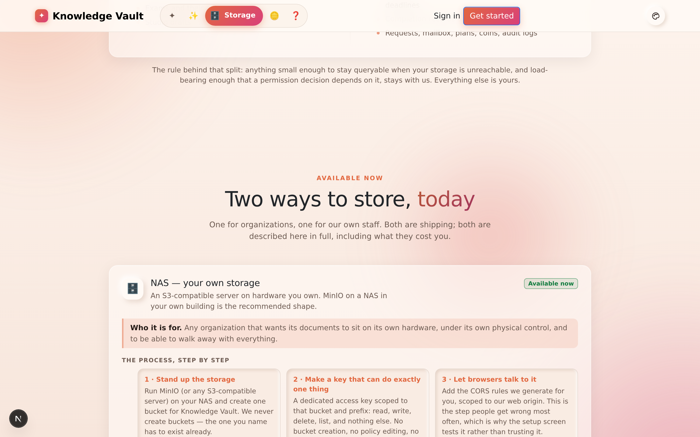
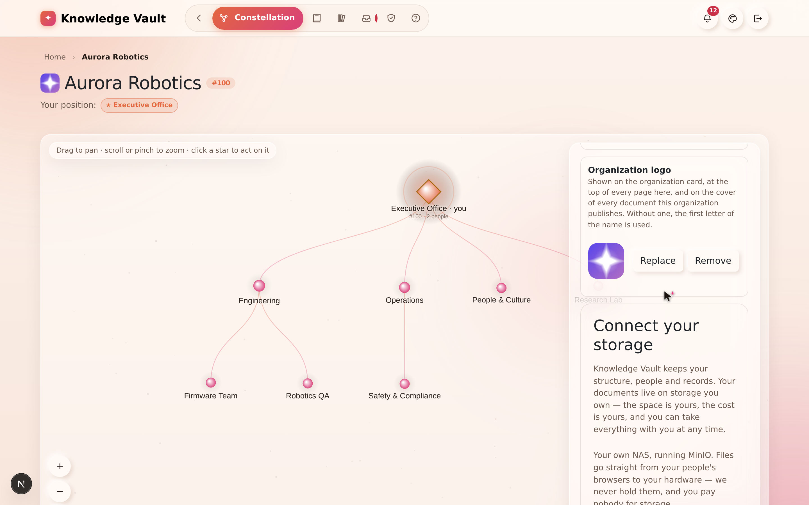
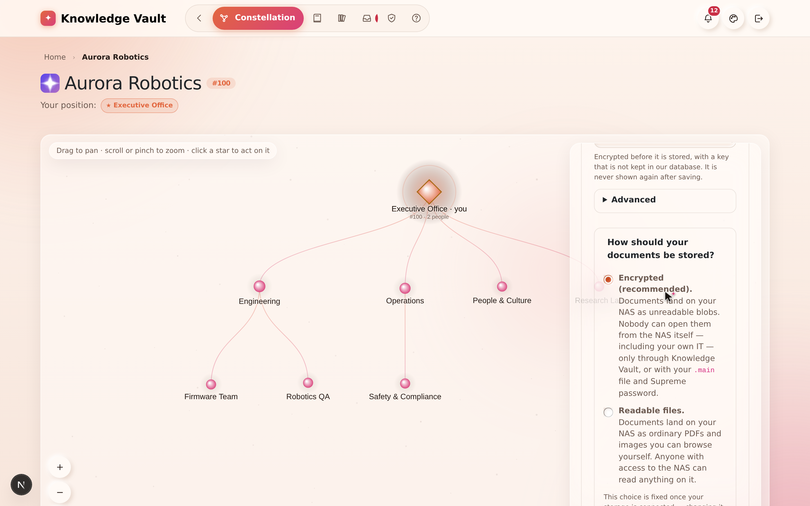
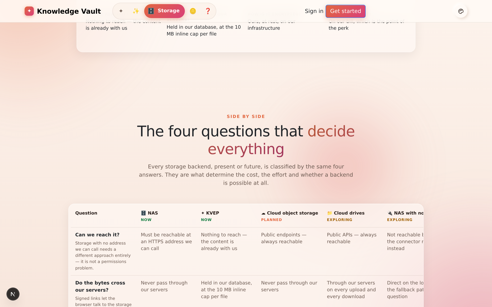
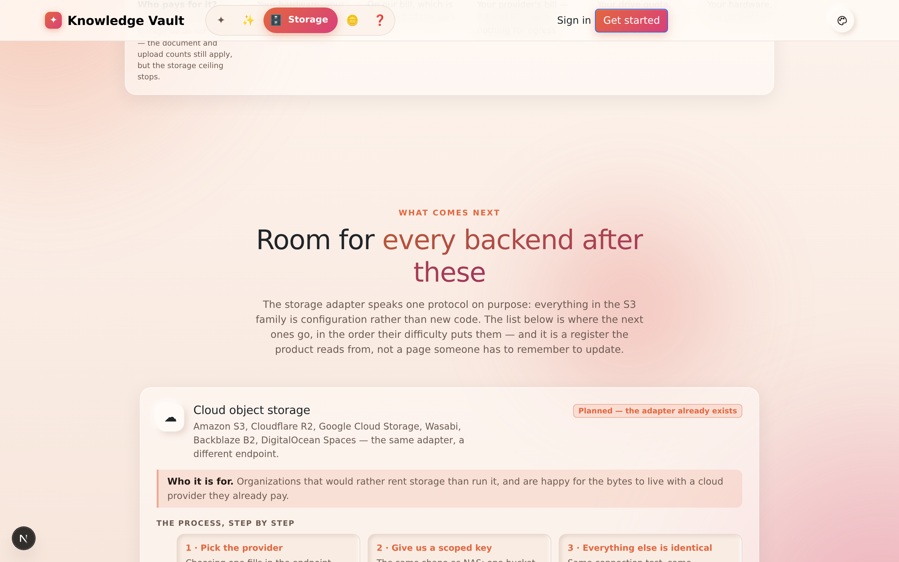
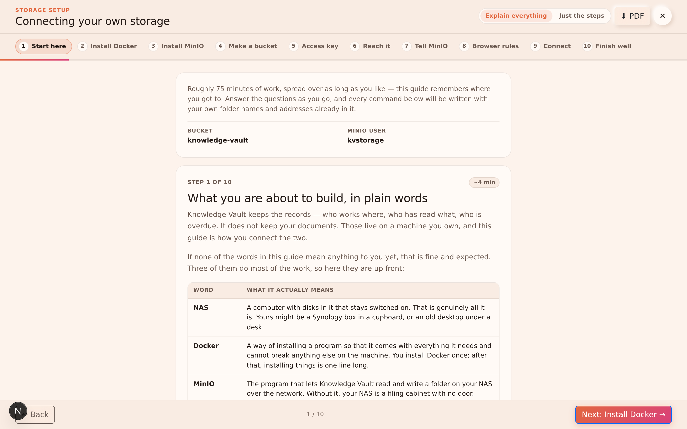

# Chapter 23 — Where your documents live

## What it is

Your organization's documents do not have to live with us. **We keep the catalogue; you keep
the contents.** You bring storage, you configure it, you pay for it, and you can walk away with
everything in it at any time — while Knowledge Vault holds only the things that answer *who may
see what* and *what has been done*.

There is a page for all of this on the public site: **Storage**, in the navigation bar and in
the footer of every page.

---

## Why it matters

| Parameter | What changes |
|-----------|--------------|
| **Time** | A NAS is connected once, in the creation form, and tested on the spot. Nothing about storage comes back to bother you afterwards. |
| **Risk & compliance** | You can say exactly where your documents are, on which hardware, in which building — the answer a data-protection questionnaire actually asks for. |
| **Security & custody** | Encrypted at rest with a key we hold separately from the data, and unreadable from the storage itself. If you leave, you leave with the files. |
| **Cost** | Disk is cheap when it's yours. The plan pays for the platform, not for your gigabytes. |
| **Adoption** | An unreachable NAS degrades honestly: people still sign in, still see their structure, still see what they've completed. Only opening and uploading documents wait. |

---

## 1. The dividing line

| Goes to your storage | Stays with us |
|----------------------|---------------|
| Uploaded files — PDF, image, audio, video | Roles, placements and capabilities |
| Studio-authored documents | Course metadata — code, title, classification, deadlines |
| Exams and their answer keys | Completion records and exam results |
| Studio drafts | Requests, mailbox, plans, coins, audit logs |

The rule behind the split: anything small enough to stay **queryable when your storage is
unreachable**, and load-bearing enough that a permission decision depends on it, stays with us.
Everything else is yours.

That is also why an unreachable NAS is an inconvenience rather than a catastrophe. Your people
can still sign in, still see their structure, still see what they have completed and what is
overdue. What they cannot do is open or upload a document until the storage comes back.

---

## 2. The two ways to store, today

### NAS — your own storage

An **S3-compatible server on hardware you own**. MinIO running on a NAS in your own building is
the recommended shape, and the one the setup guide walks through.

The process, in the order it actually happens:

1. **Stand up the storage.** Run MinIO (or any S3-compatible server) and create one bucket for
   Knowledge Vault. We never create buckets — the one you name has to exist already.
2. **Make a key that can do exactly one thing.** A dedicated access key scoped to that bucket
   and prefix: read, write, delete, list, and nothing else.
3. **Let browsers talk to it.** Add the CORS rules we generate for you, scoped to our web
   origin. This is the step people get wrong most often, which is why the setup screen *tests*
   it rather than trusting it.
4. **Choose the encryption posture.** *Encrypted* (recommended) writes opaque `.kvblob` objects
   nobody can read out of band — not even your own IT administrator. *Readable* keeps ordinary
   browsable files. **The choice is fixed once storage is active**, because changing it means
   re-encrypting everything you already have.
5. **Pass the connection test.** We reach, write, read back, compare and delete a probe object
   before your organization is created. A failure names the exact stage that broke, aborts
   creation, and **does not consume your access code** — fix the storage and try again with the
   same code.
6. **Work normally.** Uploads go from the browser straight to your storage through a
   short-lived signed link, and downloads come back the same way. The bytes never touch our
   servers.

**What it gives you.** The documents are physically yours. Because none of the bandwidth is
ours, the storage ceiling on your plan stops applying to you — the document and upload counts
still do. A signed `Knowledge_vault_map` manifest sits in the bucket, so the folder explains
itself to anyone who opens it. Objects are content-addressed and date-sharded, so a filename
never leaks what a document is about.

**What it costs you.** Your storage has to have a public HTTPS address; a NAS reachable only on
your office network cannot be used this way today (see §4). An organization cannot be created
until its storage is reachable and working. Files can be up to **200 MB**, uploaded in framed
parts so a large file never has to fit in a phone's memory twice.

### KVEP — the Knowledge Vault Employee Perk

An organization created by **Knowledge Vault staff, for staff use**. It is the one shape that
does not bring its own storage: content stays on our infrastructure, and the plan's storage
allowance applies to it normally.

It is gated on super-admin credentials at **two separate points** — once when the request is
raised as an employee-perk request, and again at creation time, where a super-admin username
and password are checked against the administrator account itself. A perk code with no
credentials is refused; so are credentials against an ordinary code, and so is any attempt to
give a KVEP organization storage fields.

For a KVEP organization there is nothing to set up: no bucket, no key, no CORS, no connection
test. It can never enter the "storage unreachable" state, because there is no third-party
storage to go unreachable. Files are capped at **10 MB** each rather than 200 MB.

> **If you are a customer, this option is not for you** — and the form will tell you so rather
> than letting you fill it in. It is documented here so that the two shapes are never confused
> when someone describes what they are seeing.

---

### Connecting or changing storage after the organization exists

Storage is chosen at creation, but it is not sealed away afterwards. The **root branch's Group
configuration** carries a **Connect your storage** panel — the same fields, the same connection
test, and the same gate: an organization will not accept storage it cannot reach.

The one thing that cannot be changed here is the **encryption posture**. Whether documents are
written encrypted or readable is fixed for the life of the organization, because changing it
would mean re-encrypting everything already stored.

---

## 3. The four questions that decide everything

Every storage backend — the two above and every one that comes after — is classified by the
same four answers.

| Question | Why it decides so much |
|----------|------------------------|
| **Can we reach it?** | Storage with no address we can call needs a completely different approach. This is not a permissions problem and no configuration fixes it. |
| **Do the bytes cross our servers?** | Signed links let your browser talk to the storage directly. That is the difference between paying for bandwidth on every read and paying for none. |
| **How is it encrypted?** | Encrypted storage holds opaque objects nobody can read out of band. Readable storage stays browsable by anyone who can open the folder. |
| **Who pays for it?** | Storage you provide is storage we do not meter. |

---

## 4. What comes next

The storage page lists the backends still ahead, with an honest label on each.

| Backend | Status | What it is |
|---------|--------|-----------|
| **Cloud object storage** | *Planned — the adapter already exists* | Amazon S3, Cloudflare R2, Google Cloud Storage, Wasabi, Backblaze B2, DigitalOcean Spaces. The same adapter with a different endpoint, which is exactly why S3 was chosen as the first protocol. |
| **Cloud drives** | *Being explored* | Google Drive and OneDrive. Familiar, and structurally the expensive option: neither issues signed links in the form we need, so every byte would pass through our servers. |
| **NAS with no public address** | *Being explored* | A file server that only exists on your own network, reached through a small connector you run beside it. A real requirement with a genuinely unsolved part — how someone off the network reads a document. |

Those three labels mean exactly what they say:

- **Available now** — you can pick it today.
- **Planned** — the code exists; what remains is configuration and documentation.
- **Being explored** — a real requirement with an unsolved part. Listed so you never have to
  guess whether we have thought about it, and honest about why it is not next.

The list is a register the product reads from, not a page somebody has to remember to update.
When a new way of storing data ships, it appears on the storage page, in the comparison table
and on the home page at the same moment.

---

## Tips & pitfalls

- **Decide the encryption posture before you create the organization,** not after. It is the
  one storage setting that cannot be changed with a click later.
- **A failed connection test costs you nothing.** Your access code is not consumed, so test
  early and test often.
- **Encrypted is the right default even on hardware you trust.** It protects the documents from
  everyone who can reach the folder, which over a few years is more people than you expect.
- **If your NAS is LAN-only today, say so when you ask about storage.** It changes which
  answer is honest, and we would rather tell you than sell you a setup that cannot work.
- **Try it on a laptop first.** The storage setup guide turns an ordinary folder into an
  S3-speaking NAS in about fifteen minutes, which is enough to rehearse the whole flow before
  hardware is bought.

---

## 🎬 Make a video of this

**Length:** ~3 minutes. **Working title:** *"We keep the catalogue. You keep the contents."*

| # | Shot | Say |
|---|------|-----|
| 1 | The Storage page's dividing-line table | "Two columns. What stays with us is what decides who may see what." |
| 2 | The NAS card | "Everything else — the files themselves — lives on hardware you own." |
| 3 | Creation form: fill the NAS fields, press **Test connection** | "Write, read back, compare bytes, check it isn't public, clean up. Five checks, one button." |
| 4 | Show a failed test naming the step that failed | "And when it fails, it says which of the five." |
| 5 | The encryption choice | "Encrypted at rest is the default, and it's the one setting fixed for the life of the organization." |
| 6 | The "what comes next" register | "Cloud object storage next; cloud drives and LAN-only NAS under examination — with honest status labels." |

**Script beat to close on:** *"If you ever leave, you leave with the documents. That is what
custody means here."*

**Next:** [Chapter 24 — What's new →](chapter-24-whats-new.md)
