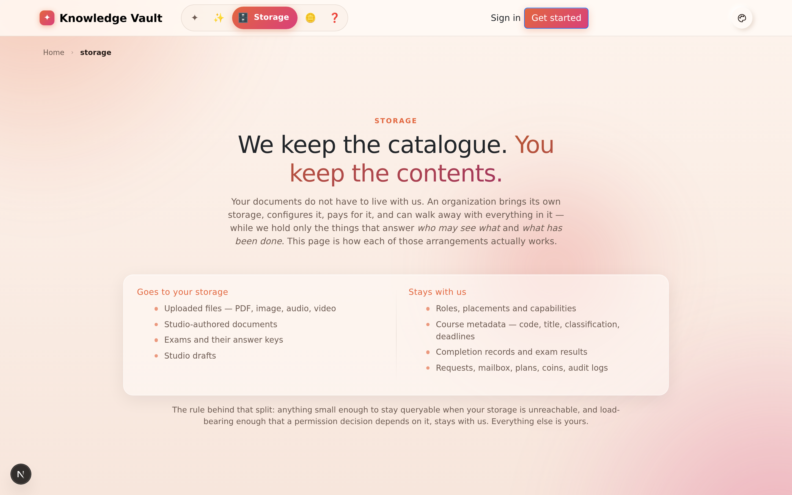
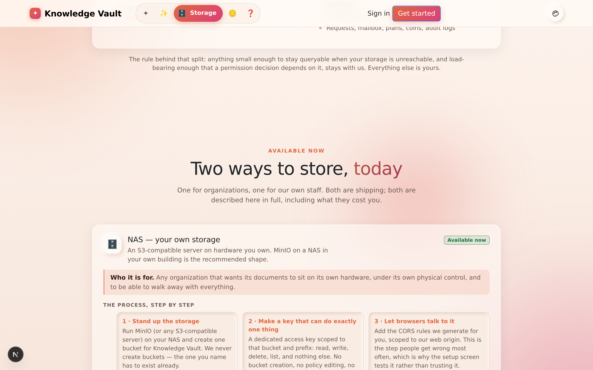
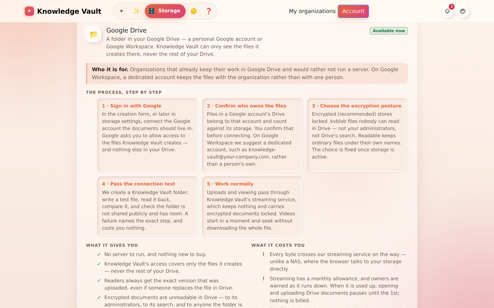
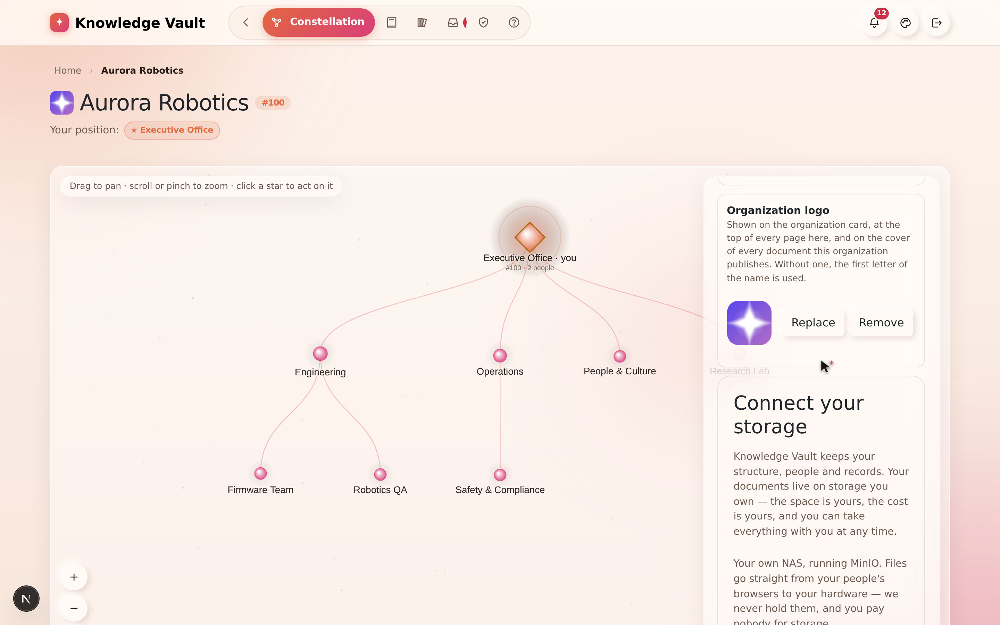
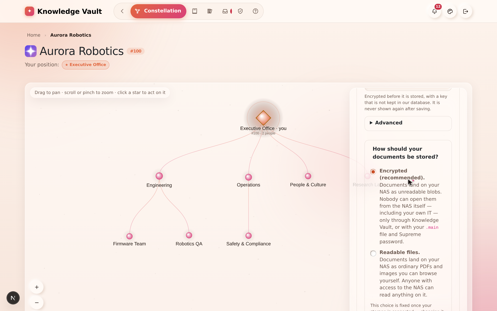
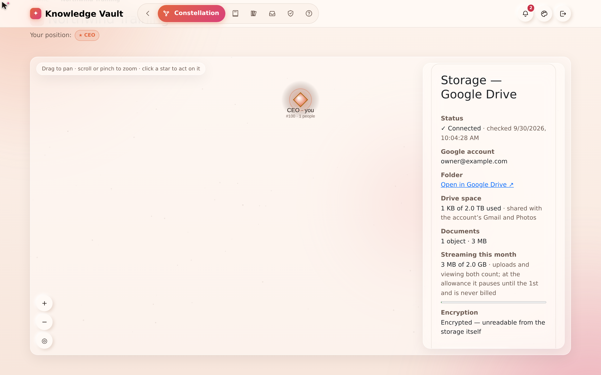
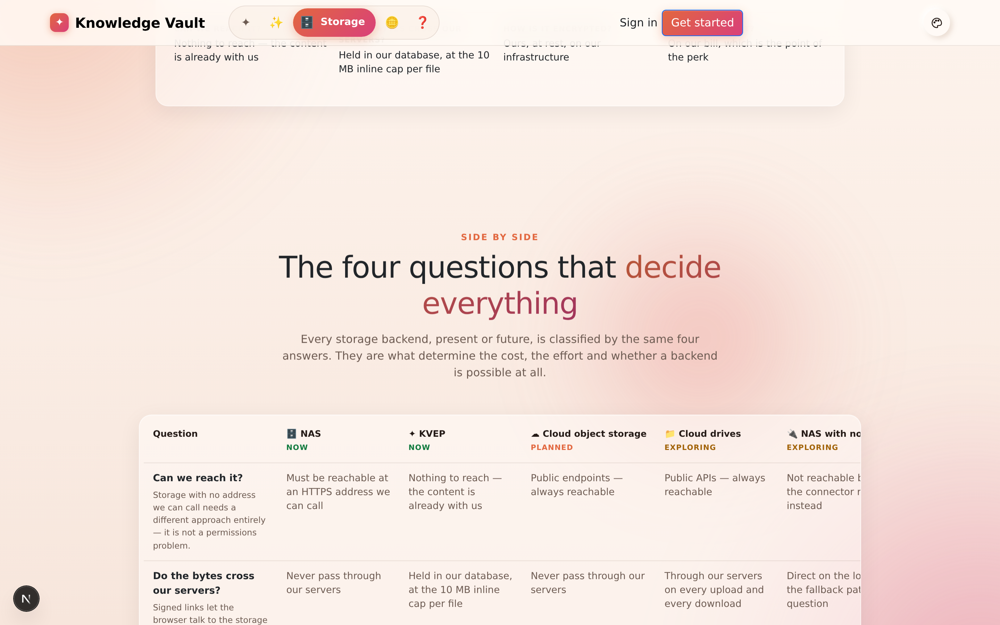
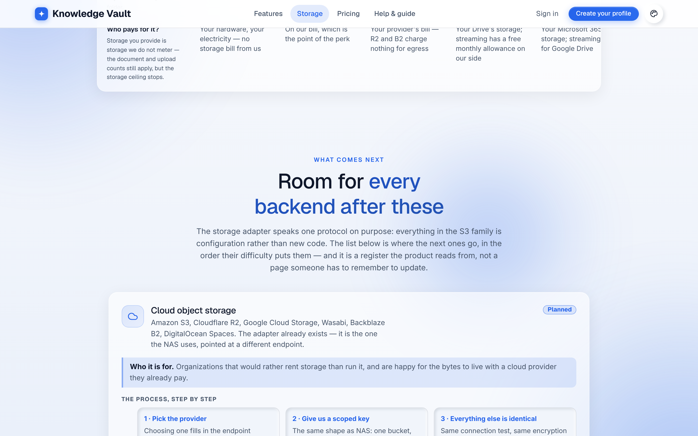
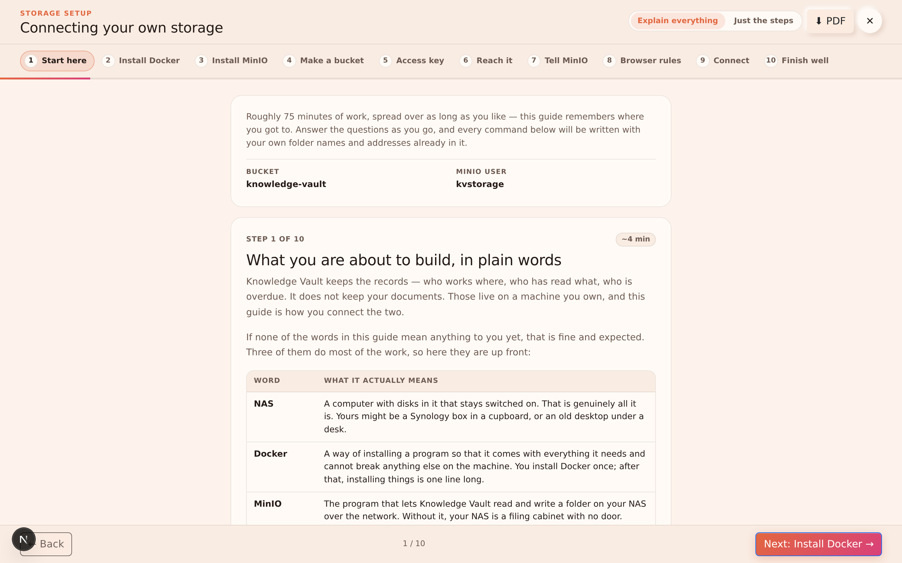

# Chapter 23 — Where your documents live

## What it is

Your organization's documents do not have to live with us. **We keep the catalogue; you keep
the contents.** You bring storage, you configure it, you pay for it, and you can walk away with
everything in it at any time — while Knowledge Vault holds only the things that answer *who may
see what* and *what has been done*.

There is a page for all of this on the public site: **Storage**, in the navigation bar and in
the footer of every page.

---

## Why it matters

| Parameter | What changes |
|-----------|--------------|
| **Time** | A NAS or a Google Drive is connected once, in the creation form, and tested on the spot. Nothing about storage comes back to bother you afterwards. |
| **Risk & compliance** | You can say exactly where your documents are, on which hardware, in which building — the answer a data-protection questionnaire actually asks for. |
| **Security & custody** | Encrypted at rest with a key we hold separately from the data, and unreadable from the storage itself. If you leave, you leave with the files. |
| **Cost** | Disk is cheap when it's yours. The plan pays for the platform, not for your gigabytes. |
| **Adoption** | Unreachable storage degrades honestly: people still sign in, still see their structure, still see what they've completed. Only opening and uploading documents wait. |

---

## 1. The dividing line

| Goes to your storage | Stays with us |
|----------------------|---------------|
| Uploaded files — PDF, image, audio, video | Roles, placements and capabilities |
| Studio-authored documents | Course metadata — code, title, classification, deadlines |
| Exams and their answer keys | Completion records and exam results |
| Studio drafts | Requests, mailbox, plans, coins, audit logs |

The rule behind the split: anything small enough to stay **queryable when your storage is
unreachable**, and load-bearing enough that a permission decision depends on it, stays with us.
Everything else is yours.

That is also why unreachable storage is an inconvenience rather than a catastrophe. Your people
can still sign in, still see their structure, still see what they have completed and what is
overdue. What they cannot do is open or upload a document until the storage comes back.

---

## 2. The three ways to store, today

### NAS — your own storage

An **S3-compatible server on hardware you own**. Silo — an open-source storage server that
speaks the S3 API — running on a NAS in your own building is the recommended shape, and the one
the setup guide walks through.

The process, in the order it actually happens:

1. **Stand up the storage.** Run Silo (or any S3-compatible server) and create one bucket for
   Knowledge Vault. We never create buckets — the one you name has to exist already.
2. **Make a key that can do exactly one thing.** A dedicated access key scoped to that bucket
   and prefix: read, write, delete, list, and nothing else.
3. **Let browsers talk to it.** Add the CORS rules we generate for you, scoped to our web
   origin. Silo accepts every origin out of the box, and these rules narrow that to Knowledge
   Vault alone. The connection test runs from our servers and cannot see this
   step — the first real upload from a browser is what proves it.
4. **Choose the encryption posture.** *Encrypted* (recommended) writes opaque `.kvblob` objects
   nobody can read out of band — not even your own IT administrator. *Readable* keeps ordinary
   browsable files. **The choice is fixed once storage is active**, because changing it means
   re-encrypting everything you already have.
5. **Pass the connection test.** We reach, write, read back, compare and delete a probe object
   before your organization is created. A failure names the exact stage that broke, aborts
   creation, and **does not consume your access code** — fix the storage and try again with the
   same code.
6. **Work normally.** Uploads go from the browser straight to your storage through a
   short-lived signed link, and downloads come back the same way. The bytes never touch our
   servers.

**What it gives you.** The documents are physically yours. Because none of the bandwidth is
ours, the storage ceiling on your plan stops applying to you — the document and upload counts
still do. A signed `Knowledge_vault_map` manifest sits in the bucket, so the folder explains
itself to anyone who opens it. Objects are content-addressed and date-sharded, so a filename
never leaks what a document is about.

**What it costs you.** Your storage has to have a public HTTPS address; a NAS reachable only on
your office network cannot be used this way today (see §4). An organization cannot be created
until its storage is reachable and working. Files can be up to **200 MB**, encrypted in framed
parts so a large file never has to fit in a phone's memory twice — but behind a Cloudflare Tunnel
on Cloudflare's free plan, each upload is capped at **100 MB**, so publish large videos as links.

### Google Drive — a folder in your Google account

A folder called **Knowledge Vault — *your organization*** in a Google Drive you already have —
a personal Google account or Google Workspace. There is no server to run.

Knowledge Vault asks Google for access to **only the files it creates** in that folder. It
cannot see, list, open or change anything else in the Drive, and exactly what it can reach and
keep is set out on the **Your Google account and Knowledge Vault** page, linked from the setup
screen.

The process, in the order it actually happens:

1. **Choose Google Drive** under *Where your documents will live* — or, later, in the root
   branch's Group configuration.
2. **Connect your Google account.** A Google sign-in window opens; choose the account the
   documents should live in and allow *"See, edit, create, and delete only the specific Google
   Drive files you use with this app"*. The window closes itself and the form says **Connected
   as** that account. On Google Workspace, prefer a dedicated account (such as
   `knowledge-vault@your-company.com`) to a person's own — the documents belong to whichever
   account connects.
3. **Choose the encryption posture.** Exactly as on NAS: *Encrypted* (recommended) stores locked
   `.kvblob` files nobody can read in Drive — not your administrators, not Drive's search or AI.
   *Readable* stores ordinary files under their own names. Fixed once storage is active.
4. **Confirm who owns the files.** The documents will count against that account's storage and
   go wherever the account goes, so you tick a box that names it.
5. **Pass the connection test** — seven checks: reach the Drive, open the folder, write a test
   file, read it back, compare the bytes, confirm the folder is private, and check there is room.
   As with NAS, a failure names the step and does not consume your access code.
6. **Work normally.** Upload with the usual form. Videos and audio start playing in a moment and
   seek straight to where you click, without downloading the whole file.

**How documents travel.** Google Drive has no private link for a single file, so — unlike a
NAS — uploads and viewing pass through Knowledge Vault's **streaming service** on the way to and
from your Drive. Encrypted documents pass through locked and are only unlocked in the reader's
own browser; nothing is ever kept on the way.

**The streaming allowance.** Because those bytes cross our servers, streaming has a free
monthly allowance, shown in storage settings as **Streaming this month**. Owners are told at
60%, 80% and 95%. At 100%, opening and uploading Google Drive documents pauses until the 1st —
everything else carries on, and **nothing is ever billed**.

**What it gives you.** Nothing to install or buy. Readers always get the exact version that was
uploaded, even if someone uploads a new version over the file in Drive. If someone moves a
document to Drive's trash, the nightly check puts it back and tells the owners.

**What it costs you.** The files belong to the connected Google account and use its storage.
Files are capped at **200 MB**, as on NAS. An organization on NAS cannot move to Google Drive
(or back) yet.

### KVEP — the Knowledge Vault Employee Perk

An organization created by **Knowledge Vault staff, for staff use**. It is the one shape that
does not bring its own storage: content stays on our infrastructure, and the plan's storage
allowance applies to it normally.

It is gated on super-admin credentials at **two separate points** — once when the request is
raised as an employee-perk request, and again at creation time, where a super-admin username
and password are checked against the administrator account itself. A perk code with no
credentials is refused; so are credentials against an ordinary code, and so is any attempt to
give a KVEP organization storage fields.

For a KVEP organization there is nothing to set up: no bucket, no key, no CORS, no connection
test. It can never enter the "storage unreachable" state, because there is no third-party
storage to go unreachable. Files are capped at **10 MB** each rather than 200 MB.

> **If you are a customer, this option is not for you** — and the form will tell you so rather
> than letting you fill it in. It is documented here so that the two shapes are never confused
> when someone describes what they are seeing.

---

### Connecting or changing storage after the organization exists

Storage is chosen at creation, but it is not sealed away afterwards. The **root branch's Group
configuration** carries a **Connect your storage** panel — the same fields, the same connection
test, and the same gate: an organization will not accept storage it cannot reach.

The one thing that cannot be changed here is the **encryption posture**. Whether documents are
written encrypted or readable is fixed for the life of the organization, because changing it
would mean re-encrypting everything already stored.

For **Google Drive**, the panel shows the connected account, a link that opens the folder in
Drive, the Drive's space, how many documents are stored, and the streaming allowance used this
month. Three buttons sit under it:

- **Check connection** — runs the health check now.
- **Reconnect Google** — for when access was removed or expired. It must be the **same
  account**: another account cannot see the files this one created.
- **Close open document links** — ends every open document and upload link at once, for when
  you think one has been shared with someone who should not have it. Needs the Supreme password.

If Knowledge Vault's access is removed in the Google account, the organization shows **We
cannot reach your storage**, with the reason and what to do; readers see that the document is
waiting on your storage, not that it is gone.

---

## 3. The four questions that decide everything

Every storage backend — the two above and every one that comes after — is classified by the
same four answers.

| Question | Why it decides so much |
|----------|------------------------|
| **Can we reach it?** | Storage with no address we can call needs a completely different approach. This is not a permissions problem and no configuration fixes it. |
| **Do the bytes cross our servers?** | Signed links let your browser talk to the storage directly. That is the difference between paying for bandwidth on every read and paying for none. |
| **How is it encrypted?** | Encrypted storage holds opaque objects nobody can read out of band. Readable storage stays browsable by anyone who can open the folder. |
| **Who pays for it?** | Storage you provide is storage we do not meter. |

---

## 4. What comes next

The storage page lists the backends still ahead, with an honest label on each.

| Backend | Status | What it is |
|---------|--------|-----------|
| **Cloud object storage** | *Planned — the adapter already exists* | Amazon S3, Cloudflare R2, Google Cloud Storage, Wasabi, Backblaze B2, DigitalOcean Spaces. The same adapter with a different endpoint, which is exactly why S3 was chosen as the first protocol. |
| **OneDrive and SharePoint** | *Being explored* | The same design as Google Drive — Microsoft's drives issue no signed links either, so documents would travel through the same streaming service. |
| **NAS with no public address** | *Being explored* | A file server that only exists on your own network, reached through a small connector you run beside it. A real requirement with a genuinely unsolved part — how someone off the network reads a document. |

Those three labels mean exactly what they say:

- **Available now** — you can pick it today.
- **Planned** — the code exists; what remains is configuration and documentation.
- **Being explored** — a real requirement with an unsolved part. Listed so you never have to
  guess whether we have thought about it, and honest about why it is not next.

The list is a register the product reads from, not a page somebody has to remember to update.
When a new way of storing data ships, it appears on the storage page, in the comparison table
and on the home page at the same moment.

---

## Tips & pitfalls

- **Decide the encryption posture before you create the organization,** not after. It is the
  one storage setting that cannot be changed with a click later.
- **A failed connection test costs you nothing.** Your access code is not consumed, so test
  early and test often.
- **Encrypted is the right default even on hardware you trust.** It protects the documents from
  everyone who can reach the folder, which over a few years is more people than you expect.
- **If your NAS is LAN-only today, say so when you ask about storage.** It changes which
  answer is honest, and we would rather tell you than sell you a setup that cannot work.
- **On Google Workspace, connect a dedicated account,** not a person's own. When someone
  leaves, their account — and every file it owns — goes with them.
- **Keep the `.main` file safe, whichever storage you use.** With the Supreme password it opens
  every encrypted document straight from your storage, even without Knowledge Vault.
- **Try it on a laptop first.** The storage setup guide turns an ordinary folder into an
  S3-speaking NAS in about fifteen minutes, which is enough to rehearse the whole flow before
  hardware is bought.

---

## 🎬 Make a video of this

**Length:** ~3 minutes. **Working title:** *"We keep the catalogue. You keep the contents."*

| # | Shot | Say |
|---|------|-----|
| 1 | The Storage page's dividing-line table | "Two columns. What stays with us is what decides who may see what." |
| 2 | The NAS card | "Everything else — the files themselves — lives on hardware you own." |
| 3 | Creation form: fill the NAS fields, press **Test connection** | "Write, read back, compare bytes, check it isn't public, clean up. Five checks, one button." |
| 4 | Show a failed test naming the step that failed | "And when it fails, it says which of the five." |
| 5 | The encryption choice | "Encrypted at rest is the default, and it's the one setting fixed for the life of the organization." |
| 6 | Choose **Google Drive**, press **Connect your Google account** | "Or no server at all: a folder in your Google Drive, which we can reach and nothing else." |
| 7 | Play a video, click far ahead on the timeline | "It streams, and seeks, without downloading the file — and an encrypted one is only unlocked in your browser." |
| 8 | The "what comes next" register | "Cloud object storage next; OneDrive and LAN-only NAS under examination — with honest status labels." |

**Script beat to close on:** *"If you ever leave, you leave with the documents. That is what
custody means here."*

**Next:** [Chapter 24 — What's new →](chapter-24-whats-new.md)
