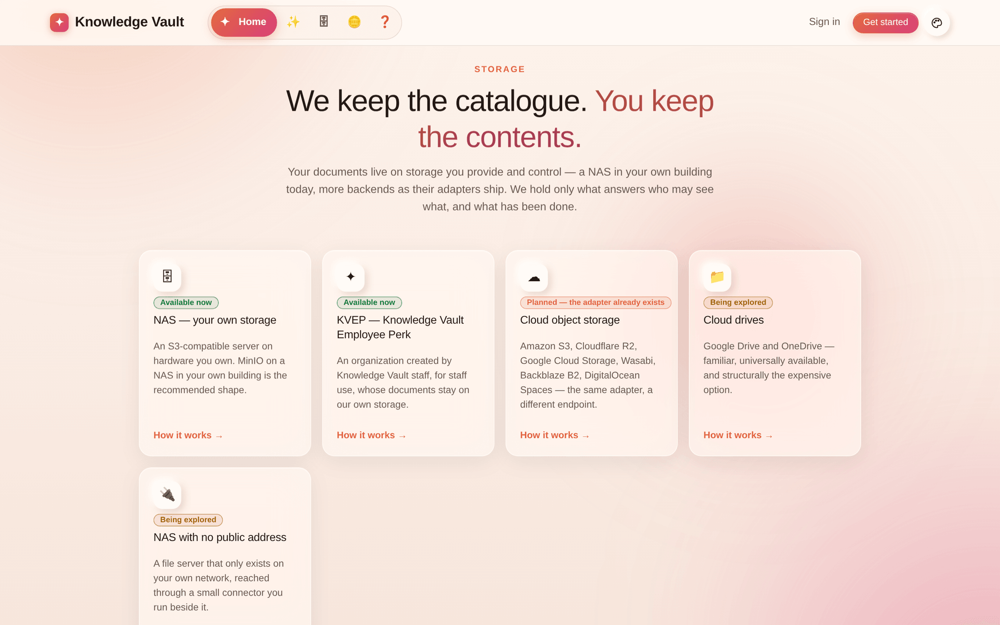

# Chapter 24 — What's new

A short, dated record of what changed in the product, so a returning reader can see what has
moved since they last used it. Newest first.

---

## August 2026

### The compliance report stopped calling completed people overdue

A deadline is *how long someone has to finish a course after it reaches them* — and that is
now what the report measures. The clock starts at the **later** of the day a course was placed
on a branch and the day the person joined it, and it restarts when a recurring completion
lapses or a republished edition resets one.

Three kinds of people were being accused of missing days they never had: somebody whose annual
course lapsed last night (*due to do it again*, not a year late), somebody whose completion was
expired by a republished edition, and somebody placed in the branch that morning. All three are
now reported honestly, and genuinely late people are still late. A lapsed completion also reads
**expired** the instant it lapses, rather than waiting for the nightly sweep to notice.

The arithmetic lives in one place and is used by the branch report, the per-person card, the
per-course view, My Learning and the nightly job — so no two of them can disagree.
See [Chapter 15](chapter-15-compliance.md).

### Look one person up

Alongside *"who is behind on this course?"*, the Compliance page now answers *"where does this
person stand?"* — one card with every course that reaches them, each with a status and a reason
in plain words. Both views come from the same computation, so they cannot disagree.

### Sessions end after an hour away

A sign-in used to last, in practice, a month: the access token refreshed itself silently from a
30-day refresh token. A browser left open on a shared desk stayed signed in the whole time.

Now **one hour of inactivity ends a session**, and the next visit is asked for a password —
with the reason on the screen. What counts as activity is the **person**, not the program: a
click, a key, a scroll, a touch, a page opened. Background polling and token refreshes do not
count. The last minute is announced by a *Still there?* card with **Stay signed in** beside it,
every tab agrees, and closing the laptop counts as being away.
See [Chapter 19](chapter-19-sessions-and-security.md).

### A full-screen exam keeps its cursor

Sitting an exam full screen left no visible pointer at all — the app draws its own and hides
the system one, and full screen quietly put ours behind the exam. The pointer and the hint card
now travel into whatever is full screen and come home afterwards. The rule is stated once: the
system cursor is taken away **only while ours is actually painted**, so a failure leaves the
ordinary arrow rather than nothing.

### An organization with a face, and a dashboard worth reading

- **The logo can be changed, and is finally shown.** It sits in the root branch's *Group
  configuration*, appears on the dashboard card and beside the name on every page the
  organization owns. Deliberately **not** Supreme-gated: that password guards what cannot be
  undone, and asking for it to change a picture teaches people to type it without thinking.
- **The card is the constellation it opens into** — the badge is the anchor star of a small
  star field, seeded from the organization's number, so the same organization always wears the
  same sky and becomes recognisable in a list of twenty.
- **The timer says something.** A plan name rather than a raw key, the largest unit that still
  means something (*9.9 years left*, *12 days left*, *20h left*) instead of counting to 3,643
  days, a dot coloured by how close the end is, and the exact date on hover. Only the last
  three days pulse — a card that throbs for a year teaches people to ignore it.
- **Positions are visible and bounded** — owners first and marked, the tail collapsed into a
  **+N** that lists the rest on hover.
- **It scales.** Past five organizations a filter bar appears — All / Owner / Member — and a
  search that covers the name, the number **and your own role names**, because "the one where
  I'm the safety lead" is how people actually remember them.

See [Chapter 4](chapter-04-your-organizations.md).

### The constellation lays its labels out

Role names used to be drawn centred under every star at a fixed offset, with nothing stopping
two of them landing in the same place. On a phone, four siblings 150 units apart sit about 70
apart on screen — and three names became a smear.

Labels are now laid out the way a map lays out place-names: collected, sorted by how much the
reader needs them, and placed one at a time into the first free space — a second or third row
under the star when the first is taken, and **not at all** when none is free. A star with no
room keeps its glyph and gets its name back as soon as there is room. A label the frame would
slice in half is not drawn; names hold still while their star breathes; and each carries a soft
halo so a name crossing a connector reads as text on the sky rather than text on a wire.
See [Chapter 5](chapter-05-the-constellation.md).

### The reader: zoom that responds, and text that re-wraps

- **Zooming a PDF used to re-rasterise the whole document** — about 26 seconds of frozen page
  per press of **+** on a 134-page book. Each page now keeps its own canvas: a zoom resizes
  every canvas immediately and re-renders only the pages you can actually see. Measured on the
  same document: **26,000 ms → 45 ms**, and 1–3 pages rendered instead of 134.
- **Studio documents zoom by scaling the type**, so lines re-wrap instead of forcing you to
  scroll sideways — and an author's explicit font size now grows with everything around it.
- **The PDF viewer rendered nothing at all on older browsers** (pdf.js 6.1 calls two very new
  JavaScript methods). Both are polyfilled before the library is touched — phones were worst
  affected, where the WebView trails the desktop browser by months.
- The reading-size pill moved off the bottom centre, where it fought the page turner for the
  same strip.

See [Chapter 13](chapter-13-my-learning.md).

### Uploading a document is a two-step composer

The upload form was one long column crammed into a 340-pixel drawer. It is now a two-step
composer — **the material**, then **its properties** — with a counter saying how many required
fields are still empty, sections separated by rules, fields pairing up when there is room, and
a drawer that widens to make space. See [Chapter 8](chapter-08-courses.md).

### Storage is proven before an organization exists

Creating an organization is now gated on **proof that its storage works**: a NAS needs a
passing connection test, KVEP needs a recognised super-admin credential, and editing either
retracts the proof it was given for. The same gate covers reconfiguring a live organization's
storage, where saving something unreachable would stop every upload that depends on it.

Also: the access-code field explains where a code comes from, with a link straight to Pricing,
and the classification menu is drawn as a light sheet with dark ink on every theme — it used to
be four invisible lines on some platforms.

### One person-picker, everywhere

The field that suggests people as you type now serves every form that asks for one — adding a
person, looking one up in Compliance, and the staff console's own searches — so the behaviour
you learn in one place is the behaviour everywhere. Its suggestion menu is opaque, because glass
over a form's own labels made both texts unreadable at once.

---

## Earlier in August 2026

### A page about where your documents live

**Storage** joins the navigation bar and the footer. It describes each storage arrangement end
to end — **NAS** on hardware you own and the **KVEP** employee perk today, cloud object storage
next, cloud drives and private-network NAS under examination — with the process step by step,
what each gives you, what each costs you, and a side-by-side comparison. Every backend carries
an honest status label, and the list is a register the product reads from, so a new way of
storing data appears everywhere at once. See
[Chapter 23](chapter-23-where-your-documents-live.md).

### The navigation bar takes its time

The bar used to widen a label fast enough that the link you were aiming at slid out from under
your pointer. It now waits before it opens, opens gently without overshooting, and waits before
it closes — so a pointer that slips off for an instant does not snap it shut. Colour still
answers immediately; only the shape is unhurried.

On a phone, the public pages — Home, Features, Storage, Pricing and Help — finally have a menu
button. Before this they had no way to reach their navigation on a narrow screen at all, and
the sheet is now solid rather than see-through, so the page underneath does not compete with
the links. See [Chapter 20](chapter-20-appearance-and-navigation.md).

### Buttons look like buttons

Secondary buttons across the product — *Upload a logo*, *Check credentials*, *Test connection*
and others — were rendering as bare text with no edge at all. Every button now has a visible
border, lifts when you reach for it, and sinks when you press it; a disabled button goes flat
so it no longer advertises that it can be used. On the **Create an organization** page the form
now fills its column instead of sitting as a narrow strip, so the storage fields have room to
breathe.

### The Mailbox replaces the notification bell

Every message the platform sends now arrives in a real mail client — folders by category,
labels per organization, sub-labels per request kind, multi-select, search, and a reading
pane. Messages from the Knowledge Base team are flagged **high priority** and pinned to the
top. **Every message carries its own expiry** and deletes itself when it gets there; the
countdown is shown on each row. Delivery is live on every page, with an arrival chime you can
switch off. See [Chapter 16](chapter-16-the-mailbox.md).

### Coin adjustments now reach you

Any change to your Knowledge Coin balance made by the Knowledge Base team arrives as a
high-priority message with the amount, the reason and your new balance — live, wherever you
happen to be in the product.

### Exams: attempt limits, honest compliance, and resets

An exam can cap the number of attempts. Spend them all without passing and the exam locks —
and the branch's **Compliance** view now says exactly that, in words, rather than a bare
*not completed*. A manager can **reset the allowance** in one click; the sittings stay on
record. The button in My Learning now reads **Complete the exam**. See
[Chapter 10](chapter-10-exams-and-assessment.md).

### A new plan ladder

| Plan | Length | Cost |
|------|--------|------|
| **Free** | 30 days | 50 coins |
| **Bi-monthly** | 2 months (60 days) | 100 coins |
| **Quarterly** | 4 months + 10 days (130 days) | 150 coins |
| **Yearly** | 365 days + 2 months (425 days) | 500 coins |
| **Custom / Organizational** | You state the terms | By agreement |

Only the **Free** plan is metered: 30 custom documents, 30 uploads, 150 GB of storage —
whichever ceiling arrives first. **Every paid plan carries unlimited documents and uploads.**
See [Chapter 17](chapter-17-plans-and-access.md).

### Upgrades, side by side

The Pricing page now shows a signed-in owner **what their organization runs today** against
**what sits above it**, row by row, and files the upgrade request in one click. The Knowledge
Base team applies an approved upgrade immediately — there is no code to redeem for an
organization that already exists.

### Recovery

Both ways back from a deletion now live behind one **Recovery** button in the **bottom-left
corner** of your Organizations page: the organizations waiting out their 30 days, and a
`.main` revival for anything already purged. It used to be a panel at the top of the page plus
a separate collapsed box below it; a recovery tool belongs neither above the thing you came
for nor split in two. It is a recovery arrow rather than a wastebasket, because a deleted
organization here is intact and one password away from coming back.

### Icon-first navigation

The navigation bar is icons at rest and words on contact, with the current page's label always
open. On a phone, every label shows. See [Chapter 20](chapter-20-appearance-and-navigation.md).

### The peach-white day theme is now the default

…and your choice of theme and accent is stored in a cookie, applied before the first frame is
painted, and restored the next time you sign in. A fifth accent, **Peach**, joins Aurora,
Ocean, Sunset and Forest.

### Live username suggestions

Adding someone to a branch now suggests people as you type, after two characters, and marks
those already in the organization — so you can confirm a person exists before you commit.
Unknown usernames still work exactly as before: they are reserved, and attach the moment that
person registers.

### PDF zoom

In the document viewer, PDFs zoom with **Ctrl/⌘ + scroll**, a **two-finger pinch**, or
**Ctrl +/−/0** — and re-render at the new scale rather than stretching, so text stays sharp.

### Studio: discard the browser's copy

The Studio autosaves a working copy in your browser as you write. That copy now has its own
**Discard browser copy** button in the drafts tray, for both documents and exams — previously
you could clear a parked server draft but not the local one, so an abandoned document kept
coming back.

### Requests are deleted when they are decided

A decided request is finished: the outcome goes to the requester's mailbox and the audit log,
and the request itself is removed rather than lingering. Nothing waiting on you is ever
mixed with things already dealt with.

### The courses panel's plan note moved

The plan allowance now sits at the **foot** of the courses panel as a quiet footnote, and an
organization already on a paid plan is no longer told to go and buy one.

---

**Next:** [Appendix — Glossary & quick reference →](appendix-glossary-and-reference.md) ·
**Back to:** [Table of contents](README.md)
