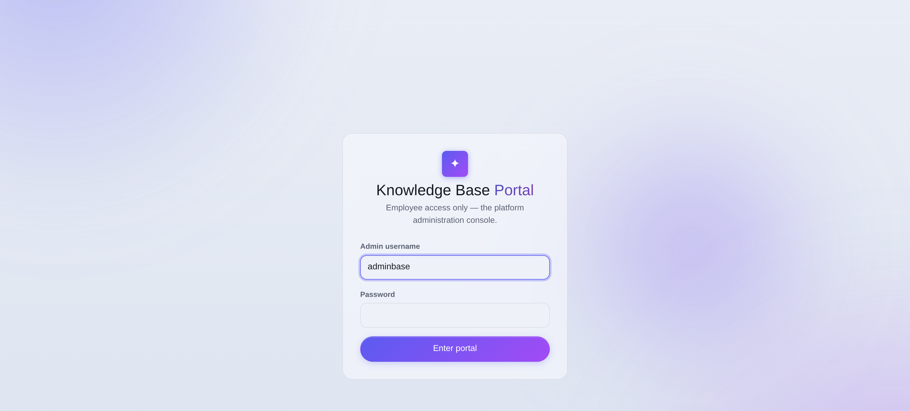

# Chapter 1 — The portal & signing in

## What it is

The **Knowledge Base portal** is the administration console for the people who *run* the
platform. It is a **separate realm** from the product: its own login page, its own accounts,
its own token, its own session storage. Nothing a customer does ever takes them here, and
nothing here needs any organization's Supreme password.

From the portal you can see every organization on the platform, decide plan requests and issue
access codes, gift Knowledge Coins, set the starting balance for new sign-ups, change an
organization's plan and every one of its limits, message owners, and manage the administrator
accounts themselves.

---

## Signing in

The portal is reached from the small **"Knowledge base employee login"** link in the site
footer, which opens the employee sign-in page.

- The first administrator account is created automatically when the platform is deployed, and
  is **forced to change its password at first login** — the bootstrap password only ever works
  once.
- Sign-in is username + password, hashed with Argon2id. Accounts can be **deactivated**, and a
  deactivated account is refused on *every request*, not just at login.
- **The URL is not the security boundary — the login is.** The footer link exists only so
  staff can find the door. Treat the address as public knowledge and the credentials as the
  entire defence.

### Two sessions, side by side

An administrator token lives under its own key in the browser, separate from any customer
session. You can be signed in as an administrator and as an ordinary user in the same browser
without the two interfering — which is how you test a customer's report against your own
account.

### If you are locked out

There is a deployment-level reset for the first administrator, driven by an environment
variable, which restores the bootstrap password and forces a change at next login. It requires
access to the service's configuration — that is, someone who could already deploy code against
the same database — so it grants nothing that person did not already have. **Remove the
variable immediately afterwards.**

---

## What the portal is not

- **It is not a way into a customer's data.** You can see the *shape* of an organization —
  counts, roles, depth, plan, owners — and you can change its plan and limits. You cannot read
  its documents or exam papers from here.
- **It is not a password recovery service.** Supreme passwords are not stored in any
  recoverable form. If a customer has lost one, the honest answer is that it is gone, and their
  `.main` file (encrypted with that same password) cannot help them either.
- **It is not exempt from the audit trail.** See [Chapter 5](chapter-05-administrators-and-safety.md).

---

## Tips

- **Sign out on shared machines.** The token is long-lived by design so you are not fighting
  the login all day; that cuts both ways.
- **Use a real display name.** The audit trail names accounts, and "admin2" tells a future
  reader nothing.
- **Never paste an access code into a public channel.** It is single-use, but it is also
  someone's organization.
