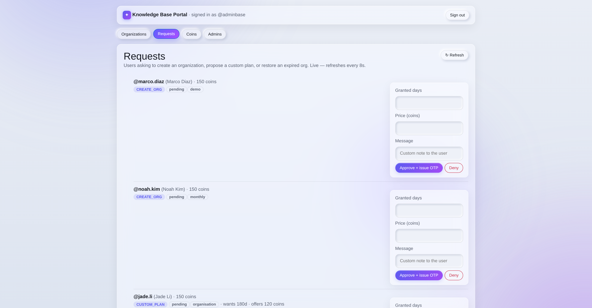

# Chapter 2 — Requests & access codes

## What it is

The **Requests** tab is the channel between a customer and the team. Four kinds of ask arrive
here:

| Kind | What the customer wants |
|------|------------------------|
| **Create an organization** | Permission to found a new organization on a plan they chose |
| **Upgrade a plan** | To move an organization they already own onto a higher plan |
| **Custom / organizational plan** | Terms they have proposed themselves — days, people, document counts, and the coins they offer |
| **Restore an organization** | A key to bring back an expired or purged organization from its `.main` |

---

## 1. Approving is one click

**You do not have to design the customer's plan.** Every request arrives carrying the terms of
the plan the customer chose, resolved from the pricing table, printed on the card:

> *Will grant: 130 days · unlimited people · unlimited custom documents · unlimited uploads ·
> costs 150 coins*

Select **Approve** and exactly that is what happens. Days, price, people, documents and uploads
all default to the plan's own numbers — or, on a custom proposal, to the numbers the customer
stated in their form. Nothing has to be re-typed, and nothing can drift between what the
Pricing page promised and what you granted.

### When you *do* want to change something

**Adjust terms** opens the override fields. Every one is optional and every one is blank by
default, meaning *use what the plan says*. Fill in only what you mean to change — a longer
trial, a discount, a specific seat count for a negotiated agreement.

### The message box

Whatever you write is delivered to the customer with the decision, as the body of a
high-priority message in their mailbox. Use it. "Approved — this covers the two sites you
mentioned" saves a follow-up conversation.

---

## 2. What a code is, and what it does

Approving a **create** or **restore** request mints an **8-character alphanumeric code**.

- It is **hashed** before storage. The plain code is shown to you **once**, on screen, so you
  can relay it out of band if you want to — and it is delivered to the customer's mailbox at
  the same time, flagged high priority, where it stays readable for 30 days.
- It is **valid 24 hours** and **single use**.
- **Coins are taken when the code is redeemed**, never when the request is filed or approved.
  A customer who never redeems never pays.
- Redeeming it carries the terms you granted onto the new organization: plan key, expiry,
  member limit, document and upload limits.

---

## 3. Upgrades are applied immediately

An **upgrade** request names an organization that already exists, so there is nothing for a
code to unlock. Approving it:

1. Applies the new plan, expiry and limits to that organization **at once**.
2. Marks the request as used.
3. Sends every owner a high-priority message naming the new plan and its expiry date.

The customer sees the change the next time a page loads — usually within seconds, because the
message arrives live.

> The server checks ownership when the request is *filed*: only an owner of the root role can
> ask to upgrade an organization. You do not need to verify it yourself.

---

## 4. Denying

**Deny** records the decision and sends the customer a high-priority message. The reason you
type is the whole of what they see, so write a real one — "the free plan is one per profile,
and you already have one on @sam" is useful; a blank denial is not.

A denied request keeps its record for 30 days and then clears itself.

---

## 5. Housekeeping

- **Withdrawn requests are deleted immediately** — a customer who changes their mind leaves
  nothing in your inbox.
- **Served requests** (used, denied, expired, withdrawn) are swept **after 30 days** by the
  nightly job. The *Recently served* list under the inbox is a rolling window, not an archive;
  the audit trail is the archive.

---

## Tips

- **Approve first, adjust only when asked.** The plan the customer picked is the agreement they
  already read on the Pricing page — changing it silently is a surprise on their invoice.
- **Read the custom form as a specification.** Days, people, document counts and upload counts
  are exactly the fields you would otherwise have had to invent.
- **A 24-hour code is deliberate.** If a customer misses the window, deny nothing — approve a
  fresh request. It costs them nothing.
