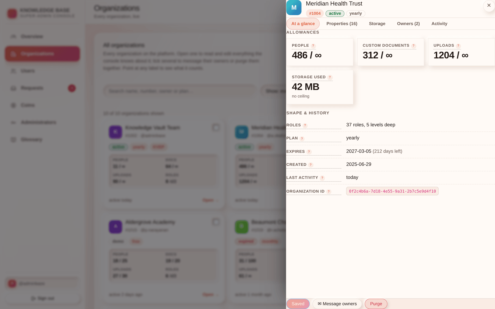

# Chapter 3 — The organizations console

## What it is

The **Organizations** section is the god view: every organization on the platform, live, and a
drawer that opens onto everything the console knows about any one of them. It refreshes itself
every ten seconds, so counts, plan states and expiry dates stay current while you work.

---

## 1. Finding the organization you want

Four controls sit above the grid, and they compose — a filter and a search apply together.

| Control | What it does |
|---------|--------------|
| **Search** | Matches name, organization number, owner username, plan key and plan status. |
| **Show** | Everything · on a paid plan · expired · **dormant ≥ 30 days** · employee perk (KVEP) · in a Recycle Bin. |
| **Sort** | Any column: number, name, plan, status, expiry, people, documents, uploads, storage, roles, tree depth, last activity. |
| **↑ / ↓** | Ascending or descending, independent of which column you sorted by. |
| **Cards / Table** | Cards to browse, table to compare. The line under the toolbar always says how many of how many you are looking at. |

Each card carries only what you scan a grid for: who it is, whether it is healthy, how busy it
is, and when anyone last touched it. Everything else is one click away in the drawer.

> **Sort by last activity to find dead trials.** Anything untouched for months on a lapsed
> plan is a purge candidate — after you have messaged its owners. The **dormant ≥ 30 days**
> filter is the same question asked in one click.

---

## 2. Opening one — the drawer

Selecting a card opens a drawer over the grid with five tabs.

### At a glance

The four metered allowances as *used / limit*, each with a bar showing how close to the
ceiling it is, then the organization's shape and history: roles and depth, plan, expiry with
the days remaining, created, last activity, and the organization ID.

An allowance with no ceiling reads `∞`. A bar that has gone amber is at 80%; red is 95%.

### Properties — everything, editable in place

Every property the API holds, in an editable field. Changed fields are **outlined until you
save**, and the save button counts them, so you always know what you are about to commit.

| Property | Notes |
|----------|-------|
| **Name** | Free text. Not unique — identify an organization by its number. |
| **Organization number** | Read-only, permanent, never reused. |
| **Plan** | Any key from the pricing table. |
| **Plan status** | `NONE` · `DEMO` · `ACTIVE` · `EXPIRED`. |
| **Expires on** | A date, or blank for no expiry. |
| **People limit** | Blank = use the plan's limit. |
| **Custom-document limit** | Blank = the plan's limit (unlimited on every paid plan). |
| **Upload limit** | Blank = the plan's limit. |
| **Storage limit (MB)** | Blank = the plan's limit. |
| **People / documents / uploads / storage used** | Read-only, live. |
| **Roles, depth, created** | Read-only. |

> **Blank means "inherit", not "zero".** Clearing a limit hands the decision back to the plan.
> To actually forbid something, set it to `0`.

**Check `used` before you lower a limit.** Setting a ceiling below what an organization already
holds does not delete anything, but it does stop them adding more — which is a surprise if they
did not ask for it.

### Storage

Where this organization's documents actually live: connection status and when it was last
checked, the address, the bucket and prefix, the region, the masked access key, the encryption
posture, how many objects and how many bytes, and anything still waiting to migrate out of our
database.

- **Test connection** re-runs the health check right now and tells you what it found. It
  changes no settings.
- **Unreachable is not data loss.** It means new uploads have nowhere to go until the
  organization's storage comes back. Say that to a worried customer, in those words.
- A **KVEP** organization says so instead of showing a form: its content is on our storage,
  there is nothing to configure, and it can never go unreachable.

### Owners

Everyone on the organization's root role, with their coin balance and their profile ID — which
is what a support ticket or an audit query keys on. An organization with **no owners** gets a
warning here: nobody can govern it, and it needs an owner restored from its own `.main` file
or a purge.

### Activity

The audit trail for this organization — what was done, and when.

### The footer

Pinned to the bottom of the drawer, reachable however far down you have scrolled: **Save**,
**Discard**, **Message owners**, and **Purge**.

---

## 3. Selecting several

Each card has a checkbox. Tick two or more and a selection bar appears with two actions:

- **✉ Message their owners** — one message to every owner of every selected organization.
- **Purge selected** — a permanent purge of all of them, behind an inline confirmation.

This is how you run a campaign ("the yearly plan now includes two free months") or clear a
batch of abandoned trials, without repeating yourself once per organization.

---

## 4. Messaging owners

The message form asks for a **subject**, a **body** and a **priority**.

- It lands in every recipient's mailbox under **Knowledge Base**, labelled *Announcement*.
- **High priority** pins it to the top of their mailbox and turns their bell red. Use it for
  things that block someone, not for offers.
- Delivery is live — an owner with a page open sees it arrive.
- Messages expire after **30 days** like all Knowledge Base mail, so a campaign does not
  accumulate in customers' mailboxes forever.
- The broadcast is audited with the subject and the recipient count.

> **Advertising is legitimate here; nagging is not.** These are your customers' working
> mailboxes. One message about a real change beats four about the same one.

---

## 5. Deleting an organization

Two very different things share the word "delete":

| | Customer's delete | Your purge |
|---|---|---|
| Where | Their Supreme zone | This console |
| Effect | Soft — goes to their **Recycle Bin** | **Permanent, immediate** |
| Reversible | One click, for 30 days | Only from their own `.main` file |
| Needs | Their Supreme password | Your admin account |

**A purge from this console bypasses the 30-day retention entirely.** There is no undo on this
side. Before you use it, be certain the organization is what you think it is — check the number,
not just the name, because names repeat and numbers never do.

---

## 6. Reading the structure

`/admin/orgs/:orgNumber/tree` returns an organization's role tree — names, numbers, depth,
public/hidden, and owner and member counts per node. It is read-only and carries no document
content. Use it when a customer describes a structural problem and you need to see the shape
they are describing.

---

## Tips

- **Fix the limit, not the plan, for a one-off.** A customer who needs 40 seats on a plan that
  says 10 does not need a bespoke plan row; they need a per-organization override.
- **The Overview does the triage for you.** Expiring within a fortnight, and dormant for a
  month, are both already counted there — start from those tiles rather than from a sort.
- **Point at anything you are unsure of.** Every label in the drawer carries its own
  definition, so you never have to guess whether *documents* includes uploads. (It does not.)
