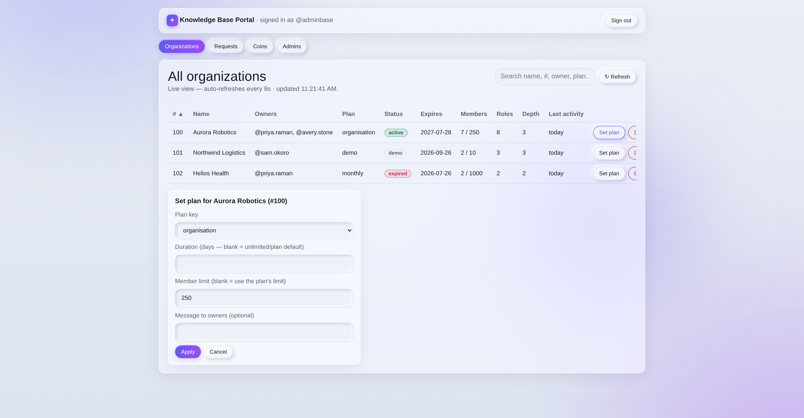

# Chapter 4 — Coins, plans & the pricing table

## What it is

Two tabs, and the table behind them: **Coins**, where balances are granted and adjusted, and
the **pricing table**, which is what every customer sees on the Pricing page.

---

## 1. Knowledge Coins

A coin is the unit plans are priced in. Coins are not money; they are tokens in a profile's
wallet, spent when an organization is founded or restored.

### Default for new sign-ups

One number: how many coins a **newly registered** profile starts with. Changing it affects
**future sign-ups only** — it never touches a balance that already exists.

### Gifting and adjusting

Enter a username, an amount (positive to grant, negative to deduct) and an optional note.

What happens:

1. The balance moves.
2. A **ledger entry** is written with the delta, the resulting balance, the reason and your
   account.
3. The user gets a **high-priority message** naming the amount, your note and their new
   balance — delivered live, wherever they are in the product.

The balance can never be driven below zero; the attempt is refused.

> **The message is not optional and should not be.** A balance that changes without explanation
> is indistinguishable from a bug, and you will get the support ticket.

---

## 2. Setting a plan directly

Beyond the property table in [Chapter 3](chapter-03-organizations-console.md), there is a
direct plan-upgrade action: pick an organization number and a plan key, optionally override the
duration and the limits, and apply. Every root owner is messaged with the new plan and expiry.

Use it after a confirmed payment made outside the request flow.

---

## 3. The pricing table

The Pricing page is **entirely data-driven**. Every card is a row; adding a row adds a card, and
adding a new `category` adds a tab — with no code change and no deploy.

Each row carries:

| Field | Meaning |
|-------|---------|
| `key` | Stable identifier. **Never reuse or repurpose one** — organizations reference it. |
| `name`, `tagline`, `badge`, `highlights` | What the card says. |
| `category` | The tab it sits under. |
| `priceCoins`, `durationDays` | Cost and length. `null` days = unlimited / by agreement. |
| `memberLimit`, `documentLimit`, `uploadLimit`, `storageLimitMb` | Ceilings. `null` = unmetered. |
| `tier` | Rung on the upgrade ladder — what the comparison panel treats as "above". |
| `allowDrafts` | Whether authors may park Studio drafts on the server. |
| `isCustom` | Turns the card's button into the custom-proposal form. |
| `active`, `validFrom`, `validUntil` | Visibility and offer windows. |
| `sortOrder` | Order within the tab. |

### The current ladder

| Key | Name | Price | Days | People | Documents | Uploads | Storage | Tier |
|-----|------|-------|------|--------|-----------|---------|---------|------|
| `demo` | Free | 50 | 30 | 10 | 30 | 30 | 150 GB | 1 |
| `bimonthly` | Bi-monthly | 100 | 60 | ∞ | ∞ | ∞ | ∞ | 2 |
| `quarterly` | Quarterly | 150 | 130 | ∞ | ∞ | ∞ | ∞ | 3 |
| `yearly` | Yearly | 500 | 425 | ∞ | ∞ | ∞ | ∞ | 4 |
| `organisation` | Custom / Organizational | by agreement | — | — | — | — | — | 5 |

**Only `demo` is metered.** Every paid plan is unlimited on documents and uploads by design;
per-organization overrides remain available for the exceptions.

> The superseded `monthly` row is kept but **inactive** — organizations still on it resolve
> their plan normally, and no new customer is offered it. That is the pattern for retiring any
> plan: deactivate, never delete.

### Retiring or changing a plan

- **Changing a price or a limit** takes effect for *future* grants. Organizations already on
  the plan keep the terms recorded on their own row.
- **Deactivating** removes the card from the Pricing page without breaking anything.
- **Deleting a row** whose key an organization still references will leave that organization
  unable to resolve its plan. Don't.

---

## Tips

- **Set `tier` deliberately.** It is what the customer's upgrade comparison calls "above" — a
  wrong tier makes a downgrade look like an upgrade.
- **Use `validFrom`/`validUntil` for seasonal offers** rather than remembering to switch a card
  off by hand.
- **Write the note on every coin adjustment.** It is the only context the ledger and the
  customer will ever have.
