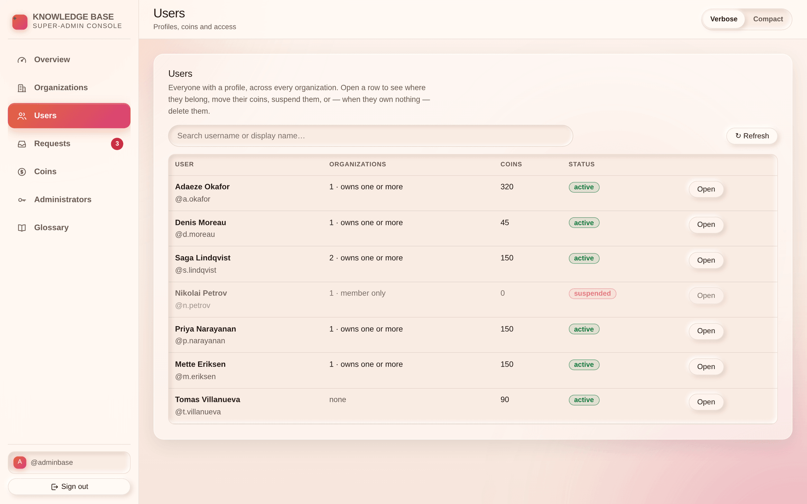

# Chapter 4 — Users

## What it is

The **Users** section is people rather than organizations: every profile on the platform,
across every organization it belongs to. One profile is one identity everywhere — there is no
per-organization account, and there is no email address, so the **username is the identity**.

The search box matches username and display name, and it debounces as you type, so you can
paste a name straight out of a support ticket.

Each row tells you four things: who they are, how many organizations they belong to and
whether they own any, their coin balance, and whether they are active or suspended.

---

## 1. Opening someone

Selecting **Open** slides in a drawer with everything the console holds about that profile.

### Profile

The **profile ID** — the platform-wide UUID that support tickets and audit queries key on —
plus the username, when they joined, their balance and their last activity. Click the ID once
to select the whole thing.

### Organizations

Where they belong, and whether they are an **owner** or a **member** of each. This is the
single most useful panel in the section: "why can't I see the library?" is nearly always
answered by which organizations are in this list, and in what capacity.

### Coins

One field, one button. A **positive** number grants; a **negative** number revokes.

- The balance never goes below zero — revoking more than they hold empties it and stops.
- Either direction lands in their **wallet history** and their **mailbox**, so the movement is
  never a mystery to them.
- Use it to top up someone who has paid outside the platform, or to claw back a mistake.

### Access — suspending

**Suspending signs them out everywhere and refuses their next sign-in.** It is the reversible
answer, and it is nearly always the right one:

- Their completion records, exam results and audit entries stay exactly as they were.
- Lifting it is one click, and they are back with everything intact.
- Use it while something is being investigated, not as a punishment you have to remember to
  undo.

### Delete

Deleting removes the profile, its memberships and its wallet history. Completion records and
audit entries **stay**, because they record what happened inside an organization rather than
who is welcome in it.

> **Deletion is refused while they own an organization.** Removing the last owner would leave
> an organization nobody can govern, which the platform does not permit at all. The drawer
> names the organizations to deal with first, and the delete button is simply not offered until
> they are handled — hand ownership over from inside the organization, or purge it from
> [Chapter 3](chapter-03-organizations-console.md).

---

## 2. Choosing between suspend and delete

| | Suspend | Delete |
|---|---|---|
| Can sign in | No | No — the account is gone |
| Reversible | Yes, one click | **No** |
| Their history | Kept, and still theirs | Profile and wallet gone; org records stay |
| Owns an organization | Allowed | **Refused** |
| Good for | Investigations, disputes, a compromised account | A genuine deletion request, or a test account |

When in doubt, suspend. A suspension you did not need costs someone an hour; a deletion you
did not need costs them everything they had.

---

## Tips

- **Check the balance before approving a paid plan.** The Requests section shows the
  requester's coins and warns when they will not cover the plan — but if you are gifting first,
  do it here, then approve.
- **Suspension is not a mailbox block.** A suspended profile still has a mailbox, and messages
  sent to organizations they own still arrive. Suspending is about sign-in, not about silence.
- **Two profiles with the same display name are ordinary.** The username is unique; the display
  name is not. Act on the username, or on the profile ID.
