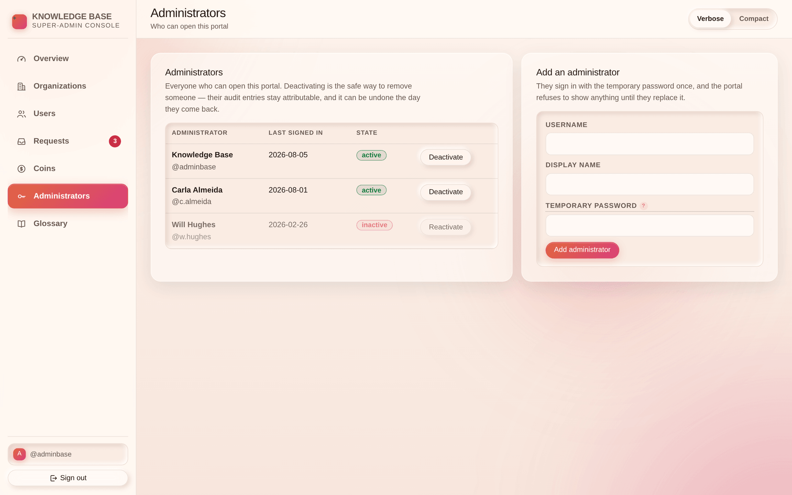

# Chapter 6 — Administrators, audit & safety

## What it is

The last tab, and the rules that make the rest of this book safe to use.

---

## 1. Administrator accounts

Any member of the team can be given a portal account.

- **Adding one** takes a username, a display name and a temporary password. The new account is
  **forced to change that password at first sign-in**.
- **Deactivating** blocks the account everywhere — not only at the login, but on every request
  it would otherwise make. Reactivating restores it.
- **You cannot deactivate yourself.** The console refuses, so the last person standing cannot
  lock the team out by accident.
- There is no permission ladder inside the portal. **Every administrator can do everything in
  this book.** Grant an account the way you would grant a production database password.

---

## 2. The audit trail

Every action writes a permanent record naming the administrator, the action and its details:

| Action | Recorded |
|--------|----------|
| `grant_otp` | Which request, days granted, price |
| `deny_request` | Which request |
| `gift_coins` | Username and delta |
| `upgrade_plan` | Organization number, plan key, days |
| `set_org_properties` | Organization number and which fields changed |
| `broadcast_message` | Organization numbers, subject, recipient count |
| `purge_org` / `bulk_purge_orgs` | Organization numbers and names |
| `create_plan` / `update_plan` | Plan key |
| `add_admin` / `toggle_admin` | Username |
| `set_default_coins` | The new value |
| `change_password` | Who |

The trail is append-only. Work as though it will be read, because it can be.

Separately, each organization keeps its **own** audit log of governance actions — people added,
courses deleted, requests decided, exams reset — which the nightly job trims at 90 days.

---

## 3. The things to be careful with

### A purge is final

Deleting from the console bypasses the customer's Recycle Bin. Their `.main` file is the only
way back, and you do not have it. **Check the organization number, not the name.**

### A bulk delete is final, several times over

The selection bar makes it as easy to purge twelve organizations as one. Read the count in the
confirmation.

### You cannot recover a Supreme password

It is hashed with Argon2id and nothing on the platform can reverse it. The `.main` backup is
encrypted with the same password, so it does not help either. The honest answer to "we've lost
it" is that the organization cannot be recovered — and the sooner you say so, the sooner they
can plan around it.

### Access codes are single-use, but they are still credentials

Do not paste one into a group chat, a ticket a customer can see, or a screenshot.

### Lowering a limit does not delete anything

An organization already over a new ceiling keeps everything it has; it simply cannot add more.
That is usually what you want — but it is a surprise if the customer did not ask for it.

### The bootstrap reset is a deployment lever, not a support tool

It requires access to the service's environment. Anyone who has that could already deploy
arbitrary code against the same database, so it grants nothing new — but leaving the variable
set after use leaves a known password in place. **Remove it immediately.**

---

## 4. What the nightly job does

An external scheduler calls a protected endpoint once a day. It:

- deletes every **expired mailbox message** (each carries its own expiry);
- deletes **decided requests** and **served platform requests** past their windows;
- expires **completion records** past their validity and re-assigns those courses;
- sends **overdue** notices and escalates them;
- warns owners a week before a **plan expires**, marks it expired on the day, and messages them;
- trims Supreme verification audits and spent refresh tokens at 15 days, and the organization
  audit log at 90;
- **purges organizations** soft-deleted more than 30 days ago.

If the job stops running, nothing breaks immediately — but mail stops expiring and lapsed plans
stop being marked. Check it if a customer reports stale state.

---

## Tips

- **Two administrators minimum.** One is a single point of failure with no reset path that
  doesn't involve the deployment.
- **Deactivate, don't delete.** A deactivated account keeps its name attached to its audit
  history.
- **When in doubt, message the owners first.** Almost nothing in this console needs to happen
  in the next five minutes, and almost everything is easier to explain before than after.
