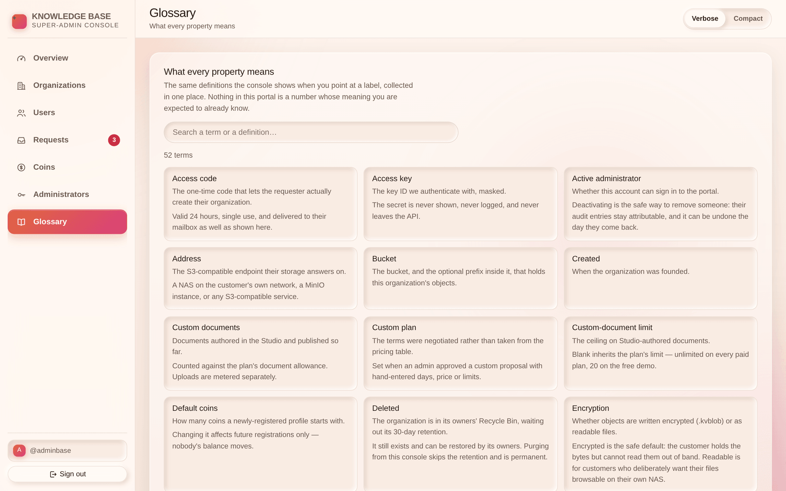
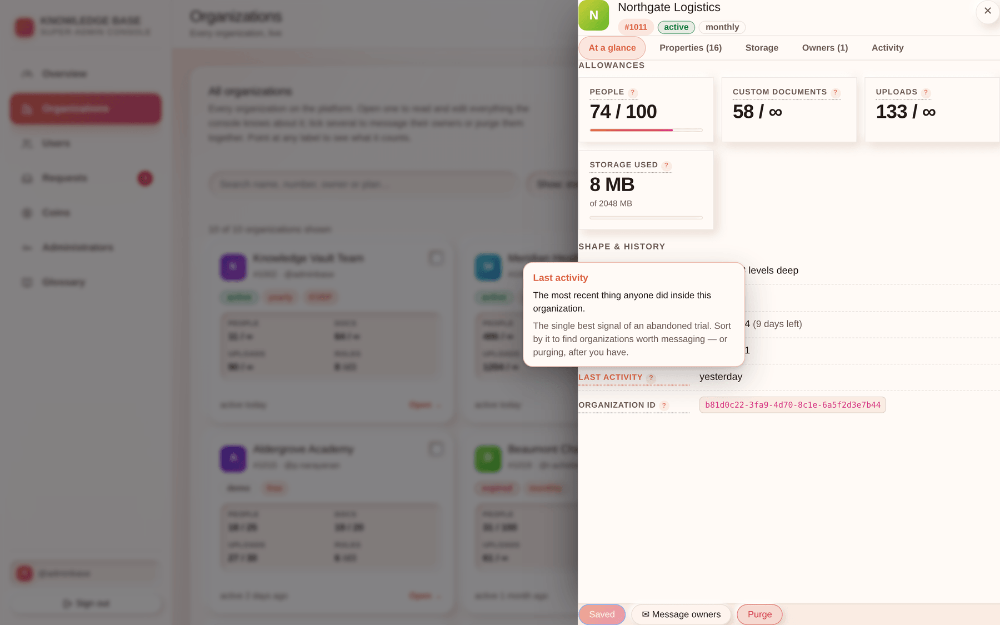

# Chapter 7 — The Glossary & definitions on hover

## What it is

Everything the console can show you is defined, once, in one register — and the console reads
from that register everywhere the term appears. Point at a label and you get the definition
there and then; open the **Glossary** section and you get all of them as a searchable page.

There is no separate list to keep in step. The hover card in the organization drawer, the label
on an Overview tile, and the entry in the Glossary are literally the same sentence.

---

## 1. Using a definition where you are

Any label with a **dotted underline and a small `?`** carries one.

| How | What happens |
|-----|--------------|
| **Point at it** | The card opens beside the label. |
| **Tab to it** | Same card — the keyboard is not a second-class route. |
| **Tap it** | On a touch screen, a tap opens it and a second tap closes it. |
| **Escape** | Closes it. |

Each card gives you the term, one sentence on **what it is**, and usually a second on **what
changing it does or costs** — which is the part that matters when your hand is already on the
field.

The card is drawn above everything else on the screen, so a definition inside a scrolling
drawer is never clipped by the drawer.

---

## 2. Using the Glossary section

Search matches the term, the short definition and the long one, so you can look something up by
what you half-remember about it rather than by its exact name. Fifty-plus terms, alphabetical.

Worth reading end to end **once**, on your first week. Everything after that is lookup.

---

## 3. The definitions that most often settle an argument

A few entries carry more weight than the rest, because they are the ones people get wrong:

| Term | The part that matters |
|------|-----------------------|
| **Custom documents vs Uploads** | Studio-authored documents and uploaded files are metered **separately**. A customer at their document limit may still have upload allowance left, and vice versa. |
| **A blank limit** | Means *inherit from the plan*, not zero. `0` is how you actually forbid something. |
| **Storage used** | Only counts bytes **we** hold. Content on an organization's own storage costs us nothing and is reported under Storage instead. |
| **Purge** | Permanent and immediate, bypassing the customer's 30-day Recycle Bin. Their own `.main` file is the only way back. |
| **Suspended** | Reversible, and it keeps their records. Deletion is neither. |
| **Owns an organization** | While true, the profile cannot be deleted at all — the platform refuses to leave an organization ungoverned. |
| **Last activity** | The single best signal of an abandoned trial, and the reason the Overview counts dormant organizations for you. |
| **Unreachable storage** | Not data loss. New uploads have nowhere to go until it returns. |

---

## 4. When a definition is missing

If a property arrives from the API that the register does not know, the console falls back to
whatever hint the API sent with it, and failing that says plainly that no definition has been
recorded yet. That is a bug, not a feature — **report it**, with the property name. A number in
this console that nobody can explain is exactly what the register exists to prevent.

---

## Tips

- **Point before you ask.** Most "what does this mean?" questions between administrators are
  already answered on the screen where they were asked.
- **Quote the definition to customers.** The wording is deliberately plain and deliberately
  honest about costs; it is safe to paste into a reply.
- **Compact mode does not hide definitions.** It hides the explanatory paragraphs on panels.
  Every `?` still works.
