# Knowledge Vault — The Main Guide Book

**A complete, plain-language guide to using Knowledge Vault, for the people who use it.**

Knowledge Vault is your organization's training and knowledge platform. It maps your company
as a living **constellation of roles**, delivers the right courses to the right people, keeps
a proper **library** of your documents, runs **exams** that mark themselves, and shows you —
in real time — who has completed what. Everything stays in **your** custody.

This book walks through every feature the way you actually meet it in the product, one chapter
at a time. Every screen shown here comes from a real sample organization, **Aurora Robotics**,
so you can follow along and recognise exactly what you'll see.


> **This book is for end users, owners and managers.** The Knowledge Base team's own console —
> approving requests, issuing codes, gifting coins, editing plans — is deliberately **not** in
> this book. It lives in the separate **Super Admin Guide Book**, held by that team.

---

## How to read this book

- **New to the platform?** Read Chapters 1–4 in order — they take you from creating a profile
  to understanding the constellation.
- **Setting up your company?** Chapters 3, 5, 6 and 16 cover founding an organization, building
  its structure, placing people, and safeguarding it.
- **Publishing knowledge?** Chapters 7, 8, 9 and 10 cover courses, the Studio, exams and the
  library.
- **A learner or team member?** Chapters 11 and 14 are for you — My Learning and the Mailbox.
- **A manager?** Chapters 12 and 13 cover Requests and Compliance — including why someone is
  not compliant, and how to reset an exam for them.
- **Paying for it — or just starting out?** Chapter 15 explains Knowledge Coins, the plan
  ladder, what the free plan includes, and how upgrading works.
- **Just want it to look right?** Chapter 17 covers themes and the navigation bar.
- **Wondering where the files actually go?** Chapter 20 walks through every storage
  arrangement end to end — NAS on your own hardware, the KVEP perk, and what is coming after.
- **Coming back after a while?** Chapter 21 is the dated record of what changed.

Each chapter is self-contained, with a short **"What it is"**, a step-by-step **"How to use
it"**, and **Tips** at the end.

---

## Table of contents

| # | Chapter | What you'll learn |
|---|---------|-------------------|
| 1 | Getting started — your profile | Register, sign in, manage your account |
| 2 | The big idea — core concepts | Constellation, roles, custody, classifications |
| 3 | Founding an organization | Create an org and set the Supreme password |
| 4 | The Constellation — your org map | Read, navigate and act on the star map |
| 5 | Building your structure | Roles, sub-groups, visibility |
| 6 | People & governance | Owners, members, least-privilege rights, username suggestions |
| 7 | Courses — publishing knowledge | Publish, classify and assign courses |
| 8 | The Document Studio | Build documents visually, block by block |
| 9 | Exams & assessment | Build a paper, set attempts, mark, and reset |
| 10 | The Library | Browse, filter and request courses |
| 11 | My Learning & the viewer | Complete your assigned courses; PDF zoom |
| 12 | Requests — ask & approve | The ask-and-approve centre |
| 13 | Compliance tracking | Who's done what, why they haven't, and how to nudge |
| 14 | The Mailbox | Folders, labels, priority, expiry and the chime |
| 15 | Plans, pricing & Knowledge Coins | Coins, the plan ladder, the free plan, access codes, upgrades |
| 16 | The Supreme zone — custody & recovery | Backups, `.main`, `.bkp`, the Recovery |
| 17 | Appearance & navigation | Themes, accents, and the icon-first nav bar |
| 18 | Flow diagrams — every setting at a glance | A diagram + screenshot for each owner action, member capability & request flow |
| 19 | Help & support | Where to find answers in-app |
| 20 | Where your documents live | NAS, the KVEP perk, and the storage backends still to come |
| 21 | What's new | A dated record of what changed |
| A | Appendix — Glossary & quick reference | Every term and code, at a glance |

---

## The one-minute summary

| You want to… | Go to |
|--------------|-------|
| Create a profile | **Register** — a username and password, no email |
| Found an organization | **Pricing** → request a plan → **Create organization** with your code |
| See your company's shape | **Constellation** |
| Add someone | Click their branch → **People** → **+ Add person** (type to see who exists) |
| Publish a document | Click a branch → **Courses** → **Upload** or **✍ Create in Studio** |
| Set an exam | **✍ Create in Studio** → *exam* |
| Do your training | **My Learning** |
| See who's behind | **Compliance** |
| Read what the platform told you | The **bell** — your Mailbox |
| Get your organization back | **Organizations** → **Recovery**, bottom-left |
| Change how it looks | The **palette** button, top right |
| Understand where your documents are stored | **Storage**, in the navigation bar |

---

## Downloading this book

The whole book is published as a single PDF —
**`Knowledge-Vault-Main-Guide-Book.pdf`** — in this folder, and from the platform's own
**Help** page, which always serves the current edition.

To rebuild the PDF after editing a chapter:

```bash
cd "Main Guide Book/tools"
npm install      # one-off: markdown-it, mermaid, sharp, playwright
node build-pdf.mjs
```

---

*Knowledge Vault — your structure, your knowledge, your custody.*

---

# Chapter 1 — Getting started: your profile

## What it is

Everything in Knowledge Vault begins with **one global profile**. That profile is a single
**username** and **password** — there is **no email involved**. Your username is your
identity across the whole platform: it's how administrators add you to an organization, how
your name appears on courses you author, and how you sign in from any device.

One profile lets you **join or found any number of organizations**. You never need a second
account.

---

## Creating your profile

From the welcome screen, choose **Get started free** (or **Create profile**). You'll see the
registration form:


Fill in three fields:

1. **Name** — your display name, shown to teammates (e.g. *Avery Stone*).
2. **Username** — your unique handle (e.g. *avery.stone*). Choose it carefully: this is the
   **exact** name an administrator types to add you to an organization. It must be at least
   3 characters.
3. **Password** — at least **10 characters**. You'll be asked to **retype it** to confirm
   you got it right — a safeguard you'll see every time you set or change a password on the
   platform.

Select **Create profile** and you're in.

> **Why retype-to-confirm?** Because there's no email-based password reset, the platform is
> careful to make sure you never lock yourself out with a typo. Every new-password field
> asks for confirmation.

New profiles are also credited with **Knowledge Coins** — 150 by default. You spend them on
the plan an organization runs on, and your balance is shown on the **Pricing** page.
Chapter 15 explains coins, plans and the free Demo plan in
full.

---

## Signing in

Returning users select **Sign in** and enter their username and password:


Your session stays signed in securely and refreshes itself in the background, so you're not
constantly asked to log in again.

---

## Managing your account

Open the **Account** page from the top navigation at any time:


Here you can:

- **See your profile** — display name, `@username`, and the date you joined.
- **Upload a profile picture** — choose any image; it's automatically resized to a small
  square, so it stays lightweight.
- **Jump to your organizations** with the **Open** button.
- **Read your messages from the Super Admin** — access codes, plan decisions and coin gifts
  land in their own panel here and stay for 30 days, so you can find your code any time
  (Chapter 15).
- **Delete your profile** from the **Danger zone**. Deleting removes you from *every*
  organization and cannot be undone, so the platform asks you to confirm.


---

## Tips

- **Pick a memorable username.** Administrators add people by exact username — if yours is
  hard to spell, you may be added incorrectly, or an admin may reserve the wrong handle.
- **You can be added before you register.** If an administrator enters a username that
  doesn't exist yet, it's *reserved*; the placement attaches automatically the moment you
  register with that username.
- **Switch light/dark theme and accent colour** any time from the palette control in the
  top-right corner — it's purely visual and personal to you.

**Next:** Chapter 2 — The big idea: core concepts →

---

# Chapter 2 — The big idea: core concepts

Before diving into individual screens, it helps to understand the five ideas that Knowledge
Vault is built on. Everything else in this book is an application of these.

---

## 1. An organization is a tree of roles

A Knowledge Vault organization isn't a flat list of employees — it's a **structure of
roles**, drawn as a top-down tree. At the very top sits one root role (in our sample,
*Executive Office*). Beneath it grow branches and sub-branches — *Engineering*, then
*Firmware Team* and *Robotics QA*, and so on.

**Knowledge flows down this tree.** A course placed on a role can be set to **inherit** to
every branch beneath it, so publishing once at the right level reaches everyone below
automatically.


---

## 2. People are placed on roles, as owners or members

Every person in an organization occupies one or more **positions** on the tree. Each
position is one of two kinds:

- **Member** — they *learn* from that branch. Courses reaching that role appear in their
  **My Learning**.
- **Owner** — they *manage* that branch: add people, publish courses, create sub-groups,
  and so on. An owner is a manager for their part of the tree.

A single person can hold several positions — e.g. an owner of *Engineering* who is also a
member of a company-wide *Safety* branch.

---

## 3. Least-privilege governance

Ownership is not all-or-nothing. Owners hold **only the specific rights they've been
granted** — for example, "may create sub-groups" or "may appoint co-owners" — and, crucially,
**an owner can never grant a right they don't hold themselves**. This keeps authority
flowing safely down the tree and prevents anyone from quietly escalating their own power.

Deleting a branch needs sign-off from the level above; branches are **public by default**
but can be **hidden**, cascading privacy down the subtree. Chapter 6 covers all of this.

---

## 4. Custody — your data is yours

Knowledge Vault is built so that the platform **holds nothing it could hold hostage**. The
top of every organization is protected by a **Supreme password** that only you know — the
platform stores no copy. That password:

- authorises owner-level changes to the top of the structure, and
- encrypts your organization's **`.main` file** — the single, offline key that can revive
  your organization even after it's been deleted and purged.

If you ever leave the platform, your `.main` file (and per-branch `.bkp` backups) mean your
structure and knowledge remain **in your custody**, not locked inside someone else's system.
Chapter 14 covers this in full.

---

## 5. Standardized, classified documents

Every piece of knowledge you publish is treated as a proper document. On publish, Knowledge
Vault automatically wraps it in a **standard cover** (organization, title, version, date,
author), a **scope page**, and a header/footer — so every document looks consistent and
auditable.

Every document also carries a compulsory **classification**:

| Classification | Meaning |
|----------------|---------|
| **Public** | Anyone in the org may see it |
| **Confidential** | Sensitive; shared on a need-to-know basis |
| **Private** | Restricted to a specific group |
| **Secret** | The most tightly held material |

You'll see these classification badges throughout the library, courses and viewer.

---

## The vocabulary you'll meet

| Term | Quick meaning |
|------|---------------|
| **Constellation** | Your organization drawn as a star map of roles |
| **Role / branch / node** | A position in the tree (used interchangeably) |
| **Owner** | Manages a branch |
| **Member** | Learns from a branch |
| **Course** | Any published knowledge — document, book, link, audio or video |
| **Supreme** | The protected root of your org, guarded by the Supreme password |
| **Request** | A formal ask that someone with authority approves |
| **Classification** | The sensitivity label every document must carry |

A fuller glossary is in the Appendix.

**Next:** Chapter 3 — Founding an organization →

---

# Chapter 3 — Founding an organization

## What it is

Founding an organization creates a brand-new constellation with **you as its first owner**
and sets its **Supreme password** — the single most important credential in Knowledge Vault.
This is how a company, team or department comes into existence on the platform.

> **You need a plan and an access code first.** Every organization runs on a plan, and
> creating one needs a one-time 8-character code from the Knowledge Base team. Pick a plan on
> the **Pricing** page (the free **Demo** plan costs nothing), and your code arrives in your
> notifications. Chapter 15 walks through it end to end.

---

## Your organizations home

The **Organizations** page lists every organization you belong to. Each card shows the
organization's name, its number (e.g. `#100`), and your position inside it.


From here you can:

- **Open** any organization by selecting its card.
- **Create organization** — the button in the top-right.
- **Revive a deleted organization from a `.main` file** — the expandable option at the
  bottom (covered in Chapter 14).

---

## Creating the organization

Select **Create organization** to open the founding form:


The page has the founding form on the left and a **plan chooser** on the right — your coin
balance, every plan, and a button to request one without leaving the page.

Fill in the fields:

1. **Access code** — the 8-character code the Knowledge Base team sent you (it's in your
   notification bell and on your Account page). It's valid for 24 hours and works once.
2. **Organization name** — your company or team name (e.g. *Aurora Robotics*).
3. **Organization logo** — optional. Upload a square-ish image and it appears on your
   organization card and on every document you publish. Skip it and Knowledge Vault draws a
   badge from the first letter of your name instead, in a colour picked for your
   organization — so you never end up with a blank square.
4. **First role name** — the name of the top role you'll occupy. This is the root of your
   whole structure. Common choices: *Owner*, *CEO*, *Principal*, *Executive Office*.
5. **Supreme password** — at least **12 characters**. Retype it to confirm.
6. **Where your documents will live** — see the next section.

## Where your documents will live

Knowledge Vault always keeps your structure, your people and your records. Your **documents
themselves** are a separate question, and the founding form asks it.

**NAS — your own storage.** The normal choice. Your documents live on hardware you own and
control: the space is yours, the running cost is yours, and you can walk away with everything
at any time. You enter the address, the bucket and an access key, then press **Test
connection** — Knowledge Vault writes a test file, reads it back, checks the bytes match,
confirms the storage isn't readable by the public, and cleans up after itself. It tells you
exactly which of those steps failed if one does.

You also choose here whether documents are **encrypted** on your storage. Encrypted is
recommended and means nobody can open them from the storage itself — not even your own IT —
only through Knowledge Vault, or with your `.main` file and Supreme password. The alternative
keeps them as ordinary browsable files. **This choice is fixed once storage is connected**,
because changing it means re-encrypting everything you have stored.

If you don't have a NAS, the setup guide in the repository walks through turning a folder on
an ordinary laptop into one, so you can try the whole thing before buying hardware.

**KVEP — Knowledge Vault Employee Perk.** Reserved for Knowledge Vault staff. Documents stay
on Knowledge Vault's own storage with nothing to set up, and the plan's storage allowance
applies as usual. It needs a **super-admin username and password**, entered both when the
access code is requested and again when the organization is created — which is what keeps the
perk internal. An ordinary access code will not create a KVEP organization, and a KVEP code
will not create an ordinary one.


> **Want the whole picture before you decide?**
> Chapter 20 — Where your documents live walks
> through each arrangement step by step, says exactly what stays with us and what goes to you,
> and lists the storage backends still to come. The public **Storage** page in the navigation
> bar carries the same material.

### The Supreme password — read this carefully

The form shows a prominent warning, and it means every word of it:

> **This password cannot be recovered. By anyone. Ever.**

The platform stores **no copy** of your Supreme password. It is used to:

- protect owner-level changes to the top of your structure, and
- encrypt your organization's `.main` revival file.

If it is lost, changing the owner structure and reviving a deleted organization become
**permanently impossible**. Because of this, you must tick the acknowledgement box —
**"I understand the Supreme password is unrecoverable"** — before you can continue.

Select **Create organization**, and you'll land on your new, empty constellation with a
single star: your top role, with you as its owner. The platform checks your code, deducts the
plan's coins, and starts the plan's countdown — visible from then on as the chip above the
organization's card.

---

## Tips

- **Store the Supreme password somewhere durable and offline** — a password manager or a
  sealed record. Treat it like the master key to a safe, because that's exactly what it is.
- **Choose the top role name thoughtfully.** It's the label everyone sees at the crown of
  your constellation. You can grow everything else beneath it later.
- **You don't need everything ready on day one.** Found the org first; add roles, people and
  courses whenever you're ready — the next chapters show how.
- **Trying the platform out?** Found a **Demo** organization — free, full-featured, 2 months,
  up to 10 people — and rehearse there before you build the real one
  (Chapter 15).

**Next:** Chapter 4 — The Constellation: your org map →

---

# Chapter 4 — The Constellation: your org map

## What it is

The **Constellation** is your organization's main page — the home you land on when you open
an org. It draws your entire structure as a **top-down star map**: the top role at the crown,
branches spreading downward, connected by glowing links. It's beautiful, but it's also
functional: this single screen is where owners do almost everything.


---

## Reading the map

- **The diamond at the top** is your root role. Bigger, brighter stars sit higher in the
  structure.
- **Lines** connect each role to its parent — knowledge and authority flow down these lines.
- **Your own positions glow brighter**, and your reporting path (the chain from you up to
  the top) is highlighted so you can always find yourself.

The **legend** in the bottom-right explains every marker:

| Marker | Meaning |
|--------|---------|
| ◆ Gold diamond | Your role — as an **owner** |
| ● Bright dot | Your role — as a **member** |
| ● Ringed dot | A role **on your reporting path** |
| ○ Dashed ring | A **public branch** you can ask to join |
| · Faint dot | Another role you're not part of |

---

## Moving around

The hint at the top of the stage says it all: **drag to pan · scroll or pinch to zoom ·
click a star to act on it.**

- **Drag** anywhere to pan the map.
- **Scroll or pinch** to zoom in and out.
- Use the **+ / − and reset** buttons in the bottom-left for precise control.
- Live updates mean that when anyone changes the structure, your map updates **instantly** —
  no refresh needed.

---

## Acting on a star

**Click a star to open its action panel.** What you can do depends on your relationship to
that role:

- **A role you govern** → the full action panel opens (see below).
- **One of your own positions** → a short panel with a link to your **My Learning**.
- **A public branch you're not in** → an option to send a **Join request**.
- **A role you have no access to** → the app simply tells you so; it never sends you
  somewhere unexpected.

When you click a role you govern, you first see a **section chooser** — "What do you want to
do here?" — with four options:


| Section | What it's for |
|---------|---------------|
| **Group configuration** | Visibility, sub-groups, deletion — and the Supreme zone on the root |
| **People** | The owners and members of this branch |
| **Courses** | Publish and configure knowledge for this branch |
| **Backup** | Export or restore this branch as an encrypted `.bkp` |

The panel header also shows quick counts — how many owners, members and sub-roles the branch
has. The next chapters take each of these sections in turn.

---

## Tips

- **Everything happens on the constellation.** There's no separate "admin console" — clicking
  a star is how owners manage their part of the organization.
- **Can't find yourself?** Your positions glow and your path is lit; zoom out with the reset
  button to see the whole picture, then follow the highlight.
- **The map is shared and live.** If a colleague adds a role while you're looking, it appears
  on your screen the moment they save it.

**Next:** Chapter 5 — Building your structure →

---

# Chapter 5 — Building your structure

## What it is

Your structure is the shape of your organization — the roles and sub-roles that knowledge
and people hang from. You grow and shape it from the **Group configuration** section of any
role you govern. This chapter covers **sub-groups**, **visibility**, and **deleting a
branch**.

Open it by clicking a star you govern on the constellation, then choosing **Group
configuration**.


---

## Adding a sub-group (sub-role)

Branches only ever grow **downward**. To add a new role beneath the one you're on:

1. In **Group configuration**, find the **Sub-groups** row.
2. Select **+ Sub-role**.
3. Enter the new role's name (e.g. *Firmware Team* under *Engineering*).
4. Optionally tick **Hidden (private)** to make the new branch private from the start
   (see visibility below).
5. Select **Create**.


The new star appears immediately on the constellation, connected beneath the current role.

> You'll only see the **+ Sub-role** option if you hold the *"may create sub-groups"* right
> on that branch. Least-privilege governance (Chapter 6) decides who can grow the tree.

---

## Visibility: public by default, hidden on purpose

Every branch is **public by default** — meaning every member of the organization can see it
and send a **Join request** to it. You control this with a single checkbox:

- Leave it unticked → the branch is **public**.
- Tick **Hidden (private) branch** → the branch is hidden from people on the same layer and
  below. Hiding cascades: **everything beneath a hidden branch is hidden too**, all the way
  down.

Two important rules:

- **Owners above a hidden branch always keep seeing it.** Hiding never blinds the people
  responsible for that part of the tree.
- If your branch is marked public but a **level above** is hidden, your branch stays hidden
  too. In that case the panel tells you, and — if you have the right — offers a **Request
  visibility** button to ask the level above to unhide the chain.

In the sample *Aurora Robotics*, the **Research Lab** branch is hidden — it doesn't appear
to ordinary members, only to the executives above it.

---

## Deleting a branch

A branch can be removed only when it is **completely empty** — no sub-roles and no people.
How you delete depends on your authority:

- **If you own the level above**, you can delete the branch **directly** — the **Delete**
  button appears in Group configuration.
- **If you own the branch itself** (but not the level above), deletion needs sign-off. You'll
  see **Request deletion** instead, which files a **Deletion request** with the level above;
  they approve or reject it from their Requests inbox (Chapter 11).

The platform always confirms before deleting.

---

## Flows at a glance

**Creating a sub-role:**

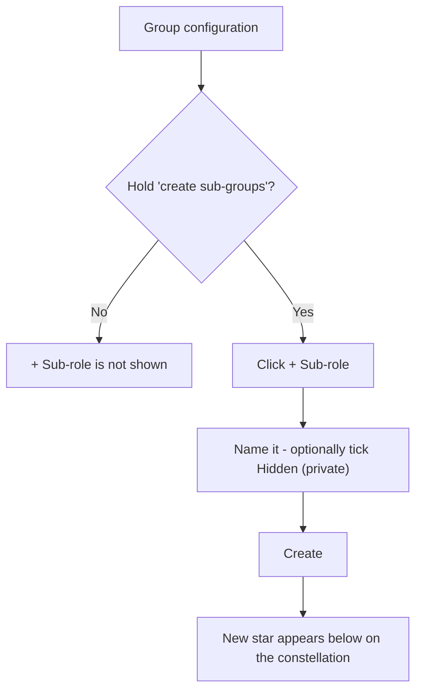

**Setting visibility:**

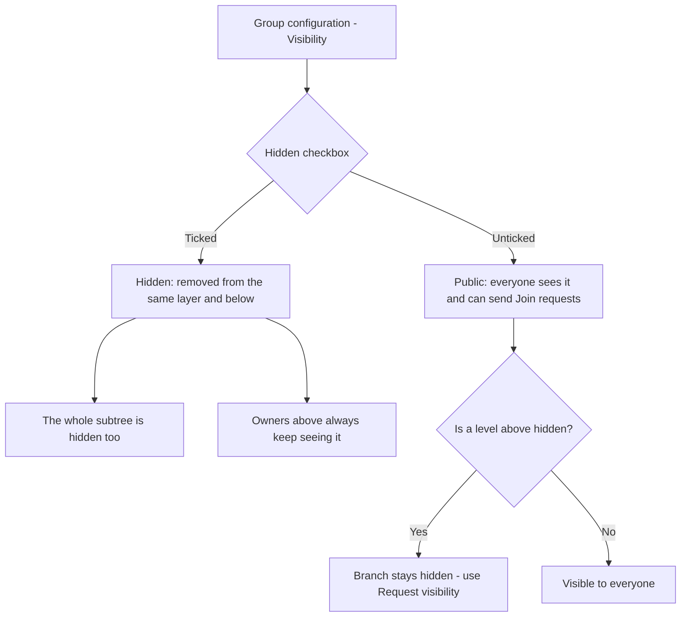

**Deleting a branch:**

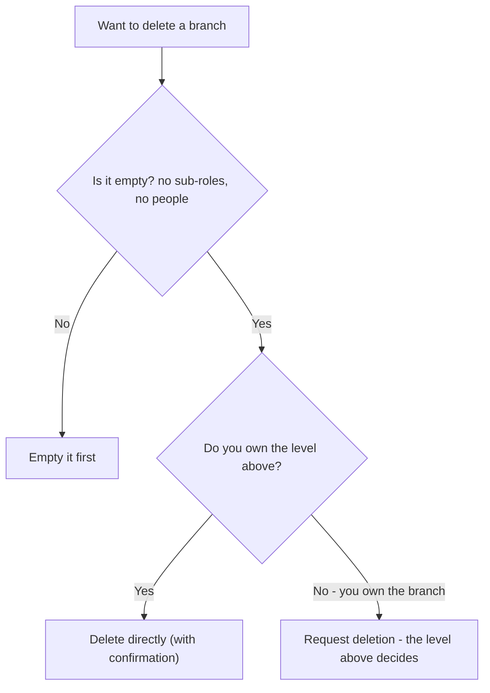

---

## Tips

- **Design top-down.** Create the big divisions first (Engineering, Operations, People), then
  add teams beneath them. Courses placed high can inherit down to everything you add later.
- **Use hidden branches for sensitive teams** — a security team, an M&A workstream, an
  unannounced project. Remember the whole subtree inherits the privacy.
- **Empty before you delete.** Move or remove people and sub-roles first; the branch must be
  empty for deletion to succeed.

**Next:** Chapter 6 — People & governance →

---

# Chapter 6 — People & governance

## What it is

The **People** section of a role is where you place and manage the humans on that branch —
its **owners** (who manage it) and its **members** (who learn from it). It's also where
Knowledge Vault's **least-privilege governance** becomes concrete: you decide exactly which
rights each owner holds.

Open it by clicking a role you govern, then choosing **People**.


The panel groups people into **Owners** and **Members**, each with a count, and gives every
person a card with their name, `@username`, and any special rights shown as small green
chips.

---

## Adding a person

1. Select **+ Add person**.
2. Choose whether to add **a member** ("they learn from this branch") or **a co-owner**
   ("they help manage this branch"). The co-owner option only appears if you're allowed to
   appoint co-owners.

   

3. Enter their **username**.
   - Unknown usernames are **reserved** — when that person registers, they're attached
     automatically.
4. Set any rights (see below), then confirm.

If something goes wrong (for example, a typo'd username), the form stays open and tells you —
it never closes silently.

### How many people you can add

Your organization's **plan** sets how many people it may hold. The count is per **person**,
not per position — placing someone who is already in the organization onto another role costs
nothing. Only a brand-new face uses a seat.

When the organization is full, adding someone (or approving their Join request) is refused
with the reason:

> *This organization's plan allows up to 250 members. Upgrade the plan to add more.*

Nobody is removed and nothing breaks — you either free a seat or move to a bigger plan. See
Chapter 15 for the limits each plan carries.

---

## The two kinds of person

### Members
Members receive the branch's courses in their **My Learning**. You can additionally grant a
member the right to **create content** — meaning they can *propose* documents. Their
documents don't go live immediately; they publish only after an owner approves them through
**Document review** (see Chapter 7). In the sample, *Marco Diaz* is a Firmware member with
this content-creation grant.


### Owners (and co-owners)
Owners manage the branch. When you appoint a co-owner, you choose which rights they get —
and here's the golden rule of the whole platform:

> **You can only grant a right you hold yourself.** An owner can never hand out a capability
> they don't have.

The grantable rights are:

| Right | What it lets the owner do |
|-------|---------------------------|
| **May create sub-groups** | Grow the branch downward with new sub-roles |
| **May appoint further co-owners** | Add other owners to the branch |
| **May create content** *(members)* | Propose documents for manager review |

When you add a co-owner, you tick only the rights you want them to hold — and you'll only be
*offered* the rights you hold yourself:


In the People panel, these appear as chips like **sub-groups** and **appoints co-owners** on
an owner's card — in the screenshot, *Priya Raman* holds both.

---

## Managing existing people

Each person's card carries quick actions:

- **Toggle their rights** — e.g. *Allow / Revoke sub-groups*, *Allow / Revoke co-owner
  rights*, or *Allow / Revoke content* for members. Changes take effect immediately.
- **Remove** — take the person off this branch (with a confirmation). Removing someone from a
  branch doesn't delete their profile or their other positions.

---

## Flows at a glance

**Adding a person (member or co-owner):**

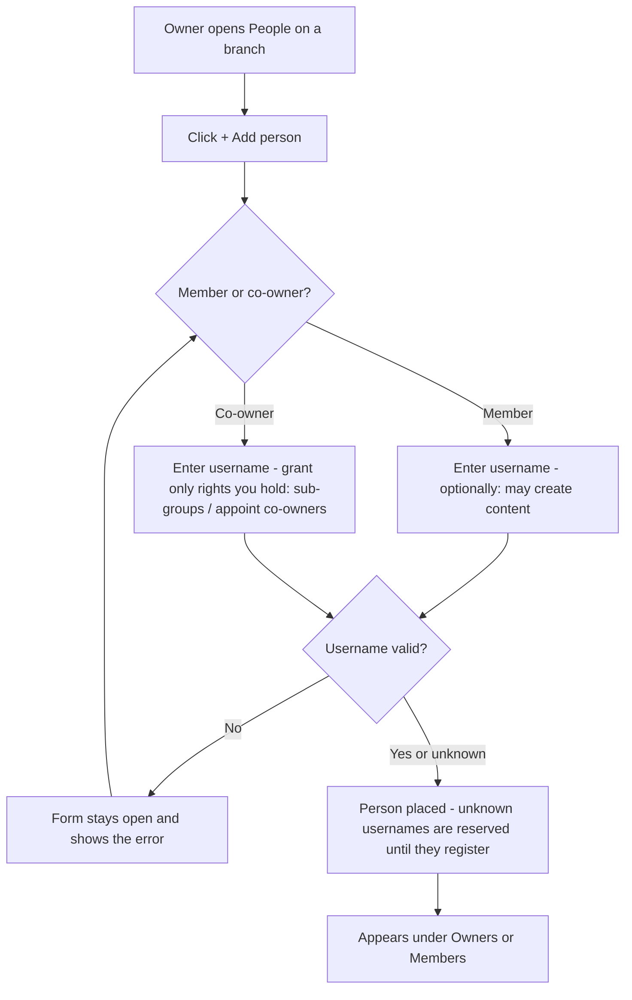

**Least-privilege granting (the golden rule):**

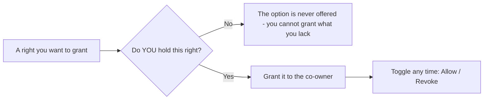

**A member proposing content:**

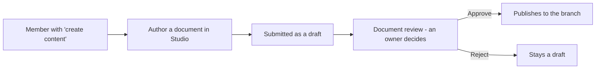

---

## Tips

- **Grant the minimum that gets the job done.** A team lead who only needs to add members
  doesn't need the "appoint co-owners" right. Least privilege keeps your structure safe.
- **Delegate downward.** Give division owners the "create sub-groups" right so they can build
  out their own teams without coming back to you.
- **Content rights are powerful but safe.** Letting a member create content speeds up
  authoring, and the mandatory review step means nothing publishes without an owner's
  approval.

**Next:** Chapter 7 — Courses: publishing knowledge →

---

# Chapter 7 — Courses: publishing knowledge

## What it is

A **course** is any piece of knowledge you publish to a branch — a document, a book, an
external link, an audio file or a video. Courses are the heart of Knowledge Vault: you place
them on roles, decide whether they're mandatory, and let them **inherit** down the tree so
the right people are trained automatically.

Open the **Courses** section by clicking a role you govern, then choosing **Courses**.


The panel has two parts: buttons to **add** a course, and a list of the **courses already on
this role**, each shown with its code, type, classification and placement settings.

---

## Publishing a course

You have two ways to create one:

- **+ Upload course** — bring in an existing file, or point to an external URL.
- **✍ Create in Studio** — build an interactive document from scratch (Chapter 8).

Above the two buttons a line shows what your organization's plan still allows: how many
**custom documents** (built in the Studio) and **uploads** have been used. The free demo
structure includes **20 custom documents** and **30 uploads**. When an allowance is used up,
the button explains it and points you at your organization's main administrator, who can
arrange a premium plan with the Knowledge Base team — or you can free capacity by deleting
material that is no longer required.

Choosing **Upload course** opens a form:


The key fields:

| Field | What it does |
|-------|--------------|
| **Title** | The course name (also the document's cover title) |
| **Short description** | One or two sentences — shown in the library and on the cover |
| **Scope** | Who it applies to and what it covers — added to the standard cover |
| **Classification** *(required)* | Public / Confidential / Private / Secret |
| **Library shelf (category)** | A tag like *Compliance*, *Safety*, *Engineering* |
| **Kind** | Document, Book, Link, Audio or Video |
| **External URL** *or* **File** | The content itself (a link, or a file up to 10 MB) |
| **Deadline (days)** | How long people have to complete it |
| **Retake every N days** | For recurring/annual training |
| **Prerequisite codes** | Courses that must be completed first |

There are also checkboxes for **Allow download**, **Publish to the library**, **Mandatory**,
**Inherit to lower branches**, and **Updates reset completion**.

> **Smart shelf suggestions:** as you type a title and description, Knowledge Vault suggests
> an existing library shelf where similar content already lives — so related material stays
> together. You can always accept the suggestion or keep your own tag.

Select **Publish course** and it appears on the branch, in members' My Learning, and (if you
chose) in the library.

---

## Placement settings: mandatory & inherit

Every course on a role shows two toggles you can flip any time:

- **mandatory ✓ / opt-in** — whether people *must* complete it, or may choose to.
- **inherits ↓ ✓ / this role only** — whether the course reaches every branch beneath this
  role, or stays put.

This is how one course, placed once at *Executive Office*, can become mandatory training for
the whole company. In the sample, **Code of Conduct & Ethics** and **Information Security
Essentials** are both mandatory and inherit down from the top.

Other actions per course: **Unplace** (remove from this branch only — the course still exists
elsewhere), **Archive** (keep it but stop new assignments), and **Delete** (remove it
everywhere; completion history is preserved).

---

## Classifications

Every course must carry a classification, shown as a coloured badge everywhere it appears:

| Badge | Classification | Typical use |
|-------|----------------|-------------|
| 🟢 **Public** | Public | Anyone in the org |
| 🟡 **Confidential** | Confidential | Need-to-know |
| 🟣 **Private** | Private | A specific group |
| 🔴 **Secret** | Secret | The most sensitive material |

---

## Members proposing content

If you granted a member the **create content** right (Chapter 6), the documents they author
arrive as a **draft** and enter **Document review**. As an owner, you approve or reject the
draft; only on approval does it publish. This lets teams contribute knowledge while keeping
a manager in the loop.

---

## Flows at a glance

**Publishing a course:**

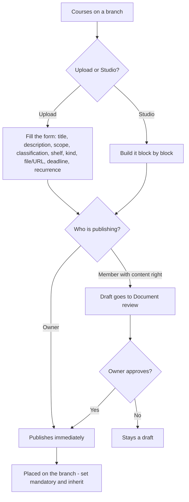

**Configuring a placed course (owner controls, anytime):**

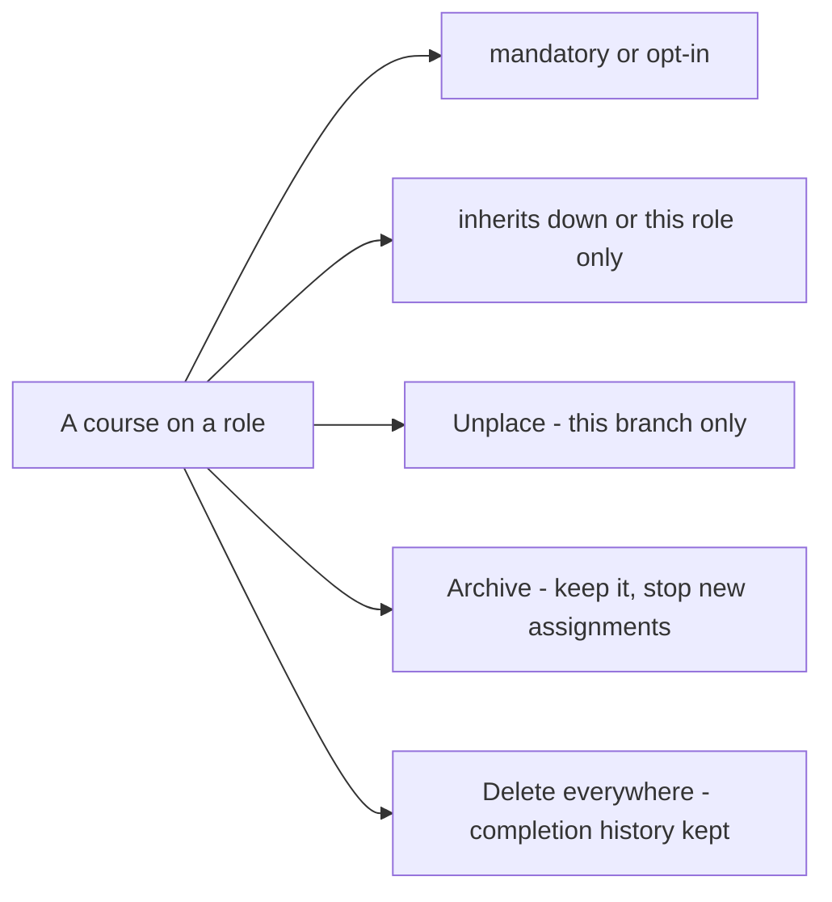

---

## Tips

- **Place high, inherit down.** For company-wide training, publish once at the top with
  *inherit* on — you won't have to repeat yourself for every team.
- **Use deadlines and recurrence for compliance courses.** A 14-day deadline plus an annual
  retake keeps mandatory training current, and feeds the Compliance dashboard (Chapter 12).
- **Prerequisites build learning paths.** Require *Embedded C Best Practices* before the
  *Firmware Release Checklist*, and people are guided through in the right order.

**Next:** Chapter 8 — The Document Studio →

---

# Chapter 8 — The Document Studio

## What it is

The **Studio** is a full document editor built into Knowledge Vault. Instead of uploading a
file, you compose a document right in the browser from **blocks** — headings, rich text,
tables, checklists, callouts, quotes, code, images, audio and video, buttons, columns and
page breaks — format them exactly as you want, and watch them render live in your
organization's standard document frame.

You reach the Studio from a role's **Courses** panel via **✍ Create in Studio**, or from any
of your own positions via **✍ Propose a document**.


---

## The front door: what are you creating?

The Studio asks one question before it opens anything:

- **Document** — the block editor described in this chapter.
- **Test / exam** — a multiple-choice paper people sit, marked against a pass mark. See
  *Building an exam* below.

Underneath sits **Continue a draft**, which lists unfinished work in the two places it can
live:

- **On this browser** — whatever you last had open here. Kept as you type, on **every plan**,
  on this device only. A reload or a crash never costs you your work.
- **Saved drafts** — work you parked on the server with **Save draft**. It belongs to your
  account, carries the branch it was written for, and opens on any device you sign in from.
  Parking work on the server is part of a **paid plan**; on the free plan the section says so
  and **Save draft** is locked in both editors.

Selecting any entry reopens it in the editor that wrote it, exactly where you left off. The
✕ beside a saved draft deletes it from the server.

---

## The layout

The Studio has four parts:

1. **The ribbon (top)** — formatting for whatever you are writing in: paragraph style, font,
   size, **bold**, *italic*, underline, strikethrough, **text colour**, **highlight**,
   alignment, bulleted and numbered lists, indenting, links, clear formatting, undo/redo and
   zoom.
2. **The left rail** — three tabs:
   - **Insert** — every block you can add. Click to append it, or drag it onto the page and
     drop it exactly where you want. The table entry has a size picker: hover the grid and
     click, e.g. 4 × 3.
   - **Pages** — the document's pages. Jump to a page, name it, choose its **turn animation**,
     add a page, or remove a page break.
   - **Drafts** — documents you parked on the server (see *Saving your work* below).
3. **The canvas (middle)** — your document as a stack of cards that look like the printed
   page. Hover a card for its rail: drag handle (⠿) to move it, ↑ ↓ to nudge it, ⧉ to
   duplicate, ⇄ to **turn it into** another kind of block, ✕ to delete.
4. **The inspector (right)** — two tabs:
   - **Format** — everything about the selected block: alignment, width and position,
     padding and spacing, text colour, fill, accent, line height, letter spacing, border,
     shadow, corner radius and an **entrance animation** that plays as the reader scrolls to
     it. Media blocks also get their playback settings here.
   - **Document** — the document itself: classification, type, library shelf, description
     and scope (these become the cover pages), where it is placed, and how much of your
     plan's document allowance is left.

The note at the top of the canvas is a reminder: **cover, classification header and footer
are added automatically when you publish.** You focus on content.

---

## The blocks

| Block | Use it for |
|-------|-----------|
| **Heading** | Section titles, six levels |
| **Text** | Rich paragraphs — colour, highlight, alignment, lists, links |
| **Checklist** | Steps to tick off, each with an optional hint |
| **Callout** | A highlighted note in one of six tones |
| **Quote** | A pull quote with its source |
| **Code** | A monospaced snippet, stored exactly as typed |
| **Table** | Rows and columns you edit like a sheet |
| **Contents** | A table of contents, built from your own headings |
| **Collapsible** | Expandable panels — FAQs, clauses, optional detail |
| **Image** | A picture with a caption |
| **Audio / video** | A player with speed, quality and skip rules |
| **Embed** | YouTube, Vimeo, Drive, Docs, Sheets, Slides, Forms, Maps, Calendar |
| **Button** | A call-to-action link |
| **Columns** | Two to four side-by-side sections |
| **Divider / Spacer** | A section break, or breathing room |
| **New page** | A page break, with its own turn animation |

---

## Moving things around

Everything on the page moves by dragging, with a mouse, a pen or a finger:

- **Add a block** — drag it from the **Insert** rail onto the page. A coloured line shows
  exactly where it will land; let go and it drops there. Clicking the entry instead adds it
  at the end.
- **Move a block** — grab the **grip strip down its left edge** (or the ⠿ button in its
  toolbar) and drag. The block you are carrying rides along with the pointer as a small
  label, so you always know what is moving.
- **Reorder pages** — drag the page cards in the **Pages** tab.
- **Rebalance columns** — drag the divider between two columns.
- Drag near the top or bottom of the window and the page **scrolls by itself**. Press
  **Esc** mid-drag to cancel and put everything back.

---

## Tables that behave like a spreadsheet

Select a table block and you get a real grid:

- **Column headers (A, B, C…)** — click one for a menu: insert a column left or right, set
  its width, or delete it. **Row numbers** do the same for rows.
- **+ Row / + Column** buttons, and a **+** at the end of the grid.
- **Select a range** — click a cell, then shift-click another — and format the whole
  selection at once: bold, italic, alignment, or a fill colour.
- **Paste a block of data** copied from a spreadsheet (or any tab- or comma-separated text)
  into a cell and it fills the grid, expanding it as needed.
- **Table options** along the bottom: header row, header column, banded rows, compact
  spacing, frozen header, border style and a caption.
- **Turn text into a table** — select a paragraph or checklist, press ⇄ and choose *Table*.
  Each line becomes a row. The same menu turns a table back into a checklist.

**Tab** moves to the next cell, **Enter** to the next row (adding one when you reach the
bottom), and the arrow keys move up and down.

---

## Audio and video that behave the way training material should

Add an **Audio / video** block, paste the address, then open the inspector's **Format** tab:

- **Speed control** — offer the reader 0.5× to 2×, and set the speed it starts at.
- **Quality ladder** — add a rendition per quality (1080p, 720p, low data). The reader
  switches between them from the player and keeps their place.
- **Skip control** — turn *Reader may skip ahead* **off** for material that must genuinely be
  watched: rewinding stays allowed, but jumping past the furthest point actually watched is
  refused, and the player shows a **🔒 no skipping** badge.
- **Watched-in-full marker**, poster image, captions file, a **clip window** (start and end
  seconds), autoplay, loop, start muted, and whether the browser's download control appears.

---

## Embedding other things

The **Embed** block frames content from the tools an organization already uses: YouTube,
Vimeo, Google Drive, Docs, Sheets, Slides, Forms, Maps and Calendar. Paste the ordinary
share link and it appears in the document.

Other addresses are refused on purpose. The platform only frames hosts it knows, and it
rebuilds the address itself before storing it, so a document can carry a briefing video or
a sign-up form without carrying anything else into the vault.

---

## Themes and templates

- **Templates.** A new document offers a starting point — *Policy*, *Procedure*, *Handbook*,
  *Training*, *Announcement* — each a real document with its sections already in place. Pick
  one and edit; nothing is locked.
- **Themes.** The inspector's **Document** tab sets the look of the whole document at once:
  type pairing, accent colour, paper, density, how headings are set, and the page width. The
  theme travels with the document, so readers see exactly what you chose.

---

## Pages and motion

Every **New page** block starts a new page, and carries the animation the page arrives with —
fade, slide, push, flip, zoom or reveal. Readers turn pages with the ← → keys in the viewer.
Individual blocks can also have an **entrance animation** that plays when the reader scrolls
to them. Readers who ask their device for reduced motion get the document without animation,
automatically.

---

## Three ways to look at your document

- **✎ Edit** — the editor.
- **👁 Preview** — the finished document inside the standard frame: classification banner,
  cover, description and scope.
- **▷ Present** — a full-screen, page-by-page presentation. Turn pages with ← →, leave with
  **Esc**.

Preview also has a **device switcher** — desktop, tablet, phone — so you can check the
document reads properly on the screen your colleagues will actually open it on.

---

## Saving your work

Work in progress lives in two places, and both editors behave the same way:

- **This browser — always, on every plan.** What you are writing is kept here as you type, so
  a reload or a crash never costs you your work. It is this device only, and it holds one
  document and one exam per branch.
- **The server — Save draft, paid plans only.** Parks the whole thing (content *and* its
  publish settings) under your account, so you can close the laptop and pick it up anywhere.
  Reopen it from the **Drafts** tab inside the editor, or from **Continue a draft** on the
  Studio's front door. On the **free plan** the button shows a padlock and explains the
  capability; ask your organization's main administrator to arrange an upgrade. Nothing is
  lost meanwhile — the browser copy is still there, and you can publish at any time.

Neither copy is visible to anyone else. A draft becomes something colleagues can see only
when you publish it (or submit it for review).

Keyboard: **Ctrl + Z** undo, **Ctrl + Shift + Z** redo, **Ctrl + S** save draft.

---

## Publishing

1. Add and format your blocks.
2. Open the inspector's **Document** tab and set the **title**, **classification**
   (compulsory), **description** and, if useful, the **scope** and library shelf.
3. Check **Preview**.
4. Select **Publish**.

- **Owners publish directly** — the document goes live on the branch straight away.
- **Members with the content grant submit for review** — the document becomes a draft that
  an owner approves before it publishes (see Chapters 6 and 7).

Your plan includes a number of **custom documents**; the status bar and the inspector show
how many are left. When the allowance is used up, the Studio says so and points you at your
main administrator, who can arrange a premium plan.

---

## Building an exam

Choosing **Test / exam** at the front door opens the same room with a form in the middle: an
ordered list of questions instead of a page of blocks. Everything *around* it is unchanged —
the exam is a course with the same code, classification, description, library shelf and
placement switches a document has, and a member's exam goes through the same review.

**The questions.** Each card has its type, the question, an optional helper line, and its
answer options with the right one(s) ticked:

| Type | Answering |
|------|-----------|
| **One answer** | Exactly one option is right |
| **Several answers** | The whole set must be picked — half an answer is not a right answer |
| **True / false** | A statement to judge |

The card tells you what is still missing ("no correct answer marked"), and the left rail
lists every question so you can jump around and reorder.

**The rules** (inspector → **Exam**):

- **Pass mark** — the percentage needed to pass, shown as the marks it works out to.
- **Marks** — every question counts the same by default. Switch on **unequal weights** and
  each card gains a marks box.
- **Answer feedback** — whether the candidate is told if an answer is right: **as they
  answer** (live, question by question), **after submitting**, or **never**. Separate
  switches show which option was right, your explanation, and the score.
- **Delivery** — randomise the question order and/or the options, one question per screen, a
  time limit, and how many attempts each person may take.

**Trying it.** **▷ Try it** sits your own paper exactly as a candidate would. It is marked in
your browser and recorded nowhere, so try it as often as you like.

**Sitting it.** Members open the exam from My Learning like any other course, inside the
standard document frame. Marking happens on the server — the answers never travel to the
candidate's browser — and an exam is completed by **passing** it, not by ticking it off.

**Exam conditions.** A candidate's paper opens on the **whole screen** and stays there: if
they leave full screen, the paper is covered until they come back. Leaving the exam
altogether — another tab, another window — for more than **five seconds** is counted:

| Interruption | What happens |
|---|---|
| 1st | The paper is covered: *"You left the exam — warning 1 of 2."* |
| 2nd | The same, with the warning that the next one ends it. |
| 3rd | The paper is **handed in automatically** and marked on whatever was answered. |

The rules are stated on the exam's start screen, before anyone begins, and each attempt
records how often the candidate left. Your own **▷ Try it** run is not policed — only real
sittings are.

---

## Revising something you already published

Documents and exams built in the Studio can be revised by the people who answer for them:
the course's editors, the **branch's owner**, and the **owners above them**. Because readers
are on the current edition, the order is fixed — and the Studio walks you through it.

From the branch's **Courses** panel, each Studio-built course shows its edition (**v1.0**)
and two controls:

1. **⏸ Take out of deployment** — the course stops reaching anyone and leaves the library.
   Its placements are kept exactly as they are, so nothing has to be set up again.
2. **✎ Revise** — opens the published edition in the Studio it was written in.
3. **Publish v2.0** — saves your changes as the next edition and puts the course straight
   back into deployment on the same branches.

While the course is still live the Studio says so and keeps **Publish** disabled, with the
button right there to take it out of deployment. You can also take a course out and simply
**▲ Put back** unchanged.

- **The version label** — v1.0, v2.0, v3.0 — follows the course everywhere people see it:
  the library, My Learning, the reader's header bar and the branch's list.
- **Placement is not part of a revision.** Mandatory and inheritance belong to the branch;
  a new edition keeps whatever the old one had.
- If the course has **Re-reading required after an update** switched on, publishing a new
  edition expires the completions of the old one and asks those people to read (or sit) it
  again.
- Revisions are not drafts: the Studio opens the edition as published, and **Save draft** is
  not offered while revising.

---

## Tips

- **Preview before you publish.** The live preview shows the exact cover, classification
  banner and footers members will see.
- **Use checklists for procedures.** Release gates, safety steps and onboarding tasks read
  beautifully as tickable checklists.
- **Break long books into pages.** Name each page in the **Pages** tab and the navigator
  becomes a table of contents you can jump around in while you write.
- **Highlight sparingly.** A single highlight colour through a document reads as emphasis;
  five read as decoration.

**Next:** Chapter 9 — The Library →

---

# Chapter 9 — Exams & assessment

## What it is

An **exam** is a course you *sit* rather than read. It is built in the same Document Studio as
everything else, delivered question by question, and **marked on the server** — the answer key
never reaches the candidate's browser, so there is nothing to inspect, copy or reverse.

Passing an exam completes the course exactly the way finishing a document does: it writes the
same completion record, so it lands in **My Learning** and in your branch's **Compliance**
view through the same door.

> **Where it lives:** Studio → *Create an exam*. Candidates find it in **My Learning**, on a
> button that reads **Complete the exam**.

---

## 1. Building a paper

Open the Studio from any branch you publish to and choose **exam** when it asks what you are
creating. You then work question by question:

| Question type | What the candidate does |
|---------------|------------------------|
| **Single choice** | Picks exactly one option. |
| **Multiple choice** | Picks every option that applies — partial answers do not score. |
| **True / false** | A single-choice question with the options written for you. |

Each question can carry:

- an **image** (a diagram, a screenshot, a photo of the equipment),
- a short **help line** shown under the prompt,
- an **explanation**, revealed after the answer depending on your reveal setting,
- a **weight**, when the paper is set to weighted marking, and
- a **required** flag, so the paper cannot be handed in with it blank.

---

## 2. The settings that matter

The Inspector's **Rules** tab is where a paper becomes an assessment rather than a quiz.

| Setting | What it does |
|---------|--------------|
| **Pass mark** | The percentage a candidate must reach. Below it, the attempt is recorded but the course is not completed. |
| **Weighted marking** | Score by question weight instead of one point per question. |
| **Reveal** | *Immediate* (right/wrong as they go), *after submission*, or *never*. |
| **Show correct answer / explanation / score** | Three separate switches — you can show the score without ever showing the key. |
| **Time limit** | Minutes for one sitting. When it runs out the invigilator hands the paper in as it stands. |
| **Attempts allowed** | How many sittings a candidate gets. Blank means unlimited. **This is the setting Chapter 13 talks about.** |
| **One question per page** | Turns the paper into a guided sequence rather than a long scroll. |
| **Pass required to complete** | When off, sitting the paper at all completes the course, whatever the score. |
| **Shuffle questions / options** | Each candidate gets their own order. |

### The invigilator

While a paper is open the platform watches for the candidate leaving it — switching tab,
switching app, minimising the window. Each departure is counted, the candidate is warned, and
on the **third** one the paper is handed in as it stands. The attempt records both the number
of interruptions and whether it was auto-submitted, so a manager reviewing a poor result can
see *how* it happened.

---

## 3. Sitting an exam

In **My Learning** an exam shows the same row as any other course, with one difference: the
button reads **Complete the exam** rather than *Open*.

What the candidate sees before they start:

- the number of questions and total marks,
- the pass mark,
- the time limit, if there is one,
- **how many attempts they have left**, and
- their best previous score, if they have sat it before.

There is no *Mark complete* button on an exam. An exam is completed by being **passed** (or,
when *pass required* is off, by being sat) — never by declaring it done.

---

## 4. Attempts, and running out of them

If the author set an attempt allowance, every sitting spends one. When the last is spent
without a pass:

1. The exam **locks**. Opening it again explains why rather than dealing a fresh paper.
2. The candidate gets a message in their **mailbox**: *"No attempts left on …"*, with what
   happens next.
3. **Everyone who looks after them** gets one too, so nobody has to notice on their own.
4. In the branch's **Compliance** view that person's row now reads **"Has used every attempt
   the exam allows and cannot sit it again until a manager resets it"** — not a vague
   *not completed* — beside the attempts used and their best score.


---

## 5. Resetting a candidate's attempts

**Who can do this:** anyone who can add people to that branch — its owners, and the levels
above them. A peer cannot reset a peer.

1. Open **Compliance** and choose the branch.
2. Expand the exam. Tick the candidates you want to release.
3. Select **♻ Reset attempts**.

What happens:

- Their allowance goes **back to zero used** — they can sit the paper again immediately.
- Their previous sittings are **kept on record**, marked as no longer counting. Nothing is
  erased; the history of what happened survives the reset.
- Any half-finished completion record goes back to *assigned*, so the exam reappears as
  something to do.
- The candidate is told, in their mailbox, that they can try again — and by whom.

> **Why not just delete the attempts?** Because "she failed three times and then passed" and
> "she passed first time" are different facts, and an audit that cannot tell them apart is
> not an audit. The reset changes what the candidate *may do next*, never what already
> happened.

---

## 6. Reading results

An exam attempt records, for every question: what was chosen, whether it was right, the marks
available and the marks earned — plus the total, the percentage, the pass/fail verdict, how
long the candidate took, how many interruptions the invigilator saw, and whether the paper was
handed in automatically.

Compliance shows the **best** attempt. A candidate who passes on their third go is compliant;
the earlier attempts remain visible as the story of how they got there.

---

## Tips

- **Set an attempt allowance on anything that matters.** Unlimited attempts turn a pass mark
  into a guessing game.
- **Reveal nothing on a serious paper.** *Show score* without *show correct answer* tells a
  candidate where they stand without teaching them the key.
- **Use the reset as coaching, not paperwork.** Before you reset, send the reminder that says
  what to revise — the note you type is delivered with it.
- **Weight the questions that carry the risk.** A weighted paper says what the organization
  actually cares about far better than an even split does.

---

# Chapter 10 — The Library

## What it is

The **Library** is your organization's whole catalogue of published knowledge in one place —
a real library, with **shelves** grouped by category. Where the constellation shows knowledge
by *who* it's assigned to, the library shows it by *subject*, so anyone can browse, search
and discover what exists.

Open it from the **Library** tab in the top navigation.


---

## Browsing the shelves

Courses are grouped into **shelves** by their category tag — in the sample you can see
*Compliance*, *Engineering* and more, each with an item count. Every entry is a card showing:

- its **type** (Document, Book, Link, Audio, Video),
- its **classification** badge,
- its **rating** (or "not rated yet"),
- a short description, and
- where it lives (e.g. how many branches it's published on).

---

## Finding something specific

The toolbar across the top gives you full control:

| Control | What it does |
|---------|--------------|
| **Search** | Match a title, description, category or code |
| **Type** | Filter to Documents, Books, Links, Audio or Video |
| **Shelf** | Jump to a single category |
| **Class** | Filter by classification (Public → Secret) |
| **Rating** | Show only well-rated material |
| **Show archived** | Include courses that have been archived |
| **Sort** | Newest, and other orders |

---

## Opening an entry

Select any card to open its detail view. There you can:

- read its **full description and scope**,
- see its **ratings and member comments**,
- find **"where it's published"** — which jumps you back to the constellation with those
  branches **spotlighted** and the rest dimmed, so you can see its reach at a glance, and
- **request the course for your branch** — this files a Course request with that branch's
  handler, who configures it (mandatory, deadline, recurrence) before approving. See
  Chapter 11.

---

## Ratings & reviews

After completing a course, learners can **rate it out of five and leave a comment**. Those
reviews surface here in the library, helping everyone find the material that's genuinely
useful. (You'll rate a course from the in-app viewer — Chapter 10.)

---

## Tips

- **Shelves keep themselves tidy.** Because publishing suggests an existing shelf for similar
  content, your library naturally groups related material instead of sprawling.
- **Use "where it's published" to audit reach.** It's the quickest way to check that an
  important policy actually reaches every team it should.
- **Filter by classification when sharing screens.** Switch to *Public* only if you're
  demonstrating the library to an audience who shouldn't see sensitive titles.

**Next:** Chapter 10 — My Learning & the viewer →

---

# Chapter 11 — My Learning & the in-app viewer

## What it is

**My Learning** is the page every learner lives in. It gathers **every course that reaches
your position** — from any branch you're a member of — and shows what's pending, what's done,
and what's overdue. It's the answer to "what do I need to complete?"

Open it from the **My Learning** tab in the top navigation.


---

## Reading your dashboard

At the top, three stat cards summarise your status:

- **Pending courses** — assigned to you and not yet complete.
- **Completed** — everything you've finished.
- **Overdue** — anything past its deadline (shown in red when it matters).

Below, courses are listed **pending first, completed below**. Each row shows the title, its
**code**, its **type**, whether it's **mandatory** or **opt-in**, a **status badge**, and
where it came from (e.g. *via Executive Office*), plus any **deadline** or **recurrence**.

In the sample, *Marco Diaz* has three pending courses — Information Security Essentials
(mandatory, repeats yearly, 30-day deadline), Embedded C Best Practices, and the Firmware
Release Checklist — and one completed: the Code of Conduct.

---

## Opening and completing a course

Each row has two actions:

- **Open** — launches the course in the **in-app viewer** (see below).
- **Mark complete** — records your completion. If a course has **prerequisites** that aren't
  done yet, the button is locked until you finish them first.

---

## The in-app viewer

Courses **always open inside the app** — never in a distracting second browser tab. The
viewer presents the document in your organization's **standard frame**:


Every document opens on its **standardized cover page**, showing:

- the **organization** name and the **classification** banner,
- the **title**,
- the **published date**, **version**, and **author**, and
- the document's **reference code**.

Scroll past the cover (or use **Skip to content**) for the **description & scope**, then the
content itself. From the viewer you can also:

- mark the course **complete**,
- go **fullscreen** for focused reading,
- see **related documents**, and
- after completing, **rate & review** it — feeding the ratings shown in the library.

---

## Flow at a glance

**Completing a course:**

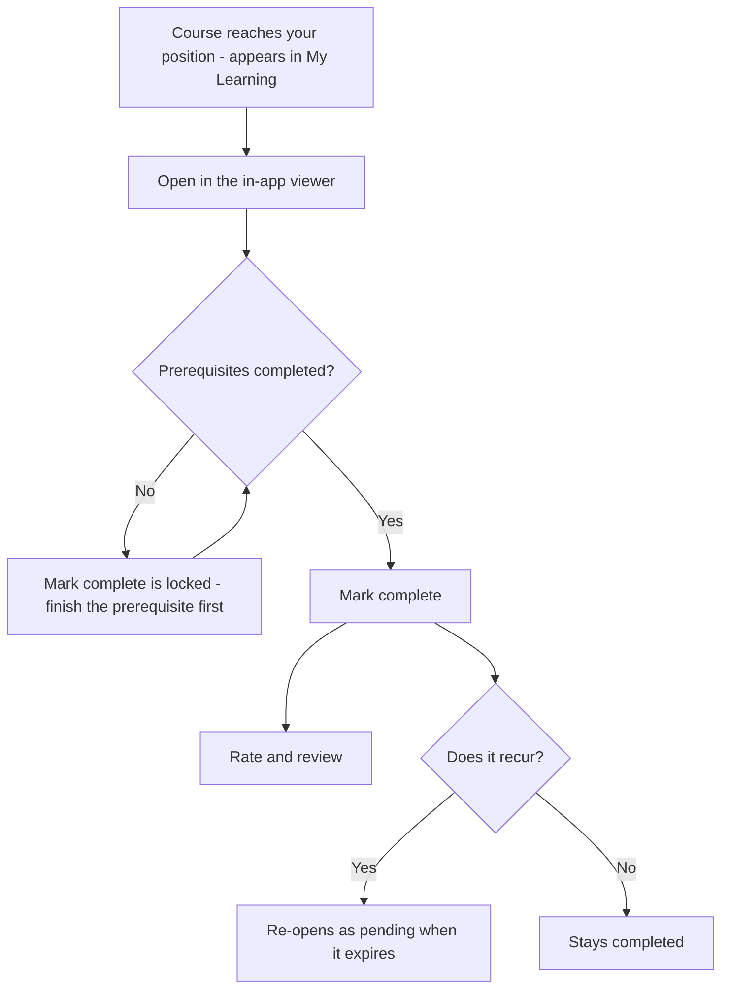

---

## Tips

- **Do prerequisites first.** If *Mark complete* is locked, open the course to see what's
  required — finishing the prerequisite unlocks it.
- **Watch the recurrence note.** "Repeats every 365 days" means the course will re-appear as
  pending when it expires — that's annual compliance working as intended.
- **Everything stays in one place.** Because the viewer is in-app, you never lose your spot
  or hunt through browser tabs — open, read, complete, move on.

**Next:** Chapter 11 — Requests: ask & approve →

---

# Chapter 12 — Requests: ask & approve

## What it is

**Requests** is the platform's ask-and-approve centre. Rather than letting anyone change the
structure directly, Knowledge Vault routes certain actions through a request that someone
with the right authority approves. It keeps governance clean and auditable.

Open it from the **Requests** tab. A **live badge** on the tab shows how many requests need
your attention, so you never miss one.


---

## The two views

The page is split in two:

### Inbox — waiting on you
Requests **you have the authority to decide**. In the sample, *Avery Stone* sees *Lena
Novak's* request to join *Robotics QA* as a member, complete with her message. Each inbox
card lets you **Approve**, **Reject**, or **Delete** it.

### My requests
Everything **you've** asked for, with its live status (**pending**, **approved** or
**rejected**), so you can track your own asks.

---

## The four kinds of request

| Kind | Who raises it | What approval does |
|------|---------------|--------------------|
| **Course** | Someone who wants a library course on their branch | The decider **configures** it (mandatory, inheritance, deadline, recurrence) *before* approving |
| **Join** | Someone who wants to join a public branch | Adds them to the branch — as a member or sub-owner, whichever they asked for |
| **Deletion** | A branch's own owner who wants it removed | Lets the level above authorise the deletion |
| **Visibility** | An owner whose branch is hidden by a level above | Asks that level to unhide the chain |

Course requests are special: because the decider configures placement at approval time, the
course arrives on the branch correctly set up, not as a raw drop-in.

---

## How it flows

1. Someone raises a request — from the library (Course), a public star (Join), or a Group
   configuration panel (Deletion, Visibility).
2. It lands in the **inbox** of whoever has authority — the branch's handler or the level
   above.
3. That person **decides**. Approvals take effect immediately; the requester sees the status
   change live.
4. Decided requests **clean themselves up automatically after 7 days**, keeping inboxes tidy.

You can always **withdraw** a request you raised while it's still pending.

---

## Flows at a glance

**The request lifecycle (all types share this shape):**

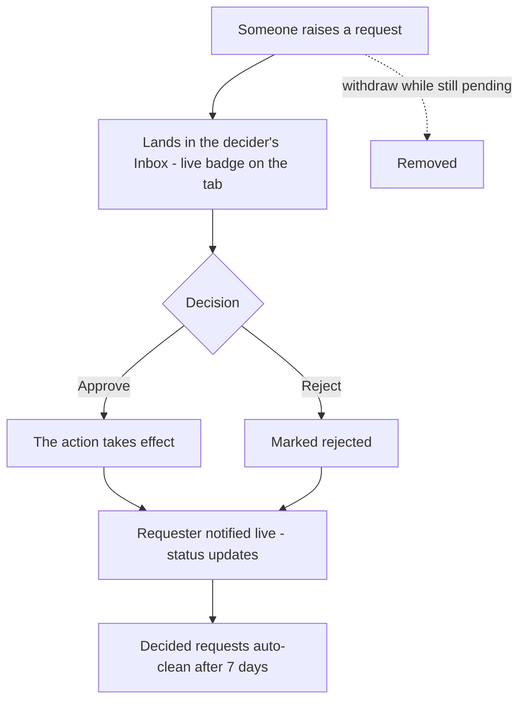

**Course request** — configured *before* approval:

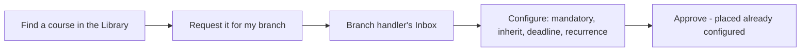

**Join request** — carries the desired position:

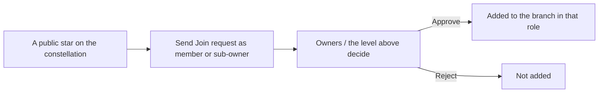

**Deletion request** — needs the level above:

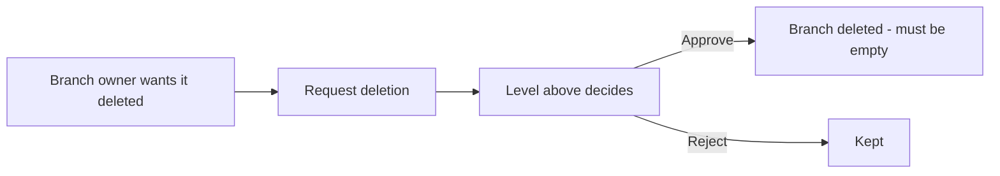

**Visibility request** — unhide a chain:

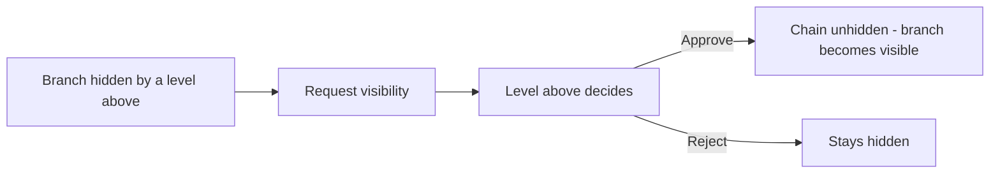

---

## Tips

- **Watch the badge.** The live count on the Requests tab is your cue that a colleague is
  waiting on you — decisions unblock people.
- **Configure course requests thoughtfully.** Approving one is your chance to set the right
  deadline and recurrence for *your* branch, not just accept a default.
- **Join requests carry intent.** They state whether the person wants to be a *member* or a
  *sub-owner* — check that before approving.

**Next:** Chapter 12 — Compliance tracking →

---

# Chapter 13 — Compliance tracking

## What it is

**Compliance** is the manager's view of "who has completed what." For any branch you govern,
it shows per-course completion across the whole subtree, highlights who's behind, and lets
you **remind** them with one click. It's how you turn mandatory training from a hope into a
number.

The **Compliance** tab appears in the navigation only if you're an owner somewhere. Open it
to begin.


---

## Choosing a branch

At the top, a **Branch** selector lets you pick any branch you govern — and because ownership
can sit on several levels at once, you may have several to choose from. Pick one, and the
dashboard reports on that branch and everything beneath it.

Three summary cards give you the headline:

- **people in this branch** — the population being measured.
- **overall compliance** — the single percentage that says how you're doing.
- **overdue items** — assignments past their deadline.

---

## Per-course breakdown

Below the summary, every course in scope gets a row showing:

- the course **title** and **code**,
- whether it's **mandatory** or **opt-in**,
- where it comes from (e.g. *via Executive Office*, *via Engineering*), and
- a **progress bar** with a count like **1 / 7 compliant**.

Select a course row to expand it and see the **list of people** — who's compliant and who
isn't.

---

## Reminding the non-compliant

This is the part that saves managers time. Once a course is expanded:

1. **Select the people** who still need to complete it (or select all non-compliant).
2. Choose to send a **reminder**.
3. Use the **default message**, or write your **own**.

Each reminder lands as a notification for that person, deep-linked to the exact course — so
they're one click from doing it. No spreadsheets, no chasing by email.

---

## Tips

- **Start at the top for a company-wide picture, drill down to act.** Select *Executive
  Office* to see overall compliance; switch to a team branch to chase specific people.
- **Zero overdue is the goal.** Pair deadlines (Chapter 7) with periodic reminder sweeps to
  keep that number at zero.
- **Recurring courses re-open automatically.** When an annual course expires, previously
  compliant people become pending again — the dashboard reflects it, and a reminder gets them
  back on track.

**Next:** Chapter 13 — Notifications →

---

# Chapter 14 — The Mailbox

## What it is

Everything the platform has to tell you arrives in **one mailbox**. Not a bell with a list
under it — a proper mail client, with folders down the side, a message list in the middle, and
a reading pane. It opens from the **bell in the top-right corner of every page**, inside an
organization or nowhere near one.

It exists because the alternative is clutter. Requests, learning deadlines, publishing
decisions, plan changes and messages from the Knowledge Base team are genuinely different
kinds of news, and piling them into one grey list means the important one sits below the
routine one. Here each kind is filed, labelled and — the part most systems skip —
**expires on its own**.


---

## 1. The folder rail

Down the left-hand side:

| Folder | What lands in it |
|--------|------------------|
| **All mail** | Everything, newest first, with high-priority mail pinned above it. |
| **Unread** | Only what you haven't opened. |
| **High priority** | Anything flagged — every message from the Knowledge Base team, plus deadlines that have already passed. |
| **Knowledge Base** | Access codes, plan decisions, coin adjustments, announcements. |
| **Requests** | Everything waiting on a decision — yours or someone else's. |
| **Publishing** | Document reviews, publications, adoptions of your material. |
| **Learning** | Assignments, deadlines, expiry, exam results. |
| **Plans & Coins** | Plan changes, expiry warnings, coin movements. |
| **People** | Placements, ownership, governance changes. |
| **System** | Housekeeping notes about the mailbox itself. |

Below the categories, one entry **per organization** you belong to. That is the label half of
the design: you can read *Aurora Robotics* on its own, ignore everything else, and come back
to the rest later.

Every folder carries its own unread count, so you can see where the pressure is without
opening anything.

---

## 2. Sub-labels — telling requests apart

Inside **Requests**, a bare "you have a request" is not much use — the five request flows need
five different reactions. Each message carries its own label:

| Label | The flow it belongs to |
|-------|------------------------|
| **Document publishing** | A member's draft is waiting for your review. |
| **Course for my path** | Someone wants a library course assigned to their branch. |
| **Join a branch** | Someone wants to be placed on a public branch. |
| **Branch deletion** | A branch's own owners want it removed. |
| **Visibility** | A hidden chain above a branch is keeping it invisible. |

Knowledge Base mail is labelled the same way — **Access code**, **Decision**, **Coins**,
**Plan**, **Announcement** — so you can find the message holding your code without reading the
rest.

---

## 3. Priority: what gets pushed to the top

Two things are flagged **high priority**, shown with a red edge and pinned above everything
else:

1. **Everything from the Knowledge Base team.** Your access code, a plan decision, a coin
   adjustment, an announcement. These are the messages that unblock you, so they never sit
   below routine noise.
2. **Deadlines that have already passed** — your own overdue mandatory course, an overdue
   course belonging to someone you look after, an exam whose attempts have run out.

The bell itself turns red and pulses while any high-priority message is unread.

---

## 4. Every message expires

This is the rule that keeps the mailbox usable and the database honest: **nothing lives
forever.**

| Kind of mail | How long it lives |
|--------------|-------------------|
| Knowledge Base team (codes, decisions, coins) | **30 days** |
| Plans & coins | 30 days |
| Requests, publishing, people | 14 days |
| Learning | 10 days |
| System notes | 3 days |

Each row shows its own countdown — *"6d left"*, *"4h left"* — and the reading pane spells out
the exact date. When it gets there the message deletes itself. You never have to tidy up, and
old mail cannot quietly accumulate on your behalf.

If you are holding more than forty messages, the mailbox says so once, in a **System** note.

---

## 5. Working through it

- **Select a message** to open it in the reading pane. Opening marks it read.
- **Open ↗** takes you to the exact thing it is about — the specific request card, the course
  list, your account.
- **Tick several** to mark them read, mark them unread, or delete them in one go.
- **Mark all read** and **Clear read** act on the folder you are in, so you can empty
  *Learning* without touching *Knowledge Base*.
- **Search** matches subjects, bodies, labels and organization names.
- The **🔔 / 🔕 button** turns the arrival chime on and off. Your choice is remembered.

An access code arrives with the code in a box in the reading pane and a **Copy** button beside
it — you never need to retype it.

---

## 6. Live delivery

The mailbox holds an open connection to the platform for as long as you have a page open. A
message appears **the moment it is written** — the instant an admin adjusts your coins, the
instant a manager approves your document, the instant an exam locks — with a short chime if
you have left it on.

This works on **every page**, including pages that belong to no organization at all. That is
deliberate: a coin adjustment or an access code has nothing to do with any one organization,
and waiting for you to wander into the right page before telling you would be silly.

If your connection drops, the mailbox reconnects on its own and catches up.

---

## 7. What generates mail

Common triggers, by folder:

- **Requests** — a request you can decide; a decision on something you asked for.
- **Publishing** — your document was published, or was not; someone adopted your course.
- **Learning** — a course reached your position; a mandatory course went overdue; a
  completion expired and the course came back; a course was updated and your completion was
  reset; a manager's reminder; an exam ran out of attempts; a manager reset them.
- **Plans & Coins** — a plan is a week from expiry; a plan lapsed; coins moved.
- **Knowledge Base** — your access code; a decision on a platform request; an announcement
  from the team.

---

## Tips

- **Use the folders, not the search.** *Requests* answers "what is waiting on me"; *Learning*
  answers "what is waiting on my people". The two questions rarely want the same answer.
- **Trust the countdown.** Clearing routine mail by hand is wasted effort — it goes on its own.
- **Watch the red bell, ignore the rest.** A high-priority flag means someone is genuinely
  blocked, or a deadline has already gone.
- **Copy the code, don't retype it.** Access codes are eight characters and case-sensitive.

---

# Chapter 15 — Plans, pricing & Knowledge Coins

## What it is

Creating an organization is not open to everyone by default — it is gated behind a **plan**
and a one-time **access code**. Plans are bought with **Knowledge Coins**, the platform's
virtual currency (some teams call them *education coins* — same thing).

This chapter covers the whole money-and-access side of Knowledge Vault: what a coin is, how
pricing works, how many people a plan lets you have, the **free Demo plan** you use as a
testing environment, how to get your access code, how to read the countdown timer on your
organization, and what happens when a plan runs out.

> **Who does what:** everything in this chapter is *your* side — the Pricing page, your code,
> your organization's timer. The Knowledge Base team's side (approving requests, issuing
> codes, gifting coins, setting plans) is the **Super Admin Guide Book** (a separate book, held by the Knowledge Base team).

---

## 1. Knowledge Coins

A **Knowledge Coin** is the unit Knowledge Vault prices plans in. Coins are not money and
they don't expire — think of them as tokens sitting in your profile's wallet, spent when you
found or restore an organization.

| Question | Answer |
|----------|--------|
| **How many do I start with?** | **150 coins**, granted the moment you register. (The Knowledge Base team can change the starting amount for *future* sign-ups — it never touches balances that already exist.) |
| **Where do I see my balance?** | On the **Pricing** page, as the `🪙 200 coins` chip in the top bar — and on the **Buy coins** page. It's deliberately kept off every other screen. |
| **What can I spend them on?** | Plans. The **Demo** plan costs nothing; paid plans cost whatever the card says. |
| **When are they taken?** | **Only when you use your access code** — never when you send a request, and never when it's approved. If you never redeem the code, you never pay. |
| **Can I get more?** | The Knowledge Base team can gift or adjust your balance at any time; you get a message when they do. **Buying coins with real money is coming soon.** |
| **Is there a record?** | Yes — every grant, gift, adjustment and spend is written to a ledger with the resulting balance. |


### Buying coins (coming soon)

The **Buy coins** button next to your balance opens the top-up page. The payment gateway
isn't live yet, so today the page explains that coins are granted by the Knowledge Base team
— ask them if you need more.


---

## 2. How pricing works

Open **Pricing** from the site footer, the home page, or the 🪙 item in the app's navigation.
Plans are shown as cards, grouped into **tabs**, and are managed centrally by the Knowledge
Base team — so the page always reflects what's actually on offer, including limited-time
offers that appear and disappear on their own dates.

Each card tells you what it costs, how long it runs, and — in a small facts table — exactly
how much of everything it includes: **people**, **custom documents**, **uploaded documents**,
**storage** and whether **server-side drafts** are part of it.

### The plan ladder

| Plan | Price | Runs for | People | Custom documents | Uploads | Storage |
|------|-------|----------|--------|------------------|---------|---------|
| **Free** | 50 coins | **30 days** | up to 10 | **30** | **30** | **150 GB** |
| **Bi-monthly** | 100 coins | **2 months** (60 days) | Unlimited | Unlimited | Unlimited | Unlimited |
| **Quarterly** | 150 coins | **4 months + 10 days** (130 days) | Unlimited | Unlimited | Unlimited | Unlimited |
| **Yearly** | 500 coins | **365 days + 2 months** (425 days) | Unlimited | Unlimited | Unlimited | Unlimited |
| **Custom / Organizational** | By agreement | You state the days | You state the number | You state the number | You state the number | By agreement |

**Only the Free plan is metered.** It stops at 30 custom documents, 30 uploads, or 150 GB of
storage — *whichever ceiling arrives first*. Every paid plan carries unlimited documents and
uploads for as many people as you need.

> **The page wins over this table.** Prices, durations and limits are edited centrally and can
> change; whatever the Pricing page shows is what you'll be charged. The Knowledge Base team
> can also pin a *per-organization* ceiling by hand, which overrides whatever the plan says.

There are two buttons on a card:

- **Request this plan** — for a fixed plan. One click sends the request; the terms are the
  ones printed on the card, and nobody has to re-type them.
- **Request a custom plan** — opens a short form asking for the **days**, the **number of
  people**, the **custom-document count**, the **upload count**, and the **coins you offer**.
  Those are the numbers the team approves, so a custom plan is agreed once rather than
  negotiated twice.

---

## 2b. Upgrading an organization you already have

If you are signed in and own an organization, the Pricing page opens with an **upgrade panel**
above the cards: your current plan on the left, the plans above it on the right, compared row
by row — duration, people, documents, uploads, storage, drafts, price — with the improvements
ticked.

Pick the plan you want and select **Upgrade**. The request goes to the Knowledge Base team,
who **apply it directly**: an organization that already exists needs no access code, so the
new plan simply appears, and you get a message in your mailbox confirming the terms and the
new expiry date.

Only an **owner** of the organization can ask for an upgrade — a member sees the comparison
but not the button.

---

## 3. How many people can I have? (member limits)

Every plan carries a **member limit** — the maximum number of *people* in one organization.

- The limit counts **people, not positions**. Someone who already belongs to the
  organization can be placed on as many roles as you like without using another seat.
- The Knowledge Base team can set a **per-organization limit** that overrides the plan's
  (for example, 250 seats on an annual agreement). A blank override means "use the plan's
  number"; some plans are unlimited.
- The limit is enforced the moment a **new** person would join — when an owner adds someone
  to a role, and when a **Join request** is approved. If the organization is full you'll see:

  > *This organization's plan allows up to 250 members. Upgrade the plan to add more.*

- Nothing is deleted when you hit the ceiling — existing people keep working normally. You
  either remove someone or move to a bigger plan.

If you're planning a rollout, count **every person who will need a login inside that one
organization**, and pick the plan from that number. Separate organizations have separate
limits — a person in two organizations occupies a seat in each.

---

## 4. The free plan — your starting point

The **Free** plan is where most organizations begin. It is:

- **50 coins for 30 days** — affordable out of the coins your profile starts with;
- **Full-featured** — the constellation, courses, Studio, exams, library, requests,
  compliance, backups and `.main` custody all behave exactly as they do on a paid plan;
- **Metered** — 10 people, 30 custom documents, 30 uploads, 150 GB of storage. Whichever of
  those you reach first is the one that stops you.
- **Without server-side drafts** — your Studio work is still saved in your browser as you
  write, but parking a draft on the server to resume on another device is a paid capability.
- **One per profile.**

Two things to plan for before you start:

1. **It ends.** At 30 days the organization's timer lapses and the card turns red.
2. **A lapsed free organization cannot be restored for free.** If you delete it (or lose it)
   after expiry, bringing it back needs a plan and a restore code — §7. If the content
   matters, upgrade *before* the 30 days are up; the upgrade panel makes that one click.

> **What happens when I hit a ceiling?** Nothing is deleted. The next upload or new document
> is refused with a message naming the limit, and everything already there keeps working.
> Free up space, or upgrade.

## 5. Getting an access code

Because organization creation is controlled, you **request** a plan and the Knowledge Base
team sends you a one-time code.

```
You choose a plan  →  the team approves (with final terms)  →  you get an 8-character code
      │                                                                      │
      └──── Pricing page ────────────────────────────────────────────────────┘
                                                              valid 24 hours · single use
```

1. On **Pricing**, choose a plan and select **Request this plan** — or **Propose terms** for
   a custom plan, entering the days you want and the coins you offer.
2. Your request lands with the Knowledge Base team.
3. They **approve** it (setting the final duration, price and a message) or **decline** it
   (with a reason).
4. On approval you receive an **8-character access code** as a message **from the Super
   Admin**, valid for **24 hours** and usable **once**.

### Tracking your requests

The Pricing page lists **Your requests** underneath the cards, with their live status —
*pending*, *approved*, *denied* or *used* — plus any reply from the team. While a request is
still pending you can **Withdraw** it.


### Your code lives on your Account page

The code arrives in your notification bell **and** in a dedicated **"Messages from the Super
Admin"** panel on your **Account** page — so you can read it any time, even before you belong
to any organization. These messages stay for **30 days**.


---

## 6. Creating the organization with your code

Go to **Create organization**. The page has two halves:

- **Left — the founding form:** your access code, the organization name, the first role name,
  and the Supreme password (with its unrecoverable-password acknowledgement — see
  Chapter 3).
- **Right — the plan chooser:** your coin balance and every plan, so you can request one
  without leaving the page. Each plan shows its status once you've asked: *requested —
  awaiting approval*, then *approved — code in your 🔔*.


On submit the platform verifies the code, deducts the plan's coins, stamps the organization
with the plan and its expiry date, and marks the code **used**. If your balance is short,
nothing is created and you're told exactly how many coins the plan costs and how many you
have.

---

## 7. The countdown timer, expiry and restoring

### The timer

Every organization card carries a **countdown chip above its name**:

| Chip | Meaning |
|------|---------|
| `⏳ organisation · 364d 23h left` | Time remaining on the plan |
| `⏳ Demo · 12h left` | Under a day — the chip turns **red** inside the last 3 days |
| `⏰ monthly expired — upgrade to keep it` | The plan has lapsed |
| `organisation · no expiry` | An open-ended plan |


### When a plan expires

The organization and its data stay where they are — expiry does not delete anything. What
changes is your ability to bring the organization **back** once it's gone:

- Deleted organizations sit in a **30-day retention** list and can be restored with the
  Supreme password.
- If the plan has **expired** (or it was a **Demo**), restoring is blocked with a clear
  message that sends you to the **Pricing page**.
- Choose a plan there and the team issues a **restore code**. Enter it when you restore —
  you may need to upload the `.main` file again — and the organization comes back on the new
  plan, with the coins deducted then.

### Why the plan travels inside your `.main` file

Your `.main` file (Chapter 14) carries an encrypted, **server-signed** snapshot of the plan.
On revival the platform checks that signature:

- **Active and unexpired** → the organization revives directly.
- **Demo, expired, or a file made before plans existed** → you're told plainly that the plan
  has lapsed and pointed at Pricing for a restore code.

The signature is what stops an expired file being edited into a "paid forever" one — custody
of your organization and the truth about its plan stay together in the same file.

---

## 8. Tips

- **Request early.** Codes expire in 24 hours, so ask for your plan shortly before you intend
  to create the organization — not days ahead.
- **Your code is always in your mailbox** for 30 days, under *Knowledge Base*, with a Copy
  button — and mirrored on your Account page.
- **Coins leave your wallet only at redemption.** Requesting and being approved cost nothing.
- **Size the plan by people, not roles.** Roles are free; people occupy seats.
- **Watch the chip.** Inside the last three days it turns red — upgrade before it lapses and
  you'll never need the restore path at all.
- **Upgrade from inside the product.** The Pricing page's upgrade panel compares your current
  plan with the ones above it and files the request in one click — no code to redeem.
- **Use the Free plan as a rehearsal, not as the real thing.** It's complete, but it ends
  after two months and can't be restored for free once it does.

**Next:** [Chapter 18 — The Knowledge Base portal →]() ·
**Back to:** Table of contents

---

# Chapter 16 — The Supreme zone: custody & recovery

## What it is

The **Supreme zone** is the most powerful — and most protected — area in Knowledge Vault. It
lives on the **root role** of your organization and is the practical expression of the
**custody** promise from Chapter 2: your organization's existence, ownership and revival are
all in *your* hands, guarded by the **Supreme password** that only you know.

You reach it by clicking the **root star**, choosing **Group configuration**, and scrolling
to the **Supreme zone** (visible only to the organization's top-level owners).


Because these actions are so consequential, they require you to enter the **Supreme
password**, which unlocks a 10-minute window of Supreme access.

---

## What lives in the Supreme zone

### Top-level owners
The Supreme zone lists the owners of the root role — the people who hold ultimate authority.
In the sample, that's *Avery Stone* and *Priya Raman*. From here you can:

- **Add a supreme co-owner** by username, and
- **Remove** an owner (you can't remove the last one).

Adding or removing a top-level owner is exactly the kind of change the Supreme password
protects.

### The `.main` existence backup
Your organization's `.main` file is its **existence backup** — a single encrypted file, keyed
to your Supreme password, that can **revive the entire organization** even after it's been
deleted and the 30-day retention period in the Recovery has passed.

Select **⬇ Download** to export it. **Keep it somewhere safe and offline.**

### Deleting the organization
The **Delete organization** action begins a **30-day retention** period, after which the org
is purged and **only the `.main` file can bring it back**. The platform insists you download
the `.main` file *first* and confirms before proceeding.

---

## The other backup: per-branch `.bkp` files

Separate from the org-wide `.main`, every branch can be backed up on its own from the
**Backup** section of its action panel. A **`.bkp`** file is an **encrypted snapshot of that
branch** — its roles, people and course placements — that you can restore later.

To create one:

1. Click a branch you govern → **Backup**.
2. Choose **⬇ Download .bkp of this branch** and set a backup password (you'll need it to
   restore).


To restore, upload a `.bkp` into a node and enter its password; the platform shows a report
of what was **applied** and what was **skipped**.

---

## Recovery — both ways back

Deleting an organization does not destroy it, and there are two routes back. Both live behind
one button: **Recovery**, in the **bottom-left corner of your Organizations page**. It sits out
of the way until you need it, and carries a count when something is waiting.


### 1. Deleted — waiting out the 30 days

For **30 days** after you delete it, an organization sits in Recovery's **Deleted** tab, fully
intact, showing exactly how many days it has left before it is purged. Restoring is one button
— **↩ Restore** — plus the Supreme password. There is no file to find and nothing to upload.

Two things to know:

- **The countdown is real.** After 30 days the organization is purged from the platform, and
  the only way back is the `.main` file.
- **A lapsed plan still blocks a restore.** If the plan expired while the organization sat
  there, the restore asks for a **restore code** from the Knowledge Base team.

### 2. From a `.main` file — after the purge

Recovery's second tab takes the encrypted `.main` file and the Supreme password, and rebuilds
the organization from scratch. This is the path for anything already purged, or for an
organization being moved to a different deployment. It is covered in full below.

> **Why "Recovery" and not "Recovery"?** A deleted organization here is not refuse waiting
> to be emptied — it is whole, and one password away from coming back. And the `.main` route
> recovers things a bin never held. The button is named for what it does.

---

## Reviving a purged organization

If an organization has been deleted, its founder can bring it back from the **Organizations**
page:

1. Expand **Revive a deleted organization from a `.main` file**.
2. Upload the `.main` file and enter the **Supreme password** that encrypted it.

Without both the file and the password, revival is impossible — which is precisely what keeps
your organization in your custody and no one else's.

---

## Flows at a glance

**Supreme-protected actions (on the root):**

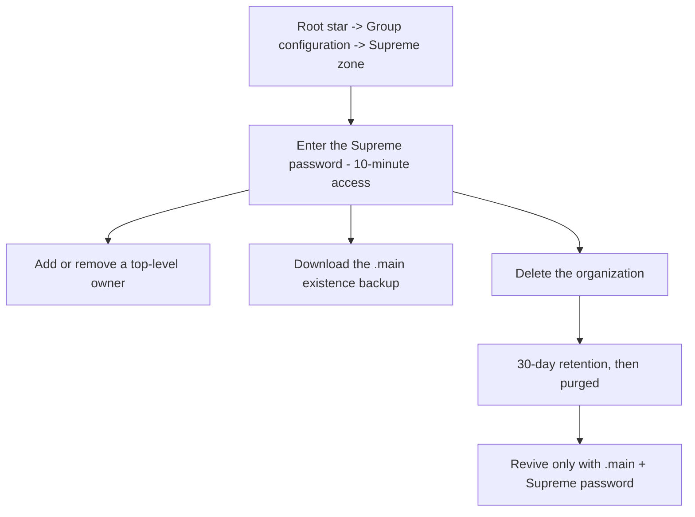

**Branch backup and restore (`.bkp`):**

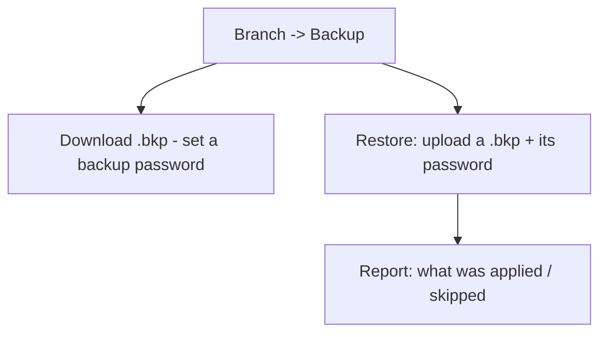

**Reviving a deleted organization:**

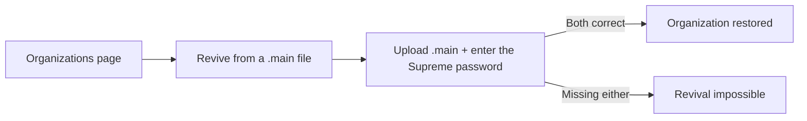

---

## Tips

- **Back up the `.main` the day you found the org, and after big structural changes.** It is
  your ultimate insurance policy.
- **Never store the Supreme password with the `.main` file.** Together they're the keys to
  the kingdom; keep them separately.
- **Use `.bkp` before risky edits.** About to restructure a division? Export its `.bkp` first
  so you can roll back cleanly.

**Next:** Chapter 15 — Help & support →

---

# Chapter 17 — Appearance & navigation

## What it is

Two small things you meet on every single screen: **how the platform looks**, and **how you
move around it**. Both are deliberately quiet — but both are yours to set, and both remember
what you chose.

---

## 1. The navigation bar

The bar across the top of every page is **icons at rest and words on contact**.

At rest each destination is a single icon, so the bar stays short even when an organization
has a dozen places to be. Hover it — or reach it with the keyboard — and the icon **widens
out into its full label**: *Constellation*, *My Learning*, *Library*, *Requests*,
*Compliance*, *Studio*.

Three things worth knowing:

- **The label is real text.** It is part of the link, not a tooltip the browser draws on its
  own schedule and not a placeholder. Screen readers read it, and your browser's *find on
  page* finds it, whether or not it is currently visible.
- **The page you are on keeps its label open.** You can always see where you are without
  touching anything.
- **Counts ride along.** A branch with requests waiting shows the number on its icon, expanded
  or not.

### The bar is deliberately unhurried

Widening a label makes the bar wider, which moves every link after it. If that happened at the
speed of an ordinary hover effect, the link you were aiming at would slide out from under your
pointer and you would click the wrong one — which is exactly what used to happen.

So the navigation bar moves on its own, slower timing:

- **It waits before it opens.** Sweeping past a link on your way somewhere else does not
  disturb the bar at all.
- **It opens gently, and does not overshoot.** No bounce, nothing that springs past its resting
  place and comes back.
- **It waits before it closes.** Slipping off the pill for an instant does not snap it shut
  under your finger.

Colour still answers instantly — you always know the moment you have reached a link. Only the
*shape* takes its time. If you have asked your device to reduce motion, none of this animates
at all.


### On a phone or a tablet

There is no hovering on a touch screen, so the bar behaves differently and honestly: the
**menu button** opens the destinations as a vertical sheet with **every label already showing**.
Nothing is hidden behind a gesture you cannot perform. The sheet is solid rather than
see-through, so the page underneath never competes with the links, and it scrolls on its own if
there are more destinations than fit.

The same menu button now serves the public pages — Home, Features, Storage, Pricing and Help —
which previously had no way to reach their navigation on a narrow screen at all.

---

## 2. Themes

The **palette button** sits beside the bell on every page.

### Day and night

The default is the warm **peach-white day theme** — the look the platform ships with, chosen
because most people read documents in daylight and a bright, low-contrast page is easier on
the eyes for long stretches. The switch flips to a full **night theme** for dark rooms and
late shifts.

### Accents

Five accent palettes change the colour of buttons, highlights and the constellation's glow:

| Accent | Feel |
|--------|------|
| **Peach** | The default — warm, low-glare. |
| **Aurora** | Violet and indigo. |
| **Ocean** | Blue and cyan. |
| **Sunset** | Orange and pink. |
| **Forest** | Green and lime. |

Day/night and accent are independent — a night theme with a Forest accent is a perfectly
ordinary choice.

### It remembers

Your choice is stored **on your device, in a cookie**, and applied *before the first frame is
painted* — so there is no flash of the wrong theme while a page loads. Sign out, close the
browser, come back next week: you get exactly the look you left.

> **Why a cookie rather than an account setting?** Because appearance is about the screen you
> are sitting at, not about you. The same person may want night mode on the laptop in the
> workshop and the day theme on the office monitor, and the platform should not argue.

### Reduced motion

If your operating system is set to reduce motion, the platform obeys: the navigation rail
stops sliding, transitions shorten, and the background animation settles.

---

## 3. The mailbox bell

Beside the palette sits the **bell** — the mailbox, covered in full in
Chapter 14. It is on every page for a reason: some of what the
platform has to tell you (an access code, a coin adjustment) has nothing to do with any one
organization, so it cannot live inside one.

---

## Tips

- **Learn two icons and you know the bar.** ✦ is your constellation; 🎓 is your learning.
  Everything else you can hover.
- **Set the theme once, on each device you use.** It is a per-device choice by design.
- **If the bar looks cramped, it isn't broken** — that is the collapsed state. Hover or tap.

---

# Chapter 18 — Flow diagrams: every setting at a glance

This chapter is the **visual reference** for the whole platform. It pairs a **flow diagram**
with a **screenshot** for each setting, grouped into three topics:

- **A.** [What an **owner** can do](#a--owner-settings--actions) — every management setting.
- **B.** [What a **member** can have / do](#b--what-a-member-can-have--do) — the learner side.
- **C.** [**Request ↔ response** flows](#c--request--response-flows) — ask-and-approve.
- **D.** [**Plans, coins & access codes**](#d--plans-knowledge-coins--access-codes) — how an
  organization is paid for, sized and renewed.

> The flow diagrams below are drawn with Mermaid and render automatically on GitHub. Each
> setting also links back to the chapter where it's explained in full.

---

## A — Owner settings & actions

Owners act from the **constellation**: click a star you govern to open its action panel, then
choose a section (Group configuration · People · Courses · Backup).


### A1 · Create a sub-role
*Where: Group configuration → + Sub-role · Chapter 5*

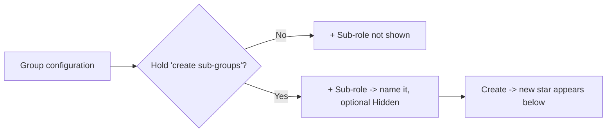


### A2 · Set visibility (public / hidden)
*Where: Group configuration → Visibility · Chapter 5*

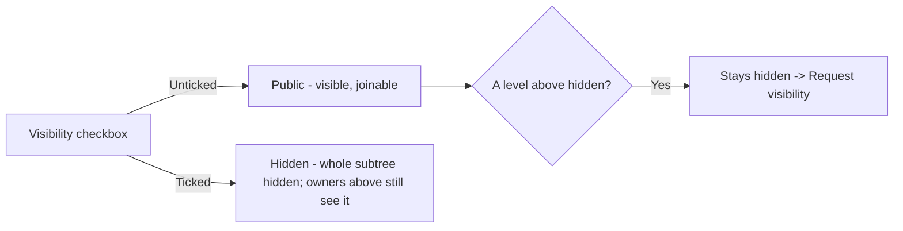

### A3 · Delete a branch (direct or by request)
*Where: Group configuration → Delete / Request deletion · Chapter 5*

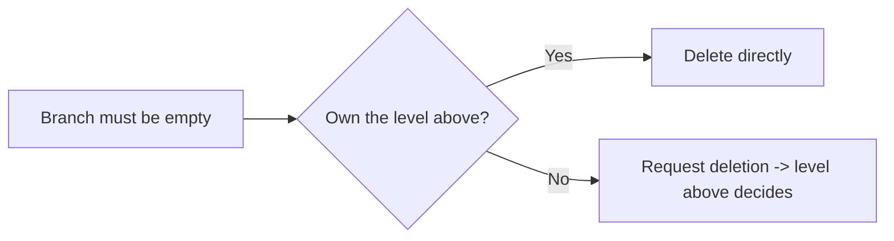

### A4 · Add a person (member or co-owner)
*Where: People → + Add person · Chapter 6*

```mermaid
flowchart LR
    A["+ Add person"] --> B{"Member or co-owner?"}
    B -->|Member| C["Username + optional 'create content'"]
    B -->|Co-owner| D["Username + granted rights"]
    C --> E["Placed on branch"]
    D --> E
```


### A5 · Grant a co-owner's rights (least privilege)
*Where: People → Add a co-owner · Chapter 6*

```mermaid
flowchart LR
    A["Rights you hold"] --> B{"Hold the right?"}
    B -->|No| C["Not offered"]
    B -->|Yes| D["Grant: sub-groups / appoint co-owners"]
    D --> E["Toggle Allow / Revoke anytime"]
```


### A6 · Grant a member the "create content" right
*Where: People → Add a member · Chapter 6 & 7*

```mermaid
flowchart LR
    A["Member + create content"] --> B["Authors a document"]
    B --> C["Draft -> Document review"]
    C -->|Owner approves| D["Publishes"]
    C -->|Owner rejects| E["Stays draft"]
```


### A7 · Publish a course
*Where: Courses → + Upload course / Create in Studio · Chapter 7*

```mermaid
flowchart LR
    A["Upload or Studio"] --> B["Set title, classification, shelf, kind, deadline, recurrence"]
    B --> C{"Owner or member?"}
    C -->|Owner| D["Publishes now"]
    C -->|Member| E["Draft -> review -> publish"]
    D --> F["Placed: mandatory + inherit"]
```


### A8 · Configure a placed course
*Where: Courses → per-course controls · Chapter 7*

```mermaid
flowchart LR
    A["Course on a role"] --> B["mandatory / opt-in"]
    A --> C["inherit down / this role only"]
    A --> D["Unplace"]
    A --> E["Archive"]
    A --> F["Delete everywhere"]
```


### A9 · Back up / restore a branch (`.bkp`)
*Where: Backup section · Chapter 16*

```mermaid
flowchart LR
    A["Backup"] --> B["Download .bkp + password"]
    A --> C["Restore: upload .bkp + password"]
    C --> D["Report: applied / skipped"]
```


### A10 · The Supreme zone (root only)
*Where: root → Group configuration → Supreme zone · Chapter 16*

```mermaid
flowchart LR
    A["Enter Supreme password"] --> B["Add / remove top owner"]
    A --> C["Download .main"]
    A --> D["Delete org -> 30-day retention -> purge"]
    D --> E["Revive only with .main + password"]
```


---

## B — What a member can have / do

A member *learns* from the branches they're placed on. Everything assigned to them gathers in
**My Learning**.

### B1 · Complete assigned courses
*Where: My Learning · Chapter 11*

```mermaid
flowchart LR
    A["Course reaches your position"] --> B["Open in viewer"]
    B --> C{"Prerequisites done?"}
    C -->|No| D["Mark complete locked"]
    C -->|Yes| E["Mark complete"]
    E --> F["Rate & review"]
    E --> G{"Recurs?"}
    G -->|Yes| H["Re-opens on expiry"]
```


### B2 · Read in the in-app viewer
*Where: My Learning / Library → Open · Chapter 11*

The viewer opens every document in the organization's standard frame (cover, classification,
version, author) — never in a second tab.


### B3 · Propose content (if granted)
*Where: Studio → Propose a document · Chapter 8*

```mermaid
flowchart LR
    A["Member with content right"] --> B["Build in Studio"]
    B --> C["Submit draft"]
    C --> D["Owner reviews"]
    D -->|Approve| E["Published"]
    D -->|Reject| F["Draft"]
```


### B4 · Ask to join a public branch
*Where: click a public star → Send Join request · Chapter 12*

```mermaid
flowchart LR
    A["Public star"] --> B["Join request: member or sub-owner"]
    B --> C["Owners decide"]
    C -->|Approve| D["Added to the branch"]
```

### Member capability map

```mermaid
flowchart TD
    M["Member of a branch"] --> L["Receive & complete courses"]
    M --> V["Read in the in-app viewer"]
    M --> R["Rate & review after completing"]
    M --> J["Send Join requests to public branches"]
    M --> P{"Granted 'create content'?"}
    P -->|Yes| PC["Propose documents - published after review"]
    P -->|No| PN["Learn only"]
```

---

## C — Request ↔ response flows

Requests route sensitive actions to whoever has the authority. Deciders act from the
**Requests inbox**; everyone is kept informed by **notifications**.


### C0 · The lifecycle every request shares

```mermaid
flowchart TD
    A["Request raised"] --> B["Decider's Inbox - live badge"]
    B --> C{"Approve or reject"}
    C -->|Approve| D["Action takes effect"]
    C -->|Reject| E["Rejected"]
    D --> F["Requester notified live"]
    E --> F
    F --> G["Auto-cleans after 7 days"]
    A -. withdraw while pending .-> H["Removed"]
```

### C1 · Course request

```mermaid
flowchart LR
    A["Library -> Request for my branch"] --> B["Handler's Inbox"]
    B --> C["Configure: mandatory, inherit, deadline, recurrence"]
    C --> D["Approve -> placed configured"]
```

### C2 · Join request

```mermaid
flowchart LR
    A["Public star"] --> B["Join as member or sub-owner"]
    B --> C["Owners / level above decide"]
    C -->|Approve| D["Added in that role"]
    C -->|Reject| E["Not added"]
```

### C3 · Deletion request

```mermaid
flowchart LR
    A["Branch owner"] --> B["Request deletion"]
    B --> C["Level above decides"]
    C -->|Approve| D["Deleted (must be empty)"]
    C -->|Reject| E["Kept"]
```

### C4 · Visibility request

```mermaid
flowchart LR
    A["Hidden by a level above"] --> B["Request visibility"]
    B --> C["Level above decides"]
    C -->|Approve| D["Chain unhidden"]
    C -->|Reject| E["Stays hidden"]
```

### C5 · How you hear about it — notifications

Every request, decision, assignment and reminder arrives as a **live, clickable
notification** that deep-links to the exact item.


---

## D — Plans, Knowledge Coins & access codes

Every organization runs on a **plan**, bought with **Knowledge Coins** and unlocked with a
one-time **access code**. Full detail in Chapter 15; the
staff side is the **Super Admin Guide Book** (a separate book, held by the Knowledge Base team).


### D1 · Choose a plan and get an access code
*Where: Pricing → Request this plan / Propose terms · Chapter 15*

```mermaid
flowchart LR
    A["Pricing page"] --> B{"Fixed or custom plan?"}
    B -->|Fixed| C["Request this plan"]
    B -->|Custom| D["Propose terms: days wanted + coins offered"]
    C --> E["Knowledge Base team decides"]
    D --> E
    E -->|Approve| F["8-character code - valid 24h, single use"]
    E -->|Deny| G["Reason delivered - request again"]
    F --> H["Bell + Account page - kept 30 days"]
```


### D2 · Create the organization with the code
*Where: Create organization · Chapter 3*

```mermaid
flowchart LR
    A["Paste access code + org details"] --> B{"Code valid and unexpired?"}
    B -->|No| C["Refused - request a new code"]
    B -->|Yes| D{"Enough Knowledge Coins?"}
    D -->|No| E["Refused - shows cost vs balance"]
    D -->|Yes| F["Coins deducted - code marked used"]
    F --> G["Organization created - plan countdown starts"]
```


### D3 · Knowledge Coins — where they come from and go
*Where: Pricing (balance) · Buy coins · Chapter 15*

```mermaid
flowchart TD
    A["Register - 150 coins granted"] --> W["Your wallet"]
    G["Knowledge Base gift or adjustment"] --> W
    P["Buy coins - coming soon"] -.-> W
    W --> S{"Redeem an access code"}
    S -->|Demo plan| F["Free - nothing deducted"]
    S -->|Paid plan| D["Plan price deducted - logged in the ledger"]
```

### D4 · How many people a plan allows
*Where: People → + Add person · Chapter 6*

```mermaid
flowchart LR
    A["Add a person / approve a Join request"] --> B{"Already in this organization?"}
    B -->|Yes| C["Placed on the role - no seat used"]
    B -->|No| D{"Members below the plan limit?"}
    D -->|Yes| E["Added - seat used"]
    D -->|No| F["Refused: upgrade the plan to add more"]
```

### D5 · Expiry and restoring
*Where: the countdown chip above each org card · Chapter 15*

```mermaid
flowchart TD
    A["Plan countdown"] -->|More than 3 days| B["Normal chip"]
    A -->|Under 3 days| C["Red chip - upgrade soon"]
    A -->|Lapsed| D["expired - upgrade to keep it"]
    D --> E{"Organization deleted and being restored?"}
    E -->|Plan active and unexpired| F["Restores directly"]
    E -->|Demo, expired or legacy file| G["Blocked - choose a plan on Pricing"]
    G --> H["Restore code -> restore on the new plan"]
```


### D6 · The staff side

Everything that happens on the Knowledge Base team's side of a plan request — the requests
inbox, approvals, access codes, coins, and the organizations console — lives in the separate
**Super Admin Guide Book**, held by that team. From your side, the whole interaction is:
send the request on the Pricing page, then read the answer in your mailbox.

```mermaid
flowchart LR
    A["You: choose a plan on Pricing"] --> B["Request filed"]
    B --> C["Knowledge Base team decides"]
    C --> D["Answer lands in your mailbox"]
    D --> E["New organization: redeem the code"]
    D --> F["Existing organization: the upgrade is already applied"]
```

---

## Master index — setting → where → screenshot

| Setting | Who | Chapter | Screenshot |
|---------|-----|---------|-----------|
| Create a sub-role | Owner | 5 | `sub-role-form.png` |
| Set visibility (public/hidden) | Owner | 5 | `group-configuration.png` |
| Delete / request branch deletion | Owner | 5 | `group-configuration.png` |
| Add a person (member/co-owner) | Owner | 6 | `add-person-choose.png` |
| Grant co-owner rights | Owner | 6 | `add-coowner-form.png` |
| Grant member "create content" | Owner | 6 | `add-member-form.png` |
| Publish a course | Owner | 7 | `upload-course-form.png` |
| Configure placement (mandatory/inherit/archive) | Owner | 7 | `courses-panel.png` |
| Back up / restore a branch (`.bkp`) | Owner | 16 | `backup-panel.png` |
| Supreme zone (owners, `.main`, delete) | Top owner | 16 | `group-configuration.png` |
| Restore a deleted organization (Recovery) | Founder | 16 | `organizations-list.png` |
| Revive from a `.main` file (Recovery) | Founder | 16 | `organizations-list.png` |
| Complete assigned courses | Member | 11 | `my-learning.png` |
| Read in the in-app viewer (PDF zoom) | Member | 11 | `course-viewer.png` |
| Propose content | Member | 8 | `studio.png` |
| Send a join request | Member | 12 | `requests.png` |
| Decide a request (inbox) | Decider | 12 | `requests.png` |
| Read the Mailbox | Everyone | 14 | `notifications.png` |
| See why someone is not compliant | Manager | 13 | `compliance.png` |
| Reset a candidate's exam attempts | Manager | 13 | `compliance.png` |
| Build an exam & set its attempt limit | Owner | 9 | `studio.png` |
| Choose a plan / see your coin balance | Anyone | 15 | `pricing-page.png` |
| Track a plan request | Anyone | 15 | `pricing-my-requests.png` |
| Read your access code | Anyone | 15 | `account-admin-messages.png` |
| Create an org with a code | Founder | 15 | `create-organization.png` |
| Read the plan countdown | Owner | 15 | `org-plan-timer.png` |
| Upgrade an existing organization | Owner | 15 | `pricing-page.png` |
| Change theme & accent | Everyone | 17 | — |
| Buy coins (coming soon) | Anyone | 15 | `buy-coins-coming-soon.png` |

---

**Back to:** Table of contents · **Reference:**
Appendix — Glossary & quick reference

---

# Chapter 19 — Help & support

## What it is

Knowledge Vault includes a built-in **Help** page — a plain-language guide to every part of
the platform. It's **public**, so both prospective and signed-in users can read it, and it's
linked from the app sidebar so it's always a click away.

Open it from the **Help** link in the navigation (available on the landing page and inside
the app).


---

## What Help covers

The page walks through each component of the platform in short, friendly topics, including:

- **Profile & signing in** — your one global username-and-password identity, and how admins
  add you by username.
- **Organizations & the Supreme** — what an organization is, and the Supreme password that
  protects its root.
- **The constellation, roles and people** — how the tree works and how positions are placed.
- **Courses, the library and learning** — publishing, browsing and completing knowledge.
- **Requests, compliance and notifications** — the day-to-day flows for managers and
  learners.

Each topic is written for people, not engineers — no setup or code, just how to use the
product.

---

## Where to look when you're stuck

| If you want to… | Go to… |
|-----------------|--------|
| Understand a term | The Appendix glossary, or in-app Help |
| Change your name or picture | **Account** (Chapter 1) |
| See what you must complete | **My Learning** (Chapter 10) |
| Add a person or role | The constellation → **People / Group configuration** (Chapters 5–6) |
| Publish a course | A role's **Courses** panel, or the **Studio** (Chapters 7–8) |
| Find an existing document | The **Library** (Chapter 9) |
| Approve something | **Requests**, or the **notifications** bell (Chapters 11, 13) |
| Check who's trained | **Compliance** (Chapter 12) |
| Back up or recover your org | The **Supreme zone** and **Backup** (Chapter 14) |

---

## Tips

- **Bookmark the Help page** — it's the fastest in-product reference and it's always current
  with the live app.
- **Share Help with newcomers** before their first sign-in — because it's public, they can
  read it while their profile is being set up.
- **This guide book goes deeper.** Help is the quick tour; the chapters here are the full
  walkthrough with real screenshots.

**Next:** Chapter 16 — Flow diagrams: every setting at a glance →

---

# Chapter 20 — Where your documents live

## What it is

Your organization's documents do not have to live with us. **We keep the catalogue; you keep
the contents.** You bring storage, you configure it, you pay for it, and you can walk away with
everything in it at any time — while Knowledge Vault holds only the things that answer *who may
see what* and *what has been done*.

There is a page for all of this on the public site: **Storage**, in the navigation bar and in
the footer of every page.


---

## 1. The dividing line

| Goes to your storage | Stays with us |
|----------------------|---------------|
| Uploaded files — PDF, image, audio, video | Roles, placements and capabilities |
| Studio-authored documents | Course metadata — code, title, classification, deadlines |
| Exams and their answer keys | Completion records and exam results |
| Studio drafts | Requests, mailbox, plans, coins, audit logs |

The rule behind the split: anything small enough to stay **queryable when your storage is
unreachable**, and load-bearing enough that a permission decision depends on it, stays with us.
Everything else is yours.

That is also why an unreachable NAS is an inconvenience rather than a catastrophe. Your people
can still sign in, still see their structure, still see what they have completed and what is
overdue. What they cannot do is open or upload a document until the storage comes back.

---

## 2. The two ways to store, today


### NAS — your own storage

An **S3-compatible server on hardware you own**. MinIO running on a NAS in your own building is
the recommended shape, and the one the setup guide walks through.

The process, in the order it actually happens:

1. **Stand up the storage.** Run MinIO (or any S3-compatible server) and create one bucket for
   Knowledge Vault. We never create buckets — the one you name has to exist already.
2. **Make a key that can do exactly one thing.** A dedicated access key scoped to that bucket
   and prefix: read, write, delete, list, and nothing else.
3. **Let browsers talk to it.** Add the CORS rules we generate for you, scoped to our web
   origin. This is the step people get wrong most often, which is why the setup screen *tests*
   it rather than trusting it.
4. **Choose the encryption posture.** *Encrypted* (recommended) writes opaque `.kvblob` objects
   nobody can read out of band — not even your own IT administrator. *Readable* keeps ordinary
   browsable files. **The choice is fixed once storage is active**, because changing it means
   re-encrypting everything you already have.
5. **Pass the connection test.** We reach, write, read back, compare and delete a probe object
   before your organization is created. A failure names the exact stage that broke, aborts
   creation, and **does not consume your access code** — fix the storage and try again with the
   same code.
6. **Work normally.** Uploads go from the browser straight to your storage through a
   short-lived signed link, and downloads come back the same way. The bytes never touch our
   servers.

**What it gives you.** The documents are physically yours. Because none of the bandwidth is
ours, the storage ceiling on your plan stops applying to you — the document and upload counts
still do. A signed `Knowledge_vault_map` manifest sits in the bucket, so the folder explains
itself to anyone who opens it. Objects are content-addressed and date-sharded, so a filename
never leaks what a document is about.

**What it costs you.** Your storage has to have a public HTTPS address; a NAS reachable only on
your office network cannot be used this way today (see §4). An organization cannot be created
until its storage is reachable and working. Files can be up to **200 MB**, uploaded in framed
parts so a large file never has to fit in a phone's memory twice.

### KVEP — the Knowledge Vault Employee Perk

An organization created by **Knowledge Vault staff, for staff use**. It is the one shape that
does not bring its own storage: content stays on our infrastructure, and the plan's storage
allowance applies to it normally.

It is gated on super-admin credentials at **two separate points** — once when the request is
raised as an employee-perk request, and again at creation time, where a super-admin username
and password are checked against the administrator account itself. A perk code with no
credentials is refused; so are credentials against an ordinary code, and so is any attempt to
give a KVEP organization storage fields.

For a KVEP organization there is nothing to set up: no bucket, no key, no CORS, no connection
test. It can never enter the "storage unreachable" state, because there is no third-party
storage to go unreachable. Files are capped at **10 MB** each rather than 200 MB.

> **If you are a customer, this option is not for you** — and the form will tell you so rather
> than letting you fill it in. It is documented here so that the two shapes are never confused
> when someone describes what they are seeing.

---

## 3. The four questions that decide everything

Every storage backend — the two above and every one that comes after — is classified by the
same four answers.


| Question | Why it decides so much |
|----------|------------------------|
| **Can we reach it?** | Storage with no address we can call needs a completely different approach. This is not a permissions problem and no configuration fixes it. |
| **Do the bytes cross our servers?** | Signed links let your browser talk to the storage directly. That is the difference between paying for bandwidth on every read and paying for none. |
| **How is it encrypted?** | Encrypted storage holds opaque objects nobody can read out of band. Readable storage stays browsable by anyone who can open the folder. |
| **Who pays for it?** | Storage you provide is storage we do not meter. |

---

## 4. What comes next

The storage page lists the backends still ahead, with an honest label on each.

| Backend | Status | What it is |
|---------|--------|-----------|
| **Cloud object storage** | *Planned — the adapter already exists* | Amazon S3, Cloudflare R2, Google Cloud Storage, Wasabi, Backblaze B2, DigitalOcean Spaces. The same adapter with a different endpoint, which is exactly why S3 was chosen as the first protocol. |
| **Cloud drives** | *Being explored* | Google Drive and OneDrive. Familiar, and structurally the expensive option: neither issues signed links in the form we need, so every byte would pass through our servers. |
| **NAS with no public address** | *Being explored* | A file server that only exists on your own network, reached through a small connector you run beside it. A real requirement with a genuinely unsolved part — how someone off the network reads a document. |

Those three labels mean exactly what they say:

- **Available now** — you can pick it today.
- **Planned** — the code exists; what remains is configuration and documentation.
- **Being explored** — a real requirement with an unsolved part. Listed so you never have to
  guess whether we have thought about it, and honest about why it is not next.

The list is a register the product reads from, not a page somebody has to remember to update.
When a new way of storing data ships, it appears on the storage page, in the comparison table
and on the home page at the same moment.

---

## Tips

- **Decide the encryption posture before you create the organization,** not after. It is the
  one storage setting that cannot be changed with a click later.
- **A failed connection test costs you nothing.** Your access code is not consumed, so test
  early and test often.
- **Encrypted is the right default even on hardware you trust.** It protects the documents from
  everyone who can reach the folder, which over a few years is more people than you expect.
- **If your NAS is LAN-only today, say so when you ask about storage.** It changes which
  answer is honest, and we would rather tell you than sell you a setup that cannot work.

---

# Chapter 21 — What's new

A short, dated record of what changed in the product, so a returning reader can see what has
moved since they last used it. Newest first.

---

## August 2026

### A page about where your documents live

**Storage** joins the navigation bar and the footer. It describes each storage arrangement end
to end — **NAS** on hardware you own and the **KVEP** employee perk today, cloud object storage
next, cloud drives and private-network NAS under examination — with the process step by step,
what each gives you, what each costs you, and a side-by-side comparison. Every backend carries
an honest status label, and the list is a register the product reads from, so a new way of
storing data appears everywhere at once. See
Chapter 20.


### The navigation bar takes its time

The bar used to widen a label fast enough that the link you were aiming at slid out from under
your pointer. It now waits before it opens, opens gently without overshooting, and waits before
it closes — so a pointer that slips off for an instant does not snap it shut. Colour still
answers immediately; only the shape is unhurried.

On a phone, the public pages — Home, Features, Storage, Pricing and Help — finally have a menu
button. Before this they had no way to reach their navigation on a narrow screen at all, and
the sheet is now solid rather than see-through, so the page underneath does not compete with
the links. See Chapter 17.

### Buttons look like buttons

Secondary buttons across the product — *Upload a logo*, *Check credentials*, *Test connection*
and others — were rendering as bare text with no edge at all. Every button now has a visible
border, lifts when you reach for it, and sinks when you press it; a disabled button goes flat
so it no longer advertises that it can be used. On the **Create an organization** page the form
now fills its column instead of sitting as a narrow strip, so the storage fields have room to
breathe.


### The Mailbox replaces the notification bell

Every message the platform sends now arrives in a real mail client — folders by category,
labels per organization, sub-labels per request kind, multi-select, search, and a reading
pane. Messages from the Knowledge Base team are flagged **high priority** and pinned to the
top. **Every message carries its own expiry** and deletes itself when it gets there; the
countdown is shown on each row. Delivery is live on every page, with an arrival chime you can
switch off. See Chapter 14.

### Coin adjustments now reach you

Any change to your Knowledge Coin balance made by the Knowledge Base team arrives as a
high-priority message with the amount, the reason and your new balance — live, wherever you
happen to be in the product.

### Exams: attempt limits, honest compliance, and resets

An exam can cap the number of attempts. Spend them all without passing and the exam locks —
and the branch's **Compliance** view now says exactly that, in words, rather than a bare
*not completed*. A manager can **reset the allowance** in one click; the sittings stay on
record. The button in My Learning now reads **Complete the exam**. See
Chapter 9.

### A new plan ladder

| Plan | Length | Cost |
|------|--------|------|
| **Free** | 30 days | 50 coins |
| **Bi-monthly** | 2 months (60 days) | 100 coins |
| **Quarterly** | 4 months + 10 days (130 days) | 150 coins |
| **Yearly** | 365 days + 2 months (425 days) | 500 coins |
| **Custom / Organizational** | You state the terms | By agreement |

Only the **Free** plan is metered: 30 custom documents, 30 uploads, 150 GB of storage —
whichever ceiling arrives first. **Every paid plan carries unlimited documents and uploads.**
See Chapter 15.

### Upgrades, side by side

The Pricing page now shows a signed-in owner **what their organization runs today** against
**what sits above it**, row by row, and files the upgrade request in one click. The Knowledge
Base team applies an approved upgrade immediately — there is no code to redeem for an
organization that already exists.

### Recovery

Both ways back from a deletion now live behind one **Recovery** button in the **bottom-left
corner** of your Organizations page: the organizations waiting out their 30 days, and a
`.main` revival for anything already purged. It used to be a panel at the top of the page plus
a separate collapsed box below it; a recovery tool belongs neither above the thing you came
for nor split in two. It is a recovery arrow rather than a wastebasket, because a deleted
organization here is intact and one password away from coming back.

### Icon-first navigation

The navigation bar is icons at rest and words on contact, with the current page's label always
open. On a phone, every label shows. See Chapter 17.

### The peach-white day theme is now the default

…and your choice of theme and accent is stored in a cookie, applied before the first frame is
painted, and restored the next time you sign in. A fifth accent, **Peach**, joins Aurora,
Ocean, Sunset and Forest.

### Live username suggestions

Adding someone to a branch now suggests people as you type, after two characters, and marks
those already in the organization — so you can confirm a person exists before you commit.
Unknown usernames still work exactly as before: they are reserved, and attach the moment that
person registers.

### PDF zoom

In the document viewer, PDFs zoom with **Ctrl/⌘ + scroll**, a **two-finger pinch**, or
**Ctrl +/−/0** — and re-render at the new scale rather than stretching, so text stays sharp.

### Studio: discard the browser's copy

The Studio autosaves a working copy in your browser as you write. That copy now has its own
**Discard browser copy** button in the drafts tray, for both documents and exams — previously
you could clear a parked server draft but not the local one, so an abandoned document kept
coming back.

### Requests are deleted when they are decided

A decided request is finished: the outcome goes to the requester's mailbox and the audit log,
and the request itself is removed rather than lingering. Nothing waiting on you is ever
mixed with things already dealt with.

### The courses panel's plan note moved

The plan allowance now sits at the **foot** of the courses panel as a quiet footnote, and an
organization already on a paid plan is no longer told to go and buy one.

---

# Appendix — Glossary & quick reference

A one-stop reference for the terms, codes and rules you'll meet across Knowledge Vault.

---

## Glossary

| Term | Meaning |
|------|---------|
| **Profile** | Your single global identity — a username and password, no email. Works across every organization. |
| **Organization** | A company/team on the platform, structured as a tree of roles. Has a number, e.g. `#100`. |
| **Constellation** | The organization's main page: its structure drawn as a top-down star map. |
| **Role / branch / node** | A position in the tree. The three words are used interchangeably. |
| **Root role** | The single role at the top of the tree; its owners hold the Supreme. |
| **Owner** | Someone who *manages* a branch (adds people, publishes courses, etc.). |
| **Co-owner** | An additional owner appointed to a branch, with specific granted rights. |
| **Member** | Someone who *learns* from a branch — its courses appear in their My Learning. |
| **Supreme** | The protected root of your organization. |
| **Supreme password** | The unrecoverable password that guards top-level changes and encrypts the `.main` file. |
| **Course** | Any published knowledge: Document, Book, Link, Audio or Video. |
| **Classification** | The compulsory sensitivity label on every course (Public/Confidential/Private/Secret). |
| **Category / shelf** | The tag that groups a course on a library shelf (e.g. *Safety*). |
| **Mandatory** | A course people *must* complete (vs. *opt-in*). |
| **Inherit** | A course setting that pushes it down to every branch beneath the one it's placed on. |
| **Prerequisite** | A course that must be completed before another can be started. |
| **Placement** | A course's presence on a particular role, with its mandatory/inherit settings. |
| **Studio** | The visual drag-and-drop document builder. |
| **Library** | The org-wide catalogue of published courses, shelved by category. |
| **My Learning** | A learner's page of assigned, completed and overdue courses. |
| **Viewer** | The in-app reader that opens courses in the standard document frame. |
| **Request** | A formal ask (Course, Join, Deletion, Visibility) that an authorised person approves. |
| **Compliance** | The manager dashboard showing per-course completion across a branch. |
| **Notification** | A live, categorised, clickable message about something needing your attention. |
| **`.main` file** | The encrypted existence backup that can revive an entire organization. |
| **`.bkp` file** | An encrypted backup of a single branch (roles, people, placements). |
| **Custody** | The principle that your data and your org's existence stay in your hands, not the platform's. |
| **Knowledge Coin** | The platform's virtual currency (sometimes called an *education coin*). 150 per new profile; spent on plans. |
| **Plan** | What an organization runs on — its price, duration and member limit. Demo, Monthly, Organisation, or a custom one. |
| **Demo plan** | The free plan: 2 months, up to 10 people, full features. The testing environment. |
| **Member limit** | The maximum number of *people* one organization may hold, set by its plan (or a per-org override). |
| **Access code** | The one-time 8-character code that unlocks organization creation. Valid 24 hours, single use. |
| **Restore code** | The same kind of code, issued to bring back an organization whose plan expired. |
| **Plan status** | `active`, `demo`, `expired` — shown as the countdown chip above an org card. |
| **Super Admin** | The Knowledge Base team member who approves plan requests and issues codes. |
| **Knowledge Base portal** | The staff-only administration console (Chapter 18). |
| **NAS** | Storage on hardware you own, spoken to over the S3 protocol. The ordinary way an organization stores its documents (Chapter 20). |
| **KVEP** | *Knowledge Vault Employee Perk* — an organization created by Knowledge Vault staff, whose documents stay on our storage. Not available to customers. |
| **Bucket** | The container inside your storage that holds this organization's objects. It must already exist; Knowledge Vault never creates one. |
| **Encryption posture** | Whether documents are written to your storage **encrypted** (opaque `.kvblob` objects) or **readable** (ordinary browsable files). Fixed once storage is active. |
| **Connection test** | The five-step probe — reach, write, read back, compare, delete — run against your storage *before* the organization is created. A failure names the step and does not consume your access code. |
| **Signed link** | A short-lived link that lets your browser talk to your storage directly, so document bytes never cross Knowledge Vault's servers. |
| **`Knowledge_vault_map`** | The signed manifest written into your storage describing the structure and what each object is for. A mirror, never the authority on permissions. |
| **Degraded / unreachable** | Your storage could not be reached on the last health check. Not data loss — new uploads have nowhere to go until it returns. |

---

## Course codes

Every course has a code like **`100-101-0001`**. Read it as:

```
100     -   101      -   0001
 │           │            │
 org #    uploading    sequence
          role #       number
```

- **`100`** — the organization number.
- **`101`** — the number of the role the course was uploaded from.
- **`0001`** — a running sequence number.

So `100-100-0002` is the second course uploaded from *Aurora Robotics'* root role.

---

## Classifications at a glance

| Badge colour | Classification | Use it for |
|--------------|----------------|-----------|
| 🟢 Green | **Public** | Anyone in the organization |
| 🟡 Amber | **Confidential** | Need-to-know material |
| 🟣 Purple | **Private** | A specific, restricted group |
| 🔴 Red | **Secret** | The most tightly held material |

---

## Request types at a glance

| Request | Raised from | Decided by | On approval |
|---------|-------------|------------|-------------|
| **Course** | The Library | The target branch's handler | Configured, then placed on the branch |
| **Join** | A public star on the constellation | The branch's owners / level above | Person added as member or sub-owner |
| **Deletion** | Group configuration | The level above | The branch is deleted |
| **Visibility** | Group configuration | The level above | The hidden chain is unhidden |

*Decided requests auto-clean after 7 days. You can withdraw your own while still pending.*

---

## Owner rights (least privilege)

| Right | Lets an owner… | Rule |
|-------|----------------|------|
| **Create sub-groups** | Add sub-roles beneath the branch | — |
| **Appoint co-owners** | Add other owners to the branch | — |
| **Create content** *(members)* | Propose documents for review | Publishes only after owner approval |

> **The golden rule:** an owner can only grant a right they hold themselves.

---

## Plans at a glance

| Plan | Price | Duration | People | Notes |
|------|-------|----------|--------|-------|
| **Demo** | Free | 60 days | up to 10 | One per profile; can't be restored free once lapsed |
| **Monthly** | 50 coins | 30 days | up to 1 000 | Renewable |
| **Organisation** | 150 coins | Agreed with the team | Agreed with the team | Propose your own terms |

*Plans are managed centrally — the Pricing page is always the authority on current prices,
durations and limits.*

### Knowledge Coins at a glance

| Rule | Value |
|------|-------|
| Starting balance for a new profile | **150** (staff can change it for future sign-ups) |
| Where the balance is shown | The **Pricing** page and the **Buy coins** page — nowhere else |
| When coins are deducted | Only when an access code is **redeemed** |
| Demo plan cost | **0** |
| Buying coins with money | **Coming soon** — staff gift coins today |

---

## Automatic housekeeping

| Thing | Behaviour |
|-------|-----------|
| Decided requests | Auto-clean after **7 days** |
| Notifications | Auto-clear after **7 days**; nudge past 10 unread |
| Messages from the Super Admin | Kept **30 days** (Account page) |
| Access / restore codes | Expire after **24 hours**; usable **once** |
| Deleted organization | **30-day** retention, then purged (revive with `.main`) |
| Plan countdown chip | Turns red inside the last **3 days**, then reads *expired* |
| Sessions | Refresh automatically in the background |

---

## The sample organization (for reference)

**Aurora Robotics (#100)** — used in every screenshot in this book.

```
Executive Office              Avery Stone (owner), Priya Raman (co-owner)
├── Engineering               Priya Raman (owner), Noah Kim (member)
│   ├── Firmware Team         Marco Diaz (member, creates content)
│   └── Robotics QA           Jade Li (member)
├── Operations                Sam Okoro (owner)
│   └── Safety & Compliance   Lena Novak (member)
├── People & Culture          Jade Li (member)
└── Research Lab              (hidden / private branch)
```

Sample courses include *Code of Conduct & Ethics* (`100-100-0001`, Confidential, mandatory),
*Information Security Essentials* (`100-100-0002`, Public, video, annual), *Embedded C Best
Practices*, *Firmware Release Checklist*, *Workplace Safety Induction* and the *New Joiner
Handbook*.

Aurora Robotics runs on the **Organisation** plan — 12 months, 250 seats. Two more sample
tenants appear in the plan and portal screenshots (Chapters 17–18): **Northwind Logistics
(#101)** on the free **Demo** plan (2/10 seats used) and **Helios Health (#102)**, whose
**Monthly** plan has lapsed — the red *expired* state.

---

*End of the Main Guide Book. Return to the table of contents.*
