# Knowledge Vault — The Main Guide Book

**A complete, plain-language guide to using Knowledge Vault, for the people who use it.**

Knowledge Vault is your organization's training and knowledge platform. It maps your company
as a living **constellation of roles**, delivers the right courses to the right people, keeps
a proper **library** of your documents, runs **exams** that mark themselves, and shows you —
in real time — who has completed what. Everything stays in **your** custody.

This book walks through every feature the way you actually meet it in the product, one chapter
at a time. Every screen shown here comes from a real sample organization, **Aurora Robotics**,
so you can follow along and recognise exactly what you'll see.


> **This book is for end users, owners and managers.** The Knowledge Base team's own console —
> approving requests, issuing codes, gifting coins, editing plans — is deliberately **not** in
> this book. It lives in the separate **Super Admin Guide Book**, held by that team.

---

## How this book is built

Every feature chapter has the same five parts, so you always know where to look (the two reference chapters — 21, the diagram atlas, and 24, the change log — are laid out as references instead):

| Part | What it gives you |
|------|-------------------|
| **What it is** | The feature in a paragraph, in plain words. |
| **Why it matters** | The benefit, measured on five parameters — time, risk & compliance, security & custody, cost, and adoption. |
| **How to do it** | Numbered steps you can follow with the product open, with the screen beside them. |
| **Tips & pitfalls** | What experienced owners do, and the mistakes worth skipping. |
| **🎬 Make a video of this** | A ready-made shot list and script beats, if you're recording a walk-through for your own people. |

The **five parameters** are the same in every chapter, so you can compare features honestly:

- **Time** — minutes saved, or spent, per person per month.
- **Risk & compliance** — what an auditor can now see, and what can no longer go wrong quietly.
- **Security & custody** — who can reach what, and where the bytes actually live.
- **Cost** — Knowledge Coins, storage, and the licences you no longer need.
- **Adoption** — whether ordinary people will actually use it without training.

---

## How to read this book

- **New to the platform?** Read Chapters 1–5 in order — profile, concepts, founding an
  organization, your dashboard, and the constellation.
- **Setting up your company?** Chapters 3, 4, 6, 7 and 18 cover founding an organization,
  its identity, building its structure, placing people, and safeguarding it.
- **Publishing knowledge?** Chapters 8, 9, 10, 11 and 12 cover courses, the Studio, exams,
  editions & review, and the library.
- **A learner or team member?** Chapters 13 and 16 are for you — My Learning and the Mailbox.
- **A manager?** Chapters 14 and 15 cover Requests and Compliance — including why someone is
  not compliant, how to look one person up, and how to reset an exam for them.
- **Paying for it — or just starting out?** Chapter 17 explains Knowledge Coins, the plan
  ladder, what the free plan includes, and how upgrading works.
- **Responsible for security?** Chapters 18 and 19 cover custody, backups, recovery, and the
  session rules that decide how long a signed-in browser stays signed in.
- **Just want it to look right?** Chapter 20 covers themes, the pointer, hints and the
  navigation bar.
- **Wondering where the files actually go?** Chapter 23 walks through every storage
  arrangement end to end — NAS on your own hardware, the KVEP perk, and what is coming after.
- **Coming back after a while?** Chapter 24 is the dated record of what changed.

---

## Table of contents

| # | Chapter | What you'll learn |
|---|---------|-------------------|
| 1 | Getting started — your profile | Register, sign in, manage your account, read your coins |
| 2 | The big idea — core concepts | Constellation, roles, custody, classifications |
| 3 | Founding an organization | Create an org, set the Supreme password, choose storage |
| 4 | Your organizations — the dashboard | Cards, logos, plan timers, filters, search and Recovery |
| 5 | The Constellation — your org map | Read, navigate and act on the star map |
| 6 | Building your structure | Roles, sub-groups, visibility |
| 7 | People & governance | Owners, members, least-privilege rights, username suggestions |
| 8 | Courses — publishing knowledge | Publish, classify, schedule and assign courses |
| 9 | The Document Studio | Build documents visually, block by block |
| 10 | Exams & assessment | Build a paper, set attempts, sit it, mark it, reset it |
| 11 | Editions, versions & the review channel | Revise safely, replace or coexist, and review what members write |
| 12 | The Library | Browse, filter and request courses |
| 13 | My Learning & the reader | Complete your courses; zoom, reading size, full screen |
| 14 | Requests — ask & approve | The ask-and-approve centre |
| 15 | Compliance tracking | Who's done what, why they haven't, one person at a time |
| 16 | The Mailbox | Folders, labels, priority, expiry and the chime |
| 17 | Plans, pricing & Knowledge Coins | Coins, the plan ladder, the free plan, access codes, upgrades |
| 18 | The Supreme zone — custody & recovery | Backups, `.main`, `.bkp`, the Recovery |
| 19 | Staying signed in — sessions & security | The one-hour rule, the warning card, and what ends a session |
| 20 | Appearance & navigation | Themes, accents, the pointer, hints, and the icon-first nav bar |
| 21 | Flow diagrams — every setting at a glance | A diagram + screenshot for each owner action, member capability & request flow |
| 22 | Help & support | Where to find answers in-app |
| 23 | Where your documents live | NAS, the KVEP perk, and the storage backends still to come |
| 24 | What's new | A dated record of what changed |
| A | Appendix — Glossary & quick reference | Every term and code, at a glance |

---

## The one-minute summary

| You want to… | Go to |
|--------------|-------|
| Create a profile | **Register** — a username and password, no email |
| Found an organization | **Pricing** → request a plan → **Create organization** with your code |
| Find an organization among many | **Organizations** → the **All / Owner / Member** filter, or search |
| Give your organization a face | Root branch → **Group configuration** → **Logo** |
| See your company's shape | **Constellation** |
| Add someone | Click their branch → **People** → **+ Add person** (type to see who exists) |
| Publish a document | Click a branch → **Courses** → **Upload** or **✍ Create in Studio** |
| Set an exam | **✍ Create in Studio** → *exam* |
| Revise something already published | **Courses** → **✎ Revise** → publish the next edition |
| Do your training | **My Learning** |
| See who's behind | **Compliance** |
| Check one person | **Compliance** → **Look up a person** |
| Read what the platform told you | The **bell** — your Mailbox |
| Get your organization back | **Organizations** → **Recovery**, bottom-left |
| Change how it looks | The **palette** button, top right |
| Understand where your documents are stored | **Storage**, in the navigation bar |

---

## Downloading this book

The whole book is published as a single PDF —
**`Knowledge-Vault-Main-Guide-Book.pdf`** — in this folder, and from the platform's own
**Help** page, which always serves the current edition.

To rebuild the PDF after editing a chapter:

```bash
cd guide-book-tools
npm install      # one-off: markdown-it, mermaid, sharp, playwright
node build-pdf.mjs main
```

Adding a chapter means adding its filename to the `files` list in `guide-book-tools/books.mjs` —
the build script reads nothing else, so a file left out of that list simply isn't in the PDF.

---

*Knowledge Vault — your structure, your knowledge, your custody.*

---

# Chapter 1 — Getting started: your profile

## What it is

Everything in Knowledge Vault begins with **one global profile**. That profile is a single
**username** and **password** — there is **no email involved**. Your username is your
identity across the whole platform: it's how administrators add you to an organization, how
your name appears on courses you author, and how you sign in from any device.

One profile lets you **join or found any number of organizations**. You never need a second
account.

---

## Why it matters

| Parameter | What changes |
|-----------|--------------|
| **Time** | One identity, every organization. No second account when you join a partner's vault, no "which email did I use?" |
| **Risk & compliance** | Completions, authorship and approvals all attach to one username, so an audit trail reads as one person's history rather than three half-accounts. |
| **Security & custody** | No email means no email-based account takeover, and no address for us to leak. The trade is real: there is no "forgot password" link, which is why the platform asks you to retype every password you set. |
| **Cost** | New profiles arrive with **150 Knowledge Coins**, enough to found a Free organization and still have change (Chapter 17). |
| **Adoption** | Three fields and you're in. Nobody waits on an invitation email that went to spam. |

---

## Creating your profile

From the welcome screen, choose **Create your profile** (or **Get started**). You'll see the
registration form:


Fill in three fields:

1. **Name** — your display name, shown to teammates (e.g. *Avery Stone*).
2. **Username** — your unique handle (e.g. *avery.stone*). Choose it carefully: this is the
   **exact** name an administrator types to add you to an organization. It must be at least
   3 characters, and may contain letters, numbers, dots, dashes, underscores and `@`.
3. **Password** — at least **10 characters**. You'll be asked to **retype it** to confirm
   you got it right — a safeguard you'll see every time you set or change a password on the
   platform.

Select **Create profile** and you're in.

> **Why retype-to-confirm?** Because there's no email-based password reset, the platform is
> careful to make sure you never lock yourself out with a typo. Every new-password field
> asks for confirmation.

New profiles are also credited with **Knowledge Coins** — 150 by default. You spend them on
the plan an organization runs on, and your balance is shown on the **Pricing** page and on
your **Account** page. Chapter 17 explains coins, plans and
the free plan in full.

---

## Signing in

Returning users select **Sign in** and enter their username and password:


**Your session lasts as long as you are actually using it.** Knowledge Vault ends a session
after **one hour away from the keyboard**, and the next visit asks for your password again.
Background activity — the mailbox checking for new post, the request badge counting — does
**not** count as presence; only a click, a key, a scroll, a touch or a page you opened does.
A card in the corner warns you before the hour is up, with a **Stay signed in** button.

Chapter 19 explains the whole rule, including what
happens when you close the laptop and come back tomorrow.

---

## Managing your account

Open the **Account** page from the top navigation at any time:


Here you can:

- **See your profile** — display name, `@username`, and the date you joined.
- **Upload a profile picture** — choose any image; it's automatically resized to a small
  square, so it stays lightweight.
- **See your Knowledge Coin balance** and the history behind it — what you were granted, what
  you spent on which plan, and any adjustment the Knowledge Base team made.
- **Jump to your organizations** with the **Open** button.
- **Read your messages from the Knowledge Base team** — access codes, plan decisions and coin
  gifts land in your **Mailbox** and are summarised here, so you can find your code any time
  (Chapter 16).
- **Delete your profile** from the **Danger zone**. Deleting removes you from *every*
  organization and cannot be undone, so the platform asks you to confirm. You cannot delete a
  profile that still owns an organization — hand it over first.


---

## Tips & pitfalls

- **Pick a memorable username.** Administrators add people by exact username — if yours is
  hard to spell, you may be added incorrectly, or an admin may reserve the wrong handle.
- **You can be added before you register.** If an administrator enters a username that
  doesn't exist yet, it's *reserved*; the placement attaches automatically the moment you
  register with that username. Nothing is lost by joining late.
- **Write the password down somewhere safe.** There is no email reset. A password manager is
  the right answer here.
- **Switch light/dark theme and accent colour** any time from the palette control in the
  top-right corner — it's purely visual, personal to you, and remembered next time
  (Chapter 20).
- **Signing out ends the session**, not just this tab. That is deliberate on a shared machine.

---

## 🎬 Make a video of this

**Length:** ~90 seconds. **Working title:** *"Your profile — one username, every vault."*

| # | Shot | Say |
|---|------|-----|
| 1 | The welcome screen, both buttons visible | "Two doors: create a profile, or sign in." |
| 2 | The register form, typing all three fields | "A name, a username, and a password you'll retype. No email anywhere." |
| 3 | Landing signed-in, coin balance visible | "New profiles arrive with 150 Knowledge Coins." |
| 4 | The Account page, uploading a picture | "One page for your name, your picture and your coins." |
| 5 | The idle warning card appearing | "Walk away for an hour and the session ends — with a warning first." |

**Script beat to close on:** *"One username. Every organization you'll ever be added to hangs
off it."*

**Next:** Chapter 2 — The big idea: core concepts →

---

# Chapter 2 — The big idea: core concepts

Before diving into individual screens, it helps to understand the six ideas Knowledge Vault
is built on. Everything else in this book is an application of these.

---

## Why it matters

These six ideas are not architecture trivia — each one removes a job somebody would otherwise
be doing by hand:

| Parameter | What the model buys you |
|-----------|-------------------------|
| **Time** | The tree *is* the assignment rule. Nobody maintains a training matrix, and a new team inherits the company's mandatory material the moment it exists. |
| **Risk & compliance** | Classification is compulsory, completions are records, and editions are dated — so "which version were they trained on?" has an answer that nobody had to write down. |
| **Security & custody** | Least privilege is structural (you cannot grant what you do not hold), and the Supreme password is held by you alone. |
| **Cost** | One platform covers structure, authoring, delivery, assessment and reporting. The parts do not need to be integrated because they were never separate. |
| **Adoption** | People see their own company on the screen — their branch, their courses, their deadline — rather than a generic course catalogue. |

---

## 1. An organization is a tree of roles

A Knowledge Vault organization isn't a flat list of employees — it's a **structure of
roles**, drawn as a top-down tree. At the very top sits one root role (in our sample,
*Executive Office*). Beneath it grow branches and sub-branches — *Engineering*, then
*Firmware Team* and *Robotics QA*, and so on.

**Knowledge flows down this tree.** A course placed on a role can be set to **inherit** to
every branch beneath it, so publishing once at the right level reaches everyone below
automatically.


> **Why a tree and not a group list?** Because a group list has to be maintained by hand for
> every new starter, and a tree does not. Put a person on a branch and everything published
> above them arrives; move them, and their obligations move with them. Nobody has to remember
> to add them to eleven groups.

---

## 2. People are placed on roles, as owners or members

Every person in an organization occupies one or more **positions** on the tree. Each
position is one of two kinds:

- **Member** — they *learn* from that branch. Courses reaching that role appear in their
  **My Learning**.
- **Owner** — they *manage* that branch: add people, publish courses, create sub-groups,
  and so on. An owner is a manager for their part of the tree.

A single person can hold several positions — e.g. an owner of *Engineering* who is also a
member of a company-wide *Safety* branch. The dashboard card shows every position you hold,
owners first (Chapter 4).

---

## 3. Least-privilege governance

Ownership is not all-or-nothing. Owners hold **only the specific rights they've been
granted** — for example, "may create sub-groups" or "may appoint co-owners" — and, crucially,
**an owner can never grant a right they don't hold themselves**. This keeps authority
flowing safely down the tree and prevents anyone from quietly escalating their own power.

Deleting a branch needs sign-off from the level above; branches are **public by default**
but can be **hidden**, cascading privacy down the subtree.
Chapter 6 covers visibility, and
Chapter 7 covers the rights themselves.

---

## 4. Custody — your data is yours

Knowledge Vault is built so that the platform **holds nothing it could hold hostage**. The
top of every organization is protected by a **Supreme password** that only you know — the
platform stores no copy. That password:

- authorises owner-level changes to the top of the structure, and
- encrypts your organization's **`.main` file** — the single, offline key that can revive
  your organization even after it's been deleted and purged.

If you ever leave the platform, your `.main` file (and per-branch `.bkp` backups) mean your
structure and knowledge remain **in your custody**, not locked inside someone else's system.
Chapter 18 covers this in full, and
Chapter 23 covers where the document bytes
themselves sit.

---

## 5. Standardized, classified documents

Every piece of knowledge you publish is treated as a proper document. On publish, Knowledge
Vault automatically wraps it in a **standard cover** (organization, title, version, date,
author), a **scope page**, and a header/footer — so every document looks consistent and
auditable.

Every document also carries a compulsory **classification**:

| Classification | Meaning |
|----------------|---------|
| **Public** | Anyone in the org may see it |
| **Confidential** | Sensitive; shared on a need-to-know basis |
| **Private** | Restricted to a specific group |
| **Secret** | The most tightly held material |

You'll see these classification badges throughout the library, courses and viewer.

---

## 6. Nothing is overwritten — everything gets an edition

A published document is never quietly edited underneath its readers. Revising it produces a
**new edition** — v1.0 becomes v2.0 — with a dated line in its **edition log** saying what
changed and who changed it. Readers keep the live edition until you publish the new one, and
an edition can be set to **reset completions**, so a materially changed policy asks everyone
to read it again.

The same idea covers *replacing* one document with another: a new document can **coexist**
with the old one or **supersede** it, retiring the old code onto the new one so nothing is
left pointing at a document nobody maintains.
Chapter 11 is the whole story.

---

## The vocabulary you'll meet

| Term | Quick meaning |
|------|---------------|
| **Constellation** | Your organization drawn as a star map of roles |
| **Role / branch / node** | A position in the tree (used interchangeably) |
| **Owner** | Manages a branch |
| **Member** | Learns from a branch |
| **Course** | Any published knowledge — document, book, link, audio, video or exam |
| **Edition** | One published version of a course, with a dated note saying what changed |
| **Supreme** | The protected root of your org, guarded by the Supreme password |
| **Request** | A formal ask that someone with authority approves |
| **Classification** | The sensitivity label every document must carry |
| **Session** | One signed-in browser, which ends after an hour away (Chapter 19) |

A fuller glossary is in the Appendix.

---

## 🎬 Make a video of this

**Length:** ~2 minutes. **Working title:** *"Six ideas, and the rest is detail."*

| # | Shot | Say |
|---|------|-----|
| 1 | The constellation, slowly zooming out | "An organization here is a tree of roles, not a list of people." |
| 2 | Drop a course on a high branch, show it appear in a junior's My Learning | "Publish once, at the right height, and it reaches everyone below." |
| 3 | The People panel, an owner's rights chips | "Owners hold named rights — and can never hand on a right they don't have." |
| 4 | The Supreme warning on the creation form | "One password we never store. It is what makes the data yours." |
| 5 | A published document's cover page | "Everything published gets the same cover, the same scope page, and a classification." |
| 6 | The Studio's *Publish v2.0* button and edition log | "And nothing is overwritten — you publish editions." |

**Script beat to close on:** *"Structure, custody, classification, editions. Everything else in
the product is one of those four wearing a different hat."*

**Next:** Chapter 3 — Founding an organization →

---

# Chapter 3 — Founding an organization

## What it is

Founding an organization creates a brand-new constellation with **you as its first owner**
and sets its **Supreme password** — the single most important credential in Knowledge Vault.
This is how a company, team or department comes into existence on the platform.

> **You need a plan and an access code first.** Every organization runs on a plan, and
> creating one needs a one-time 8-character code from the Knowledge Base team. Pick a plan on
> the **Pricing** page (the **Free** plan is 30 days for 50 coins, and every new profile
> starts with 150), and your code arrives in your Mailbox.
> Chapter 17 walks through it end to end.

---

## Why it matters

| Parameter | What changes |
|-----------|--------------|
| **Time** | Ten minutes, once. The structure you sketch here is the structure every course, every report and every permission will follow for years. |
| **Risk & compliance** | The classification scheme, the deadlines and the audit trail all start at founding. An organization created carelessly is one you re-found later, with the training records stranded in the old one. |
| **Security & custody** | The Supreme password is set here and stored nowhere. It is what makes the platform unable to hold your organization hostage — and what makes losing it unrecoverable. |
| **Cost** | The plan's coins are spent at creation, not at request. A failed storage test costs you nothing: the code stays unspent until the organization actually exists. |
| **Adoption** | A name people recognise, a logo they recognise, and a top role named after something real in your company ("Executive Office", not "Root") is the difference between a tool people enter and one they avoid. |

---

## Before you start: three decisions

1. **What the top role is called.** It is the crown of your constellation and the thing every
   inherited course hangs from. *Executive Office*, *Principal*, *Board*, *Head Office* — a
   real name from your world, not a technical one.
2. **Where your documents will live** — your own NAS, or (for staff) the KVEP perk. This is
   asked on the form and is not casually changed later.
3. **Who keeps the Supreme password.** Decide before you type it, not after.

---

## Creating the organization

From **Organizations**, select **+ Create organization** to open the founding form:


The page has the founding form on the left and a **plan chooser** on the right — your coin
balance, every plan, and a button to request one without leaving the page.

Fill in the fields:

1. **Access code** — the 8-character code the Knowledge Base team sent you (it's in your
   Mailbox and on your Account page). It's valid for 24 hours and works once. The field's own
   label carries a **?** hint explaining where a code comes from, and a link straight to
   Pricing if you haven't asked for one yet.
2. **Organization name** — your company or team name (e.g. *Aurora Robotics*).
3. **Organization logo** — optional, and worth thirty seconds. Upload a square-ish image and
   it appears on your organization's card, beside its name on every page, and on the
   documents you publish. Skip it and Knowledge Vault draws a badge from the first letter of
   your name instead, in a colour picked for your organization — so you never end up with a
   blank square. You can change it later from the root branch's **Group configuration**.
4. **First role name** — the name of the top role you'll occupy. This is the root of your
   whole structure.
5. **Supreme password** — at least **12 characters**. Retype it to confirm.
6. **Where your documents will live** — see the next section.

## Where your documents will live

Knowledge Vault always keeps your structure, your people and your records. Your **documents
themselves** are a separate question, and the founding form asks it.

**NAS — your own storage.** The normal choice. Your documents live on hardware you own and
control: the space is yours, the running cost is yours, and you can walk away with everything
at any time. You enter the address, the bucket and an access key, then press **Test
connection** — Knowledge Vault writes a test file, reads it back, checks the bytes match,
confirms the storage isn't readable by the public, and cleans up after itself. It tells you
exactly which of those steps failed if one does.

You also choose here whether documents are **encrypted** on your storage. Encrypted is
recommended and means nobody can open them from the storage itself — not even your own IT —
only through Knowledge Vault, or with your `.main` file and Supreme password. The alternative
keeps them as ordinary browsable files. **This choice is fixed once storage is connected**,
because changing it means re-encrypting everything you have stored.

If you don't have a NAS, the **storage setup guide** — linked from the Storage page — walks
through turning a folder on an ordinary laptop into one, so you can try the whole thing
before buying hardware.

**KVEP — Knowledge Vault Employee Perk.** Reserved for Knowledge Vault staff. Documents stay
on Knowledge Vault's own storage with nothing to set up, and the plan's storage allowance
applies as usual. It needs a **super-admin username and password**, entered both when the
access code is requested and again when the organization is created — which is what keeps the
perk internal. An ordinary access code will not create a KVEP organization, and a KVEP code
will not create an ordinary one.


> **Creation is gated on proof that your storage works.** The form will not create the
> organization until a NAS connection has *passed* its test, or a KVEP credential has been
> *recognised*. Edit either afterwards and the proof is retracted — you test again. The same
> gate covers reconfiguring a live organization's storage later, because saving something
> unreachable would stop every upload that depends on it.

> **Want the whole picture before you decide?**
> Chapter 23 — Where your documents live walks
> through each arrangement step by step, says exactly what stays with us and what goes to you,
> and lists the storage backends still to come. The public **Storage** page in the navigation
> bar carries the same material.

### The Supreme password — read this carefully

The form shows a prominent warning, and it means every word of it:

> **This password cannot be recovered. By anyone. Ever.**

The platform stores **no copy** of your Supreme password. It is used to:

- protect owner-level changes to the top of your structure, and
- encrypt your organization's `.main` revival file.

If it is lost, changing the owner structure and reviving a deleted organization become
**permanently impossible**. Because of this, you must tick the acknowledgement box —
**"I understand the Supreme password is unrecoverable"** — before you can continue.

Select **Create organization**, and you'll land on your new, empty constellation with a
single star: your top role, with you as its owner. The platform checks your code, deducts the
plan's coins, and starts the plan's countdown — visible from then on as the chip on the
organization's card.

---

## What happens in the first ten minutes after

| Order | Do this | Chapter |
|-------|---------|---------|
| 1 | Add the branches your company actually has | 6 |
| 2 | Put one trusted person in as co-owner, so you are not a single point of failure | 7 |
| 3 | Publish one short document at the top — a welcome, or the code of conduct | 8 |
| 4 | Export the `.main` file and store it offline | 18 |

---

## Tips & pitfalls

- **Store the Supreme password somewhere durable and offline** — a password manager or a
  sealed record. Treat it like the master key to a safe, because that's exactly what it is.
- **Export `.main` on day one**, not the day you need it. It takes one click and it is the
  difference between "we lost the organization" and "we restored it before lunch".
- **Choose the top role name thoughtfully.** It's the label everyone sees at the crown of
  your constellation. You can grow everything else beneath it later.
- **Test the NAS connection before you fill in the rest of the form.** A failed test leaves
  the code unspent, but re-typing a long form is nobody's idea of fun.
- **Trying the platform out?** Found a **Free** organization — 30 days, up to 10 people, 30
  custom documents and 30 uploads — and rehearse there before you build the real one
  (Chapter 17).

---

## 🎬 Make a video of this

**Length:** ~3 minutes. **Working title:** *"Founding an organization, properly."*

| # | Shot | Say |
|---|------|-----|
| 1 | The Pricing page, requesting a plan | "Every organization runs on a plan, and a plan starts with a request." |
| 2 | The Mailbox, the code arriving | "The Knowledge Base team approves it, and the code lands here." |
| 3 | The creation form, filling name and logo | "Name it, and give it a face — the badge follows it everywhere." |
| 4 | The storage section, pressing **Test connection** | "Prove your storage works before the organization exists. A failed test costs you nothing." |
| 5 | Hold on the Supreme warning, tick the box slowly | "Read this one twice. We store no copy — that is the point, and the risk." |
| 6 | The new, single-star constellation | "And there it is: one star, and everything else still to grow." |

**Script beat to close on:** *"Two credentials matter here: the code, which is temporary, and
the Supreme password, which is forever."*

**Next:** Chapter 4 — Your organizations: the dashboard →

---

# Chapter 4 — Your organizations: the dashboard

> **In one line:** the page you land on after signing in — every organization you belong to,
> each wearing its own badge, its own sky and its own plan clock, with a filter and a search
> for when there are more of them than you can scan.

## What it is

**Organizations** is your front door. One profile can found or join any number of
organizations, and this page is where they all live. Each one is a **card**: its logo, its
number, how long its plan has left, and the positions you hold inside it.

Open an organization by clicking its card. Everything else in this book happens *inside* one.


Past **five** organizations the page grows a **filter bar** and a **search box**, because a
grid you have to read line by line is not a dashboard any more.

---

## Why it matters

| Parameter | What changes |
|-----------|--------------|
| **Time** | Recognising an organization by its badge and sky is instant; reading six similar names is not. The filter and search turn "which one was that?" into two keystrokes. |
| **Risk & compliance** | The plan clock is on the card, in units a person can act on — *14 months left*, *12 days left*, *20h left*. An expiring organization is visible weeks before it becomes an incident. |
| **Security & custody** | **Recovery** sits in the corner of this page, not buried in settings: both ways back from a deletion are one click from where you noticed the organization was gone. |
| **Cost** | Seeing every plan and its remaining term in one grid is what stops an organization being renewed twice, or renewed at all when nobody uses it. |
| **Adoption** | A logo and a distinct star field make an organization feel like *yours*. People open a card they recognise; they hesitate over a row of identical text. |

---

## Reading a card


A card carries five things, and nothing else:

1. **The badge** — the logo an owner uploaded, or the organization's first letter if it has
   none. It is the same badge you'll see beside the name on every page inside.
2. **The number** — `#100`. Platform-unique, permanent, and the thing the Knowledge Base team
   asks for. It never changes, whatever the organization renames itself to.
3. **The sky** — a small constellation, seeded from the organization's own number. The same
   organization always wears the same sky, which is what makes it recognisable in a list of
   twenty. It is purely decorative and is faded away behind the text.
4. **The plan chip** — the plan's name, the largest unit of time that still means something,
   and a dot coloured by how close the end is. Hover it for the exact date.
5. **Your positions** — the roles you hold there, owners first and marked with a star. Past a
   few, the rest collapse into a **+N** you can hover to read.

> **Why the timer counts in months, not days.** An organization on a ten-year custom plan used
> to read *3,643d 14h left*, which is a number nobody can act on. It now reads *9.9 years
> left*, and only starts pulsing in its **last three days** — a card that throbs for a year
> teaches people to ignore it.

---

## Finding one organization among many


- **All / Owner / Member** — three lenses, each showing its own count. *Owner* is where you
  can change things; *Member* is where you are being taught. The two overlap on purpose: you
  can be an owner in one branch of an organization and a plain member in another.
- **Search** covers the **name**, the **number** and **your own role names** — because "the one
  where I'm the safety lead" is how people actually remember organizations.


On a phone the grid becomes one card per row, and nothing scrolls sideways.

---

## Creating another one

**+ Create organization**, top right, goes to the creation form — but you need an **access
code** first. Chapter 3 covers the whole path: request a plan on **Pricing**, the Knowledge
Base team approves it, the code arrives in your Mailbox, and the form takes it.

---

## Recovery — the corner you hope not to need


**Recovery** is docked in the **bottom-left** of this page, and holds both ways back from a
deletion:

- **Organizations waiting out their 30 days.** A deleted organization is not gone; it is
  dormant. Restore it here with the Supreme password.
- **A `.main` revival**, for anything already purged. Upload the file, type the Supreme
  password, and the organization comes back — number, structure, people and all.

It is a recovery arrow rather than a wastebasket, because what sits behind it is intact and
one password away from returning. Chapter 18 explains
both routes in full.

---

## Tips & pitfalls

- **Upload a logo on day one.** It costs thirty seconds and it is the single biggest thing you
  can do to make people confident they are in the right organization. Root branch →
  **Group configuration** → **Logo** (Chapter 6).
- **Watch the dot, not the date.** Amber means weeks; red and pulsing means days. If you have
  to hover to find out, you are already close.
- **Don't rename to disambiguate.** Two organizations called *Operations* stay confusing.
  Give them different badges instead — the eye separates pictures far faster than words.
- **The filter counts are honest.** If *Owner* reads 6 and you expected 2, you own more than
  you think, somewhere in a branch you were added to.

---

## 🎬 Make a video of this

**Length:** ~90 seconds. **Working title:** *"Where everything starts — your organizations."*

| # | Shot | On screen | Say |
|---|------|-----------|-----|
| 1 | Sign in, land on the dashboard | The grid of cards | "One profile, every organization you belong to." |
| 2 | Slow zoom into one card | Badge, number, plan chip, roles | "Its badge, its number, how long the plan has left, and what you are inside it." |
| 3 | Hover the plan chip | Exact date tooltip | "Hover for the exact date — the chip itself speaks in months." |
| 4 | Click **Owner**, then **Member** | Counts change | "Two lenses: where you govern, and where you learn." |
| 5 | Type a role name in search | Grid narrows to one | "Search knows your role names too." |
| 6 | Click **Recovery**, then close it | The dock opens | "And if one ever disappears, both ways back live in this corner." |

**Script beat to close on:** *"Recognise it, open it, and everything else happens inside."*

---

**Next:** Chapter 5 — The Constellation: your org map →

---

# Chapter 5 — The Constellation: your org map

## What it is

The **Constellation** is your organization's main page — the home you land on when you open
an org. It draws your entire structure as a **top-down star map**: the top role at the crown,
branches spreading downward, connected by glowing links. It's beautiful, but it's also
functional: this single screen is where owners do almost everything.


---

## Why it matters

| Parameter | What changes |
|-----------|--------------|
| **Time** | One screen replaces an admin console. Adding a person, publishing a document, taking a backup and changing visibility are all one click from the star they belong to — no navigating a settings tree to find the branch you were already looking at. |
| **Risk & compliance** | The shape of authority is *visible*. A branch with no owner, a team hanging off the wrong parent, or a hidden subtree nobody remembers are all obvious at a glance and invisible in a list. |
| **Security & custody** | The map only draws what you are allowed to see. Hidden branches cascade privacy down the subtree, so a contractor's map is genuinely smaller than yours. |
| **Cost** | Structure changes cost nothing and need no consultant: drag, click, rename. Reorganisations that would be a migration project elsewhere are an afternoon here. |
| **Adoption** | People find themselves on it. Your own positions glow and your reporting path is lit, which is the single feature that makes new starters stop asking "where do I fit?" |

---

Every page inside an organization carries its **badge, its name and its number** at the top,
with the positions you hold beneath them:


---

## Reading the map

- **The diamond at the top** is your root role. Bigger, brighter stars sit higher in the
  structure.
- **Lines** connect each role to its parent — knowledge and authority flow down these lines.
- **Your own positions glow brighter**, and your reporting path (the chain from you up to
  the top) is highlighted so you can always find yourself.

The **legend** in the bottom-right explains every marker:

| Marker | Meaning |
|--------|---------|
| ◆ Gold diamond | Your role — as an **owner** |
| ● Bright dot | Your role — as a **member** |
| ● Ringed dot | A role **on your reporting path** |
| ○ Dashed ring | A **public branch** you can ask to join |
| · Faint dot | Another role you're not part of |

### Names are laid out, not stacked

Role names are placed the way a map places place-names, not printed blindly under every star:

- Each name is placed in the **first free space** — a second or third row under its star when
  the first row is taken.
- Names are ranked by how much you need them: **what you are pointing at**, then **what you
  have selected**, then **the branches you belong to**, then the rest.
- A star with **no room** keeps its glyph and loses its name until there is room — which is
  what panning and zooming are for. Nothing is ever painted on top of anything else.
- A name that the frame would slice in half is not drawn at all. Half a name is not a name.
- Names **hold still** while their star breathes, and each carries a soft halo of the page's
  own background, so a label crossing a connector line reads as text on the sky rather than
  text on a wire.

This matters most on a phone, where the whole tree is scaled into about 360 pixels and four
siblings can land 70 pixels apart:


---

## Moving around

The hint at the top of the stage says it all: **drag to pan · scroll or pinch to zoom ·
click a star to act on it.**

- **Drag** anywhere to pan the map.
- **Scroll or pinch** to zoom in and out.
- Use the **+ / − and reset (◎)** buttons in the bottom-left for precise control. Reset
  re-fits the whole tree.
- Live updates mean that when anyone changes the structure, your map updates **instantly** —
  no refresh needed.

> **Lost a name?** Zoom in. A label that vanished did so because a neighbour needed the space
> more; the moment there is room, it comes back.

---

## Acting on a star

**Click a star to open its action panel.** What you can do depends on your relationship to
that role:

- **A role you govern** → the full action panel opens (see below).
- **One of your own positions** → a short panel with a link to your **My Learning**.
- **A public branch you're not in** → an option to send a **Join request**.
- **A role you have no access to** → the app simply tells you so; it never sends you
  somewhere unexpected.

When you click a role you govern, you first see a **section chooser** — "What do you want to
do here?" — with four options:


| Section | What it's for | Chapter |
|---------|---------------|---------|
| **Group configuration** | Visibility, sub-groups, the logo, deletion — and the Supreme zone on the root | 6 |
| **People** | The owners and members of this branch | 7 |
| **Courses** | Publish and configure knowledge for this branch | 8 |
| **Backup** | Export or restore this branch as an encrypted `.bkp` | 18 |

The panel header also shows quick counts — how many owners, members and sub-roles the branch
has. The next chapters take each of these sections in turn.

---

## Tips & pitfalls

- **Everything happens on the constellation.** There's no separate "admin console" — clicking
  a star is how owners manage their part of the organization.
- **Can't find yourself?** Your positions glow and your path is lit; press the reset button to
  see the whole picture, then follow the highlight.
- **The map is shared and live.** If a colleague adds a role while you're looking, it appears
  on your screen the moment they save it.
- **Wide beats deep.** Thirteen siblings lay out cleanly; thirteen levels of nesting make a
  tall, thin tree that no screen frames well. Structure your organization the way people
  describe it out loud.
- **On a phone, turn it sideways** for a wider frame — more labels fit, and the tree needs
  less zooming.

---

## 🎬 Make a video of this

**Length:** ~2 minutes. **Working title:** *"The map that manages the company."*

| # | Shot | Say |
|---|------|-----|
| 1 | Land on the constellation, hold still | "This is the whole organization — every role, drawn as a star." |
| 2 | Point at your own glowing star, follow the lit path up | "Yours glow. So does the path from you to the top." |
| 3 | Pan and zoom with the wheel, then press reset | "Drag to pan, scroll to zoom, reset to see it all." |
| 4 | Zoom out on a phone frame until a label disappears, zoom back in | "Names are laid out, never stacked — if there's no room, the name waits." |
| 5 | Click a branch → the four-section panel | "Click any star you govern, and everything you can do here is in four sections." |
| 6 | Open **People**, close it, open **Courses** | "People. Courses. Configuration. Backup. That's the whole admin surface." |

**Script beat to close on:** *"No settings maze. If you can see the star, you can manage it."*

**Next:** Chapter 6 — Building your structure →

---

# Chapter 6 — Building your structure

## What it is

Your structure is the shape of your organization — the roles and sub-roles that knowledge
and people hang from. You grow and shape it from the **Group configuration** section of any
role you govern. This chapter covers **sub-groups**, **visibility**, and **deleting a
branch**.

Open it by clicking a star you govern on the constellation, then choosing **Group
configuration**.


---

## Why it matters

| Parameter | What changes |
|-----------|--------------|
| **Time** | A branch is created in about eight seconds and immediately inherits everything published above it. Onboarding a new team becomes "make the branch, add the people" rather than "copy the training matrix". |
| **Risk & compliance** | Structure *is* the assignment rule. Getting the tree right once means nobody has to remember who needs the cell-safety course — the branch decides. |
| **Security & custody** | Hidden branches cascade privacy down the whole subtree, and owners above always keep sight of what they are accountable for. A sensitive project can exist without existing publicly. |
| **Cost** | Reshaping the organization costs nothing and needs no migration. The tree is the only place the shape is stored. |
| **Adoption** | Branches named after real teams make the map self-explanatory. People navigate a picture of their own company, not an abstraction. |

---

## Adding a sub-group (sub-role)

Branches only ever grow **downward**. To add a new role beneath the one you're on:

1. In **Group configuration**, find the **Sub-groups** row.
2. Select **+ Sub-role**.
3. Enter the new role's name (e.g. *Firmware Team* under *Engineering*).
4. Optionally tick **Hidden (private)** to make the new branch private from the start
   (see visibility below).
5. Select **Create**.


The new star appears immediately on the constellation, connected beneath the current role.

> You'll only see the **+ Sub-role** option if you hold the *"may create sub-groups"* right
> on that branch. Least-privilege governance
> (Chapter 7) decides who can grow the tree.

---

## Visibility: public by default, hidden on purpose

Every branch is **public by default** — meaning every member of the organization can see it
and send a **Join request** to it. You control this with a single checkbox:

- Leave it unticked → the branch is **public**.
- Tick **Hidden (private) branch** → the branch is hidden from people on the same layer and
  below. Hiding cascades: **everything beneath a hidden branch is hidden too**, all the way
  down.

Two important rules:

- **Owners above a hidden branch always keep seeing it.** Hiding never blinds the people
  responsible for that part of the tree.
- If your branch is marked public but a **level above** is hidden, your branch stays hidden
  too. In that case the panel tells you, and — if you have the right — offers a **Request
  visibility** button to ask the level above to unhide the chain.

In the sample *Aurora Robotics*, the **Research Lab** branch is hidden — it doesn't appear
to ordinary members, only to the executives above it.

---

## The organization's face: its logo

On the **root** branch, Group configuration also holds the **organization logo** — the badge
shown on your dashboard card, beside the name on every page inside the organization, and on
the documents you publish.


1. Open the **root** star → **Group configuration**.
2. Find **Logo**, and choose **Upload a logo**.
3. Pick a square-ish image. It is downscaled in your browser before it is sent, so a photo
   straight off a phone is fine.
4. **Remove** puts you back to the lettered badge, in your organization's own colour.

Two deliberate decisions worth knowing:

- **Any root-branch owner can change it** — it is not behind the Supreme password. That
  password guards what cannot be undone; a logo is reversible by uploading the old one again,
  and asking for the Supreme password to change a picture teaches people to type it without
  thinking.
- **It is not the same as your profile picture.** Yours follows you between organizations;
  this one belongs to the organization.

---

## Deleting a branch

A branch can be removed only when it is **completely empty** — no sub-roles and no people.
How you delete depends on your authority:

- **If you own the level above**, you can delete the branch **directly** — the **Delete**
  button appears in Group configuration.
- **If you own the branch itself** (but not the level above), deletion needs sign-off. You'll
  see **Request deletion** instead, which files a **Deletion request** with the level above;
  they approve or reject it from their Requests inbox
  (Chapter 14).

The platform always confirms before deleting.

---

## Flows at a glance

**Creating a sub-role:**

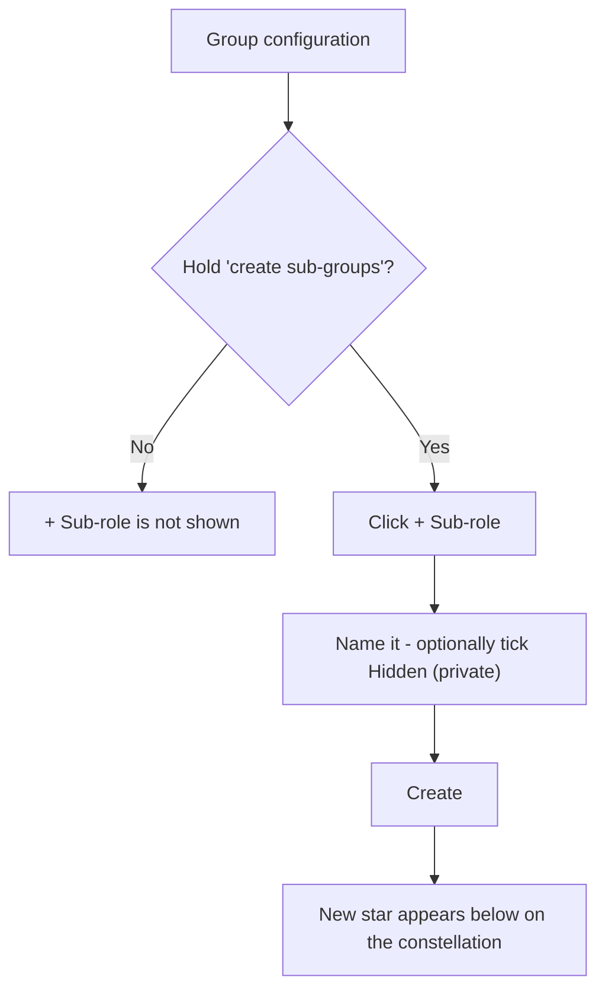

**Setting visibility:**

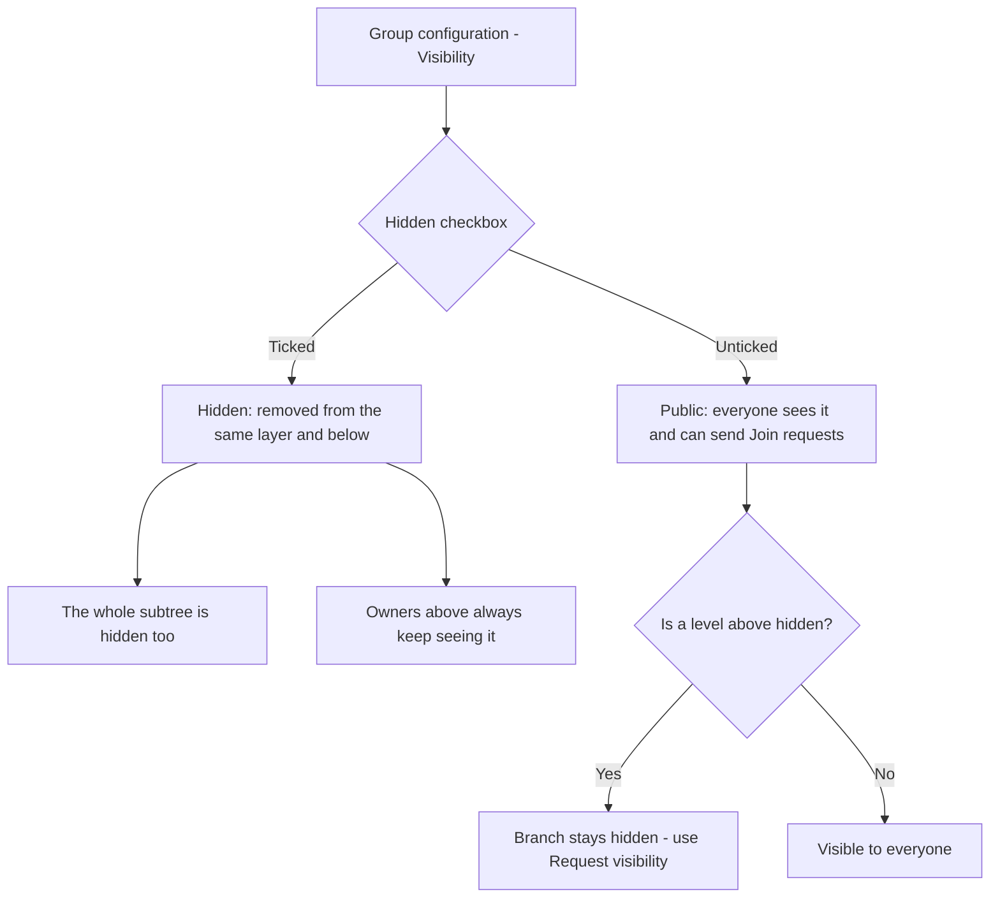

**Deleting a branch:**

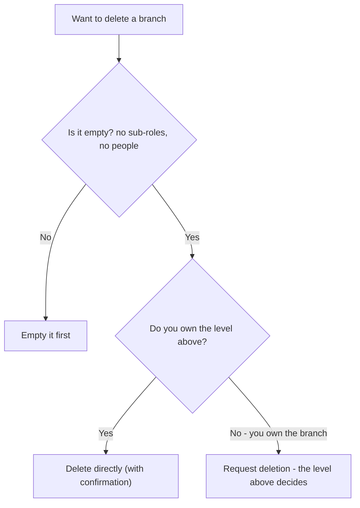

---

## Tips & pitfalls

- **Design top-down.** Create the big divisions first (Engineering, Operations, People), then
  add teams beneath them. Courses placed high can inherit down to everything you add later.
- **Use hidden branches for sensitive teams** — a security team, an M&A workstream, an
  unannounced project. Remember the whole subtree inherits the privacy.
- **Empty before you delete.** Move or remove people and sub-roles first; the branch must be
  empty for deletion to succeed.
- **Prefer wide to deep.** Siblings lay out and label cleanly; deep nesting produces a tall,
  thin tree that is hard to frame and harder to explain.
- **Name branches after teams, not after courses.** "Safety & Compliance" is a branch;
  "Annual Refresher" is a course that lives on it.
- **A hidden branch is still governed.** Hiding does not remove it from the compliance report
  of the owners above it — it removes it from everyone else's map.

---

## 🎬 Make a video of this

**Length:** ~2 minutes. **Working title:** *"Growing the tree."*

| # | Shot | Say |
|---|------|-----|
| 1 | Constellation → click a branch → **Group configuration** | "Everything about a branch's shape lives in one panel." |
| 2 | **+ Sub-role**, type a name, **Create** | "Branches only grow downward. Name it, and it appears." |
| 3 | Tick **Hidden (private)** on a new branch | "Tick hidden and the whole subtree below it disappears from everyone else's map." |
| 4 | Show the same map as an ordinary member — the branch is gone | "Same organization, different map. That's the point." |
| 5 | Root branch → **Logo** → upload | "And on the root, the organization's own face." |
| 6 | Try to delete a branch that still has people | "Delete needs it empty — and, if you don't own the level above, sign-off from someone who does." |

**Script beat to close on:** *"Structure is not paperwork here. It's the rule that decides who
gets taught what."*

**Next:** Chapter 7 — People & governance →

---

# Chapter 7 — People & governance

## What it is

The **People** section of a role is where you place and manage the humans on that branch —
its **owners** (who manage it) and its **members** (who learn from it). It's also where
Knowledge Vault's **least-privilege governance** becomes concrete: you decide exactly which
rights each owner holds.

Open it by clicking a role you govern, then choosing **People**.


The panel groups people into **Owners** and **Members**, each with a count, and gives every
person a card with their name, `@username`, and any special rights shown as small green
chips.

---

## Why it matters

| Parameter | What changes |
|-----------|--------------|
| **Time** | Typing two characters suggests the people who already exist, so nobody is added twice under a misspelt handle — and a person who has not registered yet can still be placed today. |
| **Risk & compliance** | Every right is named, visible on the person's card, and revocable in one click. "Who can publish to this branch?" is answered by looking, not by asking. |
| **Security & custody** | The golden rule — you can only grant a right you hold yourself — makes privilege escalation structurally impossible rather than merely discouraged. |
| **Cost** | Seats are counted per **person**, not per position. Someone who sits on four branches costs one seat, so a rich structure doesn't inflate the bill. |
| **Adoption** | People arrive already placed: their courses are waiting the first time they sign in, with no "please enrol yourself" email. |

---

## Adding a person

1. Select **+ Add person**.
2. Choose whether to add **a member** ("they learn from this branch") or **a co-owner**
   ("they help manage this branch"). The co-owner option only appears if you're allowed to
   appoint co-owners.

   

3. Enter their **username**. **Type two characters and the field suggests people**, marking
   those already in this organization — so you can confirm a person exists before you commit.
   - Unknown usernames are **reserved** — when that person registers, they're attached
     automatically.
   - The same field serves every form that asks for a person, so what you learn here works
     everywhere.
4. Set any rights (see below), then confirm.

If something goes wrong (for example, a typo'd username), the form stays open and tells you —
it never closes silently.

### How many people you can add

Your organization's **plan** sets how many people it may hold. The count is per **person**,
not per position — placing someone who is already in the organization onto another role costs
nothing. Only a brand-new face uses a seat.

When the organization is full, adding someone (or approving their Join request) is refused
with the reason:

> *This organization's plan allows up to 250 members. Upgrade the plan to add more.*

Nobody is removed and nothing breaks — you either free a seat or move to a bigger plan. See
Chapter 17 for the limits each plan carries.

---

## The two kinds of person

### Members
Members receive the branch's courses in their **My Learning**. You can additionally grant a
member the right to **create content** — meaning they can *propose* documents. Their
documents don't go live immediately; they publish only after an owner approves them through
the **review channel** (Chapter 11). In the sample,
*Noah Kim* is a Firmware member with this content-creation grant — and the rig notes he
proposed are waiting for Priya to approve.


### Owners (and co-owners)
Owners manage the branch. When you appoint a co-owner, you choose which rights they get —
and here's the golden rule of the whole platform:

> **You can only grant a right you hold yourself.** An owner can never hand out a capability
> they don't have.

The grantable rights are:

| Right | What it lets the owner do |
|-------|---------------------------|
| **May create sub-groups** | Grow the branch downward with new sub-roles |
| **May appoint further co-owners** | Add other owners to the branch |
| **May create content** *(members)* | Propose documents for manager review |

When you add a co-owner, you tick only the rights you want them to hold — and you'll only be
*offered* the rights you hold yourself:


In the People panel, these appear as chips like **sub-groups** and **appoints co-owners** on
an owner's card — in the screenshot, *Priya Raman* holds both.

---

## Managing existing people

Each person's card carries quick actions:

- **Toggle their rights** — e.g. *Allow / Revoke sub-groups*, *Allow / Revoke co-owner
  rights*, or *Allow / Revoke content* for members. Changes take effect immediately.
- **Remove** — take the person off this branch (with a confirmation). Removing someone from a
  branch doesn't delete their profile or their other positions.

---

## Flows at a glance

**Adding a person (member or co-owner):**

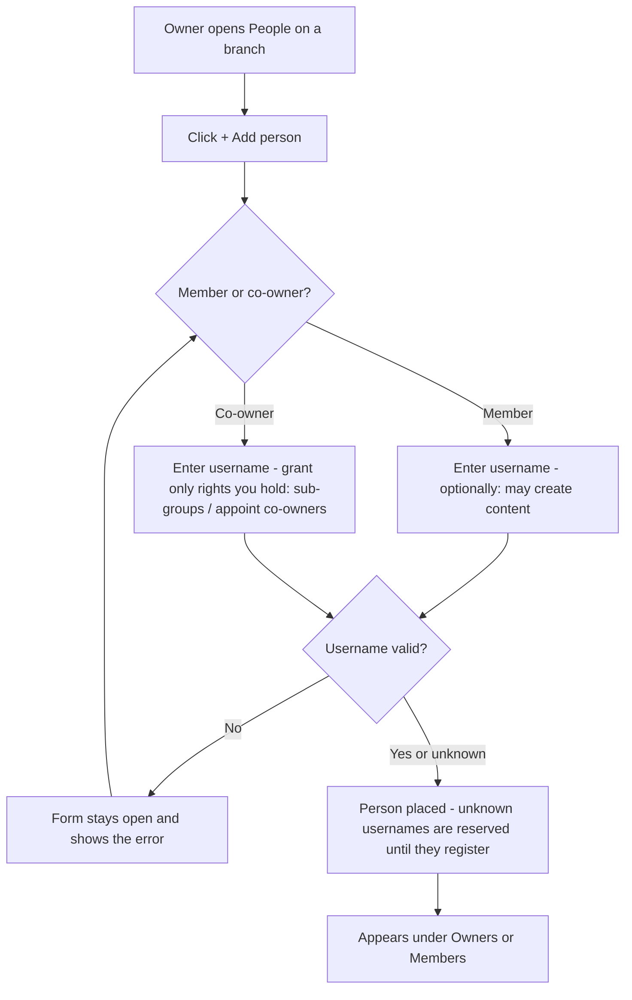

**Least-privilege granting (the golden rule):**

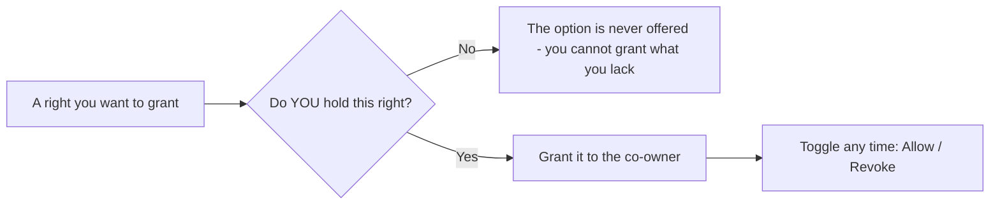

**A member proposing content:**

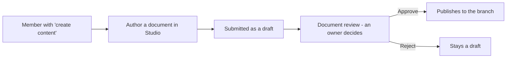

---

## Tips & pitfalls

- **Grant the minimum that gets the job done.** A team lead who only needs to add members
  doesn't need the "appoint co-owners" right. Least privilege keeps your structure safe.
- **Delegate downward.** Give division owners the "create sub-groups" right so they can build
  out their own teams without coming back to you.
- **Content rights are powerful but safe.** Letting a member create content speeds up
  authoring, and the mandatory review step means nothing publishes without an owner's
  approval.
- **Appoint a second owner on day one.** An organization with exactly one owner has a single
  point of failure wearing shoes.
- **Removing someone from a branch is not deleting them.** Their profile, their other
  positions and their completion history are untouched.
- **Watch for the seat limit before a hiring wave**, not during it — the refusal is polite,
  but it still stops you mid-onboarding.

---

## 🎬 Make a video of this

**Length:** ~2 minutes. **Working title:** *"Least privilege, in three clicks."*

| # | Shot | Say |
|---|------|-----|
| 1 | **People** panel, owners and members grouped | "Owners manage. Members learn. Both live here." |
| 2 | **+ Add person** → the member/co-owner chooser | "Two kinds of person, two different forms." |
| 3 | Type two letters in the username field | "It suggests who already exists — and marks who's already here." |
| 4 | Tick *may create content* on a member | "A member can propose documents. They publish after review, never before." |
| 5 | Add a co-owner; show a right you don't hold is not offered | "You can only grant a right you hold yourself. The option simply isn't there." |
| 6 | Revoke a chip on an existing owner's card | "And any right comes back in one click." |

**Script beat to close on:** *"Nobody in this system can quietly give themselves more power
than they were given."*

**Next:** Chapter 8 — Courses: publishing knowledge →

---

# Chapter 8 — Courses: publishing knowledge

## What it is

A **course** is any piece of knowledge you publish to a branch — a document, a book, an
external link, an audio file, a video, or an exam. Courses are the heart of Knowledge Vault:
you place them on roles, decide whether they're mandatory, and let them **inherit** down the
tree so the right people are trained automatically.

Open the **Courses** section by clicking a role you govern, then choosing **Courses**.


The panel has two parts: buttons to **add** a course, and a list of the **courses already on
this role**, each shown with its code, type, classification and placement settings. Your
plan's remaining allowance sits quietly at the **foot** of the panel — a footnote, not a
banner, and absent entirely on a plan with no limits.

---

## Why it matters

| Parameter | What changes |
|-----------|--------------|
| **Time** | Publish once at the right height and it reaches every branch below, now and forever. A new team created next year inherits the whole company's mandatory training the moment it exists. |
| **Risk & compliance** | Deadlines, recurrence and prerequisites are properties of the course, not of a spreadsheet somebody maintains. The compliance report is computed from them, so the report and the rule can never disagree. |
| **Security & custody** | Every course carries a compulsory classification, and a document may be marked non-downloadable so it can be read but not carried away. |
| **Cost** | One document replaces the printed pack, the shared-drive copy and the "final_v3_REALLY_final.pdf" everybody kept locally. |
| **Adoption** | People are not asked to enrol. What reaches their position is simply *there* in My Learning, with the deadline printed on it. |

---

## Publishing a course

You have two ways to create one:

- **+ Upload course** — bring in an existing file, or point to an external URL.
- **✍ Create in Studio** — build an interactive document, book or exam from scratch
  (Chapter 9).

### The upload composer, step by step

Choosing **+ Upload course** opens a two-step composer. The drawer widens to make room for
it, and a counter in the header tells you how many required fields are still empty.


**Step 1 — The material.**

| Field | What it does |
|-------|--------------|
| **What kind of material is this?** | Document, Book, Link, Audio or Video |
| **The file** | Drag it in, or choose it. Up to **10 MB** while the organization has no storage of its own connected — with a NAS connected, the browser uploads straight to your storage and the limit is your disk |
| **…or an address instead of a file** | Anything hosted elsewhere — a shared drive, a recording, a policy site |

**Step 2 — Its properties.**

| Field | What it does |
|-------|--------------|
| **Title** | The course name (also the document's cover title) |
| **Short description** | One or two sentences — shown in the library and on the cover |
| **Scope** | Who it applies to and what it covers — added to the standard cover |
| **Classification** *(required)* | Public / Confidential / Private / Secret |
| **Library shelf (category)** | A tag like *Governance*, *Safety*, *Engineering* |
| **Deadline (days)** | How long someone has to finish it **after it reaches them** |
| **Retake every N days** | For recurring/annual training |
| **Prerequisite codes** | Courses that must be completed first |
| **Replaces** | An existing course this one supersedes or coexists with (Chapter 11) |

There are also checkboxes for **Allow download**, **Publish to the library**, **Mandatory**,
**Inherit to lower branches**, and **Updates reset completion**.

> **Smart shelf suggestions:** as you type a title and description, Knowledge Vault suggests
> an existing library shelf where similar content already lives — so related material stays
> together. You can always accept the suggestion or keep your own tag.

Select **Publish course** and it appears on the branch, in members' My Learning, and (if you
chose) in the library.

> **Read the deadline field literally.** *Deadline (days)* is how long a person has **after
> the course reaches them** — which is the later of the day it was placed on their branch and
> the day they joined that branch. Somebody who starts on Monday is not instantly late for a
> course that has been on the branch for a year. Chapter 15
> shows what that looks like in the report.

---

## Course codes

Every course gets a permanent, platform-unique code the moment it is published:

```
100 - 102 - 0001
 │     │      └── the sequence number within that role
 │     └───────── the role number that published it
 └─────────────── the organization number
```

`100-102-0001` is the first course published by role 102 (*Operations*) in organization 100
(*Aurora Robotics*). Codes never change and never get reused — which is why prerequisites,
supersessions and audit records can all point at them safely.

---

## Placement settings: mandatory & inherit

Every course on a role shows two toggles you can flip any time:

- **mandatory ✓ / opt-in** — whether people *must* complete it, or may choose to.
- **inherits ↓ ✓ / this role only** — whether the course reaches every branch beneath this
  role, or stays put.

This is how one course, placed once at *Executive Office*, becomes mandatory training for the
whole company. In the sample, **Code of Conduct & Ethics** and the **Data Handling Standard**
are both mandatory and inherit down from the top; **Robot Cell Safety — Level 1** does the
same from *Operations*, so it reaches *Safety & Compliance* without being placed there.

Other actions per course:

| Action | What it does |
|--------|--------------|
| **⚙ Properties** | Everything the composer asked, editable — plus the **edition log** |
| **⏸ Take out of deployment** | Readers keep the live edition; nothing new is served while you rewrite |
| **✎ Revise** *(Studio material)* | Opens the live edition in the Studio to publish the next one |
| **⇪ Replace file** *(uploads)* | Swaps the file behind the same course, as a new edition |
| **Unplace** | Remove from this branch only — the course still exists elsewhere |
| **Archive** | Keep it, stop new assignments |
| **Delete** | Remove it everywhere; completion history is preserved |

---

## Classifications

Every course must carry a classification, shown as a coloured badge everywhere it appears:

| Badge | Classification | Typical use |
|-------|----------------|-------------|
| 🟢 **Public** | Public | Anyone in the org |
| 🟡 **Confidential** | Confidential | Need-to-know |
| 🟣 **Private** | Private | A specific group |
| 🔴 **Secret** | Secret | The most sensitive material |

The classification menu is drawn as a light sheet with dark ink on **every** theme —
deliberately, because the browser draws that menu itself and platforms disagree about how
much styling they honour. It is the one control in the product that ignores your theme, so
that it can never be four invisible lines.

---

## Members proposing content

If you granted a member the **create content** right
(Chapter 7), the documents they author arrive as a
**proposal** and enter the **review channel**. As an owner, you approve, reject, or send it
back with a note; only on approval does it publish.
Chapter 11 covers the whole channel.

---

## Flows at a glance

**Publishing a course:**

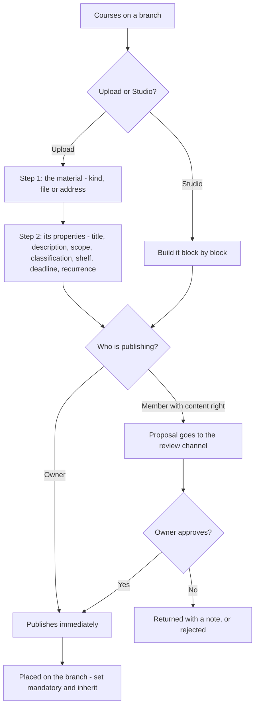

**Configuring a placed course (owner controls, anytime):**

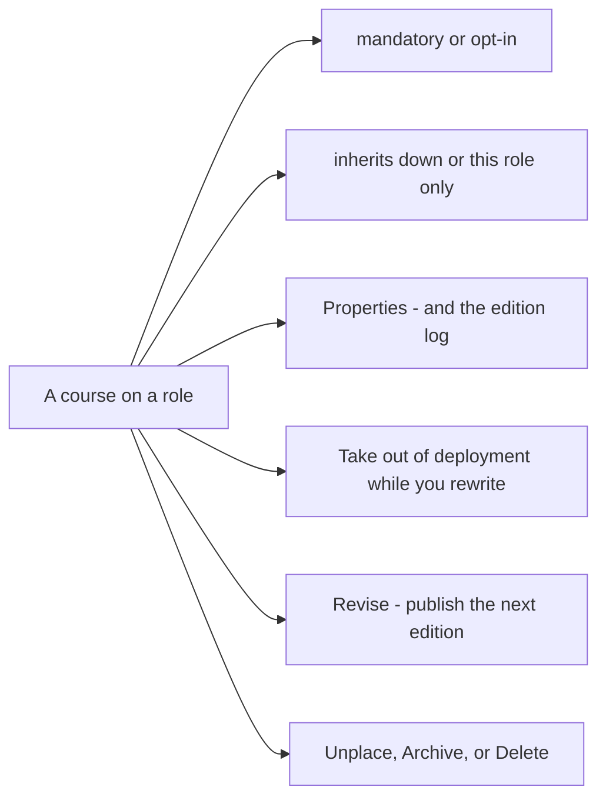

---

## Tips & pitfalls

- **Place high, inherit down.** For company-wide training, publish once at the top with
  *inherit* on — you won't have to repeat yourself for every team.
- **Use deadlines and recurrence for compliance courses.** A 14-day deadline plus an annual
  retake keeps mandatory training current, and feeds the Compliance dashboard
  (Chapter 15).
- **Prerequisites build learning paths.** Require *Robot Cell Safety — Level 1* before the
  *Assessment*, and people are guided through in the right order — the exam simply won't open
  until the reading is done.
- **Opt-in is not useless.** A course in the library that nobody must do is how a good
  reference document reaches the people who want it, without adding a red badge to everyone's
  dashboard.
- **Archive rather than delete** when material is superseded but historically interesting.
  Deleting keeps the completion history, but the document itself is gone.
- **Don't upload what you can author.** A Studio document is searchable, zoomable, printable
  and revisable in place; a PDF is a picture of a document.

---

## 🎬 Make a video of this

**Length:** ~3 minutes. **Working title:** *"Publish once, reach everyone."*

| # | Shot | Say |
|---|------|-----|
| 1 | Courses panel on the root branch | "Everything published to a branch lives here — and so does everything it inherits." |
| 2 | **+ Upload course** → step 1, choose *Document*, drop a file | "Step one is the material: a file, or an address if it lives elsewhere." |
| 3 | Step 2 — fill title, description, pick **Confidential** | "Step two is what it *is*. Classification is compulsory; there is no unlabelled document here." |
| 4 | Set **deadline 14**, **retake 365**, tick **mandatory** and **inherit** | "Fourteen days from the day it reaches you, every year, for everyone below this branch." |
| 5 | Publish; cut to a junior member's My Learning | "One publish. It's already on their list, with the deadline printed on it." |
| 6 | Back on the panel, toggle *mandatory → opt-in* | "And every one of those decisions is reversible in a click." |

**Script beat to close on:** *"The tree decides who. The course decides when. Nobody maintains
a matrix."*

**Next:** Chapter 9 — The Document Studio →

---

# Chapter 9 — The Document Studio

## What it is

The **Studio** is a full document editor built into Knowledge Vault. Instead of uploading a
file, you compose a document right in the browser from **blocks** — headings, rich text,
tables, checklists, callouts, quotes, code, images, audio and video, buttons, columns and
page breaks — format them exactly as you want, and watch them render live in your
organization's standard document frame.

You reach the Studio from a role's **Courses** panel via **✍ Create in Studio**, or from any
of your own positions via **✍ Propose a document**.


---

## Why it matters

| Parameter | What changes |
|-----------|--------------|
| **Time** | No round trip through Word, a PDF export and an upload. Write, preview, publish — and revise in the same room a year later without hunting for the source file. |
| **Risk & compliance** | The cover, the classification banner, the version and the footer are added by the platform, so every document in your organization is formatted identically whoever wrote it. |
| **Security & custody** | Rich text is sanitised on write *and* again on render, so nothing authored here can carry markup into a reader's browser. Exam answer keys never leave the server. |
| **Cost** | One editor for documents, books, decks and exams. No authoring licence, no template pack, no design time. |
| **Adoption** | Blocks behave the way people expect from a modern editor — drag, drop, undo — and the browser keeps a copy as you type, so nobody loses an afternoon to a crash. |

---

## The front door: what are you creating?


The Studio asks one question before it opens anything:

- **Document** — the block editor described in this chapter.
- **Test / exam** — a multiple-choice paper people sit, marked against a pass mark. See
  *Building an exam* below.

Underneath sits **Continue a draft**, which lists unfinished work in the two places it can
live:

- **On this browser** — whatever you last had open here. Kept as you type, on **every plan**,
  on this device only. A reload or a crash never costs you your work.
- **Saved drafts** — work you parked on the server with **Save draft**. It belongs to your
  account, carries the branch it was written for, and opens on any device you sign in from.
  Parking work on the server is part of a **paid plan**; on the free plan the section says so
  and **Save draft** is locked in both editors.

Selecting any entry reopens it in the editor that wrote it, exactly where you left off. The
✕ beside a saved draft deletes it from the server.

---

## The layout

The Studio has four parts:

1. **The ribbon (top)** — formatting for whatever you are writing in: paragraph style, font,
   size, **bold**, *italic*, underline, strikethrough, **text colour**, **highlight**,
   alignment, bulleted and numbered lists, indenting, links, clear formatting, undo/redo and
   zoom.
2. **The left rail** — three tabs:
   - **Insert** — every block you can add. Click to append it, or drag it onto the page and
     drop it exactly where you want. The table entry has a size picker: hover the grid and
     click, e.g. 4 × 3.
   - **Pages** — the document's pages. Jump to a page, name it, choose its **turn animation**,
     add a page, or remove a page break.
   - **Drafts** — documents you parked on the server (see *Saving your work* below).
3. **The canvas (middle)** — your document as a stack of cards that look like the printed
   page. Hover a card for its rail: drag handle (⠿) to move it, ↑ ↓ to nudge it, ⧉ to
   duplicate, ⇄ to **turn it into** another kind of block, ✕ to delete.
4. **The inspector (right)** — two tabs:
   - **Format** — everything about the selected block: alignment, width and position,
     padding and spacing, text colour, fill, accent, line height, letter spacing, border,
     shadow, corner radius and an **entrance animation** that plays as the reader scrolls to
     it. Media blocks also get their playback settings here.
   - **Document** — the document itself: classification, type, library shelf, description
     and scope (these become the cover pages), where it is placed, and how much of your
     plan's document allowance is left.

The note at the top of the canvas is a reminder: **cover, classification header and footer
are added automatically when you publish.** You focus on content.

---

## The blocks

| Block | Use it for |
|-------|-----------|
| **Heading** | Section titles, six levels |
| **Text** | Rich paragraphs — colour, highlight, alignment, lists, links |
| **Checklist** | Steps to tick off, each with an optional hint |
| **Callout** | A highlighted note in one of six tones |
| **Quote** | A pull quote with its source |
| **Code** | A monospaced snippet, stored exactly as typed |
| **Table** | Rows and columns you edit like a sheet |
| **Contents** | A table of contents, built from your own headings |
| **Collapsible** | Expandable panels — FAQs, clauses, optional detail |
| **Image** | A picture with a caption |
| **Audio / video** | A player with speed, quality and skip rules |
| **Embed** | YouTube, Vimeo, Drive, Docs, Sheets, Slides, Forms, Maps, Calendar |
| **Button** | A call-to-action link |
| **Columns** | Two to four side-by-side sections |
| **Divider / Spacer** | A section break, or breathing room |
| **New page** | A page break, with its own turn animation |

---

## Moving things around

Everything on the page moves by dragging, with a mouse, a pen or a finger:

- **Add a block** — drag it from the **Insert** rail onto the page. A coloured line shows
  exactly where it will land; let go and it drops there. Clicking the entry instead adds it
  at the end.
- **Move a block** — grab the **grip strip down its left edge** (or the ⠿ button in its
  toolbar) and drag. The block you are carrying rides along with the pointer as a small
  label, so you always know what is moving.
- **Reorder pages** — drag the page cards in the **Pages** tab.
- **Rebalance columns** — drag the divider between two columns.
- Drag near the top or bottom of the window and the page **scrolls by itself**. Press
  **Esc** mid-drag to cancel and put everything back.

---

## Tables that behave like a spreadsheet

Select a table block and you get a real grid:

- **Column headers (A, B, C…)** — click one for a menu: insert a column left or right, set
  its width, or delete it. **Row numbers** do the same for rows.
- **+ Row / + Column** buttons, and a **+** at the end of the grid.
- **Select a range** — click a cell, then shift-click another — and format the whole
  selection at once: bold, italic, alignment, or a fill colour.
- **Paste a block of data** copied from a spreadsheet (or any tab- or comma-separated text)
  into a cell and it fills the grid, expanding it as needed.
- **Table options** along the bottom: header row, header column, banded rows, compact
  spacing, frozen header, border style and a caption.
- **Turn text into a table** — select a paragraph or checklist, press ⇄ and choose *Table*.
  Each line becomes a row. The same menu turns a table back into a checklist.

**Tab** moves to the next cell, **Enter** to the next row (adding one when you reach the
bottom), and the arrow keys move up and down.

---

## Audio and video that behave the way training material should

Add an **Audio / video** block, paste the address, then open the inspector's **Format** tab:

- **Speed control** — offer the reader 0.5× to 2×, and set the speed it starts at.
- **Quality ladder** — add a rendition per quality (1080p, 720p, low data). The reader
  switches between them from the player and keeps their place.
- **Skip control** — turn *Reader may skip ahead* **off** for material that must genuinely be
  watched: rewinding stays allowed, but jumping past the furthest point actually watched is
  refused, and the player shows a **🔒 no skipping** badge.
- **Watched-in-full marker**, poster image, captions file, a **clip window** (start and end
  seconds), autoplay, loop, start muted, and whether the browser's download control appears.

---

## Embedding other things

The **Embed** block frames content from the tools an organization already uses: YouTube,
Vimeo, Google Drive, Docs, Sheets, Slides, Forms, Maps and Calendar. Paste the ordinary
share link and it appears in the document.

Other addresses are refused on purpose. The platform only frames hosts it knows, and it
rebuilds the address itself before storing it, so a document can carry a briefing video or
a sign-up form without carrying anything else into the vault.

---

## Themes and templates

- **Templates.** A new document offers a starting point — *Policy*, *Procedure*, *Handbook*,
  *Training*, *Announcement* — each a real document with its sections already in place. Pick
  one and edit; nothing is locked.
- **Themes.** The inspector's **Document** tab sets the look of the whole document at once:
  type pairing, accent colour, paper, density, how headings are set, and the page width. The
  theme travels with the document, so readers see exactly what you chose.

---

## Pages and motion

Every **New page** block starts a new page, and carries the animation the page arrives with —
fade, slide, push, flip, zoom or reveal. Readers turn pages with the ← → keys in the viewer.
Individual blocks can also have an **entrance animation** that plays when the reader scrolls
to them. Readers who ask their device for reduced motion get the document without animation,
automatically.

---

## Three ways to look at your document

- **✎ Edit** — the editor.
- **👁 Preview** — the finished document inside the standard frame: classification banner,
  cover, description and scope.
- **▷ Present** — a full-screen, page-by-page presentation. Turn pages with ← →, leave with
  **Esc**.

Preview also has a **device switcher** — desktop, tablet, phone — so you can check the
document reads properly on the screen your colleagues will actually open it on.

---

## Saving your work

Work in progress lives in two places, and both editors behave the same way:

- **This browser — always, on every plan.** What you are writing is kept here as you type, so
  a reload or a crash never costs you your work. It is this device only, and it holds one
  document and one exam per branch.
- **The server — Save draft, paid plans only.** Parks the whole thing (content *and* its
  publish settings) under your account, so you can close the laptop and pick it up anywhere.
  Reopen it from the **Drafts** tab inside the editor, or from **Continue a draft** on the
  Studio's front door. On the **free plan** the button shows a padlock and explains the
  capability; ask your organization's main administrator to arrange an upgrade. Nothing is
  lost meanwhile — the browser copy is still there, and you can publish at any time.

Neither copy is visible to anyone else. A draft becomes something colleagues can see only
when you publish it (or submit it for review).

Keyboard: **Ctrl + Z** undo, **Ctrl + Shift + Z** redo, **Ctrl + S** save draft.

---

## Publishing

1. Add and format your blocks.
2. Open the inspector's **Document** tab and set the **title**, **classification**
   (compulsory), **description** and, if useful, the **scope** and library shelf.
3. Check **Preview**.
4. Select **Publish**.

- **Owners publish directly** — the document goes live on the branch straight away.
- **Members with the content grant submit for review** — the document becomes a proposal an
  owner approves before it publishes
  (Chapter 7 grants the right;
  Chapter 11 is the channel it travels through).

### One definition of "ready to publish"

The button tells you where you stand before you press it. A chip beside it reads
**Ready to publish** when every compulsory property is filled in, or names what is missing —
a title, a description, a classification. Hover anything marked compulsory and a hint says
*why* it is compulsory. The same three doors — publish, submit for review, save a draft — all
consult the same definition, so a document that is ready in one is ready in all of them.

Your plan may include a number of **custom documents** — the Free plan allows 30 documents and
30 uploads; every paid plan is unlimited. The status bar and the inspector show how many are
left when there is a limit at all. When the allowance is used up, the Studio says so and
points you at your main administrator, who can arrange an upgrade
(Chapter 17).

---

## Building an exam

Choosing **Test / exam** at the front door opens the same room with a form in the middle: an
ordered list of questions instead of a page of blocks. Everything *around* it is unchanged —
the exam is a course with the same code, classification, description, library shelf and
placement switches a document has, and a member's exam goes through the same review.

**The questions.** Each card has its type, the question, an optional helper line, and its
answer options with the right one(s) ticked:

| Type | Answering |
|------|-----------|
| **One answer** | Exactly one option is right |
| **Several answers** | The whole set must be picked — half an answer is not a right answer |
| **True / false** | A statement to judge |

The card tells you what is still missing ("no correct answer marked"), and the left rail
lists every question so you can jump around and reorder.


**The rules** (inspector → **Exam**):

- **Pass mark** — the percentage needed to pass, shown as the marks it works out to.
- **Marks** — every question counts the same by default. Switch on **unequal weights** and
  each card gains a marks box.
- **Answer feedback** — whether the candidate is told if an answer is right: **as they
  answer** (live, question by question), **after submitting**, or **never**. Separate
  switches show which option was right, your explanation, and the score.
- **Delivery** — randomise the question order and/or the options, one question per screen, a
  time limit, and how many attempts each person may take.

**Trying it.** **▷ Try it** sits your own paper exactly as a candidate would. It is marked in
your browser and recorded nowhere, so try it as often as you like.

**Sitting it.** Members open the exam from My Learning like any other course, inside the
standard document frame. Marking happens on the server — the answers never travel to the
candidate's browser — and an exam is completed by **passing** it, not by ticking it off.

**Exam conditions.** A candidate's paper opens on the **whole screen** and stays there: if
they leave full screen, the paper is covered until they come back. Leaving the exam
altogether — another tab, another window — for more than **five seconds** is counted:

| Interruption | What happens |
|---|---|
| 1st | The paper is covered: *"You left the exam — warning 1 of 2."* |
| 2nd | The same, with the warning that the next one ends it. |
| 3rd | The paper is **handed in automatically** and marked on whatever was answered. |

The rules are stated on the exam's start screen, before anyone begins, and each attempt
records how often the candidate left. Your own **▷ Try it** run is not policed — only real
sittings are.

---

## Revising something you already published

Documents and exams built in the Studio can be revised by the people who answer for them:
the course's editors, the **branch's owner**, and the **owners above them**. Because readers
are on the current edition, the order is fixed — and the Studio walks you through it.


From the branch's **Courses** panel, each Studio-built course shows its edition (**v1.0**)
and two controls:

1. **⏸ Take out of deployment** — the course stops reaching anyone and leaves the library.
   Its placements are kept exactly as they are, so nothing has to be set up again.
2. **✎ Revise** — opens the published edition in the Studio it was written in.
3. **Publish v2.0** — saves your changes as the next edition and puts the course straight
   back into deployment on the same branches.

While the course is still live the Studio says so and keeps **Publish** disabled, with the
button right there to take it out of deployment. You can also take a course out and simply
**▲ Put back** unchanged.

- **The version label** — v1.0, v2.0, v3.0 — follows the course everywhere people see it:
  the library, My Learning, the reader's header bar and the branch's list.
- **Placement is not part of a revision.** Mandatory and inheritance belong to the branch;
  a new edition keeps whatever the old one had.
- If the course has **Re-reading required after an update** switched on, publishing a new
  edition expires the completions of the old one and asks those people to read (or sit) it
  again.
- Revisions are not drafts: the Studio opens the edition as published, and **Save draft** is
  not offered while revising.

Chapter 11 covers the whole editions story — the edition
log, what a reader sees mid-revision, and how to replace one document with a different one.

---

## Tips & pitfalls

- **Preview before you publish.** The live preview shows the exact cover, classification
  banner and footers members will see.
- **Use checklists for procedures.** Release gates, safety steps and onboarding tasks read
  beautifully as tickable checklists.
- **Break long books into pages.** Name each page in the **Pages** tab and the navigator
  becomes a table of contents you can jump around in while you write.
- **Highlight sparingly.** A single highlight colour through a document reads as emphasis;
  five read as decoration.
- **Write the description as if it is the only thing read.** In the library and on the cover,
  often it is.
- **Take it out of deployment before a big rewrite**, not after. Readers keep the edition
  they have, and nobody is left mid-document on a page you are deleting.
- **Try your own exam** before anyone sits it. Five minutes with **▷ Try it** catches the
  question with two right answers.

---

## 🎬 Make a video of this

**Length:** ~4 minutes. **Working title:** *"Writing a real document, in the browser."*

| # | Shot | Say |
|---|------|-----|
| 1 | Courses panel → **✍ Create in Studio** → the chooser | "One question first: a document, or an exam?" |
| 2 | Drag a Heading and a Text block onto the page | "Blocks, dragged where you want them." |
| 3 | Insert a checklist, type three steps | "Procedures read best as things you can tick." |
| 4 | Open the inspector's **Document** tab, set title + classification | "This is where it becomes a document rather than a page: a title, and a classification." |
| 5 | Point at the **Ready to publish** chip | "It tells you what's missing before you press anything." |
| 6 | **Preview** — the cover page appears | "The cover, the banner, the version — added for you." |
| 7 | **Publish**, then reopen with **✎ Revise** | "And a year later, the same room, the same document, publishing v2.0." |

**Script beat to close on:** *"The document you publish here is still editable next year —
which is not true of the PDF you uploaded."*

**Next:** Chapter 10 — Exams & assessment →

---

# Chapter 10 — Exams & assessment

## What it is

An **exam** is a course you *sit* rather than read. It is built in the same Document Studio as
everything else, delivered question by question, and **marked on the server** — the answer key
never reaches the candidate's browser, so there is nothing to inspect, copy or reverse.

Passing an exam completes the course exactly the way finishing a document does: it writes the
same completion record, so it lands in **My Learning** and in your branch's **Compliance**
view through the same door.

> **Where it lives:** Studio → *Create an exam*. Candidates find it in **My Learning**, on a
> button that reads **Complete the exam**.

---

## Why it matters

| Parameter | What changes |
|-----------|--------------|
| **Time** | Marking is instantaneous and needs nobody. A hundred candidates cost the same as one, and the result is in the compliance report before the candidate has left the room. |
| **Risk & compliance** | "They attended the briefing" becomes "they scored 88% on the paper, at 14:02 on the 9th, on their first attempt". That is the difference between a training record and evidence. |
| **Security & custody** | The answer key never reaches the candidate's browser — marking happens on the server. There is nothing to inspect, copy or reverse. |
| **Cost** | No proctoring service, no scanning, no marking time. The invigilator is built in. |
| **Adoption** | The paper looks like the rest of the product: same frame, same reader, same completion. Candidates do not learn a second system to be assessed in. |

---

## 1. Building a paper

Open the Studio from any branch you publish to and choose **exam** when it asks what you are
creating. You then work question by question:

| Question type | What the candidate does |
|---------------|------------------------|
| **Single choice** | Picks exactly one option. |
| **Multiple choice** | Picks every option that applies — partial answers do not score. |
| **True / false** | A single-choice question with the options written for you. |

Each question can carry:

- an **image** (a diagram, a screenshot, a photo of the equipment),
- a short **help line** shown under the prompt,
- an **explanation**, revealed after the answer depending on your reveal setting,
- a **weight**, when the paper is set to weighted marking, and
- a **required** flag, so the paper cannot be handed in with it blank.

---

## 2. The settings that matter

The Inspector's **Exam** tab is where a paper becomes an assessment rather than a quiz.


| Setting | What it does |
|---------|--------------|
| **Pass mark** | The percentage a candidate must reach. Below it, the attempt is recorded but the course is not completed. |
| **Weighted marking** | Score by question weight instead of one point per question. |
| **Reveal** | *Immediate* (right/wrong as they go), *after submission*, or *never*. |
| **Show correct answer / explanation / score** | Three separate switches — you can show the score without ever showing the key. |
| **Time limit** | Minutes for one sitting. When it runs out the invigilator hands the paper in as it stands. |
| **Attempts allowed** | How many sittings a candidate gets. Blank means unlimited. **This is the setting §5 below and Chapter 15 talk about.** |
| **One question per page** | Turns the paper into a guided sequence rather than a long scroll. |
| **Pass required to complete** | When off, sitting the paper at all completes the course, whatever the score. |
| **Shuffle questions / options** | Each candidate gets their own order. |

### The invigilator

While a paper is open the platform watches for the candidate leaving it — switching tab,
switching app, minimising the window. Each departure is counted, the candidate is warned, and
on the **third** one the paper is handed in as it stands. The attempt records both the number
of interruptions and whether it was auto-submitted, so a manager reviewing a poor result can
see *how* it happened.

---

## 3. Sitting an exam

In **My Learning** an exam shows the same row as any other course, with one difference: the
button reads **Complete the exam** rather than *Open*.

If the exam has a **prerequisite** they have not finished, there is no Start button at all —
the reader says what has to be read first instead:


Otherwise, the brief:


What the candidate sees before they start:

- the number of questions and total marks,
- the pass mark,
- the time limit, if there is one,
- **how many attempts they have left**, and
- their best previous score, if they have sat it before.

There is no *Mark complete* button on an exam. An exam is completed by being **passed** (or,
when *pass required* is off, by being sat) — never by declaring it done.

Pressing **Start the exam** hands over the whole screen: the questions, a progress counter,
and the clock if there is a time limit.


Answers are saved as they are given, and the counter at the top reads *n of 8 answered* so
nobody submits a paper with a question they never saw.


Handing it in asks once, because there is no undo:


Then marking happens on the server and the result comes straight back — the score, the
verdict, how many attempts remain, and (depending on the author's reveal settings) which
answers were right and why:


---

## 4. Attempts, and running out of them

If the author set an attempt allowance, every sitting spends one. When the last is spent
without a pass:

1. The exam **locks**. Opening it again explains why rather than dealing a fresh paper.
2. The candidate gets a message in their **mailbox**: *"No attempts left on …"*, with what
   happens next.
3. **Everyone who looks after them** gets one too, so nobody has to notice on their own.
4. In the branch's **Compliance** view that person's row now reads **"Has used every attempt
   the exam allows and cannot sit it again until a manager resets it"** — not a vague
   *not completed* — beside the attempts used and their best score.


The candidate sees the same fact from their side, on the exam itself:


---

## 5. Resetting a candidate's attempts

**Who can do this:** anyone who can add people to that branch — its owners, and the levels
above them. A peer cannot reset a peer.

1. Open **Compliance** and choose the branch.
2. Expand the exam. Tick the candidates you want to release.
3. Select **♻ Reset attempts**.

What happens:

- Their allowance goes **back to zero used** — they can sit the paper again immediately.
- Their previous sittings are **kept on record**, marked as no longer counting. Nothing is
  erased; the history of what happened survives the reset.
- Any half-finished completion record goes back to *assigned*, so the exam reappears as
  something to do.
- The candidate is told, in their mailbox, that they can try again — and by whom.

> **Why not just delete the attempts?** Because "she failed three times and then passed" and
> "she passed first time" are different facts, and an audit that cannot tell them apart is
> not an audit. The reset changes what the candidate *may do next*, never what already
> happened.

---

## 6. Reading results

An exam attempt records, for every question: what was chosen, whether it was right, the marks
available and the marks earned — plus the total, the percentage, the pass/fail verdict, how
long the candidate took, how many interruptions the invigilator saw, and whether the paper was
handed in automatically.

Compliance shows the **best** attempt. A candidate who passes on their third go is compliant;
the earlier attempts remain visible as the story of how they got there.

---

## Tips & pitfalls

- **Set an attempt allowance on anything that matters.** Unlimited attempts turn a pass mark
  into a guessing game.
- **Reveal nothing on a serious paper.** *Show score* without *show correct answer* tells a
  candidate where they stand without teaching them the key.
- **Use the reset as coaching, not paperwork.** Before you reset, send the reminder that says
  what to revise — the note you type is delivered with it.
- **Weight the questions that carry the risk.** A weighted paper says what the organization
  actually cares about far better than an even split does.
- **Put the reading in front of the paper.** Make the document a prerequisite of the exam and
  the exam simply will not open until it has been read — the reader shows *Related — required
  first* instead of a Start button.
- **Shuffle both** questions and options on anything sat in a shared room.
- **Twelve minutes for eight questions** is generous; ninety seconds a question is the usual
  rule of thumb for multiple choice. A timer that never bites teaches nothing.
- **Don't reset in bulk without a note.** The reset message is the coaching; a silent reset
  just resets.

---

## 🎬 Make a video of this

**Length:** ~3 minutes. **Working title:** *"An exam that marks itself — and says why someone
failed."*

| # | Shot | Say |
|---|------|-----|
| 1 | Studio → *Test / exam* → add a single-choice question | "Same Studio, a different middle: questions instead of blocks." |
| 2 | Inspector → **Rules**: pass mark 70, attempts 2, timer 12 | "The pass mark, the attempts, and the clock." |
| 3 | **▷ Try it** — sit your own paper | "Try it yourself. It's marked in your browser and recorded nowhere." |
| 4 | Cut to a candidate: **Complete the exam** → full screen | "The candidate gets the whole screen — and it stays that way." |
| 5 | Submit, show the marked result | "Marked on the server. The key never reaches the browser." |
| 6 | Manager's Compliance → the locked row → **♻ Reset attempts** | "And when someone runs out of attempts, the report says exactly that — and a manager can hand back the allowance without erasing what happened." |

**Script beat to close on:** *"Attendance is a memory. A marked paper is a record."*

**Next:** Chapter 11 — Editions, versions & the review channel →

---

# Chapter 11 — Editions, versions & the review channel

> **In one line:** nothing published here is ever quietly overwritten — a change becomes a
> numbered **edition** with a note saying what changed, a replacement either **coexists** with
> what it replaces or **supersedes** it, and anything a member writes travels through a
> **review channel** with a real conversation in it.

## What it is

Three related ideas, all answering the same question: *what happens to a document after it is
published?*

1. **Editions** — the history of one document. v1.0 becomes v2.0 becomes v3.0, each with a
   dated line saying what changed and who changed it.
2. **Replacement** — the relationship between two different documents. The new *Cell Safety
   Standard* either sits beside the old one, or retires it and inherits everywhere it reached.
3. **The review channel** — how a document written by a member becomes a document the
   organization has published, with a conversation attached.

---

## Why it matters

| Parameter | What changes |
|-----------|--------------|
| **Time** | Revising in place keeps the code, the placements, the ratings and the completion history. The alternative — delete and re-upload — costs all four and has to be reassigned by hand. |
| **Risk & compliance** | An auditor's real question is "which version were people trained on, and when did it change?" The edition log answers it without anyone reconstructing the story from emails. |
| **Security & custody** | Superseding carries the old document's placements across automatically, so a replacement can never quietly narrow its own audience and drop people out of compliance. |
| **Cost** | One document with eleven editions instead of eleven documents. The library stays the size of the subject matter, not the size of the history. |
| **Adoption** | Readers are never left mid-document on a page being rewritten: they keep the live edition until the new one is published. |

---

## 1. Editions — revising one document

Studio-built material *and* uploads are revised the same way, by the people who answer for
them: the course's editors, the **branch's owner**, and the **owners above them**.

The order is fixed, because readers are on the current edition:

1. **⏸ Take it out of deployment.** It reaches nobody and leaves the library. Every placement
   is kept exactly as it was, so nothing has to be set up again.
2. **✎ Revise it** — Studio material opens in the Studio, at the edition as published. An
   upload offers **⇪ Replace file** instead: a new file, or a new address.
3. **Publish v2.0** — the version moves up, the course returns to deployment on the same
   branches, and — if *updates reset completion* is on — the completions of the older edition
   expire and those people are asked to read (or sit) it again.


The Studio refuses to publish a content change while the course is still live, and says why,
with the button to withdraw it right there. You can also take a course out and simply
**▲ Put back** unchanged.

### The edition log

Every publication writes a line: the **version**, the **note** the author wrote about what
changed, **who** published it, and whether it **expired existing completions**.

You read it from the course's **⚙ Properties** sheet, on its **Version history** tab — the
number beside the tab is how many editions there have been:


- Edition 1 is written when the course is created; every content republish adds another.
- A **metadata-only** edit — fixing a shelf tag, correcting a description — is deliberately
  **not** an edition. Nothing reached the reader differently, and fixing a typo in a category
  should not cost the organization a re-read.
- Any member can read the log. Knowing that what reaches you today is the third edition is
  not privileged information.

> **A version number that moves with nothing recorded against it is not version control — it
> is a counter.** That is why the note is asked for at publish time, not offered as optional
> afterwards.

---

## 2. Editing what is already published, without a new edition

Some things are *what the organization says about* a document rather than the document
itself: its shelf, its description, its scope, its deadline, its recurrence, whether it may be
downloaded, its prerequisites.

These are editable at any time by anyone who may manage the course, from the branch's course
list → **⚙ Properties**. Changing them causes **no version bump, no deployment pause, and no
expired completions**.

The same panel is used wherever a document is created or edited, so a document's capabilities
never depend on which door it came through: a PDF you uploaded can carry a deadline and
prerequisites exactly as a Studio document can.

---

## 3. Replacement — coexist or supersede

Editions count versions of *one* document. Replacement answers the other question: what does a
**new** document do to the one that already covers the subject?

At publish time you may name an existing course and choose:

| Mode | What happens |
|------|--------------|
| **Coexist** *(default)* | Both stay live. Right for a regional variant, an older product line, a different audience. |
| **Supersede** | The older document is retired: **every branch it reached receives the new one on the same terms** — mandatory, inheritance, deadline, recurrence — it leaves the library, and it is archived and taken out of deployment. |

And the parts that make superseding safe:

- The retired document keeps its **completion history**, and its **code resolves forever**.
  An old reference lands the reader on the current word on the subject rather than a dead end.
- Everyone who had completed the retired document is **told where the subject now lives**.
- Superseding needs authority over the document being retired. A **member's** replacement is
  held until the reviewer approves it — the retirement happens on approval, never on
  submission.

---

## 4. The review channel

A member with the **create content** right
(Chapter 7) can propose documents for their branch.
What they write is created as a **draft** — never in the library, reaching nobody — and a
**Document review** lands with the branch's manager.


The reviewer **previews the draft in a window of its own**, filling the screen, so the
document is read the way its readers will read it. Then there are three outcomes — and the
third one is the one reviews are actually for:

| Outcome | What happens |
|---------|--------------|
| **Approve & publish** | The reviewer sets mandatory / inheritance / deadline / recurrence and the library shelf, and it publishes. Any replacement the author asked for is carried out now. |
| **Send back with changes** | The **draft survives**, the reviewer's note opens a thread, and the review sits with its author until they revise and resubmit. A reason is compulsory — sending a document back without one helps nobody. |
| **Decline** | The proposal is discarded and the draft deleted. For *"this should not exist"*, never for *"this needs work"*. |

Every review carries a **conversation**. The reviewer explains what needs changing, the author
answers, and **Resubmit** puts it back in the reviewer's inbox. Both sides see the same
thread, kept on the request, so the whole exchange is in one place when the document is
finally decided.

A returned review leaves the reviewer's *waiting on you* list but stays visible to them,
flagged **with the author** — and it is exempt from the sweep that clears decided requests,
because an open conversation is not a decision.

> **Owners publish directly.** The review channel exists for people who have been trusted to
> write but not to publish — which is most of the people who know the most.

---

## Flows at a glance

**One document, over time:**

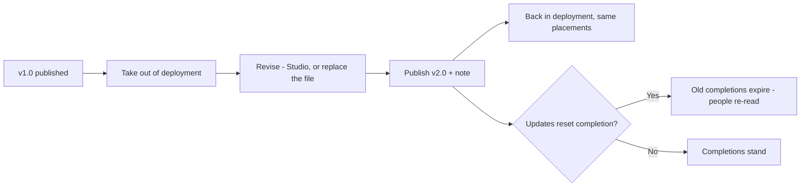

**Two documents, one subject:**

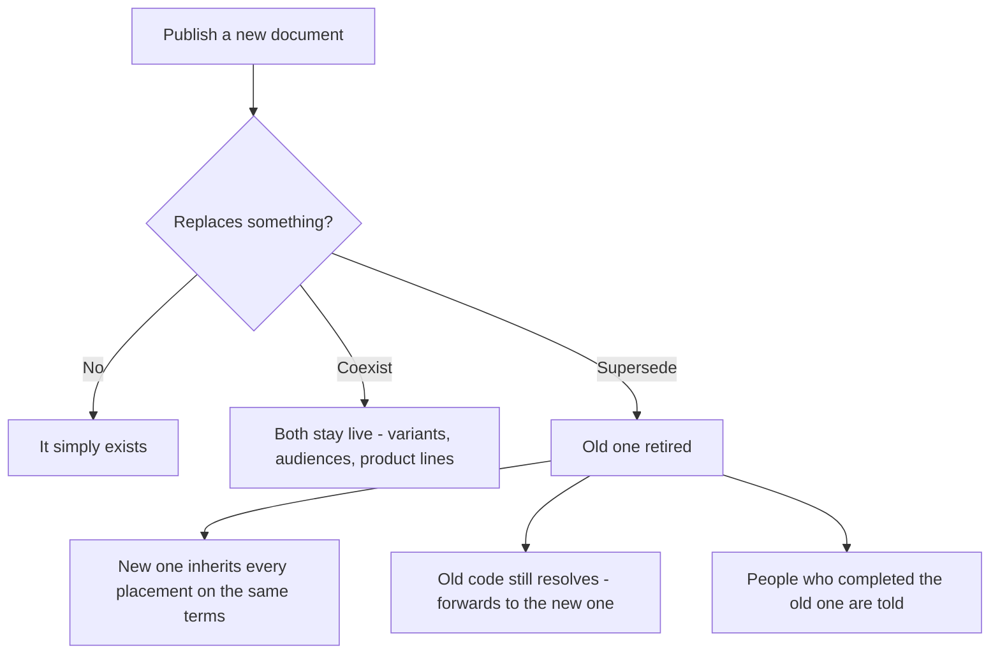

**A member's proposal:**

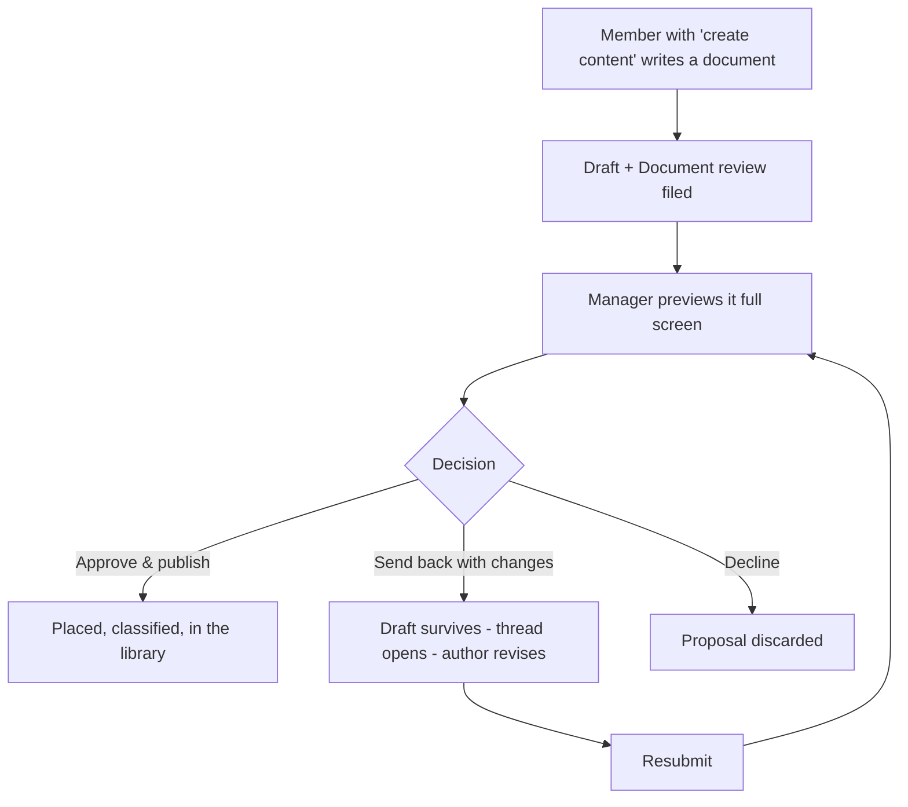

---

## Tips & pitfalls

- **Write the version note for a stranger.** "Added the 2027 lock-out sequence and removed the
  old amber rule" is a note. "Updates" is not.
- **Reset completions when the meaning changed, not when the wording did.** Asking 400 people
  to re-read a typo fix is how organizations learn to ignore mandatory training.
- **Supersede rather than delete.** A retired document still answers to its code; a deleted
  one leaves every old link and printed reference pointing at nothing.
- **Take it out of deployment first, and put it back promptly.** A course parked out of
  deployment reaches nobody — which is correct while you rewrite and wrong once you have.
- **Use "send back with changes" generously.** It is the outcome that produces good documents;
  approving a weak draft to be polite produces a library nobody trusts.
- **Metadata edits are free.** Fixing a shelf tag or a description does not bump the version
  or disturb a single reader.

---

## 🎬 Make a video of this

**Length:** ~3 minutes. **Working title:** *"Editions: how a document grows up."*

| # | Shot | Say |
|---|------|-----|
| 1 | Course list showing **v1.0** | "Everything published carries an edition number." |
| 2 | **⏸ Take out of deployment** — banner turns amber | "Readers keep what they have while you work." |
| 3 | **✎ Revise** → change a paragraph → **Publish v2.0** with a note | "Say what changed. That note is the whole point of a version number." |
| 4 | Open **⚙ Properties** → the edition log timeline | "And here it is, dated, attributed, permanent." |
| 5 | Publish a new document, choose **Supersede** | "A replacement inherits every branch the old one reached — on the same terms." |
| 6 | Cut to a member proposing a document; manager previews and sends it back with a note | "And what a member writes goes through review — with a conversation, not a verdict." |

**Script beat to close on:** *"Nothing here is overwritten. That is what makes the training
record worth having."*

**Next:** Chapter 12 — The Library →

---

# Chapter 12 — The Library

## What it is

The **Library** is your organization's whole catalogue of published knowledge in one place —
a real library, with **shelves** grouped by category. Where the constellation shows knowledge
by *who* it's assigned to, the library shows it by *subject*, so anyone can browse, search
and discover what exists.

Open it from the **Library** tab in the top navigation.


---

## Why it matters

| Parameter | What changes |
|-----------|--------------|
| **Time** | People stop asking colleagues where the procedure is. One search over titles, descriptions, shelves and codes finds it. |
| **Risk & compliance** | *Where it's published* answers "does this policy actually reach the night shift?" in one click, instead of an afternoon of cross-checking. |
| **Security & custody** | Classification filters are honest: what you can see in the library is what your position entitles you to see, and hidden branches never leak through a search box. |
| **Cost** | A shelf that suggests itself as you publish keeps the catalogue from sprawling into duplicates — the cheapest document is the one nobody wrote twice. |
| **Adoption** | Ratings and comments from colleagues do what a mandate cannot: they point people at the material that is actually good. |

---

## Browsing the shelves

Courses are grouped into **shelves** by their category tag — in the sample you can see
*Compliance*, *Engineering* and more, each with an item count. Every entry is a card showing:

- its **type** (Document, Book, Link, Audio, Video),
- its **classification** badge,
- its **rating** (or "not rated yet"),
- a short description, and
- where it lives (e.g. how many branches it's published on).

---

## Finding something specific

The toolbar across the top gives you full control:

| Control | What it does |
|---------|--------------|
| **Search** | Match a title, description, category or code |
| **Type** | Filter to Documents, Books, Links, Audio or Video |
| **Shelf** | Jump to a single category |
| **Class** | Filter by classification (Public → Secret) |
| **Rating** | Show only well-rated material |
| **Show archived** | Include courses that have been archived |
| **Sort** | Newest, and other orders |

---

## Opening an entry

Select any card to open its detail view. There you can:

- read its **full description and scope**,
- see its **ratings and member comments**,
- find **"where it's published"** — which jumps you back to the constellation with those
  branches **spotlighted** and the rest dimmed, so you can see its reach at a glance, and
- **request the course for your branch** — this files a Course request with that branch's
  handler, who configures it (mandatory, deadline, recurrence) before approving. See
  Chapter 14.


---

## Ratings & reviews

After completing a course, learners can **rate it out of five and leave a comment**. Those
reviews surface here in the library, helping everyone find the material that's genuinely
useful. (You'll rate a course from the reader — Chapter 13.)

---

## Tips & pitfalls

- **Shelves keep themselves tidy.** Because publishing suggests an existing shelf for similar
  content, your library naturally groups related material instead of sprawling.
- **Use "where it's published" to audit reach.** It's the quickest way to check that an
  important policy actually reaches every team it should.
- **Filter by classification when sharing screens.** Switch to *Public* only if you're
  demonstrating the library to an audience who shouldn't see sensitive titles.
- **The library is not the assignment list.** A course in the library that is not placed on a
  branch reaches nobody automatically — that is what *opt-in* and *request* are for.
- **Archived material is still findable.** Turn on *Show archived* before concluding that
  something was deleted.
- **A shelf per subject, not per department.** *Safety* outlives *Operations Team B*.

---

## 🎬 Make a video of this

**Length:** ~90 seconds. **Working title:** *"Everything you have published, by subject."*

| # | Shot | Say |
|---|------|-----|
| 1 | Library, shelves visible with counts | "The constellation shows knowledge by who gets it. The library shows it by what it's about." |
| 2 | Type into search, results narrow | "Titles, descriptions, shelves, codes — one box." |
| 3 | Filter **Class → Confidential** | "And you only ever see what your position entitles you to." |
| 4 | Open a card → **where it's published** | "This is the one that saves an afternoon: every branch it actually reaches, lit up on the map." |
| 5 | Show a rating and a comment | "Colleagues tell each other what's worth reading." |
| 6 | **Request this course for my branch** | "And if it isn't reaching your team yet, ask for it here." |

**Script beat to close on:** *"A library is only a library if you can find things in it."*

**Next:** Chapter 13 — My Learning & the reader →

---

# Chapter 13 — My Learning & the reader

## What it is

**My Learning** is the page every learner lives in. It gathers **every course that reaches
your position** — from any branch you're a member of — and shows what's pending, what's done,
and what's overdue. It's the answer to "what do I need to complete?"

Open it from the **My Learning** tab in the top navigation.


---

## Why it matters

| Parameter | What changes |
|-----------|--------------|
| **Time** | One list, ordered by what is actually due. No enrolment step, no course catalogue to search before you can start. |
| **Risk & compliance** | Deadlines and recurrence are printed on the row, and a lapsed annual course reappears as pending by itself — the learner never has to remember that a year has passed. |
| **Security & custody** | Documents open **inside** the app, in the frame their classification demands. A course marked non-downloadable can be read and not carried away. |
| **Cost** | The reader is the whole distribution system: no PDF emailed to 300 people, no version of it saved on 300 laptops. |
| **Adoption** | Everything a learner needs is two clicks from signing in, and the reader is comfortable enough to actually read in — zoom, full screen, and a size that stays where you put it. |

---

## Reading your dashboard

At the top, three stat cards summarise your status:

- **Pending courses** — assigned to you and not yet complete.
- **Completed** — everything you've finished.
- **Overdue** — anything past its deadline.

Below, courses are listed **pending first, completed below**. Each row shows the title, its
**code**, its **type**, the **edition** (v1.0), whether it's **mandatory** or **opt-in**, a
**status badge**, and where it came from (e.g. *via Executive Office*), plus any **deadline**
or **recurrence**.

In the sample, *Maya Torres* has two pending items — the **Robot Cell Safety — Assessment**
(mandatory, overdue, and shown with **Complete the exam** rather than *Open*) and the opt-in
**Welcome to Aurora Robotics** — and three completed, each with the date its completion stays
valid until.

> **"Valid until" is not decoration.** A course that repeats every 365 days becomes pending
> again the moment that date passes. You do not have to watch for it.

---

## Opening and completing a course

Each row has up to two actions:

- **Open** — launches the course in the reader.
- **Mark complete** — records your completion. If a course has **prerequisites** that aren't
  done yet, the button is locked until you finish them first.
- **Complete the exam** — on an exam, this replaces both. An exam is completed by passing it
  (Chapter 10).

---

## The reader

Courses **always open inside the app** — never in a distracting second browser tab. The
reader presents the document in your organization's **standard frame**:


Every document opens on its **standardized cover page**, showing:

- the **organization** name and the **classification** banner,
- the **title**,
- the **published date**, **edition**, and **author**, and
- the document's **reference code**.

The cover is **page one**, not a preamble to skip. Turn it with **Next →** (or the arrow
keys) to reach the **description & scope**, and again to reach the content — each page
arriving with the same page-turn the rest of the document uses. **↑ Cover** takes you back
to the front at any time.


From the reader you can also:

- mark the course **complete**,
- go **⛶ Full screen** for focused reading,
- give it the **whole screen** — **⤢ Own window** on a computer opens the document in a
  window of its own; on a phone, and in the Android app, the same button hands the whole
  screen to the document, and a **tab at the top takes you straight back** to My Learning
  (the mobile app has no tabs of its own, so the reader brings its own),
- see **related documents** — including anything this course requires first, and
- after completing, **★ Rate & review** it — feeding the ratings shown in the library.

---

## Reading size: zoom that behaves

Text is only useful at a size you can read. The reader has one zoom, and it works the same way
on every kind of document:

| Gesture | What it does |
|---------|--------------|
| **Ctrl / ⌘ + scroll** | Zoom in and out |
| **Two-finger pinch** | The same, on a trackpad or a touch screen |
| **Ctrl + `+` / `−` / `0`** | In, out, back to 100% |
| **The reading-size pill** | **− 152% +**, top right of the page |
| **A plain scroll** | Always scrolls. It never zooms by accident. |


Two details worth knowing, because they are what make it usable rather than merely present:

- **Studio documents scale the type, not the box.** Lines re-wrap as they grow, so a reader
  who has zoomed in never has to scroll sideways to finish a sentence. An author's explicit
  font size grows with everything else, instead of one hand-sized heading staying put while
  the text around it changes.
- **PDFs re-render at the new scale.** They are not stretched, so text stays sharp — and a
  zoom responds immediately, even on a document of a hundred-plus pages, because only the
  pages you can actually see are re-drawn.

---

## On a phone

My Learning is one column, the rows keep their badges, and the reader hands over the whole
screen with a tab of its own to get back:


---

## Flow at a glance

**Completing a course:**

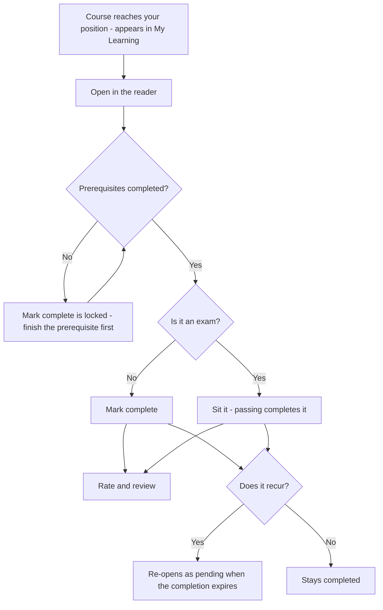

---

## Tips & pitfalls

- **Do prerequisites first.** If *Mark complete* is locked — or an exam shows *Related —
  required first* instead of a Start button — open what it names and finish that.
- **Watch the recurrence note.** "Repeats every 365 days" means the course will re-appear as
  pending when it expires — that's annual compliance working as intended.
- **Set the reading size once.** It is remembered as you move between pages, so pick a size
  you are comfortable with and forget about it.
- **Full screen on a phone is the whole point.** The reader hands the screen over completely
  and brings its own way back.
- **Rate what you complete.** Two seconds from you is what tells the next person which of the
  four safety documents is the one worth reading.

---

## 🎬 Make a video of this

**Length:** ~2 minutes. **Working title:** *"Your list, and a reader worth reading in."*

| # | Shot | Say |
|---|------|-----|
| 1 | My Learning, three stat cards, pending list | "Everything that reaches your position, pending first." |
| 2 | Point at a row's deadline and recurrence | "The deadline and the retake cycle are printed on the row." |
| 3 | **Open** → the cover page | "Every document opens on its cover: organization, classification, edition, code." |
| 4 | **Next →** twice to the content | "Cover, scope, then the document itself." |
| 5 | Ctrl+scroll to zoom; show text re-wrapping | "Zoom re-wraps the text. You never scroll sideways to finish a sentence." |
| 6 | **Mark complete**, then **★ Rate & review** | "Complete it, rate it — and that rating shows up in the library for everyone else." |

**Script beat to close on:** *"Nothing to enrol in, nothing to download, nothing to remember."*

**Next:** Chapter 14 — Requests: ask & approve →

---

# Chapter 14 — Requests: ask & approve

## What it is

**Requests** is the platform's ask-and-approve centre. Rather than letting anyone change the
structure directly, Knowledge Vault routes certain actions through a request that someone
with the right authority approves. It keeps governance clean and auditable.

Open it from the **Requests** tab. A **live badge** on the tab shows how many requests need
your attention, so you never miss one.


---

## Why it matters

| Parameter | What changes |
|-----------|--------------|
| **Time** | An ask and its answer live in one place with a live badge on the tab. No email thread, no "did you see my message?" |
| **Risk & compliance** | Structural changes that matter — joining a branch, deleting one, unhiding a chain, publishing someone else's document — are decisions with a named decider and a record, not something that quietly happened. |
| **Security & custody** | Requests are routed by authority, not by asking nicely. Only the people who could have done the thing themselves can approve someone else doing it. |
| **Cost** | Course requests arrive configured — the decider sets the deadline and recurrence for *their* branch at approval time, so nothing has to be corrected afterwards. |
| **Adoption** | Members can ask for what they need instead of waiting to be noticed, which is what turns a training platform into something people use rather than receive. |

---

## The two views

The page is split in two:

### Inbox — waiting on you
Requests **you have the authority to decide**. In the sample, *Priya Raman* — who owns *Engineering* — has three waiting: *Ravi Shah* asking
to join the *Firmware Team*, *Hana Oyelaran* asking for the cell-safety course to be placed on
it, and *Noah Kim's* document waiting for review. Each card carries the asker's own words. Each inbox
card lets you **Approve**, **Reject**, or **Delete** it.

### My requests
Everything **you've** asked for, with its live status (**pending**, **approved** or
**rejected**), so you can track your own asks.

---

## The five kinds of request

| Kind | Who raises it | What approval does |
|------|---------------|--------------------|
| **Course** | Someone who wants a library course on their branch | The decider **configures** it (mandatory, inheritance, deadline, recurrence) *before* approving |
| **Join** | Someone who wants to join a public branch | Adds them to the branch — as a member or sub-owner, whichever they asked for |
| **Deletion** | A branch's own owner who wants it removed | Lets the level above authorise the deletion |
| **Visibility** | An owner whose branch is hidden by a level above | Asks that level to unhide the chain |
| **Document review** | A member with the *create content* right who has written something | Publishes it — or sends it back with a note (Chapter 11) |

Course requests are special: because the decider configures placement at approval time, the
course arrives on the branch correctly set up, not as a raw drop-in.


**Document reviews are the other special case**, because they carry a **conversation**.


 The
reviewer opens the draft full screen, then chooses one of three outcomes — *approve and
publish*, *send back with changes* (with a compulsory reason, and the draft survives), or
*decline*. The thread stays on the request, so the whole exchange is in one place when the
document is finally decided. A review that has been sent back leaves your *waiting on you*
list but stays visible, flagged **with the author** — and it is exempt from the 7-day sweep,
because an open conversation is not a decision.

---

## How it flows

1. Someone raises a request — from the library (Course), a public star (Join), or a Group
   configuration panel (Deletion, Visibility).
2. It lands in the **inbox** of whoever has authority — the branch's handler or the level
   above.
3. That person **decides**. Approvals take effect immediately; the requester sees the status
   change live.
4. Decided requests **clean themselves up automatically after 7 days**, keeping inboxes tidy.

You can always **withdraw** a request you raised while it's still pending.

---

## Flows at a glance

**The request lifecycle (all types share this shape):**

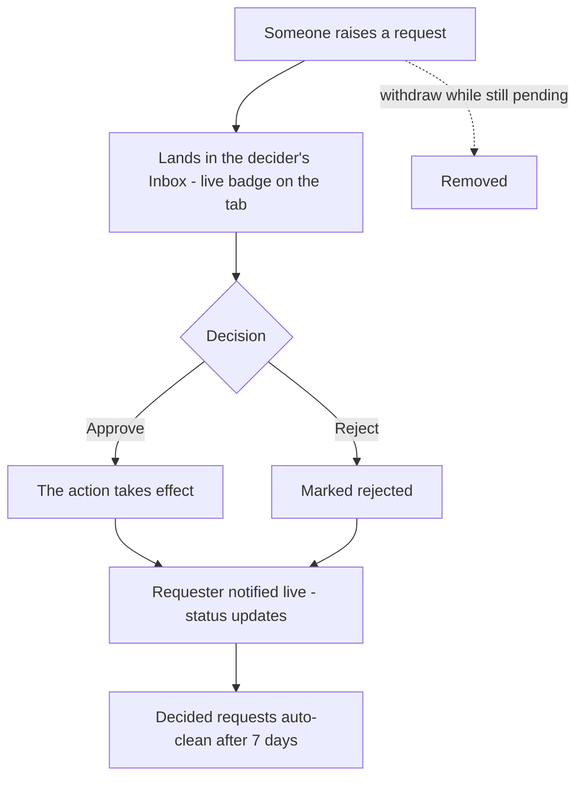

**Course request** — configured *before* approval:

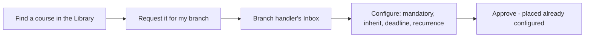

**Join request** — carries the desired position:

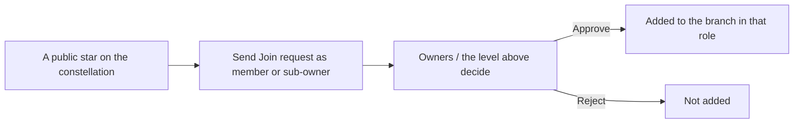

**Deletion request** — needs the level above:

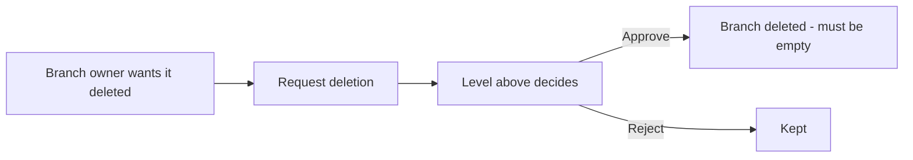

**Visibility request** — unhide a chain:

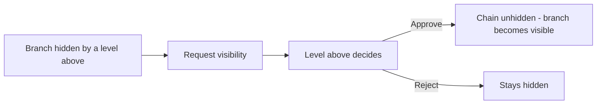

---

## Tips & pitfalls

- **Watch the badge.** The live count on the Requests tab is your cue that a colleague is
  waiting on you — decisions unblock people.
- **Configure course requests thoughtfully.** Approving one is your chance to set the right
  deadline and recurrence for *your* branch, not just accept a default.
- **Join requests carry intent.** They state whether the person wants to be a *member* or a
  *sub-owner* — check that before approving.
- **Send documents back rather than fixing them yourself.** The author learns, and the
  document stays theirs. *Send back with changes* is the outcome reviews exist for.
- **Decide, don't hoard.** Decided requests disappear after seven days; pending ones sit on
  someone's day until you act.
- **A withdrawn request is not a rejected one.** If you asked for the wrong thing, withdraw it
  and ask again — nobody has to reject you to clear it.

---

## 🎬 Make a video of this

**Length:** ~2 minutes. **Working title:** *"Asking, and answering."*

| # | Shot | Say |
|---|------|-----|
| 1 | The Requests tab with its live badge | "The number means somebody is waiting on you." |
| 2 | The inbox card: who, what, and their message | "Every ask arrives with its reason attached." |
| 3 | Approve a Join request; cut to the branch's People panel | "Approve, and they're placed — as a member or a sub-owner, whichever they asked for." |
| 4 | Open a Course request; set deadline and recurrence, then approve | "A course request is configured on the way in, for *your* branch." |
| 5 | Open a Document review; preview full screen; send it back with a note | "And a document review has three answers — including the one that makes documents better." |

**Script beat to close on:** *"Nothing structural happens here by accident, and nothing waits
in an inbox nobody can see."*

**Next:** Chapter 15 — Compliance tracking →

---

# Chapter 15 — Compliance tracking

## What it is

**Compliance** is the manager's view of "who has completed what." For any branch you govern,
it shows per-course completion across the whole subtree, says **why** each person is not
compliant in words, lets you **look one person up**, and gives you one button to **remind**
everyone who still has work to do.

The **Compliance** tab appears in the navigation only if you're an owner somewhere. Open it
to begin.


---

## Why it matters

| Parameter | What changes |
|-----------|--------------|
| **Time** | The report is computed from the courses themselves, so nobody maintains it. A branch-wide answer takes one click; a single person's answer takes two. |
| **Risk & compliance** | Every non-compliant row carries its **reason in a sentence** — not read yet, exam attempts spent, lapsed annually, joined last week. An auditor's follow-up question is already answered on the screen. |
| **Security & custody** | You only ever see branches you govern, and the person lookup is limited to the branch you selected and everything under it. A peer cannot inspect a peer. |
| **Cost** | The reminder sweep replaces the chasing spreadsheet and the "please complete your training" all-staff email nobody reads. |
| **Adoption** | Reminders are deep-linked to the exact course, so the person is one click from doing the thing instead of one click from a login page. |

---

## Choosing a branch

At the top, a **Branch** selector lets you pick any branch you govern — and because ownership
can sit on several levels at once, you may have several to choose from. Pick one, and the
dashboard reports on that branch and everything beneath it.

Three summary cards give you the headline:

- **people in this branch** — the population being measured.
- **overall compliance** — the single percentage that says how you're doing.
- **overdue items** — assignments genuinely past their deadline.

---

## Per-course breakdown

Below the summary, every course in scope gets a row showing:

- the course **title** and **code**,
- whether it's **mandatory** or **opt-in**,
- where it comes from (e.g. *via Executive Office*, *via Operations*), and
- a **progress bar** with a count like **6 / 9 compliant**, and an **overdue** flag when
  somebody in that count is late.

Select a course row to expand it and see the **list of people** — who's compliant, who isn't,
and the reason beside each one.


Three rows, three different situations, and the screenshot above has all of them:

| Person | Reason | Flagged overdue? |
|--------|--------|------------------|
| **Priya Raman** | *Completed earlier — the record has since expired and must be redone* | **Yes** — her annual completion lapsed over a month ago, so the new deadline has passed too |
| **Leo Fernandes** | *Past the deadline* | **Yes** — assigned weeks ago, never opened |
| **Ravi Shah** | *Has not opened this yet* | **No** — he joined this branch this morning; his fourteen days start today |

Below the list sits the **reminder message** box and **🔔 Send reminder**, which acts on
whoever you tick.

---

## Looking one person up

The branch report answers *"who is behind on this course?"*. The **Look up a person** box
answers the other question managers actually ask: *"where does this person stand?"*

1. Type a name or username — the field suggests people as you type.
2. Press **Check compliance**.


You get a card with their overall score and **every course that reaches their position**, each
with a status and a plain-English reason:


| What you see | What it means |
|--------------|---------------|
| **Compliant** | Completed, and the completion is still valid |
| **Has not opened this yet** | Assigned, untouched |
| **Has used every attempt the exam allows and cannot sit it again until a manager resets it** | The exam is locked — see below |
| **Expired** | A recurring completion has lapsed; the next cycle is open |
| **overdue** | Genuinely past the deadline that applies **to this person** |

Both views come from one computation, so the branch report and the per-person card can never
disagree with each other.

---

## What "overdue" actually means

A deadline is **how long someone has to finish a course after it reaches them** — the Studio's
own words for the field — and the report measures exactly that. In practice, the clock starts
at whichever of these is **latest**:

| Situation | The deadline is measured from |
|-----------|-------------------------------|
| Course placed on a branch you were already in | The day it was placed |
| You joined a branch that already had the course | **The day you joined** |
| A recurring course whose completion has lapsed | **The moment the new cycle opened** |
| A new edition published with *updates reset completion* | **The day that edition was published** |

This matters more than it sounds. Under the old arithmetic, three kinds of people were
accused of missing days they never had:

- somebody whose annual course lapsed last night — *due to do it again*, not a year late for
  it;
- somebody whose completion was expired by a republished edition — the new obligation is
  dated to the republish, not to the original placement;
- somebody placed in the branch this morning — for whom the deadline had already "passed"
  before they arrived.

Genuinely late people are still late. That is the report's whole job.

> **A lapsed completion reads EXPIRED immediately.** The views no longer wait for the nightly
> sweep to notice: the instant a completion's validity date passes, every screen says
> **expired** rather than repeating *completed* beside a red *overdue* badge.

---

## Reminding the non-compliant

This is the part that saves managers time. Once a course is expanded:

1. **Select the people** who still need to complete it (or select all non-compliant).
2. Choose to send a **reminder**.
3. Use the **default message**, or write your **own**.

Each reminder lands as a message in that person's Mailbox, deep-linked to the exact course —
so they're one click from doing it. No spreadsheets, no chasing by email.

---

## When an exam has locked someone out

An exam with an attempt allowance locks when the last attempt is spent without a pass. The
row says so in words, with the attempts used and the best score.

**To hand the allowance back:** expand the exam, tick the person, and choose
**♻ Reset attempts**. Their previous sittings stay on record, marked as no longer counting;
the person is told they can try again, and by whom.
Chapter 10 covers the whole reset.

---

## Flow at a glance

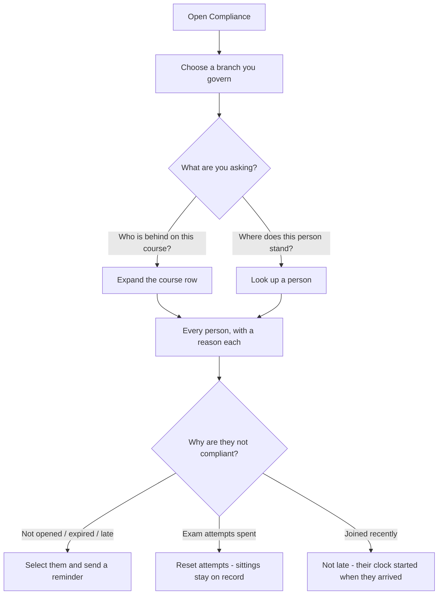

---

## Tips & pitfalls

- **Start at the top for a company-wide picture, drill down to act.** Select *Executive
  Office* to see overall compliance; switch to a team branch to chase specific people.
- **Read the reason before you chase.** "Has not opened this yet" is a nudge; "attempts spent"
  is a coaching conversation; "joined three days ago" needs nothing at all.
- **Zero overdue is the goal.** Pair deadlines (Chapter 8) with
  periodic reminder sweeps to keep that number at zero.
- **Recurring courses re-open automatically.** When an annual course expires, previously
  compliant people become pending again — the dashboard reflects it the moment it happens.
- **A late joiner is not a problem to fix.** Their deadline starts when they arrive; leaving
  them alone for their first fortnight is the system working.
- **Use the person lookup before a one-to-one.** Two clicks gives you everything that reaches
  them, in one card, in the order they should tackle it.

---

## 🎬 Make a video of this

**Length:** ~2½ minutes. **Working title:** *"Who's behind — and why."*

| # | Shot | Say |
|---|------|-----|
| 1 | Compliance, branch selector open | "Pick any branch you govern. The report covers it and everything beneath it." |
| 2 | The three summary cards | "People, percentage, overdue. The headline in three numbers." |
| 3 | Expand a course row | "Every person, and beside each one, why." |
| 4 | Point at "has used every attempt" | "Not 'not completed'. The actual reason, in a sentence." |
| 5 | **Look up a person** → type a name → **Check compliance** | "And the other question: where does *this* person stand?" |
| 6 | Show a recent joiner not marked late | "Their clock starts when they arrive. Nobody is late for a course that was placed before they existed." |
| 7 | Select non-compliant people → send a reminder | "Then one button, deep-linked to the exact course." |

**Script beat to close on:** *"A compliance report that cries wolf gets ignored. This one only
says late when someone actually is."*

**Next:** Chapter 16 — The Mailbox →

---

# Chapter 16 — The Mailbox

## What it is

Everything the platform has to tell you arrives in **one mailbox**. Not a bell with a list
under it — a proper mail client, with folders down the side, a message list in the middle, and
a reading pane. It opens from the **bell in the top-right corner of every page**, inside an
organization or nowhere near one.

It exists because the alternative is clutter. Requests, learning deadlines, publishing
decisions, plan changes and messages from the Knowledge Base team are genuinely different
kinds of news, and piling them into one grey list means the important one sits below the
routine one. Here each kind is filed, labelled and — the part most systems skip —
**expires on its own**.


---

## Why it matters

| Parameter | What changes |
|-----------|--------------|
| **Time** | Folders and labels mean you can answer "what is waiting on me?" without reading anything you don't need. Search covers subjects, bodies, labels and organization names. |
| **Risk & compliance** | Overdue deadlines and locked exams are pushed to the top with a red flag, so the things that actually matter never sit below routine noise. |
| **Security & custody** | Access codes arrive here rather than by email, which means they never leave the platform's own boundary — and they expire on their own. |
| **Cost** | Nothing accumulates. Every message carries its own expiry, so the mailbox never becomes a database nobody dares clean. |
| **Adoption** | It behaves like a mail client people already know: folders, labels, multi-select, a reading pane, and a chime you can switch off. |

---

## 1. The folder rail

Down the left-hand side:

| Folder | What lands in it |
|--------|------------------|
| **All mail** | Everything, newest first, with high-priority mail pinned above it. |
| **Unread** | Only what you haven't opened. |
| **High priority** | Anything flagged — every message from the Knowledge Base team, plus deadlines that have already passed. |
| **Knowledge Base** | Access codes, plan decisions, coin adjustments, announcements. |
| **Requests** | Everything waiting on a decision — yours or someone else's. |
| **Publishing** | Document reviews, publications, adoptions of your material. |
| **Learning** | Assignments, deadlines, expiry, exam results. |
| **Plans & Coins** | Plan changes, expiry warnings, coin movements. |
| **People** | Placements, ownership, governance changes. |
| **System** | Housekeeping notes about the mailbox itself. |

Below the categories, one entry **per organization** you belong to. That is the label half of
the design: you can read *Aurora Robotics* on its own, ignore everything else, and come back
to the rest later.

Every folder carries its own unread count, so you can see where the pressure is without
opening anything.

---

## 2. Sub-labels — telling requests apart

Inside **Requests**, a bare "you have a request" is not much use — the five request flows need
five different reactions. Each message carries its own label:

| Label | The flow it belongs to |
|-------|------------------------|
| **Document publishing** | A member's draft is waiting for your review. |
| **Course for my path** | Someone wants a library course assigned to their branch. |
| **Join a branch** | Someone wants to be placed on a public branch. |
| **Branch deletion** | A branch's own owners want it removed. |
| **Visibility** | A hidden chain above a branch is keeping it invisible. |

Knowledge Base mail is labelled the same way — **Access code**, **Decision**, **Coins**,
**Plan**, **Announcement** — so you can find the message holding your code without reading the
rest.

---

## 3. Priority: what gets pushed to the top

Two things are flagged **high priority**, shown with a red edge and pinned above everything
else:

1. **Everything from the Knowledge Base team.** Your access code, a plan decision, a coin
   adjustment, an announcement. These are the messages that unblock you, so they never sit
   below routine noise.
2. **Deadlines that have already passed** — your own overdue mandatory course, an overdue
   course belonging to someone you look after, an exam whose attempts have run out.

The bell itself turns red and pulses while any high-priority message is unread.

---

## 4. Every message expires

This is the rule that keeps the mailbox usable and the database honest: **nothing lives
forever.**

| Kind of mail | How long it lives |
|--------------|-------------------|
| Knowledge Base team (codes, decisions, coins) | **30 days** |
| Plans & coins | 30 days |
| Requests, publishing, people | 14 days |
| Learning | 10 days |
| System notes | 3 days |

Each row shows its own countdown — *"6d left"*, *"4h left"* — and the reading pane spells out
the exact date. When it gets there the message deletes itself. You never have to tidy up, and
old mail cannot quietly accumulate on your behalf.

If you are holding more than forty messages, the mailbox says so once, in a **System** note.

---

## 5. Working through it

- **Select a message** to open it in the reading pane. Opening marks it read.
- **Open ↗** takes you to the exact thing it is about — the specific request card, the course
  list, your account.
- **Tick several** to mark them read, mark them unread, or delete them in one go.
- **Mark all read** and **Clear read** act on the folder you are in, so you can empty
  *Learning* without touching *Knowledge Base*.
- **Search** matches subjects, bodies, labels and organization names.
- The **🔔 / 🔕 button** turns the arrival chime on and off. Your choice is remembered.

An access code arrives with the code in a box in the reading pane and a **Copy** button beside
it — you never need to retype it.


---

## 6. Live delivery

The mailbox holds an open connection to the platform for as long as you have a page open. A
message appears **the moment it is written** — the instant an admin adjusts your coins, the
instant a manager approves your document, the instant an exam locks — with a short chime if
you have left it on.

This works on **every page**, including pages that belong to no organization at all. That is
deliberate: a coin adjustment or an access code has nothing to do with any one organization,
and waiting for you to wander into the right page before telling you would be silly.

If your connection drops, the mailbox reconnects on its own and catches up.

---

## 7. What generates mail

Common triggers, by folder:

- **Requests** — a request you can decide; a decision on something you asked for.
- **Publishing** — your document was published, or was not; someone adopted your course.
- **Learning** — a course reached your position; a mandatory course went overdue; a
  completion expired and the course came back; a course was updated and your completion was
  reset; a manager's reminder; an exam ran out of attempts; a manager reset them.
- **Plans & Coins** — a plan is a week from expiry; a plan lapsed; coins moved.
- **Knowledge Base** — your access code; a decision on a platform request; an announcement
  from the team.

---

## Tips & pitfalls

- **Use the folders, not the search.** *Requests* answers "what is waiting on me"; *Learning*
  answers "what is waiting on my people". The two questions rarely want the same answer.
- **Trust the countdown.** Clearing routine mail by hand is wasted effort — it goes on its own.
- **Watch the red bell, ignore the rest.** A high-priority flag means someone is genuinely
  blocked, or a deadline has already gone.
- **Copy the code, don't retype it.** Access codes are eight characters and case-sensitive.
- **Turn the chime off in a shared office** — and leave it on when you are the person who
  approves things.
- **The bell follows you everywhere.** You do not need to be inside an organization to be told
  something; that is why it sits beside the palette on every page.

---

## 🎬 Make a video of this

**Length:** ~2 minutes. **Working title:** *"Everything the platform has to tell you."*

| # | Shot | Say |
|---|------|-----|
| 1 | Click the bell; the mailbox opens over the page | "Not a dropdown — a mail client." |
| 2 | Run down the folder rail, unread counts visible | "Filed by kind, and labelled by organization." |
| 3 | Open a Knowledge Base message with an access code; press **Copy** | "The messages that unblock you are pinned to the top. Copy, never retype." |
| 4 | Point at a row's countdown | "Every message expires on its own. Nobody tidies this up." |
| 5 | Tick three messages; mark read; delete | "Multi-select, like anywhere else." |
| 6 | Toggle the chime | "And the chime is yours to switch off." |

**Script beat to close on:** *"The bell is on every page because some news — your code, your
coins — belongs to you, not to one organization."*

**Next:** Chapter 17 — Plans, pricing & Knowledge Coins →

---

# Chapter 17 — Plans, pricing & Knowledge Coins

## What it is

Creating an organization is not open to everyone by default — it is gated behind a **plan**
and a one-time **access code**. Plans are bought with **Knowledge Coins**, the platform's
virtual currency (some teams call them *education coins* — same thing).

This chapter covers the whole money-and-access side of Knowledge Vault: what a coin is, how
pricing works, how many people a plan lets you have, the **Free plan** you use as a
testing environment, how to get your access code, how to read the countdown timer on your
organization, and what happens when a plan runs out.

> **Who does what:** everything in this chapter is *your* side — the Pricing page, your code,
> your organization's timer. The Knowledge Base team's side (approving requests, issuing
> codes, gifting coins, setting plans) is the **Super Admin Guide Book** (a separate book, held by the Knowledge Base team).

---

## Why it matters

| Parameter | What changes |
|-----------|--------------|
| **Time** | Requesting a plan is one click from the card that describes it, and an approved upgrade is applied by the team immediately — there is no code to redeem for an organization that already exists. |
| **Risk & compliance** | The plan chip is visible on every card, so an organization never quietly lapses and takes its restore path with it. |
| **Security & custody** | Access codes arrive in your Mailbox, are valid for 24 hours, work once, and are checked against the plan they were issued for — a KVEP code cannot create an ordinary organization, or the reverse. |
| **Cost** | Coins leave your wallet **at redemption**, not at request. A plan you asked for and never used costs nothing, and a failed storage test costs nothing either. |
| **Adoption** | The free plan is a complete product for 30 days, not a crippled demo — you rehearse the real thing before you pay for it. |

---

## 1. Knowledge Coins

A **Knowledge Coin** is the unit Knowledge Vault prices plans in. Coins are not money and
they don't expire — think of them as tokens sitting in your profile's wallet, spent when you
found or restore an organization.

| Question | Answer |
|----------|--------|
| **How many do I start with?** | **150 coins**, granted the moment you register. (The Knowledge Base team can change the starting amount for *future* sign-ups — it never touches balances that already exist.) |
| **Where do I see my balance?** | On the **Pricing** page, as the `🪙 200 coins` chip in the top bar — and on the **Buy coins** page. It's deliberately kept off every other screen. |
| **What can I spend them on?** | Plans. The **Demo** plan costs nothing; paid plans cost whatever the card says. |
| **When are they taken?** | **Only when you use your access code** — never when you send a request, and never when it's approved. If you never redeem the code, you never pay. |
| **Can I get more?** | The Knowledge Base team can gift or adjust your balance at any time; you get a message when they do. **Buying coins with real money is coming soon.** |
| **Is there a record?** | Yes — every grant, gift, adjustment and spend is written to a ledger with the resulting balance. |


Your balance also sits on your **Account** page, beside the history of how it got there:


### Buying coins (coming soon)

The **Buy coins** button next to your balance opens the top-up page. The payment gateway
isn't live yet, so today the page explains that coins are granted by the Knowledge Base team
— ask them if you need more.


---

## 2. How pricing works

Open **Pricing** from the site footer, the home page, or the 🪙 item in the app's navigation.
Plans are shown as cards, grouped into **tabs**, and are managed centrally by the Knowledge
Base team — so the page always reflects what's actually on offer, including limited-time
offers that appear and disappear on their own dates.

Each card tells you what it costs, how long it runs, and — in a small facts table — exactly
how much of everything it includes: **people**, **custom documents**, **uploaded documents**,
**storage** and whether **server-side drafts** are part of it.

### The plan ladder

| Plan | Price | Runs for | People | Custom documents | Uploads | Storage |
|------|-------|----------|--------|------------------|---------|---------|
| **Free** | 50 coins | **30 days** | up to 10 | **30** | **30** | **150 GB** |
| **Bi-monthly** | 100 coins | **2 months** (60 days) | Unlimited | Unlimited | Unlimited | Unlimited |
| **Quarterly** | 150 coins | **4 months + 10 days** (130 days) | Unlimited | Unlimited | Unlimited | Unlimited |
| **Yearly** | 500 coins | **365 days + 2 months** (425 days) | Unlimited | Unlimited | Unlimited | Unlimited |
| **Custom / Organizational** | By agreement | You state the days | You state the number | You state the number | You state the number | By agreement |

**Only the Free plan is metered.** It stops at 30 custom documents, 30 uploads, or 150 GB of
storage — *whichever ceiling arrives first*. Every paid plan carries unlimited documents and
uploads for as many people as you need.

> **The page wins over this table.** Prices, durations and limits are edited centrally and can
> change; whatever the Pricing page shows is what you'll be charged. The Knowledge Base team
> can also pin a *per-organization* ceiling by hand, which overrides whatever the plan says.

There are two buttons on a card:

- **Request this plan** — for a fixed plan. One click sends the request; the terms are the
  ones printed on the card, and nobody has to re-type them.
- **Request a custom plan** — opens a short form asking for the **days**, the **number of
  people**, the **custom-document count**, the **upload count**, and the **coins you offer**.
  Those are the numbers the team approves, so a custom plan is agreed once rather than
  negotiated twice.

---

## 2b. Upgrading an organization you already have

If you are signed in and own an organization, the Pricing page opens with an **upgrade panel**
above the cards — pictured below: your current plan on the left, the plans above it on the right, compared row
by row — duration, people, documents, uploads, storage, drafts, price — with the improvements
ticked.


Pick the plan you want and select **Upgrade**. The request goes to the Knowledge Base team,
who **apply it directly**: an organization that already exists needs no access code, so the
new plan simply appears, and you get a message in your mailbox confirming the terms and the
new expiry date.

Only an **owner** of the organization can ask for an upgrade — a member sees the comparison
but not the button.

---

## 3. How many people can I have? (member limits)

Every plan carries a **member limit** — the maximum number of *people* in one organization.

- The limit counts **people, not positions**. Someone who already belongs to the
  organization can be placed on as many roles as you like without using another seat.
- The Knowledge Base team can set a **per-organization limit** that overrides the plan's
  (for example, 250 seats on an annual agreement). A blank override means "use the plan's
  number"; some plans are unlimited.
- The limit is enforced the moment a **new** person would join — when an owner adds someone
  to a role, and when a **Join request** is approved. If the organization is full you'll see:

  > *This organization's plan allows up to 250 members. Upgrade the plan to add more.*

- Nothing is deleted when you hit the ceiling — existing people keep working normally. You
  either remove someone or move to a bigger plan.

If you're planning a rollout, count **every person who will need a login inside that one
organization**, and pick the plan from that number. Separate organizations have separate
limits — a person in two organizations occupies a seat in each.

---

## 4. The free plan — your starting point

The **Free** plan is where most organizations begin. It is:

- **50 coins for 30 days** — affordable out of the coins your profile starts with;
- **Full-featured** — the constellation, courses, Studio, exams, library, requests,
  compliance, backups and `.main` custody all behave exactly as they do on a paid plan;
- **Metered** — 10 people, 30 custom documents, 30 uploads, 150 GB of storage. Whichever of
  those you reach first is the one that stops you.
- **Without server-side drafts** — your Studio work is still saved in your browser as you
  write, but parking a draft on the server to resume on another device is a paid capability.
- **One per profile.**

Two things to plan for before you start:

1. **It ends.** At 30 days the organization's timer lapses and the card turns red.
2. **A lapsed free organization cannot be restored for free.** If you delete it (or lose it)
   after expiry, bringing it back needs a plan and a restore code — §7. If the content
   matters, upgrade *before* the 30 days are up; the upgrade panel makes that one click.

> **What happens when I hit a ceiling?** Nothing is deleted. The next upload or new document
> is refused with a message naming the limit, and everything already there keeps working.
> Free up space, or upgrade.

## 5. Getting an access code

Because organization creation is controlled, you **request** a plan and the Knowledge Base
team sends you a one-time code.

```
You choose a plan  →  the team approves (with final terms)  →  you get an 8-character code
      │                                                                      │
      └──── Pricing page ────────────────────────────────────────────────────┘
                                                              valid 24 hours · single use
```

1. On **Pricing**, choose a plan and select **Request this plan** — or **Propose terms** for
   a custom plan, entering the days you want and the coins you offer.
2. Your request lands with the Knowledge Base team.
3. They **approve** it (setting the final duration, price and a message) or **decline** it
   (with a reason).
4. On approval you receive an **8-character access code** as a message **from the Super
   Admin**, valid for **24 hours** and usable **once**.

### Tracking your requests

The Pricing page lists **Your requests** underneath the cards, with their live status —
*pending*, *approved*, *denied* or *used* — plus any reply from the team. While a request is
still pending you can **Withdraw** it.


### Your code lives on your Account page

The code arrives in your **Mailbox** **and** in a dedicated **"Messages from the Knowledge Base
Admin"** panel on your **Account** page — so you can read it any time, even before you belong
to any organization. These messages stay for **30 days**.


In the Mailbox itself it arrives as a high-priority message with the code in a box and a
**Copy** button, so you never retype eight case-sensitive characters:


---

## 6. Creating the organization with your code

Go to **Create organization**. The page has two halves:

- **Left — the founding form:** your access code, the organization name, the first role name,
  and the Supreme password (with its unrecoverable-password acknowledgement — see
  Chapter 3).
- **Right — the plan chooser:** your coin balance and every plan, so you can request one
  without leaving the page. Each plan shows its status once you've asked: *requested —
  awaiting approval*, then *approved — code in your 🔔*.


On submit the platform verifies the code, deducts the plan's coins, stamps the organization
with the plan and its expiry date, and marks the code **used**. If your balance is short,
nothing is created and you're told exactly how many coins the plan costs and how many you
have.

---

## 7. The countdown timer, expiry and restoring

### The timer

Every organization card carries a **plan chip** under its name, showing the plan by name and
the largest unit of time that still means something:

| Chip | Meaning |
|------|---------|
| `● Yearly · 14 months left` | Comfortably in date — the dot is green |
| `● Quarterly · 4 months left` | The same, further down the ladder |
| `● Free · 30 days left` | Weeks remaining — the dot turns amber as it shortens |
| `● Bimonthly · 20h left` | Hours remaining — red, and **pulsing only inside the last three days** |
| `● expired — upgrade to keep it` | The plan has lapsed |
| `● no expiry` | An open-ended plan |

Hover the chip for the **exact date**. The chip counts in months and years rather than
thousands of days on purpose: *9.9 years left* is a fact somebody can act on, and
*3,643d 14h left* is a number nobody reads twice.


### When a plan expires

The organization and its data stay where they are — expiry does not delete anything. What
changes is your ability to bring the organization **back** once it's gone:

- Deleted organizations sit in a **30-day retention** list and can be restored with the
  Supreme password.
- If the plan has **expired** (or it was a **Demo**), restoring is blocked with a clear
  message that sends you to the **Pricing page**.
- Choose a plan there and the team issues a **restore code**. Enter it when you restore —
  you may need to upload the `.main` file again — and the organization comes back on the new
  plan, with the coins deducted then.

### Why the plan travels inside your `.main` file

Your `.main` file (Chapter 18) carries an encrypted, **server-signed** snapshot of the plan.
On revival the platform checks that signature:

- **Active and unexpired** → the organization revives directly.
- **Demo, expired, or a file made before plans existed** → you're told plainly that the plan
  has lapsed and pointed at Pricing for a restore code.

The signature is what stops an expired file being edited into a "paid forever" one — custody
of your organization and the truth about its plan stay together in the same file.

---

## 8. Tips

- **Request early.** Codes expire in 24 hours, so ask for your plan shortly before you intend
  to create the organization — not days ahead.
- **Your code is always in your mailbox** for 30 days, under *Knowledge Base*, with a Copy
  button — and mirrored on your Account page.
- **Coins leave your wallet only at redemption.** Requesting and being approved cost nothing.
- **Size the plan by people, not roles.** Roles are free; people occupy seats.
- **Watch the chip.** Inside the last three days it turns red — upgrade before it lapses and
  you'll never need the restore path at all.
- **Upgrade from inside the product.** The Pricing page's upgrade panel compares your current
  plan with the ones above it and files the request in one click — no code to redeem.
- **Use the Free plan as a rehearsal, not as the real thing.** It's complete, but it ends
  after 30 days and can't be restored for free once it does.

---

## 🎬 Make a video of this

**Length:** ~2½ minutes. **Working title:** *"Coins, plans, and the eight characters that
start an organization."*

| # | Shot | Say |
|---|------|-----|
| 1 | Pricing page, coin balance visible | "Every profile starts with 150 Knowledge Coins." |
| 2 | Scroll the plan ladder | "Free for thirty days, then four rungs — and a custom plan where you state the terms." |
| 3 | **Request this plan** | "One click. The terms are the ones printed on the card." |
| 4 | Cut to the Mailbox: the code arrives, press **Copy** | "The code lands in your mailbox. Valid twenty-four hours, works once." |
| 5 | Creation form: paste the code | "Coins leave your wallet here, at redemption — not when you asked." |
| 6 | Signed-in Pricing page: the upgrade comparison | "And later, your plan against the ones above it, upgraded without a code at all." |

**Script beat to close on:** *"Ask, get approved, redeem. Nothing is charged until the
organization actually exists."*

**Next:** Chapter 18 — The Supreme zone: custody & recovery →

---

# Chapter 18 — The Supreme zone: custody & recovery

## Why it matters

| Parameter | What changes |
|-----------|--------------|
| **Time** | A deleted organization comes back in one click for thirty days. A purged one comes back from a file you already have — no support ticket, no waiting on anybody. |
| **Risk & compliance** | Owner-level changes at the top of the structure are gated behind a password only your organization holds, and every use of it is recorded in the Supreme audit. |
| **Security & custody** | The platform stores **no copy** of the Supreme password. It cannot revive your organization for you — and it cannot hand it to anyone else either. That is the whole trade. |
| **Cost** | `.main` and `.bkp` exports cost nothing and need no storage from us. Your insurance policy is a file on your own disk. |
| **Adoption** | The recovery routes are in the corner of the page where you noticed the organization was missing — not buried in a settings tree you would have to search under stress. |

---

## What it is

The **Supreme zone** is the most powerful — and most protected — area in Knowledge Vault. It
lives on the **root role** of your organization and is the practical expression of the
**custody** promise from Chapter 2: your organization's existence, ownership and revival are
all in *your* hands, guarded by the **Supreme password** that only you know.

You reach it by clicking the **root star**, choosing **Group configuration**, and scrolling
to the **Supreme zone** (visible only to the organization's top-level owners).


Because these actions are so consequential, they require you to enter the **Supreme
password**, which unlocks a 10-minute window of Supreme access.

---

## What lives in the Supreme zone

### Top-level owners
The Supreme zone lists the owners of the root role — the people who hold ultimate authority.
In the sample, that's *Avery Stone* and *Priya Raman*. From here you can:

- **Add a supreme co-owner** by username, and
- **Remove** an owner (you can't remove the last one).

Adding or removing a top-level owner is exactly the kind of change the Supreme password
protects.

### The `.main` existence backup
Your organization's `.main` file is its **existence backup** — a single encrypted file, keyed
to your Supreme password, that can **revive the entire organization** even after it's been
deleted and the 30-day retention period in the Recovery has passed.

Select **⬇ Download** to export it. **Keep it somewhere safe and offline.**

### Deleting the organization
The **Delete organization** action begins a **30-day retention** period, after which the org
is purged and **only the `.main` file can bring it back**. The platform insists you download
the `.main` file *first* and confirms before proceeding.

---

## The other backup: per-branch `.bkp` files

Separate from the org-wide `.main`, every branch can be backed up on its own from the
**Backup** section of its action panel. A **`.bkp`** file is an **encrypted snapshot of that
branch** — its roles, people and course placements — that you can restore later.

To create one:

1. Click a branch you govern → **Backup**.
2. Choose **⬇ Download .bkp of this branch** and set a backup password (you'll need it to
   restore).


To restore, upload a `.bkp` into a node and enter its password; the platform shows a report
of what was **applied** and what was **skipped**.

---

## Recovery — both ways back

Deleting an organization does not destroy it, and there are two routes back. Both live behind
one button: **Recovery**, in the **bottom-left corner of your Organizations page**. It sits out
of the way until you need it, and carries a count when something is waiting.


### 1. Deleted — waiting out the 30 days

For **30 days** after you delete it, an organization sits in Recovery's **Deleted** tab, fully
intact, showing exactly how many days it has left before it is purged. Restoring is one button
— **↩ Restore** — plus the Supreme password. There is no file to find and nothing to upload.

Two things to know:

- **The countdown is real.** After 30 days the organization is purged from the platform, and
  the only way back is the `.main` file.
- **A lapsed plan still blocks a restore.** If the plan expired while the organization sat
  there, the restore asks for a **restore code** from the Knowledge Base team.

### 2. From a `.main` file — after the purge

Recovery's second tab takes the encrypted `.main` file and the Supreme password, and rebuilds
the organization from scratch. This is the path for anything already purged, or for an
organization being moved to a different deployment. It is covered in full below.

> **Why "Recovery" and not a wastebasket?** A deleted organization here is not refuse waiting
> to be emptied — it is whole, and one password away from coming back. And the `.main` route
> recovers things a bin never held. The button is a recovery arrow because that is what it
> does.

---

## Reviving a purged organization

If an organization has been purged, its founder can bring it back from the **Organizations**
page:

1. Open **Recovery**, bottom-left, and choose the **`.main` file** tab.
2. Upload the `.main` file and enter the **Supreme password** that encrypted it.

Without both the file and the password, revival is impossible — which is precisely what keeps
your organization in your custody and no one else's.

---

## Flows at a glance

**Supreme-protected actions (on the root):**

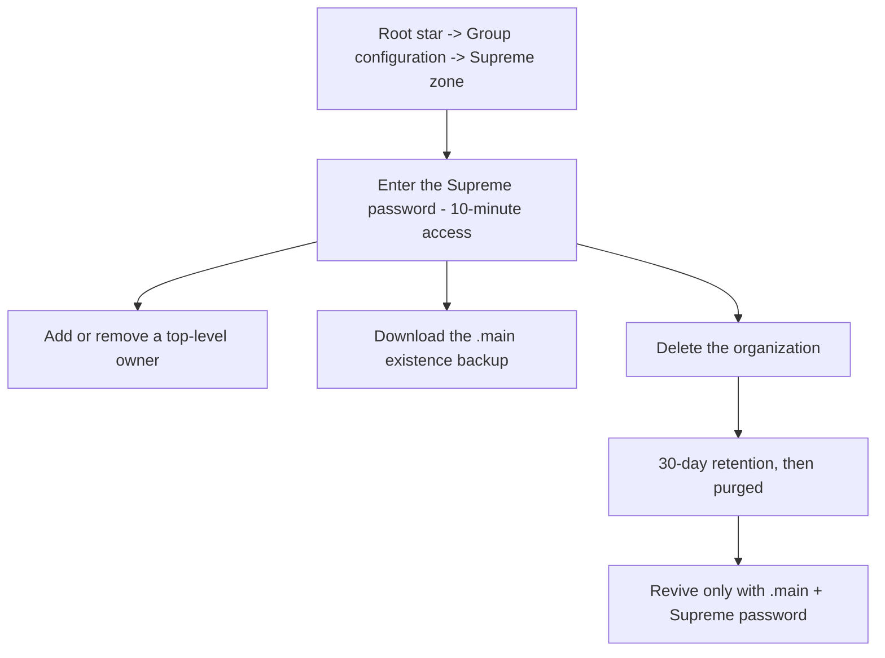

**Branch backup and restore (`.bkp`):**

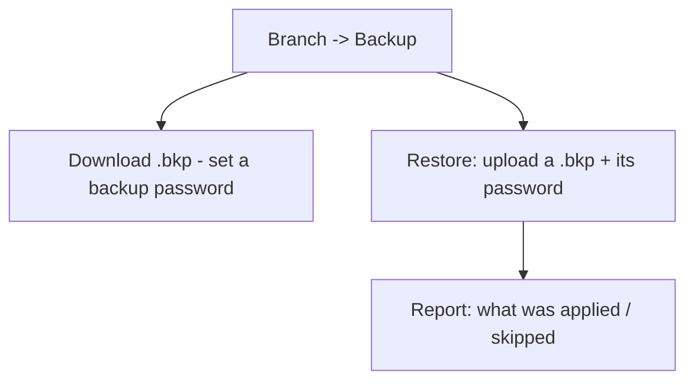

**Reviving a deleted organization:**

```mermaid
flowchart LR
    A["Organizations page"] --> B["Revive from a .main file"]
    B --> C["Upload .main + enter the Supreme password"]
    C -->|Both correct| D["Organization restored"]
    C -->|Missing either| E["Revival impossible"]
```

---

## Tips

- **Back up the `.main` the day you found the org, and after big structural changes.** It is
  your ultimate insurance policy.
- **Never store the Supreme password with the `.main` file.** Together they're the keys to
  the kingdom; keep them separately.
- **Use `.bkp` before risky edits.** About to restructure a division? Export its `.bkp` first
  so you can roll back cleanly.
- **Re-export `.main` after big changes.** The file carries the structure as it was when you
  exported it; a year-old file revives a year-old organization.
- **Two people should know the Supreme password**, held separately. One person with the only
  copy is not custody, it is a hostage situation with extra steps.
- **Test a `.bkp` restore once**, on a branch that does not matter, before you need one on a
  branch that does.

---

## 🎬 Make a video of this

**Length:** ~2½ minutes. **Working title:** *"Your organization, in your custody."*

| # | Shot | Say |
|---|------|-----|
| 1 | Root branch → **Group configuration** → the Supreme zone | "The top of the structure sits behind one password — and we don't have a copy." |
| 2 | Export the `.main` file; show it landing in Downloads | "This file is your organization's existence. Keep it somewhere durable." |
| 3 | A branch → **Backup** → export a `.bkp` | "And every branch can be exported on its own, encrypted." |
| 4 | Delete a test organization; open **Recovery** | "Deleting doesn't destroy. Thirty days, in this corner." |
| 5 | **↩ Restore** with the Supreme password | "One button and the password. Nothing to upload." |
| 6 | The `.main` tab, uploading a file | "And after the thirty days? The file you exported in shot two." |

**Script beat to close on:** *"Everything here is designed so that losing us doesn't mean
losing your organization."*

**Next:** Chapter 19 — Staying signed in: sessions & security →

---

# Chapter 19 — Staying signed in: sessions & security

> **In one line:** a session ends after **one hour away from the keyboard**, you are warned in
> the last minute, and the next visit is told *why* it is asking for a password.

## What it is

A **session** is one signed-in browser on one device. Knowledge Vault ends a session after an
hour in which the person did nothing — and the important word is **person**. The app itself is
busy all the time: the Mailbox checks for post every two minutes, the request badge counts
every minute, the access token renews itself on a timer. **None of that counts as you being
there.**

Activity means, and only means:

- a **click**, a **key**, a **scroll**, a **touch**, or the **pointer moved** across the page;
- a **page opened**.

---

## Why it matters

| Parameter | What changes |
|-----------|--------------|
| **Time** | An hour is long enough that nobody is signed out mid-task, and the warning card means you never lose a form you were filling in. |
| **Risk & compliance** | A browser left open on a shared desk used to stay signed in for a **month**. On a platform holding an organization's Confidential and Secret documents, that was the wrong default — and the wrong thing to have to explain to an auditor. |
| **Security & custody** | Ending a session revokes **every token in its chain**, not just the one in the tab. Signing out, a ban, or a reused old token closes the whole thing. Live streams check the session on every heartbeat and hang up on one that has ended. |
| **Cost** | Nothing. It is a setting: `SESSION_IDLE_MINUTES` on the server, default 60, and every client is told the number so nothing hard-codes an hour of its own. |
| **Adoption** | The session ends *with an explanation*. "You were signed out after an hour of inactivity" is a sentence people accept; a password box that appears for no reason is a support ticket. |

---

## What you actually see

### 1. A warning in the last minute


A small card appears in the corner and counts down:

> **Still there?** You'll be signed out in **37 seconds** because of inactivity.
> **[Stay signed in] [Sign out]**

It is deliberately **not** a modal. A dialog that blocks the page would block the very
interaction that would keep the session alive — moving the mouse over the page is enough.


### 2. A sign-in page that explains itself


> *You were signed out after an hour of inactivity. Sign in to carry on.*

The reason travels with the sign-out, so the next visit is never a mystery.

### 3. Every tab agrees

The clock, and the reason a session ended, are shared between the windows you have open. One
window timing out signs the rest out with the same explanation, rather than leaving three
tabs each with their own idea of whether you are signed in.

### 4. Closing the laptop counts as being away

The deadline is re-read whenever the tab is looked at again. A session that expired while the
machine was asleep ends **on your return**, not on your next click — so you are never briefly
"signed in" to a session the server has already closed.

---

## The rules, in full

| Rule | Detail |
|------|--------|
| **The window** | One hour of inactivity, by default. The server decides and tells every client, so the browser and the API never disagree. |
| **Where it is enforced** | In the API, on **every** authenticated request. The browser's job is only to notice the hour passing while nothing is being asked, and to say so. |
| **The absolute cap** | 30 days, unchanged. An idle session dies long before it. |
| **Signing out** | Ends the **session**, not just the token in this tab. |
| **A revoked token** | Reusing a long-revoked token closes the whole chain — the classic sign of a stolen token. |
| **Live updates** | The streams that push new mail and structure changes check the session when they open and on every 25-second heartbeat. |
| **Housekeeping** | A nightly job closes sessions nobody came back to, and deletes ended ones after 15 days, so "who is signed in" stays an honest answer. |

> **Not built, deliberately:** a "sign out everywhere" screen listing your devices. The
> groundwork exists; it is on the roadmap rather than pretended at.

---

## What this means for you, by role

**If you are a learner.** Nothing, most days. If you leave a document open over lunch, you
will be asked for your password when you come back. Nothing you had completed is lost —
completions are recorded the moment you mark them.

**If you are an owner or manager.** Two habits are worth forming:

1. **Publish before you walk away.** A Studio document parked in the browser survives — that
   copy is kept on your device as you type — but a form you were half-way through is a form.
2. **Sign out on shared machines**, rather than relying on the hour. The hour is a backstop,
   not a policy.

**If you are responsible for security.** The window is a server setting, clamped between five
minutes and seven days. Shorten it for a high-security deployment and every client picks the
new number up automatically — including the staff console, which follows the same rule on top
of its own 8-hour cap.

---

## Flow at a glance

```mermaid
flowchart TD
    A["You sign in - a session begins"] --> B["You click, type, scroll or open a page"]
    B --> C["The browser reports activity - at most once every 30 seconds"]
    C --> D["The deadline moves an hour into the future"]
    D --> E{"An hour with nothing from you?"}
    E -->|No| B
    E -->|"Last minute"| F["Still there? card counts down"]
    F -->|"Stay signed in"| B
    F -->|"Nothing"| G["Session ends - every token in its chain revoked"]
    G --> H["Every tab signs out with the same reason"]
    H --> I["Sign-in page explains: signed out after an hour of inactivity"]
```

---

## Tips & pitfalls

- **Background noise is not presence.** Leaving the Mailbox open does not keep you signed in;
  it was never meant to.
- **The warning is your cue to save, not to panic.** A single mouse movement over the page
  cancels the countdown.
- **If you are signed out repeatedly**, check that you are not running the app in a tab your
  browser is suspending — a discarded tab reports no activity, because there is none.
- **Do not share a profile.** Two people on one username makes the session record — and the
  audit trail — a fiction.

---

## 🎬 Make a video of this

**Length:** ~90 seconds. **Working title:** *"An hour away, and the door locks."*

| # | Shot | Say |
|---|------|-----|
| 1 | A signed-in page, mouse still | "A session lasts as long as you are actually using it." |
| 2 | Time-lapse or cut to the warning card | "In the last minute, this appears — and counts." |
| 3 | Click **Stay signed in**; card disappears | "One click, or one movement over the page, and the hour starts again." |
| 4 | Let it run out; the sign-in page | "Let it go, and you are signed out — with the reason on the screen." |
| 5 | Show a second tab already signed out | "Every window agrees. One timeout, one explanation, everywhere." |

**Script beat to close on:** *"A browser left open on a shared desk used to stay signed in for
a month. Now it lasts an hour."*

**Next:** Chapter 20 — Appearance & navigation →

---

# Chapter 20 — Appearance & navigation

## What it is

Four small things you meet on every single screen: **how the platform looks**, **how you move
around it**, **the pointer you move with**, and **the hints that explain things under it**. All
of them are deliberately quiet — and the ones that are yours to set remember what you chose.

---

## Why it matters

| Parameter | What changes |
|-----------|--------------|
| **Time** | An icon-first bar keeps every destination one click away without a menu; hints answer "what does this do?" without leaving the page. |
| **Risk & compliance** | The hint on a compulsory field explains *why* it is compulsory, which is what stops people typing anything to get past it. |
| **Security & custody** | Nothing here leaves your device: the theme is a cookie on the machine you are sitting at, not a setting on your account. |
| **Cost** | Zero. But a product people find comfortable is one they open — and unused training software is the most expensive kind. |
| **Adoption** | Reduced motion, readable menus, and labels that are real text (found by *find on page*, read by screen readers) are the difference between "usable by most people" and "usable". |

---

## 1. The navigation bar

The bar across the top of every page is **icons at rest and words on contact**.

At rest each destination is a single icon, so the bar stays short even when an organization
has a dozen places to be. Hover it — or reach it with the keyboard — and the icon **widens
out into its full label**: *Constellation*, *My Learning*, *Library*, *Requests*,
*Compliance*, *Studio*.

Three things worth knowing:

- **The label is real text.** It is part of the link, not a tooltip the browser draws on its
  own schedule and not a placeholder. Screen readers read it, and your browser's *find on
  page* finds it, whether or not it is currently visible.
- **The page you are on keeps its label open.** You can always see where you are without
  touching anything.
- **Counts ride along.** A branch with requests waiting shows the number on its icon, expanded
  or not.

**Under the bar sit breadcrumbs** — *Home › Aurora Robotics › Compliance* — so you always know
which organization you are in and how you got to this page:


### The bar is deliberately unhurried

Widening a label makes the bar wider, which moves every link after it. If that happened at the
speed of an ordinary hover effect, the link you were aiming at would slide out from under your
pointer and you would click the wrong one — which is exactly what used to happen.

So the navigation bar moves on its own, slower timing:

- **It waits before it opens.** Sweeping past a link on your way somewhere else does not
  disturb the bar at all.
- **It opens gently, and does not overshoot.** No bounce, nothing that springs past its resting
  place and comes back.
- **It waits before it closes.** Slipping off the pill for an instant does not snap it shut
  under your finger.

Colour still answers instantly — you always know the moment you have reached a link. Only the
*shape* takes its time. If you have asked your device to reduce motion, none of this animates
at all.

### On a phone or a tablet


There is no hovering on a touch screen, so the bar behaves differently and honestly: the
**menu button** opens the destinations as a vertical sheet with **every label already showing**.
Nothing is hidden behind a gesture you cannot perform. The sheet is solid rather than
see-through, so the page underneath never competes with the links, and it scrolls on its own if
there are more destinations than fit.

The same menu button now serves the public pages — Home, Features, Storage, Pricing and Help —
which previously had no way to reach their navigation on a narrow screen at all.

---

## 2. Themes

The **palette button** sits beside the bell on every page.

### Day and night

The default is the warm **peach-white day theme** — the look the platform ships with, chosen
because most people read documents in daylight and a bright, low-contrast page is easier on
the eyes for long stretches. The switch flips to a full **night theme** for dark rooms and
late shifts.


### Accents

Five accent palettes change the colour of buttons, highlights and the constellation's glow:

| Accent | Feel |
|--------|------|
| **Peach** | The default — warm, low-glare. |
| **Aurora** | Violet and indigo. |
| **Ocean** | Blue and cyan. |
| **Sunset** | Orange and pink. |
| **Forest** | Green and lime. |

Day/night and accent are independent — a night theme with a Forest accent is a perfectly
ordinary choice.

### It remembers

Your choice is stored **on your device, in a cookie**, and applied *before the first frame is
painted* — so there is no flash of the wrong theme while a page loads. Sign out, close the
browser, come back next week: you get exactly the look you left.

> **Why a cookie rather than an account setting?** Because appearance is about the screen you
> are sitting at, not about you. The same person may want night mode on the laptop in the
> workshop and the day theme on the office monitor, and the platform should not argue.

### Motion

The palette menu's third section is **Motion**, with a single **Animation** switch. Turn it
off and the ambient movement stops — the drifting star field behind the page, the float on the
constellation's stars. It starts **off** and stays wherever you last set it, per device.

If your operating system is set to reduce motion, the platform obeys that too, without being
asked: the navigation rail stops sliding, transitions shorten, and the background animation
settles.

---

---

## 3. The pointer, and the hints it carries

On a device with a real pointer, Knowledge Vault draws **its own**. It is not decoration —
it is doing a job:

| Where it is | What it becomes |
|-------------|-----------------|
| Over the page | An ink dot at rest, with a softer ring trailing it |
| Over anything clickable | An arrow with a **star** at its tip |
| While the app is fetching | An **open book turning its pages** |
| Over anything typeable | A nib |
| Over a drag handle | A hand |
| Over a disabled control | A struck ring |

It is switched off on touch devices, drops its motion if you have asked for reduced motion,
and — importantly — hides the system arrow **only while it is actually painted**. If anything
ever prevents it from drawing, the ordinary arrow comes back rather than leaving you with
neither. That includes full screen: a document or an exam given the whole screen carries the
pointer in with it.

**Hints replace the browser's tooltip.** A glass card opens beside the pointer and travels
with it: a short delay to open, instant when you move from one hint to the next, and it flips
to the other side near the edge of the screen. Keyboard focus opens it too. You can see one in
the Studio screenshot in Chapter 11, explaining what a
new edition does.

Hints are how the product answers "why is this compulsory?" wherever the question comes up —
on a classification field, on a publish button, on a storage setting.

---

## 4. The mailbox bell

Beside the palette sits the **bell** — the mailbox, covered in full in
Chapter 16. It is on every page for a reason: some of what the
platform has to tell you (an access code, a coin adjustment) has nothing to do with any one
organization, so it cannot live inside one.

---

## Tips & pitfalls

- **Learn two icons and you know the bar.** The branching mark is your constellation; the book
  is your learning. Everything else you can hover.
- **Set the theme once, on each device you use.** It is a per-device choice by design.
- **If the bar looks cramped, it isn't broken** — that is the collapsed state. Hover or tap.
- **Hover before you ask.** Most "what does this field mean?" questions are answered by
  resting the pointer on it for half a second.
- **On a projector, use the day theme.** The night theme's contrast is tuned for a screen a
  foot away, not a wall ten feet away.
- **Reduced motion is respected everywhere** — if animation makes you uncomfortable, set it
  once in your operating system and the whole product settles down.

---

## 🎬 Make a video of this

**Length:** ~90 seconds. **Working title:** *"Small things you'll touch a thousand times."*

| # | Shot | Say |
|---|------|-----|
| 1 | Slow hover along the nav bar, labels opening | "Icons at rest, words on contact — and the page you're on always shows its name." |
| 2 | Open the palette; switch to night; switch accent | "Day or night, five accents, and it's remembered on this device." |
| 3 | Reload the page — no flash of the wrong theme | "Applied before the first frame is painted." |
| 4 | Hover a compulsory field; the hint card opens | "Hints replace the browser's tooltip — and say *why*, not just *what*." |
| 5 | Phone frame: tap the menu button, the sheet slides up | "On a phone, every label shows. Nothing hides behind a gesture." |

**Script beat to close on:** *"None of this is decoration. It's the difference between a tool
people use and one they endure."*

**Next:** Chapter 21 — Flow diagrams →

---

# Chapter 21 — Flow diagrams: every setting at a glance

This chapter is the **visual reference** for the whole platform. It pairs a **flow diagram**
with a **screenshot** for each setting, grouped into five topics:

- **A.** [What an **owner** can do](#a--owner-settings--actions) — every management setting.
- **B.** [What a **member** can have / do](#b--what-a-member-can-have--do) — the learner side.
- **C.** [**Request ↔ response** flows](#c--request--response-flows) — ask-and-approve.
- **D.** [**Plans, coins & access codes**](#d--plans-knowledge-coins--access-codes) — how an
  organization is paid for, sized and renewed.
- **E.** [**Editions, review, compliance & the session clock**](#e--editions-review-compliance--the-session-clock)
  — what happens to a document after it is published, why one person is behind, and what ends
  a session.

> The flow diagrams below are drawn with Mermaid and render automatically on GitHub. Each
> setting also links back to the chapter where it's explained in full.

---

## A — Owner settings & actions

Owners act from the **constellation**: click a star you govern to open its action panel, then
choose a section (Group configuration · People · Courses · Backup).


### A1 · Create a sub-role
*Where: Group configuration → + Sub-role · Chapter 6*

```mermaid
flowchart LR
    A["Group configuration"] --> B{"Hold 'create sub-groups'?"}
    B -->|No| X["+ Sub-role not shown"]
    B -->|Yes| C["+ Sub-role -> name it, optional Hidden"]
    C --> D["Create -> new star appears below"]
```


### A2 · Set visibility (public / hidden)
*Where: Group configuration → Visibility · Chapter 6*

```mermaid
flowchart LR
    A["Visibility checkbox"] -->|Unticked| B["Public - visible, joinable"]
    A -->|Ticked| C["Hidden - whole subtree hidden; owners above still see it"]
    B --> D{"A level above hidden?"}
    D -->|Yes| E["Stays hidden -> Request visibility"]
```

### A3 · Delete a branch (direct or by request)
*Where: Group configuration → Delete / Request deletion · Chapter 6*

```mermaid
flowchart LR
    A["Branch must be empty"] --> B{"Own the level above?"}
    B -->|Yes| C["Delete directly"]
    B -->|No| D["Request deletion -> level above decides"]
```

### A4 · Add a person (member or co-owner)
*Where: People → + Add person · Chapter 7*

```mermaid
flowchart LR
    A["+ Add person"] --> B{"Member or co-owner?"}
    B -->|Member| C["Username + optional 'create content'"]
    B -->|Co-owner| D["Username + granted rights"]
    C --> E["Placed on branch"]
    D --> E
```


### A5 · Grant a co-owner's rights (least privilege)
*Where: People → Add a co-owner · Chapter 7*

```mermaid
flowchart LR
    A["Rights you hold"] --> B{"Hold the right?"}
    B -->|No| C["Not offered"]
    B -->|Yes| D["Grant: sub-groups / appoint co-owners"]
    D --> E["Toggle Allow / Revoke anytime"]
```


### A6 · Grant a member the "create content" right
*Where: People → Add a member · Chapter 7 & Chapter 11*

```mermaid
flowchart LR
    A["Member + create content"] --> B["Authors a document"]
    B --> C["Draft -> Document review"]
    C -->|Owner approves| D["Publishes"]
    C -->|Owner rejects| E["Stays draft"]
```


### A7 · Publish a course
*Where: Courses → + Upload course / Create in Studio · Chapter 8*

```mermaid
flowchart LR
    A["Upload or Studio"] --> B["Set title, classification, shelf, kind, deadline, recurrence"]
    B --> C{"Owner or member?"}
    C -->|Owner| D["Publishes now"]
    C -->|Member| E["Draft -> review -> publish"]
    D --> F["Placed: mandatory + inherit"]
```


### A8 · Configure a placed course
*Where: Courses → per-course controls · Chapter 8*

```mermaid
flowchart LR
    A["Course on a role"] --> B["mandatory / opt-in"]
    A --> C["inherit down / this role only"]
    A --> D["Unplace"]
    A --> E["Archive"]
    A --> F["Delete everywhere"]
```


### A9 · Back up / restore a branch (`.bkp`)
*Where: Backup section · Chapter 18*

```mermaid
flowchart LR
    A["Backup"] --> B["Download .bkp + password"]
    A --> C["Restore: upload .bkp + password"]
    C --> D["Report: applied / skipped"]
```


### A10 · The Supreme zone (root only)
*Where: root → Group configuration → Supreme zone · Chapter 18*

```mermaid
flowchart LR
    A["Enter Supreme password"] --> B["Add / remove top owner"]
    A --> C["Download .main"]
    A --> D["Delete org -> 30-day retention -> purge"]
    D --> E["Revive only with .main + password"]
```


---

## B — What a member can have / do

A member *learns* from the branches they're placed on. Everything assigned to them gathers in
**My Learning**.

### B1 · Complete assigned courses
*Where: My Learning · Chapter 13*

```mermaid
flowchart LR
    A["Course reaches your position"] --> B["Open in viewer"]
    B --> C{"Prerequisites done?"}
    C -->|No| D["Mark complete locked"]
    C -->|Yes| E["Mark complete"]
    E --> F["Rate & review"]
    E --> G{"Recurs?"}
    G -->|Yes| H["Re-opens on expiry"]
```


### B2 · Read in the reader
*Where: My Learning / Library → Open · Chapter 13*

The viewer opens every document in the organization's standard frame (cover, classification,
version, author) — never in a second tab.


### B3 · Propose content (if granted)
*Where: Studio → Propose a document · Chapter 9*

```mermaid
flowchart LR
    A["Member with content right"] --> B["Build in Studio"]
    B --> C["Submit draft"]
    C --> D["Owner reviews"]
    D -->|Approve| E["Published"]
    D -->|Reject| F["Draft"]
```


### B4 · Ask to join a public branch
*Where: click a public star → Send Join request · Chapter 14*

```mermaid
flowchart LR
    A["Public star"] --> B["Join request: member or sub-owner"]
    B --> C["Owners decide"]
    C -->|Approve| D["Added to the branch"]
```

### Member capability map

```mermaid
flowchart TD
    M["Member of a branch"] --> L["Receive & complete courses"]
    M --> V["Read in the reader"]
    M --> R["Rate & review after completing"]
    M --> J["Send Join requests to public branches"]
    M --> P{"Granted 'create content'?"}
    P -->|Yes| PC["Propose documents - published after review"]
    P -->|No| PN["Learn only"]
```

---

## C — Request ↔ response flows

Requests route sensitive actions to whoever has the authority. Deciders act from the
**Requests inbox**; everyone is kept informed by **notifications**.


### C0 · The lifecycle every request shares

```mermaid
flowchart TD
    A["Request raised"] --> B["Decider's Inbox - live badge"]
    B --> C{"Approve or reject"}
    C -->|Approve| D["Action takes effect"]
    C -->|Reject| E["Rejected"]
    D --> F["Requester notified live"]
    E --> F
    F --> G["Auto-cleans after 7 days"]
    A -. withdraw while pending .-> H["Removed"]
```

### C1 · Course request

```mermaid
flowchart LR
    A["Library -> Request for my branch"] --> B["Handler's Inbox"]
    B --> C["Configure: mandatory, inherit, deadline, recurrence"]
    C --> D["Approve -> placed configured"]
```

### C2 · Join request

```mermaid
flowchart LR
    A["Public star"] --> B["Join as member or sub-owner"]
    B --> C["Owners / level above decide"]
    C -->|Approve| D["Added in that role"]
    C -->|Reject| E["Not added"]
```

### C3 · Deletion request

```mermaid
flowchart LR
    A["Branch owner"] --> B["Request deletion"]
    B --> C["Level above decides"]
    C -->|Approve| D["Deleted (must be empty)"]
    C -->|Reject| E["Kept"]
```

### C4 · Visibility request

```mermaid
flowchart LR
    A["Hidden by a level above"] --> B["Request visibility"]
    B --> C["Level above decides"]
    C -->|Approve| D["Chain unhidden"]
    C -->|Reject| E["Stays hidden"]
```

### C5 · How you hear about it — notifications

Every request, decision, assignment and reminder arrives as a **live, clickable
notification** that deep-links to the exact item.


---

## D — Plans, Knowledge Coins & access codes

Every organization runs on a **plan**, bought with **Knowledge Coins** and unlocked with a
one-time **access code**. Full detail in Chapter 17; the
staff side is the **Super Admin Guide Book** (a separate book, held by the Knowledge Base team).


### D1 · Choose a plan and get an access code
*Where: Pricing → Request this plan / Propose terms · Chapter 17*

```mermaid
flowchart LR
    A["Pricing page"] --> B{"Fixed or custom plan?"}
    B -->|Fixed| C["Request this plan"]
    B -->|Custom| D["Propose terms: days wanted + coins offered"]
    C --> E["Knowledge Base team decides"]
    D --> E
    E -->|Approve| F["8-character code - valid 24h, single use"]
    E -->|Deny| G["Reason delivered - request again"]
    F --> H["Bell + Account page - kept 30 days"]
```


### D2 · Create the organization with the code
*Where: Create organization · Chapter 3*

```mermaid
flowchart LR
    A["Paste access code + org details"] --> B{"Code valid and unexpired?"}
    B -->|No| C["Refused - request a new code"]
    B -->|Yes| D{"Enough Knowledge Coins?"}
    D -->|No| E["Refused - shows cost vs balance"]
    D -->|Yes| F["Coins deducted - code marked used"]
    F --> G["Organization created - plan countdown starts"]
```


### D3 · Knowledge Coins — where they come from and go
*Where: Pricing (balance) · Buy coins · Chapter 17*

```mermaid
flowchart TD
    A["Register - 150 coins granted"] --> W["Your wallet"]
    G["Knowledge Base gift or adjustment"] --> W
    P["Buy coins - coming soon"] -.-> W
    W --> S{"Redeem an access code"}
    S -->|Free plan| F["50 coins deducted"]
    S -->|Paid plan| D["Plan price deducted - logged in the ledger"]
```

### D4 · How many people a plan allows
*Where: People → + Add person · Chapter 7*

```mermaid
flowchart LR
    A["Add a person / approve a Join request"] --> B{"Already in this organization?"}
    B -->|Yes| C["Placed on the role - no seat used"]
    B -->|No| D{"Members below the plan limit?"}
    D -->|Yes| E["Added - seat used"]
    D -->|No| F["Refused: upgrade the plan to add more"]
```

### D5 · Expiry and restoring
*Where: the plan chip on each organization card · Chapter 17*

```mermaid
flowchart TD
    A["Plan countdown"] -->|More than 3 days| B["Normal chip"]
    A -->|Under 3 days| C["Red chip - upgrade soon"]
    A -->|Lapsed| D["expired - upgrade to keep it"]
    D --> E{"Organization deleted and being restored?"}
    E -->|Plan active and unexpired| F["Restores directly"]
    E -->|Demo, expired or legacy file| G["Blocked - choose a plan on Pricing"]
    G --> H["Restore code -> restore on the new plan"]
```


### D6 · The staff side

Everything that happens on the Knowledge Base team's side of a plan request — the requests
inbox, approvals, access codes, coins, and the organizations console — lives in the separate
**Super Admin Guide Book**, held by that team. From your side, the whole interaction is:
send the request on the Pricing page, then read the answer in your mailbox.

```mermaid
flowchart LR
    A["You: choose a plan on Pricing"] --> B["Request filed"]
    B --> C["Knowledge Base team decides"]
    C --> D["Answer lands in your mailbox"]
    D --> E["New organization: redeem the code"]
    D --> F["Existing organization: the upgrade is already applied"]
```

---

## E — Editions, review, compliance & the session clock

### E1 · Revising something already published
*Where: Courses → ⏸ Take out of deployment → ✎ Revise · Chapter 11*

```mermaid
flowchart LR
    A["v1.0 live on its branches"] --> B["Take out of deployment"]
    B --> C["Revise in the Studio, or replace the file"]
    C --> D["Publish v2.0 with a note"]
    D --> E["Back in deployment - same placements"]
    D --> F{"Updates reset completion?"}
    F -->|Yes| G["Old completions expire - people re-read"]
    F -->|No| H["Completions stand"]
```


### E2 · Replacing one document with another
*Where: publish form → Replaces · Chapter 11*

```mermaid
flowchart TD
    A["Publish a new document"] --> B{"Replaces an existing one?"}
    B -->|No| C["It simply exists"]
    B -->|Coexist| D["Both stay live"]
    B -->|Supersede| E["Old one retired and archived"]
    E --> F["New one inherits every placement, on the same terms"]
    E --> G["Old code still resolves - forwards to the new one"]
    E --> H["Everyone who completed the old one is told"]
```

### E3 · A member's document, reviewed
*Where: Requests → Document review · Chapter 11*

```mermaid
flowchart TD
    A["Member with 'create content' writes a document"] --> B["Draft + review filed"]
    B --> C["Reviewer previews it full screen"]
    C --> D{"Decision"}
    D -->|Approve and publish| E["Placed, classified, in the library"]
    D -->|Send back with changes| F["Draft survives - thread opens"]
    F --> G["Author revises and resubmits"]
    G --> C
    D -->|Decline| H["Proposal discarded"]
```


### E4 · Why one person is not compliant
*Where: Compliance → Look up a person · Chapter 15*

```mermaid
flowchart TD
    A["Look up a person"] --> B["Every course that reaches them"]
    B --> C{"Status"}
    C -->|Compliant| D["Completed and still valid"]
    C -->|Has not opened it| E["Assigned, untouched"]
    C -->|Expired| F["Recurring completion lapsed - new cycle open"]
    C -->|Attempts spent| G["Exam locked - a manager can reset it"]
    B --> H{"Overdue?"}
    H -->|"Deadline measured from placement or joining, whichever is later"| I["Only genuinely late people are flagged"]
```


### E5 · The session clock
*Where: everywhere · Chapter 19*

```mermaid
flowchart TD
    A["Signed in"] --> B["Click, key, scroll, touch, or a page opened"]
    B --> C["Deadline moves an hour ahead"]
    C --> D{"An hour with nothing from the person?"}
    D -->|No| B
    D -->|Last minute| E["Still there? card counts down"]
    E -->|Stay signed in| B
    E -->|Nothing| F["Session ends - every token revoked"]
    F --> G["All tabs sign out with the same reason"]
```


### E6 · Finding an organization on the dashboard
*Where: Organizations · Chapter 4*

```mermaid
flowchart LR
    A["Organizations"] --> B{"More than five?"}
    B -->|No| C["Just the cards"]
    B -->|Yes| D["Filter bar: All / Owner / Member"]
    D --> E["Search: name, number, or your own role names"]
    A --> F["Recovery, bottom-left: deleted orgs and .main revival"]
```


---

## Master index — setting → where → screenshot

| Setting | Who | Chapter | Screenshot |
|---------|-----|---------|-----------|
| Find one organization among many | Anyone | 4 | `organizations-filter.png` |
| Change the organization's logo | Root owner | 6 | `org-logo-editor.png` |
| Create a sub-role | Owner | 6 | `sub-role-form.png` |
| Set visibility (public/hidden) | Owner | 6 | `group-configuration.png` |
| Delete / request branch deletion | Owner | 6 | `group-configuration.png` |
| Add a person (member/co-owner) | Owner | 7 | `add-person-choose.png` |
| Grant co-owner rights | Owner | 7 | `add-coowner-form.png` |
| Grant member "create content" | Owner | 7 | `add-member-form.png` |
| Publish a course | Owner | 8 | `upload-course-form.png` |
| Configure placement (mandatory/inherit/archive) | Owner | 8 | `courses-panel.png` |
| Build a document in the Studio | Owner | 9 | `studio.png` |
| Build an exam & set its attempt limit | Owner | 10 | `studio-exam-builder.png` |
| Sit an exam | Member | 10 | `exam-runner.png` |
| Revise something already published | Owner | 11 | `studio-revise.png` |
| Read the edition log | Anyone | 11 | `course-properties.png` |
| Edit properties without a new edition | Owner | 11 | `course-properties.png` |
| Review a member's document | Manager | 11 | `review-channel.png` |
| Browse and filter the library | Anyone | 12 | `library.png` |
| Complete assigned courses | Member | 13 | `my-learning.png` |
| Read, and set the reading size | Member | 13 | `reader-zoom.png` |
| Send a join request | Member | 14 | `requests.png` |
| Decide a request (inbox) | Decider | 14 | `requests.png` |
| See why someone is not compliant | Manager | 15 | `compliance-course.png` |
| Check one person's whole picture | Manager | 15 | `compliance-person-card.png` |
| Reset a candidate's exam attempts | Manager | 15 | `compliance-exam-lock.png` |
| Read the Mailbox | Everyone | 16 | `notifications.png` |
| Choose a plan / see your coin balance | Anyone | 17 | `pricing-page.png` |
| Track a plan request | Anyone | 17 | `pricing-my-requests.png` |
| Upgrade an existing organization | Owner | 17 | `pricing-upgrade-compare.png` |
| Read your access code | Anyone | 17 | `account-admin-messages.png` |
| Create an org with a code | Founder | 17 | `create-organization.png` |
| Read the plan chip | Owner | 17 | `org-plan-timer.png` |
| Buy coins (coming soon) | Anyone | 17 | `buy-coins-coming-soon.png` |
| Back up / restore a branch (`.bkp`) | Owner | 18 | `backup-panel.png` |
| Supreme zone (owners, `.main`, delete) | Top owner | 18 | `supreme-zone.png` |
| Restore a deleted organization (Recovery) | Founder | 18 | `recovery-dock.png` |
| Revive from a `.main` file (Recovery) | Founder | 18 | `recovery-dock.png` |
| Understand why you were signed out | Everyone | 19 | `session-idle-card.png` |
| Change theme & accent | Everyone | 20 | `theme-menu.png` |
| Choose where documents are stored | Founder | 23 | `create-organization-storage.png` |

---

**Next:** Chapter 22 — Help & support → ·
**Back to:** Table of contents · **Reference:**
Appendix — Glossary & quick reference

---

# Chapter 22 — Help & support

## What it is

Knowledge Vault includes a built-in **Help** page — a plain-language guide to every part of
the platform. It's **public**, so both prospective and signed-in users can read it, and it's
linked from the app sidebar so it's always a click away.

Open it from the **Help** link in the navigation (available on the landing page and inside
the app).


---

## Why it matters

| Parameter | What changes |
|-----------|--------------|
| **Time** | The answer is one click from wherever the question came up, and it is always the version of the answer that matches the running app. |
| **Risk & compliance** | The Help page serves the current PDF of this book, so an auditor or a new manager can be given the whole documented product rather than a summary. |
| **Security & custody** | It is public and needs no account, so nobody has to be given access to a system in order to read about it first. |
| **Cost** | Self-service documentation is the cheapest support channel there is, and this one ships with the product. |
| **Adoption** | Newcomers can read the tour before their profile exists, which shortens the first day considerably. |

---

## The guide book, at the top of the page

The first thing on the page is this book. The panel offers it three ways — **download the
PDF**, **download the Markdown**, or **read it in the browser** — and it is republished
whenever the product changes, so the copy the Help page serves is always the current edition.

---

## What Help covers

Below the book, the page walks through every component of the platform in short, friendly
topics — sixteen of them, in the order you meet them:

| Topic | What it answers |
|-------|-----------------|
| **Profile & signing in** | One username, no email — and how long a session lasts |
| **Organizations & the Supreme** | What an organization is, and the password that guards its root |
| **Your organizations** | The dashboard: badges, plan chips, the filter and search, Recovery |
| **Roles, owners & members** | The tree, the two kinds of person, and public vs hidden |
| **The Constellation tab** | Panning, zooming, clicking a star — and how names are laid out |
| **Courses & My Learning** | Publishing, inheritance, deadlines, and the reader's zoom |
| **The Document Studio** | Composing a document or an exam, and what "ready to publish" means |
| **Editions & the review channel** | Revising without overwriting; coexist or supersede; member proposals |
| **Library & Requests** | Browsing by subject, and the five kinds of request |
| **Compliance — and honest deadlines** | Per branch, per person, and what "overdue" actually measures |
| **Exams, attempts & resets** | Server-side marking, attempt limits, and handing an allowance back |
| **The Mailbox** | Folders, labels, priority, expiry, the chime |
| **Staying signed in** | The one-hour rule, and what counts as activity |
| **`.main` & `.bkp` files** | Custody, and both routes back from a deletion |
| **Where your documents live** | NAS, encryption posture, KVEP |
| **Themes & appearance** | Day/night, accents, motion, the pointer and its hints |


Each topic is written for people, not engineers — no setup or code, just how to use the
product. Every one of them corresponds to a chapter here, in more depth.

---

There is also a public **Features** page — the same material as a tour rather than a manual,
useful for showing someone what the platform does before they have an account:


---

## Where to look when you're stuck

| If you want to… | Go to… |
|-----------------|--------|
| Understand a term | The Appendix glossary, or in-app Help |
| Change your name or picture | **Account** (Chapter 1) |
| Find one organization among many | **Organizations** (Chapter 4) |
| See what you must complete | **My Learning** (Chapter 13) |
| Add a person or role | The constellation → **People / Group configuration** (Chapters 6–7) |
| Publish a course | A role's **Courses** panel, or the **Studio** (Chapters 8–9) |
| Revise something already published | **Courses → ✎ Revise** (Chapter 11) |
| Find an existing document | The **Library** (Chapter 12) |
| Approve something | **Requests**, or the **bell** (Chapters 14 and 16) |
| Check who's trained | **Compliance** (Chapter 15) |
| Check one person | **Compliance → Look up a person** (Chapter 15) |
| Understand why you were signed out | Chapter 19 |
| Back up or recover your org | The **Supreme zone** and **Backup** (Chapter 18) |
| Know where the files are stored | **Storage** (Chapter 23) |

---

## Tips & pitfalls

- **Bookmark the Help page** — it's the fastest in-product reference and it's always current
  with the live app.
- **Share Help with newcomers** before their first sign-in — because it's public, they can
  read it while their profile is being set up.
- **This guide book goes deeper.** Help is the quick tour; the chapters here are the full
  walkthrough with real screenshots.
- **The Help page serves this book.** The current PDF and a single-file Markdown copy are both
  downloadable from it, so a colleague without an account can still read the whole thing.

---

## 🎬 Make a video of this

**Length:** ~60 seconds. **Working title:** *"Where the answers live."*

| # | Shot | Say |
|---|------|-----|
| 1 | The Help link in the navigation, on a signed-out page | "Public, so you can read it before you have an account." |
| 2 | The guide-book panel at the top | "The whole book, first: a PDF, a Markdown file, or read it in the browser." |
| 3 | Scroll the sixteen topic cards | "Then every part of the product, in plain language — one card per idea." |
| 4 | Cut to the Features page | "If you want the tour rather than the manual, that's next door." |

**Script beat to close on:** *"Two pages, no login, always current with the running app."*

**Next:** Chapter 23 — Where your documents live →

---

# Chapter 23 — Where your documents live

## What it is

Your organization's documents do not have to live with us. **We keep the catalogue; you keep
the contents.** You bring storage, you configure it, you pay for it, and you can walk away with
everything in it at any time — while Knowledge Vault holds only the things that answer *who may
see what* and *what has been done*.

There is a page for all of this on the public site: **Storage**, in the navigation bar and in
the footer of every page.


---

## Why it matters

| Parameter | What changes |
|-----------|--------------|
| **Time** | A NAS is connected once, in the creation form, and tested on the spot. Nothing about storage comes back to bother you afterwards. |
| **Risk & compliance** | You can say exactly where your documents are, on which hardware, in which building — the answer a data-protection questionnaire actually asks for. |
| **Security & custody** | Encrypted at rest with a key we hold separately from the data, and unreadable from the storage itself. If you leave, you leave with the files. |
| **Cost** | Disk is cheap when it's yours. The plan pays for the platform, not for your gigabytes. |
| **Adoption** | An unreachable NAS degrades honestly: people still sign in, still see their structure, still see what they've completed. Only opening and uploading documents wait. |

---

## 1. The dividing line

| Goes to your storage | Stays with us |
|----------------------|---------------|
| Uploaded files — PDF, image, audio, video | Roles, placements and capabilities |
| Studio-authored documents | Course metadata — code, title, classification, deadlines |
| Exams and their answer keys | Completion records and exam results |
| Studio drafts | Requests, mailbox, plans, coins, audit logs |

The rule behind the split: anything small enough to stay **queryable when your storage is
unreachable**, and load-bearing enough that a permission decision depends on it, stays with us.
Everything else is yours.

That is also why an unreachable NAS is an inconvenience rather than a catastrophe. Your people
can still sign in, still see their structure, still see what they have completed and what is
overdue. What they cannot do is open or upload a document until the storage comes back.

---

## 2. The two ways to store, today


### NAS — your own storage

An **S3-compatible server on hardware you own**. MinIO running on a NAS in your own building is
the recommended shape, and the one the setup guide walks through.

The process, in the order it actually happens:

1. **Stand up the storage.** Run MinIO (or any S3-compatible server) and create one bucket for
   Knowledge Vault. We never create buckets — the one you name has to exist already.
2. **Make a key that can do exactly one thing.** A dedicated access key scoped to that bucket
   and prefix: read, write, delete, list, and nothing else.
3. **Let browsers talk to it.** Add the CORS rules we generate for you, scoped to our web
   origin. This is the step people get wrong most often, which is why the setup screen *tests*
   it rather than trusting it.
4. **Choose the encryption posture.** *Encrypted* (recommended) writes opaque `.kvblob` objects
   nobody can read out of band — not even your own IT administrator. *Readable* keeps ordinary
   browsable files. **The choice is fixed once storage is active**, because changing it means
   re-encrypting everything you already have.
5. **Pass the connection test.** We reach, write, read back, compare and delete a probe object
   before your organization is created. A failure names the exact stage that broke, aborts
   creation, and **does not consume your access code** — fix the storage and try again with the
   same code.
6. **Work normally.** Uploads go from the browser straight to your storage through a
   short-lived signed link, and downloads come back the same way. The bytes never touch our
   servers.

**What it gives you.** The documents are physically yours. Because none of the bandwidth is
ours, the storage ceiling on your plan stops applying to you — the document and upload counts
still do. A signed `Knowledge_vault_map` manifest sits in the bucket, so the folder explains
itself to anyone who opens it. Objects are content-addressed and date-sharded, so a filename
never leaks what a document is about.

**What it costs you.** Your storage has to have a public HTTPS address; a NAS reachable only on
your office network cannot be used this way today (see §4). An organization cannot be created
until its storage is reachable and working. Files can be up to **200 MB**, uploaded in framed
parts so a large file never has to fit in a phone's memory twice.

### KVEP — the Knowledge Vault Employee Perk

An organization created by **Knowledge Vault staff, for staff use**. It is the one shape that
does not bring its own storage: content stays on our infrastructure, and the plan's storage
allowance applies to it normally.

It is gated on super-admin credentials at **two separate points** — once when the request is
raised as an employee-perk request, and again at creation time, where a super-admin username
and password are checked against the administrator account itself. A perk code with no
credentials is refused; so are credentials against an ordinary code, and so is any attempt to
give a KVEP organization storage fields.

For a KVEP organization there is nothing to set up: no bucket, no key, no CORS, no connection
test. It can never enter the "storage unreachable" state, because there is no third-party
storage to go unreachable. Files are capped at **10 MB** each rather than 200 MB.

> **If you are a customer, this option is not for you** — and the form will tell you so rather
> than letting you fill it in. It is documented here so that the two shapes are never confused
> when someone describes what they are seeing.

---

### Connecting or changing storage after the organization exists

Storage is chosen at creation, but it is not sealed away afterwards. The **root branch's Group
configuration** carries a **Connect your storage** panel — the same fields, the same connection
test, and the same gate: an organization will not accept storage it cannot reach.


The one thing that cannot be changed here is the **encryption posture**. Whether documents are
written encrypted or readable is fixed for the life of the organization, because changing it
would mean re-encrypting everything already stored.

---

## 3. The four questions that decide everything

Every storage backend — the two above and every one that comes after — is classified by the
same four answers.


| Question | Why it decides so much |
|----------|------------------------|
| **Can we reach it?** | Storage with no address we can call needs a completely different approach. This is not a permissions problem and no configuration fixes it. |
| **Do the bytes cross our servers?** | Signed links let your browser talk to the storage directly. That is the difference between paying for bandwidth on every read and paying for none. |
| **How is it encrypted?** | Encrypted storage holds opaque objects nobody can read out of band. Readable storage stays browsable by anyone who can open the folder. |
| **Who pays for it?** | Storage you provide is storage we do not meter. |

---

## 4. What comes next


The storage page lists the backends still ahead, with an honest label on each.

| Backend | Status | What it is |
|---------|--------|-----------|
| **Cloud object storage** | *Planned — the adapter already exists* | Amazon S3, Cloudflare R2, Google Cloud Storage, Wasabi, Backblaze B2, DigitalOcean Spaces. The same adapter with a different endpoint, which is exactly why S3 was chosen as the first protocol. |
| **Cloud drives** | *Being explored* | Google Drive and OneDrive. Familiar, and structurally the expensive option: neither issues signed links in the form we need, so every byte would pass through our servers. |
| **NAS with no public address** | *Being explored* | A file server that only exists on your own network, reached through a small connector you run beside it. A real requirement with a genuinely unsolved part — how someone off the network reads a document. |

Those three labels mean exactly what they say:

- **Available now** — you can pick it today.
- **Planned** — the code exists; what remains is configuration and documentation.
- **Being explored** — a real requirement with an unsolved part. Listed so you never have to
  guess whether we have thought about it, and honest about why it is not next.

The list is a register the product reads from, not a page somebody has to remember to update.
When a new way of storing data ships, it appears on the storage page, in the comparison table
and on the home page at the same moment.

---

## Tips & pitfalls

- **Decide the encryption posture before you create the organization,** not after. It is the
  one storage setting that cannot be changed with a click later.
- **A failed connection test costs you nothing.** Your access code is not consumed, so test
  early and test often.
- **Encrypted is the right default even on hardware you trust.** It protects the documents from
  everyone who can reach the folder, which over a few years is more people than you expect.
- **If your NAS is LAN-only today, say so when you ask about storage.** It changes which
  answer is honest, and we would rather tell you than sell you a setup that cannot work.
- **Try it on a laptop first.** The storage setup guide turns an ordinary folder into an
  S3-speaking NAS in about fifteen minutes, which is enough to rehearse the whole flow before
  hardware is bought.


---

## 🎬 Make a video of this

**Length:** ~3 minutes. **Working title:** *"We keep the catalogue. You keep the contents."*

| # | Shot | Say |
|---|------|-----|
| 1 | The Storage page's dividing-line table | "Two columns. What stays with us is what decides who may see what." |
| 2 | The NAS card | "Everything else — the files themselves — lives on hardware you own." |
| 3 | Creation form: fill the NAS fields, press **Test connection** | "Write, read back, compare bytes, check it isn't public, clean up. Five checks, one button." |
| 4 | Show a failed test naming the step that failed | "And when it fails, it says which of the five." |
| 5 | The encryption choice | "Encrypted at rest is the default, and it's the one setting fixed for the life of the organization." |
| 6 | The "what comes next" register | "Cloud object storage next; cloud drives and LAN-only NAS under examination — with honest status labels." |

**Script beat to close on:** *"If you ever leave, you leave with the documents. That is what
custody means here."*

**Next:** Chapter 24 — What's new →

---

# Chapter 24 — What's new

A short, dated record of what changed in the product, so a returning reader can see what has
moved since they last used it. Newest first.

---

## August 2026

### The compliance report stopped calling completed people overdue

A deadline is *how long someone has to finish a course after it reaches them* — and that is
now what the report measures. The clock starts at the **later** of the day a course was placed
on a branch and the day the person joined it, and it restarts when a recurring completion
lapses or a republished edition resets one.

Three kinds of people were being accused of missing days they never had: somebody whose annual
course lapsed last night (*due to do it again*, not a year late), somebody whose completion was
expired by a republished edition, and somebody placed in the branch that morning. All three are
now reported honestly, and genuinely late people are still late. A lapsed completion also reads
**expired** the instant it lapses, rather than waiting for the nightly sweep to notice.

The arithmetic lives in one place and is used by the branch report, the per-person card, the
per-course view, My Learning and the nightly job — so no two of them can disagree.
See Chapter 15.


### Look one person up

Alongside *"who is behind on this course?"*, the Compliance page now answers *"where does this
person stand?"* — one card with every course that reaches them, each with a status and a reason
in plain words. Both views come from the same computation, so they cannot disagree.

### Sessions end after an hour away

A sign-in used to last, in practice, a month: the access token refreshed itself silently from a
30-day refresh token. A browser left open on a shared desk stayed signed in the whole time.

Now **one hour of inactivity ends a session**, and the next visit is asked for a password —
with the reason on the screen. What counts as activity is the **person**, not the program: a
click, a key, a scroll, a touch, a page opened. Background polling and token refreshes do not
count. The last minute is announced by a *Still there?* card with **Stay signed in** beside it,
every tab agrees, and closing the laptop counts as being away.
See Chapter 19.


### A full-screen exam keeps its cursor

Sitting an exam full screen left no visible pointer at all — the app draws its own and hides
the system one, and full screen quietly put ours behind the exam. The pointer and the hint card
now travel into whatever is full screen and come home afterwards. The rule is stated once: the
system cursor is taken away **only while ours is actually painted**, so a failure leaves the
ordinary arrow rather than nothing.

### An organization with a face, and a dashboard worth reading

- **The logo can be changed, and is finally shown.** It sits in the root branch's *Group
  configuration*, appears on the dashboard card and beside the name on every page the
  organization owns. Deliberately **not** Supreme-gated: that password guards what cannot be
  undone, and asking for it to change a picture teaches people to type it without thinking.
- **The card is the constellation it opens into** — the badge is the anchor star of a small
  star field, seeded from the organization's number, so the same organization always wears the
  same sky and becomes recognisable in a list of twenty.
- **The timer says something.** A plan name rather than a raw key, the largest unit that still
  means something (*9.9 years left*, *12 days left*, *20h left*) instead of counting to 3,643
  days, a dot coloured by how close the end is, and the exact date on hover. Only the last
  three days pulse — a card that throbs for a year teaches people to ignore it.
- **Positions are visible and bounded** — owners first and marked, the tail collapsed into a
  **+N** that lists the rest on hover.
- **It scales.** Past five organizations a filter bar appears — All / Owner / Member — and a
  search that covers the name, the number **and your own role names**, because "the one where
  I'm the safety lead" is how people actually remember them.

See Chapter 4.


### The constellation lays its labels out

Role names used to be drawn centred under every star at a fixed offset, with nothing stopping
two of them landing in the same place. On a phone, four siblings 150 units apart sit about 70
apart on screen — and three names became a smear.

Labels are now laid out the way a map lays out place-names: collected, sorted by how much the
reader needs them, and placed one at a time into the first free space — a second or third row
under the star when the first is taken, and **not at all** when none is free. A star with no
room keeps its glyph and gets its name back as soon as there is room. A label the frame would
slice in half is not drawn; names hold still while their star breathes; and each carries a soft
halo so a name crossing a connector reads as text on the sky rather than text on a wire.
See Chapter 5.


### The reader: zoom that responds, and text that re-wraps

- **Zooming a PDF used to re-rasterise the whole document** — about 26 seconds of frozen page
  per press of **+** on a 134-page book. Each page now keeps its own canvas: a zoom resizes
  every canvas immediately and re-renders only the pages you can actually see. Measured on the
  same document: **26,000 ms → 45 ms**, and 1–3 pages rendered instead of 134.
- **Studio documents zoom by scaling the type**, so lines re-wrap instead of forcing you to
  scroll sideways — and an author's explicit font size now grows with everything around it.
- **The PDF viewer rendered nothing at all on older browsers** (pdf.js 6.1 calls two very new
  JavaScript methods). Both are polyfilled before the library is touched — phones were worst
  affected, where the WebView trails the desktop browser by months.
- The reading-size pill moved off the bottom centre, where it fought the page turner for the
  same strip.

See Chapter 13.


### Uploading a document is a two-step composer

The upload form was one long column crammed into a 340-pixel drawer. It is now a two-step
composer — **the material**, then **its properties** — with a counter saying how many required
fields are still empty, sections separated by rules, fields pairing up when there is room, and
a drawer that widens to make space. See Chapter 8.


### Storage is proven before an organization exists

Creating an organization is now gated on **proof that its storage works**: a NAS needs a
passing connection test, KVEP needs a recognised super-admin credential, and editing either
retracts the proof it was given for. The same gate covers reconfiguring a live organization's
storage, where saving something unreachable would stop every upload that depends on it.

Also: the access-code field explains where a code comes from, with a link straight to Pricing,
and the classification menu is drawn as a light sheet with dark ink on every theme — it used to
be four invisible lines on some platforms.

### One person-picker, everywhere

The field that suggests people as you type now serves every form that asks for one — adding a
person, looking one up in Compliance, and the staff console's own searches — so the behaviour
you learn in one place is the behaviour everywhere. Its suggestion menu is opaque, because glass
over a form's own labels made both texts unreadable at once.

---

## Earlier in August 2026

### A page about where your documents live

**Storage** joins the navigation bar and the footer. It describes each storage arrangement end
to end — **NAS** on hardware you own and the **KVEP** employee perk today, cloud object storage
next, cloud drives and private-network NAS under examination — with the process step by step,
what each gives you, what each costs you, and a side-by-side comparison. Every backend carries
an honest status label, and the list is a register the product reads from, so a new way of
storing data appears everywhere at once. See
Chapter 23.


### The navigation bar takes its time

The bar used to widen a label fast enough that the link you were aiming at slid out from under
your pointer. It now waits before it opens, opens gently without overshooting, and waits before
it closes — so a pointer that slips off for an instant does not snap it shut. Colour still
answers immediately; only the shape is unhurried.

On a phone, the public pages — Home, Features, Storage, Pricing and Help — finally have a menu
button. Before this they had no way to reach their navigation on a narrow screen at all, and
the sheet is now solid rather than see-through, so the page underneath does not compete with
the links. See Chapter 20.

### Buttons look like buttons

Secondary buttons across the product — *Upload a logo*, *Check credentials*, *Test connection*
and others — were rendering as bare text with no edge at all. Every button now has a visible
border, lifts when you reach for it, and sinks when you press it; a disabled button goes flat
so it no longer advertises that it can be used. On the **Create an organization** page the form
now fills its column instead of sitting as a narrow strip, so the storage fields have room to
breathe.


### The Mailbox replaces the notification bell

Every message the platform sends now arrives in a real mail client — folders by category,
labels per organization, sub-labels per request kind, multi-select, search, and a reading
pane. Messages from the Knowledge Base team are flagged **high priority** and pinned to the
top. **Every message carries its own expiry** and deletes itself when it gets there; the
countdown is shown on each row. Delivery is live on every page, with an arrival chime you can
switch off. See Chapter 16.

### Coin adjustments now reach you

Any change to your Knowledge Coin balance made by the Knowledge Base team arrives as a
high-priority message with the amount, the reason and your new balance — live, wherever you
happen to be in the product.

### Exams: attempt limits, honest compliance, and resets

An exam can cap the number of attempts. Spend them all without passing and the exam locks —
and the branch's **Compliance** view now says exactly that, in words, rather than a bare
*not completed*. A manager can **reset the allowance** in one click; the sittings stay on
record. The button in My Learning now reads **Complete the exam**. See
Chapter 10.

### A new plan ladder

| Plan | Length | Cost |
|------|--------|------|
| **Free** | 30 days | 50 coins |
| **Bi-monthly** | 2 months (60 days) | 100 coins |
| **Quarterly** | 4 months + 10 days (130 days) | 150 coins |
| **Yearly** | 365 days + 2 months (425 days) | 500 coins |
| **Custom / Organizational** | You state the terms | By agreement |

Only the **Free** plan is metered: 30 custom documents, 30 uploads, 150 GB of storage —
whichever ceiling arrives first. **Every paid plan carries unlimited documents and uploads.**
See Chapter 17.

### Upgrades, side by side

The Pricing page now shows a signed-in owner **what their organization runs today** against
**what sits above it**, row by row, and files the upgrade request in one click. The Knowledge
Base team applies an approved upgrade immediately — there is no code to redeem for an
organization that already exists.

### Recovery

Both ways back from a deletion now live behind one **Recovery** button in the **bottom-left
corner** of your Organizations page: the organizations waiting out their 30 days, and a
`.main` revival for anything already purged. It used to be a panel at the top of the page plus
a separate collapsed box below it; a recovery tool belongs neither above the thing you came
for nor split in two. It is a recovery arrow rather than a wastebasket, because a deleted
organization here is intact and one password away from coming back.

### Icon-first navigation

The navigation bar is icons at rest and words on contact, with the current page's label always
open. On a phone, every label shows. See Chapter 20.

### The peach-white day theme is now the default

…and your choice of theme and accent is stored in a cookie, applied before the first frame is
painted, and restored the next time you sign in. A fifth accent, **Peach**, joins Aurora,
Ocean, Sunset and Forest.

### Live username suggestions

Adding someone to a branch now suggests people as you type, after two characters, and marks
those already in the organization — so you can confirm a person exists before you commit.
Unknown usernames still work exactly as before: they are reserved, and attach the moment that
person registers.

### PDF zoom

In the document viewer, PDFs zoom with **Ctrl/⌘ + scroll**, a **two-finger pinch**, or
**Ctrl +/−/0** — and re-render at the new scale rather than stretching, so text stays sharp.

### Studio: discard the browser's copy

The Studio autosaves a working copy in your browser as you write. That copy now has its own
**Discard browser copy** button in the drafts tray, for both documents and exams — previously
you could clear a parked server draft but not the local one, so an abandoned document kept
coming back.

### Requests are deleted when they are decided

A decided request is finished: the outcome goes to the requester's mailbox and the audit log,
and the request itself is removed rather than lingering. Nothing waiting on you is ever
mixed with things already dealt with.

### The courses panel's plan note moved

The plan allowance now sits at the **foot** of the courses panel as a quiet footnote, and an
organization already on a paid plan is no longer told to go and buy one.

---

**Next:** Appendix — Glossary & quick reference → ·
**Back to:** Table of contents

---

# Appendix — Glossary & quick reference

A one-stop reference for the terms, codes and rules you'll meet across Knowledge Vault.

---

## Glossary

| Term | Meaning |
|------|---------|
| **Profile** | Your single global identity — a username and password, no email. Works across every organization. |
| **Organization** | A company/team on the platform, structured as a tree of roles. Has a number, e.g. `#100`. |
| **Constellation** | The organization's main page: its structure drawn as a top-down star map. |
| **Role / branch / node** | A position in the tree. The three words are used interchangeably. |
| **Root role** | The single role at the top of the tree; its owners hold the Supreme. |
| **Owner** | Someone who *manages* a branch (adds people, publishes courses, etc.). |
| **Co-owner** | An additional owner appointed to a branch, with specific granted rights. |
| **Member** | Someone who *learns* from a branch — its courses appear in their My Learning. |
| **Supreme** | The protected root of your organization. |
| **Supreme password** | The unrecoverable password that guards top-level changes and encrypts the `.main` file. |
| **Course** | Any published knowledge: Document, Book, Link, Audio, Video or Exam. |
| **Edition** | One published version of a course — `v1.0`, `v2.0` — each with a dated note saying what changed. |
| **Edition log** | The timeline of a course's editions: version, note, author, and whether it expired completions. |
| **Coexist / Supersede** | What a new document does to one already covering the subject: both stay live, or the old one is retired onto the new one. |
| **Review channel** | The route a member's proposed document takes: approve & publish, send back with changes, or decline. |
| **Deployment** | Whether a course is currently reaching anyone. Taken out while it is being revised, put back when the new edition publishes. |
| **Classification** | The compulsory sensitivity label on every course (Public/Confidential/Private/Secret). |
| **Category / shelf** | The tag that groups a course on a library shelf (e.g. *Safety*). |
| **Mandatory** | A course people *must* complete (vs. *opt-in*). |
| **Inherit** | A course setting that pushes it down to every branch beneath the one it's placed on. |
| **Prerequisite** | A course that must be completed before another can be started. |
| **Placement** | A course's presence on a particular role, with its mandatory/inherit settings. |
| **Studio** | The visual drag-and-drop document builder. |
| **Library** | The org-wide catalogue of published courses, shelved by category. |
| **My Learning** | A learner's page of assigned, completed and overdue courses. |
| **Reader** | The in-app viewer that opens courses in the standard document frame, with zoom and full screen. |
| **Request** | A formal ask (Course, Join, Deletion, Visibility, Document review) that an authorised person approves. |
| **Compliance** | The manager dashboard showing per-course completion across a branch. |
| **Mailbox** | The mail client behind the bell: folders by category, labels per organization, priority, expiry and a chime. |
| **Session** | One signed-in browser. Ends after an hour of inactivity; the last minute is announced. |
| **`.main` file** | The encrypted existence backup that can revive an entire organization. |
| **`.bkp` file** | An encrypted backup of a single branch (roles, people, placements). |
| **Custody** | The principle that your data and your org's existence stay in your hands, not the platform's. |
| **Knowledge Coin** | The platform's virtual currency (sometimes called an *education coin*). 150 per new profile; spent on plans. |
| **Plan** | What an organization runs on — its price, duration and limits: Free, Bi-monthly, Quarterly, Yearly, or Custom. |
| **Free plan** | 50 coins, 30 days, up to 10 people, 30 custom documents, 30 uploads, 150 GB. The only metered plan. |
| **Member limit** | The maximum number of *people* one organization may hold, set by its plan (or a per-org override). |
| **Access code** | The one-time 8-character code that unlocks organization creation. Valid 24 hours, single use. |
| **Restore code** | The same kind of code, issued to bring back an organization whose plan expired. |
| **Plan chip** | The plan's name and remaining time on an organization's card, in the largest unit that still means something. Pulses only in the last three days. |
| **Super Admin** | The Knowledge Base team member who approves plan requests and issues codes. |
| **Knowledge Base portal** | The staff-only administration console. Documented in the separate *Super Admin Guide Book*, not in this one. |
| **NAS** | Storage on hardware you own, spoken to over the S3 protocol. The ordinary way an organization stores its documents (Chapter 23). |
| **KVEP** | *Knowledge Vault Employee Perk* — an organization created by Knowledge Vault staff, whose documents stay on our storage. Not available to customers. |
| **Bucket** | The container inside your storage that holds this organization's objects. It must already exist; Knowledge Vault never creates one. |
| **Encryption posture** | Whether documents are written to your storage **encrypted** (opaque `.kvblob` objects) or **readable** (ordinary browsable files). Fixed once storage is active. |
| **Connection test** | The five-step probe — reach, write, read back, compare, delete — run against your storage *before* the organization is created. A failure names the step and does not consume your access code. |
| **Signed link** | A short-lived link that lets your browser talk to your storage directly, so document bytes never cross Knowledge Vault's servers. |
| **`Knowledge_vault_map`** | The signed manifest written into your storage describing the structure and what each object is for. A mirror, never the authority on permissions. |
| **Degraded / unreachable** | Your storage could not be reached on the last health check. Not data loss — new uploads have nowhere to go until it returns. |

---

## Course codes

Every course has a code like **`100-101-0001`**. Read it as:

```
100     -   101      -   0001
 │           │            │
 org #    uploading    sequence
          role #       number
```

- **`100`** — the organization number.
- **`101`** — the number of the role the course was uploaded from.
- **`0001`** — a running sequence number.

So `100-100-0002` is the second course uploaded from *Aurora Robotics'* root role.

---

## Classifications at a glance

| Badge colour | Classification | Use it for |
|--------------|----------------|-----------|
| 🟢 Green | **Public** | Anyone in the organization |
| 🟡 Amber | **Confidential** | Need-to-know material |
| 🟣 Purple | **Private** | A specific, restricted group |
| 🔴 Red | **Secret** | The most tightly held material |

---

## Request types at a glance

| Request | Raised from | Decided by | On approval |
|---------|-------------|------------|-------------|
| **Course** | The Library | The target branch's handler | Configured, then placed on the branch |
| **Join** | A public star on the constellation | The branch's owners / level above | Person added as member or sub-owner |
| **Deletion** | Group configuration | The level above | The branch is deleted |
| **Visibility** | Group configuration | The level above | The hidden chain is unhidden |

*Decided requests auto-clean after 7 days. You can withdraw your own while still pending.*

---

## Owner rights (least privilege)

| Right | Lets an owner… | Rule |
|-------|----------------|------|
| **Create sub-groups** | Add sub-roles beneath the branch | — |
| **Appoint co-owners** | Add other owners to the branch | — |
| **Create content** *(members)* | Propose documents for review | Publishes only after owner approval |

> **The golden rule:** an owner can only grant a right they hold themselves.

---

## Plans at a glance

| Plan | Price | Duration | People | Notes |
|------|-------|----------|--------|-------|
| **Demo** | Free | 60 days | up to 10 | One per profile; can't be restored free once lapsed |
| **Monthly** | 50 coins | 30 days | up to 1 000 | Renewable |
| **Organisation** | 150 coins | Agreed with the team | Agreed with the team | Propose your own terms |

*Plans are managed centrally — the Pricing page is always the authority on current prices,
durations and limits.*

### Knowledge Coins at a glance

| Rule | Value |
|------|-------|
| Starting balance for a new profile | **150** (staff can change it for future sign-ups) |
| Where the balance is shown | The **Pricing** page and the **Buy coins** page — nowhere else |
| When coins are deducted | Only when an access code is **redeemed** |
| Free plan cost | **50 coins** · 30 days |
| Buying coins with money | **Coming soon** — staff gift coins today |

---

## Automatic housekeeping

| Thing | Behaviour |
|-------|-----------|
| Decided requests | Auto-clean after **7 days** |
| Mailbox: Knowledge Base team, plans & coins | Kept **30 days** |
| Mailbox: requests, publishing, people | Kept **14 days** |
| Mailbox: learning | Kept **10 days** · system notes **3 days** |
| Access / restore codes | Expire after **24 hours**; usable **once** |
| Deleted organization | **30-day** retention, then purged (revive with `.main`) |
| Plan chip | Turns red and pulses inside the last **3 days**, then reads *expired* |
| Sessions | End after **1 hour** of inactivity; absolute cap **30 days**; ended sessions pruned after 15 days |
| Exam attempts | Kept for ever, including sittings voided by a reset |

---

## The sample organization (for reference)

**Aurora Robotics (#100)** — used in every screenshot in this book.

```
Executive Office (#100)          Avery Stone (owner), Priya Raman (co-owner)
├── Engineering (#101)           Priya Raman (owner), Noah Kim (member, creates content)
│   ├── Firmware Team (#105)     Noah Kim (member), Hana Oyelaran (member)
│   └── Robotics QA (#106)       Ravi Shah (member)
├── Operations (#102)            Sam Okoro (owner), Maya Torres (member)
│   └── Safety & Compliance (#107)   Leo Fernandes (member)
├── People & Culture (#103)      Ines Duarte (owner)
└── Research Lab (#104)          Ravi Shah (member) — hidden / private branch
```

The sample courses:

| Code | Title | Class | Placed on | Rules |
|------|-------|-------|-----------|-------|
| `100-100-0001` | Code of Conduct & Ethics | Confidential | Executive Office, inherited | mandatory · 14-day deadline · annual · resets on update |
| `100-100-0002` | Data Handling Standard | Secret | Executive Office, inherited | mandatory · 30-day deadline · annual |
| `100-100-0003` | Welcome to Aurora Robotics | Public | Executive Office, inherited | opt-in |
| `100-101-0001` | Firmware Release Checklist | Private | Engineering, inherited | mandatory · 30-day deadline |
| `100-102-0001` | Robot Cell Safety — Level 1 | Confidential | Operations, inherited | mandatory · 7-day deadline · annual · resets on update |
| `100-102-0002` | Robot Cell Safety — Assessment | Confidential | Operations, inherited | **exam** · 70% to pass · 2 attempts · 12 minutes · requires `100-102-0001` |
| `100-104-0001` | Lab Notebook Standard | Confidential | Research Lab | opt-in |

The people illustrate the cases the Compliance chapter is about:

| Person | What they show |
|--------|----------------|
| **Priya Raman** | An annual completion that lapsed last month — *due again*, not a year late |
| **Maya Torres** | An exam with both attempts spent — locked until a manager resets it |
| **Leo Fernandes** | Genuinely overdue: assigned weeks ago, never opened |
| **Ravi Shah** | Placed in the Firmware Team this morning — his deadlines start today |
| **Noah Kim** | A member with the *create content* right, whose rig notes are awaiting review |

Aurora Robotics runs on the **Yearly** plan. Five more organizations appear on the dashboard
screenshots so the filter bar and search have something to work on: **Northwind Logistics
(#101)**, **Helios Energy (#102)**, **Cedar Health Group (#103)**, **Meridian Schools (#104)**
on the free plan, and **Kestrel Marine (#105)**.

---

*End of the Main Guide Book. Return to the table of contents.*
